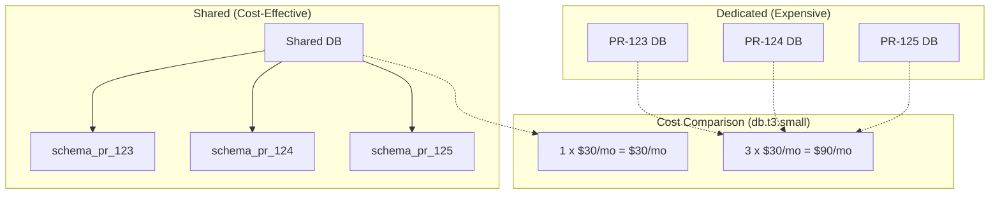

*[PR]: Pull Request
*[TTL]: Time To Live
*[RDS]: Relational Database Service

Preview environments for every PR sound like a developer experience win until someone notices the cloud bill. I've seen this pattern play out multiple times: a team enables preview deployments, developers love the fast feedback loops, and six weeks later finance is asking why infrastructure costs tripled.

The math is straightforward but easy to ignore. A 50-developer team with an average of 40 open PRs, each spawning a full stack with database, Redis, and object storage, is running 40 duplicate environments around the clock. Most sit idle—the PR author pushed code, tested for an hour, then moved on. But the database is still running. The load balancer is still running. The persistent volumes are still allocated.

The culprit isn't preview environments themselves—it's environments that outlive their usefulness. Orphaned databases for branches merged weeks ago. Forgotten load balancers. Abandoned containers accumulating charges while serving exactly zero requests.

This article covers the three strategies that deliver the biggest impact: aggressive TTL enforcement, shared infrastructure with isolation, and hibernation for idle environments. These represent the 20% of effort that delivers 80% of the savings.

## TTL and Cleanup Automation

TTL enforcement is the highest-impact, lowest-effort win. The core principle: every environment needs an expiration date from the moment it's created.

A good TTL policy has three layers. First, a hard maximum lifetime—environments get destroyed regardless of activity after a set period. Second, an idle timeout—environments get hibernated or destroyed after a period of no requests. Third, a grace period where authors get warned before destruction so they can extend if needed.

The defaults should be aggressive. A 72-hour maximum lifetime and an 8-hour idle timeout cover the vast majority of legitimate use cases. PRs that need longer—demo environments, long-running feature branches—can request an extension via a label or approval workflow.

| Policy | Max Lifetime | Idle Timeout | Use Case |
|--------|--------------|--------------|----------|
| Default | 72 hours | 8 hours | Standard PR development |
| Extended | 1 week | 24 hours | Long feature branches |
| Critical | 2 weeks | 48 hours | Demo environments, requires approval |

Table: TTL policy tiers for different use cases.

The scheduled cleanup job is your safety net. A simple CronJob that runs every 15 minutes is sufficient:

```yaml title="cleanup-cronjob.yaml"
apiVersion: batch/v1
kind: CronJob
metadata:
  name: preview-environment-cleanup
spec:
  schedule: "*/15 * * * *"
  concurrencyPolicy: Forbid
  jobTemplate:
    spec:
      template:
        spec:
          containers:
            - name: cleanup
              image: preview-manager:latest
              command: ["/bin/cleanup", "--dry-run=false"]
          restartPolicy: OnFailure
```
Code: Kubernetes CronJob for scheduled cleanup.

The `concurrencyPolicy: Forbid` setting prevents multiple cleanup jobs from running simultaneously. The cleanup logic itself should be idempotent—if it runs twice for the same environment, the second run should be a no-op.

But the fastest cleanup happens in response to PR events. When a developer merges or closes a PR, you want the environment destroyed immediately—not on the next 15-minute cleanup cycle.

Configure your repository to send webhook events to an endpoint that triggers cleanup. The key events are `pull_request.closed` and `pull_request.merged`. When either fires, invoke the same cleanup logic that the scheduled job uses. This creates defense in depth: webhooks provide immediate cleanup for the happy path, and the scheduled job catches anything that slips through—webhook delivery failures, environments created manually, or edge cases where the PR was deleted rather than closed.

<Callout type="info">
Start with TTL enforcement—it catches 80% of waste. A 72-hour default TTL with an 8-hour idle timeout is aggressive enough to matter but permissive enough that developers rarely need extensions.
</Callout>

## Shared Infrastructure with Schema Isolation

The most impactful cost optimization is using shared infrastructure with logical isolation instead of dedicated instances per environment. The math is stark: three dedicated database instances cost three times as much as one shared instance with three schemas.


Figure: Shared vs dedicated resource cost comparison.

For PostgreSQL, schema isolation provides strong separation. Each preview environment gets its own schema with a dedicated role that can only access that schema. Provisioning is fast—no instance startup time, just a `CREATE SCHEMA` command. Cleanup is equally simple: `DROP SCHEMA CASCADE` removes everything in one operation.

The same pattern applies to Redis (use key prefixes like `pr-123:`) and other stateful services. The goal is to share the expensive infrastructure—compute, memory, network endpoints—while maintaining logical isolation between environments.

The tradeoff is blast radius. If your shared preview database goes down, all preview environments are affected. In practice, this is acceptable for preview environments—they're not production, and the cost savings are substantial. Size the shared instance appropriately and monitor it like any other piece of infrastructure, but don't over-engineer redundancy for environments that are explicitly disposable.

<Callout type="success">
Shared databases with schema isolation can reduce database costs by 80%+. Instead of spinning up a new RDS instance per PR, create a schema in a shared instance. You also avoid the 10-minute RDS provisioning delay.
</Callout>

## Hibernation with Wake-on-Access

Deleting an environment when its TTL expires works, but sometimes you want a middle ground: stop incurring compute costs while preserving the ability to quickly resume. Hibernation scales resources to zero (or stops them where supported) without destroying data or configuration.

Hibernation works well for environments that are idle but might be needed again. A developer working on a feature for two weeks doesn't want their environment destroyed every night—they want it to stop costing money overnight and wake up when they need it.

| Trigger | Use Case | Typical Savings |
|---------|----------|-----------------|
| Hibernation timeout (4h idle) | Pause before TTL deletion | 40-60% |
| Schedule (nights/weekends) | Known non-working hours | 50-70% |
| Budget pressure | Team approaching limit | Variable |

Table: Hibernation triggers and their cost impact.

Note the difference from TTL idle timeout: hibernation kicks in earlier (4 hours) to save compute costs while preserving the environment. The 8-hour TTL idle timeout in the previous section destroys the environment entirely. This creates a progression: idle for 4 hours triggers hibernation, idle for 8 hours triggers deletion.

The best hibernation UX is transparent to developers. When someone visits a hibernated environment URL, the system automatically wakes it. Show a loading page while resources start up, then redirect to the now-running environment. KEDA (Kubernetes Event-Driven Autoscaling) provides the scaling primitives—it can scale deployments to zero based on custom metrics (like HTTP request rate), then scale back up when traffic arrives. Custom ingress annotations or a lightweight proxy can intercept the initial request and trigger the wake.

The tradeoff is cold start time. Waking a hibernated environment takes 30-60 seconds for Kubernetes deployments to scale up, longer if databases need to start. For environments with dedicated RDS instances, AWS allows you to stop the instance (saving compute costs) while retaining storage—starting it again takes a few minutes. The inverse also applies: the loading page should be informative about this tradeoff. Explain that the environment was hibernated to save costs, show the PR number, and indicate expected wake time. Auto-refresh every few seconds so developers don't have to manually reload.

<Callout type="success">
Hibernation with wake-on-access gives you the best of both worlds: environments are always "available" from the developer's perspective, but only incur costs when actively used. A 4-hour idle timeout with scheduled nights/weekends hibernation can reduce preview environment costs by 60%+.
</Callout>

## Putting It Together

These three strategies address the biggest cost drivers without requiring complex tooling:

- **TTL enforcement** catches abandoned environments automatically. Start here—it's the highest-impact change with the lowest implementation effort.
- **Shared infrastructure** turns per-environment database costs into marginal schema costs. The savings compound as your PR volume grows.
- **Hibernation** eliminates idle compute costs while preserving developer experience. Wake-on-access makes the cost savings invisible to users.

The goal isn't to minimize preview environment spending—it's to stop paying for environments that deliver no value. An environment that catches a bug before production is worth far more than the compute cost. An environment for an abandoned PR is pure waste. These strategies automate the distinction.

---

**Want the complete playbook?** This article covers the three highest-impact strategies, but there's more to sustainable preview environments. Our comprehensive guide includes orphan detection patterns that catch resources your cleanup jobs miss, automatic resource sizing based on PR file changes, CI/CD integration with GitHub Actions and GitLab CI examples, and cost visibility dashboards that change developer behavior. Download the full guide to implement a complete preview environment cost management system.