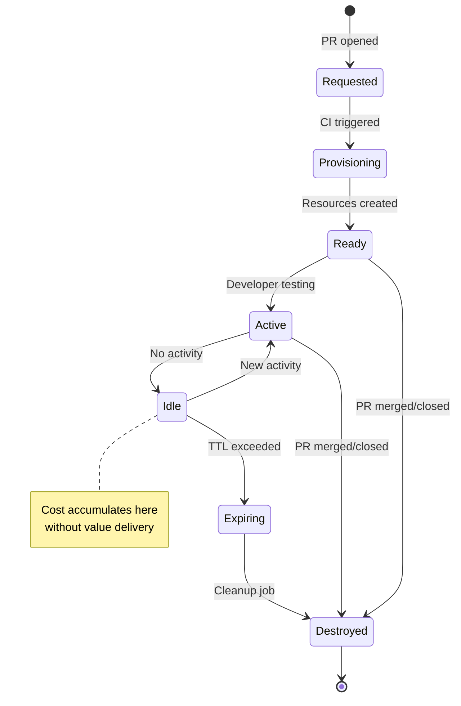
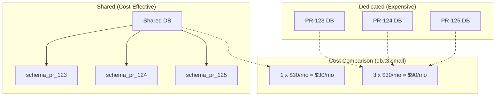
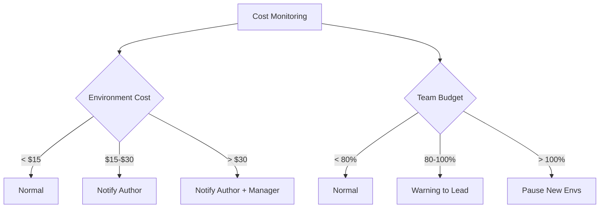

*[PR]: Pull Request
*[TTL]: Time To Live
*[CI]: Continuous Integration
*[CD]: Continuous Deployment
*[K8s]: Kubernetes
*[AWS]: Amazon Web Services
*[GCP]: Google Cloud Platform
*[IaC]: Infrastructure as Code
*[DNS]: Domain Name System

## Introduction

Preview environments for every PR sound like a developer experience win until someone notices the cloud bill. I've seen this pattern play out multiple times: a team enables preview deployments, developers love the fast feedback loops, and six weeks later finance is asking why infrastructure costs tripled.

The math is straightforward but easy to ignore. A 50-developer team with an average of 40 open PRs, each spawning a full stack with database, Redis, and object storage, is running 40 duplicate environments around the clock. Most of those environments are idle most of the time—the PR author pushed code, tested for an hour, then moved on to something else. But the database is still running. The load balancer is still running. The persistent volumes are still allocated.

The first month, nobody notices because the incremental cost of one environment is small. By month three, preview environments are costing more than production. The culprit isn't the environments themselves—it's orphaned databases that outlived their PRs, forgotten load balancers for branches that were merged weeks ago, and abandoned containers accumulating charges while serving exactly zero requests.

This article covers the lifecycle management, cleanup automation, and cost controls that make preview environments sustainable. We'll walk through the environment lifecycle and where costs accumulate, provisioning architecture that favors shared resources, TTL enforcement and cleanup automation, hibernation strategies for idle environments, and the visibility tools that change developer behavior. The goal isn't to spend less on previews—it's to stop spending on previews that deliver no value.

<Callout type="warning">
Preview environments are "free" until they're not. The marginal cost of one environment is negligible; the compound cost of 50 forgotten environments is a budget emergency. Cleanup automation isn't optional—it's the prerequisite.
</Callout>

## The Ephemeral Environment Lifecycle

An ephemeral environment moves through a predictable set of states, and understanding this lifecycle is the foundation for cost control. The critical insight is that cost accumulates in the idle state—after the developer has finished testing but before cleanup runs.

### Environment Lifecycle States


Figure: Ephemeral environment lifecycle states.

Most environments spend the majority of their existence in the idle state. A developer opens a PR, the environment provisions, they test for an hour, then context-switch to something else. The environment sits idle for days until the PR is finally merged or someone remembers to close it. Every hour in that idle state is cost without value.

The lifecycle events that matter most are the destruction triggers. PR merge and close should trigger immediate cleanup—no grace period, no waiting for a scheduled job. TTL expiration and idle timeout provide the safety net for PRs that are abandoned without being formally closed.

### What Gets Provisioned

Not all resources carry equal cost or cleanup risk. Containers are cheap and easy to delete. Databases are expensive and scary to delete. Understanding this matrix helps you design environments that are both functional and cleanable.

| Resource Type | Cost Driver | Cleanup Difficulty | Orphan Risk |
|--------------|-------------|-------------------|-------------|
| Containers/Pods | CPU/Memory hours | Easy (K8s namespace delete) | Low |
| Databases | Instance hours + storage | Medium (data retention) | High |
| Load Balancers | Hourly + data transfer | Easy | Medium |
| DNS Records | Per record (usually free) | Easy | Medium |
| SSL Certificates | Usually free (Let's Encrypt) | Easy | Low |
| Object Storage | Storage + requests | Hard (orphaned objects) | High |
| Message Queues | Messages + throughput | Medium | Medium |
| Secrets/Config | Usually free | Easy | Low |
| Persistent Volumes | Storage GB | Hard (data retention) | High |

Table: Resource types and their cleanup characteristics.

The high-orphan-risk resources—databases, object storage, and persistent volumes—share a common trait: they hold state that might be important. This makes teams hesitant to delete them automatically, which is exactly how they become orphans. The solution isn't to avoid deleting them; it's to design your preview environments so that this data is explicitly disposable.

The cleanup difficulty ratings in the table reflect real operational experience. Object storage and persistent volumes are "hard" because they often contain orphaned objects without clear ownership—you can delete the bucket, but finding all the objects that belong to a specific PR requires consistent naming or tagging. Databases are "medium" because while the deletion command is simple, teams often add retention policies that prevent immediate deletion.

<Callout type="info">
Databases and persistent storage are the biggest cost risks. They're expensive per-hour, accumulate data that makes deletion scary, and are often provisioned with "just in case" retention policies that keep them alive long after the environment is gone.
</Callout>

## Provisioning Architecture

The architecture decisions you make during provisioning determine how expensive environments are to run and how easy they are to clean up. The two biggest levers are resource sizing and the choice between dedicated versus shared infrastructure.

### Environment Templates

A well-designed environment template encodes your cost controls as defaults. Resource limits prevent runaway usage, lifecycle configuration ensures automatic cleanup, and labels enable cost attribution and orphan detection.

```yaml title="preview-environment-template.yaml"
# Kubernetes-style CRD for preview environment provisioning
apiVersion: preview.company.io/v1
kind: PreviewEnvironment
metadata:
  name: "pr-${PR_NUMBER}"
  labels:
    preview/pr-number: "${PR_NUMBER}"
    preview/author: "${PR_AUTHOR}"
    preview/team: "${TEAM_NAME}"
    preview/created-at: "${TIMESTAMP}"
spec:
  source:
    repository: "${REPO_NAME}"
    branch: "${BRANCH_NAME}"
    commit: "${COMMIT_SHA}"

  components:
    app:
      image: "${REGISTRY}/${REPO}:pr-${PR_NUMBER}"
      replicas: 1
      resources:
        requests:
          cpu: "100m"
          memory: "256Mi"
        limits:
          cpu: "500m"
          memory: "512Mi"

    database:
      # Use shared database with schema isolation
      sharedInstance: "preview-shared-postgres"
      schemaPrefix: "pr_${PR_NUMBER}_"

    cache:
      # Use shared Redis with key prefix
      sharedInstance: "preview-shared-redis"
      keyPrefix: "pr-${PR_NUMBER}:"

  lifecycle:
    ttl: "72h"
    idleTimeout: "8h"
    hibernateAfter: "4h"

  access:
    domain: "pr-${PR_NUMBER}.preview.company.io"
```
Code: Preview environment template with shared resources and lifecycle defaults.

The key decisions embedded in this template: small container resource limits (you can always increase them for specific PRs that need more), shared database and cache infrastructure, and aggressive lifecycle defaults. These choices make the default path cheap, while still allowing exceptions when needed.

### Shared vs Dedicated Resources

The most impactful cost optimization is using shared infrastructure with logical isolation instead of dedicated instances per environment. The math is stark: three dedicated database instances cost three times as much as one shared instance with three schemas.


Figure: Shared vs dedicated resource cost comparison.

For PostgreSQL, schema isolation provides strong separation. Each preview environment gets its own schema with a dedicated role that can only access that schema. Provisioning is fast (no instance startup time), and cleanup is a single `DROP SCHEMA CASCADE` command.

The tradeoff is that shared instances create a blast radius. If your shared preview database goes down, all preview environments are affected. In practice, this is acceptable for preview environments—they're not production, and the cost savings are substantial. Size the shared instance appropriately and monitor it like any other piece of infrastructure.

<Callout type="success">
Shared databases with schema isolation can reduce database costs by 80%+. Instead of spinning up a new RDS instance per PR, create a schema in a shared instance. Cleanup is a single DROP SCHEMA command, and you avoid the 10-minute RDS provisioning delay.
</Callout>

## TTL and Cleanup Automation

TTL enforcement is the difference between preview environments that cost a predictable amount and preview environments that become a budget crisis. The core principle: every environment should have a maximum lifetime, and idle environments should be cleaned up aggressively.

### TTL Enforcement Strategies

A good TTL policy has three layers: a hard maximum lifetime (environments get destroyed regardless of activity), an idle timeout (environments get hibernated or destroyed after a period of no requests), and a grace period (authors get warned before destruction so they can extend if needed).

The defaults should be aggressive. A 72-hour maximum lifetime and an 8-hour idle timeout cover the vast majority of legitimate use cases. PRs that need longer—demo environments, long-running feature branches—can request an extension via a label or approval workflow.

| Policy | Max Lifetime | Idle Timeout | Use Case |
|--------|--------------|--------------|----------|
| Default | 72 hours | 8 hours | Standard PR development |
| Extended | 1 week | 24 hours | Long feature branches |
| Critical | 2 weeks | 48 hours | Demo environments, requires approval |

Table: TTL policy tiers.

The enforcement mechanism runs as a scheduled job (every 15 minutes is a reasonable interval) that checks each environment against its policy. When an environment exceeds its idle timeout, hibernate it first—scale compute to zero while preserving data. If it remains idle after hibernation, destroy it completely.

### Cleanup Job Architecture

The cleanup job needs to be both aggressive and resilient. It should run frequently, handle partial failures gracefully, and never leave the system in an inconsistent state.

```yaml title="cleanup-cronjob.yaml"
# Kubernetes CronJob for environment cleanup
apiVersion: batch/v1
kind: CronJob
metadata:
  name: preview-environment-cleanup
spec:
  schedule: "*/15 * * * *"
  concurrencyPolicy: Forbid
  jobTemplate:
    spec:
      template:
        spec:
          serviceAccountName: preview-cleanup-sa
          containers:
            - name: cleanup
              image: preview-manager:latest
              command:
                - /bin/cleanup
                - --dry-run=false
                - --notify=true
          restartPolicy: OnFailure
```
Code: Kubernetes CronJob for scheduled cleanup.

The critical design principle: cleanup must be idempotent and handle partial failures. If deleting a database fails, the job should log the failure, alert, and continue cleaning other resources. The next run will retry the failed deletion. Orphaned resources accumulate when cleanup jobs crash on the first error.

### Event-Driven Cleanup

Scheduled jobs catch TTL violations, but the fastest cleanup happens in response to PR events. When a developer merges or closes a PR, you want the environment destroyed immediately—not on the next 15-minute cleanup cycle.

GitHub (and GitLab, Bitbucket) webhooks deliver these events in real-time. Configure your repository to send `pull_request` events to an endpoint that triggers cleanup. The key events are `pull_request.closed` and `pull_request.merged`. When either fires, invoke the same cleanup logic that the scheduled job uses.

This creates defense in depth: webhooks provide immediate cleanup for the happy path, and the scheduled job catches anything that slips through—webhook delivery failures, environments that were created manually, or edge cases where the PR was deleted rather than closed.

<Callout type="warning">
Cleanup jobs must be idempotent and handle partial failures. If deleting a database fails, the job shouldn't crash—it should log the failure, alert, and continue cleaning other resources. Orphaned resources accumulate when cleanup jobs are fragile.
</Callout>

## Cost Monitoring and Alerting

Cleanup automation prevents runaway costs, but cost visibility changes behavior. When developers see exactly how much their preview environment is costing, they close stale PRs faster.

### Per-Environment Cost Tracking

Every preview environment should have an attributed cost that's visible to the PR author. The calculation doesn't need to be exact—an estimate based on resource types and hourly rates is sufficient to drive the right behavior.

The basic formula: for each resource in the environment, multiply its hourly rate by the hours it has been running. Sum across all resources. This gives you a cost-so-far number and a projected monthly cost if the environment continues running.

| Resource | Hourly Rate (AWS us-east-1) | 24h Cost | 7d Cost |
|----------|----------------------------|----------|---------|
| db.t3.micro | $0.017 | $0.41 | $2.86 |
| db.t3.small | $0.034 | $0.82 | $5.71 |
| Fargate (0.5 vCPU, 1GB) | $0.025 | $0.60 | $4.20 |
| ALB | $0.023 | $0.55 | $3.86 |
| NAT Gateway | $0.045 | $1.08 | $7.56 |

Table: Common resource hourly costs for preview environments.

Post the cost information directly in the PR. A comment that says "Your preview environment has been running for 5 days and has accumulated $23 in costs" is more effective than any policy document.

### Cost Alerts and Budgets

Set thresholds that trigger notifications when environments get expensive. A tiered approach works well: notify the author when an environment exceeds $15, notify the author and their manager at $30, and force a review at $50.


Figure: Cost monitoring and escalation flow.

Team-level budgets add another layer. If a team's total preview environment cost exceeds their budget, you can pause the creation of new environments until they clean up existing ones. This creates peer pressure—no one wants to be the person whose forgotten PR is blocking the team from deploying previews.

<Callout type="info">
Cost visibility changes behavior. When developers see "Your PR environment has cost $47 this week" in their PR, they close stale PRs faster. Make costs visible, attributable, and actionable.
</Callout>

## Handling Orphaned Resources

Despite TTL enforcement and webhook-based cleanup, orphaned resources happen. A webhook fails to deliver. A cleanup job crashes partway through. Someone creates a resource manually for debugging and forgets about it. Orphan detection is your last line of defense against cost accumulation.

### Orphan Detection

An orphaned resource is one that exists but shouldn't—typically because the PR it was associated with has been merged, closed, or deleted. The detection algorithm is straightforward: enumerate all resources with preview environment tags, check whether their associated PRs still exist and are open, and flag anything whose PR is gone.

The detection logic varies by resource type. For Kubernetes resources, query for namespaces or resources with the `preview/pr-number` label, then check each PR's status via the GitHub API. For AWS resources like RDS instances or S3 buckets, use resource tagging to identify preview resources, then perform the same PR status check.

Resources without proper tags are also suspects. If a database has a name that looks like a preview environment (`pr-123-db`) but lacks the standard tags, it's probably an orphan created through a non-standard path. Flag these for manual review—they might be legitimate, but more often they're forgotten experiments.

Run orphan detection weekly at minimum, daily if your preview environment volume is high. The report should include the resource type, age, estimated monthly cost, associated PR (if identifiable), and a recommendation (delete, review, or keep). Start with dry-run mode that reports but doesn't delete, then graduate to automatic cleanup for high-confidence orphans.

### Resource Tagging Strategy

Consistent tagging is what makes orphan detection possible. Every resource created for a preview environment should have a standard set of tags that identify it as a preview resource and link it to its PR.

| Tag | Purpose | Example |
|-----|---------|---------|
| `preview/pr-number` | Links resource to PR | `123` |
| `preview/repository` | Source repo for cross-repo queries | `myorg/myapp` |
| `preview/author` | Cost attribution | `jsmith` |
| `preview/team` | Budget tracking | `platform` |
| `preview/created-at` | TTL calculation | `2024-01-15T10:30:00Z` |
| `preview/managed-by` | Identifies automation-created resources | `preview-controller` |

Table: Standard tags for preview environment resources.

Enforce tagging at the infrastructure layer. In AWS, use Service Control Policies to deny resource creation that lacks required tags. In Terraform, use Sentinel or OPA policies to block untagged resources. The goal is to make it impossible to create a preview resource without the tags that enable cleanup.

<Callout type="success">
Consistent tagging is the foundation of orphan detection. If every preview resource has a `preview/pr-number` tag, you can easily find resources whose PRs no longer exist. Enforce tagging with IaC policies—untagged resources are future orphans.
</Callout>

## CI/CD Integration

The provisioning and cleanup logic I've described needs to be wired into your CI/CD pipeline. The goal is to make preview environments automatic—developers shouldn't need to think about infrastructure when opening a PR.

### Pipeline Structure

A typical preview environment pipeline has two jobs: one for provisioning (runs on PR open, synchronize, and reopen) and one for cleanup (runs on PR close). The provisioning job should be idempotent—if the environment already exists, update it rather than failing. In GitHub Actions, use concurrency groups to ensure that rapid pushes don't create multiple environments for the same PR. GitLab CI offers `resource_group` for the same purpose, and cloud-native pipelines like AWS CodePipeline or Azure Pipelines have their own mechanisms for preventing parallel executions.

```yaml title="preview-environment.yml"
# GitHub Actions workflow for preview environments
name: Preview Environment

on:
  pull_request:
    types: [opened, synchronize, reopened, closed]

concurrency:
  group: preview-${{ github.event.pull_request.number }}
  cancel-in-progress: true

jobs:
  deploy-preview:
    if: github.event.action != 'closed'
    runs-on: ubuntu-latest
    steps:
      - uses: actions/checkout@v4
      - name: Deploy preview environment
        id: deploy
        uses: ./.github/actions/deploy-preview
        with:
          pr-number: ${{ github.event.pull_request.number }}
          author: ${{ github.event.pull_request.user.login }}
          ttl: "72h"
      - name: Comment on PR
        uses: actions/github-script@v7
        with:
          script: |
            github.rest.issues.createComment({
              issue_number: context.issue.number,
              owner: context.repo.owner,
              repo: context.repo.repo,
              body: `Preview: ${{ steps.deploy.outputs.url }}\nExpires: ${{ steps.deploy.outputs.expires_at }}`
            })

  cleanup-preview:
    if: github.event.action == 'closed'
    runs-on: ubuntu-latest
    steps:
      - name: Destroy preview environment
        uses: ./.github/actions/destroy-preview
        with:
          pr-number: ${{ github.event.pull_request.number }}
```
Code: GitHub Actions workflow with concurrency groups to prevent parallel deploys.

The `cancel-in-progress: true` setting is important—if a developer pushes three commits in quick succession, you don't want three parallel deployments racing each other. Cancel the in-flight deploys and run only the latest.

### PR Comments for Visibility

Post environment details back to the PR as a comment. Include the URL, expiration time, and estimated cost. This gives developers immediate feedback and makes costs visible without requiring them to check a dashboard.

The cleanup job should post a summary comment when the environment is destroyed: total cost incurred, how long the environment was active, and how many resources were cleaned up. This closes the feedback loop and reinforces cost awareness.

<Callout type="info">
PR comments transform abstract costs into visible feedback. When a developer sees "This PR environment cost $23.47 over 3 days," they develop intuition for what different workflows cost—and start closing PRs faster.
</Callout>

### Defense in Depth

Don't rely on a single cleanup mechanism. The Event-Driven Cleanup section covered webhook-based lifecycle management, but webhooks can fail—the endpoint might be down, GitHub might have an outage, or a network partition might prevent delivery.

Layer your cleanup mechanisms:

1. **CI/CD pipeline** — Cleanup job triggered by PR close event
2. **Webhooks** — Direct GitHub webhook to your cleanup service
3. **TTL enforcement** — CronJob that deletes expired resources
4. **Orphan detection** — Weekly scan for resources whose PRs no longer exist

Each layer catches what the previous one missed. If a PR is closed through the GitHub UI while CI is down, the webhook still fires. If the webhook endpoint is unreachable, the TTL job catches it within the expiration window. If TTL labels were somehow missing, orphan detection finds it eventually. This redundancy is what keeps costs from silently accumulating.

## Hibernation Strategies

Deleting an environment when its TTL expires is one approach, but sometimes you want a middle ground: stop incurring compute costs while preserving the ability to quickly resume. Hibernation scales resources to zero (or stops them where supported) without destroying data or configuration.

### When Hibernation Makes Sense

Hibernation works well for environments that are idle but might be needed again. A developer working on a feature for two weeks doesn't want their environment destroyed every night—they want it to stop costing money overnight and wake up when they need it. Scheduled hibernation during non-working hours can reduce costs by 50% or more without affecting developer experience.

| Trigger | Use Case | Typical Savings |
|---------|----------|-----------------|
| Idle timeout (4h) | Pause inactive environments | 40-60% |
| Schedule (nights/weekends) | Known non-working hours | 50-70% |
| Budget pressure | Team approaching limit | Variable |

Table: Hibernation triggers and their cost impact.

The tradeoff is cold start time. Waking a hibernated environment takes 30-60 seconds for Kubernetes deployments to scale up, longer if databases need to start. For environments with dedicated RDS instances, AWS allows you to stop the instance (saving compute costs) while retaining storage—starting it again takes a few minutes.

### Wake-on-Access

The best hibernation UX is transparent to developers. When someone visits a hibernated environment URL, the system automatically wakes it. Show a loading page while resources start up, then redirect to the now-running environment.

Implementing wake-on-access requires an ingress controller or proxy that can intercept requests, check environment state, trigger the wake process, and either show a loading page or wait for readiness. KEDA (Kubernetes Event-Driven Autoscaling) can handle the scaling aspect, and custom ingress annotations can trigger the wake.

The loading page should be informative: explain that the environment was hibernated to save costs, show the PR number, and indicate expected wake time. Auto-refresh every few seconds so the developer doesn't need to manually reload.

<Callout type="success">
Hibernation with wake-on-access gives you the best of both worlds: environments are always "available" from the developer's perspective, but only incur costs when actively used. A 4-hour idle timeout with wake-on-access can reduce preview environment costs by 60%+.
</Callout>

## Resource Sizing Strategies

Preview environments don't need production-grade resources. A PR that changes button colors doesn't need 4GB of RAM and a dedicated database. Right-sizing resources to match the actual workload is one of the highest-impact cost optimizations.

### Resource Profiles

Define a set of resource profiles that match different use cases. Each profile specifies compute resources, database strategy, and estimated cost.

| Profile | CPU | Memory | Database | Hourly Cost | Use Case |
|---------|-----|--------|----------|-------------|----------|
| Minimal | 100m | 256Mi | Shared schema | ~$0.05 | Docs, CSS changes |
| Standard | 250m | 512Mi | Shared schema | ~$0.10 | Most feature work |
| Enhanced | 1000m | 2Gi | Dedicated small | ~$0.50 | Performance testing |
| Production-like | 2000m | 4Gi | Dedicated medium | ~$1.50 | Release validation |

Table: Resource profiles with costs and recommended use cases. Hourly costs are estimates for compute resources only (Fargate or equivalent); dedicated database profiles add $0.02-0.05/hour depending on instance size.

The _standard_ profile should be your default—sufficient for typical development workflows without excess. Reserve _enhanced_ and _production-like_ for specific needs, and require approval for them. A developer shouldn't be able to spin up a $1.50/hour environment without someone asking "do you really need that?"

### Automatic Profile Selection

The most effective sizing happens automatically. Analyze what files a PR changes and select an appropriate profile:

- Changes only in `docs/`, `README.md`, or `.md` files → _minimal_
- Changes in frontend code with no backend changes → _minimal_ or _standard_
- Standard backend changes → _standard_
- PR labeled `performance-test` or `load-test` → _enhanced_
- PR labeled `release-candidate` → _production-like_ (with approval)

This automation prevents the common scenario where every environment gets production-like resources "just in case." Most PRs don't need dedicated databases, and automatically selecting _minimal_ for documentation changes can reduce those environments' costs by 95%.

### Dynamic Adjustment

Beyond initial sizing, monitor actual resource usage and adjust. If an environment has been running for 2 hours and CPU utilization has never exceeded 10%, it's over-provisioned. Scale it down. Kubernetes Vertical Pod Autoscaler (VPA) can help here, though be cautious about applying it too aggressively in preview environments where workloads are spiky.

The inverse is also valuable: if an environment is consistently hitting memory limits, scale it up automatically rather than forcing the developer to request a larger profile manually. The goal is to match resources to actual usage, not predicted usage.

<Callout type="info">
Most preview environments are massively over-provisioned. A PR that touches CSS doesn't need 2GB of RAM and a dedicated database. Use automatic profile selection based on files changed to right-size from the start.
</Callout>

## Reporting and Visibility

All the automation in the world doesn't help if no one knows what's happening. Visibility into preview environment costs drives behavior change—developers close stale PRs faster when they see the cost, and teams self-regulate when their spending is visible alongside other teams.

### Cost Dashboard

A cost dashboard should answer three questions at a glance: How much are we spending? Who's spending it? What can we do about it? You can build this in Grafana with data from Prometheus metrics and cloud cost APIs, use your cloud provider's native tools (AWS Cost Explorer with cost allocation tags, GCP Billing Reports, Azure Cost Management), or adopt a dedicated FinOps platform like Kubecost, Infracost, or CloudHealth that specializes in infrastructure cost tracking.

The summary view shows total active environments, current monthly run rate, and trend direction. If costs are increasing week-over-week, that's a signal to investigate—are there more PRs open, or are environments living longer than they should?

Break down costs by team. This isn't about blame; it's about accountability. When a team sees they're spending 3x more than similar-sized teams, they'll investigate. Maybe they have legitimate reasons (more complex testing requirements), or maybe they've accumulated forgotten environments. Either way, visibility prompts the conversation.

Surface the top cost drivers: the longest-running environments, the highest-cost environments, and orphaned resources waiting for cleanup. These are actionable—someone can look at the list and make decisions about what to keep and what to delete.

### Weekly Reports

Send a weekly cost report to engineering managers and the platform team. Include:

- **Summary metrics** — Active environments, weekly cost, projected monthly cost, budget utilization
- **Team breakdown** — Table showing each team's environments, cost, and budget status
- **Longest running** — Environments over 7 days old, prompting review
- **Savings achieved** — How much was saved through hibernation, TTL cleanup, and orphan detection
- **Recommendations** — Auto-generated suggestions like "Consider closing PR #456, running for 12 days with no activity"

The recommendations section is powerful. Don't just report what happened; suggest what to do about it. "Team X is at 95% of budget with 3 days left in the month" is information. "Consider hibernating low-activity environments or closing stale PRs" is actionable.

<Callout type="success">
Weekly cost reports create accountability. When teams see their preview environment costs relative to budget and other teams, they self-regulate. Public visibility is often more effective than hard enforcement.
</Callout>

## Conclusion

Preview environments are worth the investment—catching bugs before production, enabling parallel development, and accelerating code review. But without active cost management, they become a line item that grows unchecked until someone notices and overreacts by restricting access.

The strategies in this article let you have it both ways: environments that are always available when developers need them, costs that stay predictable and reasonable. The key principles:

- **Treat environments as ephemeral** — Aggressive TTLs with automatic cleanup. If it hasn't been used in 72 hours, it probably won't be.
- **Share infrastructure where possible** — Shared databases with schema isolation, shared caches with namespace prefixes. Dedicated resources only when testing actually requires them.
- **Hibernate instead of delete** — Wake-on-access preserves the illusion of always-available environments while eliminating idle compute costs.
- **Tag everything** — Consistent tagging enables orphan detection, cost attribution, and automated cleanup.
- **Make costs visible** — PR comments, dashboards, and weekly reports create accountability without bureaucracy.

The goal isn't to minimize spending—it's to maximize value per dollar. A preview environment that catches a bug before production is worth far more than the compute cost. But an environment for an abandoned PR is pure waste. Automate the distinction, and you'll have preview environments that accelerate development without budget surprises.

<Callout type="info">
Start with TTL enforcement and PR-close cleanup—they'll catch 80% of waste. Add hibernation and right-sizing once the basics are working. Orphan detection is your safety net for everything else. Build iteratively, measure continuously, and adjust based on what you learn about your team's actual usage patterns.
</Callout>
