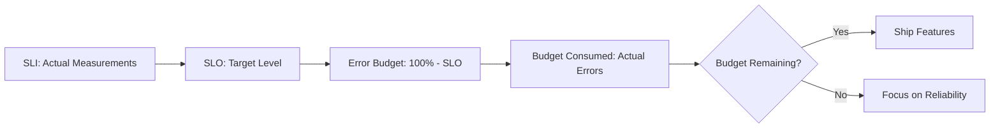
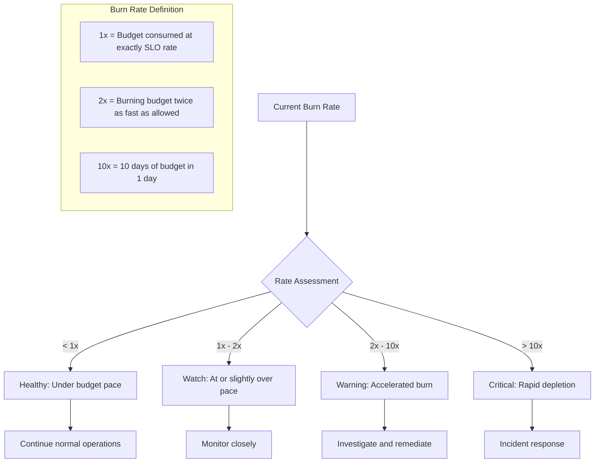
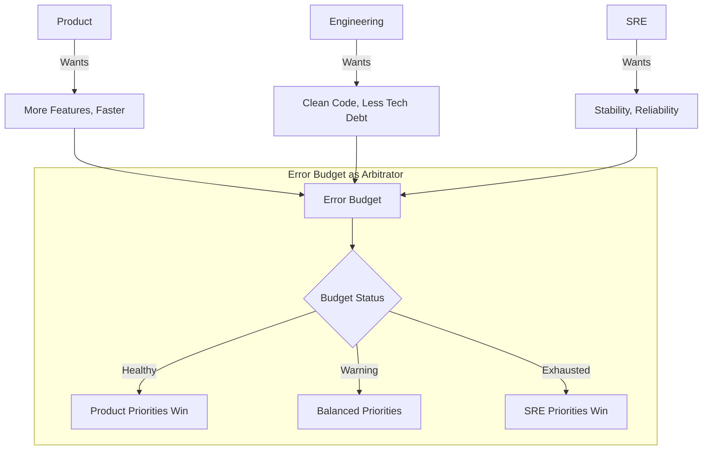

*[SLO]: Service Level Objective
*[SLA]: Service Level Agreement
*[SLI]: Service Level Indicator
*[MTTR]: Mean Time To Recovery
*[MTTF]: Mean Time To Failure
*[P99]: 99th Percentile
*[CI]: Continuous Integration
*[CD]: Continuous Deployment

# Error Budgets: Spending, Saving, and Negotiating

## Introduction

Brief overview of the error budget concept: reliability and velocity are competing priorities, and error budgets provide a quantitative framework for managing this tension. This section frames the core insight—100% reliability is neither achievable nor desirable; the question is how much unreliability is acceptable, and how do we spend that allowance wisely?

_Include the framing problem: an engineering team wants to ship faster, but the SRE team keeps blocking releases for stability concerns. Without a shared framework, these conversations become political. Error budgets transform "should we ship this risky change?" into "do we have budget to spend on this risk?"_

<Callout type="info">
An error budget isn't permission to break things—it's a shared understanding of how much risk the business can tolerate, converted into a spendable resource. When the budget is healthy, spend it on velocity. When it's depleted, invest in reliability.
</Callout>

## From SLOs to Error Budgets

### The SLO Foundation

Explain how error budgets derive from SLOs.

```text
The Math:

SLO:           99.9% availability
Error Budget:  100% - 99.9% = 0.1% allowed downtime

Per Month (30 days = 43,200 minutes):
Budget:        43,200 × 0.001 = 43.2 minutes of downtime

Per Quarter (90 days):
Budget:        129,600 × 0.001 = 129.6 minutes of downtime

This 43 minutes per month is your error budget.
Every outage, every degradation, every error consumes from this budget.
```


Figure: From SLI to error budget decision flow.

### Multi-Dimensional Error Budgets

```yaml title="multi-dimensional-budgets.yaml"
error_budgets:
  availability:
    slo: 99.9%
    budget_per_month: "43.2 minutes"
    measurement: "Successful requests / Total requests"

  latency:
    slo: "95% of requests < 200ms"
    budget_per_month: "5% of requests can exceed 200ms"
    measurement: "Request duration percentiles"

  error_rate:
    slo: "< 0.1% 5xx errors"
    budget_per_month: "0.1% of requests can be 5xx"
    measurement: "5xx responses / Total responses"

  throughput:
    slo: "Support 10,000 RPS"
    budget_per_month: "N/A - binary threshold"
    measurement: "Requests per second at peak"

combined_budget_policy:
  description: "Any SLO breach consumes error budget"
  calculation: |
    Total budget consumed = max(
      availability_consumed,
      latency_consumed,
      error_rate_consumed
    )
  rationale: "Worst-performing dimension drives budget"
```
Code: Multi-dimensional error budget configuration.

| SLO Type | Target | Monthly Budget | Typical Consumers |
|----------|--------|----------------|-------------------|
| Availability | 99.9% | 43 minutes | Outages, deployments, maintenance |
| Latency (P95) | < 200ms | 5% slow requests | Traffic spikes, DB issues, cold starts |
| Error Rate | < 0.1% | 1 in 1000 errors | Bugs, dependency failures, bad data |
| Data Freshness | < 5 min | 5 min staleness | Pipeline delays, replication lag |

Table: Common SLO types and their error budgets.

<Callout type="warning">
Multiple SLOs mean multiple budgets, but they're not independent. A database outage might simultaneously consume availability budget (service down), latency budget (slow queries during recovery), and error rate budget (failed requests). Track them together.
</Callout>

## Budget Calculation and Tracking

### Real-Time Budget Calculation

```typescript title="error-budget-calculator.ts"
interface SLODefinition {
  name: string;
  target: number;  // e.g., 0.999 for 99.9%
  windowDays: number;  // Rolling window
}

interface BudgetStatus {
  slo: string;
  target: number;
  actual: number;
  budgetTotal: number;
  budgetConsumed: number;
  budgetRemaining: number;
  budgetRemainingPercent: number;
  burnRate: number;  // Budget consumed per day
  projectedExhaustion: Date | null;
}

class ErrorBudgetCalculator {
  async calculateBudget(slo: SLODefinition): Promise<BudgetStatus> {
    const windowStart = new Date();
    windowStart.setDate(windowStart.getDate() - slo.windowDays);

    // Get SLI measurements for the window
    const measurements = await this.getSLIMeasurements(slo.name, windowStart);

    // Calculate actual performance
    const totalRequests = measurements.reduce((sum, m) => sum + m.total, 0);
    const goodRequests = measurements.reduce((sum, m) => sum + m.good, 0);
    const actual = goodRequests / totalRequests;

    // Calculate budget
    const budgetTotal = 1 - slo.target;  // e.g., 0.001 for 99.9%
    const budgetConsumed = Math.max(0, slo.target - actual);
    const budgetRemaining = Math.max(0, budgetTotal - budgetConsumed);

    // Calculate burn rate (budget consumed per day)
    const daysElapsed = slo.windowDays;
    const burnRate = budgetConsumed / daysElapsed;

    // Project exhaustion
    let projectedExhaustion: Date | null = null;
    if (burnRate > 0 && budgetRemaining > 0) {
      const daysUntilExhaustion = budgetRemaining / burnRate;
      projectedExhaustion = new Date();
      projectedExhaustion.setDate(projectedExhaustion.getDate() + daysUntilExhaustion);
    }

    return {
      slo: slo.name,
      target: slo.target,
      actual,
      budgetTotal,
      budgetConsumed,
      budgetRemaining,
      budgetRemainingPercent: (budgetRemaining / budgetTotal) * 100,
      burnRate,
      projectedExhaustion,
    };
  }

  async calculateMultiWindowBudget(slo: SLODefinition): Promise<{
    hourly: BudgetStatus;
    daily: BudgetStatus;
    weekly: BudgetStatus;
    monthly: BudgetStatus;
  }> {
    return {
      hourly: await this.calculateBudget({ ...slo, windowDays: 1/24 }),
      daily: await this.calculateBudget({ ...slo, windowDays: 1 }),
      weekly: await this.calculateBudget({ ...slo, windowDays: 7 }),
      monthly: await this.calculateBudget({ ...slo, windowDays: 30 }),
    };
  }
}
```
Code: Error budget calculator with burn rate projection.

### Burn Rate Monitoring


Figure: Burn rate assessment and response.

```yaml title="burn-rate-alerts.yaml"
# Prometheus alerting rules for burn rate
groups:
  - name: error-budget-alerts
    rules:
      # Fast burn: 2% of monthly budget in 1 hour
      - alert: ErrorBudgetFastBurn
        expr: |
          (
            1 - (
              sum(rate(http_requests_total{status=~"2.."}[1h]))
              /
              sum(rate(http_requests_total[1h]))
            )
          ) > (14.4 * 0.001)
        for: 2m
        labels:
          severity: critical
        annotations:
          summary: "Fast error budget burn detected"
          description: |
            Service {{ $labels.service }} is burning error budget at 14.4x rate.
            At this rate, monthly budget will be exhausted in ~2 days.

      # Slow burn: 5% of monthly budget in 6 hours
      - alert: ErrorBudgetSlowBurn
        expr: |
          (
            1 - (
              sum(rate(http_requests_total{status=~"2.."}[6h]))
              /
              sum(rate(http_requests_total[6h]))
            )
          ) > (1 * 0.001)
        for: 30m
        labels:
          severity: warning
        annotations:
          summary: "Slow error budget burn detected"
          description: |
            Service {{ $labels.service }} is burning error budget faster than planned.
            Monthly budget may be exhausted before month end.

      # Budget exhausted
      - alert: ErrorBudgetExhausted
        expr: |
          (
            1 - (
              sum(rate(http_requests_total{status=~"2.."}[30d]))
              /
              sum(rate(http_requests_total[30d]))
            )
          ) > 0.001
        for: 5m
        labels:
          severity: critical
        annotations:
          summary: "Error budget exhausted"
          description: |
            Service {{ $labels.service }} has exhausted its monthly error budget.
            Error budget policy should be activated.
```
Code: Prometheus alerting rules for burn rate monitoring.

<Callout type="info">
Multi-window burn rate alerts catch both acute incidents (fast burn) and chronic degradation (slow burn). A service can slowly leak budget through minor issues that never trigger traditional alerts. Multi-window alerting catches both patterns.
</Callout>

## Error Budget Policies

### Policy Structure

```yaml title="error-budget-policy.yaml"
error_budget_policy:
  service: "payment-api"
  slo: "99.9% availability"
  budget_window: "30 days rolling"

  thresholds:
    healthy:
      range: "> 50% remaining"
      status: "green"
      actions:
        - "Normal development velocity"
        - "Feature work prioritized"
        - "Risky deployments allowed"

    caution:
      range: "25% - 50% remaining"
      status: "yellow"
      actions:
        - "Increased deployment scrutiny"
        - "Reliability work prioritized equally with features"
        - "Post-incident reviews required for any budget consumption"

    warning:
      range: "10% - 25% remaining"
      status: "orange"
      actions:
        - "Feature freeze for high-risk changes"
        - "Reliability work prioritized over features"
        - "All deployments require SRE approval"
        - "Daily budget review meetings"

    critical:
      range: "0% - 10% remaining"
      status: "red"
      actions:
        - "Complete feature freeze"
        - "Only reliability improvements deployed"
        - "Incident commander assigned"
        - "Executive visibility"

    exhausted:
      range: "< 0% (over budget)"
      status: "black"
      actions:
        - "Emergency reliability measures"
        - "No deployments without VP approval"
        - "24/7 monitoring"
        - "Customer communication prepared"

  escalation:
    - level: "caution"
      notify: ["team-lead", "product-manager"]
    - level: "warning"
      notify: ["engineering-manager", "sre-team"]
    - level: "critical"
      notify: ["director", "on-call-exec"]
    - level: "exhausted"
      notify: ["vp-engineering", "cto"]
```
Code: Comprehensive error budget policy.

### Automated Policy Enforcement

```typescript title="policy-enforcer.ts"
interface PolicyDecision {
  allowed: boolean;
  reason: string;
  requiredApprovals: string[];
  conditions: string[];
}

class ErrorBudgetPolicyEnforcer {
  async evaluateDeployment(
    service: string,
    deploymentRisk: 'low' | 'medium' | 'high',
  ): Promise<PolicyDecision> {
    const budget = await this.getBudgetStatus(service);
    const policy = await this.getPolicy(service);

    // Determine current threshold
    const threshold = this.determineThreshold(budget.budgetRemainingPercent);

    switch (threshold) {
      case 'healthy':
        return {
          allowed: true,
          reason: 'Budget healthy, deployment allowed',
          requiredApprovals: [],
          conditions: [],
        };

      case 'caution':
        return {
          allowed: true,
          reason: 'Budget in caution zone',
          requiredApprovals: deploymentRisk === 'high' ? ['tech-lead'] : [],
          conditions: ['Post-deployment monitoring required'],
        };

      case 'warning':
        if (deploymentRisk === 'high') {
          return {
            allowed: false,
            reason: 'High-risk deployments blocked in warning zone',
            requiredApprovals: ['sre-manager', 'engineering-manager'],
            conditions: ['Exception requires documented business justification'],
          };
        }
        return {
          allowed: true,
          reason: 'Low/medium risk deployment allowed with approval',
          requiredApprovals: ['sre-on-call'],
          conditions: [
            'Rollback plan documented',
            'Monitoring dashboard open during deployment',
          ],
        };

      case 'critical':
        if (deploymentRisk !== 'low' || !this.isReliabilityImprovement(deployment)) {
          return {
            allowed: false,
            reason: 'Only reliability improvements allowed in critical zone',
            requiredApprovals: ['vp-engineering'],
            conditions: ['Requires VP exception'],
          };
        }
        return {
          allowed: true,
          reason: 'Reliability improvement allowed',
          requiredApprovals: ['sre-manager'],
          conditions: ['Must improve error budget'],
        };

      case 'exhausted':
        return {
          allowed: false,
          reason: 'Budget exhausted - all deployments blocked',
          requiredApprovals: ['cto'],
          conditions: ['Emergency exception only'],
        };
    }
  }

  async integrateWithCI(pullRequest: PullRequest): Promise<CheckResult> {
    const service = this.detectService(pullRequest);
    const risk = await this.assessDeploymentRisk(pullRequest);
    const decision = await this.evaluateDeployment(service, risk);

    if (decision.allowed) {
      return {
        status: 'success',
        title: 'Error Budget Check Passed',
        summary: decision.reason,
        details: decision.conditions.length > 0
          ? `Conditions: ${decision.conditions.join(', ')}`
          : undefined,
      };
    } else {
      return {
        status: 'failure',
        title: 'Error Budget Check Failed',
        summary: decision.reason,
        details: `Required approvals: ${decision.requiredApprovals.join(', ')}`,
      };
    }
  }
}
```
Code: Automated policy enforcement for deployments.

<Callout type="warning">
Automated enforcement must have escape hatches. Sometimes you need to deploy a critical security patch even with exhausted budget. Build in exception workflows with appropriate approvals and audit trails.
</Callout>

## Spending Budget Wisely

### Intentional Budget Consumption

```yaml title="budget-spending-strategy.yaml"
intentional_spending:
  description: "Strategically spend error budget on velocity"

  good_investments:
    - name: "Feature launches"
      risk: "medium"
      value: "Business growth"
      budget_allocation: "Up to 20% of monthly budget"

    - name: "Infrastructure migrations"
      risk: "high"
      value: "Long-term reliability improvement"
      budget_allocation: "Up to 30% of monthly budget"
      timing: "Schedule when budget is healthy"

    - name: "Performance experiments"
      risk: "low-medium"
      value: "Learning and optimization"
      budget_allocation: "Up to 10% of monthly budget"

    - name: "Dependency upgrades"
      risk: "medium"
      value: "Security, maintainability"
      budget_allocation: "Up to 15% of monthly budget"

  poor_investments:
    - name: "Untested deployments"
      risk: "unknown"
      value: "Velocity (illusory)"
      recommendation: "Never - unpredictable budget impact"

    - name: "Friday deployments"
      risk: "same as weekday"
      value: "Negligible"
      recommendation: "Avoid - limited recovery time if issues"

    - name: "Large batch deployments"
      risk: "high"
      value: "Perceived efficiency"
      recommendation: "Split into smaller deployments"
```
Code: Strategic error budget spending guidelines.

### Risk-Adjusted Deployment Decisions

```typescript title="deployment-risk-calculator.ts"
interface DeploymentRisk {
  score: number;  // 0-100
  category: 'low' | 'medium' | 'high' | 'critical';
  factors: RiskFactor[];
  expectedBudgetImpact: number;  // Percentage of monthly budget
  recommendation: string;
}

interface RiskFactor {
  name: string;
  weight: number;
  value: number;
  description: string;
}

class DeploymentRiskCalculator {
  async calculateRisk(deployment: Deployment): Promise<DeploymentRisk> {
    const factors: RiskFactor[] = [];

    // Lines of code changed
    const locChanged = await this.getLinesChanged(deployment);
    factors.push({
      name: 'code_change_size',
      weight: 0.15,
      value: this.normalizeLocRisk(locChanged),
      description: `${locChanged} lines changed`,
    });

    // Files changed in critical paths
    const criticalFilesChanged = await this.getCriticalFilesChanged(deployment);
    factors.push({
      name: 'critical_path_changes',
      weight: 0.25,
      value: criticalFilesChanged.length > 0 ? 80 : 0,
      description: `${criticalFilesChanged.length} critical files`,
    });

    // Database migrations
    const hasMigrations = await this.hasDatabaseMigrations(deployment);
    factors.push({
      name: 'database_migrations',
      weight: 0.20,
      value: hasMigrations ? 70 : 0,
      description: hasMigrations ? 'Contains migrations' : 'No migrations',
    });

    // New dependencies
    const newDeps = await this.getNewDependencies(deployment);
    factors.push({
      name: 'new_dependencies',
      weight: 0.10,
      value: newDeps.length * 20,
      description: `${newDeps.length} new dependencies`,
    });

    // Test coverage of changed code
    const coverage = await this.getChangedCodeCoverage(deployment);
    factors.push({
      name: 'test_coverage',
      weight: 0.15,
      value: 100 - coverage,  // Lower coverage = higher risk
      description: `${coverage}% coverage`,
    });

    // Author experience with codebase
    const authorExperience = await this.getAuthorExperience(deployment);
    factors.push({
      name: 'author_experience',
      weight: 0.15,
      value: 100 - authorExperience,
      description: `Author experience: ${authorExperience}%`,
    });

    // Calculate weighted score
    const score = factors.reduce(
      (sum, f) => sum + (f.weight * f.value),
      0
    );

    // Determine category
    const category =
      score < 25 ? 'low' :
      score < 50 ? 'medium' :
      score < 75 ? 'high' : 'critical';

    // Estimate budget impact based on historical data
    const expectedBudgetImpact = await this.estimateBudgetImpact(category);

    return {
      score,
      category,
      factors,
      expectedBudgetImpact,
      recommendation: this.getRecommendation(category, expectedBudgetImpact),
    };
  }

  private getRecommendation(
    category: string,
    budgetImpact: number
  ): string {
    const budget = this.getCurrentBudgetRemaining();

    if (budgetImpact > budget) {
      return `Deployment risk (${budgetImpact}%) exceeds remaining budget (${budget}%). Consider splitting or deferring.`;
    }

    if (category === 'critical') {
      return 'Critical risk deployment. Requires SRE approval and active monitoring.';
    }

    if (category === 'high') {
      return 'High risk deployment. Consider deploying during business hours with rollback ready.';
    }

    return 'Deployment within acceptable risk parameters.';
  }
}
```
Code: Risk assessment for deployment decisions.

<Callout type="success">
Healthy error budgets should be spent, not hoarded. If you consistently end the month with 80% budget remaining, your SLO is too conservative. Either tighten the SLO or use that budget to ship more aggressively.
</Callout>

## Negotiating with Stakeholders

### The Product/Engineering/SRE Triangle


Figure: Error budget as the arbitrator between competing priorities.

### Stakeholder Communication Templates

```yaml title="stakeholder-communication.yaml"
budget_status_updates:
  weekly_healthy:
    audience: "Engineering and Product leads"
    template: |
      ## Error Budget Status - Week of {date}

      **Status:** 🟢 Healthy
      **Budget Remaining:** {percent}% ({minutes} minutes)
      **Burn Rate:** {burn_rate}x (sustainable)

      **Recommendation:** Continue feature development.
      Consider scheduling that infrastructure migration we've been deferring.

  weekly_warning:
    audience: "Engineering, Product, and SRE leads"
    template: |
      ## Error Budget Status - Week of {date}

      **Status:** 🟡 Warning
      **Budget Remaining:** {percent}% ({minutes} minutes)
      **Burn Rate:** {burn_rate}x (elevated)
      **Projected Exhaustion:** {exhaustion_date}

      **Recent Consumers:**
      {incident_list}

      **Recommendation:** Prioritize reliability work. High-risk feature
      deployments should be deferred until budget recovers.

  weekly_critical:
    audience: "Directors, Engineering, Product, SRE"
    template: |
      ## ⚠️ Error Budget Critical - Week of {date}

      **Status:** 🔴 Critical
      **Budget Remaining:** {percent}% ({minutes} minutes)
      **Burn Rate:** {burn_rate}x (unsustainable)
      **Time to Exhaustion:** {days_remaining} days

      **Impact:**
      - Feature deployments paused except reliability improvements
      - All changes require SRE approval
      - Daily budget review meetings activated

      **Action Required:**
      - Product: Deprioritize features, support reliability work
      - Engineering: Focus on stability fixes
      - SRE: Intensive monitoring, proactive remediation

negotiation_scenarios:
  product_wants_risky_feature:
    scenario: "Product wants to ship a major feature before quarter end"
    budget_status: "30% remaining (warning zone)"
    talking_points:
      - "Current budget allows ~13 minutes of downtime"
      - "Historical similar deployments consumed 5-10 minutes on average"
      - "If deployment goes well: budget at 20%, still in warning"
      - "If deployment goes poorly: budget potentially exhausted"
      - "Proposal: Split into smaller releases to reduce per-deployment risk"

  engineering_wants_migration:
    scenario: "Engineering wants to do a database migration"
    budget_status: "60% remaining (healthy)"
    talking_points:
      - "Budget is healthy, good time for risky improvements"
      - "Migration typically consumes 10-15% budget"
      - "Defer to early in month to allow recovery time"
      - "Require rehearsal in staging first"
```
Code: Stakeholder communication templates.

### Budget Review Meetings

```yaml title="budget-review-meeting.yaml"
monthly_budget_review:
  attendees:
    required: ["Product Manager", "Engineering Lead", "SRE Lead"]
    optional: ["Director of Engineering", "Individual Contributors"]

  agenda:
    - item: "Budget Status Review"
      duration: "10 min"
      content:
        - "Current budget remaining"
        - "Burn rate trend"
        - "Month-over-month comparison"

    - item: "Incident Review"
      duration: "15 min"
      content:
        - "Budget-consuming incidents"
        - "Root causes and remediations"
        - "Preventability assessment"

    - item: "Upcoming Risks"
      duration: "10 min"
      content:
        - "Planned deployments and their risk"
        - "Maintenance windows"
        - "External dependencies"

    - item: "Priority Negotiation"
      duration: "20 min"
      content:
        - "Feature vs reliability tradeoffs"
        - "SLO appropriateness review"
        - "Policy threshold adjustments"

    - item: "Action Items"
      duration: "5 min"
      content:
        - "Agreed priorities for next month"
        - "Owners and deadlines"

  outputs:
    - "Updated priority list"
    - "Deployment schedule"
    - "Risk acceptance decisions (documented)"
```
Code: Monthly error budget review meeting structure.

<Callout type="info">
Error budgets shift reliability conversations from opinion-based to data-based. Instead of "I think this is too risky," you can say "This deployment has historically consumed 5% of budget, and we only have 8% remaining." Data creates shared understanding.
</Callout>

## Handling Budget Exhaustion

### Exhaustion Response Playbook

```yaml title="budget-exhaustion-playbook.yaml"
budget_exhaustion_response:
  immediate_actions:
    - action: "Declare reliability freeze"
      owner: "SRE Lead"
      timeline: "Immediately"

    - action: "Notify stakeholders"
      owner: "SRE Lead"
      timeline: "Within 1 hour"
      template: "budget_exhausted_notification"

    - action: "Cancel pending non-critical deployments"
      owner: "Release Manager"
      timeline: "Within 2 hours"

    - action: "Assemble reliability task force"
      owner: "Engineering Manager"
      timeline: "Within 4 hours"

  ongoing_actions:
    daily_standup:
      focus: "Reliability improvements only"
      metrics_reviewed:
        - "Error rate trend"
        - "Budget recovery projection"
        - "Reliability work progress"

    deployment_policy:
      allowed:
        - "Security patches (critical)"
        - "Reliability fixes (approved)"
        - "Rollbacks"
      blocked:
        - "New features"
        - "Refactoring"
        - "Non-critical updates"
      exception_process:
        approvers: ["VP Engineering", "CTO"]
        documentation: "Written business justification required"

  recovery_criteria:
    exit_conditions:
      - "Budget recovered to > 10%"
      - "Burn rate normalized to < 1.5x"
      - "Root causes addressed"
    gradual_return:
      - "10% budget: Low-risk deployments resume"
      - "25% budget: Normal deployment cadence"
      - "50% budget: Full velocity restored"
```
Code: Budget exhaustion response playbook.

### Post-Exhaustion Review

```typescript title="post-exhaustion-review.ts"
interface ExhaustionReview {
  period: DateRange;
  budgetConsumed: number;
  incidents: Incident[];
  rootCauses: RootCause[];
  preventionMeasures: PreventionMeasure[];
  sloAdjustmentRecommendation: string | null;
}

async function conductPostExhaustionReview(
  service: string,
  exhaustionPeriod: DateRange,
): Promise<ExhaustionReview> {
  // Gather all incidents during the period
  const incidents = await getIncidents(service, exhaustionPeriod);

  // Categorize root causes
  const rootCauses: RootCause[] = [];
  for (const incident of incidents) {
    const cause = categorizeRootCause(incident);
    const existing = rootCauses.find(rc => rc.category === cause.category);
    if (existing) {
      existing.incidents.push(incident);
      existing.budgetConsumed += incident.budgetConsumed;
    } else {
      rootCauses.push({
        category: cause.category,
        incidents: [incident],
        budgetConsumed: incident.budgetConsumed,
        preventable: cause.preventable,
      });
    }
  }

  // Sort by budget impact
  rootCauses.sort((a, b) => b.budgetConsumed - a.budgetConsumed);

  // Generate prevention measures
  const preventionMeasures: PreventionMeasure[] = rootCauses
    .filter(rc => rc.preventable)
    .map(rc => ({
      rootCause: rc.category,
      measure: getPreventionMeasure(rc.category),
      estimatedBudgetSavings: rc.budgetConsumed * 0.8,  // Assume 80% prevention
      effort: estimateEffort(rc.category),
      priority: rc.budgetConsumed > 10 ? 'high' : 'medium',
    }));

  // Consider SLO adjustment if external factors dominated
  let sloAdjustmentRecommendation: string | null = null;
  const externalCauses = rootCauses.filter(rc => rc.category === 'external_dependency');
  const externalBudget = externalCauses.reduce((sum, rc) => sum + rc.budgetConsumed, 0);

  if (externalBudget > 50) {
    sloAdjustmentRecommendation = `
      ${externalBudget}% of budget consumed by external dependencies outside our control.
      Consider:
      1. Adjusting SLO to account for dependency reliability
      2. Implementing circuit breakers to isolate dependency failures
      3. Negotiating SLAs with critical dependencies
    `;
  }

  return {
    period: exhaustionPeriod,
    budgetConsumed: incidents.reduce((sum, i) => sum + i.budgetConsumed, 0),
    incidents,
    rootCauses,
    preventionMeasures,
    sloAdjustmentRecommendation,
  };
}
```
Code: Post-exhaustion review analysis.

<Callout type="warning">
Budget exhaustion should trigger a blameless review. The goal isn't to punish whoever "spent" the budget—it's to understand why the budget was consumed and whether it was appropriate. Sometimes exhaustion indicates the SLO is too aggressive, not that operations failed.
</Callout>

## Adjusting SLOs Over Time

### When to Adjust

```yaml title="slo-adjustment-criteria.yaml"
adjust_slo_tighter:
  criteria:
    - "Budget consistently >80% remaining at month end"
    - "No budget-consuming incidents for 3+ months"
    - "Customer expectations have increased"
    - "Competitors offer better reliability"
  process:
    - "Propose new target in budget review"
    - "Model budget impact with historical data"
    - "Get stakeholder agreement"
    - "Implement with 1-month trial period"
  example:
    current: "99.9% availability"
    proposed: "99.95% availability"
    budget_change: "43 min → 22 min per month"

adjust_slo_looser:
  criteria:
    - "Budget exhausted multiple months"
    - "Root causes are external/uncontrollable"
    - "Cost of achieving current SLO is prohibitive"
    - "Business priority is velocity over reliability"
  process:
    - "Document reasons for adjustment"
    - "Get executive approval"
    - "Communicate to customers if applicable"
    - "Update monitoring and alerting"
  example:
    current: "99.99% availability"
    proposed: "99.9% availability"
    budget_change: "4.3 min → 43 min per month"
    justification: "External payment provider SLA is only 99.9%"

annual_slo_review:
  frequency: "Annually or after major architecture changes"
  questions:
    - "Does this SLO reflect customer expectations?"
    - "Can we achieve this SLO cost-effectively?"
    - "Is the error budget being used productively?"
    - "Have our dependencies' SLOs changed?"
```
Code: SLO adjustment criteria and process.

### SLO Modeling

```typescript title="slo-modeling.ts"
interface SLOModel {
  target: number;
  historicalPerformance: number;
  budgetPerMonth: number;
  expectedExhaustions: number;  // Per year
  velocityImpact: string;
}

function modelSLOOptions(
  historicalData: PerformanceData[],
): SLOModel[] {
  const currentPerformance = calculatePerformance(historicalData);

  const options: SLOModel[] = [
    { target: 0.999, label: "99.9% (Three nines)" },
    { target: 0.9995, label: "99.95%" },
    { target: 0.9999, label: "99.99% (Four nines)" },
  ].map(option => {
    const budget = 1 - option.target;
    const monthlyBudgetMinutes = budget * 43200;  // Minutes in 30 days

    // Simulate how often we'd exhaust budget
    const monthlyPerformances = groupByMonth(historicalData)
      .map(month => calculatePerformance(month));
    const exhaustions = monthlyPerformances
      .filter(perf => perf < option.target).length;
    const expectedExhaustionsPerYear = (exhaustions / monthlyPerformances.length) * 12;

    // Estimate velocity impact
    let velocityImpact: string;
    if (expectedExhaustionsPerYear > 6) {
      velocityImpact = "Severe - >50% of months in freeze";
    } else if (expectedExhaustionsPerYear > 3) {
      velocityImpact = "Moderate - ~25% of months in freeze";
    } else if (expectedExhaustionsPerYear > 1) {
      velocityImpact = "Low - occasional freezes";
    } else {
      velocityImpact = "Minimal - rare freezes";
    }

    return {
      target: option.target,
      historicalPerformance: currentPerformance,
      budgetPerMonth: monthlyBudgetMinutes,
      expectedExhaustions: expectedExhaustionsPerYear,
      velocityImpact,
    };
  });

  return options;
}

// Example output:
// 99.9%:  43 min/month, ~1 exhaustion/year, Low velocity impact
// 99.95%: 22 min/month, ~4 exhaustions/year, Moderate velocity impact
// 99.99%: 4 min/month, ~8 exhaustions/year, Severe velocity impact
```
Code: SLO modeling to understand tradeoffs.

<Callout type="success">
Model SLO options before committing. Use historical data to predict how often you'd exhaust budget at each target. A 99.99% SLO sounds impressive, but if it means 8 months of feature freezes per year, it might not be the right choice.
</Callout>

## Tooling and Dashboards

### Error Budget Dashboard

```yaml title="dashboard-specification.yaml"
error_budget_dashboard:
  panels:
    - name: "Budget Overview"
      type: "stat"
      metrics:
        - "Budget Remaining %"
        - "Minutes Remaining"
        - "Days Until Exhaustion"
        - "Current Burn Rate"

    - name: "Budget Trend"
      type: "timeseries"
      queries:
        - label: "Budget Remaining"
          query: "100 * (1 - (1 - slo_target) / (1 - sli_actual))"
        - label: "SLO Target"
          query: "100"

    - name: "Burn Rate"
      type: "gauge"
      query: "burn_rate"
      thresholds:
        - value: 1
          color: "green"
        - value: 2
          color: "yellow"
        - value: 5
          color: "orange"
        - value: 10
          color: "red"

    - name: "Budget Consumers"
      type: "table"
      columns:
        - "Incident"
        - "Date"
        - "Duration"
        - "Budget Consumed"
        - "Root Cause"

    - name: "Multi-Window Status"
      type: "stat-row"
      metrics:
        - "1h Budget"
        - "24h Budget"
        - "7d Budget"
        - "30d Budget"

    - name: "Policy Status"
      type: "status"
      query: "budget_policy_status"
      mappings:
        - "healthy: 🟢 Normal Operations"
        - "caution: 🟡 Increased Scrutiny"
        - "warning: 🟠 Feature Freeze"
        - "critical: 🔴 Reliability Only"
        - "exhausted: ⚫ Emergency Mode"
```
Code: Error budget dashboard specification.

```sql title="budget-queries.sql"
-- Grafana/SQL queries for error budget tracking

-- Current SLI (rolling 30 days)
WITH request_stats AS (
  SELECT
    COUNT(*) FILTER (WHERE status_code < 500) AS good_requests,
    COUNT(*) AS total_requests
  FROM requests
  WHERE timestamp > NOW() - INTERVAL '30 days'
)
SELECT
  good_requests::float / total_requests AS sli,
  0.999 AS slo,
  (0.999 - (good_requests::float / total_requests)) / 0.001 AS budget_consumed_pct,
  1 - (0.999 - (good_requests::float / total_requests)) / 0.001 AS budget_remaining_pct
FROM request_stats;

-- Budget trend over time (daily snapshots)
SELECT
  date_trunc('day', timestamp) AS day,
  COUNT(*) FILTER (WHERE status_code < 500)::float / COUNT(*) AS daily_sli,
  SUM(COUNT(*) FILTER (WHERE status_code < 500)) OVER (
    ORDER BY date_trunc('day', timestamp)
    ROWS BETWEEN 29 PRECEDING AND CURRENT ROW
  )::float /
  SUM(COUNT(*)) OVER (
    ORDER BY date_trunc('day', timestamp)
    ROWS BETWEEN 29 PRECEDING AND CURRENT ROW
  ) AS rolling_30d_sli
FROM requests
WHERE timestamp > NOW() - INTERVAL '90 days'
GROUP BY date_trunc('day', timestamp)
ORDER BY day;

-- Budget consumers (incidents)
SELECT
  incident_id,
  started_at,
  ended_at,
  EXTRACT(EPOCH FROM (ended_at - started_at)) / 60 AS duration_minutes,
  (EXTRACT(EPOCH FROM (ended_at - started_at)) / 60) / 43.2 * 100 AS budget_consumed_pct,
  root_cause,
  severity
FROM incidents
WHERE started_at > NOW() - INTERVAL '30 days'
ORDER BY budget_consumed_pct DESC;
```
Code: SQL queries for budget tracking.

<Callout type="info">
Make the error budget dashboard the homepage for your service. When developers see budget status every time they check the service, it becomes part of the culture. Visibility drives behavior.
</Callout>

## Conclusion

Summarize the key principles: error budgets transform reliability from a vague aspiration into a quantitative resource; healthy budgets should be spent on velocity, depleted budgets demand reliability focus; policies should be automated but have escape hatches; and stakeholder communication turns budget data into shared understanding. Emphasize that the goal isn't to save budget—it's to spend it wisely on things that matter.

<Callout type="success">
An error budget spent on a successful product launch is a good investment. An error budget drained by preventable incidents is waste. The framework doesn't make decisions for you—it gives you data to make better decisions together.
</Callout>

---

## Cover Prompt

### Prompt 1: The Reliability Bank Account

Create an image of a bank vault with "Error Budget" on the door. Inside, stacks of time currency (labeled in minutes) sit on shelves. A developer makes a withdrawal (deployment), while a monitor shows the remaining balance. Some shelves are full (healthy), others nearly empty (critical). Style: bank vault aesthetic, time as currency, balance meter, 16:9 aspect ratio.

### Prompt 2: The Velocity-Reliability Scale

Design an image of a large balance scale. On one side, features and velocity (rockets, new product boxes). On the other side, reliability and stability (shields, solid foundations). The fulcrum is labeled "Error Budget." The scale tips based on budget status. Style: classical balance scale, modern tech items, dynamic balance, 16:9 aspect ratio.

### Prompt 3: The Budget Speedometer

Illustrate a car dashboard where the speedometer shows "Deployment Velocity" and the fuel gauge shows "Error Budget Remaining." Warning lights activate as budget depletes. The driver (team) must balance speed with fuel consumption. Style: automotive dashboard, gauges and warning lights, driver perspective, 16:9 aspect ratio.

### Prompt 4: The Three-Way Negotiation

Create an image of three figures at a round table: Product (holding feature list), Engineering (holding architecture diagram), and SRE (holding stability metrics). In the center of the table, a glowing orb represents the error budget, illuminating their discussion. Style: negotiation scene, collaborative meeting, central focus on budget, 16:9 aspect ratio.

### Prompt 5: The Budget Seasons

Design an image showing four quadrants representing budget states like seasons: Spring (healthy, green, growth), Summer (spending, active deployments), Autumn (warning, orange leaves falling), Winter (exhausted, frozen, minimal activity). A wheel in the center shows the current state. Style: four seasons metaphor, lifecycle visualization, nature meets technology, 16:9 aspect ratio.
