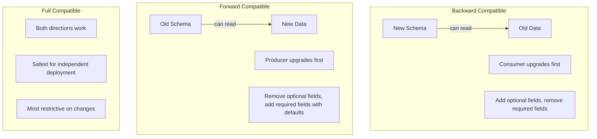
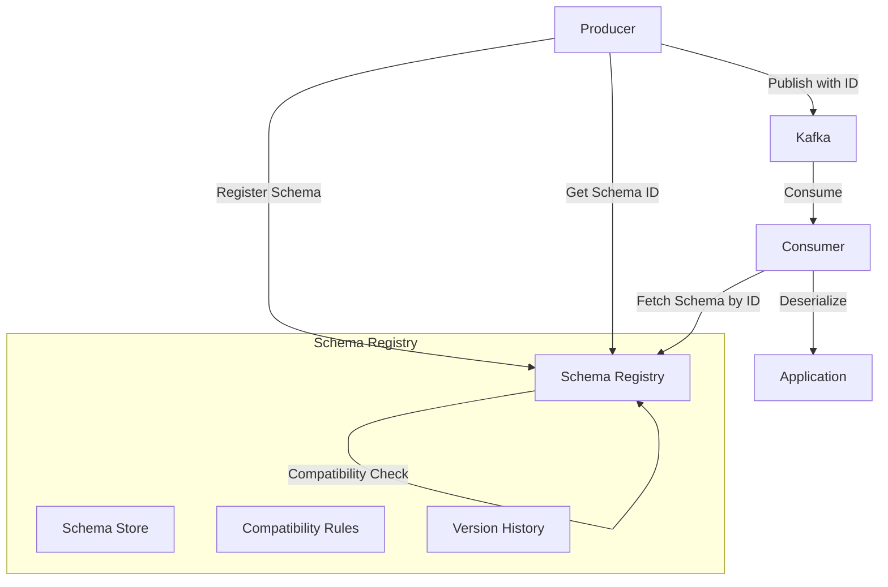
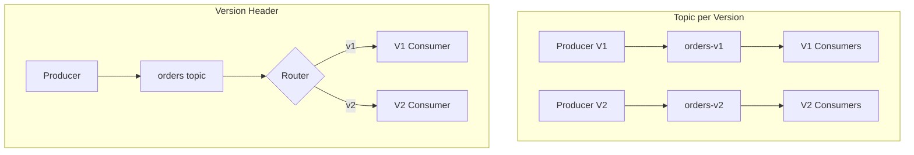
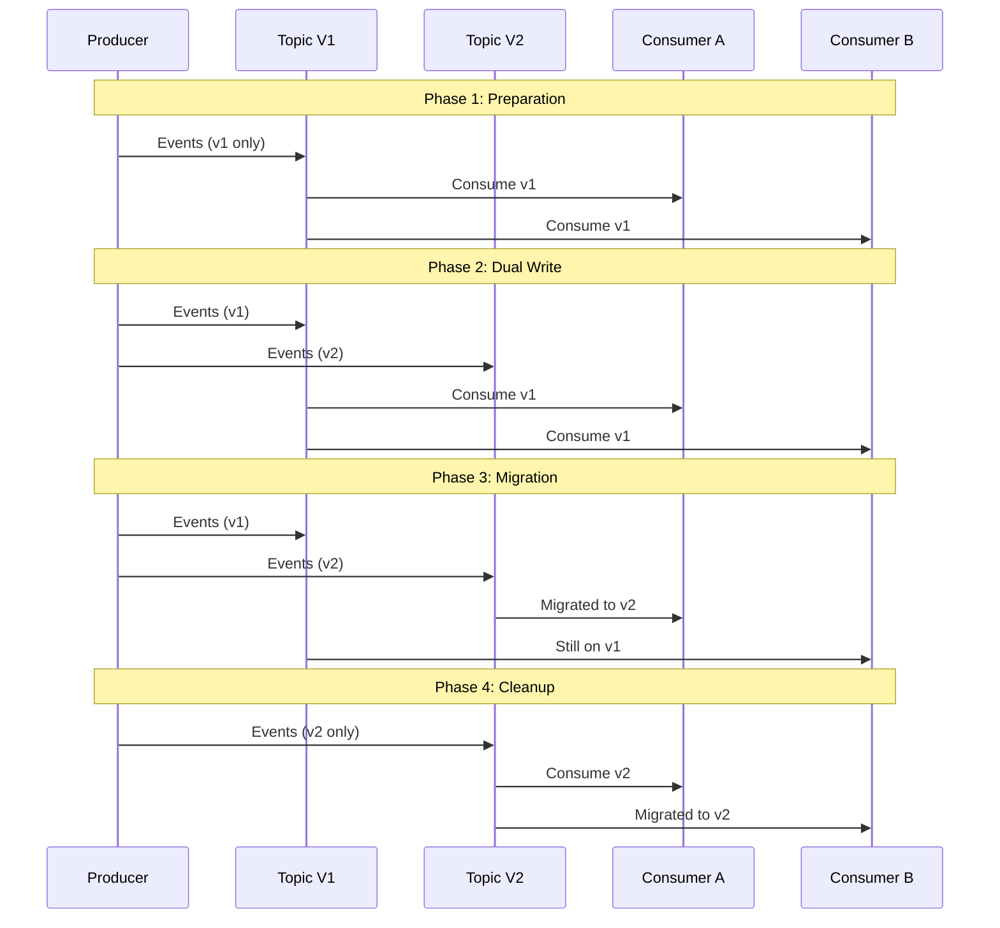

*[JSON]: JavaScript Object Notation
*[AVRO]: Apache Avro serialization format
*[API]: Application Programming Interface
*[CDC]: Change Data Capture
*[DLQ]: Dead Letter Queue
*[SLA]: Service Level Agreement
*[CI]: Continuous Integration
*[CD]: Continuous Deployment

# Event Schema Versioning: Evolving Contracts

## Introduction

Brief overview of the schema evolution challenge: in event-driven systems, schemas are contracts between producers and consumers who deploy independently. A schema change isn't like changing an internal data structure—it's a coordinated evolution that must not break any consumer. This section frames the problem: how do you evolve a schema when you don't control when consumers upgrade?

_Include a real scenario: a team adds a required field to an order event. They deploy the producer with the new field. Within minutes, three downstream consumers start failing—they're using an older schema that doesn't recognize the new field and their deserializers reject the messages. The team has to roll back while hundreds of events pile up in DLQs._

<Callout type="warning">
Schema changes are distributed deployments. When you change a schema, you're implicitly changing code that runs in every consumer—code you don't control and can't deploy. Design for evolution from day one, or face coordination nightmares later.
</Callout>

## Compatibility Types

### Forward, Backward, and Full Compatibility

Explain the fundamental compatibility concepts.


Figure: Compatibility types and their implications.

```yaml title="compatibility-definitions.yaml"
compatibility_types:
  backward:
    definition: "New schema can read data written by old schema"
    upgrade_order: "Consumers upgrade before producers"
    allowed_changes:
      - "Add optional field"
      - "Delete required field (if has default)"
      - "Widen type (int → long)"
    disallowed_changes:
      - "Add required field without default"
      - "Delete optional field"
      - "Narrow type (long → int)"
    use_case: "When you control consumer upgrade timing"

  forward:
    definition: "Old schema can read data written by new schema"
    upgrade_order: "Producers upgrade before consumers"
    allowed_changes:
      - "Delete optional field"
      - "Add required field with default"
    disallowed_changes:
      - "Add field without default"
      - "Delete required field"
    use_case: "When consumers upgrade independently"

  full:
    definition: "Both backward and forward compatible"
    upgrade_order: "Any order works"
    allowed_changes:
      - "Add optional field with default"
      - "Delete optional field with default"
    disallowed_changes:
      - "Add required field"
      - "Delete required field"
      - "Change field types"
    use_case: "Independent microservices, public APIs"

  none:
    definition: "No compatibility guaranteed"
    upgrade_order: "Coordinated deployment required"
    use_case: "Breaking changes, major versions"
```
Code: Compatibility type definitions and constraints.

| Change Type | Backward | Forward | Full |
|-------------|----------|---------|------|
| Add optional field with default | ✅ | ✅ | ✅ |
| Add optional field without default | ✅ | ❌ | ❌ |
| Add required field with default | ❌ | ✅ | ❌ |
| Add required field without default | ❌ | ❌ | ❌ |
| Remove optional field | ❌ | ✅ | ❌ |
| Remove required field | ✅* | ❌ | ❌ |
| Rename field | ❌ | ❌ | ❌ |
| Change field type | ❌** | ❌** | ❌ |

Table: Schema changes and compatibility impact. *With default. **Some widening allowed.

<Callout type="info">
Full compatibility is the safest choice for event schemas because producers and consumers deploy independently. It's also the most restrictive—you can only add optional fields with defaults. Accept this constraint or accept coordination overhead.
</Callout>

## Schema Formats Comparison

### Avro, Protobuf, and JSON Schema

```yaml title="schema-format-comparison.yaml"
schema_formats:
  avro:
    compatibility_support: "Excellent"
    schema_registry: "Native (Confluent)"
    evolution_features:
      - "Field defaults required for compatibility"
      - "Aliases for field renames"
      - "Union types for optionality"
      - "Schema resolution at read time"
    binary_format: true
    schema_in_message: "Referenced by ID"
    strengths:
      - "Best-in-class evolution support"
      - "Compact binary format"
      - "Strong typing"
    weaknesses:
      - "Requires schema registry"
      - "Less human-readable"
      - "Learning curve"

  protobuf:
    compatibility_support: "Good"
    schema_registry: "Confluent, buf.build"
    evolution_features:
      - "Field numbers for identity"
      - "Optional fields by default (proto3)"
      - "Reserved fields for deprecation"
      - "oneof for unions"
    binary_format: true
    schema_in_message: "Not included (must know type)"
    strengths:
      - "Excellent tooling (buf)"
      - "gRPC integration"
      - "Wide language support"
    weaknesses:
      - "Schema not self-describing"
      - "Compatibility rules less explicit"

  json_schema:
    compatibility_support: "Manual"
    schema_registry: "Various (Apicurio, custom)"
    evolution_features:
      - "additionalProperties for forward compat"
      - "No native defaults handling"
      - "Loose typing"
    binary_format: false
    schema_in_message: "Inline or referenced"
    strengths:
      - "Human-readable"
      - "No special tooling needed"
      - "Familiar format"
    weaknesses:
      - "No native compatibility checking"
      - "Larger message size"
      - "Runtime validation needed"
```
Code: Schema format comparison for event evolution.

### Avro Schema Evolution Example

```json title="order-event-v1.avsc"
{
  "type": "record",
  "name": "OrderEvent",
  "namespace": "com.company.orders",
  "fields": [
    {
      "name": "orderId",
      "type": "string"
    },
    {
      "name": "customerId",
      "type": "string"
    },
    {
      "name": "totalAmount",
      "type": "double"
    },
    {
      "name": "createdAt",
      "type": {
        "type": "long",
        "logicalType": "timestamp-millis"
      }
    }
  ]
}
```
Code: Version 1 Avro schema.

```json title="order-event-v2.avsc"
{
  "type": "record",
  "name": "OrderEvent",
  "namespace": "com.company.orders",
  "fields": [
    {
      "name": "orderId",
      "type": "string"
    },
    {
      "name": "customerId",
      "type": "string"
    },
    {
      "name": "totalAmount",
      "type": "double"
    },
    {
      "name": "createdAt",
      "type": {
        "type": "long",
        "logicalType": "timestamp-millis"
      }
    },
    {
      "name": "currency",
      "type": "string",
      "default": "USD"
    },
    {
      "name": "shippingAddress",
      "type": ["null", "string"],
      "default": null
    }
  ]
}
```
Code: Version 2 with backward and forward compatible additions.

```json title="order-event-v3-breaking.avsc"
{
  "type": "record",
  "name": "OrderEvent",
  "namespace": "com.company.orders",
  "fields": [
    {
      "name": "orderId",
      "type": "string"
    },
    {
      "name": "customerId",
      "type": "string"
    },
    {
      "name": "amount",
      "type": {
        "type": "record",
        "name": "Money",
        "fields": [
          {"name": "value", "type": "long"},
          {"name": "currency", "type": "string"}
        ]
      }
    },
    {
      "name": "createdAt",
      "type": {
        "type": "long",
        "logicalType": "timestamp-millis"
      }
    }
  ]
}
```
Code: Version 3 with breaking change (totalAmount → amount object). Requires major version bump.

<Callout type="warning">
Renaming fields or changing types are breaking changes in most schema formats. Avro supports aliases for renames, but the original name must be kept as an alias. Protobuf uses field numbers, so renames are safe but type changes are not.
</Callout>

## Schema Registry Patterns

### Centralized Schema Management


Figure: Schema registry in the event pipeline.

```typescript title="schema-registry-client.ts"
import { SchemaRegistry, SchemaType } from '@kafkajs/confluent-schema-registry';

const registry = new SchemaRegistry({
  host: 'http://schema-registry:8081',
});

// Producer: Register schema and get ID
async function registerSchema(subject: string, schema: object): Promise<number> {
  const { id } = await registry.register({
    type: SchemaType.AVRO,
    schema: JSON.stringify(schema),
  }, { subject });

  return id;
}

// Producer: Encode message with schema ID
async function encodeMessage<T>(
  subject: string,
  data: T,
): Promise<Buffer> {
  const schemaId = await registry.getLatestSchemaId(subject);
  return registry.encode(schemaId, data);
}

// Consumer: Decode message (schema ID embedded in message)
async function decodeMessage<T>(buffer: Buffer): Promise<T> {
  return registry.decode(buffer);
}

// Check compatibility before registering new version
async function checkCompatibility(
  subject: string,
  newSchema: object,
): Promise<{ compatible: boolean; errors?: string[] }> {
  try {
    const result = await registry.testCompatibility({
      type: SchemaType.AVRO,
      schema: JSON.stringify(newSchema),
    }, { subject });

    return { compatible: result.is_compatible };
  } catch (error) {
    return {
      compatible: false,
      errors: [error.message],
    };
  }
}
```
Code: Schema registry client operations.

### Subject Naming Strategies

```yaml title="subject-naming-strategies.yaml"
naming_strategies:
  topic_name:
    pattern: "{topic}-value"
    example: "orders-value"
    use_case: "All events on topic share one schema"
    pros:
      - "Simple"
      - "One schema per topic"
    cons:
      - "Can't have multiple event types per topic"

  record_name:
    pattern: "{namespace}.{record}"
    example: "com.company.orders.OrderCreated"
    use_case: "Multiple event types per topic"
    pros:
      - "Event types can share topics"
      - "Schema follows event, not topic"
    cons:
      - "More complex routing"

  topic_record_name:
    pattern: "{topic}-{namespace}.{record}"
    example: "orders-com.company.orders.OrderCreated"
    use_case: "Same event type on different topics needs different schemas"
    pros:
      - "Maximum flexibility"
    cons:
      - "Most complex"
      - "Potential schema duplication"

recommendation:
  default: "topic_name"
  multi_event_topics: "record_name"
  note: "Consistency is more important than the specific choice"
```
Code: Schema registry subject naming strategies.

<Callout type="success">
The schema registry is your compatibility gatekeeper. Configure it to enforce full compatibility by default, and require explicit override for breaking changes. This catches compatibility violations before they reach production.
</Callout>

## Evolution Strategies

### Adding Fields Safely

```typescript title="safe-field-addition.ts"
// Safe patterns for adding fields

// ✅ SAFE: Optional field with default
interface OrderEventV2 {
  orderId: string;
  customerId: string;
  totalAmount: number;
  // New field - optional with default
  currency?: string;  // Defaults to "USD" in schema
}

// ✅ SAFE: Nullable field
interface OrderEventV3 {
  orderId: string;
  customerId: string;
  totalAmount: number;
  currency?: string;
  // New nullable field
  discountCode: string | null;  // Default null
}

// ❌ UNSAFE: Required field without default
interface OrderEventBad {
  orderId: string;
  customerId: string;
  totalAmount: number;
  // This breaks forward compatibility!
  requiredNewField: string;  // Old consumers can't read new messages
}

// Avro schema for safe addition
const safeAddition = {
  type: "record",
  name: "OrderEvent",
  fields: [
    // ... existing fields ...
    {
      name: "currency",
      type: "string",
      default: "USD",  // ← Default makes it backward compatible
    },
    {
      name: "discountCode",
      type: ["null", "string"],  // ← Union with null first = nullable
      default: null,
    },
  ],
};
```
Code: Safe patterns for adding fields.

### Removing Fields Safely

```yaml title="safe-field-removal.yaml"
field_removal_process:
  step_1_deprecate:
    description: "Mark field as deprecated but keep it"
    schema_change: |
      {
        "name": "legacyField",
        "type": "string",
        "default": "",
        "doc": "DEPRECATED: Use newField instead. Will be removed in v4."
      }
    producer_change: "Stop populating the field (send default)"
    consumer_change: "Migrate to use newField"
    duration: "2-4 weeks depending on consumer count"

  step_2_verify:
    description: "Confirm no consumers depend on the field"
    checks:
      - "Query consumer logs for field access"
      - "Check consumer code for field references"
      - "Validate with consumer team owners"

  step_3_remove:
    description: "Remove field from schema"
    compatibility: "This is only forward compatible"
    schema_change: "Remove field entirely"
    consumer_requirement: "All consumers must have upgraded"

  protobuf_pattern:
    description: "Use reserved to prevent field number reuse"
    schema: |
      message OrderEvent {
        string order_id = 1;
        string customer_id = 2;
        // reserved 3;  // was legacy_field
        reserved "legacy_field";
        string new_field = 4;
      }
```
Code: Safe field removal process.

### Renaming Fields

```json title="field-rename-avro.avsc"
{
  "type": "record",
  "name": "OrderEvent",
  "fields": [
    {
      "name": "customerId",
      "type": "string",
      "aliases": ["customer_id", "CustomerID"]
    }
  ]
}
```
Code: Avro aliases for field renames.

```typescript title="field-rename-strategy.ts"
// Strategy: Parallel fields during transition

// V1: Original field name
interface OrderEventV1 {
  customer_id: string;
}

// V2: Both fields, new is canonical
interface OrderEventV2 {
  customer_id?: string;  // Deprecated, for backward compat
  customerId: string;    // New canonical name
}

// Producer V2: Write both
function produceV2(order: Order): OrderEventV2 {
  return {
    customerId: order.customerId,
    customer_id: order.customerId,  // Dual-write for old consumers
  };
}

// Consumer V2: Read new, fall back to old
function consumeV2(event: OrderEventV2): string {
  return event.customerId ?? event.customer_id!;
}

// V3 (after all consumers upgraded): Remove old field
interface OrderEventV3 {
  customerId: string;
}
```
Code: Parallel fields strategy for renames.

<Callout type="info">
Field renames are surprisingly hard. You can't simply rename—you need a migration period where both names exist. Use Avro aliases when possible, or the parallel-fields pattern when not. Plan for at least one release cycle of overlap.
</Callout>

## Versioning Strategies

### Semantic Versioning for Schemas

```yaml title="schema-semantic-versioning.yaml"
versioning_policy:
  major:
    trigger: "Breaking changes"
    examples:
      - "Remove required field"
      - "Change field type incompatibly"
      - "Rename field without alias"
    process:
      - "New subject in registry (orders-v2)"
      - "New topic (orders-v2) or header-based routing"
      - "Migration plan for consumers"
      - "Sunset plan for old version"

  minor:
    trigger: "Backward compatible additions"
    examples:
      - "Add optional field with default"
      - "Add nullable field"
    process:
      - "Register new version in same subject"
      - "No consumer changes required"
      - "Producers can adopt immediately"

  patch:
    trigger: "Non-functional changes"
    examples:
      - "Documentation updates"
      - "Field description changes"
    process:
      - "May not need registry update"
      - "No code changes"

version_in_schema:
  recommendation: "Include version in schema metadata"
  avro_example: |
    {
      "type": "record",
      "name": "OrderEvent",
      "doc": "version: 2.3.0",
      "fields": [...]
    }
  protobuf_example: |
    // Schema version: 2.3.0
    message OrderEvent {
      option (schema_version) = "2.3.0";
      ...
    }
```
Code: Semantic versioning for event schemas.

### Topic-per-Version vs Version Header


Figure: Topic-per-version vs header-based routing.

```typescript title="version-routing.ts"
// Header-based version routing

interface VersionedMessage<T> {
  headers: {
    'schema-version': string;
    'schema-id': number;
  };
  value: T;
}

// Producer: Include version in headers
async function produceVersioned<T>(
  topic: string,
  version: string,
  value: T,
): Promise<void> {
  const schemaId = await registry.getSchemaId(`${topic}-v${version}`);
  const encoded = await registry.encode(schemaId, value);

  await producer.send({
    topic,
    messages: [{
      value: encoded,
      headers: {
        'schema-version': version,
        'schema-id': schemaId.toString(),
      },
    }],
  });
}

// Consumer: Route by version
class VersionedConsumer {
  private handlers: Map<string, (msg: unknown) => Promise<void>> = new Map();

  registerHandler(version: string, handler: (msg: unknown) => Promise<void>) {
    this.handlers.set(version, handler);
  }

  async handleMessage(message: KafkaMessage): Promise<void> {
    const version = message.headers['schema-version']?.toString();

    if (!version) {
      throw new Error('Missing schema-version header');
    }

    const handler = this.handlers.get(version);
    if (!handler) {
      // Option 1: Fail
      throw new Error(`No handler for schema version ${version}`);

      // Option 2: Use latest compatible handler
      // const latestHandler = this.findLatestCompatibleHandler(version);

      // Option 3: Skip and log
      // console.warn(`Skipping message with unknown version ${version}`);
      // return;
    }

    const decoded = await registry.decode(message.value);
    await handler(decoded);
  }
}
```
Code: Header-based version routing implementation.

<Callout type="warning">
Topic-per-version is simpler for consumers but creates operational overhead (more topics to manage). Header-based routing keeps events together but requires consumer logic to handle multiple versions. Choose based on your consumer complexity and operational maturity.
</Callout>

## Breaking Changes

### When Breaking Changes Are Unavoidable

```yaml title="breaking-change-scenarios.yaml"
unavoidable_breaking_changes:
  type_change:
    scenario: "Price stored as float, need decimal precision"
    old: "totalAmount: double"
    new: "totalAmount: { value: long, scale: int }"
    why_breaking: "Can't convert double to record"

  semantic_change:
    scenario: "timestamp was local time, need UTC"
    old: "createdAt: timestamp (local)"
    new: "createdAt: timestamp (UTC)"
    why_breaking: "Same type, different meaning"

  field_split:
    scenario: "Single address field → structured address"
    old: "address: string"
    new: "address: { street, city, state, zip }"
    why_breaking: "Can't parse string to structure"

  field_merge:
    scenario: "firstName + lastName → fullName"
    old: "firstName: string, lastName: string"
    new: "fullName: string"
    why_breaking: "Lossy transformation"
```
Code: Scenarios requiring breaking changes.

### Breaking Change Migration Playbook

```yaml title="breaking-change-playbook.yaml"
breaking_change_migration:
  phase_1_prepare:
    duration: "1-2 weeks"
    tasks:
      - "Design new schema (v2)"
      - "Create compatibility test suite"
      - "Identify all consumers"
      - "Negotiate migration timeline with consumer teams"
      - "Create new topic/subject for v2"
      - "Build and test v2 consumers"

  phase_2_dual_write:
    duration: "2-4 weeks"
    tasks:
      - "Deploy producer with dual-write (v1 and v2)"
      - "Monitor both topics for data parity"
      - "Consumer teams begin migration to v2"
      - "Track consumer migration progress"
    producer_code: |
      async function produceOrder(order: Order) {
        // Write to both versions
        await Promise.all([
          produceV1(order),
          produceV2(order),
        ]);
      }

  phase_3_consumer_migration:
    duration: "2-8 weeks depending on consumer count"
    tasks:
      - "Each consumer team migrates at their pace"
      - "Consumers switch from v1 topic to v2"
      - "Track v1 consumer count → 0"
      - "Set deadline for stragglers"

  phase_4_cleanup:
    duration: "1 week"
    tasks:
      - "Verify no v1 consumers remain"
      - "Stop dual-write (v1 production)"
      - "Keep v1 topic for grace period (replay needs)"
      - "Delete v1 topic after retention period"
      - "Archive v1 schema"
```
Code: Breaking change migration playbook.


Figure: Breaking change migration sequence.

<Callout type="success">
Dual-write is expensive (double the events) but safe. It gives consumers time to migrate without deadline pressure. The alternative—coordinated big-bang cutover—rarely works when you have more than a handful of consumers.
</Callout>

## Consumer Compatibility Patterns

### Tolerant Reader Pattern

```typescript title="tolerant-reader.ts"
// The Tolerant Reader: Ignore what you don't understand

interface OrderEventMinimal {
  // Only the fields this consumer actually needs
  orderId: string;
  customerId: string;
  totalAmount: number;
}

class TolerantOrderConsumer {
  // Parse only needed fields, ignore extras
  parseEvent(raw: Record<string, unknown>): OrderEventMinimal {
    // Validate required fields exist
    if (!raw.orderId || !raw.customerId || !raw.totalAmount) {
      throw new Error('Missing required fields');
    }

    return {
      orderId: String(raw.orderId),
      customerId: String(raw.customerId),
      totalAmount: Number(raw.totalAmount),
    };
    // All other fields are ignored - forward compatible!
  }

  async processEvent(event: OrderEventMinimal): Promise<void> {
    // Business logic using only what we need
    await this.orderService.process({
      id: event.orderId,
      customer: event.customerId,
      amount: event.totalAmount,
    });
  }
}

// JSON Schema for tolerant reader
const tolerantSchema = {
  type: "object",
  required: ["orderId", "customerId", "totalAmount"],
  properties: {
    orderId: { type: "string" },
    customerId: { type: "string" },
    totalAmount: { type: "number" },
  },
  additionalProperties: true,  // ← Key: Allow unknown fields
};
```
Code: Tolerant reader pattern implementation.

### Version-Aware Consumer

```typescript title="version-aware-consumer.ts"
// Consumer that handles multiple schema versions

type OrderEventV1 = {
  version: 1;
  orderId: string;
  customer_id: string;  // Old naming
  amount: number;
};

type OrderEventV2 = {
  version: 2;
  orderId: string;
  customerId: string;   // New naming
  amount: number;
  currency: string;
};

type OrderEventV3 = {
  version: 3;
  orderId: string;
  customerId: string;
  amount: {
    value: number;
    currency: string;
  };
};

type OrderEvent = OrderEventV1 | OrderEventV2 | OrderEventV3;

// Normalize to internal format
interface InternalOrder {
  orderId: string;
  customerId: string;
  amountCents: number;
  currency: string;
}

function normalizeEvent(event: OrderEvent): InternalOrder {
  switch (event.version) {
    case 1:
      return {
        orderId: event.orderId,
        customerId: event.customer_id,
        amountCents: Math.round(event.amount * 100),
        currency: 'USD',  // Default for v1
      };

    case 2:
      return {
        orderId: event.orderId,
        customerId: event.customerId,
        amountCents: Math.round(event.amount * 100),
        currency: event.currency,
      };

    case 3:
      return {
        orderId: event.orderId,
        customerId: event.customerId,
        amountCents: event.amount.value,
        currency: event.amount.currency,
      };

    default:
      // Future versions - attempt best-effort parsing
      const unknown = event as Record<string, unknown>;
      return {
        orderId: String(unknown.orderId),
        customerId: String(unknown.customerId ?? unknown.customer_id),
        amountCents: extractAmount(unknown),
        currency: extractCurrency(unknown),
      };
  }
}
```
Code: Version-aware consumer with normalization.

<Callout type="info">
The tolerant reader pattern makes consumers forward-compatible by design. Only parse fields you need, allow extra fields, and you'll survive most schema additions without code changes. It's defensive programming for distributed systems.
</Callout>

## CI/CD Integration

### Schema Compatibility in CI

```yaml title="schema-ci-workflow.yaml"
# .github/workflows/schema-check.yaml
name: Schema Compatibility Check

on:
  pull_request:
    paths:
      - 'schemas/**'

jobs:
  compatibility-check:
    runs-on: ubuntu-latest
    steps:
      - uses: actions/checkout@v4
        with:
          fetch-depth: 0  # Need history for comparison

      - name: Get changed schemas
        id: changes
        run: |
          echo "schemas=$(git diff --name-only origin/main... -- schemas/ | tr '\n' ' ')" >> $GITHUB_OUTPUT

      - name: Check compatibility
        run: |
          for schema in ${{ steps.changes.outputs.schemas }}; do
            # Extract subject name from path
            subject=$(basename $(dirname $schema))

            # Check compatibility with registry
            curl -X POST \
              -H "Content-Type: application/vnd.schemaregistry.v1+json" \
              -d @$schema \
              "$SCHEMA_REGISTRY_URL/compatibility/subjects/$subject/versions/latest" \
              | jq -e '.is_compatible == true' \
              || (echo "❌ Schema $schema is not compatible!" && exit 1)
          done

      - name: Comment on PR
        if: failure()
        uses: actions/github-script@v7
        with:
          script: |
            github.rest.issues.createComment({
              issue_number: context.issue.number,
              owner: context.repo.owner,
              repo: context.repo.repo,
              body: `## ❌ Schema Compatibility Check Failed

              The schema changes in this PR are not compatible with the current version.

              **Compatibility mode:** FULL

              **Options:**
              1. Modify schema to be compatible (add optional fields with defaults)
              2. Create a new major version (requires migration plan)
              3. Request compatibility mode override (requires approval)
              `
            })
```
Code: GitHub Actions schema compatibility check.

### Buf for Protobuf Schemas

```yaml title="buf-config.yaml"
# buf.yaml
version: v1
name: buf.build/company/events
deps:
  - buf.build/googleapis/googleapis
breaking:
  use:
    - FILE
lint:
  use:
    - DEFAULT
  except:
    - PACKAGE_VERSION_SUFFIX

---
# buf.gen.yaml
version: v1
plugins:
  - plugin: buf.build/protocolbuffers/go
    out: gen/go
  - plugin: buf.build/grpc/go
    out: gen/go

---
# CI check
# buf breaking --against 'https://github.com/company/schemas.git#branch=main'
```
Code: Buf configuration for Protobuf schema management.

```bash title="buf-breaking-check.sh"
#!/bin/bash
# Check for breaking changes against main branch

# Run buf breaking check
buf breaking --against '.git#branch=main'

if [ $? -ne 0 ]; then
  echo "Breaking changes detected!"
  echo ""
  echo "If this is intentional, add to buf.yaml:"
  echo "  breaking:"
  echo "    ignore:"
  echo "      - path/to/changed.proto"
  echo ""
  echo "Or document the breaking change and migration plan."
  exit 1
fi

echo "✅ No breaking changes detected"
```
Code: Buf breaking change check script.

<Callout type="warning">
Make schema compatibility checks a blocking CI gate. It's far easier to catch and fix compatibility issues during code review than after events are in production. Treat schema changes with the same rigor as API changes.
</Callout>

## Schema Registry Operations

### Production Registry Configuration

```yaml title="schema-registry-config.yaml"
# Confluent Schema Registry configuration
schema_registry:
  listeners: "http://0.0.0.0:8081"
  kafkastore.bootstrap.servers: "kafka:9092"
  kafkastore.topic: "_schemas"

  # Default compatibility mode (can override per subject)
  schema.compatibility.level: "FULL"

  # Access control
  authentication.method: "BASIC"
  authentication.realm: "Schema Registry"
  authentication.roles: "admin,developer,readonly"

  # Mode control
  mode: "READWRITE"  # READONLY for disaster recovery

  # High availability
  master.eligibility: "true"
  kafkastore.connection.url: "zk:2181"

subject_overrides:
  # Legacy subjects that need different compatibility
  - subject: "legacy-events-value"
    compatibility: "BACKWARD"

  # Internal subjects with stricter rules
  - subject: "internal-*"
    compatibility: "FULL_TRANSITIVE"
```
Code: Schema registry production configuration.

### Schema Migration Scripts

```typescript title="schema-migration.ts"
// Script to migrate schemas between registries (e.g., dev → prod)

interface SchemaMigration {
  sourceRegistry: string;
  targetRegistry: string;
  subjects: string[];
  dryRun: boolean;
}

async function migrateSchemas(config: SchemaMigration): Promise<void> {
  const source = new SchemaRegistryClient(config.sourceRegistry);
  const target = new SchemaRegistryClient(config.targetRegistry);

  for (const subject of config.subjects) {
    console.log(`Migrating subject: ${subject}`);

    // Get all versions from source
    const versions = await source.getVersions(subject);

    for (const version of versions) {
      const schema = await source.getSchema(subject, version);

      // Check if already exists in target
      const targetVersions = await target.getVersions(subject).catch(() => []);

      if (config.dryRun) {
        console.log(`  Would register version ${version}`);
        continue;
      }

      // Register in target (will fail if incompatible)
      try {
        await target.register(subject, schema);
        console.log(`  ✅ Registered version ${version}`);
      } catch (error) {
        if (error.message.includes('already registered')) {
          console.log(`  ⏭️  Version ${version} already exists`);
        } else {
          console.error(`  ❌ Failed to register: ${error.message}`);
          throw error;
        }
      }
    }

    // Copy subject configuration
    const sourceConfig = await source.getConfig(subject);
    await target.setConfig(subject, sourceConfig);
    console.log(`  📋 Copied configuration: ${sourceConfig.compatibilityLevel}`);
  }
}
```
Code: Schema migration between registries.

<Callout type="success">
Treat the schema registry as critical infrastructure. Back it up, monitor it, and have a disaster recovery plan. If the registry goes down, producers can't serialize new events. Consider read replicas in each region for high availability.
</Callout>

## Conclusion

Summarize the key principles: schema compatibility is non-negotiable for independent deployment; full compatibility (add optional fields with defaults) is the safest default; breaking changes require coordinated migration with dual-write periods; schema registries should enforce compatibility in CI before merge; and consumers should be tolerant readers that ignore unknown fields. Emphasize that schema design is API design—get it right early, because changing it later is expensive.

<Callout type="info">
Every field you add to a schema is a commitment. Every required field is a stronger commitment. Design schemas with the same care you'd give a public API, because that's what they are—contracts with consumers you may never meet.
</Callout>
