*[E2E]: End-to-End
*[CI]: Continuous Integration
*[CD]: Continuous Deployment
*[DOM]: Document Object Model
*[API]: Application Programming Interface
*[SPA]: Single Page Application
*[CSS]: Cascading Style Sheets
*[PR]: Pull Request
*[MTTR]: Mean Time To Recovery

# Flaky E2E Tests: Systematic Diagnosis

## Introduction

Frame the flaky test problem: tests that sometimes pass and sometimes fail without code changes. They erode trust in the test suite, cause developers to ignore failures, and eventually lead to real bugs reaching production because "it's probably just flaky." This section establishes the cost: a single flaky test that fails 5% of the time will block CI once every 20 runs, but a suite of 100 tests with 1% flake rate will fail 63% of builds.

_Include a scenario: a team's E2E suite runs 200 tests. They start seeing random failures. The first response is "retry and merge." Within months, nobody trusts red builds. A real regression ships because the failure was dismissed as flaky. The post-mortem reveals the team had lost the ability to distinguish signal from noise._

<Callout type="warning">
Flaky tests are technical debt with compound interest. Every ignored flake teaches your team that test failures don't matter. By the time you realize you have a problem, the culture of "just retry" has become embedded, and real regressions slip through.
</Callout>

## The Taxonomy of Flakiness

### Categorizing Root Causes


Figure: Taxonomy of flaky test root causes.

```yaml title="flakiness-categories.yaml"
flakiness_categories:
  race_conditions:
    description: "Test and application compete for timing"
    symptoms:
      - "Passes locally, fails in CI"
      - "Passes with debugger attached"
      - "Inconsistent across different machines"
    common_causes:
      async_not_awaited:
        example: "Click button, immediately check result"
        fix: "Wait for expected state, not arbitrary time"
      animation_interference:
        example: "Element moves during click"
        fix: "Disable animations or wait for completion"
      network_timing:
        example: "Assert before API response arrives"
        fix: "Wait for network idle or specific response"
    frequency: "60% of flakes"

  environment_issues:
    description: "Test depends on external state"
    symptoms:
      - "Fails only in CI"
      - "Fails on specific OS/browser"
      - "Fails at certain times of day"
    common_causes:
      resource_contention:
        example: "Parallel tests fight for same port"
        fix: "Dynamic port allocation, isolated resources"
      timezone_sensitivity:
        example: "Date assertions fail at midnight UTC"
        fix: "Freeze time or use timezone-agnostic assertions"
      filesystem_pollution:
        example: "Previous test left temp files"
        fix: "Clean up in afterEach, use unique paths"
    frequency: "25% of flakes"

  test_design_flaws:
    description: "Test itself is poorly constructed"
    symptoms:
      - "Fails when run in different order"
      - "Fails when run in parallel"
      - "Specific other test must run first"
    common_causes:
      shared_mutable_state:
        example: "Tests share database without cleanup"
        fix: "Transaction rollback or isolated databases"
      order_dependence:
        example: "Test relies on data from previous test"
        fix: "Each test sets up its own preconditions"
      brittle_selectors:
        example: "div.sc-fHjqPf (generated class names)"
        fix: "Use data-testid or semantic selectors"
    frequency: "15% of flakes"
```
Code: Flakiness categories with symptoms and fixes.

| Category | Typical Fix Time | CI Impact | Detection Difficulty |
|----------|------------------|-----------|---------------------|
| Race condition - simple | 15-30 min | High | Medium |
| Race condition - complex | 2-8 hours | High | Hard |
| Environment - resource | 30-60 min | Medium | Easy |
| Environment - timing | 1-4 hours | Low | Hard |
| Test design - state | 1-2 hours | High | Medium |
| Test design - selector | 15 min | Low | Easy |
| External dependency | Varies | High | Medium |

Table: Flakiness categories and resolution characteristics.

<Callout type="info">
Race conditions cause the majority of flakes. If you don't know why a test is flaky, assume it's a race condition until proven otherwise. The test is asserting before the application has finished doing something.
</Callout>

## Detecting and Measuring Flakiness

### Flake Detection Systems

```typescript title="flake-detection-service.ts"
interface TestResult {
  testId: string;
  testName: string;
  suite: string;
  passed: boolean;
  duration: number;
  runId: string;
  commitSha: string;
  timestamp: Date;
  retryCount: number;
  errorMessage?: string;
  errorStack?: string;
}

interface FlakeAnalysis {
  testId: string;
  testName: string;
  totalRuns: number;
  failures: number;
  flakeRate: number;
  lastFlake: Date;
  flakePattern: 'random' | 'time-based' | 'load-based' | 'environment-specific';
  suggestedCategory: string;
}

class FlakeDetectionService {
  private readonly FLAKE_THRESHOLD = 0.01;  // 1% failure rate
  private readonly ANALYSIS_WINDOW_DAYS = 14;

  async analyzeTest(testId: string): Promise<FlakeAnalysis> {
    const results = await this.getRecentResults(testId, this.ANALYSIS_WINDOW_DAYS);

    // Only analyze tests with sufficient data
    if (results.length < 20) {
      throw new Error('Insufficient data for flake analysis');
    }

    const failures = results.filter(r => !r.passed);
    const flakeRate = failures.length / results.length;

    // Detect pattern
    const pattern = this.detectPattern(results, failures);
    const category = this.suggestCategory(failures);

    return {
      testId,
      testName: results[0].testName,
      totalRuns: results.length,
      failures: failures.length,
      flakeRate,
      lastFlake: failures.length > 0
        ? new Date(Math.max(...failures.map(f => f.timestamp.getTime())))
        : null,
      flakePattern: pattern,
      suggestedCategory: category,
    };
  }

  private detectPattern(
    results: TestResult[],
    failures: TestResult[],
  ): FlakeAnalysis['flakePattern'] {
    // Check for time-based pattern (specific hours)
    const failureHours = failures.map(f => f.timestamp.getHours());
    const hourVariance = this.calculateVariance(failureHours);
    if (hourVariance < 4) {
      return 'time-based';  // Failures cluster around specific hours
    }

    // Check for load-based pattern (parallel execution)
    const failureDurations = failures.map(f => f.duration);
    const passDurations = results.filter(r => r.passed).map(r => r.duration);
    if (this.mean(failureDurations) > this.mean(passDurations) * 1.5) {
      return 'load-based';  // Failures take longer, suggesting resource contention
    }

    // Check for environment-specific pattern
    // Would need additional metadata like runner ID, OS, etc.

    return 'random';
  }

  private suggestCategory(failures: TestResult[]): string {
    const errorMessages = failures
      .map(f => f.errorMessage)
      .filter(Boolean);

    // Pattern matching on error messages
    const patterns = {
      'race_condition': [
        /timeout/i,
        /element not found/i,
        /detached from DOM/i,
        /not visible/i,
        /intercepted/i,
      ],
      'network': [
        /ECONNREFUSED/i,
        /network/i,
        /fetch failed/i,
        /socket hang up/i,
      ],
      'state': [
        /unexpected state/i,
        /already exists/i,
        /constraint violation/i,
      ],
    };

    for (const [category, regexes] of Object.entries(patterns)) {
      const matches = errorMessages.filter(msg =>
        regexes.some(rx => rx.test(msg))
      );
      if (matches.length > failures.length * 0.5) {
        return category;
      }
    }

    return 'unknown';
  }
}
```
Code: Flake detection and pattern analysis service.

### CI Integration for Flake Tracking

```yaml title="github-actions-flake-tracking.yaml"
# .github/workflows/e2e-with-flake-tracking.yaml
name: E2E Tests with Flake Tracking

on:
  push:
    branches: [main]
  pull_request:

jobs:
  e2e:
    runs-on: ubuntu-latest
    steps:
      - uses: actions/checkout@v4

      - name: Run E2E tests
        id: e2e
        continue-on-error: true  # Don't fail immediately
        run: |
          npx playwright test --reporter=json --reporter=html > results.json 2>&1
          echo "exit_code=$?" >> $GITHUB_OUTPUT

      - name: Analyze results for flakes
        run: |
          node scripts/analyze-test-results.js results.json

      - name: Upload results to flake database
        if: always()
        run: |
          curl -X POST \
            -H "Authorization: Bearer ${{ secrets.FLAKE_DB_TOKEN }}" \
            -H "Content-Type: application/json" \
            -d @results.json \
            ${{ vars.FLAKE_DB_URL }}/api/results

      - name: Check for known flakes
        id: flake-check
        run: |
          # Get list of failed tests
          failed=$(jq -r '.suites[].specs[] | select(.ok == false) | .title' results.json)

          # Check if all failures are known flakes
          all_known_flakes=true
          for test in $failed; do
            if ! curl -s "$FLAKE_DB_URL/api/flakes/$test" | jq -e '.isKnownFlake'; then
              all_known_flakes=false
              echo "Unknown failure: $test"
            fi
          done

          echo "all_known_flakes=$all_known_flakes" >> $GITHUB_OUTPUT

      - name: Fail if unknown failures
        if: steps.e2e.outputs.exit_code != '0' && steps.flake-check.outputs.all_known_flakes != 'true'
        run: exit 1
```
Code: GitHub Actions workflow with flake tracking.

<Callout type="success">
Track flake rates over time. A test that was stable for months and suddenly becomes flaky often indicates a real regression, not a test problem. Trend data helps distinguish new flakes from chronic ones.
</Callout>

## Race Condition Diagnosis

### The Debugging Mindset

```yaml title="race-condition-debugging.yaml"
race_condition_diagnosis:
  step_1_reproduce:
    goal: "Confirm it's actually flaky"
    techniques:
      - "Run test 50+ times in loop"
      - "Run with --repeat-each=50 (Playwright)"
      - "Run in parallel with itself"
    commands:
      playwright: "npx playwright test specific.spec.ts --repeat-each=50"
      jest: "for i in {1..50}; do npm test -- specific.test.js; done"

  step_2_isolate:
    goal: "Narrow down the race"
    techniques:
      add_logging:
        description: "Add timestamps to key events"
        what_to_log:
          - "Test step start/end times"
          - "DOM events (load, click, mutation)"
          - "Network request/response times"
          - "Application state changes"
      slow_down:
        description: "Add artificial delays to expose race"
        command: "PWTEST_SLOW_MO=1000 npx playwright test"
      speed_up:
        description: "Run under CPU pressure to trigger race"
        command: "stress-ng --cpu 4 & npx playwright test"

  step_3_identify_competitors:
    goal: "Find what's racing"
    common_pairs:
      - "Test assertion vs async state update"
      - "Click handler vs animation"
      - "Network response vs render"
      - "Test cleanup vs next test setup"

  step_4_fix:
    goal: "Eliminate the race"
    strategies:
      - "Wait for specific condition, not time"
      - "Make operation idempotent"
      - "Serialize competing operations"
      - "Remove the dependency entirely"
```
Code: Race condition debugging process.

### Common Race Patterns and Fixes

```typescript title="race-condition-fixes.ts"
// ❌ FLAKY: Clicking before element is interactive
test('submit form - flaky', async ({ page }) => {
  await page.goto('/form');
  await page.fill('#email', 'test@example.com');
  await page.click('button[type="submit"]');  // May click during animation
  await expect(page.locator('.success')).toBeVisible();  // May assert too early
});

// ✅ STABLE: Wait for interactive state
test('submit form - stable', async ({ page }) => {
  await page.goto('/form');
  await page.fill('#email', 'test@example.com');

  // Wait for button to be enabled and stable
  const submitButton = page.locator('button[type="submit"]');
  await expect(submitButton).toBeEnabled();
  await submitButton.click();

  // Wait for specific success state
  await expect(page.locator('.success')).toBeVisible({ timeout: 10000 });
});

// ❌ FLAKY: Checking immediately after navigation
test('dashboard loads data - flaky', async ({ page }) => {
  await page.goto('/dashboard');
  const items = await page.locator('.data-item').count();
  expect(items).toBeGreaterThan(0);  // Data may not have loaded yet
});

// ✅ STABLE: Wait for data to load
test('dashboard loads data - stable', async ({ page }) => {
  await page.goto('/dashboard');

  // Wait for loading state to complete
  await expect(page.locator('[data-loading="true"]')).toHaveCount(0);

  // Or wait for specific data element
  await expect(page.locator('.data-item').first()).toBeVisible();

  const items = await page.locator('.data-item').count();
  expect(items).toBeGreaterThan(0);
});

// ❌ FLAKY: Fixed timeout that may be too short or too long
test('search returns results - flaky', async ({ page }) => {
  await page.fill('#search', 'test query');
  await page.waitForTimeout(2000);  // Arbitrary wait - may be too short
  await expect(page.locator('.result')).toHaveCount(10);
});

// ✅ STABLE: Wait for network and DOM stability
test('search returns results - stable', async ({ page }) => {
  await page.fill('#search', 'test query');

  // Wait for search API to complete
  await page.waitForResponse(
    response => response.url().includes('/api/search') && response.status() === 200
  );

  // Wait for results to render
  await expect(page.locator('.result')).toHaveCount(10, { timeout: 5000 });
});

// ❌ FLAKY: Race between click and navigation
test('click navigates - flaky', async ({ page }) => {
  await page.goto('/home');
  await page.click('a[href="/about"]');
  expect(page.url()).toContain('/about');  // Navigation may not have completed
});

// ✅ STABLE: Wait for navigation
test('click navigates - stable', async ({ page }) => {
  await page.goto('/home');

  await Promise.all([
    page.waitForURL('**/about'),
    page.click('a[href="/about"]'),
  ]);

  expect(page.url()).toContain('/about');
});
```
Code: Common race patterns with flaky and stable versions.

```mermaid
sequenceDiagram
    participant T as Test
    participant B as Browser
    participant A as App
    participant N as Network

    Note over T,N: ❌ Flaky Sequence
    T->>B: click(submit)
    B->>A: Click event
    T->>B: expect(success)
    Note right of T: Assert before response!
    A->>N: API request
    N-->>A: Response
    A->>B: Update DOM

    Note over T,N: ✅ Stable Sequence
    T->>B: click(submit)
    B->>A: Click event
    A->>N: API request
    T->>B: waitForResponse
    N-->>A: Response
    A->>B: Update DOM
    T->>B: expect(success)
    Note right of T: Assert after state change
```


Figure: Timeline showing race condition in flaky vs stable test.

<Callout type="warning">
`waitForTimeout()` is almost never the right answer. It either waits too long (slow tests) or not long enough (flaky tests). Wait for the specific condition you need: network response, DOM element, state change.
</Callout>

## Environment Stabilization

### Isolating Test Environments

```yaml title="test-environment-isolation.yaml"
environment_isolation:
  browser_state:
    problem: "Cookies, localStorage, sessions leak between tests"
    solutions:
      playwright: |
        // Fresh context per test
        test.beforeEach(async ({ context }) => {
          await context.clearCookies();
        });

        // Or use isolated contexts
        const context = await browser.newContext();
      cypress: |
        beforeEach(() => {
          cy.clearCookies();
          cy.clearLocalStorage();
        });

  database_state:
    problem: "Tests pollute shared database"
    solutions:
      transaction_rollback: |
        // Wrap each test in transaction, rollback after
        beforeEach(async () => {
          await db.query('BEGIN');
        });
        afterEach(async () => {
          await db.query('ROLLBACK');
        });
      database_per_test: |
        // Create isolated database per test
        const testDb = `test_${Date.now()}_${Math.random()}`;
        await createDatabase(testDb);
      seeded_snapshots: |
        // Reset to known state before each test
        await db.restore('clean_state_snapshot');

  network_state:
    problem: "External services vary or are unavailable"
    solutions:
      mock_server: |
        // Use MSW for API mocking
        const server = setupServer(
          rest.get('/api/user', (req, res, ctx) => {
            return res(ctx.json({ id: 1, name: 'Test User' }));
          }),
        );
        beforeAll(() => server.listen());
        afterAll(() => server.close());
      recorded_fixtures: |
        // Record real responses, replay in tests
        // Playwright: npx playwright test --update-snapshots

  filesystem_state:
    problem: "Temp files, uploads, logs persist"
    solutions:
      temp_directories: |
        const testDir = path.join(os.tmpdir(), `test-${process.pid}`);
        beforeEach(() => fs.mkdirSync(testDir, { recursive: true }));
        afterEach(() => fs.rmSync(testDir, { recursive: true, force: true }));
```
Code: Environment isolation strategies.

### Time and Timezone Handling

```typescript title="time-handling.ts"
import { test, expect } from '@playwright/test';

// ❌ FLAKY: Test depends on current time
test('shows today date - flaky', async ({ page }) => {
  await page.goto('/dashboard');
  const dateText = await page.locator('.current-date').textContent();
  expect(dateText).toContain('January');  // Only passes in January!
});

// ✅ STABLE: Mock the clock
test('shows today date - stable', async ({ page }) => {
  // Freeze time to known value
  await page.clock.install({ time: new Date('2024-06-15T10:00:00Z') });

  await page.goto('/dashboard');
  const dateText = await page.locator('.current-date').textContent();
  expect(dateText).toContain('June 15');
});

// ❌ FLAKY: Timezone-dependent assertion
test('shows correct time - flaky', async ({ page }) => {
  await page.goto('/events');
  const time = await page.locator('.event-time').textContent();
  expect(time).toBe('2:00 PM');  // Fails in different timezones
});

// ✅ STABLE: Account for timezone or force specific zone
test('shows correct time - stable', async ({ page, context }) => {
  // Set specific timezone
  await context.setGeolocation({ latitude: 40.7128, longitude: -74.0060 });

  // Or use timezone-agnostic assertions
  await page.goto('/events');
  const timestamp = await page.locator('.event-time').getAttribute('data-timestamp');
  expect(parseInt(timestamp)).toBe(1718452800000);  // UTC timestamp
});

// Handling animations that affect timing
test('modal animation completes', async ({ page }) => {
  // Option 1: Disable animations
  await page.emulateMedia({ reducedMotion: 'reduce' });

  // Option 2: Wait for animation to complete
  await page.click('[data-testid="open-modal"]');
  await page.waitForFunction(() => {
    const modal = document.querySelector('.modal');
    return modal && getComputedStyle(modal).opacity === '1';
  });
});
```
Code: Time and timezone stabilization.

<Callout type="info">
If your test fails at midnight UTC, around month boundaries, or in different timezones, you have a time-dependent test. Either freeze time or make assertions timezone-agnostic by comparing timestamps rather than formatted strings.
</Callout>

## Quarantine and Triage Process

### The Quarantine System


Figure: Flaky test quarantine workflow.

```typescript title="quarantine-system.ts"
// quarantine.config.ts
export const quarantineConfig = {
  // Tests that are known flaky and should not block CI
  quarantined: [
    {
      testId: 'e2e/checkout.spec.ts::processes payment',
      reason: 'Race condition with Stripe webhook',
      ticket: 'JIRA-1234',
      quarantinedAt: '2024-01-10',
      owner: 'payments-team',
      flakeRate: 0.08,  // 8% failure rate
    },
    {
      testId: 'e2e/dashboard.spec.ts::loads analytics',
      reason: 'Third-party analytics service timeout',
      ticket: 'JIRA-1235',
      quarantinedAt: '2024-01-12',
      owner: 'analytics-team',
      flakeRate: 0.03,
    },
  ],

  // Config for auto-quarantine
  autoQuarantine: {
    enabled: true,
    threshold: {
      failureRate: 0.05,  // 5% failure rate
      minRuns: 20,        // Minimum runs to evaluate
      windowDays: 7,      // Evaluation window
    },
    maxQuarantineDays: 30,  // Force fix after 30 days
  },
};

// Custom reporter that handles quarantine
class QuarantineReporter {
  private quarantined: Set<string>;

  constructor() {
    this.quarantined = new Set(
      quarantineConfig.quarantined.map(q => q.testId)
    );
  }

  onTestEnd(test: TestCase, result: TestResult): void {
    const testId = `${test.parent.title}::${test.title}`;

    if (result.status === 'failed' && this.quarantined.has(testId)) {
      // Log but don't fail
      console.log(`⚠️  Quarantined test failed (expected): ${testId}`);
      // Optionally override result
      result.status = 'skipped';
    }
  }

  onEnd(result: FullResult): void {
    // Report quarantine health
    const quarantineReport = quarantineConfig.quarantined.map(q => ({
      ...q,
      daysSinceQuarantine: this.daysSince(q.quarantinedAt),
      overdue: this.daysSince(q.quarantinedAt) > quarantineConfig.autoQuarantine.maxQuarantineDays,
    }));

    const overdue = quarantineReport.filter(q => q.overdue);
    if (overdue.length > 0) {
      console.warn(`⚠️  ${overdue.length} quarantined tests are overdue for fix!`);
      overdue.forEach(q => console.warn(`   - ${q.testId} (${q.daysSinceQuarantine} days)`));
    }
  }
}
```
Code: Quarantine system implementation.

### Triage Priority Framework

```yaml title="triage-priority.yaml"
triage_framework:
  priority_factors:
    flake_rate:
      weight: 0.3
      scoring:
        - range: "0-2%"
          score: 1
        - range: "2-5%"
          score: 3
        - range: "5-10%"
          score: 7
        - range: ">10%"
          score: 10

    test_importance:
      weight: 0.25
      scoring:
        - type: "Critical path (checkout, auth)"
          score: 10
        - type: "Core feature"
          score: 7
        - type: "Secondary feature"
          score: 4
        - type: "Edge case"
          score: 1

    fix_complexity:
      weight: 0.2
      scoring:
        - estimate: "Quick fix (<1h)"
          score: 10  # Higher = easier to prioritize
        - estimate: "Medium (1-4h)"
          score: 6
        - estimate: "Complex (4h-2d)"
          score: 3
        - estimate: "Major refactor"
          score: 1

    ci_impact:
      weight: 0.25
      scoring:
        - description: "Blocks multiple teams daily"
          score: 10
        - description: "Blocks one team daily"
          score: 7
        - description: "Occasional blocks"
          score: 4
        - description: "Rare impact"
          score: 1

  priority_calculation: |
    priority = sum(factor.weight * factor.score for factor in factors)

  priority_bands:
    critical: "> 8.0 - Fix this week"
    high: "6.0-8.0 - Fix this sprint"
    medium: "4.0-6.0 - Backlog top half"
    low: "< 4.0 - Backlog"
```
Code: Triage priority calculation framework.

| Test | Flake Rate | Importance | Fix Est. | CI Impact | Priority |
|------|------------|------------|----------|-----------|----------|
| checkout.payment | 8% | Critical (10) | 4h (6) | Daily (10) | **8.05** |
| dashboard.analytics | 3% | Core (7) | 1h (10) | Occasional (4) | **5.90** |
| settings.timezone | 12% | Secondary (4) | 2d (3) | Rare (1) | **5.10** |
| onboarding.tour | 2% | Edge (1) | Quick (10) | Rare (1) | **2.95** |

Table: Example triage priority calculation.

<Callout type="success">
Quarantine is treatment, not cure. A quarantined test should have an owner, a ticket, and a deadline. If tests sit in quarantine indefinitely, you've just moved the problem from "flaky CI" to "invisible coverage gaps."
</Callout>

## Stabilization Patterns

### Retry Strategies

```typescript title="retry-strategies.ts"
// playwright.config.ts
import { defineConfig } from '@playwright/test';

export default defineConfig({
  // Global retry configuration
  retries: process.env.CI ? 2 : 0,  // Retry twice in CI, never locally

  // Per-project retry configuration
  projects: [
    {
      name: 'stable-tests',
      testMatch: /.*\.spec\.ts/,
      retries: 1,
    },
    {
      name: 'flaky-tests',
      testMatch: /.*\.flaky\.spec\.ts/,
      retries: 3,  // More retries for known-flaky tests
    },
  ],

  // Reporter configuration for retry visibility
  reporter: [
    ['html'],
    ['json', { outputFile: 'results.json' }],
  ],
});

// Custom retry logic with backoff
class RetryableTest {
  async runWithRetry<T>(
    operation: () => Promise<T>,
    options: {
      maxAttempts?: number;
      backoffMs?: number;
      shouldRetry?: (error: Error) => boolean;
    } = {},
  ): Promise<T> {
    const {
      maxAttempts = 3,
      backoffMs = 1000,
      shouldRetry = () => true,
    } = options;

    let lastError: Error;

    for (let attempt = 1; attempt <= maxAttempts; attempt++) {
      try {
        return await operation();
      } catch (error) {
        lastError = error as Error;

        if (attempt === maxAttempts || !shouldRetry(lastError)) {
          throw lastError;
        }

        console.log(`Attempt ${attempt} failed, retrying in ${backoffMs}ms...`);
        await new Promise(resolve => setTimeout(resolve, backoffMs * attempt));
      }
    }

    throw lastError!;
  }
}

// Usage in test
test('flaky external service', async ({ page }) => {
  const retryable = new RetryableTest();

  await retryable.runWithRetry(
    async () => {
      await page.goto('/external-data');
      await expect(page.locator('.data-loaded')).toBeVisible({ timeout: 5000 });
    },
    {
      maxAttempts: 3,
      shouldRetry: (error) => error.message.includes('timeout'),
    }
  );
});
```
Code: Retry configuration and custom retry logic.

### Waiting Strategies

```typescript title="waiting-strategies.ts"
import { Page, expect } from '@playwright/test';

// Wait helpers for common patterns
class WaitHelpers {
  constructor(private page: Page) {}

  // Wait for all network requests to complete
  async waitForNetworkIdle(timeout = 5000): Promise<void> {
    await this.page.waitForLoadState('networkidle', { timeout });
  }

  // Wait for specific API response
  async waitForApi(urlPattern: string | RegExp): Promise<Response> {
    return this.page.waitForResponse(
      response => {
        const url = response.url();
        return typeof urlPattern === 'string'
          ? url.includes(urlPattern)
          : urlPattern.test(url);
      }
    );
  }

  // Wait for element to be stable (not moving)
  async waitForStable(selector: string, timeout = 5000): Promise<void> {
    const element = this.page.locator(selector);

    let lastBox = await element.boundingBox();
    const startTime = Date.now();

    while (Date.now() - startTime < timeout) {
      await this.page.waitForTimeout(100);
      const currentBox = await element.boundingBox();

      if (
        currentBox &&
        lastBox &&
        currentBox.x === lastBox.x &&
        currentBox.y === lastBox.y &&
        currentBox.width === lastBox.width &&
        currentBox.height === lastBox.height
      ) {
        return;  // Element is stable
      }

      lastBox = currentBox;
    }

    throw new Error(`Element ${selector} did not stabilize within ${timeout}ms`);
  }

  // Wait for React/Vue hydration
  async waitForHydration(): Promise<void> {
    await this.page.waitForFunction(() => {
      // React: check for hydration marker
      const reactRoot = document.getElementById('root');
      if (reactRoot && reactRoot.hasAttribute('data-reactroot')) {
        return true;
      }

      // Vue: check for Vue instance
      const vueApp = document.getElementById('app');
      if (vueApp && (vueApp as any).__vue__) {
        return true;
      }

      // Generic: check for custom marker
      return document.documentElement.hasAttribute('data-hydrated');
    });
  }

  // Wait for animations to complete
  async waitForAnimations(): Promise<void> {
    await this.page.waitForFunction(() => {
      const animations = document.getAnimations();
      return animations.every(anim =>
        anim.playState === 'finished' || anim.playState === 'idle'
      );
    });
  }

  // Composite wait: everything is ready
  async waitForPageReady(): Promise<void> {
    await Promise.all([
      this.waitForNetworkIdle(),
      this.waitForHydration(),
      this.waitForAnimations(),
    ]);
  }
}

// Usage
test('complex page interaction', async ({ page }) => {
  const wait = new WaitHelpers(page);

  await page.goto('/dashboard');
  await wait.waitForPageReady();

  await page.click('[data-testid="open-modal"]');
  await wait.waitForAnimations();
  await wait.waitForStable('.modal-content');

  await expect(page.locator('.modal-content')).toBeVisible();
});
```
Code: Comprehensive waiting strategy helpers.

<Callout type="warning">
Retries mask problems, they don't fix them. Use retries as a safety net while you diagnose the root cause, not as a permanent solution. A test that needs 3 retries to pass has a bug—either in the test or the application.
</Callout>

## Test Design for Stability

### Selector Resilience

```typescript title="selector-resilience.ts"
// ❌ BRITTLE: Generated class names, structure-dependent
const badSelectors = {
  button: 'div.sc-fHjqPf > button.sc-aXZVg',  // CSS-in-JS generated
  input: '#root > div > form > div:nth-child(2) > input',  // Path-dependent
  link: 'a[href="/users/123"]',  // Hardcoded ID
  text: 'span:has-text("Click here")',  // Content may change
};

// ✅ STABLE: Semantic selectors, test IDs
const goodSelectors = {
  button: '[data-testid="submit-button"]',
  input: '[name="email"]',
  link: '[data-testid="user-profile-link"]',
  text: '[role="button"][aria-label="Submit form"]',
};

// Selector strategy hierarchy (prefer top, fall back down)
const selectorStrategy = {
  preferred: [
    'data-testid',      // Explicit test hook
    'role',             // Accessibility attribute
    'name',             // Form element name
    'aria-label',       // Accessibility label
  ],
  acceptable: [
    'id',               // If stable and semantic
    'placeholder',      // For inputs
    'type + value',     // For buttons
  ],
  avoid: [
    'class',            // May be generated or change
    'nth-child',        // Position-dependent
    'path',             // Structure-dependent
    ':has-text()',      // Content-dependent
  ],
};

// Page object with resilient selectors
class LoginPage {
  readonly page: Page;

  // Define selectors as locators
  readonly emailInput = () => this.page.getByRole('textbox', { name: 'Email' });
  readonly passwordInput = () => this.page.getByRole('textbox', { name: 'Password' });
  readonly submitButton = () => this.page.getByRole('button', { name: 'Sign in' });
  readonly errorMessage = () => this.page.getByRole('alert');

  // Fallback to test IDs when semantic selectors aren't possible
  readonly mfaCodeInput = () => this.page.locator('[data-testid="mfa-code"]');

  constructor(page: Page) {
    this.page = page;
  }

  async login(email: string, password: string): Promise<void> {
    await this.emailInput().fill(email);
    await this.passwordInput().fill(password);
    await this.submitButton().click();
  }
}
```
Code: Selector resilience patterns.

### Test Isolation Patterns

```typescript title="test-isolation.ts"
import { test as base, expect } from '@playwright/test';

// Custom test fixture with isolated state
type TestFixtures = {
  authenticatedPage: Page;
  testUser: { email: string; password: string };
  apiClient: ApiClient;
};

const test = base.extend<TestFixtures>({
  // Create unique test user for each test
  testUser: async ({}, use) => {
    const user = await createTestUser({
      email: `test-${Date.now()}-${Math.random().toString(36)}@example.com`,
      password: 'TestPassword123!',
    });

    await use(user);

    // Cleanup after test
    await deleteTestUser(user.email);
  },

  // Provide authenticated page
  authenticatedPage: async ({ page, testUser }, use) => {
    await page.goto('/login');
    await page.fill('[name="email"]', testUser.email);
    await page.fill('[name="password"]', testUser.password);
    await page.click('button[type="submit"]');
    await page.waitForURL('/dashboard');

    await use(page);

    // Logout after test
    await page.goto('/logout');
  },

  // API client for test data setup
  apiClient: async ({ testUser }, use) => {
    const client = new ApiClient({
      baseUrl: process.env.API_URL,
      auth: await getAuthToken(testUser),
    });

    await use(client);
  },
});

// Tests are now isolated
test('user can view their orders', async ({ authenticatedPage, apiClient }) => {
  // Setup: Create order via API (fast, reliable)
  const order = await apiClient.createOrder({
    items: [{ productId: 'test-product', quantity: 1 }],
  });

  // Test: View order in UI
  await authenticatedPage.goto('/orders');
  await expect(authenticatedPage.locator(`[data-order-id="${order.id}"]`)).toBeVisible();
});

test('user can cancel an order', async ({ authenticatedPage, apiClient }) => {
  // This test has its own user, own order - no interference
  const order = await apiClient.createOrder({
    items: [{ productId: 'test-product', quantity: 2 }],
  });

  await authenticatedPage.goto(`/orders/${order.id}`);
  await authenticatedPage.click('[data-testid="cancel-order"]');
  await expect(authenticatedPage.locator('[data-status="cancelled"]')).toBeVisible();
});
```
Code: Test isolation with custom fixtures.

<Callout type="info">
Tests should be able to run in any order, in parallel, and repeatedly without affecting each other. If test B only passes when test A runs first, you have a hidden dependency that will eventually cause flakes.
</Callout>

## Debugging Flakes in CI

### CI-Specific Debugging

```yaml title="ci-debugging-config.yaml"
# .github/workflows/e2e-debug.yaml
name: E2E Debug Mode

on:
  workflow_dispatch:
    inputs:
      test_filter:
        description: 'Test file or pattern to run'
        required: true
      repeat_count:
        description: 'Number of times to repeat'
        default: '20'
      enable_tracing:
        description: 'Enable Playwright tracing'
        type: boolean
        default: true
      enable_video:
        description: 'Record video'
        type: boolean
        default: true

jobs:
  debug:
    runs-on: ubuntu-latest
    steps:
      - uses: actions/checkout@v4

      - name: Setup
        run: npm ci && npx playwright install

      - name: Run tests in debug mode
        run: |
          npx playwright test ${{ inputs.test_filter }} \
            --repeat-each=${{ inputs.repeat_count }} \
            --workers=1 \
            ${{ inputs.enable_tracing && '--trace=on' || '' }} \
            ${{ inputs.enable_video && '--video=on' || '' }} \
            --reporter=html,json

      - name: Upload debug artifacts
        if: always()
        uses: actions/upload-artifact@v4
        with:
          name: debug-artifacts
          path: |
            playwright-report/
            test-results/
          retention-days: 7

      - name: Analyze flake pattern
        if: always()
        run: |
          node scripts/analyze-flake.js test-results/
```
Code: GitHub Actions workflow for flake debugging.

```typescript title="analyze-flake-script.ts"
// scripts/analyze-flake.js
import * as fs from 'fs';
import * as path from 'path';

interface TestRun {
  name: string;
  status: 'passed' | 'failed' | 'skipped';
  duration: number;
  error?: string;
  retry: number;
}

function analyzeFlakes(resultsDir: string): void {
  const results: TestRun[] = [];

  // Collect all results
  const files = fs.readdirSync(resultsDir).filter(f => f.endsWith('.json'));
  for (const file of files) {
    const data = JSON.parse(fs.readFileSync(path.join(resultsDir, file), 'utf-8'));
    results.push(...extractTestRuns(data));
  }

  // Group by test name
  const byTest = new Map<string, TestRun[]>();
  for (const result of results) {
    const runs = byTest.get(result.name) || [];
    runs.push(result);
    byTest.set(result.name, runs);
  }

  // Analyze each test
  for (const [name, runs] of byTest) {
    const failures = runs.filter(r => r.status === 'failed');
    const flakeRate = failures.length / runs.length;

    if (flakeRate > 0 && flakeRate < 1) {
      console.log(`\n🎲 FLAKY: ${name}`);
      console.log(`   Runs: ${runs.length}, Failures: ${failures.length}, Rate: ${(flakeRate * 100).toFixed(1)}%`);

      // Timing analysis
      const passDurations = runs.filter(r => r.status === 'passed').map(r => r.duration);
      const failDurations = failures.map(r => r.duration);

      if (passDurations.length && failDurations.length) {
        const avgPass = mean(passDurations);
        const avgFail = mean(failDurations);
        console.log(`   Avg duration - Pass: ${avgPass.toFixed(0)}ms, Fail: ${avgFail.toFixed(0)}ms`);

        if (avgFail > avgPass * 1.5) {
          console.log(`   ⚠️  Failures take longer - possible timeout/race condition`);
        }
      }

      // Error pattern analysis
      const errorCounts = new Map<string, number>();
      for (const failure of failures) {
        const key = normalizeError(failure.error || 'unknown');
        errorCounts.set(key, (errorCounts.get(key) || 0) + 1);
      }

      console.log(`   Error patterns:`);
      for (const [error, count] of errorCounts) {
        console.log(`     - ${error}: ${count} times`);
      }
    }
  }
}

function normalizeError(error: string): string {
  // Strip variable parts to group similar errors
  return error
    .replace(/\d+/g, 'N')
    .replace(/0x[a-f0-9]+/gi, 'ADDR')
    .replace(/".+?"/g, '"..."')
    .substring(0, 100);
}

function mean(numbers: number[]): number {
  return numbers.reduce((a, b) => a + b, 0) / numbers.length;
}

// Run analysis
analyzeFlakes(process.argv[2] || 'test-results');
```
Code: Flake pattern analysis script.

<Callout type="success">
When debugging CI flakes, reproduce the CI environment locally. Use Docker to match the CI image, run with the same parallelism, and simulate resource constraints. A test that passes locally but fails in CI often has environment assumptions baked in.
</Callout>

## Conclusion

Summarize the systematic approach: categorize (race condition, environment, test design), detect (track flake rates), quarantine (isolate without ignoring), diagnose (reproduce, slow down, add logging), and fix (wait for conditions not time, isolate state, use resilient selectors). Emphasize that flaky tests are symptoms—of race conditions in tests, instability in the application, or environment inconsistency. Fixing flakes often reveals real bugs. A stable test suite is an asset; a flaky one is a liability that grows more expensive over time.

<Callout type="info">
The goal isn't zero flakes—it's a flake rate low enough that every failure gets investigated. When failures are rare and always meaningful, your team will trust the tests. That trust is the real value of a stable test suite.
</Callout>

---

## Cover Prompt

### Prompt 1: The Coin Flip Test

Create an image of a scientist in a lab coat flipping a coin above a computer monitor showing a test result. The coin is mid-air, blurred between heads (green checkmark) and tails (red X). Multiple ghostly afterimages of past flips float behind. Style: scientific experimentation meets randomness, probability visualization, 16:9 aspect ratio.

### Prompt 2: The Race Condition

Design an image of two runners (labeled "Test" and "App") racing toward a finish line (labeled "Assert"). The Test runner is about to cross but the App runner hasn't arrived yet. A stopwatch shows milliseconds. Multiple exposure shows sometimes Test wins, sometimes App. Style: athletics meets timing diagram, motion blur, competition aesthetic, 16:9 aspect ratio.

### Prompt 3: The Quarantine Ward

Illustrate a hospital ward where tests are patients in beds. Some beds are in a quarantined section behind glass. Doctors (developers) examine charts showing flake rates. A test being released from quarantine looks healthy. Style: medical metaphor, quarantine visualization, diagnostic charts, 16:9 aspect ratio.

### Prompt 4: The Stability Laboratory

Create an image of a lab with multiple test tubes, each containing a miniature test scenario. Some tubes are stable (clear liquid), others are bubbling chaotically (flaky). A scientist uses instruments to stabilize the bubbling tubes. Monitors show success/failure graphs. Style: chemistry lab meets software testing, stability experimentation, 16:9 aspect ratio.

### Prompt 5: The Signal vs Noise

Design an image of a radio operator trying to tune into a signal. The dial shows "Real Failures" on one end and "Flaky Noise" on the other. Static and clear signals compete on the display. The operator adjusts to filter out noise and find the true signal. Style: vintage radio meets data analysis, signal processing aesthetic, 16:9 aspect ratio.
