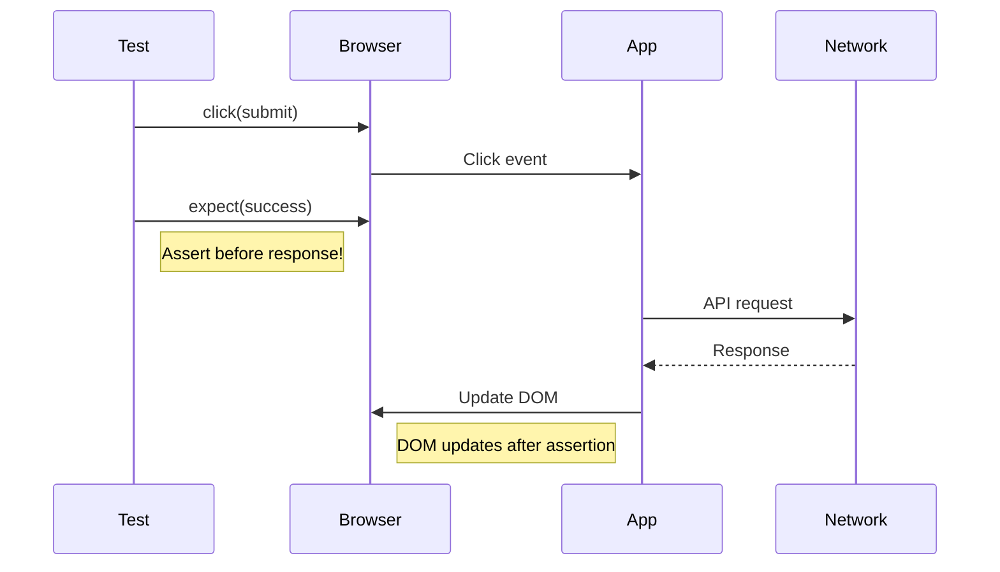
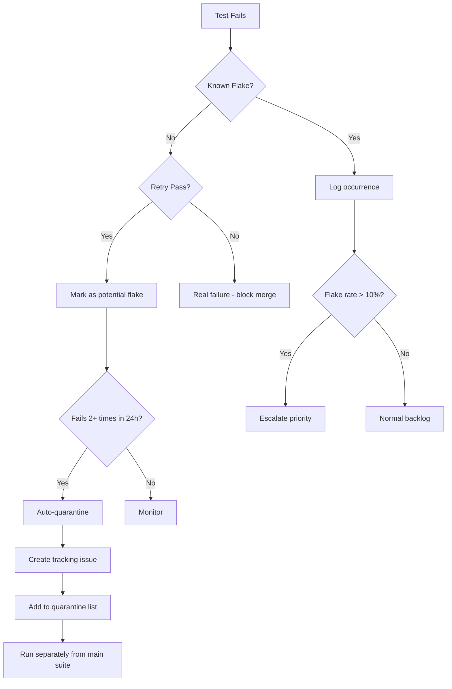

*[E2E]: End-to-End
*[CI]: Continuous Integration
*[CD]: Continuous Deployment
*[DOM]: Document Object Model
*[API]: Application Programming Interface
*[SPA]: Single Page Application
*[CSS]: Cascading Style Sheets
*[PR]: Pull Request
*[MTTR]: Mean Time To Recovery

Flaky tests—tests that sometimes pass and sometimes fail without any code changes—are one of the most insidious problems in test automation. They erode trust in your test suite, train developers to ignore failures, and eventually let real bugs slip through because "it's probably just flaky."

The math is brutal. A single test with a 5% flake rate will block CI once every 20 runs. That sounds manageable. But a suite of 100 tests where each has just a 1% flake rate? That suite will fail 63% of builds. The probability compounds: $(1 - 0.01)^{100} \approx 0.37$, meaning only 37% of builds will pass cleanly.

I've watched this pattern destroy teams' ability to ship. A 200-test E2E suite starts showing random failures. The first response is always the same: "just retry and merge." Within a few months, nobody trusts red builds anymore. Developers stop investigating failures because it's faster to retry than debug. Then a real regression ships because the failure was dismissed as "probably flaky." The post-mortem reveals the team had lost the ability to distinguish signal from noise.

<Callout type="warning">
Flaky tests are technical debt with compound interest. Every ignored flake teaches your team that test failures don't matter. By the time you realize you have a problem, the culture of "just retry" has become embedded, and real regressions slip through.
</Callout>

This article is a systematic approach to diagnosing and fixing flaky tests. Here's what we'll cover:

- _Categorizing flakiness_ by root cause—race conditions, environment issues, and test design flaws each have distinct symptoms and fixes
- _Building detection infrastructure_ to track flake rates and identify patterns over time
- _Diagnosing race conditions_ with concrete debugging techniques and stable code patterns
- _Stabilizing test environments_ through isolation, time mocking, and animation handling
- _Managing flaky tests at scale_ with quarantine systems, triage frameworks, and CI debugging workflows
- _Choosing the right tools_ for flake detection and tracking

## The Taxonomy of Flakiness

Before you can fix a flaky test, you need to identify what kind of flakiness you're dealing with. In my experience, flakes fall into four broad categories, each with distinct symptoms and fix strategies.

### Race Conditions (~60% of Flakes)

Race conditions are the dominant cause of flakiness. The test and application are competing for timing, and the test sometimes wins (passes) and sometimes loses (fails).

The telltale symptoms: the test passes locally but fails in CI, passes when you attach a debugger (which slows things down), or behaves inconsistently across different machines. The underlying issue is almost always the same—the test is asserting before the application has finished doing something.

Common patterns include clicking a button and immediately checking the result (before the async handler completes), interacting with an element while it's still animating, or making assertions before an API response arrives. The fix is always the same principle: _wait for the specific condition you need, not an arbitrary amount of time_.

### Environment Issues (~25% of Flakes)

Environment flakes occur when tests depend on external state that varies between runs. These are particularly frustrating because the test itself is often correct—it's the environment that's unstable.

Symptoms include tests that only fail in CI, fail on specific operating systems or browsers, or fail at certain times of day. Common causes are parallel tests fighting over the same port, date assertions that fail around midnight UTC or month boundaries, and leftover temp files from previous test runs.

Fixes involve dynamic resource allocation (random ports instead of hardcoded ones), freezing time or using timezone-agnostic assertions, and cleaning up filesystem state in `afterEach` hooks.

### Test Design Flaws (~15% of Flakes)

Sometimes the test itself is poorly constructed. These flakes are the easiest to diagnose because the symptoms are obvious: the test fails when run in a different order, fails when run in parallel, or only passes when some other specific test runs first.

The root causes are shared mutable state (tests modifying the same database without cleanup), order dependence (test B relies on data created by test A), and brittle selectors (using generated class names like `div.sc-fHjqPf` that change on every build).

The principle: each test should set up its own preconditions and clean up after itself. Tests should be able to run in any order, in parallel, and repeatedly.

### External Dependencies (~variable)

The fourth category is external dependencies—third-party APIs, shared databases, caches, or services outside your control. These flakes are unpredictable because the root cause isn't in your code or tests.

Symptoms include failures that correlate with time of day (when the external service is under load), failures that cluster (multiple tests failing together), or errors mentioning connection timeouts and service unavailability.

Fixes depend on the dependency. For third-party APIs, mock them in tests or use recorded fixtures. For shared databases, isolate test data or use dedicated test instances. For caches, clear them between tests or use test-specific cache keys.

| Category | Typical Fix Time | CI Impact | Detection Difficulty |
|----------|------------------|-----------|---------------------|
| Race condition - simple | 15-30 min | High | Medium |
| Race condition - complex | 2-8 hours | High | Hard |
| Environment - resource | 30-60 min | Medium | Easy |
| Environment - timing | 1-4 hours | Low | Hard |
| Test design - state | 1-2 hours | High | Medium |
| Test design - selector | 15 min | Low | Easy |
| External dependency | Varies | High | Medium |

Table: Flakiness categories and resolution characteristics.

<Callout type="info">
Race conditions cause the majority of flakes. If you don't know why a test is flaky, assume it's a race condition until proven otherwise. The test is asserting before the application has finished doing something.
</Callout>

## Detecting and Measuring Flakiness

You can't fix what you can't measure. Before diving into specific flakes, you need infrastructure to detect them systematically and track trends over time. This means collecting test results across runs and analyzing patterns.

### Building a Flake Detection System

The foundation is storing every test result with enough metadata to analyze patterns later. You need the test identifier, pass/fail status, duration, commit SHA, timestamp, and any error messages. With this data, you can calculate flake rates and identify patterns.

The interesting part is pattern detection. A test that fails randomly has different implications than one that fails only during high-load periods or only at certain times of day.

You can build this tracking yourself (a simple database and some scripts), use a CI platform's built-in analytics (GitHub Actions has basic retry tracking), or adopt a dedicated service like BuildPulse, Datadog CI Visibility, or Trunk Flaky Tests. The logic is the same regardless of where it runs:

```typescript title="flake-detection-service.ts"
// Flake pattern detection based on failure characteristics
function detectPattern(results: TestResult[], failures: TestResult[]): FlakePattern {
  // Check for time-based pattern (failures cluster around specific hours)
  const failureHours = failures.map(f => f.timestamp.getHours());
  const hourVariance = calculateVariance(failureHours);
  if (hourVariance < 4) {
    return 'time-based';
  }

  // Check for load-based pattern (failures take longer, suggesting contention)
  const failureDurations = failures.map(f => f.duration);
  const passDurations = results.filter(r => r.passed).map(r => r.duration);
  if (mean(failureDurations) > mean(passDurations) * 1.5) {
    return 'load-based';
  }

  return 'random';
}

// Suggest root cause category based on error message patterns
function suggestCategory(failures: TestResult[]): string {
  const errorMessages = failures.map(f => f.errorMessage).filter(Boolean);

  const patterns = {
    'race_condition': [/timeout/i, /element not found/i, /detached from DOM/i],
    'network': [/ECONNREFUSED/i, /fetch failed/i, /socket hang up/i],
    'state': [/unexpected state/i, /already exists/i, /constraint violation/i],
  };

  for (const [category, regexes] of Object.entries(patterns)) {
    const matches = errorMessages.filter(msg => regexes.some(rx => rx.test(msg)));
    if (matches.length > failures.length * 0.5) {
      return category;
    }
  }
  return 'unknown';
}
```
Code: Pattern detection and category suggestion based on failure characteristics.

Time-based patterns often indicate timezone issues or scheduled processes interfering with tests. Load-based patterns (where failures take longer than passes) suggest resource contention—the test is timing out because something else is consuming CPU or memory. Error message patterns help categorize the root cause automatically.

### CI Integration

The detection system is only useful if it's integrated into your CI pipeline. The workflow needs to upload results after every run, check whether failures are known flakes, and only block merges on _new_ failures.

```yaml title=".github/workflows/e2e-with-flake-tracking.yaml"
name: E2E Tests with Flake Tracking
on: [push, pull_request]

jobs:
  e2e:
    runs-on: ubuntu-latest
    steps:
      - uses: actions/checkout@v4

      - name: Run E2E tests
        id: e2e
        continue-on-error: true
        run: |
          npx playwright test --reporter=json > results.json 2>&1
          echo "exit_code=$?" >> $GITHUB_OUTPUT

      - name: Upload results to flake database
        if: always()
        run: |
          curl -X POST -H "Authorization: Bearer ${{ secrets.FLAKE_DB_TOKEN }}" \
            -d @results.json ${{ vars.FLAKE_DB_URL }}/api/results

      - name: Check for known flakes
        id: flake-check
        run: |
          failed=$(jq -r '.suites[].specs[] | select(.ok == false) | .title' results.json)
          all_known=true
          for test in $failed; do
            if ! curl -s "$FLAKE_DB_URL/api/flakes/$test" | jq -e '.isKnownFlake'; then
              all_known=false
              echo "Unknown failure: $test"
            fi
          done
          echo "all_known_flakes=$all_known" >> $GITHUB_OUTPUT

      - name: Fail if unknown failures
        if: steps.e2e.outputs.exit_code != '0' && steps.flake-check.outputs.all_known_flakes != 'true'
        run: exit 1
```
Code: GitHub Actions workflow that distinguishes known flakes from new failures.

The key insight is `continue-on-error: true` on the test step. This lets subsequent steps analyze the results and make a nuanced decision about whether to fail the build. Known flakes get logged but don't block the PR; unknown failures still fail the build and demand investigation.

<Callout type="success">
Track flake rates over time. A test that was stable for months and suddenly becomes flaky often indicates a real regression, not a test problem. Trend data helps distinguish new flakes from chronic ones.
</Callout>

## Race Condition Diagnosis

Race conditions are the most common cause of flakiness, and they're also the trickiest to debug. The fundamental problem: your test is asserting something before the application has finished doing it. Sometimes the app wins the race (test passes), sometimes the test wins (test fails).

### The Debugging Process

**Step 1: Confirm it's actually flaky.** Run the test many times in a loop. With Playwright, use `npx playwright test specific.spec.ts --repeat-each=50`. If it passes all 50 times, you may have fixed it accidentally, or the flake rate is very low. If it fails even once, you've confirmed the flakiness and can proceed.

**Step 2: Narrow down the race.** Two complementary techniques help here. First, _slow things down_—run with `PWTEST_SLOW_MO=1000` to add delays between actions. If the test becomes stable when slowed, you've confirmed a timing issue. Second, _speed things up_—run under CPU pressure (with something like `stress-ng --cpu 4 &`) to make the race more likely to trigger. Add timestamps to key events: test step start/end, network requests, DOM mutations.

**Step 3: Identify the competitors.** What's racing? The usual suspects are: test assertion vs async state update, click handler vs animation completing, network response vs render, or test cleanup vs next test setup. Look at the timestamps to see what's happening out of order.

**Step 4: Fix it.** The fix is almost always the same principle: wait for a specific condition, not an arbitrary amount of time.

### Common Race Patterns

Here are the patterns I see most often, with their stable alternatives. All examples use Playwright, but the principles apply to any E2E framework.

```typescript title="form-submission-race.ts"
// ❌ FLAKY: Clicking before element is interactive
test('submit form - flaky', async ({ page }) => {
  await page.goto('/form');
  await page.fill('#email', 'test@example.com');
  await page.click('button[type="submit"]');  // May click during animation
  await expect(page.locator('.success')).toBeVisible();  // May assert too early
});

// ✅ STABLE: Wait for interactive state
test('submit form - stable', async ({ page }) => {
  await page.goto('/form');
  await page.fill('#email', 'test@example.com');

  const submitButton = page.locator('button[type="submit"]');
  await expect(submitButton).toBeEnabled();
  await submitButton.click();

  await expect(page.locator('.success')).toBeVisible({ timeout: 10000 });
});
```
Code: Form submission race—wait for button to be enabled before clicking.

The form submission example shows two races: clicking the button before it's interactive (maybe it's disabled during validation), and asserting success before the API response arrives. The stable version explicitly waits for the button to be enabled and gives the success assertion a reasonable timeout.

```typescript title="search-race.ts"
// ❌ FLAKY: Fixed timeout that may be too short or too long
test('search returns results - flaky', async ({ page }) => {
  await page.fill('#search', 'test query');
  await page.waitForTimeout(2000);  // Arbitrary wait
  await expect(page.locator('.result')).toHaveCount(10);
});

// ✅ STABLE: Wait for network and DOM stability
test('search returns results - stable', async ({ page }) => {
  await page.fill('#search', 'test query');

  // Wait for search API to complete
  await page.waitForResponse(
    response => response.url().includes('/api/search') && response.status() === 200
  );

  await expect(page.locator('.result')).toHaveCount(10, { timeout: 5000 });
});
```
Code: Search race—wait for the API response instead of an arbitrary timeout.

The search example demonstrates the classic anti-pattern: `waitForTimeout()`. Two seconds might be enough on your fast local machine, but CI runners are often slower. The stable version waits for the actual event that matters—the API response.

```typescript title="navigation-race.ts"
// ❌ FLAKY: Race between click and navigation
test('click navigates - flaky', async ({ page }) => {
  await page.goto('/home');
  await page.click('a[href="/about"]');
  expect(page.url()).toContain('/about');  // Navigation may not have completed
});

// ✅ STABLE: Wait for navigation
test('click navigates - stable', async ({ page }) => {
  await page.goto('/home');

  await Promise.all([
    page.waitForURL('**/about'),
    page.click('a[href="/about"]'),
  ]);

  expect(page.url()).toContain('/about');
});
```
Code: Navigation race—use Promise.all to wait for URL change and click simultaneously.

The navigation example shows a subtle race: clicking a link doesn't guarantee the navigation has completed by the next line. The `Promise.all` pattern starts waiting for the URL change _before_ clicking, so you catch the navigation regardless of timing.

### Visualizing the Race

This sequence diagram shows why the flaky version fails. The test asserts success before the network response has arrived—the assertion races ahead of the actual state change.


Figure: Timeline showing race condition—the test asserts before the app finishes.

The fix is to insert a `waitForResponse` between the click and the assertion, so the test waits for the actual event (API response) before checking the result.

<Callout type="warning">
`waitForTimeout()` is almost never the right answer. It either waits too long (slow tests) or not long enough (flaky tests). Wait for the specific condition you need: network response, DOM element, state change.
</Callout>

## Environment Stabilization

Environment flakes happen when tests depend on external state that varies between runs. The test itself is often correct—it's the environment that's unstable. The solution is isolation: each test should run in a pristine environment with no pollution from previous tests or external factors.

### Browser State Isolation

Cookies, localStorage, and session data can leak between tests if you're reusing browser contexts. In Playwright, the cleanest approach is using fresh contexts:

```typescript title="browser-isolation.ts"
// Option 1: Clear state in beforeEach
test.beforeEach(async ({ context }) => {
  await context.clearCookies();
  await context.clearPermissions();
});

// Option 2: Use isolated contexts per test (Playwright default)
// Each test already gets a fresh context unless you configure otherwise

// Option 3: For tests that need complete isolation
test('sensitive test', async ({ browser }) => {
  const context = await browser.newContext();
  const page = await context.newPage();
  // This context is completely isolated
  await context.close();
});
```
Code: Browser state isolation strategies.

### Database State Isolation

Database pollution is one of the most common sources of order-dependent flakes. Test A creates a user, test B expects to find only one user, but if A runs first, B fails. Three patterns work well:

_Transaction rollback_: Wrap each test in a database transaction and roll back after. Fast and clean, but doesn't work if your test needs to verify committed data, test triggers, or observe behavior across transaction boundaries. Best for: unit-style integration tests where you're testing application logic, not database behavior.

_Database per test_: Create an isolated database for each test with a unique name. Slower but provides complete isolation. Works well with containerized databases (spin up a fresh Postgres container per test run). Best for: tests that need to verify committed data or test database-level features.

_Seeded snapshots_: Reset to a known state before each test using database snapshots or seed scripts. Good balance of isolation and speed. Best for: E2E tests where you need realistic data but can't afford the overhead of creating fresh databases.

```typescript title="database-isolation.ts"
// Transaction rollback approach
test.beforeEach(async () => {
  await db.query('BEGIN');
});

test.afterEach(async () => {
  await db.query('ROLLBACK');
});

// Seeded snapshot approach (using pg_restore or similar)
test.beforeEach(async () => {
  await db.restore('clean_state_snapshot');
});
```
Code: Database isolation patterns.

### Time and Timezone Handling

Time-dependent tests are sneaky. They pass for months, then suddenly fail—usually at midnight UTC, around month boundaries, or when someone runs the tests from a different timezone.

```typescript title="time-handling.ts"
// ❌ FLAKY: Test depends on current time
test('shows today date - flaky', async ({ page }) => {
  await page.goto('/dashboard');
  const dateText = await page.locator('.current-date').textContent();
  expect(dateText).toContain('January');  // Only passes in January!
});

// ✅ STABLE: Mock the clock
test('shows today date - stable', async ({ page }) => {
  await page.clock.install({ time: new Date('2024-06-15T10:00:00Z') });
  await page.goto('/dashboard');
  const dateText = await page.locator('.current-date').textContent();
  expect(dateText).toContain('June 15');
});
```
Code: Freezing time to eliminate date-dependent flakes.

For timezone issues, you have two options: force a specific timezone in your test environment, or make assertions timezone-agnostic by comparing UTC timestamps rather than formatted strings.

```typescript title="timezone-handling.ts"
// ❌ FLAKY: Timezone-dependent assertion
test('shows correct time - flaky', async ({ page }) => {
  await page.goto('/events');
  const time = await page.locator('.event-time').textContent();
  expect(time).toBe('2:00 PM');  // Fails in different timezones
});

// ✅ STABLE: Assert on UTC timestamp instead
test('shows correct time - stable', async ({ page }) => {
  await page.goto('/events');
  const timestamp = await page.locator('.event-time').getAttribute('data-timestamp');
  expect(parseInt(timestamp)).toBe(1718452800000);  // UTC timestamp
});
```
Code: Timezone-agnostic assertions.

### Animation Interference

CSS animations can cause flakes when tests try to interact with moving elements. The element is technically visible, but it's still animating into position, so the click misses or lands on the wrong thing.

```typescript title="animation-handling.ts"
// Option 1: Disable animations globally
test('modal interaction', async ({ page }) => {
  await page.emulateMedia({ reducedMotion: 'reduce' });
  await page.click('[data-testid="open-modal"]');
  // Modal appears instantly with reducedMotion
});

// Option 2: Wait for animation to complete
test('modal interaction', async ({ page }) => {
  await page.click('[data-testid="open-modal"]');
  await page.waitForFunction(() => {
    const modal = document.querySelector('.modal');
    return modal && getComputedStyle(modal).opacity === '1';
  });
});
```
Code: Handling CSS animations in tests.

I generally prefer disabling animations in test environments entirely. It makes tests faster and eliminates an entire category of flakes. If you specifically need to test animation behavior, isolate those tests and handle them carefully.

<Callout type="info">
If your test fails at midnight UTC, around month boundaries, or in different timezones, you have a time-dependent test. Either freeze time or make assertions timezone-agnostic by comparing timestamps rather than formatted strings.
</Callout>

## Quarantine and Triage Process

When you have flaky tests blocking CI, you need a system to manage them without losing track. Quarantine lets you isolate known-flaky tests so they don't block merges while you work on fixes. But quarantine without accountability becomes a dumping ground—tests go in and never come out.

### How Quarantine Works

The workflow starts when a test fails. If it's already a known flake, log the occurrence and continue. If it's new, retry it. If the retry passes, mark it as a potential flake and monitor it. If it fails again within 24 hours, auto-quarantine it: create a tracking issue, assign an owner, and move it out of the main suite.


Figure: Flaky test quarantine workflow.

The quarantine list itself is just configuration—a list of test IDs with metadata about why they're quarantined, who owns them, and when they were added.

```typescript title="quarantine.config.ts"
export const quarantineConfig = {
  quarantined: [
    {
      testId: 'e2e/checkout.spec.ts::processes payment',
      reason: 'Race condition with Stripe webhook',
      ticket: 'JIRA-1234',
      quarantinedAt: '2024-01-10',
      owner: 'payments-team',
      flakeRate: 0.08,
    },
    {
      testId: 'e2e/dashboard.spec.ts::loads analytics',
      reason: 'Third-party analytics service timeout',
      ticket: 'JIRA-1235',
      quarantinedAt: '2024-01-12',
      owner: 'analytics-team',
      flakeRate: 0.03,
    },
  ],

  autoQuarantine: {
    enabled: true,
    threshold: {
      failureRate: 0.05,
      minRuns: 20,
      windowDays: 7,
    },
    maxQuarantineDays: 30,  // Force fix after 30 days
  },
};
```
Code: Quarantine configuration with ownership and deadlines.

The `maxQuarantineDays` setting is critical. Without a deadline, quarantine becomes permanent. Thirty days is aggressive but reasonable—if you can't fix a flaky test in a month, you need to either delete it or accept that you've lost that coverage.

### Triage Priority

Not all flaky tests deserve equal attention. A checkout test that flakes 8% of the time and blocks multiple teams daily is far more urgent than an onboarding edge case that flakes 2% and rarely impacts anyone.

I use a weighted scoring system based on four factors:

- _Flake rate_ (30% weight): How often does it fail? Higher rates mean more disruption.
- _Test importance_ (25% weight): Is this a critical path like checkout or authentication? Or an edge case?
- _Fix complexity_ (20% weight): Quick fixes get higher priority—they're easy wins.
- _CI impact_ (25% weight): How many people does this flake block when it triggers?

| Test | Flake Rate | Importance | Fix Est. | CI Impact | Priority (1-10) |
|------|------------|------------|----------|-----------|----------|
| checkout.payment | 8% | Critical (10) | 4h (6) | Daily (10) | **8** |
| dashboard.analytics | 3% | Core (7) | 1h (10) | Occasional (4) | **6** |
| settings.timezone | 12% | Secondary (4) | 2d (3) | Rare (1) | **5** |
| onboarding.tour | 2% | Edge (1) | Quick (10) | Rare (1) | **3** |

Table: Example triage priority calculation (priority scored 1-10, higher = more urgent).

The checkout test has the highest priority despite not having the highest flake rate—it's critical path and blocks people daily. The timezone test has a higher flake rate but lower priority because it's secondary functionality that rarely impacts anyone.

<Callout type="success">
Quarantine is treatment, not cure. A quarantined test should have an owner, a ticket, and a deadline. If tests sit in quarantine indefinitely, you've just moved the problem from "flaky CI" to "invisible coverage gaps."
</Callout>

## Stabilization Patterns

Once you've identified a flaky test, you need strategies to stabilize it. Two complementary approaches work together: retries (to reduce CI disruption while you fix) and waiting strategies (to eliminate the race condition).

### Retry Strategies

Retries are a safety net, not a solution. But they're essential for keeping CI usable while you work on root causes. The key is configuring them thoughtfully.

```typescript title="playwright.config.ts"
import { defineConfig } from '@playwright/test';

export default defineConfig({
  // Retry in CI, never locally (you want to see flakes when developing)
  retries: process.env.CI ? 2 : 0,

  projects: [
    {
      name: 'stable-tests',
      testMatch: /.*\.spec\.ts/,
      retries: 1,
    },
    {
      name: 'flaky-tests',
      testMatch: /.*\.flaky\.spec\.ts/,
      retries: 3,  // More retries for known-flaky tests while fixing
    },
  ],
});
```
Code: Playwright retry configuration with different tiers.

Disabling retries locally is important—you _want_ to see flakes during development so you can fix them. Retries in CI are there to prevent known issues from blocking everyone while you diagnose.

### Waiting Strategies

The real fix for race conditions is proper waiting. Instead of arbitrary timeouts, wait for specific conditions: network responses, DOM elements, state changes. Here's a helper class I use across projects:

```typescript title="wait-helpers.ts"
class WaitHelpers {
  constructor(private page: Page) {}

  async waitForApi(urlPattern: string | RegExp): Promise<Response> {
    return this.page.waitForResponse(response => {
      const url = response.url();
      return typeof urlPattern === 'string'
        ? url.includes(urlPattern)
        : urlPattern.test(url);
    });
  }

  async waitForStable(selector: string, timeout = 5000): Promise<void> {
    const element = this.page.locator(selector);
    let lastBox = await element.boundingBox();
    const startTime = Date.now();

    while (Date.now() - startTime < timeout) {
      await this.page.waitForTimeout(100);
      const currentBox = await element.boundingBox();

      if (currentBox && lastBox &&
          currentBox.x === lastBox.x && currentBox.y === lastBox.y) {
        return;  // Element stopped moving
      }
      lastBox = currentBox;
    }
    throw new Error(`Element ${selector} did not stabilize`);
  }

  async waitForPageReady(): Promise<void> {
    await Promise.all([
      this.page.waitForLoadState('networkidle'),
      this.page.waitForFunction(() =>
        document.documentElement.hasAttribute('data-hydrated')
      ),
    ]);
  }
}
```
Code: Reusable wait helpers for common stability patterns.

The `waitForStable` helper is particularly useful for animated elements—it polls the element's bounding box until it stops moving. The `waitForPageReady` composite waits for both network idle and framework hydration, which covers most SPA scenarios.

<Callout type="info">
You might notice `waitForStable` uses `waitForTimeout(100)` internally. This is acceptable—polling loops need small delays between checks. The anti-pattern is using `waitForTimeout` as your _primary_ wait strategy instead of waiting for a specific condition. Here, the condition is "element stopped moving"; the timeout is just the polling interval.
</Callout>

<Callout type="warning">
Retries mask problems, they don't fix them. Use retries as a safety net while you diagnose the root cause, not as a permanent solution. A test that needs 3 retries to pass has a bug—either in the test or the application.
</Callout>

## Test Design for Stability

Some tests are inherently more stable than others. The difference usually comes down to two factors: selector resilience and test isolation.

### Selector Resilience

Brittle selectors are a silent source of flakiness. A test might pass for months, then suddenly fail because someone refactored a component and the generated class names changed.

The hierarchy of selector preference, from most to least stable:

1. _data-testid attributes_: Explicit test hooks that don't change with styling or structure
2. _ARIA roles and labels_: Semantic selectors that align with accessibility, like `getByRole('button', { name: 'Submit' })`
3. _Form element names_: Stable attributes like `[name="email"]`
4. _Stable IDs_: If they're semantic and unlikely to change

Avoid: generated class names (`.sc-fHjqPf`), positional selectors (`nth-child(2)`), deep path selectors (`#root > div > form > div > input`), and text content selectors (content gets internationalized or tweaked).

```typescript title="login-page.ts"
// Page object with resilient selectors
class LoginPage {
  constructor(private page: Page) {}

  // Prefer role-based selectors
  readonly emailInput = () => this.page.getByRole('textbox', { name: 'Email' });
  readonly passwordInput = () => this.page.getByRole('textbox', { name: 'Password' });
  readonly submitButton = () => this.page.getByRole('button', { name: 'Sign in' });

  // Fall back to test IDs when semantic selectors aren't possible
  readonly mfaCodeInput = () => this.page.locator('[data-testid="mfa-code"]');

  async login(email: string, password: string): Promise<void> {
    await this.emailInput().fill(email);
    await this.passwordInput().fill(password);
    await this.submitButton().click();
  }
}
```
Code: Page object with resilient selectors.

### Test Isolation with Fixtures

Tests that share state will eventually interfere with each other. Playwright's fixture system makes it easy to create isolated environments for each test.

```typescript title="test-fixtures.ts"
import { test as base } from '@playwright/test';

const test = base.extend<{
  testUser: { email: string; password: string };
  authenticatedPage: Page;
}>({
  // Create unique user for each test
  testUser: async ({}, use) => {
    const user = await createTestUser({
      email: `test-${Date.now()}-${Math.random().toString(36)}@example.com`,
      password: 'TestPassword123!',
    });
    await use(user);
    await deleteTestUser(user.email);  // Cleanup
  },

  // Provide pre-authenticated page
  authenticatedPage: async ({ page, testUser }, use) => {
    await page.goto('/login');
    await page.fill('[name="email"]', testUser.email);
    await page.fill('[name="password"]', testUser.password);
    await page.click('button[type="submit"]');
    await page.waitForURL('/dashboard');
    await use(page);
  },
});

// Each test gets its own user—no interference
test('user can view orders', async ({ authenticatedPage }) => {
  await authenticatedPage.goto('/orders');
  // This test's data is completely isolated
});
```
Code: Playwright fixtures for test isolation.

The fixture creates a unique user for each test, authenticates, and cleans up afterward. Tests can run in any order, in parallel, without stepping on each other.

<Callout type="info">
Tests should be able to run in any order, in parallel, and repeatedly without affecting each other. If test B only passes when test A runs first, you have a hidden dependency that will eventually cause flakes.
</Callout>

## Debugging Flakes in CI

The hardest flakes to debug are CI-only flakes—tests that pass reliably on your local machine but fail intermittently in the pipeline. The problem is usually environment differences: CI runners have different CPU/memory constraints, run tests in parallel, and may have different network latency.

### A Debug Workflow

I keep a dedicated GitHub Actions workflow for flake investigation. It lets me run a specific test many times with full tracing enabled, then download the artifacts for analysis.

```yaml title=".github/workflows/e2e-debug.yaml"
name: E2E Debug Mode
on:
  workflow_dispatch:
    inputs:
      test_filter:
        description: 'Test file or pattern to run'
        required: true
      repeat_count:
        description: 'Number of times to repeat'
        default: '20'

jobs:
  debug:
    runs-on: ubuntu-latest
    steps:
      - uses: actions/checkout@v4

      - name: Setup
        run: npm ci && npx playwright install

      - name: Run tests in debug mode
        run: |
          npx playwright test ${{ inputs.test_filter }} \
            --repeat-each=${{ inputs.repeat_count }} \
            --workers=1 \
            --trace=on \
            --video=on

      - name: Upload debug artifacts
        if: always()
        uses: actions/upload-artifact@v4
        with:
          name: debug-artifacts
          path: |
            playwright-report/
            test-results/
```
Code: GitHub Actions workflow for on-demand flake debugging.

The key settings: `--repeat-each` runs the test multiple times to reproduce the flake, `--workers=1` serializes execution to rule out parallelism issues, and `--trace=on` captures detailed timing for each action. With 20 repetitions, even a 5% flake rate should produce at least one failure.

### Analyzing the Results

Once you have failures, compare the traces between passing and failing runs. Look for:

- _Timing differences_: Do failures take longer? That suggests timeouts or resource contention.
- _Error message patterns_: Are failures consistent (same error) or varied? Consistent errors point to a specific race; varied errors suggest environmental instability.
- _Screenshot differences_: What did the page look like at failure? Was an element missing, or in the wrong state?

The Playwright trace viewer is invaluable here—you can step through each action and see exactly what the test saw at each moment.

### Reproducing CI Locally

If you can't reproduce a flake locally, try matching the CI environment more closely:

- Use Docker with the same base image as your CI runners
- Limit CPU and memory to match CI constraints: `docker run --cpus=2 --memory=4g`
- Run tests in parallel with the same worker count as CI
- Add artificial load with `stress-ng` to simulate resource contention

A test that passes on your 16-core development machine but fails on a 2-core CI runner often has implicit timing assumptions.

<Callout type="success">
When debugging CI flakes, reproduce the CI environment locally. Use Docker to match the CI image, run with the same parallelism, and simulate resource constraints. A test that passes locally but fails in CI often has environment assumptions baked in.
</Callout>

## Tools for Flake Detection and Tracking

You don't have to build flake tracking infrastructure from scratch. Several tools specialize in this problem, and most CI platforms have basic retry tracking built in.

### Dedicated Flake Detection Services

_BuildPulse_ integrates with your CI pipeline and automatically detects flaky tests based on pass/fail patterns across runs. It calculates flake rates, identifies root causes, and prioritizes which flakes to fix first. The service tracks whether fixes actually work by monitoring the test after your change.

_Trunk Flaky Tests_ provides similar functionality with automatic quarantining. When a test is detected as flaky, Trunk can automatically retry it or move it to a quarantine suite, then notify you via Slack or create a tracking issue.

_Datadog CI Visibility_ takes a broader approach, correlating test performance with traces and logs. If a test is flaky because of slow database queries or API timeouts, you can see the full request traces alongside the test results.

### CI Platform Built-ins

Most CI platforms have basic flake detection:

- _GitHub Actions_ supports automatic retries and tracks retry history, though the analytics are limited.
- _CircleCI_ has test insights that show flaky test trends over time and can automatically rerun failed jobs.
- _GitLab CI_ has a "retry flaky tests" feature that reruns only the failed tests rather than the whole job.

### DIY Tracking

If you want more control (or can't justify the cost of a dedicated service), the core requirements are simple: store test results in a database (test name, pass/fail, duration, timestamp, commit), calculate flake rates over a rolling window, and build a dashboard. The flake detection logic I showed earlier handles the pattern analysis. The harder part is building the workflow around it—quarantine management, owner assignment, escalation rules—which is where the dedicated services earn their keep.

<Callout type="info">
Whichever tool you choose, the key metric is _time to fix_, not _time to detect_. A tool that detects flakes instantly but doesn't help you fix them faster isn't adding much value. Look for features that help with diagnosis (traces, logs, reproduction commands) and accountability (owner assignment, deadlines, escalation).
</Callout>

## Conclusion

Flaky tests are a solvable problem, but only if you approach them systematically. The process I've outlined breaks down into five phases:

1. _Categorize_: Is it a race condition, environment issue, or test design flaw? The symptoms tell you where to look.
2. _Detect_: Track flake rates over time. A test that was stable and becomes flaky is different from a test that's always been flaky.
3. _Quarantine_: Isolate flaky tests so they don't block CI, but hold them accountable with owners, tickets, and deadlines.
4. _Diagnose_: Reproduce the flake, slow things down, add logging, identify what's racing.
5. _Fix_: Wait for specific conditions instead of time, isolate test state, use resilient selectors.

The deeper lesson is that flaky tests are symptoms. They reveal race conditions in your tests, instability in your application, or inconsistency in your environments. Fixing flakes often uncovers real bugs—an API that's slower under load, a component that renders before its data arrives, a cleanup process that doesn't handle edge cases.

A stable test suite is an asset. Every failure means something, so failures get investigated. A flaky test suite is a liability—it trains your team to ignore failures, and that habit will eventually let a real bug through.

<Callout type="success">
Start small: pick your three worst flakes (highest impact, not necessarily highest flake rate), fix them this sprint, and measure CI pass rate before and after. A 10% improvement in CI reliability often translates to hours saved per week across the team.
</Callout>
