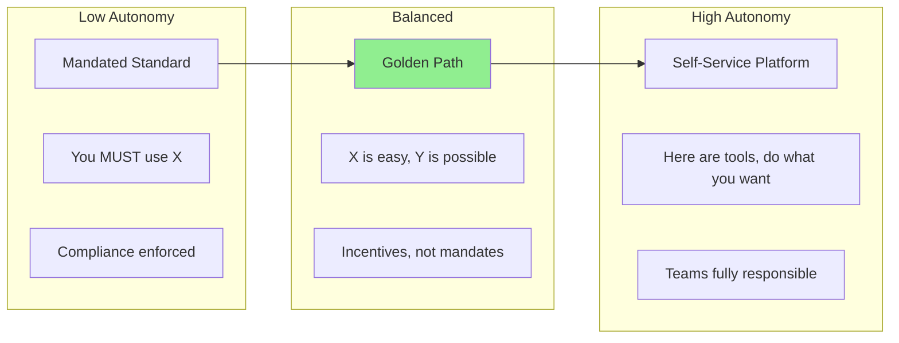
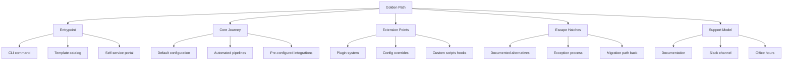
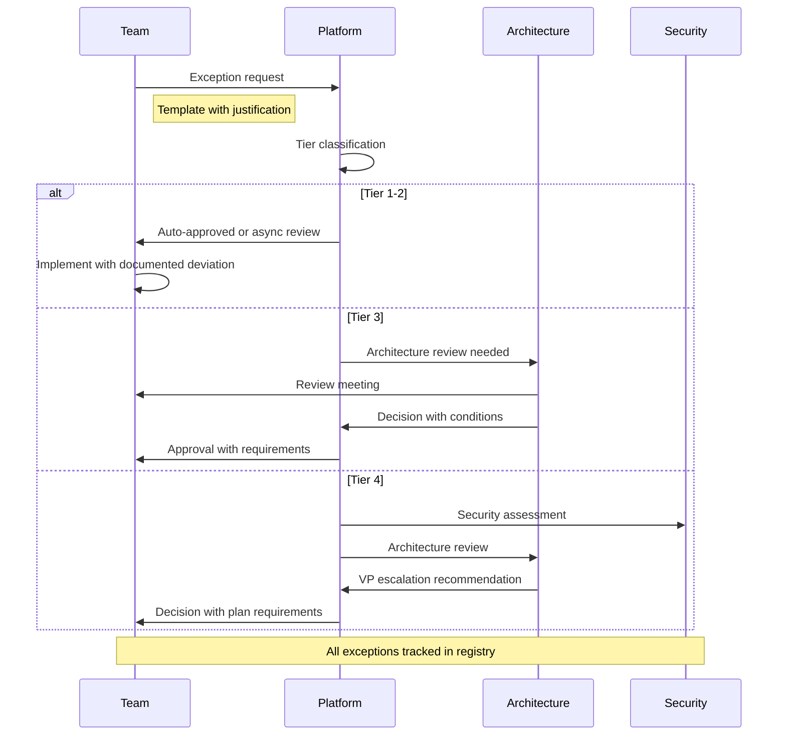
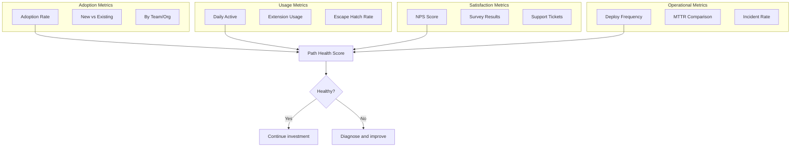
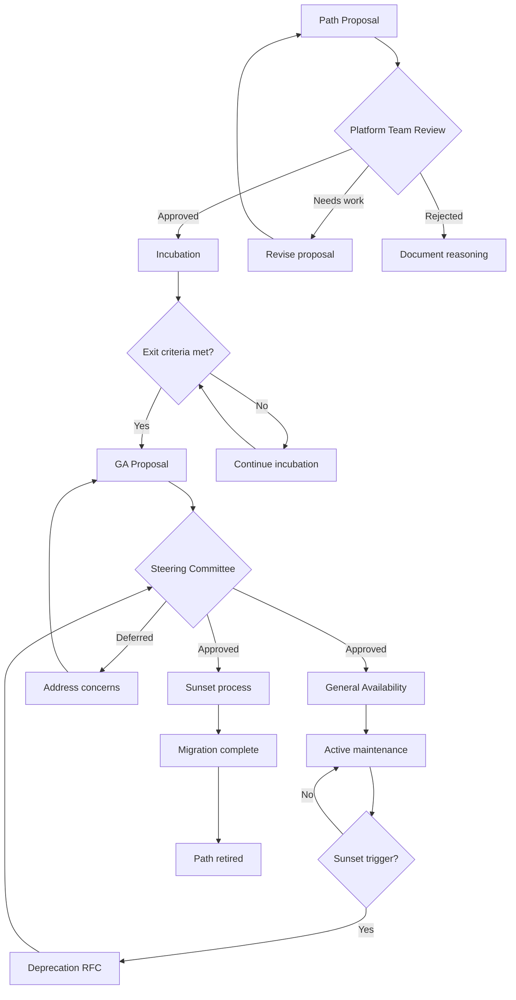

*[API]: Application Programming Interface
*[CI]: Continuous Integration
*[CD]: Continuous Deployment
*[CLI]: Command Line Interface
*[DX]: Developer Experience
*[IDP]: Internal Developer Platform
*[SLA]: Service Level Agreement
*[SRE]: Site Reliability Engineering
*[DORA]: DevOps Research and Assessment

# Golden Paths Without Golden Handcuffs

## Introduction

Frame the central tension: platform teams want standardization for maintainability, security, and operational efficiency. Product teams want autonomy to move fast and make technical decisions. Golden paths—curated, supported ways to accomplish common tasks—offer a middle ground: the platform makes the "right" thing easy, but doesn't forbid alternatives. This section establishes the philosophy: paved roads, not walled gardens.

_Include a scenario: a platform team mandates a specific deployment pipeline. Teams with legitimate edge cases (ML workloads, regulated data, real-time systems) face a choice: fight for exceptions, work around the mandate, or shoe-horn their use case into an ill-fitting solution. Morale drops, shadow platforms emerge, and the "standard" becomes optional in practice. The mandate failed because it was a golden handcuff, not a golden path._

<Callout type="warning">
Mandates breed workarounds. When developers can't use the standard path for legitimate reasons and have no sanctioned escape hatch, they'll build shadow infrastructure. You end up with less standardization than if you'd designed for autonomy from the start.
</Callout>

## The Philosophy of Golden Paths

### What Makes a Path "Golden"

```yaml title="golden-path-definition.yaml"
golden_path:
  definition: |
    A golden path is a supported, well-documented way to accomplish a
    common task that the platform team actively maintains and improves.

  characteristics:
    opinionated_but_not_mandatory:
      description: "Strong defaults, optional usage"
      example: "Default CI template uses our standard runners, but teams can BYO"

    optimized_for_common_case:
      description: "80/20 rule - works great for most, exceptions acknowledged"
      example: "REST API template covers 80% of services, gRPC teams use escape hatch"

    actively_maintained:
      description: "Platform team owns updates, security patches, improvements"
      example: "Base images updated monthly, teams get updates automatically"

    well_documented:
      description: "Clear docs, tutorials, examples, troubleshooting"
      example: "Getting started guide, FAQ, decision tree for when to use/not use"

    measurably_better:
      description: "Demonstrable advantages over alternatives"
      example: "50% faster deployments, 3x fewer security incidents"

  anti_patterns:
    golden_handcuffs:
      symptom: "No way to deviate, even with good reason"
      result: "Shadow platforms, resentment, eventual abandonment"

    golden_cobwebs:
      symptom: "Path exists but is unmaintained"
      result: "Teams avoid it, documentation rot, security vulnerabilities"

    golden_labyrinth:
      symptom: "So many paths that none are clearly recommended"
      result: "Decision paralysis, inconsistent choices, no network effects"
```
Code: Golden path definition and anti-patterns.

### The Autonomy Spectrum


Figure: The autonomy spectrum from mandates to full self-service.

```yaml title="autonomy-spectrum-tradeoffs.yaml"
autonomy_spectrum:
  mandated_standard:
    autonomy: "None"
    consistency: "High (on paper)"
    maintenance: "Platform team only"
    adoption_friction: "High resistance"
    innovation: "Blocked"
    when_appropriate:
      - "Security-critical controls"
      - "Legal/compliance requirements"
      - "Cross-cutting concerns (observability)"
    risks:
      - "Shadow infrastructure"
      - "Resentment and attrition"
      - "Stifled innovation"

  golden_path:
    autonomy: "High with guardrails"
    consistency: "High (in practice)"
    maintenance: "Shared - platform core, teams customize"
    adoption_friction: "Low - it's just easier"
    innovation: "Enabled via escape hatches"
    when_appropriate:
      - "Common patterns (service creation, deployment)"
      - "Best practices (testing, monitoring)"
      - "Productivity tooling"
    risks:
      - "Escape hatches become primary path"
      - "Path becomes outdated"
      - "Under-investment in alternatives"

  full_self_service:
    autonomy: "Complete"
    consistency: "Low"
    maintenance: "Each team independently"
    adoption_friction: "None (no standard)"
    innovation: "Maximum"
    when_appropriate:
      - "Early stage companies"
      - "R&D/experimental work"
      - "Highly heterogeneous tech landscape"
    risks:
      - "Duplication of effort"
      - "Knowledge silos"
      - "Operational burden per team"
```
Code: Autonomy spectrum tradeoffs analysis.

| Approach | Consistency | Team Velocity | Platform Effort | Best For |
|----------|-------------|---------------|-----------------|----------|
| Mandated | High (enforced) | Low (friction) | High (enforcement) | Compliance, security |
| Golden path | High (incentivized) | High (paved road) | Medium (maintenance) | Common patterns |
| Self-service | Low | Variable | Low | Innovation, edge cases |

Table: Comparing standardization approaches.

<Callout type="info">
Golden paths work when the path is genuinely better, not just standardized. If your path is slower, more complex, or less capable than the alternative, developers will route around it no matter how well documented it is.
</Callout>

## Designing Effective Paths

### Path Anatomy


Figure: Components of a well-designed golden path.

```yaml title="service-creation-path.yaml"
# Example: Service creation golden path
service_creation_golden_path:
  name: "New Service Template"
  description: "Create a production-ready service in 10 minutes"

  entrypoint:
    primary: "platform create service"
    alternatives:
      - "Backstage template catalog"
      - "GitHub template repository"

  core_journey:
    step_1_scaffold:
      action: "Generate service skeleton"
      includes:
        - "Language-specific boilerplate (Go, TypeScript, Python)"
        - "Dockerfile with security best practices"
        - "CI/CD pipeline (GitHub Actions or GitLab)"
        - "Kubernetes manifests"
        - "Observability setup (metrics, logs, traces)"
      time: "< 1 minute"

    step_2_configure:
      action: "Set service-specific values"
      prompts:
        - "Service name (validated against naming conventions)"
        - "Team ownership (from org directory)"
        - "Resource tier (small/medium/large)"
        - "Dependencies (database, cache, queue)"
      time: "2-3 minutes"

    step_3_provision:
      action: "Create infrastructure and CI/CD"
      creates:
        - "Git repository with initial commit"
        - "CI/CD pipeline connected to cluster"
        - "Database/cache instances (if selected)"
        - "Service catalog entry"
        - "PagerDuty service"
      time: "3-5 minutes"

    step_4_verify:
      action: "Confirm everything works"
      checks:
        - "Service deploys to dev environment"
        - "Health endpoint responds"
        - "Metrics flowing to Grafana"
        - "Logs appearing in Loki"
      time: "2-3 minutes"

  extension_points:
    custom_language:
      mechanism: "Add template to catalog"
      process: "PR to platform-templates repo"

    custom_ci_steps:
      mechanism: "Override .github/workflows/build.yml"
      documentation: "link-to-ci-customization-guide"

    custom_infrastructure:
      mechanism: "Terraform modules in service repo"
      documentation: "link-to-iac-extension-guide"

  escape_hatches:
    bring_your_own_dockerfile:
      when: "Special runtime requirements"
      process: "Document in README, platform review"

    alternative_deployment:
      when: "Doesn't fit Kubernetes model"
      process: "Exception request, architecture review"

    no_template_at_all:
      when: "Completely novel architecture"
      process: "Architecture review, self-maintain"
```
Code: Complete golden path specification for service creation.

### Extension Point Design

```typescript title="extension-point-api.ts"
// Example: Extensible deployment pipeline

interface PipelineConfig {
  // Core configuration - platform provided defaults
  language: 'go' | 'typescript' | 'python' | 'java';
  deployTarget: 'kubernetes' | 'lambda' | 'cloudrun';

  // Extension points - team customizable
  hooks?: PipelineHooks;
  additionalSteps?: PipelineStep[];
  overrides?: Partial<DefaultConfig>;
}

interface PipelineHooks {
  // Run before standard build
  preBuild?: HookScript;
  // Run after standard build, before tests
  postBuild?: HookScript;
  // Run after tests pass, before deploy
  preDeploy?: HookScript;
  // Run after successful deploy
  postDeploy?: HookScript;
  // Custom notification on failure
  onFailure?: HookScript;
}

interface HookScript {
  name: string;
  script: string;
  timeout?: number;
  continueOnError?: boolean;
}

interface PipelineStep {
  name: string;
  image: string;
  commands: string[];
  insertAfter?: string;  // Reference to standard step
  insertBefore?: string;
  // If neither specified, appends to end
}

// Example usage in team's pipeline config
const teamConfig: PipelineConfig = {
  language: 'typescript',
  deployTarget: 'kubernetes',

  hooks: {
    preBuild: {
      name: 'Generate API client',
      script: 'npm run generate:api',
    },
    postDeploy: {
      name: 'Warm cache',
      script: 'curl -X POST $SERVICE_URL/admin/warm-cache',
    },
  },

  additionalSteps: [
    {
      name: 'Performance regression test',
      image: 'k6/k6:latest',
      commands: ['k6 run ./perf/smoke.js'],
      insertAfter: 'integration-tests',
    },
  ],

  overrides: {
    // Override default test timeout
    testTimeout: 600,  // 10 minutes instead of default 5
  },
};
```
Code: Extension point API design.

<Callout type="success">
Good extension points follow the "open-closed principle": the path is open for extension but closed for modification. Teams can add behaviors without forking the core path. When extension points are well-designed, 90% of customization needs can be met without escape hatches.
</Callout>

## Escape Hatch Policies

### Designing Effective Escape Hatches

```yaml title="escape-hatch-policy.yaml"
escape_hatch_framework:
  principles:
    documented_not_hidden:
      description: "Escape hatches are part of the platform, not loopholes"
      example: "Alternative deployment guide in main docs, not hidden wiki page"

    friction_proportional_to_risk:
      description: "Higher risk deviations require more process"
      example: "Custom Dockerfile = self-review, custom network = security review"

    path_back_exists:
      description: "Teams can return to golden path later"
      example: "Migration guide from custom to standard deployment"

    support_level_clear:
      description: "Teams know what support they'll get (or won't)"
      example: "Escape hatch = best-effort support, not SLA"

  escape_hatch_tiers:
    tier_1_extension:
      examples:
        - "Custom CI steps via hooks"
        - "Additional Kubernetes annotations"
        - "Extra environment variables"
      process: "Self-service, no approval"
      support: "Full - same as golden path"
      tracking: "Automatic via config analysis"

    tier_2_override:
      examples:
        - "Custom Dockerfile (not from base image)"
        - "Alternative test framework"
        - "Non-standard dependencies"
      process: "Documented in README, async review"
      support: "Best-effort - may not get automatic upgrades"
      tracking: "Manual declaration in service catalog"

    tier_3_exception:
      examples:
        - "Alternative deployment target"
        - "Custom network configuration"
        - "Non-standard runtime"
      process: "Architecture review required"
      support: "Self-maintained, platform consultation only"
      tracking: "Exception registry with renewal"

    tier_4_off_platform:
      examples:
        - "Completely custom infrastructure"
        - "Third-party managed service"
        - "Acquired company's existing stack"
      process: "VP approval, documented plan to converge or justify"
      support: "None from platform team"
      tracking: "Quarterly review for consolidation opportunity"
```
Code: Escape hatch tier framework.

### Exception Request Process


Figure: Exception request flow by tier.

```typescript title="exception-request-template.ts"
interface ExceptionRequest {
  // Identification
  service: string;
  team: string;
  requestedBy: string;
  date: string;

  // The ask
  deviation: {
    type: 'extension' | 'override' | 'exception' | 'off-platform';
    category: string;  // e.g., 'deployment', 'security', 'infrastructure'
    description: string;
    goldenPathAlternative: string;  // What they would use if following path
  };

  // Justification
  justification: {
    businessReason: string;
    technicalReason: string;
    alternativesConsidered: Array<{
      option: string;
      whyRejected: string;
    }>;
    temporaryOrPermanent: 'temporary' | 'permanent';
    convergencePlan?: string;  // If temporary, how will they return to path
  };

  // Risk assessment
  risks: {
    security: 'low' | 'medium' | 'high';
    operational: 'low' | 'medium' | 'high';
    maintenance: 'low' | 'medium' | 'high';
    mitigations: string[];
  };

  // Commitments
  commitments: {
    ownershipAcknowledged: boolean;  // Team owns maintenance
    supportLevelAccepted: boolean;   // Understands reduced support
    renewalSchedule?: string;        // When to re-evaluate
  };
}

// Example filled request
const exampleRequest: ExceptionRequest = {
  service: 'ml-inference-service',
  team: 'data-science',
  requestedBy: 'jane.doe@company.com',
  date: '2024-01-15',

  deviation: {
    type: 'exception',
    category: 'deployment',
    description: 'Deploy to GPU-enabled VM pool instead of standard Kubernetes',
    goldenPathAlternative: 'Standard Kubernetes deployment with CPU nodes',
  },

  justification: {
    businessReason: 'Real-time ML inference requires GPU acceleration for <50ms latency SLA',
    technicalReason: 'Model requires CUDA 12, TensorRT, specific GPU memory (24GB)',
    alternativesConsidered: [
      {
        option: 'CPU-only inference',
        whyRejected: '400ms latency, 8x more instances needed, higher cost',
      },
      {
        option: 'Kubernetes GPU nodes',
        whyRejected: 'Current cluster lacks GPU node pool, 3-month roadmap item',
      },
    ],
    temporaryOrPermanent: 'temporary',
    convergencePlan: 'Migrate to K8s GPU nodes when cluster upgrade completes (Q2 2024)',
  },

  risks: {
    security: 'medium',
    operational: 'high',
    maintenance: 'high',
    mitigations: [
      'VMs in same VPC with standard network policies',
      'Team on-call for VM-specific issues',
      'Automated patching via existing VM management',
    ],
  },

  commitments: {
    ownershipAcknowledged: true,
    supportLevelAccepted: true,
    renewalSchedule: 'Q2 2024 - evaluate K8s GPU readiness',
  },
};
```
Code: Exception request template with example.

<Callout type="warning">
Escape hatches without tracking become invisible technical debt. If you don't know who's using alternatives and why, you can't plan path improvements, estimate migration costs, or sunset deprecated options. Every escape hatch usage should be registered.
</Callout>

## Adoption Incentives

### Making the Path Irresistible

```yaml title="adoption-incentives.yaml"
incentive_strategies:
  intrinsic_value:
    description: "The path is genuinely better - fastest, easiest, most capable"
    tactics:
      - "Invest in DX: fast feedback, clear errors, good defaults"
      - "Benchmark: prove the path is faster than alternatives"
      - "Showcase: success stories from early adopters"
      - "Remove friction: one command to start, minimal config"
    measurement:
      - "Time to first deployment (path vs manual)"
      - "Developer satisfaction surveys"
      - "Support ticket volume (path vs alternatives)"

  network_effects:
    description: "Value increases as more teams adopt"
    tactics:
      - "Shared learnings: knowledge base of solutions"
      - "Cross-team support: peers can help each other"
      - "Feature prioritization: popular paths get more investment"
      - "Tooling ecosystem: integrations assume path conventions"
    measurement:
      - "Knowledge base contributions"
      - "Cross-team support in Slack"
      - "Feature request voting"

  operational_benefits:
    description: "Teams on path get better operational support"
    tactics:
      - "Priority support: faster response for path users"
      - "Proactive monitoring: platform team watches path services"
      - "Automatic upgrades: security patches, dependency updates"
      - "Incident support: platform team joins on-call for path issues"
    measurement:
      - "MTTR for path vs off-path services"
      - "Security patch lag"
      - "Incident co-response rate"

  organizational_recognition:
    description: "Adoption is visible and valued"
    tactics:
      - "Adoption dashboards: teams can see their status"
      - "Path badges: visual indicator of compliance"
      - "Leadership visibility: adoption metrics in reports"
      - "Migration support: dedicated help for teams converging"
    measurement:
      - "Dashboard engagement"
      - "Migration completion rate"
```
Code: Adoption incentive strategies.

### Avoiding Coercive Tactics

```yaml title="anti-coercion-policy.yaml"
anti_coercion_principles:
  what_not_to_do:
    shame_dashboards:
      description: "Public leaderboards ranking teams by compliance"
      why_bad: "Creates resentment, incentivizes gaming metrics"
      alternative: "Private adoption reports with helpful context"

    artificial_friction:
      description: "Making alternatives harder than necessary"
      why_bad: "Punishes legitimate use cases, breeds workarounds"
      alternative: "Make path easier, don't make alternatives worse"

    mandate_without_capability:
      description: "Requiring path before it handles team's use case"
      why_bad: "Forces bad fits, creates exceptions from day one"
      alternative: "Expand path capabilities before mandating"

    support_hostage:
      description: "Refusing to help with anything off-path"
      why_bad: "Alienates teams, creates adversarial relationship"
      alternative: "Tiered support - less for off-path, but not zero"

    deadline_without_migration_support:
      description: "Requiring migration by date without helping"
      why_bad: "Teams scramble, cut corners, create tech debt"
      alternative: "Migration sprints with platform team pairing"

  healthy_pressure:
    opportunity_cost_visibility:
      description: "Show what teams miss by not using path"
      example: "Your service could have automatic upgrades if on standard base image"

    improvement_collaboration:
      description: "Invite off-path teams to shape the path"
      example: "Your use case isn't covered - let's design the extension point"

    success_storytelling:
      description: "Highlight teams who migrated and benefited"
      example: "Team X moved to path and reduced deploy time 60%"
```
Code: Anti-coercion principles and healthy alternatives.

<Callout type="info">
The goal is pull, not push. When developers choose the golden path because it's genuinely the best option, adoption is sustainable. When they're forced onto it, they'll leave at the first opportunity—either to a different path or a different company.
</Callout>

## Measuring Path Health

### Adoption and Usage Metrics

```typescript title="path-metrics-collector.ts"
interface PathMetrics {
  // Adoption metrics
  adoption: {
    totalServices: number;
    onPath: number;
    offPath: number;
    adoptionRate: number;  // onPath / totalServices
    adoptionTrend: 'increasing' | 'stable' | 'decreasing';

    byTeam: Map<string, {
      total: number;
      onPath: number;
      rate: number;
    }>;

    byAge: {
      newServices: { onPath: number; total: number };  // < 3 months
      establishedServices: { onPath: number; total: number };  // > 3 months
    };
  };

  // Usage metrics
  usage: {
    dailyActiveServices: number;
    deploymentsPerDay: number;
    extensionPointUsage: Map<string, number>;  // Which extensions are popular
    escapeHatchUsage: Map<string, number>;     // Which escape hatches are used
  };

  // Satisfaction metrics
  satisfaction: {
    npsScore: number;  // Net Promoter Score
    surveyResponses: {
      easy: number;      // "The path makes my job easier"
      capable: number;   // "The path handles my use cases"
      supported: number; // "I can get help when needed"
    };
    supportTickets: {
      total: number;
      avgResolutionTime: number;
      satisfactionRating: number;
    };
  };

  // Operational metrics
  operational: {
    onPathServices: {
      deployFrequency: number;
      changeFailureRate: number;
      mttr: number;
      incidentRate: number;
    };
    offPathServices: {
      deployFrequency: number;
      changeFailureRate: number;
      mttr: number;
      incidentRate: number;
    };
  };
}

// Dashboard query examples
const dashboardQueries = {
  adoptionOverTime: `
    SELECT
      date_trunc('week', created_at) as week,
      COUNT(*) FILTER (WHERE on_golden_path) as on_path,
      COUNT(*) FILTER (WHERE NOT on_golden_path) as off_path,
      ROUND(COUNT(*) FILTER (WHERE on_golden_path)::numeric / COUNT(*) * 100, 1) as rate
    FROM services
    WHERE created_at > NOW() - INTERVAL '6 months'
    GROUP BY 1
    ORDER BY 1
  `,

  escapeHatchReasons: `
    SELECT
      escape_hatch_type,
      justification_category,
      COUNT(*) as count,
      ROUND(AVG(EXTRACT(days FROM NOW() - created_at))) as avg_days_active
    FROM exception_registry
    WHERE status = 'active'
    GROUP BY 1, 2
    ORDER BY 3 DESC
  `,

  operationalComparison: `
    SELECT
      on_golden_path,
      AVG(deploy_frequency) as avg_deploys_per_week,
      AVG(change_failure_rate) as avg_cfr,
      AVG(mttr_minutes) as avg_mttr,
      COUNT(*) as service_count
    FROM service_metrics
    WHERE period = 'last_30_days'
    GROUP BY 1
  `,
};
```
Code: Path metrics collection and dashboard queries.


Figure: Path health measurement framework.

### Leading vs Lagging Indicators

| Metric | Type | What It Tells You | Action Threshold |
|--------|------|-------------------|------------------|
| New service adoption | Leading | Path attractiveness to new projects | < 70% investigate |
| Escape hatch requests | Leading | Gap between path and needs | > 20% expand path |
| Extension point usage | Leading | Customization demands | High usage = productize |
| NPS score | Leading | Developer sentiment | < 30 immediate action |
| Deploy frequency (path vs off) | Lagging | Operational benefit realized | Path should be higher |
| MTTR (path vs off) | Lagging | Support model effectiveness | Path should be lower |
| Migration requests | Lagging | Pull toward path | High = path improving |

Table: Leading and lagging indicators for path health.

<Callout type="success">
Track the delta between on-path and off-path services on DORA metrics. If on-path services deploy more frequently with lower failure rates, that's your strongest adoption argument. If they don't, fix the path before promoting it.
</Callout>

## Path Evolution

### Lifecycle Management

```yaml title="path-lifecycle.yaml"
path_lifecycle_stages:
  incubation:
    description: "New path under development"
    characteristics:
      - "Limited to volunteer early adopters"
      - "Rapid iteration based on feedback"
      - "Breaking changes acceptable"
      - "No production SLA"
    exit_criteria:
      - "3+ teams successfully using in production"
      - "Documentation complete"
      - "Support model defined"
      - "Migration path from alternatives"
    typical_duration: "2-4 months"

  general_availability:
    description: "Path recommended for general use"
    characteristics:
      - "Active promotion to new projects"
      - "Stable API with deprecation policy"
      - "Production support SLA"
      - "Regular maintenance and updates"
    exit_criteria:
      - "Superseded by better path"
      - "Usage drops below threshold"
      - "Maintenance cost exceeds value"
    typical_duration: "2-5 years"

  sunset:
    description: "Path being retired"
    characteristics:
      - "No new adopters"
      - "Migration support active"
      - "Security patches only"
      - "Documented end date"
    process:
      - "Announce sunset 6+ months ahead"
      - "Provide migration tooling"
      - "Offer migration support sprints"
      - "Track migration progress"
      - "Extend deadline if blockers found"
    exit_criteria:
      - "All services migrated"
      - "Or explicit exception approved"
    typical_duration: "6-18 months"

  deprecated:
    description: "Path no longer supported"
    characteristics:
      - "No updates whatsoever"
      - "No support"
      - "May be removed"
      - "Remaining users self-maintain"
```
Code: Path lifecycle stages.

### Deprecation Communication

```typescript title="deprecation-announcement.ts"
interface DeprecationAnnouncement {
  path: string;
  effectiveDate: string;
  sunsetDate: string;
  removalDate: string;

  reason: string;
  replacement: {
    path: string;
    migrationGuide: string;
    automatedMigration: boolean;
  };

  impactedServices: Array<{
    name: string;
    team: string;
    contact: string;
  }>;

  timeline: Array<{
    date: string;
    milestone: string;
  }>;

  support: {
    migrationSprints: string[];
    officeHours: string;
    slackChannel: string;
  };
}

const exampleAnnouncement: DeprecationAnnouncement = {
  path: 'Service Template v1 (Node.js 16)',
  effectiveDate: '2024-02-01',
  sunsetDate: '2024-08-01',
  removalDate: '2024-11-01',

  reason: 'Node.js 16 reaches EOL April 2024. Template v2 uses Node.js 20 with improved performance and security.',

  replacement: {
    path: 'Service Template v2',
    migrationGuide: 'https://platform.internal/docs/migration/template-v1-to-v2',
    automatedMigration: true,  // `platform migrate service-template` available
  },

  impactedServices: [
    { name: 'user-service', team: 'identity', contact: 'identity-team@' },
    { name: 'payment-service', team: 'payments', contact: 'payments-team@' },
    // ... 47 more services
  ],

  timeline: [
    { date: '2024-02-01', milestone: 'Deprecation announced, migration tooling available' },
    { date: '2024-03-01', milestone: 'Migration sprint #1' },
    { date: '2024-04-01', milestone: 'Node.js 16 EOL - security patches from platform stop' },
    { date: '2024-05-01', milestone: 'Migration sprint #2' },
    { date: '2024-06-01', milestone: 'Remaining services get direct outreach' },
    { date: '2024-08-01', milestone: 'Sunset - new deployments blocked for v1' },
    { date: '2024-11-01', milestone: 'Removal - v1 no longer functional' },
  ],

  support: {
    migrationSprints: ['2024-03-04 to 2024-03-08', '2024-05-06 to 2024-05-10'],
    officeHours: 'Thursdays 2-3pm in #platform-office-hours',
    slackChannel: '#template-v2-migration',
  },
};
```
Code: Deprecation announcement template.

<Callout type="warning">
Deprecation without migration support is abandonment. If you sunset a path, you own helping teams migrate. Budget for migration sprints, automation, and extended timelines. The teams that are slowest to migrate often have the most complex situations.
</Callout>

## Organizational Patterns

### Platform Team Structure

```yaml title="platform-team-structure.yaml"
platform_team_roles:
  path_owner:
    responsibility: "End-to-end ownership of specific path"
    scope: "e.g., 'Service Creation Path', 'CI/CD Path'"
    activities:
      - "Define path roadmap"
      - "Gather feedback from users"
      - "Prioritize improvements"
      - "Own documentation"
      - "Handle exceptions and escalations"
    time_split: "50% development, 30% support, 20% strategy"

  path_engineer:
    responsibility: "Build and maintain path infrastructure"
    scope: "Technical implementation"
    activities:
      - "Develop path tooling"
      - "Maintain templates and automation"
      - "Fix bugs and security issues"
      - "Implement extension points"
    time_split: "80% development, 20% support"

  developer_advocate:
    responsibility: "Bridge between platform and product teams"
    scope: "Adoption and satisfaction"
    activities:
      - "Create tutorials and documentation"
      - "Run office hours and workshops"
      - "Gather feedback and pain points"
      - "Champion developer experience"
    time_split: "40% content, 40% support, 20% feedback loops"

  sre_liaison:
    responsibility: "Operational excellence for paths"
    scope: "Reliability and observability"
    activities:
      - "Define SLOs for path infrastructure"
      - "Monitor path service health"
      - "Incident response for path issues"
      - "Capacity planning"
    time_split: "40% monitoring, 30% improvement, 30% incidents"

interaction_model:
  with_product_teams:
    regular:
      - "Office hours (weekly)"
      - "Slack support (#platform-help)"
      - "Documentation and self-service"
    escalation:
      - "Exception requests"
      - "Feature requests"
      - "Incident co-response"
    feedback:
      - "Quarterly surveys"
      - "User interviews"
      - "Usage analytics"

  with_leadership:
    regular:
      - "Adoption metrics (monthly)"
      - "Path roadmap (quarterly)"
      - "Resource requests (planning cycles)"
    escalation:
      - "Tier 4 exceptions"
      - "Major path changes"
      - "Resource conflicts"
```
Code: Platform team structure for golden paths.

### Governance Model


Figure: Path governance workflow.

<Callout type="info">
Governance should be lightweight for most decisions and rigorous only when needed. Path owners should be able to make most improvements autonomously. Steering committee review is for major changes: new paths, significant deprecations, breaking changes.
</Callout>

## Conclusion

Summarize the balance: golden paths succeed when they're genuinely better than alternatives, not just mandated. Key principles: make the right thing easy (not mandatory), design escape hatches as first-class features, measure adoption but don't coerce it, evolve paths based on real usage patterns, and treat path users as customers to delight rather than subjects to control. The goal is a platform where developers choose standardization because it helps them, not because they have no choice.

<Callout type="success">
A successful golden path doesn't need enforcement. When developers voluntarily choose your path because it's faster, easier, and better supported, you've built something valuable. That voluntary adoption is both the goal and the measure of success.
</Callout>

---

## Cover Prompt

### Prompt 1: The Paved Road

Create an image of a beautifully paved highway through a landscape, with clear signage and rest stops. Beside it, a rougher dirt road exists for those who need it—not blocked, just less maintained. Travelers on both paths are visible, with most choosing the highway. Style: infrastructure metaphor, choice visualization, journey aesthetic, 16:9 aspect ratio.

### Prompt 2: The Garden Path

Design an image of a well-maintained garden path with stepping stones, flowers, and lighting. Other paths branch off into wilder areas—still accessible but requiring more effort. A gardener (platform engineer) tends the main path while hikers explore both options. Style: garden design meets navigation, curated vs wild paths, 16:9 aspect ratio.

### Prompt 3: The Guardrails

Illustrate a mountain road with guardrails along the edge. The guardrails protect travelers but don't prevent them from stopping, taking photos, or even carefully going beyond them to explore viewpoints. An overlook area shows where going off-path is sanctioned. Style: safety meets freedom, mountain driving aesthetic, protection without restriction, 16:9 aspect ratio.

### Prompt 4: The Choice Architecture

Create an image of a modern transit hub where multiple routes are visible. The recommended route is highlighted, well-lit, and signed. Alternative routes exist—clearly marked but requiring more navigation. Information boards help travelers choose. Style: transit design, wayfinding systems, choice architecture, 16:9 aspect ratio.

### Prompt 5: The Open Door

Design an image of a welcoming open door marked "Recommended Path" leading into a well-lit, furnished room with tools and resources. Other doors along the hallway are labeled but not locked—they lead to less equipped rooms. Developers are choosing which door to enter. Style: threshold metaphor, welcome vs restriction, choice and consequence, 16:9 aspect ratio.
