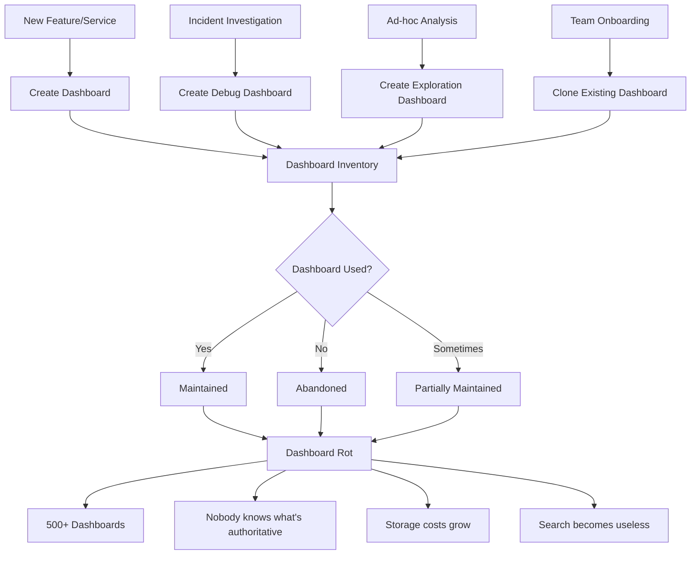
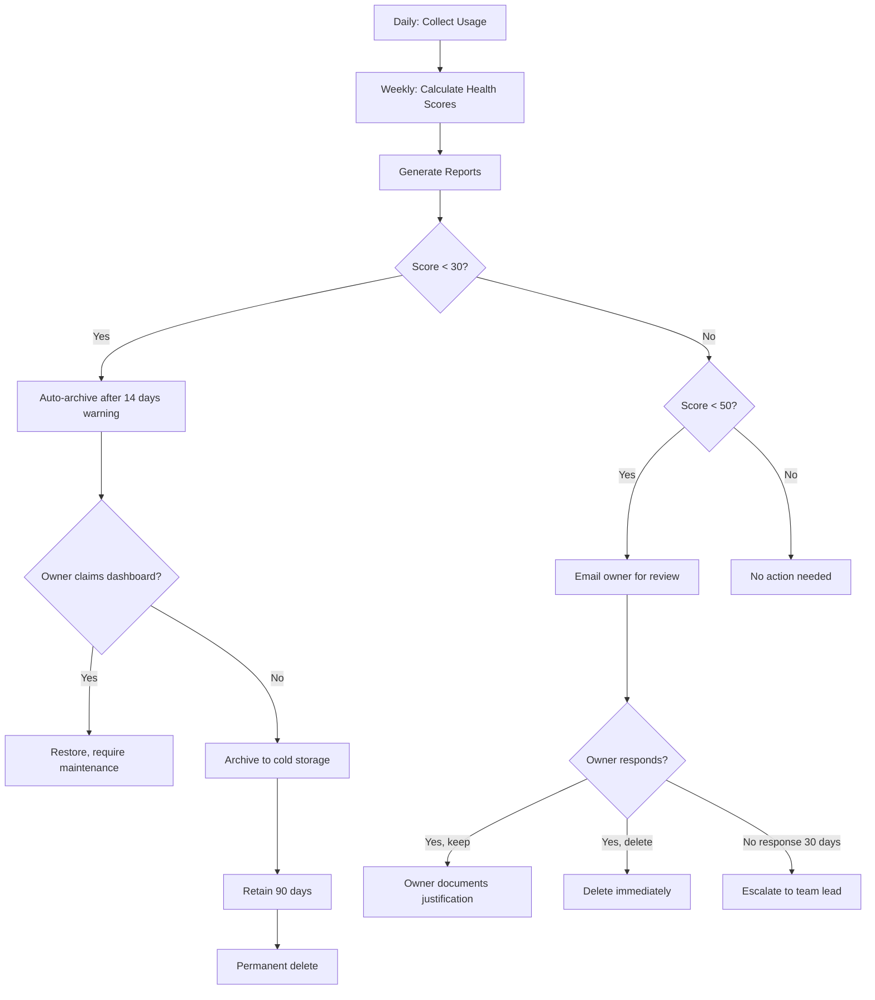
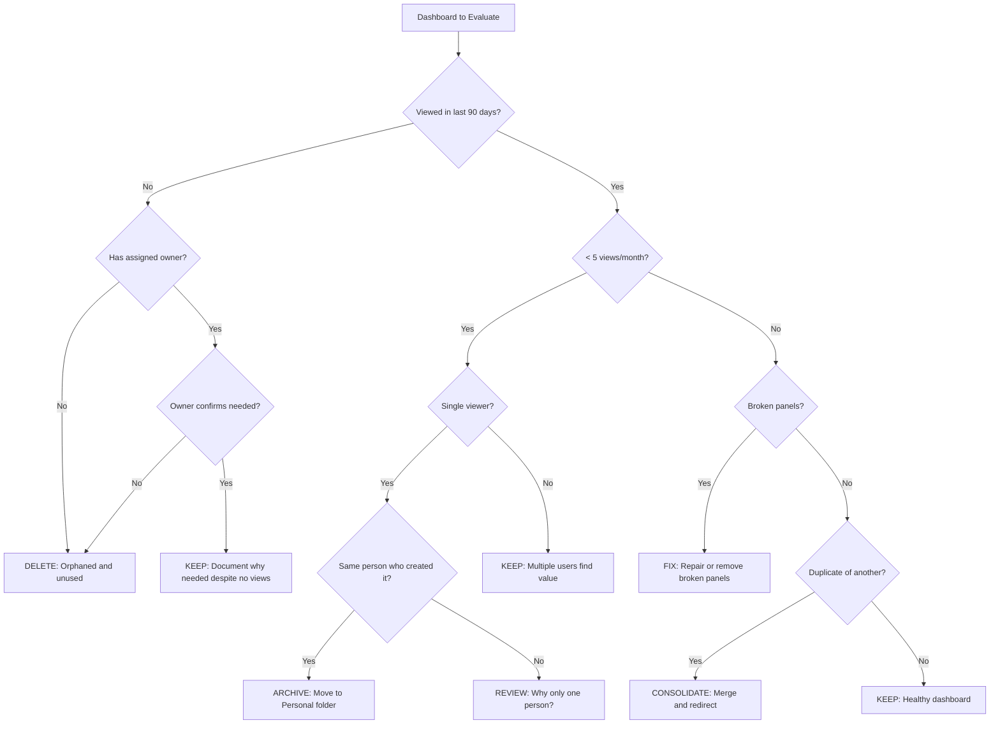

*[SLO]: Service Level Objective
*[SLI]: Service Level Indicator
*[KPI]: Key Performance Indicator
*[MTTR]: Mean Time To Recovery
*[API]: Application Programming Interface
*[JSON]: JavaScript Object Notation
*[SQL]: Structured Query Language
*[CSV]: Comma-Separated Values

# Dashboard Rot: Pruning Grafana for Actionability

## Introduction

Frame the dashboard proliferation problem: Grafana makes it easy to create dashboards, but nobody deletes them. Over time, organizations accumulate hundreds of dashboards—most unowned, outdated, or unused. Engineers waste time searching through noise, critical dashboards get lost in the clutter, and storage costs grow. This section establishes the cost of dashboard rot and the discipline required to maintain a healthy observability posture.

_Include a scenario: during an incident, an engineer opens the dashboard search and finds 47 results for "payments." Some are personal experiments, some are from teams that no longer exist, some show data from deprecated services. Ten minutes into the incident, they still haven't found the authoritative payments dashboard. The proliferation that seemed harmless has now extended MTTR._

<Callout type="warning">
Every dashboard you create is a promise to maintain it. Dashboards without owners become misleading artifacts—they show stale data, use deprecated metrics, and waste time during incidents when accuracy matters most.
</Callout>

## The Dashboard Lifecycle Problem

### How Dashboards Proliferate


Figure: How dashboard proliferation happens over time.

```yaml title="dashboard-proliferation-causes.yaml"
proliferation_causes:
  no_friction_to_create:
    description: "Creating a dashboard is easy (as it should be)"
    symptom: "Developers create dashboards for one-off analysis"
    pattern: "Exploration dashboards never deleted after use"

  incident_debris:
    description: "Dashboards created during incidents"
    symptom: "Debug-* dashboards pile up"
    pattern: "Created in panic, never reviewed, never deleted"

  copy_culture:
    description: "Cloning existing dashboards for customization"
    symptom: "Multiple near-identical dashboards exist"
    pattern: "Original evolves, clones diverge and stale"

  team_changes:
    description: "Teams reorganize but dashboards don't"
    symptom: "Orphaned dashboards from defunct teams"
    pattern: "No handoff process, dashboards become ownerless"

  no_deletion_culture:
    description: "Deleting feels risky, keeping feels safe"
    symptom: "Nobody deletes anything"
    pattern: "'Someone might need this' hoarding mentality"

  search_is_broken:
    description: "When search fails, create your own"
    symptom: "Duplicate dashboards because existing ones unfindable"
    pattern: "Poor naming, no folders, weak metadata"

dashboard_lifecycle_reality:
  creation: "Easy - click, clone, copy"
  maintenance: "Rare - only when broken"
  review: "Never - who has time?"
  deletion: "Almost never - too risky"
```
Code: Root causes of dashboard proliferation.

| Dashboard Type | Creation Frequency | Typical Lifespan | Deletion Rate |
|----------------|-------------------|------------------|---------------|
| Service overview | Once per service | Years | < 5% ever deleted |
| Incident debug | Every incident | Should be days | < 1% deleted |
| Feature launch | Per feature | Should be weeks | < 10% deleted |
| Personal exploration | Frequently | Should be hours | < 5% deleted |
| Team clones | Per team | Forever (diverges) | Never |

Table: Dashboard types and their lifecycle patterns.

<Callout type="info">
The asymmetry is stark: creating a dashboard takes minutes, deciding to delete one feels like it requires a committee. This asymmetry guarantees accumulation unless you actively counteract it with process.
</Callout>

## Measuring Dashboard Health

### Usage Tracking Implementation

```typescript title="dashboard-usage-tracker.ts"
import { GrafanaApi } from './grafana-api';

interface DashboardUsage {
  uid: string;
  title: string;
  folderTitle: string;

  // View metrics
  viewsLast30Days: number;
  uniqueViewersLast30Days: number;
  lastViewedAt: Date | null;

  // Edit metrics
  lastEditedAt: Date;
  editCount: number;
  lastEditedBy: string;

  // Metadata
  createdAt: Date;
  createdBy: string;
  tags: string[];

  // Ownership
  owner: string | null;
  ownerTeam: string | null;

  // Health indicators
  ageInDays: number;
  daysSinceLastView: number | null;
  daysSinceLastEdit: number;
  panelCount: number;
  brokenPanelCount: number;
}

class DashboardUsageTracker {
  constructor(private grafana: GrafanaApi, private db: Database) {}

  async collectUsageMetrics(): Promise<DashboardUsage[]> {
    const dashboards = await this.grafana.searchDashboards();
    const usageData: DashboardUsage[] = [];

    for (const dashboard of dashboards) {
      const details = await this.grafana.getDashboard(dashboard.uid);
      const usage = await this.grafana.getDashboardUsageStats(dashboard.uid);

      usageData.push({
        uid: dashboard.uid,
        title: dashboard.title,
        folderTitle: dashboard.folderTitle || 'General',

        viewsLast30Days: usage.viewsLast30Days,
        uniqueViewersLast30Days: usage.uniqueViewersLast30Days,
        lastViewedAt: usage.lastViewedAt ? new Date(usage.lastViewedAt) : null,

        lastEditedAt: new Date(details.meta.updated),
        editCount: details.meta.version,
        lastEditedBy: details.meta.updatedBy,

        createdAt: new Date(details.meta.created),
        createdBy: details.meta.createdBy,
        tags: details.dashboard.tags || [],

        owner: this.extractOwner(details),
        ownerTeam: this.extractOwnerTeam(details),

        ageInDays: this.daysSince(details.meta.created),
        daysSinceLastView: usage.lastViewedAt
          ? this.daysSince(usage.lastViewedAt)
          : null,
        daysSinceLastEdit: this.daysSince(details.meta.updated),
        panelCount: this.countPanels(details.dashboard),
        brokenPanelCount: await this.countBrokenPanels(details.dashboard),
      });
    }

    // Store for historical tracking
    await this.db.storeDashboardUsage(usageData);

    return usageData;
  }

  private async countBrokenPanels(dashboard: any): Promise<number> {
    let broken = 0;
    for (const panel of dashboard.panels || []) {
      if (panel.datasource) {
        const exists = await this.grafana.datasourceExists(panel.datasource);
        if (!exists) broken++;
      }
    }
    return broken;
  }

  private extractOwner(details: any): string | null {
    // Check for owner annotation
    const annotations = details.dashboard.annotations?.list || [];
    const ownerAnnotation = annotations.find(
      (a: any) => a.name === 'owner' || a.name === 'dashboard_owner'
    );
    if (ownerAnnotation) return ownerAnnotation.datasource;

    // Check tags for owner pattern
    const ownerTag = (details.dashboard.tags || []).find(
      (t: string) => t.startsWith('owner:')
    );
    if (ownerTag) return ownerTag.replace('owner:', '');

    // Fall back to creator
    return details.meta.createdBy;
  }
}
```
Code: Dashboard usage tracking implementation.

### Health Score Calculation

```typescript title="dashboard-health-score.ts"
interface DashboardHealthScore {
  uid: string;
  title: string;
  overallScore: number;  // 0-100

  components: {
    usageScore: number;      // Based on views and viewers
    freshnessScore: number;  // Based on edits and data recency
    ownershipScore: number;  // Has owner, team assignment
    qualityScore: number;    // No broken panels, reasonable complexity
  };

  recommendation: 'keep' | 'review' | 'archive' | 'delete';
  flags: string[];
}

class DashboardHealthCalculator {
  calculateHealth(usage: DashboardUsage): DashboardHealthScore {
    const usageScore = this.calculateUsageScore(usage);
    const freshnessScore = this.calculateFreshnessScore(usage);
    const ownershipScore = this.calculateOwnershipScore(usage);
    const qualityScore = this.calculateQualityScore(usage);

    const overallScore = (
      usageScore * 0.35 +
      freshnessScore * 0.25 +
      ownershipScore * 0.25 +
      qualityScore * 0.15
    );

    const flags = this.generateFlags(usage);
    const recommendation = this.generateRecommendation(overallScore, flags);

    return {
      uid: usage.uid,
      title: usage.title,
      overallScore: Math.round(overallScore),
      components: {
        usageScore: Math.round(usageScore),
        freshnessScore: Math.round(freshnessScore),
        ownershipScore: Math.round(ownershipScore),
        qualityScore: Math.round(qualityScore),
      },
      recommendation,
      flags,
    };
  }

  private calculateUsageScore(usage: DashboardUsage): number {
    // Score based on views and unique viewers
    const viewScore = Math.min(usage.viewsLast30Days / 100, 1) * 50;
    const viewerScore = Math.min(usage.uniqueViewersLast30Days / 10, 1) * 50;

    // Penalize never-viewed dashboards
    if (usage.viewsLast30Days === 0) {
      return usage.daysSinceLastView === null
        ? 0  // Never viewed
        : Math.max(0, 30 - (usage.daysSinceLastView! / 3));
    }

    return viewScore + viewerScore;
  }

  private calculateFreshnessScore(usage: DashboardUsage): number {
    // Recent edits indicate maintenance
    if (usage.daysSinceLastEdit < 30) return 100;
    if (usage.daysSinceLastEdit < 90) return 70;
    if (usage.daysSinceLastEdit < 180) return 40;
    if (usage.daysSinceLastEdit < 365) return 20;
    return 0;
  }

  private calculateOwnershipScore(usage: DashboardUsage): number {
    let score = 0;
    if (usage.owner) score += 50;
    if (usage.ownerTeam) score += 30;
    if (usage.tags.length > 0) score += 20;
    return score;
  }

  private calculateQualityScore(usage: DashboardUsage): number {
    let score = 100;

    // Penalize broken panels
    if (usage.brokenPanelCount > 0) {
      score -= Math.min(usage.brokenPanelCount * 20, 60);
    }

    // Penalize overly complex dashboards
    if (usage.panelCount > 30) {
      score -= Math.min((usage.panelCount - 30) * 2, 30);
    }

    // Penalize very simple dashboards (might be incomplete)
    if (usage.panelCount < 3) {
      score -= 20;
    }

    return Math.max(0, score);
  }

  private generateFlags(usage: DashboardUsage): string[] {
    const flags: string[] = [];

    if (usage.viewsLast30Days === 0) flags.push('no-recent-views');
    if (usage.daysSinceLastView && usage.daysSinceLastView > 90) flags.push('stale');
    if (!usage.owner) flags.push('no-owner');
    if (usage.brokenPanelCount > 0) flags.push('broken-panels');
    if (usage.daysSinceLastEdit > 365) flags.push('unmaintained');
    if (usage.title.toLowerCase().includes('copy')) flags.push('likely-clone');
    if (usage.title.toLowerCase().includes('test')) flags.push('possibly-temporary');
    if (usage.title.toLowerCase().includes('debug')) flags.push('incident-artifact');

    return flags;
  }

  private generateRecommendation(
    score: number,
    flags: string[],
  ): DashboardHealthScore['recommendation'] {
    // Immediate delete candidates
    if (
      flags.includes('no-recent-views') &&
      flags.includes('no-owner') &&
      flags.includes('unmaintained')
    ) {
      return 'delete';
    }

    // Archive candidates
    if (score < 30) return 'archive';
    if (score < 50) return 'review';
    return 'keep';
  }
}
```
Code: Dashboard health score calculation.

<Callout type="success">
Automate usage tracking from day one. Grafana Enterprise includes usage stats; for OSS, you can track via API audit logs or custom middleware. Without data, hygiene decisions become political debates instead of evidence-based choices.
</Callout>

## The Hygiene Process

### Establishing Dashboard Governance

```yaml title="dashboard-governance-policy.yaml"
dashboard_governance:
  ownership_requirements:
    rule: "Every dashboard must have an owner"
    enforcement:
      - "Owner tag required in dashboard metadata"
      - "Orphaned dashboards flagged in weekly report"
      - "90-day deadline to claim ownership or archive"
    owner_responsibilities:
      - "Keep dashboard accurate and maintained"
      - "Respond to questions about dashboard"
      - "Update or delete when service changes"
      - "Hand off ownership when leaving team"

  folder_structure:
    rule: "Organized folder hierarchy by domain"
    structure:
      - folder: "Team Dashboards"
        subfolders: "By team name"
        purpose: "Team-specific operational dashboards"
      - folder: "Service Dashboards"
        subfolders: "By service name"
        purpose: "Canonical service health dashboards"
      - folder: "SLO Dashboards"
        subfolders: "By product area"
        purpose: "SLI/SLO tracking dashboards"
      - folder: "Incidents"
        subfolders: "None (flat)"
        purpose: "Incident investigation dashboards (auto-expire)"
      - folder: "Personal"
        subfolders: "By username"
        purpose: "Exploration dashboards (exempt from governance)"

  naming_conventions:
    pattern: "[Service/Team] - [Purpose] - [Scope]"
    examples:
      - "Payments - API Performance - Production"
      - "Platform Team - Kubernetes Cluster - All Regions"
      - "SLO - Checkout Success Rate - P99"
    anti_patterns:
      - "New Dashboard"
      - "Copy of Copy of..."
      - "Test123"
      - "DEBUG - delete me"

  tagging_requirements:
    required_tags:
      - pattern: "owner:{username}"
        purpose: "Individual accountability"
      - pattern: "team:{team-name}"
        purpose: "Team visibility"
    recommended_tags:
      - pattern: "service:{service-name}"
      - pattern: "environment:{prod|staging|dev}"
      - pattern: "purpose:{operational|analytical|debugging}"
```
Code: Dashboard governance policy.

### Automated Hygiene Pipeline


Figure: Automated dashboard hygiene workflow.

```typescript title="hygiene-automation.ts"
import { DashboardUsageTracker } from './dashboard-usage-tracker';
import { DashboardHealthCalculator } from './dashboard-health-score';
import { Notifier } from './notifier';
import { GrafanaApi } from './grafana-api';

interface HygieneConfig {
  warningThreshold: number;      // Score below this = warning
  archiveThreshold: number;      // Score below this = auto-archive
  warningDays: number;           // Days of warning before archive
  archiveRetentionDays: number;  // Days before permanent delete
}

class DashboardHygieneAutomation {
  private config: HygieneConfig = {
    warningThreshold: 50,
    archiveThreshold: 30,
    warningDays: 14,
    archiveRetentionDays: 90,
  };

  constructor(
    private tracker: DashboardUsageTracker,
    private calculator: DashboardHealthCalculator,
    private notifier: Notifier,
    private grafana: GrafanaApi,
    private db: Database,
  ) {}

  async runWeeklyHygiene(): Promise<HygieneReport> {
    const usage = await this.tracker.collectUsageMetrics();
    const healthScores = usage.map(u => this.calculator.calculateHealth(u));

    const report: HygieneReport = {
      date: new Date(),
      totalDashboards: healthScores.length,
      healthy: 0,
      needsReview: 0,
      toArchive: 0,
      archived: 0,
      deleted: 0,
      actions: [],
    };

    for (const score of healthScores) {
      if (score.overallScore >= this.config.warningThreshold) {
        report.healthy++;
        continue;
      }

      if (score.overallScore >= this.config.archiveThreshold) {
        report.needsReview++;
        await this.handleWarning(score, report);
        continue;
      }

      report.toArchive++;
      await this.handleArchiveCandidate(score, report);
    }

    // Process archived dashboards past retention
    await this.processExpiredArchives(report);

    // Send summary reports
    await this.sendReports(report, healthScores);

    return report;
  }

  private async handleWarning(
    score: DashboardHealthScore,
    report: HygieneReport,
  ): Promise<void> {
    const existingWarning = await this.db.getWarning(score.uid);

    if (!existingWarning) {
      // First warning
      await this.db.createWarning({
        dashboardUid: score.uid,
        warnedAt: new Date(),
        score: score.overallScore,
        flags: score.flags,
      });

      await this.notifier.sendDashboardWarning({
        dashboardUid: score.uid,
        dashboardTitle: score.title,
        score: score.overallScore,
        flags: score.flags,
        daysUntilAction: this.config.warningDays,
      });

      report.actions.push({
        action: 'warning-sent',
        dashboardUid: score.uid,
        details: `First warning sent, ${this.config.warningDays} days to respond`,
      });
    }
  }

  private async handleArchiveCandidate(
    score: DashboardHealthScore,
    report: HygieneReport,
  ): Promise<void> {
    const warning = await this.db.getWarning(score.uid);

    if (!warning) {
      // No warning yet, send first
      await this.handleWarning(score, report);
      return;
    }

    const daysSinceWarning = this.daysSince(warning.warnedAt);

    if (daysSinceWarning >= this.config.warningDays) {
      // Warning period expired, archive
      await this.archiveDashboard(score, report);
    } else {
      report.actions.push({
        action: 'pending-archive',
        dashboardUid: score.uid,
        details: `${this.config.warningDays - daysSinceWarning} days until archive`,
      });
    }
  }

  private async archiveDashboard(
    score: DashboardHealthScore,
    report: HygieneReport,
  ): Promise<void> {
    // Export dashboard JSON
    const dashboardJson = await this.grafana.getDashboardJson(score.uid);

    // Store in archive
    await this.db.archiveDashboard({
      uid: score.uid,
      title: score.title,
      json: dashboardJson,
      archivedAt: new Date(),
      archiveReason: 'low-health-score',
      healthScore: score.overallScore,
      expiresAt: new Date(Date.now() + this.config.archiveRetentionDays * 86400000),
    });

    // Delete from Grafana
    await this.grafana.deleteDashboard(score.uid);

    // Notify owner
    await this.notifier.sendArchiveNotification({
      dashboardUid: score.uid,
      dashboardTitle: score.title,
      restoreDeadline: new Date(Date.now() + this.config.archiveRetentionDays * 86400000),
    });

    report.archived++;
    report.actions.push({
      action: 'archived',
      dashboardUid: score.uid,
      details: `Archived, will be deleted in ${this.config.archiveRetentionDays} days`,
    });
  }
}
```
Code: Automated dashboard hygiene pipeline.

<Callout type="warning">
Always archive before deleting. A 90-day cold storage period catches the "but we need that during quarterly reviews!" case. Export the JSON, store it somewhere searchable, and only permanently delete after the retention period with no claims.
</Callout>

## Actionable Dashboard Design

### What Makes a Dashboard Actionable

```yaml title="actionable-dashboard-criteria.yaml"
actionable_dashboard_criteria:
  answers_specific_question:
    good: "Is checkout latency within SLO?"
    bad: "Here are some checkout metrics"
    test: "Can you state the question this dashboard answers in one sentence?"

  has_clear_thresholds:
    good: "Red when p99 > 500ms, yellow when > 300ms"
    bad: "Shows p99 latency (interpret as you wish)"
    test: "Does every panel have defined good/bad ranges?"

  drives_specific_actions:
    good: "If red, scale horizontally or investigate slow queries"
    bad: "If something looks wrong, investigate"
    test: "Is there a runbook or documented response for each alert state?"

  shows_right_time_range:
    good: "Last hour for operational, last 30 days for trends"
    bad: "Default 6-hour range for everything"
    test: "Does the time range match how this data is used?"

  loads_quickly:
    good: "Renders in < 3 seconds"
    bad: "Takes 30 seconds, times out during incidents"
    test: "Does it work under load when you need it most?"

  single_purpose:
    good: "Service health overview OR deep-dive debugging"
    bad: "Everything about the service on one page"
    test: "Can you describe the dashboard purpose without using 'and'?"

anti_patterns:
  vanity_dashboard:
    description: "Shows metrics that look impressive but drive no action"
    example: "Total requests served (ever-increasing counter)"
    fix: "Replace with rate of change or compare to baseline"

  kitchen_sink:
    description: "Too many panels, no clear narrative"
    example: "50-panel dashboard showing every available metric"
    fix: "Split into overview + detail dashboards"

  wall_of_green:
    description: "Everything always looks fine, no signal"
    example: "Thresholds set so high nothing ever triggers"
    fix: "Calibrate thresholds to actual SLOs and historical variance"

  mystery_meat:
    description: "Panels with no titles, labels, or context"
    example: "Graph with y-axis 'value' and no legend"
    fix: "Every panel needs title, description, and unit labels"
```
Code: Criteria for actionable dashboards.

### Dashboard Templates for Common Use Cases

```json title="service-health-template.json"
{
  "title": "${service_name} - Service Health",
  "description": "Operational health overview for ${service_name}. Use for on-call monitoring and incident detection.",
  "tags": ["template:service-health", "owner:${owner}", "team:${team}"],
  "annotations": {
    "list": [
      {
        "name": "owner",
        "datasource": "${owner}"
      },
      {
        "name": "runbook",
        "datasource": "${runbook_url}"
      }
    ]
  },
  "rows": [
    {
      "title": "SLO Status",
      "panels": [
        {
          "title": "Error Budget Remaining",
          "type": "gauge",
          "description": "Percentage of error budget remaining this period. < 20% = investigate, < 10% = freeze deploys",
          "thresholds": {
            "mode": "percentage",
            "steps": [
              { "value": 0, "color": "red" },
              { "value": 10, "color": "orange" },
              { "value": 20, "color": "yellow" },
              { "value": 50, "color": "green" }
            ]
          }
        },
        {
          "title": "Availability (30d rolling)",
          "type": "stat",
          "description": "30-day rolling availability. SLO target: 99.9%",
          "thresholds": {
            "steps": [
              { "value": 0, "color": "red" },
              { "value": 99.0, "color": "orange" },
              { "value": 99.9, "color": "green" }
            ]
          }
        }
      ]
    },
    {
      "title": "Traffic & Latency",
      "panels": [
        {
          "title": "Request Rate",
          "type": "timeseries",
          "description": "Requests per second. Sudden drops may indicate upstream issues.",
          "alert": {
            "name": "Traffic Drop",
            "condition": "rate < 50% of 1h average",
            "message": "Traffic dropped significantly - check upstream services"
          }
        },
        {
          "title": "Latency Distribution",
          "type": "timeseries",
          "description": "p50, p95, p99 latency. SLO: p99 < 500ms",
          "queries": [
            { "legendFormat": "p50", "expr": "histogram_quantile(0.5, ...)" },
            { "legendFormat": "p95", "expr": "histogram_quantile(0.95, ...)" },
            { "legendFormat": "p99", "expr": "histogram_quantile(0.99, ...)" }
          ],
          "thresholds": [
            { "value": 300, "color": "yellow", "op": "gt" },
            { "value": 500, "color": "red", "op": "gt" }
          ]
        }
      ]
    },
    {
      "title": "Errors",
      "panels": [
        {
          "title": "Error Rate",
          "type": "timeseries",
          "description": "5xx errors as percentage of total requests. Target: < 0.1%",
          "thresholds": [
            { "value": 0.1, "color": "yellow" },
            { "value": 1.0, "color": "red" }
          ]
        },
        {
          "title": "Error Breakdown",
          "type": "piechart",
          "description": "Distribution of error types. Click to filter by error code."
        }
      ]
    },
    {
      "title": "Resources",
      "panels": [
        {
          "title": "CPU Usage",
          "type": "timeseries",
          "description": "CPU utilization across all instances. > 80% = consider scaling"
        },
        {
          "title": "Memory Usage",
          "type": "timeseries",
          "description": "Memory utilization. Watch for gradual increase (leak)"
        },
        {
          "title": "Instance Count",
          "type": "stat",
          "description": "Current replica count. Compare to expected baseline."
        }
      ]
    }
  ],
  "links": [
    {
      "title": "Deep Dive",
      "url": "/d/${service_name}-detail",
      "tooltip": "Detailed debugging dashboard"
    },
    {
      "title": "Runbook",
      "url": "${runbook_url}",
      "tooltip": "Incident response procedures"
    },
    {
      "title": "Logs",
      "url": "/explore?datasource=loki&query={service=\"${service_name}\"}",
      "tooltip": "Service logs in Explore"
    }
  ]
}
```
Code: Service health dashboard template.

<Callout type="info">
Templates enforce consistency and encode best practices. When creating a new service dashboard is as simple as filling in variables, developers naturally produce dashboards that follow your standards.
</Callout>

## Pruning Strategies

### The Decision Framework


Figure: Dashboard pruning decision tree.

```typescript title="pruning-recommendations.ts"
interface PruningRecommendation {
  dashboardUid: string;
  action: 'delete' | 'archive' | 'consolidate' | 'fix' | 'keep' | 'review';
  reason: string;
  confidence: 'high' | 'medium' | 'low';
  relatedDashboards?: string[];  // For consolidation
  suggestedOwner?: string;       // For orphaned dashboards
}

class DashboardPruner {
  generateRecommendations(
    healthScores: DashboardHealthScore[],
    usageData: DashboardUsage[],
  ): PruningRecommendation[] {
    const recommendations: PruningRecommendation[] = [];
    const usageMap = new Map(usageData.map(u => [u.uid, u]));

    // Find duplicates by title similarity
    const duplicateClusters = this.findDuplicates(usageData);

    for (const score of healthScores) {
      const usage = usageMap.get(score.uid)!;

      // Check for consolidation opportunity first
      const duplicateCluster = duplicateClusters.get(score.uid);
      if (duplicateCluster && duplicateCluster.length > 1) {
        const canonical = this.findCanonicalDashboard(duplicateCluster, usageMap);
        if (canonical !== score.uid) {
          recommendations.push({
            dashboardUid: score.uid,
            action: 'consolidate',
            reason: `Similar to "${usageMap.get(canonical)!.title}" which has more usage`,
            confidence: 'medium',
            relatedDashboards: duplicateCluster,
          });
          continue;
        }
      }

      // Delete candidates
      if (this.shouldDelete(score, usage)) {
        recommendations.push({
          dashboardUid: score.uid,
          action: 'delete',
          reason: this.getDeleteReason(score, usage),
          confidence: score.flags.includes('no-owner') ? 'high' : 'medium',
        });
        continue;
      }

      // Archive candidates
      if (this.shouldArchive(score, usage)) {
        recommendations.push({
          dashboardUid: score.uid,
          action: 'archive',
          reason: 'Low usage, appears to be personal or temporary',
          confidence: 'medium',
        });
        continue;
      }

      // Fix candidates
      if (score.flags.includes('broken-panels')) {
        recommendations.push({
          dashboardUid: score.uid,
          action: 'fix',
          reason: `${usage.brokenPanelCount} panels reference missing datasources`,
          confidence: 'high',
        });
        continue;
      }

      // Default to keep
      recommendations.push({
        dashboardUid: score.uid,
        action: 'keep',
        reason: 'Dashboard appears healthy and used',
        confidence: 'high',
      });
    }

    return recommendations;
  }

  private findDuplicates(
    usageData: DashboardUsage[],
  ): Map<string, string[]> {
    const clusters = new Map<string, string[]>();

    for (let i = 0; i < usageData.length; i++) {
      for (let j = i + 1; j < usageData.length; j++) {
        const similarity = this.titleSimilarity(
          usageData[i].title,
          usageData[j].title,
        );

        if (similarity > 0.8) {
          // Group into cluster
          const existing = clusters.get(usageData[i].uid) || [usageData[i].uid];
          existing.push(usageData[j].uid);
          clusters.set(usageData[i].uid, existing);
          clusters.set(usageData[j].uid, existing);
        }
      }
    }

    return clusters;
  }

  private findCanonicalDashboard(
    cluster: string[],
    usageMap: Map<string, DashboardUsage>,
  ): string {
    // Prefer: most viewed > most recent edit > oldest creation
    return cluster.sort((a, b) => {
      const usageA = usageMap.get(a)!;
      const usageB = usageMap.get(b)!;

      if (usageA.viewsLast30Days !== usageB.viewsLast30Days) {
        return usageB.viewsLast30Days - usageA.viewsLast30Days;
      }

      return usageA.daysSinceLastEdit - usageB.daysSinceLastEdit;
    })[0];
  }
}
```
Code: Pruning recommendation engine.

### Bulk Cleanup Campaigns

```yaml title="cleanup-campaign.yaml"
cleanup_campaign:
  preparation:
    week_minus_4:
      - "Run usage analysis, generate health scores"
      - "Identify dashboards below threshold"
      - "Generate owner report by team"
      - "Create campaign communication"

    week_minus_2:
      - "Send preview report to team leads"
      - "Announce campaign dates and process"
      - "Open exception request window"

  execution:
    day_1:
      - "Send individual notifications to dashboard owners"
      - "Open self-service deletion portal"
      - "Begin grace period countdown"

    week_1:
      - "Daily reminder emails to non-responders"
      - "Office hours for questions"
      - "Process exception requests"

    week_2:
      - "Final warning to remaining dashboards"
      - "Escalate to team leads for stragglers"

  completion:
    day_15:
      - "Archive all unclaimed low-score dashboards"
      - "Send archive notification with restore instructions"

    day_45:
      - "Delete archived dashboards with no restore requests"
      - "Publish campaign results"

  metrics_to_track:
    - "Starting dashboard count"
    - "Dashboards reviewed by owners"
    - "Dashboards voluntarily deleted"
    - "Dashboards auto-archived"
    - "Dashboards restored from archive"
    - "Final dashboard count"
    - "Reduction percentage"
```
Code: Dashboard cleanup campaign plan.

| Campaign Phase | Duration | Expected Reduction |
|----------------|----------|-------------------|
| Owner self-service | 2 weeks | 15-25% |
| Auto-archive | 1 day | 10-20% |
| Post-archive claims | 30 days | -5% (restorations) |
| Net result | ~6 weeks | 20-40% reduction |

Table: Typical cleanup campaign results.

<Callout type="success">
Run cleanup campaigns quarterly. A single big cleanup is less effective than regular maintenance. Teams that know cleanup is coming in 3 months naturally keep things tidier and delete their experiments before the campaign starts.
</Callout>

## Organizational Change

### Building a Deletion Culture

```yaml title="deletion-culture.yaml"
deletion_culture_practices:
  celebrate_deletion:
    description: "Make deleting dashboards visible and valued"
    tactics:
      - "Monthly 'cleanest team' recognition"
      - "Dashboard count as negative metric (lower is better)"
      - "Deletion hall of fame"
    message: "Deleting unused dashboards is responsible stewardship"

  reduce_creation_friction:
    description: "Paradoxically, easier creation leads to less hoarding"
    tactics:
      - "Templates for common patterns"
      - "Ephemeral dashboards for debugging"
      - "Explore mode for ad-hoc analysis"
    message: "If you can recreate it easily, you don't need to keep it"

  ownership_transitions:
    description: "Process for when people leave teams"
    tactics:
      - "Dashboard ownership in offboarding checklist"
      - "Team-level ownership for critical dashboards"
      - "Automatic orphan detection after departure"
    message: "Dashboards are team assets, not personal artifacts"

  regular_review_cadence:
    description: "Schedule time for maintenance"
    tactics:
      - "Monthly dashboard review in team meetings"
      - "Quarterly cleanup sprints"
      - "Annual comprehensive audit"
    message: "Maintenance is part of the job, not extra work"

metrics_that_matter:
  good_metrics:
    - "Dashboards viewed per week / total dashboards (engagement rate)"
    - "Average health score across portfolio"
    - "Time to find relevant dashboard during incident"
    - "Dashboard load time p95"

  bad_metrics:
    - "Total dashboard count (encourages hoarding)"
    - "Dashboards created per month (encourages proliferation)"
    - "Panels per dashboard (encourages complexity)"
```
Code: Building a dashboard deletion culture.

### Resistance Patterns and Responses

```yaml title="resistance-responses.yaml"
common_resistance:
  might_need_it_someday:
    response: |
      Archive, don't delete. We'll keep the JSON for 90 days.
      If you need it, you can restore it. In 3 years of cleanups,
      we've had 2 restore requests.
    data: "Show restore request rate (typically < 1%)"

  its_not_hurting_anyone:
    response: |
      It is. During the last incident, engineers wasted 8 minutes
      finding the right dashboard among 47 results. That's 8 minutes
      of extended outage.
    data: "Show incident time-to-dashboard correlation"

  i_dont_have_time:
    response: |
      The hygiene automation handles 80% of cases. You only need
      to review dashboards flagged for your attention—usually
      5-10 per quarter.
    data: "Show average review time per dashboard owner"

  someone_else_might_use_it:
    response: |
      Usage data shows nobody has viewed this in 6 months. If
      someone needs it, they'll create their own—which they'd
      do anyway since this one is outdated.
    data: "Show view counts and staleness"

  its_my_personal_dashboard:
    response: |
      Great! Move it to your Personal folder. Personal dashboards
      are exempt from cleanup but won't clutter team search results.
    process: "Provide self-service folder move"

  the_process_is_too_bureaucratic:
    response: |
      For most dashboards, it's one click: keep, archive, or delete.
      The detailed process is only for disputed cases.
      90% of owners complete review in under 5 minutes.
    data: "Show review completion times"
```
Code: Handling resistance to dashboard cleanup.

<Callout type="warning">
The biggest obstacle to dashboard hygiene isn't technical—it's cultural. People hoard dashboards because deletion feels risky and there's no reward for tidiness. Address the incentives, not just the process.
</Callout>

## Conclusion

Summarize the key practices: track usage from day one, calculate health scores objectively, automate the warning-archive-delete pipeline, design actionable dashboards that answer specific questions, run regular cleanup campaigns, and build a culture where deletion is celebrated rather than feared. Emphasize that dashboard hygiene is ongoing maintenance, not a one-time project. The goal isn't the smallest possible dashboard count—it's ensuring that every dashboard that exists is accurate, maintained, and serves a clear purpose.

<Callout type="info">
A dashboard that nobody looks at is worse than no dashboard at all. It takes up search results, misleads anyone who stumbles on it, and creates the illusion of observability without the reality. Delete with confidence.
</Callout>

---

## Cover Prompt

### Prompt 1: The Overgrown Garden

Create an image of a garden that has become overgrown with weeds, with a gardener beginning to prune and clear paths. Some well-maintained flower beds are visible among the overgrowth. Pruning shears cut away dead growth to reveal healthy plants beneath. Style: garden maintenance metaphor, order from chaos, careful cultivation, 16:9 aspect ratio.

### Prompt 2: The Cluttered Control Room

Design an image of a control room with dozens of monitors, but most are dusty or showing static. An operator focuses on the few screens that matter, while others are being unplugged and removed. Clear labels mark the essential displays. Style: mission control meets decluttering, signal vs noise, operational focus, 16:9 aspect ratio.

### Prompt 3: The Library Stacks

Illustrate a library with towering bookshelves, some sections well-organized and lit, others dusty and cobwebbed. A librarian reviews books, placing some in an archive box and others on a "discard" cart. A patron easily finds a book in the organized section. Style: library organization, curation process, knowledge management, 16:9 aspect ratio.

### Prompt 4: The Dashboard Graveyard

Create an image of abandoned dashboards as gravestones in a misty graveyard, with dates like "Created: 2019, Last Viewed: 2020." A curator walks through, marking some for preservation and others for removal. New, healthy dashboards grow like trees nearby. Style: digital archaeology, lifecycle visualization, maintenance metaphor, 16:9 aspect ratio.

### Prompt 5: The Signal Fire

Design an image of a watchtower with a clear signal fire burning bright. Around its base, numerous smaller, dimmer fires create smoke and confusion. A keeper extinguishes the unhelpful fires while ensuring the main signal remains visible for miles. Style: signal vs noise, focus and clarity, lighthouse aesthetic, 16:9 aspect ratio.
