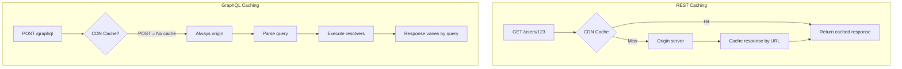
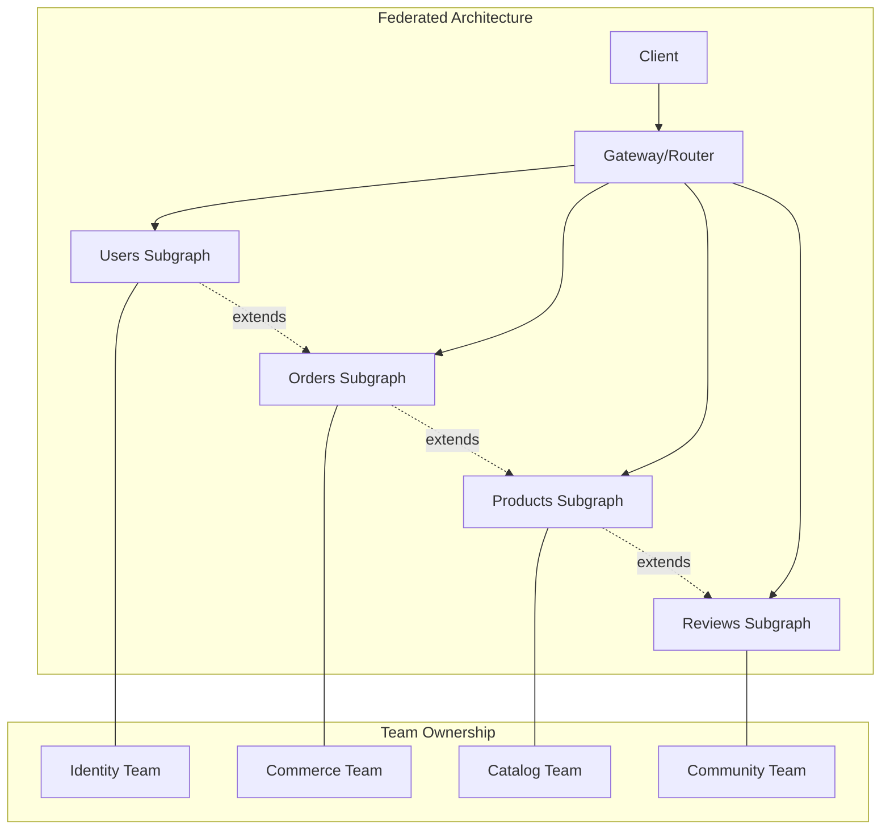
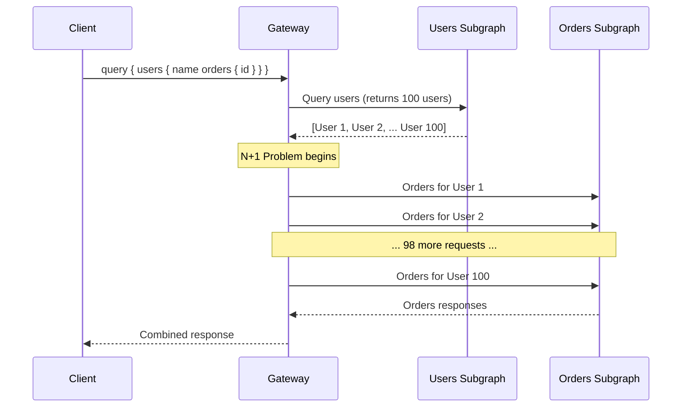
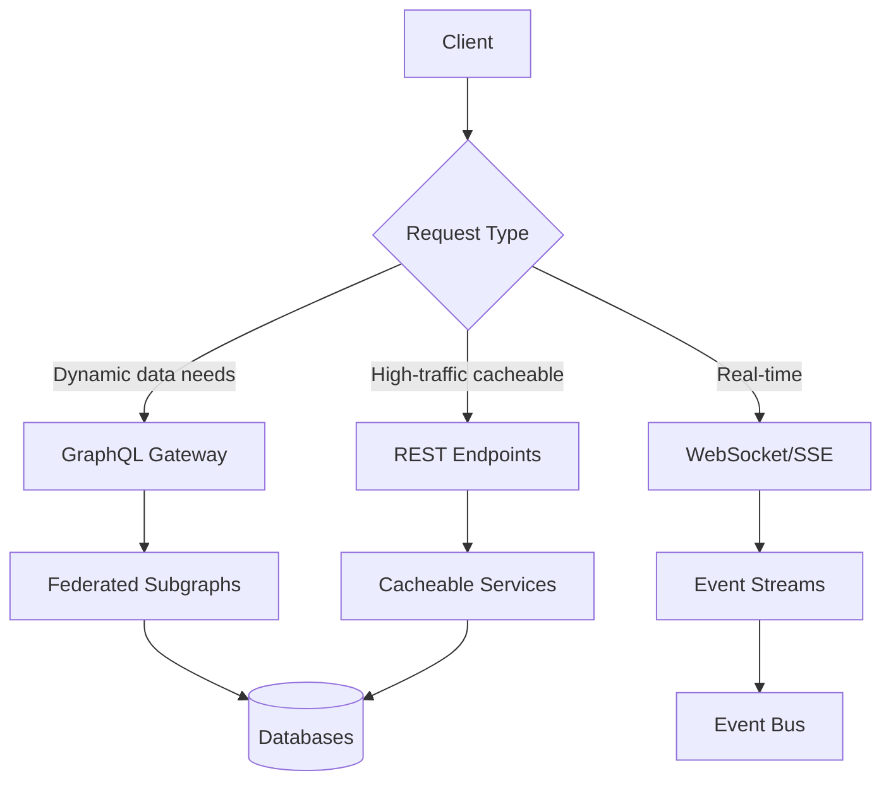

*[API]: Application Programming Interface
*[REST]: Representational State Transfer
*[CDN]: Content Delivery Network
*[TTL]: Time To Live
*[APQ]: Automatic Persisted Queries
*[SDL]: Schema Definition Language
*[N+1]: N+1 Query Problem
*[BFF]: Backend for Frontend

# GraphQL at the Edge: Federation and Caching Reality

## Introduction

Frame the GraphQL hype cycle reality: GraphQL promised to solve REST's over-fetching and under-fetching problems, and it does—but at a cost. The flexibility that makes GraphQL powerful for clients creates operational challenges for infrastructure teams: caching becomes hard, federation adds complexity, and N+1 problems move from the database to the gateway. This section sets honest expectations about when GraphQL is worth the complexity.

_Include a scenario: a team adopts GraphQL because "Netflix uses it." Two years later, they have a federated graph spanning 15 subgraphs, CDN cache hit rates have dropped from 90% to 30%, gateway latency is unpredictable, and they're considering a partial migration back to REST for high-traffic endpoints. The technology worked, but the operational burden exceeded what they bargained for._

<Callout type="warning">
GraphQL solves real problems—but it also creates new ones. Before adopting GraphQL, understand the caching, federation, and operational costs. Many teams would be better served by well-designed REST APIs with BFF patterns.
</Callout>

## The Caching Problem

### Why GraphQL Caching Is Fundamentally Harder


Figure: REST vs GraphQL caching at the edge.

```yaml title="caching-challenges.yaml"
graphql_caching_challenges:
  http_level:
    problem: "POST requests aren't cached by default"
    details: |
      GraphQL typically uses POST with query in body.
      CDNs and browsers don't cache POST requests.
      Even with GET, query strings create infinite cache key variations.
    workarounds:
      - "APQ (Automatic Persisted Queries)"
      - "GET requests with query parameter"
      - "Custom cache keys at CDN"
    effectiveness: "Partial - works for repeated queries only"

  response_granularity:
    problem: "Same endpoint returns different data shapes"
    details: |
      REST: /users/123 always returns same structure
      GraphQL: { user(id: 123) { name } } vs { user(id: 123) { name email orders { id } } }
      Each unique query shape needs its own cache entry.
    impact: "Cache hit rates drop dramatically"

  cache_invalidation:
    problem: "Can't invalidate by entity across queries"
    details: |
      User 123 changes. In REST, invalidate /users/123.
      In GraphQL, user 123 appears in unlimited query combinations.
      How do you find and invalidate all cached responses containing user 123?
    workarounds:
      - "Normalized caching (Apollo Client)"
      - "Tag-based invalidation"
      - "Short TTLs everywhere"
    effectiveness: "Complex, often results in just using short TTLs"

  partial_cacheability:
    problem: "One query may have mixed TTLs"
    details: |
      Query fetches user (cacheable 1 hour) and orders (cacheable 1 minute).
      Entire response gets shortest TTL (1 minute).
      Static data re-fetched unnecessarily.
    workarounds:
      - "Response-level cache directives"
      - "@cacheControl directive per field"
      - "Query splitting"
    effectiveness: "Requires discipline and tooling"

rest_caching_advantages:
  url_as_cache_key: "Natural, hierarchical cache keys"
  http_semantics: "GET cacheable by default, ETags work"
  predictable_responses: "Same URL = same structure"
  cdn_native: "Every CDN understands REST caching"
  invalidation: "Clear mapping from entity to URL"
```
Code: GraphQL caching challenges compared to REST.

### HTTP-Level Caching Strategies

```typescript title="apq-implementation.ts"
// Automatic Persisted Queries (APQ) - reduce query payload and enable GET caching

import { createHash } from 'crypto';

// Client side: Hash query and send hash instead of full query
class APQClient {
  private queryCache = new Map<string, string>();

  async executeQuery(query: string, variables: object): Promise<any> {
    const hash = this.hashQuery(query);

    // First attempt: send only hash
    let response = await this.sendRequest({
      extensions: {
        persistedQuery: {
          version: 1,
          sha256Hash: hash,
        },
      },
      variables,
    });

    // Server doesn't have query? Send full query with hash
    if (response.errors?.[0]?.message === 'PersistedQueryNotFound') {
      response = await this.sendRequest({
        query,
        extensions: {
          persistedQuery: {
            version: 1,
            sha256Hash: hash,
          },
        },
        variables,
      });
    }

    return response;
  }

  // With APQ, can use GET for cacheable queries
  private async sendRequest(payload: object): Promise<any> {
    const isQueryOnly = !('query' in payload);

    if (isQueryOnly && this.isCacheable(payload)) {
      // Use GET request - CDN can cache
      const params = new URLSearchParams({
        extensions: JSON.stringify(payload.extensions),
        variables: JSON.stringify(payload.variables),
      });

      return fetch(`/graphql?${params}`, {
        method: 'GET',
        headers: { 'Accept': 'application/json' },
      }).then(r => r.json());
    }

    // Fall back to POST
    return fetch('/graphql', {
      method: 'POST',
      headers: { 'Content-Type': 'application/json' },
      body: JSON.stringify(payload),
    }).then(r => r.json());
  }

  private hashQuery(query: string): string {
    // Normalize whitespace for consistent hashing
    const normalized = query.replace(/\s+/g, ' ').trim();
    return createHash('sha256').update(normalized).digest('hex');
  }
}
```
Code: Automatic Persisted Queries implementation.

```nginx title="cdn-graphql-caching.conf"
# Cloudflare/Nginx configuration for GraphQL caching

# Cache GET requests with persisted queries
location /graphql {
    # Only cache GET requests
    if ($request_method = GET) {
        # Cache key includes query hash and variables
        set $cache_key "$uri$arg_extensions$arg_variables";

        # Check for cache-control from origin
        proxy_cache graphql_cache;
        proxy_cache_key $cache_key;
        proxy_cache_valid 200 60s;  # Default 60s, origin can override
        proxy_cache_use_stale error timeout updating;

        # Pass through cache-control headers from origin
        proxy_ignore_headers Cache-Control;  # Let origin control
        add_header X-Cache-Status $upstream_cache_status;
    }

    # POST requests - no CDN caching, but allow origin caching headers
    if ($request_method = POST) {
        proxy_pass http://graphql_origin;
        # Origin may set Cache-Control: private for browser caching
    }

    proxy_pass http://graphql_origin;
}

# Separate cache for authenticated vs public
map $http_authorization $cache_bypass {
    default 0;
    "~Bearer" 1;  # Don't cache authenticated requests at CDN
}
```
Code: CDN configuration for GraphQL caching.

| Caching Strategy | Cache Hit Rate | Complexity | Best For |
|------------------|----------------|------------|----------|
| No caching | 0% | Low | Mutations, real-time |
| APQ + GET | 30-50% | Medium | Repeated public queries |
| Normalized client cache | 60-80% | High | Client-side deduplication |
| Response cache with tags | 40-60% | High | Known query patterns |
| Full REST for hot paths | 90%+ | Medium | High-traffic endpoints |

Table: GraphQL caching strategies comparison.

<Callout type="info">
APQ helps but doesn't solve the fundamental problem: infinite query variations mean infinite cache keys. For truly high-traffic, cacheable data, consider exposing REST endpoints alongside GraphQL.
</Callout>

## Federation Architecture

### When Federation Makes Sense


Figure: Federated GraphQL with team ownership.

```yaml title="federation-decision-framework.yaml"
federation_decision:
  when_federation_makes_sense:
    multiple_teams:
      signal: "3+ teams need to expose data in unified API"
      benefit: "Teams own their subgraphs independently"
      threshold: "If < 3 teams, monolithic schema is simpler"

    domain_boundaries:
      signal: "Clear domain boundaries exist"
      benefit: "Subgraphs map to bounded contexts"
      threshold: "If domains overlap heavily, federation adds friction"

    independent_deployment:
      signal: "Teams need to deploy independently"
      benefit: "Subgraph changes don't require coordinated releases"
      threshold: "If you deploy everything together anyway, no benefit"

    existing_services:
      signal: "Backend services already exist"
      benefit: "Subgraphs wrap existing services"
      threshold: "If building greenfield, consider monolith first"

  when_federation_is_overkill:
    small_team:
      signal: "Single team owns all API development"
      alternative: "Monolithic GraphQL schema"

    limited_graph:
      signal: "< 20 types, simple relationships"
      alternative: "Single GraphQL server"

    read_heavy:
      signal: "90%+ read traffic, few writes"
      alternative: "REST with aggressive caching"

    latency_critical:
      signal: "Every millisecond matters"
      alternative: "Direct service calls, skip gateway overhead"

federation_overhead:
  operational:
    - "Gateway deployment and scaling"
    - "Schema composition CI/CD"
    - "Distributed tracing across subgraphs"
    - "Version compatibility management"
  latency:
    - "Gateway parsing and planning: 5-20ms"
    - "Subgraph fan-out: parallel but adds network hops"
    - "Response stitching: 1-5ms"
  complexity:
    - "Query planning optimization"
    - "Error handling across subgraphs"
    - "Consistent authentication propagation"
```
Code: Federation decision framework.

### Subgraph Design Patterns

```graphql title="federation-schema-example.graphql"
# Users Subgraph - Identity Team
extend schema
  @link(url: "https://specs.apollo.dev/federation/v2.0",
        import: ["@key", "@shareable"])

type User @key(fields: "id") {
  id: ID!
  email: String!
  profile: UserProfile!
}

type UserProfile {
  displayName: String!
  avatarUrl: String
}

type Query {
  user(id: ID!): User
  me: User
}

# Orders Subgraph - Commerce Team
extend schema
  @link(url: "https://specs.apollo.dev/federation/v2.0",
        import: ["@key", "@external", "@requires"])

type Order @key(fields: "id") {
  id: ID!
  status: OrderStatus!
  total: Money!
  items: [OrderItem!]!
  placedAt: DateTime!
}

# Extend User from Users subgraph
type User @key(fields: "id") {
  id: ID! @external
  orders(first: Int = 10): [Order!]!
  orderCount: Int!
}

type Query {
  order(id: ID!): Order
}

# Products Subgraph - Catalog Team
extend schema
  @link(url: "https://specs.apollo.dev/federation/v2.0",
        import: ["@key"])

type Product @key(fields: "sku") {
  sku: ID!
  name: String!
  description: String!
  price: Money!
  inventory: Int!
}

# Extend OrderItem to include product details
type OrderItem @key(fields: "id") {
  id: ID! @external
  product: Product!
}
```
Code: Federation schema with entity extensions.

```typescript title="subgraph-reference-resolver.ts"
// Reference resolvers - how subgraphs resolve entities from other subgraphs

import { buildSubgraphSchema } from '@apollo/subgraph';

const resolvers = {
  // Reference resolver for User entity
  User: {
    // Called when another subgraph needs to resolve a User
    __resolveReference: async (reference: { id: string }, context) => {
      // reference contains only the key fields (id)
      return context.dataSources.users.getById(reference.id);
    },
  },

  Query: {
    user: (_, { id }, context) => context.dataSources.users.getById(id),
    me: (_, __, context) => context.dataSources.users.getById(context.userId),
  },
};

// Orders subgraph extending User
const ordersResolvers = {
  User: {
    // Resolver for orders field on User (defined in this subgraph)
    orders: async (user, { first }, context) => {
      // user.id comes from the reference
      return context.dataSources.orders.getByUserId(user.id, { limit: first });
    },
    orderCount: async (user, _, context) => {
      return context.dataSources.orders.countByUserId(user.id);
    },
  },

  Order: {
    __resolveReference: async (reference: { id: string }, context) => {
      return context.dataSources.orders.getById(reference.id);
    },
  },
};
```
Code: Reference resolvers for federated entities.

<Callout type="warning">
Federation's power comes from entity resolution across subgraphs. But every cross-subgraph reference is a network call. A query that looks simple can trigger dozens of subgraph requests. Use `@requires` and entity batching to minimize round trips.
</Callout>

## The N+1 Problem at the Gateway

### How N+1 Moves to the Gateway


Figure: N+1 problem in federated GraphQL.

```typescript title="dataloader-federation.ts"
// DataLoader pattern to batch entity resolution

import DataLoader from 'dataloader';

// In the Orders subgraph
class OrdersDataSource {
  private userOrdersLoader: DataLoader<string, Order[]>;

  constructor() {
    // Batch multiple user ID lookups into single query
    this.userOrdersLoader = new DataLoader(async (userIds: string[]) => {
      // Single database query for all user IDs
      const orders = await this.db.query(`
        SELECT * FROM orders
        WHERE user_id = ANY($1)
        ORDER BY user_id, placed_at DESC
      `, [userIds]);

      // Group by user ID, maintaining order
      const ordersByUser = new Map<string, Order[]>();
      for (const order of orders) {
        const existing = ordersByUser.get(order.userId) || [];
        existing.push(order);
        ordersByUser.set(order.userId, existing);
      }

      // Return in same order as input
      return userIds.map(id => ordersByUser.get(id) || []);
    });
  }

  async getOrdersForUser(userId: string): Promise<Order[]> {
    return this.userOrdersLoader.load(userId);
  }
}

// Gateway-level batching with Apollo Router
// router.yaml configuration
const routerConfig = `
supergraph:
  introspection: true

# Enable entity caching to reduce subgraph calls
preview_entity_cache:
  enabled: true
  redis:
    urls: ["redis://localhost:6379"]
  ttl: 60s

# Batch entity resolution
traffic_shaping:
  all:
    deduplicate_query: true  # Dedupe identical subgraph queries
  subgraphs:
    orders:
      # Batch entity resolution requests
      experimental_entity_caching:
        enabled: true
`;
```
Code: DataLoader and gateway-level batching.

### Query Planning Optimization

```yaml title="query-plan-analysis.yaml"
query_plan_optimization:
  original_query: |
    query {
      topProducts(first: 10) {
        name
        reviews {
          rating
          author {
            name
          }
        }
      }
    }

  naive_plan:
    steps:
      - fetch: "Products subgraph → 10 products"
      - fetch: "Reviews subgraph → reviews for each product (10 calls)"
      - fetch: "Users subgraph → author for each review (N calls)"
    total_calls: "10 + (10 * avg_reviews) + (10 * avg_reviews)"
    example: "10 + 50 + 50 = 110 subgraph calls"

  optimized_plan:
    steps:
      - fetch: "Products subgraph → 10 products"
      - batch_fetch: "Reviews subgraph → reviews for all 10 products (1 call)"
      - batch_fetch: "Users subgraph → all unique authors (1 call)"
    total_calls: "3 subgraph calls"
    technique: "Entity batching + deduplication"

  further_optimization:
    entity_caching:
      description: "Cache resolved entities"
      benefit: "Subsequent queries reuse cached users"
    query_deduplication:
      description: "Identical subgraph queries merged"
      benefit: "Multiple fields from same entity = 1 call"
    prefetching:
      description: "Predictive loading of likely-needed entities"
      benefit: "Reduced latency for common patterns"

query_complexity_analysis:
  depth_limit: 5
  cost_calculation: |
    cost = sum(field_cost * multiplier)
    where multiplier = parent_list_size
  example: |
    products(first: 10) {      # cost: 10
      reviews {                 # cost: 10 * avg_reviews (50)
        author {                # cost: 10 * avg_reviews * 1 (50)
          posts {               # cost: 10 * avg_reviews * avg_posts (500)
            ...
          }
        }
      }
    }
    Total cost: 610
  recommendation: "Block queries with cost > 1000"
```
Code: Query plan optimization analysis.

<Callout type="info">
The gateway's query planner is critical. A naive planner turns every nested field into sequential requests. Invest in understanding your gateway's planning and batching capabilities—the difference between 100 subgraph calls and 3 is the difference between success and failure.
</Callout>

## When to Stick with REST

### The Honest Comparison

```yaml title="graphql-vs-rest-comparison.yaml"
comparison_matrix:
  caching:
    rest:
      http_caching: "Native - CDNs understand GET"
      invalidation: "URL-based, straightforward"
      cache_hit_rates: "80-95% achievable"
    graphql:
      http_caching: "Complex - requires APQ or custom"
      invalidation: "Entity-based, requires tooling"
      cache_hit_rates: "30-60% typical"
    winner: "REST"

  client_flexibility:
    rest:
      data_fetching: "Fixed response shapes"
      over_fetching: "Common problem"
      under_fetching: "Multiple requests needed"
    graphql:
      data_fetching: "Client specifies exact needs"
      over_fetching: "Solved"
      under_fetching: "Solved"
    winner: "GraphQL"

  api_evolution:
    rest:
      versioning: "URL or header versioning"
      deprecation: "Version sunset"
      breaking_changes: "New version required"
    graphql:
      versioning: "Schema evolution, no versions"
      deprecation: "@deprecated directive"
      breaking_changes: "Additive changes only"
    winner: "GraphQL"

  tooling_ecosystem:
    rest:
      documentation: "OpenAPI/Swagger - mature"
      client_generation: "Excellent"
      testing: "Standard HTTP testing"
    graphql:
      documentation: "Schema is documentation"
      client_generation: "Good (codegen)"
      testing: "Specialized tooling needed"
    winner: "Tie"

  operational_complexity:
    rest:
      monitoring: "Standard HTTP metrics"
      debugging: "Request/response straightforward"
      performance: "Predictable"
    graphql:
      monitoring: "Query-level analysis needed"
      debugging: "Parse query, trace resolvers"
      performance: "Varies by query complexity"
    winner: "REST"

  team_scalability:
    rest:
      service_ownership: "Clear API boundaries"
      coordination: "API contracts"
      independence: "Full"
    graphql:
      service_ownership: "Subgraph ownership"
      coordination: "Schema composition"
      independence: "Federation helps"
    winner: "Tie (with federation)"
```
Code: Honest GraphQL vs REST comparison.

### Hybrid Architecture Patterns


Figure: Hybrid API architecture.

```typescript title="hybrid-api-architecture.ts"
// Hybrid architecture: REST for cacheable, GraphQL for dynamic

// REST endpoints for high-traffic, cacheable data
// /api/products/:sku - Product details (CDN cached 1 hour)
// /api/categories - Category listing (CDN cached 24 hours)
// /api/search?q=... - Search results (CDN cached 5 minutes)

// GraphQL for dynamic, personalized data
// User's cart, order history, recommendations, personalized content

import express from 'express';
import { ApolloServer } from '@apollo/server';

const app = express();

// REST: Cacheable product endpoint
app.get('/api/products/:sku', async (req, res) => {
  const product = await productService.getBySku(req.params.sku);

  // Strong caching for product data
  res.set({
    'Cache-Control': 'public, max-age=3600, s-maxage=3600',
    'CDN-Cache-Control': 'max-age=3600',
    'ETag': product.etag,
  });

  res.json(product);
});

// REST: Search with shorter cache
app.get('/api/search', async (req, res) => {
  const results = await searchService.search(req.query.q);

  res.set({
    'Cache-Control': 'public, max-age=300, s-maxage=300',
    'Vary': 'Accept-Encoding',
  });

  res.json(results);
});

// GraphQL: Dynamic, personalized data
const apolloServer = new ApolloServer({
  typeDefs,
  resolvers,
});

app.use('/graphql', expressMiddleware(apolloServer, {
  context: async ({ req }) => ({
    user: await authenticateUser(req),
    dataSources: createDataSources(),
  }),
}));

// Client-side: Choose the right API for the job
class ApiClient {
  // Use REST for cacheable data
  async getProduct(sku: string): Promise<Product> {
    const response = await fetch(`/api/products/${sku}`);
    return response.json();
  }

  // Use GraphQL for personalized data
  async getMyDashboard(): Promise<Dashboard> {
    return this.graphqlClient.query({
      query: gql`
        query MyDashboard {
          me {
            recentOrders { id status }
            recommendations { sku name }
            savedItems { sku name price }
          }
        }
      `,
    });
  }
}
```
Code: Hybrid REST/GraphQL architecture.

<Callout type="success">
The best architecture often uses both. REST for high-traffic, cacheable endpoints where CDN efficiency matters. GraphQL for dynamic, personalized experiences where client flexibility reduces round trips. Don't let technology tribalism prevent pragmatic choices.
</Callout>

## Operational Considerations

### Monitoring and Observability

```typescript title="graphql-observability.ts"
// GraphQL-specific monitoring setup

import { ApolloServerPluginUsageReporting } from '@apollo/server/plugin/usageReporting';

// Operation-level metrics
interface GraphQLOperationMetrics {
  operationName: string;
  operationType: 'query' | 'mutation' | 'subscription';
  duration: number;

  // GraphQL-specific
  complexity: number;
  depth: number;
  fieldCount: number;

  // Federation-specific
  subgraphCalls: number;
  subgraphLatency: Record<string, number>;

  // Caching
  cacheHits: number;
  cacheMisses: number;
}

// Custom plugin for detailed metrics
const metricsPlugin = {
  async requestDidStart() {
    const startTime = Date.now();

    return {
      async executionDidStart(requestContext) {
        return {
          willResolveField({ info }) {
            const fieldStart = Date.now();
            return () => {
              const fieldDuration = Date.now() - fieldStart;
              // Track slow fields
              if (fieldDuration > 100) {
                metrics.recordSlowField({
                  field: `${info.parentType.name}.${info.fieldName}`,
                  duration: fieldDuration,
                });
              }
            };
          },
        };
      },

      async willSendResponse(requestContext) {
        const duration = Date.now() - startTime;
        const operation = requestContext.document?.definitions[0];

        metrics.recordOperation({
          operationName: requestContext.operationName || 'anonymous',
          operationType: operation?.operation || 'unknown',
          duration,
          complexity: calculateComplexity(requestContext.document),
          depth: calculateDepth(requestContext.document),
          errors: requestContext.errors?.length || 0,
        });
      },
    };
  },
};

// Alerts specific to GraphQL
const graphqlAlerts = {
  slowQueries: {
    condition: 'p99_latency > 2000ms',
    action: 'Analyze query complexity, check subgraph health',
  },
  highComplexity: {
    condition: 'query_complexity > 500',
    action: 'Review query, consider blocking or optimization',
  },
  subgraphErrors: {
    condition: 'subgraph_error_rate > 1%',
    action: 'Check specific subgraph health',
  },
  cacheHitRate: {
    condition: 'cache_hit_rate < 30%',
    action: 'Review query patterns, APQ adoption',
  },
};
```
Code: GraphQL-specific observability setup.

### Schema Governance

```yaml title="schema-governance.yaml"
schema_governance:
  composition_checks:
    ci_pipeline:
      - "Schema validation (syntax, directives)"
      - "Composition check (subgraphs compose)"
      - "Breaking change detection"
      - "Federated entity consistency"
    blocking_violations:
      - "Removing fields without @deprecated"
      - "Changing field types incompatibly"
      - "Breaking entity key definitions"

  review_process:
    subgraph_changes:
      - "Team reviews own subgraph changes"
      - "Schema steward reviews entity extensions"
      - "Composition test required to merge"
    entity_extensions:
      - "Notify owning team when extending their entity"
      - "Review impact on query planning"
      - "Consider N+1 implications"

  deprecation_policy:
    process:
      - "Add @deprecated with removal date"
      - "Monitor usage of deprecated fields"
      - "Remove after 90 days with zero usage"
    communication:
      - "Changelog entry"
      - "Client team notification"
      - "Migration guide if needed"

  complexity_limits:
    depth: 10
    complexity: 1000
    rate_limit: "1000 queries/minute per client"
    enforcement: "Gateway rejects over-limit queries"
```
Code: Schema governance policy.

<Callout type="warning">
Schema changes in federated GraphQL affect every client. A breaking change in one subgraph can break queries across the entire graph. Invest in schema governance tooling—composition checks, breaking change detection, and deprecation tracking.
</Callout>

## Cost Analysis

### Total Cost of Ownership

```yaml title="graphql-tco-analysis.yaml"
cost_comparison:
  rest_api:
    infrastructure:
      cdn: "$500/month (high cache hit rate)"
      compute: "$2,000/month"
      database: "$1,000/month"
      total: "$3,500/month"
    development:
      initial: "Moderate (well-understood patterns)"
      ongoing: "Low (straightforward maintenance)"
    operations:
      monitoring: "Standard tools"
      debugging: "Straightforward"
      on_call: "Standard"

  graphql_federated:
    infrastructure:
      cdn: "$500/month (low cache hit rate, similar cost but less benefit)"
      gateway: "$1,500/month (additional tier)"
      subgraph_compute: "$3,000/month (more instances)"
      database: "$1,000/month"
      schema_registry: "$300/month"
      total: "$6,300/month (80% higher)"
    development:
      initial: "Higher (federation learning curve)"
      ongoing: "Higher (schema coordination, query optimization)"
    operations:
      monitoring: "Specialized GraphQL tools"
      debugging: "Complex (distributed traces)"
      on_call: "Requires GraphQL expertise"

  break_even_analysis:
    graphql_worth_it_when:
      - "Client flexibility saves 2+ API calls per page"
      - "Multiple client types (web, mobile, partners)"
      - "Team autonomy benefits > coordination costs"
      - "Development velocity improvement measurable"
    graphql_not_worth_it_when:
      - "Single client type"
      - "Mostly cacheable, read-heavy traffic"
      - "Small team (< 5 engineers)"
      - "Latency critical (every ms counts)"
```
Code: Total cost of ownership analysis.

| Factor | REST | GraphQL (Monolith) | GraphQL (Federated) |
|--------|------|-------------------|---------------------|
| Infrastructure cost | Low | Medium | High |
| CDN effectiveness | High | Medium | Low |
| Development complexity | Low | Medium | High |
| Client flexibility | Low | High | High |
| Team scalability | Medium | Low | High |
| Operational burden | Low | Medium | High |

Table: Cost comparison across API architectures.

<Callout type="info">
GraphQL's costs are real but sometimes worth it. The question isn't "is GraphQL better?" but "is GraphQL's flexibility worth its operational cost for our specific use case?" For many organizations, the answer is no—and that's okay.
</Callout>

## Conclusion

Summarize the pragmatic view: GraphQL solves real problems (over-fetching, under-fetching, API evolution) but creates others (caching complexity, federation overhead, operational burden). Federation makes sense for large organizations with multiple teams and clear domain boundaries. For smaller teams, simpler patterns often win. The best architectures are often hybrid—REST for cacheable public data, GraphQL for dynamic personalized experiences. Make technology choices based on your specific constraints, not industry hype.

<Callout type="success">
GraphQL is a tool, not a religion. Use it where it provides value: client flexibility, reduced round trips, schema evolution. Use REST where it excels: caching, simplicity, CDN efficiency. The goal is serving your users well, not technology purity.
</Callout>

---

## Cover Prompt

### Prompt 1: The Flexible vs Efficient

Create an image of two paths through a landscape. One path (REST) is a straight, well-paved highway with clear signage and rest stops (caches). The other path (GraphQL) is a flexible trail system that can go anywhere but has fewer amenities. Travelers on both paths reach the same destination. Style: journey metaphor, flexibility vs efficiency, path comparison, 16:9 aspect ratio.

### Prompt 2: The Federation Network

Design an image of interconnected islands (subgraphs), each with its own character, connected by bridges (the gateway). Ships (queries) navigate between islands, collecting cargo (data) from each. A central lighthouse (schema registry) coordinates traffic. Style: archipelago metaphor, distributed systems, maritime navigation, 16:9 aspect ratio.

### Prompt 3: The Cache Puzzle

Illustrate a warehouse (cache) with organized shelves for REST (labeled boxes: /users/123, /products/456). Next to it, a GraphQL section with shapeshifting boxes that resist organization. Workers try to sort the GraphQL responses but each one is unique. Style: warehouse logistics, organization vs chaos, storage challenge, 16:9 aspect ratio.

### Prompt 4: The N+1 Waterfall

Create an image of a waterfall where a single stream at the top (client query) splits into dozens of smaller streams (subgraph calls) as it falls. A dam (DataLoader) catches the streams and consolidates them into fewer, larger flows. Style: water flow metaphor, multiplying requests, batching visualization, 16:9 aspect ratio.

### Prompt 5: The Hybrid Blueprint

Design an image of an architect's table with blueprints showing a hybrid building. The foundation is solid REST (concrete, cacheable), the flexible interior spaces are GraphQL (adaptable, dynamic). Notes on the blueprint explain when to use each. Style: architectural planning, hybrid design, technical blueprint, 16:9 aspect ratio.
