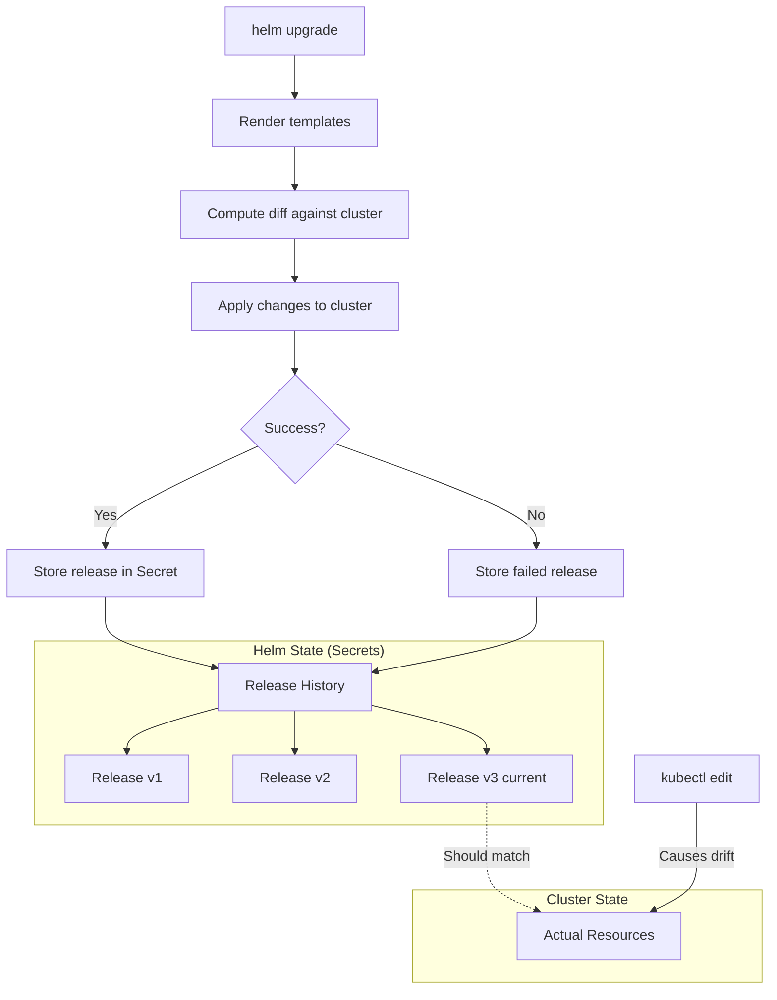
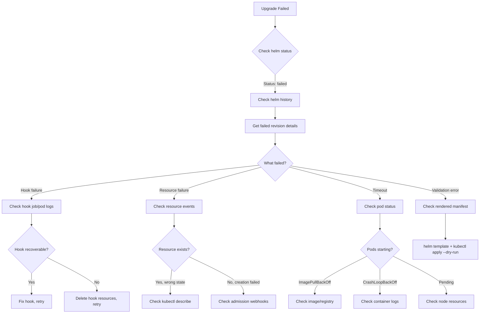

*[YAML]: YAML Ain't Markup Language
*[K8s]: Kubernetes
*[CRD]: Custom Resource Definition
*[CI]: Continuous Integration
*[CD]: Continuous Deployment
*[OCI]: Open Container Initiative
*[RBAC]: Role-Based Access Control
*[ConfigMap]: Kubernetes ConfigMap resource

# Helm Releases at Scale: Drift and Debugging

## Introduction

Frame the Helm management challenge: Helm makes deploying applications to Kubernetes easy, but managing hundreds of releases across multiple clusters becomes chaotic. Teams lose track of which chart versions are deployed where, manual kubectl edits cause drift from Helm state, failed releases leave clusters in inconsistent states, and debugging "helm upgrade failed" requires archaeology. This section establishes that Helm's simplicity at small scale becomes complexity at scale.

_Include a scenario: during an incident, an engineer tries to rollback a Helm release. The rollback fails because someone ran kubectl edit on the deployment weeks ago. The Helm state doesn't match the cluster state. Nobody knows what the actual configuration is. The team spends 45 minutes reconciling state instead of fixing the incident._

<Callout type="warning">
Helm tracks its own state, but the cluster is the source of truth. When these diverge—through manual edits, partial upgrades, or failed releases—Helm's model breaks down. At scale, drift isn't if, it's when.
</Callout>

## Understanding Helm State

### How Helm Tracks Releases


Figure: Helm state management and drift sources.

```yaml title="helm-release-secret.yaml"
# Helm stores release data in Secrets (or ConfigMaps)
# Secret name format: sh.helm.release.v1.<release-name>.v<revision>

apiVersion: v1
kind: Secret
metadata:
  name: sh.helm.release.v1.my-app.v3
  namespace: production
  labels:
    name: my-app
    owner: helm
    status: deployed
    version: "3"
type: helm.sh/release.v1
data:
  # Base64 + gzip encoded release data
  release: H4sIAAAAAAAAA...

# Decoded release data structure:
release_structure:
  name: "my-app"
  version: 3
  namespace: "production"
  info:
    status: "deployed"
    first_deployed: "2024-01-10T10:00:00Z"
    last_deployed: "2024-01-15T14:30:00Z"
    description: "Upgrade complete"
  chart:
    metadata:
      name: "my-app"
      version: "1.2.3"
      appVersion: "2.0.0"
  config:
    # Values used for this release
    replicaCount: 3
    image:
      repository: "myregistry/my-app"
      tag: "v2.0.0"
  manifest: |
    # Rendered Kubernetes manifests
    ---
    apiVersion: apps/v1
    kind: Deployment
    ...
```
Code: Helm release secret structure.

### State Inconsistency Patterns

```yaml title="drift-patterns.yaml"
drift_patterns:
  manual_kubectl_edit:
    description: "Direct cluster modification bypassing Helm"
    cause: "kubectl edit, kubectl patch, kubectl apply"
    symptoms:
      - "helm diff shows unexpected changes"
      - "helm upgrade reverts 'mystery' changes"
      - "Resource annotations don't match Helm metadata"
    detection: "Compare helm get manifest with kubectl get"

  partial_upgrade_failure:
    description: "Upgrade failed midway, some resources updated"
    cause: "Timeout, resource conflict, validation error"
    symptoms:
      - "Some pods on new version, some on old"
      - "ConfigMaps updated but Deployment not"
      - "Release status: failed"
    detection: "helm history shows failed, cluster state mixed"

  secret_storage_corruption:
    description: "Helm release secrets deleted or modified"
    cause: "Cleanup scripts, namespace recreation, manual deletion"
    symptoms:
      - "helm list doesn't show the release"
      - "Resources exist but Helm doesn't know about them"
      - "helm install fails with 'already exists'"
    detection: "Resources have helm labels but no release secret"

  hook_failure_orphans:
    description: "Pre/post hooks fail, leaving partial state"
    cause: "Job failures, timeout, resource constraints"
    symptoms:
      - "Release marked failed"
      - "Hook resources may or may not exist"
      - "Main resources may not be deployed"
    detection: "Check for orphaned hook jobs/pods"

  three_way_merge_conflicts:
    description: "Helm's three-way merge produces unexpected results"
    cause: "Complex diffs between old manifest, new manifest, live state"
    symptoms:
      - "Fields unexpectedly removed or retained"
      - "Strategic merge patch doesn't behave as expected"
    detection: "helm template + diff against live state"
```
Code: Common Helm drift patterns.

| Drift Type | Frequency | Severity | Recovery Difficulty |
|------------|-----------|----------|---------------------|
| Manual kubectl edit | High | Medium | Low |
| Partial upgrade failure | Medium | High | Medium |
| Secret storage corruption | Low | Critical | High |
| Hook failure orphans | Medium | Medium | Medium |
| Three-way merge conflicts | Low | High | High |

Table: Drift patterns by frequency and impact.

<Callout type="info">
Helm uses a three-way merge: old manifest, new manifest, live state. This usually works well, but manual changes to live state can create surprising merge results. When in doubt, use `--force` for a two-way merge (but understand the implications).
</Callout>

## Drift Detection

### Automated Drift Monitoring

```typescript title="drift-detection-service.ts"
import { KubeConfig, CoreV1Api, AppsV1Api } from '@kubernetes/client-node';
import * as yaml from 'js-yaml';
import { execSync } from 'child_process';

interface DriftReport {
  release: string;
  namespace: string;
  hasDrift: boolean;
  driftedResources: DriftedResource[];
  lastChecked: Date;
}

interface DriftedResource {
  kind: string;
  name: string;
  driftType: 'modified' | 'missing' | 'extra';
  fields: string[];
}

class HelmDriftDetector {
  constructor(
    private kubeconfig: KubeConfig,
    private coreApi: CoreV1Api,
  ) {}

  async detectDrift(release: string, namespace: string): Promise<DriftReport> {
    // Get Helm's view of what should be deployed
    const helmManifest = this.getHelmManifest(release, namespace);
    const helmResources = this.parseManifests(helmManifest);

    // Get actual cluster state
    const clusterResources = await this.getClusterResources(helmResources, namespace);

    const driftedResources: DriftedResource[] = [];

    for (const helmResource of helmResources) {
      const clusterResource = clusterResources.get(
        `${helmResource.kind}/${helmResource.metadata.name}`
      );

      if (!clusterResource) {
        driftedResources.push({
          kind: helmResource.kind,
          name: helmResource.metadata.name,
          driftType: 'missing',
          fields: [],
        });
        continue;
      }

      // Compare specs (ignoring status, metadata managed by k8s)
      const driftedFields = this.compareResources(helmResource, clusterResource);
      if (driftedFields.length > 0) {
        driftedResources.push({
          kind: helmResource.kind,
          name: helmResource.metadata.name,
          driftType: 'modified',
          fields: driftedFields,
        });
      }
    }

    return {
      release,
      namespace,
      hasDrift: driftedResources.length > 0,
      driftedResources,
      lastChecked: new Date(),
    };
  }

  private getHelmManifest(release: string, namespace: string): string {
    return execSync(
      `helm get manifest ${release} -n ${namespace}`,
      { encoding: 'utf-8' }
    );
  }

  private compareResources(helm: any, cluster: any): string[] {
    const driftedFields: string[] = [];

    // Deep compare spec, ignoring certain fields
    const ignoredFields = [
      'metadata.resourceVersion',
      'metadata.uid',
      'metadata.generation',
      'metadata.creationTimestamp',
      'metadata.managedFields',
      'status',
    ];

    const compareObject = (helmObj: any, clusterObj: any, path: string = '') => {
      for (const key of Object.keys(helmObj)) {
        const fullPath = path ? `${path}.${key}` : key;

        if (ignoredFields.some(f => fullPath.startsWith(f))) continue;

        if (typeof helmObj[key] === 'object' && helmObj[key] !== null) {
          if (!clusterObj[key]) {
            driftedFields.push(fullPath);
          } else {
            compareObject(helmObj[key], clusterObj[key], fullPath);
          }
        } else if (helmObj[key] !== clusterObj[key]) {
          driftedFields.push(fullPath);
        }
      }
    };

    compareObject(helm.spec, cluster.spec, 'spec');
    return driftedFields;
  }
}
```
Code: Drift detection service implementation.

### Helm Diff Plugin

```bash title="helm-diff-usage.sh"
#!/bin/bash
# Using helm-diff plugin for drift detection

# Install helm-diff plugin
helm plugin install https://github.com/databus23/helm-diff

# Show what would change on upgrade (rendered templates vs cluster)
helm diff upgrade my-release ./my-chart \
  --namespace production \
  --values values-prod.yaml \
  --detailed-exitcode  # Exit 2 if changes, 0 if none, 1 if error

# Compare current release against live cluster state (drift detection)
helm diff revision my-release 0 \
  --namespace production

# Output with context for review
helm diff upgrade my-release ./my-chart \
  --namespace production \
  --values values-prod.yaml \
  --context 5 \
  --output dyff  # Use dyff for better diff visualization

# In CI/CD pipeline
check_drift() {
  local release=$1
  local namespace=$2

  drift_output=$(helm diff revision "$release" 0 -n "$namespace" 2>&1)

  if [[ -n "$drift_output" ]]; then
    echo "⚠️  Drift detected for $release in $namespace:"
    echo "$drift_output"

    # Alert on drift
    curl -X POST "$SLACK_WEBHOOK" \
      -H 'Content-Type: application/json' \
      -d "{\"text\": \"Helm drift detected: $release in $namespace\"}"

    return 1
  fi

  echo "✅ No drift for $release"
  return 0
}

# Check all releases in namespace
for release in $(helm list -n production -q); do
  check_drift "$release" "production"
done
```
Code: Helm diff plugin for drift detection.

```yaml title="drift-detection-cronjob.yaml"
# Kubernetes CronJob for automated drift detection
apiVersion: batch/v1
kind: CronJob
metadata:
  name: helm-drift-detector
  namespace: platform
spec:
  schedule: "0 */4 * * *"  # Every 4 hours
  jobTemplate:
    spec:
      template:
        spec:
          serviceAccountName: helm-drift-detector
          containers:
          - name: detector
            image: alpine/helm:3.14
            command:
            - /bin/sh
            - -c
            - |
              # Install diff plugin
              helm plugin install https://github.com/databus23/helm-diff

              # Check all namespaces
              for ns in production staging; do
                echo "Checking namespace: $ns"
                for release in $(helm list -n $ns -q); do
                  echo "Checking release: $release"

                  drift=$(helm diff revision $release 0 -n $ns 2>&1)
                  if [[ -n "$drift" ]]; then
                    echo "DRIFT DETECTED: $release in $ns"
                    echo "$drift"

                    # Post to monitoring
                    cat <<EOF | curl -X POST -d @- $METRICS_ENDPOINT
                    {
                      "metric": "helm_drift_detected",
                      "value": 1,
                      "labels": {
                        "release": "$release",
                        "namespace": "$ns"
                      }
                    }
              EOF
                  fi
                done
              done
            env:
            - name: METRICS_ENDPOINT
              value: "http://pushgateway:9091/metrics/job/helm-drift"
          restartPolicy: OnFailure
```
Code: Automated drift detection CronJob.

<Callout type="success">
Run drift detection continuously, not just before upgrades. Discovering drift during an incident is the worst time. Scheduled drift checks with alerting catch problems before they become emergencies.
</Callout>

## Release Inventory Management

### Tracking Releases Across Clusters

```typescript title="release-inventory.ts"
interface HelmRelease {
  name: string;
  namespace: string;
  cluster: string;

  // Chart info
  chartName: string;
  chartVersion: string;
  appVersion: string;

  // Release state
  revision: number;
  status: 'deployed' | 'failed' | 'pending-upgrade' | 'uninstalling';
  lastDeployed: Date;

  // Values checksum for comparison
  valuesChecksum: string;

  // Metadata
  labels: Record<string, string>;
  annotations: Record<string, string>;
}

interface ReleaseInventory {
  releases: HelmRelease[];
  lastSync: Date;

  // Aggregations
  byCluster: Map<string, HelmRelease[]>;
  byChart: Map<string, HelmRelease[]>;
  byStatus: Map<string, HelmRelease[]>;
}

class ReleaseInventoryService {
  private clusters: ClusterConnection[];

  async syncInventory(): Promise<ReleaseInventory> {
    const allReleases: HelmRelease[] = [];

    for (const cluster of this.clusters) {
      const releases = await this.getClusterReleases(cluster);
      allReleases.push(...releases);
    }

    return {
      releases: allReleases,
      lastSync: new Date(),
      byCluster: this.groupBy(allReleases, r => r.cluster),
      byChart: this.groupBy(allReleases, r => r.chartName),
      byStatus: this.groupBy(allReleases, r => r.status),
    };
  }

  async getClusterReleases(cluster: ClusterConnection): Promise<HelmRelease[]> {
    const output = await cluster.exec(
      'helm list --all-namespaces --output json'
    );

    const releases = JSON.parse(output);
    return releases.map((r: any) => ({
      name: r.name,
      namespace: r.namespace,
      cluster: cluster.name,
      chartName: this.parseChartName(r.chart),
      chartVersion: this.parseChartVersion(r.chart),
      appVersion: r.app_version,
      revision: parseInt(r.revision),
      status: r.status,
      lastDeployed: new Date(r.updated),
      valuesChecksum: '', // Compute separately
      labels: {},
      annotations: {},
    }));
  }

  // Find version inconsistencies across clusters
  findVersionInconsistencies(): VersionInconsistency[] {
    const inconsistencies: VersionInconsistency[] = [];

    for (const [chartName, releases] of this.inventory.byChart) {
      const versions = new Set(releases.map(r => r.chartVersion));

      if (versions.size > 1) {
        inconsistencies.push({
          chartName,
          versions: Array.from(versions),
          releases: releases.map(r => ({
            cluster: r.cluster,
            namespace: r.namespace,
            name: r.name,
            version: r.chartVersion,
          })),
        });
      }
    }

    return inconsistencies;
  }

  // Generate upgrade report
  generateUpgradeReport(targetChart: string, targetVersion: string): UpgradeReport {
    const releases = this.inventory.byChart.get(targetChart) || [];

    return {
      targetChart,
      targetVersion,
      needsUpgrade: releases.filter(r => r.chartVersion !== targetVersion),
      alreadyCurrent: releases.filter(r => r.chartVersion === targetVersion),
      failed: releases.filter(r => r.status === 'failed'),
    };
  }
}
```
Code: Release inventory management service.

### Version Consistency Dashboard

```yaml title="release-dashboard-queries.yaml"
# Prometheus/Grafana queries for Helm release monitoring

metrics:
  helm_release_info:
    description: "Release metadata as labels"
    query: |
      helm_release_info{
        release="$release",
        namespace="$namespace",
        chart="$chart"
      }

  version_distribution:
    description: "Count of releases by chart version"
    query: |
      count by (chart, chart_version) (
        helm_release_info{status="deployed"}
      )

  outdated_releases:
    description: "Releases not on latest version"
    query: |
      helm_release_info{status="deployed"}
      unless on (chart)
      (
        max by (chart) (helm_release_info{status="deployed"})
      )

  failed_releases:
    description: "Currently failed releases"
    query: |
      helm_release_info{status="failed"}

  release_age:
    description: "Days since last deployment"
    query: |
      (time() - helm_release_last_deployed_timestamp) / 86400

  stale_releases:
    description: "Releases not updated in 30+ days"
    query: |
      (time() - helm_release_last_deployed_timestamp) / 86400 > 30

alerts:
  - alert: HelmReleaseFailed
    expr: helm_release_info{status="failed"} == 1
    for: 5m
    labels:
      severity: warning
    annotations:
      summary: "Helm release {{ $labels.release }} is in failed state"

  - alert: HelmVersionInconsistency
    expr: count by (chart) (count by (chart, chart_version) (helm_release_info{status="deployed"})) > 1
    for: 1h
    labels:
      severity: info
    annotations:
      summary: "Chart {{ $labels.chart }} has multiple versions deployed"

  - alert: HelmDriftDetected
    expr: helm_drift_detected == 1
    for: 5m
    labels:
      severity: warning
    annotations:
      summary: "Drift detected for {{ $labels.release }} in {{ $labels.namespace }}"
```
Code: Release monitoring dashboard queries.

| Metric | Purpose | Alert Threshold |
|--------|---------|-----------------|
| Release count by status | Track failed releases | Any release in failed > 1h |
| Version distribution | Identify inconsistencies | > 1 version per chart |
| Drift detected | Cluster/Helm divergence | Any drift > 4h |
| Release age | Stale deployments | > 30 days without update |
| Revision count | Frequent changes | > 10 revisions/day |

Table: Key Helm release metrics.

<Callout type="info">
Export Helm release metadata as Prometheus metrics. This enables dashboards showing version consistency across clusters, alerting on failed releases, and tracking deployment frequency. The helm-exporter project provides this out of the box.
</Callout>

## Upgrade Strategies

### Safe Upgrade Patterns

```yaml title="upgrade-strategies.yaml"
upgrade_strategies:
  canary_upgrade:
    description: "Upgrade one cluster/namespace first, verify, then roll out"
    process:
      - "Upgrade in staging environment"
      - "Run smoke tests, verify metrics"
      - "Upgrade canary production namespace"
      - "Monitor for errors, latency regression"
      - "Proceed with remaining production namespaces"
    rollback_trigger: "Error rate > 1% or p99 latency increase > 20%"

  blue_green_release:
    description: "Deploy new release alongside old, switch traffic"
    process:
      - "helm install new-release (different name)"
      - "Verify new release health"
      - "Switch traffic (Istio, Ingress update)"
      - "helm uninstall old-release"
    use_when: "Zero-downtime required, stateless services"

  rolling_namespace:
    description: "Upgrade namespaces one at a time"
    process:
      - "List all namespaces with release"
      - "Upgrade namespace 1, verify"
      - "Upgrade namespace 2, verify"
      - "Continue until complete"
    use_when: "Multi-tenant, isolated failure domains"

  atomic_upgrade:
    description: "All-or-nothing upgrade with automatic rollback"
    command: "helm upgrade --atomic --timeout 5m"
    behavior:
      - "Waits for all resources to be ready"
      - "Auto-rollback on failure"
      - "Single transaction semantics"
    use_when: "Strong consistency required"
```
Code: Helm upgrade strategy patterns.

```bash title="safe-upgrade-script.sh"
#!/bin/bash
# Safe Helm upgrade with validation

set -euo pipefail

RELEASE=$1
CHART=$2
NAMESPACE=$3
VALUES_FILE=$4

echo "=== Pre-upgrade validation ==="

# Check for drift before upgrade
echo "Checking for drift..."
drift=$(helm diff upgrade "$RELEASE" "$CHART" -n "$NAMESPACE" -f "$VALUES_FILE" 2>&1)
if [[ -z "$drift" ]]; then
  echo "No changes detected, skipping upgrade"
  exit 0
fi

echo "Changes to apply:"
echo "$drift"

# Validate chart
echo "Validating chart..."
helm lint "$CHART" -f "$VALUES_FILE"

# Dry run
echo "Running dry-run..."
helm upgrade "$RELEASE" "$CHART" \
  -n "$NAMESPACE" \
  -f "$VALUES_FILE" \
  --dry-run \
  --debug

# Prompt for confirmation in interactive mode
if [[ -t 0 ]]; then
  read -p "Proceed with upgrade? (y/n) " -n 1 -r
  echo
  if [[ ! $REPLY =~ ^[Yy]$ ]]; then
    echo "Upgrade cancelled"
    exit 1
  fi
fi

echo "=== Performing upgrade ==="

# Upgrade with atomic (auto-rollback on failure)
helm upgrade "$RELEASE" "$CHART" \
  -n "$NAMESPACE" \
  -f "$VALUES_FILE" \
  --atomic \
  --timeout 10m \
  --wait \
  --cleanup-on-fail

echo "=== Post-upgrade validation ==="

# Verify deployment health
echo "Waiting for deployments to be ready..."
kubectl rollout status deployment -n "$NAMESPACE" -l "app.kubernetes.io/instance=$RELEASE" --timeout=5m

# Run smoke tests if available
if [[ -f "tests/smoke-test.sh" ]]; then
  echo "Running smoke tests..."
  ./tests/smoke-test.sh "$NAMESPACE"
fi

# Check for errors in logs
echo "Checking for errors in recent logs..."
error_count=$(kubectl logs -n "$NAMESPACE" -l "app.kubernetes.io/instance=$RELEASE" --since=2m 2>/dev/null | grep -c -i "error\|exception\|fatal" || true)
if [[ $error_count -gt 10 ]]; then
  echo "⚠️  Warning: $error_count errors found in logs"
fi

echo "✅ Upgrade complete: $RELEASE in $NAMESPACE"
```
Code: Safe upgrade script with validation.

<Callout type="warning">
Always use `--atomic` for production upgrades. Without it, a failed upgrade leaves you in an inconsistent state—some resources updated, some not, release marked failed. With `--atomic`, Helm automatically rolls back on any failure.
</Callout>

## Debugging Failed Releases

### Diagnosis Workflow


Figure: Helm failure diagnosis workflow.

```bash title="helm-debug-commands.sh"
#!/bin/bash
# Helm debugging command reference

# === Release State ===

# Current release status
helm status my-release -n production

# Release history with all revisions
helm history my-release -n production

# Get manifest from specific revision
helm get manifest my-release -n production --revision 5

# Get values from specific revision
helm get values my-release -n production --revision 5

# Get all info (manifest, values, notes, hooks)
helm get all my-release -n production

# === Comparing Revisions ===

# Diff between revisions
helm diff revision my-release 4 5 -n production

# Diff current vs what would be deployed
helm diff upgrade my-release ./my-chart -n production -f values.yaml

# === Hook Debugging ===

# List hook resources
kubectl get jobs,pods -n production -l "app.kubernetes.io/instance=my-release,helm.sh/hook"

# Get hook job logs
kubectl logs -n production -l "app.kubernetes.io/instance=my-release,helm.sh/hook=pre-upgrade"

# === Resource Debugging ===

# Get events for release resources
kubectl get events -n production --field-selector involvedObject.name=my-release-deployment

# Describe failing resources
kubectl describe deployment my-release -n production

# Check pod status
kubectl get pods -n production -l "app.kubernetes.io/instance=my-release" -o wide

# === Template Debugging ===

# Render templates locally
helm template my-release ./my-chart -f values.yaml --debug

# Validate against cluster
helm template my-release ./my-chart -f values.yaml | kubectl apply --dry-run=server -f -

# Show computed values
helm template my-release ./my-chart -f values.yaml --show-only templates/deployment.yaml

# === Recovery Commands ===

# Rollback to previous revision
helm rollback my-release 4 -n production

# Rollback with force (recreate resources)
helm rollback my-release 4 -n production --force

# Uninstall keeping history
helm uninstall my-release -n production --keep-history

# Reinstall after failed release
helm uninstall my-release -n production
helm install my-release ./my-chart -n production -f values.yaml
```
Code: Helm debugging command reference.

### Common Failure Patterns and Fixes

```yaml title="failure-patterns.yaml"
common_failures:
  hook_timeout:
    symptoms:
      - "Release status: pending-upgrade or pending-install"
      - "Hook job still running or failed"
    diagnosis: |
      kubectl get jobs -n $NS -l "helm.sh/hook"
      kubectl logs job/$HOOK_JOB -n $NS
    fixes:
      - "Increase hook timeout in chart"
      - "Fix hook script issues"
      - "Delete stuck hook resources, re-run upgrade"
    recovery: |
      kubectl delete job $HOOK_JOB -n $NS
      helm upgrade $RELEASE $CHART --no-hooks  # Skip hooks temporarily

  resource_already_exists:
    symptoms:
      - "Error: cannot create resource: already exists"
      - "Resources from previous failed install"
    diagnosis: |
      kubectl get all -n $NS -l "app.kubernetes.io/instance=$RELEASE"
      kubectl get secrets -n $NS | grep "sh.helm.release"
    fixes:
      - "Adopt existing resources with --force"
      - "Delete orphaned resources, reinstall"
    recovery: |
      # Option 1: Force adoption
      helm upgrade $RELEASE $CHART --force

      # Option 2: Clean reinstall
      kubectl delete all -n $NS -l "app.kubernetes.io/instance=$RELEASE"
      helm uninstall $RELEASE --keep-history || true
      helm install $RELEASE $CHART -n $NS

  image_pull_failure:
    symptoms:
      - "Pods in ImagePullBackOff"
      - "Release times out waiting for pods"
    diagnosis: |
      kubectl describe pod $POD -n $NS | grep -A5 "Events:"
      kubectl get events -n $NS --field-selector reason=Failed
    fixes:
      - "Check image name/tag in values"
      - "Verify registry credentials (imagePullSecrets)"
      - "Check network connectivity to registry"
    recovery: |
      # After fixing image/credentials
      helm upgrade $RELEASE $CHART --reuse-values --force

  admission_webhook_rejection:
    symptoms:
      - "Error: admission webhook denied the request"
      - "Policy violation messages"
    diagnosis: |
      # Check which webhooks exist
      kubectl get validatingwebhookconfigurations
      kubectl get mutatingwebhookconfigurations

      # Dry-run to see rejection
      helm template $RELEASE $CHART | kubectl apply --dry-run=server -f -
    fixes:
      - "Update manifest to comply with policies"
      - "Add required labels/annotations"
      - "Request policy exception"
    recovery: |
      # Fix values/templates to comply, then upgrade

  resource_quota_exceeded:
    symptoms:
      - "Error: exceeded quota"
      - "Pods pending, events show quota rejection"
    diagnosis: |
      kubectl describe resourcequota -n $NS
      kubectl describe limitrange -n $NS
    fixes:
      - "Reduce resource requests in values"
      - "Request quota increase"
      - "Delete unused releases to free quota"
    recovery: |
      # After adjusting resources or quota
      helm upgrade $RELEASE $CHART --reuse-values
```
Code: Common failure patterns and recovery procedures.

<Callout type="success">
When a release is stuck in "pending-upgrade", the release lock prevents further operations. Check for stuck hooks first (`kubectl get jobs -l helm.sh/hook`). If needed, manually delete the hook job and the release secret for the pending revision, then retry.
</Callout>

## GitOps Integration

### Helm with Flux or ArgoCD

```yaml title="flux-helmrelease.yaml"
# Flux HelmRelease for GitOps-managed Helm
apiVersion: helm.toolkit.fluxcd.io/v2beta1
kind: HelmRelease
metadata:
  name: my-app
  namespace: production
spec:
  interval: 5m
  chart:
    spec:
      chart: my-app
      version: "1.2.x"  # Semver range for auto-updates
      sourceRef:
        kind: HelmRepository
        name: my-charts
        namespace: flux-system

  values:
    replicaCount: 3
    image:
      repository: myregistry/my-app
      tag: v2.0.0

  # Drift detection and remediation
  install:
    remediation:
      retries: 3
  upgrade:
    remediation:
      retries: 3
      remediateLastFailure: true
    cleanupOnFail: true

  # Automatic drift correction
  driftDetection:
    mode: enabled  # warn or enabled
    ignore:
      # Ignore fields that may legitimately drift
      - paths: ["/spec/replicas"]
        target:
          kind: Deployment

  # Health checks
  test:
    enable: true

  # Rollback on failure
  rollback:
    cleanupOnFail: true
    timeout: 5m
```
Code: Flux HelmRelease with drift detection.

```yaml title="argocd-application.yaml"
# ArgoCD Application for Helm chart
apiVersion: argoproj.io/v1alpha1
kind: Application
metadata:
  name: my-app
  namespace: argocd
spec:
  project: default

  source:
    repoURL: https://charts.example.com
    chart: my-app
    targetRevision: 1.2.3
    helm:
      values: |
        replicaCount: 3
        image:
          repository: myregistry/my-app
          tag: v2.0.0

  destination:
    server: https://kubernetes.default.svc
    namespace: production

  syncPolicy:
    automated:
      prune: true
      selfHeal: true  # Auto-correct drift
    syncOptions:
      - CreateNamespace=true
      - PruneLast=true
    retry:
      limit: 5
      backoff:
        duration: 5s
        factor: 2
        maxDuration: 3m

  # Ignore differences in certain fields
  ignoreDifferences:
    - group: apps
      kind: Deployment
      jsonPointers:
        - /spec/replicas  # Managed by HPA
```
Code: ArgoCD Application with self-healing.

```yaml title="gitops-drift-prevention.yaml"
# GitOps best practices for drift prevention

drift_prevention:
  source_of_truth:
    principle: "Git is the only way to change cluster state"
    implementation:
      - "Disable direct kubectl access for non-emergency"
      - "All changes via PR to GitOps repo"
      - "Automated sync from Git to cluster"

  self_healing:
    principle: "Automatically correct drift"
    flux: "driftDetection.mode: enabled"
    argocd: "syncPolicy.automated.selfHeal: true"
    warning: "Some drift is intentional (HPA replicas)"

  change_tracking:
    principle: "All changes auditable"
    implementation:
      - "Git history = deployment history"
      - "PR reviews for all changes"
      - "Automated change notifications"

  emergency_access:
    principle: "Break-glass for emergencies"
    implementation:
      - "Separate emergency ServiceAccount"
      - "Audit log for all emergency access"
      - "Automated ticket creation on break-glass"
      - "Reconcile emergency changes to Git within 24h"
```
Code: GitOps drift prevention best practices.

<Callout type="info">
GitOps tools like Flux and ArgoCD provide continuous drift detection and correction. The cluster state is continuously reconciled to match Git. Manual changes are automatically reverted. This eliminates drift as a category of problems—but requires discipline to make all changes via Git.
</Callout>

## Conclusion

Summarize the key practices for Helm at scale: understand how Helm state works and where drift originates; implement automated drift detection with alerting; maintain a release inventory across clusters; use safe upgrade patterns (--atomic, canary, blue-green); develop systematic debugging workflows for failed releases; and consider GitOps tools for continuous reconciliation. Emphasize that Helm's simplicity at small scale requires operational discipline at large scale—the tools exist, but you must use them consistently.

<Callout type="success">
The goal is confidence: confidence that you know what's deployed, confidence that cluster state matches Helm state, confidence that you can upgrade safely and rollback quickly. Build that confidence through automation, monitoring, and process—not heroics during incidents.
</Callout>

---

## Cover Prompt

### Prompt 1: The Release Map

Create an image of a captain's navigation room with a large map table showing multiple clusters as islands. Ships (releases) are tracked with pins showing their versions and status. Some pins are green (healthy), some yellow (drift detected), some red (failed). A navigator updates the map. Style: maritime cartography, fleet tracking, status visualization, 16:9 aspect ratio.

### Prompt 2: The Drift Detection Radar

Design an image of a radar screen in a control room. The radar shows Kubernetes clusters as regions, with releases as blips. Some blips are steady (in sync), others are flickering or shifting position (drift detected). An operator monitors the screen, ready to respond to anomalies. Style: military radar aesthetic, detection systems, monitoring station, 16:9 aspect ratio.

### Prompt 3: The Upgrade Pipeline

Illustrate a factory assembly line where Helm charts enter one end and deployed releases exit the other. Quality control stations (validation, diff, testing) check each release. A conveyor shows the progression: lint → template → diff → upgrade → verify. Rejected releases are diverted to a repair station. Style: manufacturing process, quality control, pipeline visualization, 16:9 aspect ratio.

### Prompt 4: The Archaeology Dig

Create an image of archaeologists excavating layers of Helm release history. Each layer represents a revision, with artifacts (manifests, values, hooks) being carefully cataloged. Some layers show successful deployments, others show evidence of failures. Tools labeled "helm history" and "helm get" are used for excavation. Style: archaeological dig, historical layers, discovery process, 16:9 aspect ratio.

### Prompt 5: The Reconciliation Engine

Design an image of a balance scale where one side holds "Git State" and the other holds "Cluster State." A mechanical system (GitOps controller) continuously adjusts weights to keep them balanced. When drift occurs, the system automatically corrects. Flux and ArgoCD logos visible on the machinery. Style: mechanical balance, continuous adjustment, automated correction, 16:9 aspect ratio.
