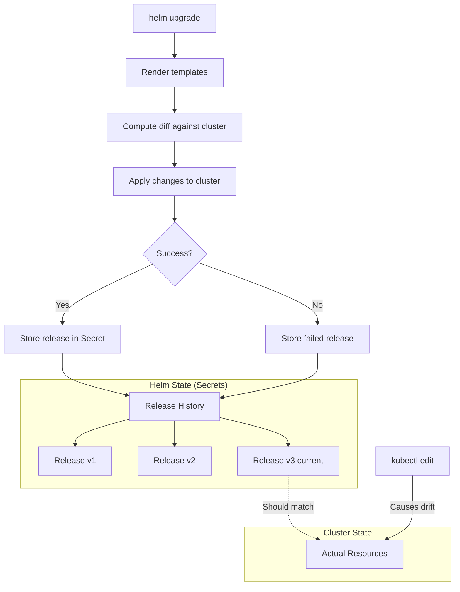
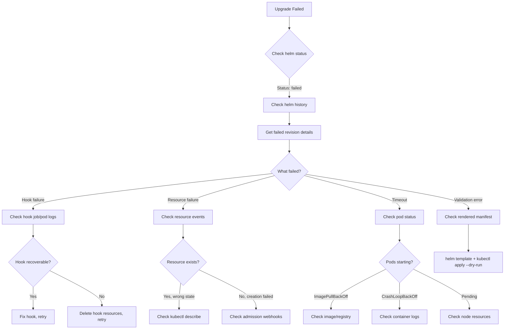

*[YAML]: YAML Ain't Markup Language
*[K8s]: Kubernetes
*[CRD]: Custom Resource Definition
*[CI]: Continuous Integration
*[CD]: Continuous Deployment
*[OCI]: Open Container Initiative
*[RBAC]: Role-Based Access Control
*[ConfigMap]: Kubernetes ConfigMap resource

Helm makes deploying applications to Kubernetes straightforward. Write a chart, run `helm install`, and your app materializes in the cluster. But that simplicity doesn't scale. When you're managing dozens of services across multiple clusters, you lose track of which chart versions are deployed where, which releases are drifting from their declared state, and why that upgrade failed at 2 AM.

I've spent time untangling Helm state in production clusters, and the pattern is always the same: everything works fine until it doesn't. Someone runs `kubectl edit` to hotfix a deployment during an incident. A failed upgrade leaves resources in a partially-updated state. A cleanup script accidentally deletes Helm's release secrets. Now nobody knows what's actually deployed.

Here's a scenario I've seen more than once. During an incident, an engineer tries to rollback a Helm release to a known-good state. The rollback fails. Turns out someone ran `kubectl edit` on the deployment three weeks ago to bump memory limits. Helm's stored manifest doesn't match what's in the cluster, so the three-way merge produces unexpected results. The team spends 45 minutes reconciling state instead of fixing the actual problem.

This article covers the operational side of Helm at scale: understanding how Helm tracks state, detecting drift before it causes incidents, maintaining a release inventory across clusters, debugging failed releases systematically, and integrating with GitOps tools for continuous reconciliation.

<Callout type="warning">
Helm tracks its own state, but the cluster is the source of truth. When these diverge—through manual edits, partial upgrades, or failed releases—Helm's model breaks down. At scale, drift isn't _if_, it's _when_.
</Callout>

## Understanding Helm State

Before you can fix drift, you need to understand how Helm tracks what it's deployed. This isn't just academic—when things break, knowing where Helm stores its state and how it compares against the cluster determines whether you spend 5 minutes or 50 minutes recovering.

### How Helm Tracks Releases

When you run `helm upgrade`, Helm doesn't just push resources to the cluster and forget about them. It maintains a history of every release revision, storing the rendered manifests, values, and metadata. By default, this state lives in Kubernetes Secrets (though ConfigMaps are an option).



The release secrets follow a naming convention: `sh.helm.release.v1.<release-name>.v<revision>`. Each secret contains the complete state for that revision—chart metadata, the values used, and the fully-rendered manifests. This is what enables rollbacks: Helm can reconstruct exactly what was deployed at any point in history.

```yaml title="helm-release-secret.yaml"
# Secret name format: sh.helm.release.v1.<release-name>.v<revision>
apiVersion: v1
kind: Secret
metadata:
  name: sh.helm.release.v1.my-app.v3
  namespace: production
  labels:
    name: my-app
    owner: helm
    status: deployed
    version: "3"
type: helm.sh/release.v1
data:
  # Base64 + gzip encoded: chart metadata, values, rendered manifests
  release: H4sIAAAAAAAAA...
```

The critical thing to understand: Helm's stored manifest represents what Helm _thinks_ is deployed. The cluster state represents what's _actually_ deployed. When these match, operations are predictable. When they diverge, you get the fun debugging sessions.

### State Inconsistency Patterns

Drift shows up in predictable patterns, and recognizing which pattern you're dealing with speeds up recovery.

_Manual kubectl edits_ are the most common source. Someone runs `kubectl edit deployment` to bump resource limits during an incident, or `kubectl patch` to add an annotation. The cluster state changes, but Helm doesn't know. The next `helm upgrade` may revert those changes unexpectedly, or the three-way merge may produce surprising results.

_Partial upgrade failures_ leave you in limbo. If Helm times out or hits an error mid-upgrade, some resources may be updated while others aren't. You'll see pods running different versions, ConfigMaps updated but Deployments not, and a release status of "failed" that blocks further operations.

_Secret storage corruption_ is less common but more painful. If cleanup scripts, namespace recreation, or manual deletion removes Helm's release secrets, the cluster still has the resources but Helm has no record of them. `helm list` shows nothing, but `helm install` fails with "already exists."

_Hook failures_ create orphaned state. Pre-upgrade or post-upgrade hooks that fail can leave partial resources. The release is marked failed, but the hook's job or pod may still exist, and main resources may or may not have been deployed depending on when the hook failed.

_Three-way merge conflicts_ are the trickiest. When Helm computes an upgrade, it compares the old manifest, new manifest, and live cluster state. If someone modified a field in the cluster that you're also changing in the new manifest, the merge can produce unexpected results—fields deleted, values unexpectedly retained, or strategic merge patches behaving counter-intuitively.

| Drift Type | Frequency | Severity | Recovery Difficulty |
|------------|-----------|----------|---------------------|
| Manual kubectl edit | High | Medium | Low |
| Partial upgrade failure | Medium | High | Medium |
| Secret storage corruption | Low | Critical | High |
| Hook failure orphans | Medium | Medium | Medium |
| Three-way merge conflicts | Low | High | High |

<Callout type="info">
Helm uses a three-way merge: old manifest, new manifest, live state. This usually works well, but manual changes to live state can create surprising merge results. When in doubt, use `--force` for a two-way merge (but understand the implications—it recreates resources rather than patching them).
</Callout>

## Drift Detection

Knowing drift happens isn't enough—you need to catch it before it causes problems. Discovering drift during an incident is the worst possible time. The goal is continuous detection with alerting, so you fix divergence on your schedule rather than at 3 AM.

### Using the Helm Diff Plugin

The `helm-diff` plugin is the quickest way to compare Helm's view against cluster reality. It shows what would change on an upgrade, but more importantly for drift detection, it can compare the current release against live state.

```bash title="drift-check.sh"
# Install the plugin once
helm plugin install https://github.com/databus23/helm-diff

# Compare what Helm thinks is deployed vs what's actually in the cluster
helm diff revision my-release 0 --namespace production

# Preview what an upgrade would change
helm diff upgrade my-release ./my-chart \
  --namespace production \
  --values values-prod.yaml \
  --detailed-exitcode  # Exit 2 if changes, 0 if none, 1 if error
```

The `--detailed-exitcode` flag is useful for CI/CD pipelines. You can gate deployments on whether drift exists, or at minimum log a warning. I've seen teams add a pre-deployment drift check that fails the pipeline if unexpected changes exist—forcing engineers to investigate before proceeding.

For scheduled drift detection, a simple loop across releases works:

```python title="scheduled-drift-check.py"
import json
import os
import subprocess
import urllib.request

def run(command: list[str]) -> str:
  result = subprocess.run(command, check=False, capture_output=True, text=True)
  return result.stdout.strip() + result.stderr.strip()

def post_slack(message: str) -> None:
  webhook_url = os.environ.get("SLACK_WEBHOOK")
  if not webhook_url:
    return

  payload = json.dumps({"text": message}).encode("utf-8")
  request = urllib.request.Request(
    webhook_url,
    data=payload,
    headers={"Content-Type": "application/json"},
    method="POST",
  )
  urllib.request.urlopen(request, timeout=5).read()

def main() -> None:
  releases_output = run(["helm", "list", "-n", "production", "-q"])
  releases = [line for line in releases_output.splitlines() if line.strip()]

  for release in releases:
    drift_output = run(["helm", "diff", "revision", release, "0", "-n", "production"])
    if drift_output:
      print(f"Drift detected: {release} in production")
      print(drift_output)
      post_slack(f"Helm drift detected: {release} in production")

if __name__ == "__main__":
  main()
```
Code: Scheduled drift check script.

### Automated Drift Monitoring

For production environments, scheduled drift checks should run as a Kubernetes CronJob. This keeps detection close to the clusters and integrates naturally with your existing monitoring.

```yaml title="drift-detector-cronjob.yaml"
apiVersion: batch/v1
kind: CronJob
metadata:
  name: helm-drift-detector
  namespace: platform
spec:
  schedule: "0 */4 * * *"  # Every 4 hours
  jobTemplate:
    spec:
      template:
        spec:
          serviceAccountName: helm-drift-detector
          containers:
          - name: detector
            image: alpine/helm:3.14
            command:
            - /bin/sh
            - -c
            - |
              helm plugin install https://github.com/databus23/helm-diff

              for ns in production staging; do
                for release in $(helm list -n $ns -q); do
                  drift=$(helm diff revision $release 0 -n $ns 2>&1)
                  if [[ -n "$drift" ]]; then
                    echo "DRIFT: $release in $ns"
                    # Push metric to Prometheus Pushgateway
                    echo "helm_drift_detected{release=\"$release\",namespace=\"$ns\"} 1" | \
                      curl --data-binary @- http://pushgateway:9091/metrics/job/helm-drift
                  fi
                done
              done
          restartPolicy: OnFailure
```

The ServiceAccount needs permissions to list releases and read resources across namespaces. Once metrics are flowing to Prometheus, you can alert on `helm_drift_detected == 1` and build dashboards showing drift history.

## Release Inventory Management

Once you're running more than a handful of services across multiple clusters, you need visibility into what's deployed where. Questions like "which clusters are still running the old chart version?" or "do we have any failed releases?" shouldn't require logging into each cluster individually.

### Tracking Releases Across Clusters

The simplest approach is periodic collection of release data from each cluster into a central store. Helm's JSON output makes this straightforward to parse:

```bash
# Get structured release data from a cluster
helm list --all-namespaces --output json
```

The output includes release name, namespace, chart name and version, app version, status, and last deployment timestamp. Aggregate this across clusters and you can answer questions like:

- Which releases are using chart version X vs Y?
- Are there any failed releases that need attention?
- Which services haven't been deployed in over 30 days?

For multi-cluster environments, tools like [helm-exporter](https://github.com/sstarcher/helm-exporter) expose this data as Prometheus metrics automatically. This lets you build dashboards and alerts without custom collection scripts.

### Monitoring Release Health

With release metadata flowing into Prometheus, you can set up useful alerts and dashboards. The key metrics to track:

```yaml title="helm-alerts.yaml"
# Prometheus alerting rules for Helm releases
groups:
- name: helm-releases
  rules:
  - alert: HelmReleaseFailed
    expr: helm_release_info{status="failed"} == 1
    for: 5m
    labels:
      severity: warning
    annotations:
      summary: "Helm release {{ $labels.release }} in {{ $labels.namespace }} is failed"

  - alert: HelmVersionInconsistency
    expr: |
      count by (chart) (
        count by (chart, chart_version) (helm_release_info{status="deployed"})
      ) > 1
    for: 1h
    labels:
      severity: info
    annotations:
      summary: "Chart {{ $labels.chart }} has multiple versions deployed across clusters"

  - alert: HelmReleaseStale
    expr: (time() - helm_release_last_deployed_timestamp) / 86400 > 30
    for: 24h
    labels:
      severity: info
    annotations:
      summary: "Release {{ $labels.release }} hasn't been updated in 30+ days"
```

The version inconsistency alert is particularly useful during rollouts. If you're upgrading a chart across clusters, you can see at a glance which clusters are done and which are still pending.

| Metric | Purpose | Alert Threshold |
|--------|---------|-----------------|
| Release count by status | Track failed releases | Any failed > 1h |
| Version distribution | Identify inconsistencies | > 1 version per chart |
| Drift detected | Cluster/Helm divergence | Any drift > 4h |
| Release age | Stale deployments | > 30 days without update |

<Callout type="info">
Export Helm release metadata as Prometheus metrics. This enables dashboards showing version consistency across clusters, alerting on failed releases, and tracking deployment frequency. The helm-exporter project provides this out of the box.
</Callout>

## Upgrade Strategies

Not all upgrades are equal. A minor config change to a non-critical service doesn't need the same rigor as a major version bump on your payment processing system. Having a repertoire of upgrade patterns—and knowing when to use each—reduces risk and speeds up routine deployments.

### Atomic Upgrades

For most production upgrades, `--atomic` should be your default. It provides transaction-like semantics: either the entire upgrade succeeds, or Helm automatically rolls back to the previous state.

```bash
helm upgrade my-release ./my-chart \
  --namespace production \
  --values values-prod.yaml \
  --atomic \
  --timeout 10m \
  --wait
```

Without `--atomic`, a failed upgrade leaves you in an inconsistent state. Some resources are updated, some aren't, and the release is marked "failed." You're now stuck deciding whether to push forward, rollback manually, or debug. With `--atomic`, that decision is made for you—on any failure, Helm reverts everything.

The `--timeout` flag is important. Set it long enough for your slowest pod to start, but not so long that you're waiting forever on a broken deployment. For most services, 5-10 minutes is reasonable.

Many teams use `helm upgrade --install` to handle both initial installs and subsequent upgrades with a single command. Combined with `--atomic`, this gives you idempotent deployments that work whether the release exists or not.

### Canary and Rolling Upgrades

For higher-risk changes, upgrade in stages rather than all at once.

_Canary upgrades_ deploy to a subset first—typically staging, then one production namespace or cluster—and verify before continuing. This gives you a chance to catch problems before they affect all users. The process looks like:

1. Upgrade in staging, run smoke tests, verify metrics
2. Upgrade a single canary production instance
3. Monitor for error rate increases or latency regression
4. If healthy after your bake time (15-30 minutes), proceed with remaining instances
5. If problems appear, rollback the canary and investigate

_Rolling namespace upgrades_ work well for multi-tenant deployments where each namespace is isolated. Upgrade one namespace, verify, then move to the next. If something breaks, only one tenant is affected while you fix it.

### Blue-Green with Helm

For zero-downtime requirements on stateless services, you can run two releases side-by-side:

```bash
# Deploy new version as separate release
helm install my-app-v2 ./my-chart \
  --namespace production \
  --values values-prod.yaml

# Verify new release is healthy
kubectl rollout status deployment my-app-v2 -n production

# Switch traffic (via Ingress, Istio, or service selector update)
# ... update your traffic routing ...

# Once traffic is flowing to v2, remove old release
helm uninstall my-app-v1 --namespace production
```
Code: Blue-green deployment with Helm.

This is more operationally complex than in-place upgrades, but it gives you instant rollback—just switch traffic back to v1 before you uninstall it.

<Callout type="warning">
Always use `--atomic` for production upgrades. Without it, a failed upgrade leaves you in an inconsistent state—some resources updated, some not, release marked failed. With `--atomic`, Helm automatically rolls back on any failure.
</Callout>

## Debugging Failed Releases

When an upgrade fails, you need a systematic approach to figure out why. The error message from Helm is often just the starting point—the real cause is usually buried in Kubernetes events, pod logs, or webhook rejections.

### The Diagnosis Workflow

Start with `helm status` to see the current release state, then `helm history` to see recent revisions. If the last revision shows "failed," you need to determine what failed: a hook, a resource, a timeout, or a validation error.



The key commands you'll use repeatedly:

```bash
# See current release state and recent history
helm status my-release -n production
helm history my-release -n production

# Get the manifest and values from a specific revision
helm get manifest my-release -n production --revision 5
helm get values my-release -n production --revision 5

# Compare what changed between revisions
helm diff revision my-release 4 5 -n production

# Check Kubernetes events for the namespace
kubectl get events -n production --sort-by='.lastTimestamp'

# Validate rendered templates against the cluster
helm template my-release ./my-chart -f values.yaml | kubectl apply --dry-run=server -f -
```

### Common Failure Patterns

_Hook timeouts_ show up as releases stuck in "pending-upgrade" or "pending-install." The release lock prevents further operations until you resolve it. Check for stuck hook jobs with `kubectl get jobs -l helm.sh/hook` and review their logs. If the hook is stuck, delete the job and either fix the underlying issue or temporarily skip hooks with `--no-hooks`.

_"Resource already exists" errors_ happen when a previous failed install left orphaned resources that Helm doesn't know about. You have two options: use `helm upgrade --force` to adopt the existing resources, or delete them manually and reinstall clean.

_ImagePullBackOff_ means Helm is waiting for pods that can't pull their images. Check the image name and tag in your values, verify your registry credentials (imagePullSecrets), and confirm network connectivity to the registry. Once fixed, run `helm upgrade --reuse-values --force`.

_Admission webhook rejections_ produce errors like "admission webhook denied the request." Your manifests are violating cluster policies. Use `helm template | kubectl apply --dry-run=server -f -` to see the exact rejection message, then update your values or templates to comply.

_Resource quota exceeded_ shows up as pods stuck in Pending with quota rejection events. Either reduce resource requests in your values, request a quota increase, or free up quota by removing unused releases.

<Callout type="success">
When a release is stuck in "pending-upgrade," the release lock prevents further operations. Check for stuck hooks first (`kubectl get jobs -l helm.sh/hook`). If needed, manually delete the hook job and the release secret for the pending revision, then retry.
</Callout>

Once you've stabilized your Helm operations with the practices above, there's a more radical approach: prevent drift entirely by making Git the only way to change cluster state.

## GitOps Integration

Everything I've described so far—drift detection, inventory tracking, safe upgrades—can be done manually or with scripts. But if you're serious about eliminating drift as a category of problems, GitOps tools like Flux and ArgoCD change the game. They provide continuous reconciliation: the cluster state is constantly compared to Git and automatically corrected.

### How GitOps Solves Drift

The core principle is simple: Git becomes the only way to change cluster state. All changes go through PRs, which means all changes are reviewed, auditable, and reversible. The GitOps controller watches the repository and applies changes automatically. If someone runs `kubectl edit` to make a manual change, the controller reverts it within minutes.

Both Flux and ArgoCD support Helm natively. Here's what a Flux HelmRelease looks like with drift detection enabled:

```yaml title="flux-helmrelease.yaml"
# Flux HelmRelease for GitOps-managed Helm
apiVersion: helm.toolkit.fluxcd.io/v2beta1
kind: HelmRelease
metadata:
  name: my-app
  namespace: production
spec:
  interval: 5m
  chart:
    spec:
      chart: my-app
      version: "1.2.x"
      sourceRef:
        kind: HelmRepository
        name: my-charts
        namespace: flux-system

  values:
    replicaCount: 3
    image:
      repository: myregistry/my-app
      tag: v2.0.0

  # Automatic drift correction
  driftDetection:
    mode: enabled
    ignore:
      - paths: ["/spec/replicas"]
        target:
          kind: Deployment  # Let HPA manage replicas

  upgrade:
    remediation:
      retries: 3
      remediateLastFailure: true
```
Code: Flux HelmRelease with drift detection.

The `driftDetection.mode: enabled` setting is the key. Flux continuously compares the cluster state to what the HelmRelease declares and corrects any differences. The `ignore` block is important—some drift is intentional. If you're using a Horizontal Pod Autoscaler, you don't want Flux fighting it over replica counts.

ArgoCD achieves the same with `selfHeal: true`:

```yaml title="argocd-application.yaml"
# ArgoCD Application for Helm chart
apiVersion: argoproj.io/v1alpha1
kind: Application
metadata:
  name: my-app
  namespace: argocd
spec:
  source:
    repoURL: https://charts.example.com
    chart: my-app
    targetRevision: 1.2.3

  destination:
    server: https://kubernetes.default.svc
    namespace: production

  syncPolicy:
    automated:
      prune: true
      selfHeal: true  # Auto-correct drift

  ignoreDifferences:
    - group: apps
      kind: Deployment
      jsonPointers:
        - /spec/replicas  # Managed by HPA
```
Code: ArgoCD Application with self-healing.

### Emergency Access

GitOps requires discipline. If the only way to change the cluster is through Git, what happens during an incident when you need to make a change _now_?

The answer is break-glass procedures. Create a separate ServiceAccount—something like `emergency-ops`—with elevated permissions that's only used during incidents. Gate access behind your identity provider with MFA and time-limited credentials. When someone authenticates to this account, automatically create a ticket and send an alert to your incident channel.

The key constraint: any change made via break-glass must be reconciled back to Git within 24 hours. If you bump memory limits during an incident, open a PR the next morning to make that change permanent. If the change was a temporary workaround, revert it once the root cause is fixed. Either way, the cluster returns to a state where Git is the source of truth.

This gives you the best of both worlds: continuous reconciliation during normal operations, with an escape hatch for genuine emergencies that doesn't leave permanent drift.

<Callout type="info">
GitOps tools like Flux and ArgoCD provide continuous drift detection and correction. The cluster state is continuously reconciled to match Git. Manual changes are automatically reverted. This eliminates drift as a category of problems—but requires discipline to make all changes via Git.
</Callout>

## Conclusion

Helm's simplicity at small scale becomes operational complexity at large scale. The chart-and-upgrade model works beautifully for a handful of services, but managing dozens of releases across multiple clusters requires discipline and tooling.

The key practices that keep Helm manageable:

- _Understand Helm state_: Know where release secrets live, how three-way merge works, and what causes drift. This knowledge pays off during debugging.
- _Detect drift continuously_: Run scheduled drift checks with alerting. Don't discover drift during an incident.
- _Maintain release inventory_: Export release metadata as metrics. Track version consistency across clusters.
- _Use safe upgrade patterns_: Default to `--atomic` for production. Use canary or blue-green for high-risk changes.
- _Debug systematically_: Follow the diagnosis workflow. Check status, history, events, and logs in a consistent order.
- _Consider GitOps_: Flux and ArgoCD eliminate drift as a category by continuously reconciling cluster state to Git.

The tools exist. The challenge is using them consistently. Build automation that enforces good practices—drift detection CronJobs, pre-deployment checks in CI, alerting on failed releases—rather than relying on manual discipline.

<Callout type="success">
The goal is confidence: confidence that you know what's deployed, confidence that cluster state matches Helm state, confidence that you can upgrade safely and rollback quickly. Build that confidence through automation, monitoring, and process—not heroics during incidents.
</Callout>
