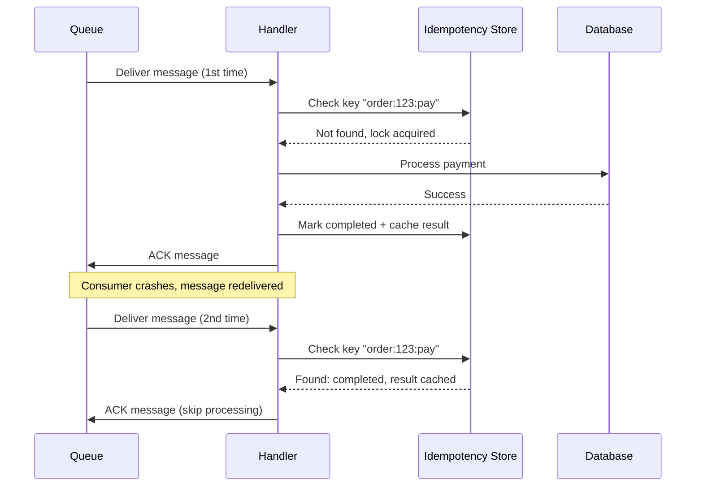

*[ACK]: Acknowledgment
*[UUID]: Universally Unique Identifier
*[ULID]: Universally Unique Lexicographically Sortable Identifier
*[TTL]: Time To Live
*[DLQ]: Dead Letter Queue

Your payment service receives a charge message, successfully charges the customer's card, and then the process crashes before it can acknowledge the message back to the queue. The queue sees no acknowledgment, assumes failure, and redelivers. Without idempotency, that's a double charge. With a properly designed idempotent handler, the second delivery is recognized as a duplicate and returns success without touching the payment gateway again.

This isn't a hypothetical edge case. I've seen it happen in production - payment services that charged customers twice, inventory systems where stock counts drifted negative from duplicate decrements, and welcome emails that arrived in triplicate. The common thread? Handlers that assumed each message would arrive exactly once.

Every production queue operates on at-least-once delivery - "probably more than once." The question isn't _if_ duplicates arrive, it's when.

This article covers the two foundational patterns for building idempotent handlers: designing idempotency keys that reliably identify duplicates, and choosing the right storage strategy for your deduplication state.

## Idempotency Key Design

The idempotency key is the identifier your handler uses to recognize duplicate messages. Get this wrong, and either you'll fail to dedupe actual duplicates (key too specific) or you'll incorrectly skip distinct messages (key too broad). The key needs to be stable across redeliveries, unique per logical operation, and derivable from the message content.

There are four common strategies, each with distinct tradeoffs:

- **Producer-supplied message ID** is the cleanest approach. The producer generates a UUID or ULID when creating the message and includes it in the payload. This key survives redeliveries because it's part of the message content, not queue metadata. The downside is that it requires producer discipline - every producer must generate and include a unique ID.
- **Content hash** works when you can't control producers. Hash the message payload with SHA-256 and use that as the key. Identical content produces identical keys automatically. The risk is that sometimes identical content _should_ be processed multiple times (two separate orders for the same product), and a content hash would incorrectly dedupe them.
- **Business key composite** combines entity identifiers with operation context: `order:12345:payment:v3`. This approach has semantic meaning, making debugging easier, but requires careful thought about what constitutes a unique operation.
- **Queue message ID** - avoid this approach. SQS assigns a new MessageId on each redelivery. RabbitMQ's delivery tag changes. This approach only deduplicates within a single delivery attempt, which defeats the purpose entirely.

The recommended pattern combines producer-supplied IDs with business context:

```python title="idempotency-key-generation.py"
def generate_idempotency_key(event: dict, producer_message_id: str) -> str:
    # Combine producer ID with business context for debugging and scoping
    return f"{event['aggregate_type']}:{event['aggregate_id']}:{producer_message_id}"

# Example: Order:12345:msg-a1b2c3d4-e5f6-7890
```
Code: Recommended idempotency key pattern combining producer ID with business context.

Your key's TTL must exceed the maximum redelivery window. If a message can be redelivered up to 7 days after initial delivery, your idempotency keys must survive at least that long. For most systems, 7 days covers retry scenarios. Financial systems often extend to 30-90 days to satisfy audit requirements. Don't forget about dead letter queues - messages that exhaust their retry budget get moved to a DLQ, where they may sit for days or weeks before someone investigates and replays them. Your idempotency keys must survive long enough to handle DLQ replay.

## Deduplication Strategies

Once you have a stable idempotency key, you need somewhere to store the record of processed messages. The two main approaches are a dedicated deduplication store (typically Redis) or database-level constraints.

### Storage-Based Deduplication

A dedicated idempotency store sits between your handler and your business logic. Before processing, the handler checks the store. If the key exists and shows "completed," return the cached result. If the key exists and shows "processing," another instance is handling it - either wait or fail fast. If the key doesn't exist, acquire a lock and proceed.

Redis works well for high-throughput scenarios where you need sub-millisecond latency. The critical detail is the `NX` flag on the SET command - it only sets the key if it doesn't already exist, making the check-and-lock operation atomic.

### Database-Level Deduplication

For financial operations or anywhere you need transactional consistency, database-level deduplication is often better than a separate store. The idempotency key becomes a unique constraint on your business table.

```sql title="database-deduplication.sql"
-- Idempotency as unique constraint on business table (PostgreSQL)
CREATE TABLE payments (
    id SERIAL PRIMARY KEY,
    idempotency_key VARCHAR(255) UNIQUE NOT NULL,
    order_id INTEGER NOT NULL,
    amount DECIMAL(10, 2) NOT NULL,
    status VARCHAR(20) NOT NULL,
    created_at TIMESTAMP NOT NULL DEFAULT NOW()
);

-- Atomic check-and-insert: duplicate key silently returns existing row
INSERT INTO payments (idempotency_key, order_id, amount, status)
VALUES ($1, $2, $3, 'pending')
ON CONFLICT (idempotency_key) DO UPDATE
SET status = payments.status  -- No-op update to return existing row
RETURNING id, (xmax = 0) as was_inserted;
```
Code: Database-level deduplication using unique constraints in PostgreSQL.

<Callout type="success">
For financial operations, use database-level deduplication with the idempotency key as a unique constraint on the business table. This guarantees atomicity - you can't insert a duplicate payment because the database itself prevents it.
</Callout>

The `ON CONFLICT` clause makes the insert atomic. If the key already exists, the insert silently fails (or performs a no-op update). The `xmax = 0` check tells you whether a new row was inserted or an existing one was found.

The sequence diagram below shows the full flow. Notice that on the second delivery, the handler skips all business logic and immediately acknowledges - the idempotency store has already recorded success.


Figure: Idempotency flow showing first delivery processing and second delivery short-circuit.

Which storage should you use? It depends on your consistency requirements and latency budget:

| Storage | Latency | Durability | Complexity | Best For |
|---------|---------|------------|------------|----------|
| Redis | ~1ms | Configurable | Low | High-throughput, short TTL |
| PostgreSQL | ~5ms | High (ACID) | Medium | Transactional consistency |
| DynamoDB | ~10ms | High | Low | Serverless, global scale |
| In-memory | &lt;1ms | None | Very low | Single instance, testing |

Table: Idempotency store options comparison.

## What's Next

These two patterns - key design and storage strategy - form the foundation of idempotent message handling. But production systems often need more: handler templates that separate idempotency concerns from business logic, transactional outbox patterns for reliable event publishing, saga state machines for multi-step workflows, and queue-specific patterns for SQS FIFO and Kafka. Testing idempotency explicitly - including chaos testing under random failures - catches bugs that only appear in production.

The safest assumption: every message will be delivered twice. Design for that, test for that, and duplicates become a non-event.

---

**Go Deeper: The Complete Idempotency Playbook**

This article covers the essentials, but building bulletproof message handlers requires more. The full guide includes handler template patterns that cleanly separate deduplication from business logic, the transactional outbox pattern for atomic state changes and event publishing, saga state machines for coordinating multi-step workflows across services, queue-specific patterns for SQS FIFO and Kafka consumers, and comprehensive testing strategies including chaos testing. Download the complete guide to implement production-ready idempotent handlers.
