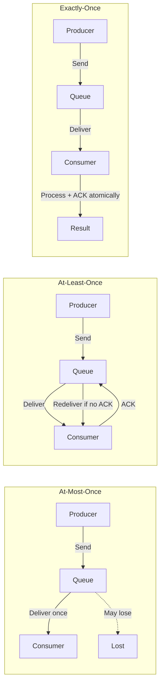
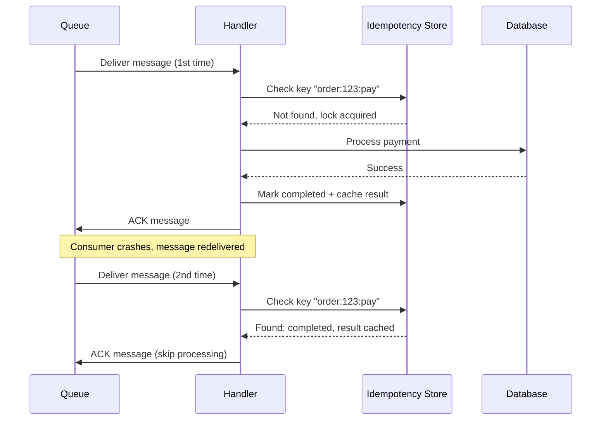
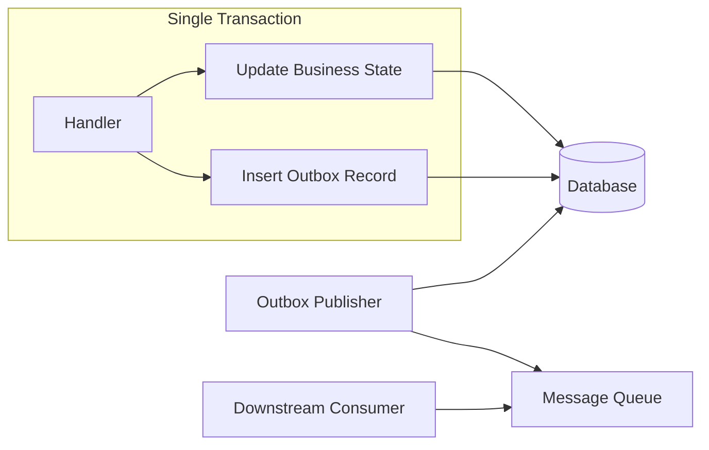

*[UUID]: Universally Unique Identifier
*[ULID]: Universally Unique Lexicographically Sortable Identifier
*[TTL]: Time To Live
*[DLQ]: Dead Letter Queue
*[SQS]: Simple Queue Service
*[FIFO]: First In First Out
*[ACK]: Acknowledgment
*[NACK]: Negative Acknowledgment

# Idempotent Message Handlers: Surviving Retries

## Introduction

Frame the idempotency challenge: in distributed systems with message queues, at-least-once delivery is the norm. Networks fail, consumers crash, timeouts occur—and messages get redelivered. Without idempotent handlers, retries cause duplicate charges, double-posted entries, duplicate emails, and corrupted state. This section establishes that idempotency isn't optional; it's a fundamental requirement for reliable message processing.

_Include a scenario: a payment service processes a charge message, successfully charges the customer, then crashes before acknowledging the message. The queue redelivers. Without idempotency, the customer is charged twice. With idempotency, the handler recognizes the duplicate and returns success without reprocessing._

<Callout type="warning">
"At-least-once" means "probably more than once." Design every handler assuming the message has already been processed. The question isn't if duplicates arrive—it's when and how often.
</Callout>

## Delivery Guarantees

### Understanding Message Delivery Semantics


Figure: Message delivery semantics comparison.

```yaml title="delivery-semantics.yaml"
delivery_guarantees:
  at_most_once:
    description: "Fire and forget - message delivered 0 or 1 times"
    implementation: "ACK immediately on receive, before processing"
    risk: "Message loss on consumer failure"
    use_cases:
      - "Metrics/telemetry (acceptable loss)"
      - "Cache invalidation (will retry naturally)"
      - "Non-critical notifications"
    idempotency_needed: false

  at_least_once:
    description: "Guaranteed delivery - message delivered 1+ times"
    implementation: "ACK after successful processing"
    risk: "Duplicate processing on consumer failure after processing"
    use_cases:
      - "Most business events"
      - "Order processing"
      - "Payment events"
    idempotency_needed: true  # CRITICAL

  exactly_once:
    description: "Message delivered exactly 1 time"
    implementation: "Transactional processing with deduplication"
    reality: "Usually 'effectively once' via idempotent at-least-once"
    use_cases:
      - "Financial transactions"
      - "Inventory management"
      - "Critical state changes"
    idempotency_needed: "Yes - this IS idempotent at-least-once"

why_at_least_once_is_common:
  network_partitions: "ACK may be lost even if processing succeeded"
  consumer_crashes: "Process completes, crash before ACK"
  timeouts: "Processing takes too long, queue assumes failure"
  rebalancing: "Consumer group rebalance causes redelivery"
  visibility_timeout: "SQS-style: message becomes visible again"
```
Code: Delivery guarantee semantics and trade-offs.

| Guarantee | Message Loss | Duplicates | Complexity | When to Use |
|-----------|--------------|------------|------------|-------------|
| At-most-once | Possible | Never | Low | Metrics, logs, non-critical |
| At-least-once | Never | Possible | Medium | Most business events |
| Exactly-once | Never | Never | High | Financial, requires idempotency |

Table: Delivery guarantee comparison.

<Callout type="info">
"Exactly-once" delivery is often marketing. What systems actually provide is "effectively once" through idempotent at-least-once delivery. The message may arrive multiple times, but processing is idempotent so the result is the same.
</Callout>

## Idempotency Key Design

### Choosing the Right Key

```typescript title="idempotency-key-strategies.ts"
// Different strategies for idempotency keys

interface IdempotencyKeyStrategy {
  name: string;
  generate: (message: any) => string;
  pros: string[];
  cons: string[];
}

const strategies: IdempotencyKeyStrategy[] = [
  {
    name: 'Message ID from producer',
    generate: (msg) => msg.messageId,
    pros: [
      'Producer controls uniqueness',
      'Works across retries from producer',
      'Client-side deduplication possible',
    ],
    cons: [
      'Requires producer discipline',
      'Must be truly unique (UUID/ULID)',
      'Producer must persist key for retries',
    ],
  },

  {
    name: 'Content hash',
    generate: (msg) => crypto
      .createHash('sha256')
      .update(JSON.stringify(msg.payload))
      .digest('hex'),
    pros: [
      'Automatic for identical content',
      'No producer changes needed',
      'Works for any message source',
    ],
    cons: [
      'Same content = same key (may be wrong)',
      'Doesn\'t handle intentional duplicates',
      'Hash collisions (theoretical)',
    ],
  },

  {
    name: 'Business key composite',
    generate: (msg) => `${msg.entityType}:${msg.entityId}:${msg.operation}:${msg.version}`,
    pros: [
      'Semantic meaning',
      'Natural deduplication scope',
      'Easy to debug/trace',
    ],
    cons: [
      'Requires business key identification',
      'May need version/sequence for same operation',
      'Complex for multi-entity operations',
    ],
  },

  {
    name: 'Queue message ID',
    generate: (msg) => msg.queueMessageId,  // e.g., SQS MessageId
    pros: [
      'Unique per queue delivery',
      'No producer changes',
    ],
    cons: [
      'Different ID on each redelivery!',
      'Only dedupes within visibility window',
      'NOT suitable for idempotency',
    ],
  },
];

// Recommended: Producer-supplied + business context
function generateIdempotencyKey(
  event: BusinessEvent,
  producerMessageId: string
): string {
  // Combine producer ID with business context for debugging
  return `${event.aggregateType}:${event.aggregateId}:${producerMessageId}`;
}
```
Code: Idempotency key generation strategies.

### Key Scope and Lifetime

```yaml title="idempotency-key-scope.yaml"
key_scope_patterns:
  global_unique:
    scope: "All messages, all time"
    key_example: "msg:a1b2c3d4-e5f6-7890-abcd-ef1234567890"
    storage: "Central idempotency store"
    ttl: "7-30 days typically"
    use_when: "Cross-service deduplication needed"

  entity_scoped:
    scope: "Within a single entity's lifecycle"
    key_example: "order:12345:payment:attempt-3"
    storage: "Entity's own record or service-local store"
    ttl: "Until entity state transition"
    use_when: "Operations on specific business entities"

  operation_scoped:
    scope: "Within a specific operation type"
    key_example: "email:user-456:welcome:2024-01-15"
    storage: "Operation-specific dedup store"
    ttl: "Operation-specific (daily for emails)"
    use_when: "Different operations have different dedup rules"

  time_windowed:
    scope: "Within a time window"
    key_example: "metric:cpu:host-789:2024-01-15T10:00"
    storage: "Time-bucketed store"
    ttl: "Window duration + buffer"
    use_when: "High volume, eventual consistency acceptable"

key_lifetime_considerations:
  too_short:
    problem: "Redelivery after TTL causes duplicate processing"
    example: "1 hour TTL, message redelivered after 2 hours"
    mitigation: "TTL > max redelivery window (usually 7+ days)"

  too_long:
    problem: "Storage growth, lookup performance degradation"
    example: "Never expire, millions of keys accumulate"
    mitigation: "TTL aligned with business requirements"

  recommended:
    general: "7 days (covers most retry scenarios)"
    financial: "30-90 days (audit requirements)"
    high_volume: "24-48 hours with windowed keys"
```
Code: Idempotency key scope and lifetime patterns.

<Callout type="warning">
Never use the queue's message ID as your idempotency key. SQS, RabbitMQ, and most queues assign a new ID on each redelivery. Your idempotency key must come from the message content or producer, not the queue infrastructure.
</Callout>

## Deduplication Strategies

### Storage-Based Deduplication

```typescript title="deduplication-store.ts"
interface IdempotencyRecord {
  key: string;
  status: 'processing' | 'completed' | 'failed';
  result?: any;
  createdAt: Date;
  completedAt?: Date;
  expiresAt: Date;
}

class IdempotencyStore {
  constructor(private redis: Redis) {}

  async checkAndLock(key: string, ttlSeconds: number): Promise<{
    isDuplicate: boolean;
    previousResult?: any;
    lockAcquired: boolean;
  }> {
    const existing = await this.redis.get(`idempotency:${key}`);

    if (existing) {
      const record: IdempotencyRecord = JSON.parse(existing);

      if (record.status === 'completed') {
        // Already processed successfully - return cached result
        return {
          isDuplicate: true,
          previousResult: record.result,
          lockAcquired: false,
        };
      }

      if (record.status === 'processing') {
        // Another instance is processing - don't duplicate work
        // Could wait and retry, or fail fast
        return {
          isDuplicate: true,
          previousResult: undefined,
          lockAcquired: false,
        };
      }

      // Previous attempt failed - allow retry
      // Fall through to acquire lock
    }

    // Try to acquire processing lock with NX (only if not exists)
    const lockKey = `idempotency:${key}`;
    const record: IdempotencyRecord = {
      key,
      status: 'processing',
      createdAt: new Date(),
      expiresAt: new Date(Date.now() + ttlSeconds * 1000),
    };

    const acquired = await this.redis.set(
      lockKey,
      JSON.stringify(record),
      'EX', ttlSeconds,
      'NX'  // Only set if not exists
    );

    return {
      isDuplicate: false,
      lockAcquired: acquired === 'OK',
    };
  }

  async markCompleted(key: string, result: any, ttlSeconds: number): Promise<void> {
    const record: IdempotencyRecord = {
      key,
      status: 'completed',
      result,
      createdAt: new Date(),  // Will be overwritten, but needed for type
      completedAt: new Date(),
      expiresAt: new Date(Date.now() + ttlSeconds * 1000),
    };

    await this.redis.set(
      `idempotency:${key}`,
      JSON.stringify(record),
      'EX', ttlSeconds
    );
  }

  async markFailed(key: string, error: Error): Promise<void> {
    // On failure, delete the lock so retry can proceed
    // Alternatively, mark as 'failed' to track attempts
    await this.redis.del(`idempotency:${key}`);
  }
}
```
Code: Redis-based idempotency store implementation.

### Database-Level Deduplication

```sql title="database-deduplication.sql"
-- Option 1: Idempotency table with unique constraint
CREATE TABLE idempotency_keys (
    key VARCHAR(255) PRIMARY KEY,
    status VARCHAR(20) NOT NULL DEFAULT 'processing',
    result JSONB,
    created_at TIMESTAMP NOT NULL DEFAULT NOW(),
    completed_at TIMESTAMP,
    expires_at TIMESTAMP NOT NULL,

    -- Index for cleanup job
    INDEX idx_expires_at (expires_at)
);

-- Insert with conflict handling (PostgreSQL)
INSERT INTO idempotency_keys (key, expires_at)
VALUES ($1, NOW() + INTERVAL '7 days')
ON CONFLICT (key) DO NOTHING
RETURNING key;

-- If RETURNING is empty, key already existed (duplicate)

-- Option 2: Idempotency as part of business table
CREATE TABLE payments (
    id SERIAL PRIMARY KEY,
    idempotency_key VARCHAR(255) UNIQUE NOT NULL,
    order_id INTEGER NOT NULL,
    amount DECIMAL(10, 2) NOT NULL,
    status VARCHAR(20) NOT NULL,
    created_at TIMESTAMP NOT NULL DEFAULT NOW(),

    -- Unique constraint prevents duplicate payments
    CONSTRAINT unique_payment_idempotency UNIQUE (idempotency_key)
);

-- Upsert pattern - atomic check-and-insert
INSERT INTO payments (idempotency_key, order_id, amount, status)
VALUES ($1, $2, $3, 'pending')
ON CONFLICT (idempotency_key) DO UPDATE
SET status = payments.status  -- No-op update
RETURNING id, (xmax = 0) as was_inserted;

-- was_inserted = true means new record, false means duplicate
```
Code: Database-level deduplication patterns.


Figure: Idempotency flow with deduplication store.

| Storage | Latency | Durability | Complexity | Best For |
|---------|---------|------------|------------|----------|
| Redis | ~1ms | Configurable (AOF) | Low | High-throughput, short TTL |
| PostgreSQL | ~5ms | High (ACID) | Medium | Transactional consistency |
| DynamoDB | ~10ms | High | Low | Serverless, global scale |
| In-memory | &lt1ms | None | Very low | Single instance, testing |

Table: Idempotency store options comparison.

<Callout type="success">
For financial operations, use database-level deduplication with the idempotency key as a unique constraint on the business table. This guarantees atomicity—you can't insert a duplicate payment because the database itself prevents it.
</Callout>

## Handler Patterns

### The Idempotent Handler Template

```typescript title="idempotent-handler.ts"
interface Message<T> {
  id: string;  // Producer-supplied idempotency key
  type: string;
  payload: T;
  metadata: {
    timestamp: Date;
    correlationId: string;
    causationId?: string;
  };
}

interface HandlerResult<R> {
  success: boolean;
  result?: R;
  error?: Error;
  wasRetry: boolean;
}

abstract class IdempotentHandler<T, R> {
  constructor(
    protected idempotencyStore: IdempotencyStore,
    protected config: {
      ttlSeconds: number;
      maxRetries: number;
    }
  ) {}

  async handle(message: Message<T>): Promise<HandlerResult<R>> {
    const idempotencyKey = this.getIdempotencyKey(message);

    // Step 1: Check for duplicate
    const checkResult = await this.idempotencyStore.checkAndLock(
      idempotencyKey,
      this.config.ttlSeconds
    );

    if (checkResult.isDuplicate) {
      if (checkResult.previousResult !== undefined) {
        // Already completed - return cached result
        return {
          success: true,
          result: checkResult.previousResult,
          wasRetry: true,
        };
      }

      // Currently being processed by another instance
      throw new ConcurrentProcessingError(
        `Message ${message.id} is being processed by another instance`
      );
    }

    if (!checkResult.lockAcquired) {
      throw new LockAcquisitionError(
        `Failed to acquire idempotency lock for ${message.id}`
      );
    }

    // Step 2: Process message
    try {
      const result = await this.process(message);

      // Step 3: Mark completed and cache result
      await this.idempotencyStore.markCompleted(
        idempotencyKey,
        result,
        this.config.ttlSeconds
      );

      return {
        success: true,
        result,
        wasRetry: false,
      };
    } catch (error) {
      // Step 4: Handle failure
      await this.idempotencyStore.markFailed(idempotencyKey, error as Error);

      if (this.isRetryable(error as Error)) {
        throw error;  // Let queue retry
      }

      // Non-retryable error - don't retry
      return {
        success: false,
        error: error as Error,
        wasRetry: false,
      };
    }
  }

  // Override to customize key generation
  protected getIdempotencyKey(message: Message<T>): string {
    return message.id;
  }

  // Implement business logic
  protected abstract process(message: Message<T>): Promise<R>;

  // Override to customize retry behavior
  protected isRetryable(error: Error): boolean {
    return error instanceof TransientError;
  }
}
```
Code: Idempotent handler base class.

### Naturally Idempotent Operations

```yaml title="naturally-idempotent-operations.yaml"
naturally_idempotent:
  description: "Operations that produce same result regardless of execution count"

  examples:
    set_operations:
      code: "user.email = 'new@example.com'"
      explanation: "Setting to same value is idempotent"
      no_dedup_needed: true

    upsert:
      code: "INSERT ... ON CONFLICT UPDATE"
      explanation: "Final state is same regardless of insert count"
      no_dedup_needed: true

    delete_by_id:
      code: "DELETE FROM orders WHERE id = 123"
      explanation: "Deleting non-existent row is no-op"
      no_dedup_needed: true

    absolute_state_set:
      code: "inventory.setQuantity(orderId, 5)"
      explanation: "Setting absolute value, not incrementing"
      no_dedup_needed: true

not_naturally_idempotent:
  description: "Operations that change result on each execution"

  examples:
    increment:
      code: "account.balance += 100"
      problem: "Each execution adds 100 more"
      fix: "Track which deposits applied: applyDeposit(depositId, 100)"

    append:
      code: "log.entries.push(newEntry)"
      problem: "Each execution adds another entry"
      fix: "Include entry ID, check before append"

    send_notification:
      code: "emailService.send(welcomeEmail)"
      problem: "User gets email on each execution"
      fix: "Track sent notifications by key"

    generate_sequence:
      code: "order.number = getNextSequence()"
      problem: "Each execution consumes sequence number"
      fix: "Pre-allocate sequence, store with idempotency key"

conversion_patterns:
  increment_to_idempotent:
    before: "balance += amount"
    after: |
      if (!appliedTransactions.includes(transactionId)) {
        balance += amount;
        appliedTransactions.add(transactionId);
      }

  append_to_idempotent:
    before: "items.push(newItem)"
    after: |
      if (!items.some(i => i.id === newItem.id)) {
        items.push(newItem);
      }
```
Code: Naturally idempotent vs non-idempotent operations.

<Callout type="info">
Prefer naturally idempotent operations when possible. "Set quantity to 5" is naturally idempotent. "Decrease quantity by 1" requires deduplication. Design your domain model to favor absolute state over relative changes.
</Callout>

## State Management

### Transactional Outbox Pattern


Figure: Transactional outbox pattern.

```typescript title="transactional-outbox.ts"
interface OutboxRecord {
  id: string;
  aggregateType: string;
  aggregateId: string;
  eventType: string;
  payload: any;
  createdAt: Date;
  publishedAt?: Date;
}

class OrderService {
  constructor(
    private db: Database,
    private idempotencyStore: IdempotencyStore,
  ) {}

  async processPayment(
    orderId: string,
    paymentId: string,  // Idempotency key
    amount: number
  ): Promise<void> {
    // Check idempotency first
    const check = await this.idempotencyStore.checkAndLock(
      `payment:${paymentId}`,
      7 * 24 * 60 * 60  // 7 days TTL
    );

    if (check.isDuplicate) {
      return;  // Already processed
    }

    // Single transaction: update order + insert outbox
    await this.db.transaction(async (tx) => {
      // Update order state
      await tx.query(`
        UPDATE orders
        SET status = 'paid',
            paid_amount = $2,
            payment_id = $3
        WHERE id = $1 AND status = 'pending'
      `, [orderId, amount, paymentId]);

      // Insert outbox event (same transaction)
      await tx.query(`
        INSERT INTO outbox (
          id, aggregate_type, aggregate_id,
          event_type, payload, created_at
        ) VALUES ($1, $2, $3, $4, $5, NOW())
      `, [
        paymentId,  // Use payment ID as outbox record ID
        'Order',
        orderId,
        'OrderPaid',
        JSON.stringify({ orderId, amount, paymentId }),
      ]);
    });

    // Mark idempotency as complete
    await this.idempotencyStore.markCompleted(
      `payment:${paymentId}`,
      { orderId, status: 'paid' },
      7 * 24 * 60 * 60
    );
  }
}

// Outbox publisher (separate process)
class OutboxPublisher {
  async publishPendingEvents(): Promise<void> {
    const pending = await this.db.query(`
      SELECT * FROM outbox
      WHERE published_at IS NULL
      ORDER BY created_at
      LIMIT 100
      FOR UPDATE SKIP LOCKED
    `);

    for (const record of pending.rows) {
      try {
        await this.messageQueue.publish(record.event_type, {
          id: record.id,  // Idempotency key for downstream
          payload: record.payload,
        });

        await this.db.query(`
          UPDATE outbox SET published_at = NOW() WHERE id = $1
        `, [record.id]);
      } catch (error) {
        // Will retry on next poll
        console.error(`Failed to publish ${record.id}`, error);
      }
    }
  }
}
```
Code: Transactional outbox implementation.

### Saga State Machines

```typescript title="saga-idempotency.ts"
// Saga with idempotent step execution

type SagaStepStatus = 'pending' | 'completed' | 'compensating' | 'compensated' | 'failed';

interface SagaState {
  sagaId: string;
  type: string;
  currentStep: number;
  steps: {
    name: string;
    status: SagaStepStatus;
    result?: any;
    error?: string;
    completedAt?: Date;
  }[];
  data: any;
  createdAt: Date;
  updatedAt: Date;
}

class IdempotentSaga {
  async executeStep(
    sagaId: string,
    stepIndex: number,
    stepFn: () => Promise<any>
  ): Promise<any> {
    const saga = await this.loadSaga(sagaId);
    const step = saga.steps[stepIndex];

    // Idempotency: skip if already completed
    if (step.status === 'completed') {
      return step.result;
    }

    // Idempotency: don't re-execute compensated step
    if (step.status === 'compensated') {
      throw new Error(`Step ${step.name} already compensated`);
    }

    try {
      const result = await stepFn();

      // Update saga state atomically
      await this.updateStepStatus(sagaId, stepIndex, {
        status: 'completed',
        result,
        completedAt: new Date(),
      });

      return result;
    } catch (error) {
      await this.updateStepStatus(sagaId, stepIndex, {
        status: 'failed',
        error: (error as Error).message,
      });
      throw error;
    }
  }

  async compensateStep(
    sagaId: string,
    stepIndex: number,
    compensateFn: () => Promise<void>
  ): Promise<void> {
    const saga = await this.loadSaga(sagaId);
    const step = saga.steps[stepIndex];

    // Only compensate completed steps
    if (step.status !== 'completed') {
      return;  // Nothing to compensate
    }

    // Idempotency: don't re-compensate
    if (step.status === 'compensated') {
      return;
    }

    await this.updateStepStatus(sagaId, stepIndex, { status: 'compensating' });

    try {
      await compensateFn();
      await this.updateStepStatus(sagaId, stepIndex, { status: 'compensated' });
    } catch (error) {
      // Compensation failure is serious - may need manual intervention
      await this.updateStepStatus(sagaId, stepIndex, {
        status: 'failed',
        error: `Compensation failed: ${(error as Error).message}`,
      });
      throw error;
    }
  }
}
```
Code: Saga with idempotent step execution.

<Callout type="warning">
Saga compensation must also be idempotent. If a compensation step fails and retries, it shouldn't double-refund or double-undo. Track compensation status separately from execution status.
</Callout>

## Queue-Specific Patterns

### SQS FIFO Deduplication

```typescript title="sqs-fifo-deduplication.ts"
import { SQS } from 'aws-sdk';

// SQS FIFO queue provides built-in deduplication
// But only within 5-minute window!

class SQSFIFOHandler {
  constructor(private sqs: SQS) {}

  async sendWithDeduplication(
    queueUrl: string,
    message: any,
    deduplicationId: string,  // Your idempotency key
    messageGroupId: string    // For ordering
  ): Promise<void> {
    await this.sqs.sendMessage({
      QueueUrl: queueUrl,
      MessageBody: JSON.stringify(message),
      MessageDeduplicationId: deduplicationId,  // SQS dedupes on this
      MessageGroupId: messageGroupId,
    }).promise();

    // SQS will reject duplicate deduplicationId within 5 minutes
    // After 5 minutes, duplicates are accepted!
  }
}

// Important: SQS deduplication is NOT enough for idempotency
// It only prevents duplicate sends within 5 minutes
// You still need handler-side idempotency for:
// - Redeliveries after visibility timeout
// - Messages sent > 5 minutes apart
// - Consumer-side retries

class SQSConsumer {
  async processMessage(sqsMessage: SQS.Message): Promise<void> {
    const message = JSON.parse(sqsMessage.Body!);

    // DO NOT rely solely on SQS MessageId - changes on redelivery
    // Use your own idempotency key from message content
    const idempotencyKey = message.idempotencyKey;

    // Still need application-level idempotency
    const check = await this.idempotencyStore.checkAndLock(idempotencyKey, 7 * 24 * 60 * 60);

    if (check.isDuplicate) {
      // ACK without processing
      await this.sqs.deleteMessage({
        QueueUrl: this.queueUrl,
        ReceiptHandle: sqsMessage.ReceiptHandle!,
      }).promise();
      return;
    }

    // Process...
  }
}
```
Code: SQS FIFO deduplication limitations.

### Kafka Consumer Idempotency

```typescript title="kafka-idempotent-consumer.ts"
import { Kafka, Consumer, EachMessagePayload } from 'kafkajs';

// Kafka exactly-once: idempotent producer + transactional consumer
// But consumer idempotency is still your responsibility

class IdempotentKafkaConsumer {
  private consumer: Consumer;

  async processMessage({ topic, partition, message }: EachMessagePayload): Promise<void> {
    // Kafka provides unique offset per partition
    // Can use topic:partition:offset as idempotency key
    // BUT: rebalances can cause re-processing of same offset

    const kafkaOffset = `${topic}:${partition}:${message.offset}`;
    const payload = JSON.parse(message.value!.toString());

    // Prefer application-level idempotency key if available
    const idempotencyKey = payload.idempotencyKey || kafkaOffset;

    // Pattern: Store processed offsets in database
    // Commit offset only after database transaction completes
    await this.db.transaction(async (tx) => {
      // Check if already processed
      const existing = await tx.query(
        'SELECT 1 FROM processed_offsets WHERE key = $1',
        [idempotencyKey]
      );

      if (existing.rows.length > 0) {
        return;  // Already processed
      }

      // Process business logic
      await this.processBusinessLogic(tx, payload);

      // Mark as processed (same transaction)
      await tx.query(
        'INSERT INTO processed_offsets (key, processed_at) VALUES ($1, NOW())',
        [idempotencyKey]
      );
    });

    // Offset commit happens automatically after handler returns
    // If handler throws, offset not committed, message redelivered
  }
}

// Kafka idempotent producer (prevents duplicate sends)
const kafka = new Kafka({
  clientId: 'my-app',
  brokers: ['localhost:9092'],
});

const producer = kafka.producer({
  idempotent: true,  // Enable idempotent producer
  maxInFlightRequests: 5,  // Required for idempotent
  transactionalId: 'my-transactional-producer',  // For transactions
});
```
Code: Kafka idempotent consumer patterns.

| Queue | Built-in Deduplication | Scope | Handler Idempotency Needed? |
|-------|------------------------|-------|----------------------------|
| SQS Standard | None | N/A | Yes |
| SQS FIFO | MessageDeduplicationId | 5 minutes | Yes (for longer) |
| Kafka | Idempotent producer | Producer session | Yes (consumer side) |
| RabbitMQ | None | N/A | Yes |
| Azure Service Bus | MessageId | Session/window | Yes |

Table: Queue deduplication capabilities.

<Callout type="success">
Queue-level deduplication is a bonus, not a replacement for handler idempotency. Design your handlers assuming messages will be delivered multiple times, regardless of what the queue documentation says about "exactly-once."
</Callout>

## Testing Idempotency

### Idempotency Test Patterns

```typescript title="idempotency-tests.ts"
describe('PaymentHandler idempotency', () => {
  let handler: PaymentHandler;
  let idempotencyStore: IdempotencyStore;
  let paymentGateway: MockPaymentGateway;

  beforeEach(() => {
    idempotencyStore = new InMemoryIdempotencyStore();
    paymentGateway = new MockPaymentGateway();
    handler = new PaymentHandler(idempotencyStore, paymentGateway);
  });

  it('should process message exactly once', async () => {
    const message = createPaymentMessage({ amount: 100 });

    // First call - should process
    await handler.handle(message);
    expect(paymentGateway.chargeCount).toBe(1);

    // Second call - should be idempotent
    await handler.handle(message);
    expect(paymentGateway.chargeCount).toBe(1);  // Still 1!

    // Third call - still idempotent
    await handler.handle(message);
    expect(paymentGateway.chargeCount).toBe(1);
  });

  it('should return same result on duplicate', async () => {
    const message = createPaymentMessage({ amount: 100 });

    const result1 = await handler.handle(message);
    const result2 = await handler.handle(message);

    expect(result2).toEqual(result1);
    expect(result2.wasRetry).toBe(true);
  });

  it('should allow retry after failure', async () => {
    const message = createPaymentMessage({ amount: 100 });

    // First call fails
    paymentGateway.shouldFail = true;
    await expect(handler.handle(message)).rejects.toThrow();
    expect(paymentGateway.chargeCount).toBe(1);

    // Retry should attempt again (not cached failure)
    paymentGateway.shouldFail = false;
    await handler.handle(message);
    expect(paymentGateway.chargeCount).toBe(2);
  });

  it('should handle concurrent duplicate delivery', async () => {
    const message = createPaymentMessage({ amount: 100 });

    // Simulate concurrent processing
    const results = await Promise.allSettled([
      handler.handle(message),
      handler.handle(message),
      handler.handle(message),
    ]);

    // Only one should succeed with actual processing
    const successes = results.filter(r => r.status === 'fulfilled');
    expect(paymentGateway.chargeCount).toBe(1);

    // Others should either succeed with cached result or fail with concurrent error
  });

  it('should not dedupe different messages', async () => {
    const message1 = createPaymentMessage({ id: 'pay-1', amount: 100 });
    const message2 = createPaymentMessage({ id: 'pay-2', amount: 200 });

    await handler.handle(message1);
    await handler.handle(message2);

    expect(paymentGateway.chargeCount).toBe(2);  // Both processed
  });
});

// Chaos testing for idempotency
describe('PaymentHandler chaos tests', () => {
  it('should maintain idempotency under random failures', async () => {
    const handler = new PaymentHandler(
      new ChaosIdempotencyStore({ failureRate: 0.3 }),
      new ChaosPaymentGateway({ failureRate: 0.2 })
    );

    const message = createPaymentMessage({ amount: 100 });
    let successCount = 0;

    // Attempt processing 100 times
    for (let i = 0; i < 100; i++) {
      try {
        await handler.handle(message);
        successCount++;
      } catch {
        // Expected under chaos
      }
    }

    // Verify external effect happened exactly once
    expect(paymentGateway.successfulCharges).toBe(1);
  });
});
```
Code: Idempotency test patterns.

<Callout type="info">
Test idempotency explicitly. Send the same message multiple times and verify the side effect happens once. Test failure-then-retry scenarios. Test concurrent delivery. These tests catch subtle bugs where state appears idempotent locally but external effects are duplicated.
</Callout>

## Conclusion

Summarize the key practices for idempotent message handling: understand that at-least-once delivery means duplicates are inevitable; design idempotency keys carefully (producer-supplied, not queue-assigned); choose appropriate deduplication storage based on consistency requirements; prefer naturally idempotent operations where possible; use transactional patterns (outbox, saga state machines) for complex workflows; and don't rely solely on queue-level deduplication. Emphasize that idempotency is a design discipline—it must be built in from the start, not bolted on later.

<Callout type="success">
The safest assumption: every message will be delivered twice. Design for that, test for that, and duplicates become a non-event. The alternative—discovering duplicate processing in production through customer complaints or financial discrepancies—is far more expensive.
</Callout>

---

## Cover Prompt

### Prompt 1: The Message Echo Chamber

Create an image of a message bouncing between walls in an echo chamber, with multiple copies of the same message visible. In the center, a handler catches messages, but a filter only allows one through while absorbing duplicates. The filter glows with idempotency keys. Style: sound wave visualization, echo effects, filtering mechanism, 16:9 aspect ratio.

### Prompt 2: The Deduplication Vault

Design an image of a secure vault where messages enter. A guardian checks each message against a ledger of processed keys. Duplicate messages are politely returned at the door, while new messages proceed inside. The vault contains completed transactions. Style: bank vault aesthetic, ledger books, key matching, 16:9 aspect ratio.

### Prompt 3: The Retry Storm

Illustrate a storm of identical messages raining down on a server. The server has an umbrella labeled "Idempotency" that deflects duplicate raindrops while allowing unique ones through a funnel. Below, a calm pool shows exactly-once processing results. Style: weather metaphor, storm protection, calm after chaos, 16:9 aspect ratio.

### Prompt 4: The Assembly Line Inspector

Create an image of a factory assembly line where messages pass through quality control. An inspector stamps each message with a unique key and checks against a database. Duplicate messages are diverted to a "Already Processed" bin while originals continue to production. Style: manufacturing quality control, inspection station, sorting mechanism, 16:9 aspect ratio.

### Prompt 5: The Time-Aware Gatekeeper

Design an image of a gatekeeper at a castle gate with a memory book. The gatekeeper checks each arriving message against recent entries. Some messages show "I was just here!" while the gatekeeper calmly responds "Yes, and your request was already fulfilled." A clock shows the TTL window. Style: medieval gatekeeper, memory ledger, temporal awareness, 16:9 aspect ratio.
