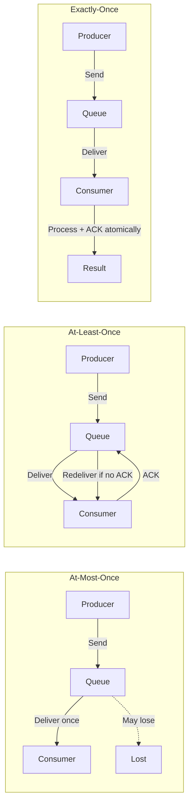
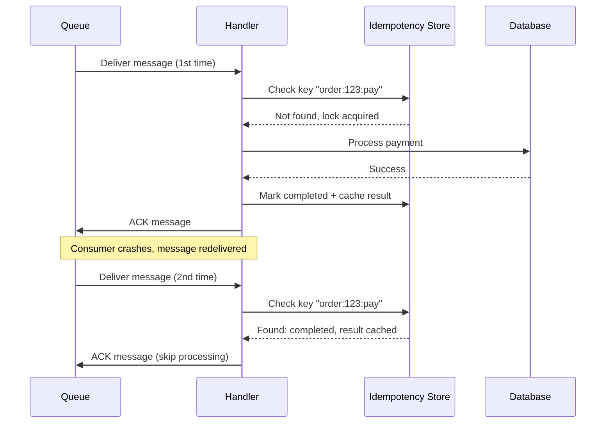
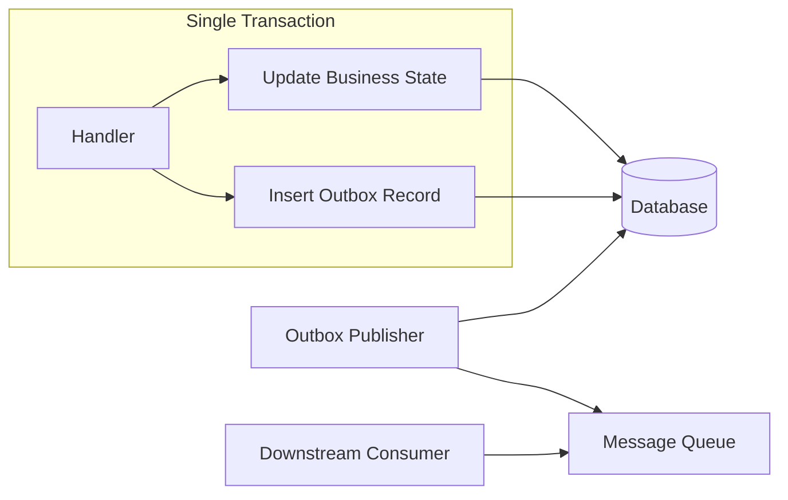

*[UUID]: Universally Unique Identifier
*[ULID]: Universally Unique Lexicographically Sortable Identifier
*[TTL]: Time To Live
*[DLQ]: Dead Letter Queue
*[SQS]: Simple Queue Service
*[FIFO]: First In First Out
*[ACK]: Acknowledgment
*[NACK]: Negative Acknowledgment

Every message queue you'll work with in production operates on a simple principle: at-least-once delivery. Networks partition, consumers crash, timeouts expire, and when any of those things happen, the queue does the only safe thing it can do - it redelivers the message. This isn't a bug or a misconfiguration. It's the fundamental contract.

The problem hits when your handler isn't ready for it. I've seen payment services charge customers twice because a worker crashed after processing but before acknowledging. I've debugged inventory systems where stock counts drifted negative because decrement operations ran multiple times. I've traced duplicate welcome emails to a handler that assumed each message would arrive exactly once.

Here's the scenario that makes this concrete: your payment service receives a charge message, successfully charges the customer's card, and then the process crashes before it can acknowledge the message back to the queue. The queue sees no acknowledgment, assumes failure, and redelivers. Without idempotency, that's a double charge. With a properly designed idempotent handler, the second delivery is recognized as a duplicate and returns success without touching the payment gateway again.

This article walks through the patterns that make handlers survive retries: understanding delivery guarantees, designing idempotency keys, implementing deduplication stores, and building handlers that produce the same result regardless of how many times they receive the same message.

<Callout type="warning">
"At-least-once" means "probably more than once." Design every handler assuming the message has already been processed. The question isn't _if_ duplicates arrive - it's when and how often.
</Callout>

## Delivery Guarantees

Before diving into implementation, it's worth understanding why duplicates are inevitable. Message queues offer three delivery semantics, and the tradeoffs between them explain why at-least-once is the default for anything that matters.

### Understanding Message Delivery Semantics

**At-most-once** delivery is the simplest: acknowledge the message immediately upon receipt, before processing. If your handler crashes mid-processing, the message is gone. This works for telemetry, cache invalidation, and anything where losing the occasional message is acceptable. You'll never see duplicates, but you will lose data.

**At-least-once** delivery flips the tradeoff: acknowledge only after successful processing. If your handler crashes, the message gets redelivered. You won't lose messages, but you will see duplicates. A handler can also explicitly reject a message with a NACK (negative acknowledgment) to trigger immediate redelivery - useful when you detect a transient failure and want to retry without waiting for a timeout. This is the right choice for business events, payments, order processing - anything where losing a message is worse than processing it twice.

**Exactly-once** delivery is what everyone wants and nobody truly gets. What systems actually provide is "effectively once" - at-least-once delivery combined with idempotent handlers. The message may arrive multiple times, but idempotent processing ensures the result is the same as if it arrived once.


Figure: Message delivery semantics - at-most-once risks loss, at-least-once risks duplicates, exactly-once requires idempotent handlers.

The table below summarizes when to use each guarantee:

| Guarantee | Message Loss | Duplicates | Complexity | When to Use |
|-----------|--------------|------------|------------|-------------|
| At-most-once | Possible | Never | Low | Metrics, logs, non-critical |
| At-least-once | Never | Possible | Medium | Most business events |
| Exactly-once | Never | Never | High | Financial, requires idempotency |

Table: Delivery guarantee comparison.

Why is at-least-once so common? Because the failure modes that cause redelivery are unavoidable in distributed systems. Network partitions mean acknowledgments get lost even when processing succeeded. Consumer crashes mean the process completes but never reports success. Timeouts mean processing took too long and the queue assumed failure. Consumer group rebalances in Kafka, visibility timeouts in SQS - all of these lead to the same outcome: a message that was already processed gets delivered again.

## Idempotency Key Design

The idempotency key is the identifier your handler uses to recognize duplicate messages. Get this wrong, and either you'll fail to dedupe actual duplicates (key too specific) or you'll incorrectly skip distinct messages (key too broad). The key needs to be stable across redeliveries, unique per logical operation, and derivable from the message content.

### Choosing the Right Key

There are four common strategies, each with distinct tradeoffs:

**Producer-supplied message ID** is the cleanest approach. The producer generates a UUID or ULID when creating the message and includes it in the payload. This key survives redeliveries because it's part of the message content, not queue metadata. The downside is that it requires producer discipline - every producer must generate and include a unique ID.

**Content hash** works when you can't control producers. Hash the message payload with SHA-256 and use that as the key. Identical content produces identical keys automatically. The risk is that sometimes identical content _should_ be processed multiple times (two separate orders for the same product), and a content hash would incorrectly dedupe them.

**Business key composite** combines entity identifiers with operation context: `order:12345:payment:v3`. This approach has semantic meaning, making debugging easier, but requires careful thought about what constitutes a unique operation. Does a payment retry get a new version, or should it reuse the same key?

**Queue message ID** - don't use this. SQS assigns a new MessageId on each redelivery. RabbitMQ's delivery tag changes. This approach only deduplicates within a single delivery attempt, which defeats the purpose entirely.

The recommended pattern combines producer-supplied IDs with business context:

```python title="idempotency-key-generation.py"
def generate_idempotency_key(event: dict, producer_message_id: str) -> str:
    """
    Combine producer ID with business context for debugging and scoping.
    """
    return f"{event['aggregate_type']}:{event['aggregate_id']}:{producer_message_id}"

# Example usage:
event = {
    "aggregate_type": "Order",
    "aggregate_id": "12345"
}
msg_id = "msg-a1b2c3d4-e5f6-7890"

key = generate_idempotency_key(event, msg_id)
print(key)

# Output: Order:12345:msg-a1b2c3d4-e5f6-7890
```
Code: Recommended idempotency key pattern combining producer ID with business context.

### Key Scope and Lifetime

Beyond the key format, you need to decide how long to remember processed keys and at what scope.

**Global scope** means any service can check whether a message ID was already processed. This requires a centralized idempotency store (typically Redis or a shared database) and makes sense when the same message might be consumed by multiple services.

**Entity scope** limits deduplication to a specific business entity. The key `order:12345:payment` only needs to be unique within the context of order 12345. This allows storing idempotency state alongside the entity itself, eliminating the need for a separate store.

**Time-windowed scope** partitions keys by time period: `metric:cpu:host-789:2024-01-15T10:00`. This bounds storage growth for high-volume systems where eventual consistency is acceptable.

For key lifetime (TTL), the rule is straightforward: your TTL must exceed the maximum redelivery window. If a message can be redelivered up to 7 days after initial delivery, your idempotency keys must survive at least that long. For most systems, 7 days covers retry scenarios. Financial systems often extend to 30-90 days to satisfy audit requirements.

Don't forget about dead letter queues. Messages that exhaust their retry budget get moved to a DLQ, where they may sit for days or weeks before someone investigates and replays them. Your idempotency keys must survive long enough to handle DLQ replay - if a message was successfully processed on its fifth retry but then someone replays the DLQ copy a week later, you need to recognize it as a duplicate.

<Callout type="warning">
Never use the queue's message ID as your idempotency key. SQS, RabbitMQ, and most queues assign a new ID on each redelivery. Your idempotency key must come from the message content or producer, not the queue infrastructure.
</Callout>

## Deduplication Strategies

Once you have a stable idempotency key, you need somewhere to store the record of processed messages. The two main approaches are a dedicated deduplication store (typically Redis) or database-level constraints.

### Storage-Based Deduplication

A dedicated idempotency store sits between your handler and your business logic. Before processing, the handler checks the store. If the key exists and shows "completed," return the cached result. If the key exists and shows "processing," another instance is handling it - either wait or fail fast. If the key doesn't exist, acquire a lock and proceed.

The Redis implementation below demonstrates this pattern. The critical detail is the `NX` flag on the SET command - it only sets the key if it doesn't already exist, making the check-and-lock operation atomic.

```typescript title="idempotency-store.ts"
// Redis-based idempotency store with atomic check-and-lock
// Note: The GET-then-SET pattern below has a race window between the two calls.
// For high-concurrency scenarios, use a Lua script to make the entire operation atomic,
// or accept that concurrent handlers may both attempt processing (one will fail on markCompleted).
class IdempotencyStore {
  constructor(private redis: Redis) {}

  async checkAndLock(key: string, ttlSeconds: number): Promise<{
    isDuplicate: boolean;
    previousResult?: any;
    lockAcquired: boolean;
  }> {
    const existing = await this.redis.get(`idempotency:${key}`);

    if (existing) {
      const record = JSON.parse(existing);
      if (record.status === 'completed') {
        return { isDuplicate: true, previousResult: record.result, lockAcquired: false };
      }
      if (record.status === 'processing') {
        return { isDuplicate: true, previousResult: undefined, lockAcquired: false };
      }
    }

    // Atomic set-if-not-exists with TTL
    const acquired = await this.redis.set(
      `idempotency:${key}`,
      JSON.stringify({ status: 'processing', createdAt: new Date() }),
      'EX', ttlSeconds,
      'NX'
    );

    return { isDuplicate: false, lockAcquired: acquired === 'OK' };
  }

  async markCompleted(key: string, result: any, ttlSeconds: number): Promise<void> {
    await this.redis.set(
      `idempotency:${key}`,
      JSON.stringify({ status: 'completed', result, completedAt: new Date() }),
      'EX', ttlSeconds
    );
  }

  async markFailed(key: string): Promise<void> {
    // Delete lock so retry can proceed
    await this.redis.del(`idempotency:${key}`);
  }
}
```
Code: Redis-based idempotency store with atomic check-and-lock.

### Database-Level Deduplication

For financial operations or anywhere you need transactional consistency, database-level deduplication is often better than a separate store. The idempotency key becomes a unique constraint on your business table.

The PostgreSQL approach below uses `ON CONFLICT` to make the insert atomic. If the key already exists, the insert silently fails (or performs a no-op update). The `xmax = 0` check tells you whether a new row was inserted or an existing one was found.

```sql title="database-deduplication.sql"
-- Idempotency as unique constraint on business table (PostgreSQL)
CREATE TABLE payments (
    id SERIAL PRIMARY KEY,
    idempotency_key VARCHAR(255) UNIQUE NOT NULL,
    order_id INTEGER NOT NULL,
    amount DECIMAL(10, 2) NOT NULL,
    status VARCHAR(20) NOT NULL,
    created_at TIMESTAMP NOT NULL DEFAULT NOW()
);

-- Atomic check-and-insert: duplicate key silently returns existing row
INSERT INTO payments (idempotency_key, order_id, amount, status)
VALUES ($1, $2, $3, 'pending')
ON CONFLICT (idempotency_key) DO UPDATE
SET status = payments.status  -- No-op update to return existing row
RETURNING id, (xmax = 0) as was_inserted;

-- was_inserted = true means new row, false means duplicate detected
```
Code: Database-level deduplication using unique constraints in PostgreSQL.

The sequence diagram below shows the full flow. Notice that on the second delivery, the handler skips all business logic and immediately acknowledges - the idempotency store has already recorded success.


Figure: Idempotency flow - second delivery skips processing entirely.

Which storage should you use? It depends on your consistency requirements and latency budget:

| Storage | Latency | Durability | Complexity | Best For |
|---------|---------|------------|------------|----------|
| Redis | ~1ms | Configurable (AOF) | Low | High-throughput, short TTL |
| PostgreSQL | ~5ms | High (ACID) | Medium | Transactional consistency |
| DynamoDB | ~10ms | High | Low | Serverless, global scale |
| In-memory | &lt;1ms | None | Very low | Single instance, testing |

Table: Idempotency store options comparison.

<Callout type="success">
For financial operations, use database-level deduplication with the idempotency key as a unique constraint on the business table. This guarantees atomicity - you can't insert a duplicate payment because the database itself prevents it.
</Callout>

## Handler Patterns

With the idempotency store in place, the handler itself follows a predictable template: check for duplicates, acquire a lock, process, mark completed. The key is separating the idempotency concerns from the business logic so they don't get tangled together.

### The Idempotent Handler Template

The abstract handler below encapsulates the idempotency workflow. Subclasses implement only the `process` method with their business logic - the duplicate checking, locking, and result caching happen automatically.

```typescript title="idempotent-handler.ts"
// Base class for idempotent message handlers
abstract class IdempotentHandler<T, R> {
  constructor(
    protected idempotencyStore: IdempotencyStore,
    protected config: { ttlSeconds: number }
  ) {}

  async handle(message: Message<T>): Promise<HandlerResult<R>> {
    const key = this.getIdempotencyKey(message);

    // Step 1: Check for duplicate
    const check = await this.idempotencyStore.checkAndLock(key, this.config.ttlSeconds);

    if (check.isDuplicate) {
      if (check.previousResult !== undefined) {
        return { success: true, result: check.previousResult, wasRetry: true };
      }
      throw new ConcurrentProcessingError(`Message ${message.id} being processed`);
    }

    // Step 2: Process (subclass implements this)
    try {
      const result = await this.process(message);
      await this.idempotencyStore.markCompleted(key, result, this.config.ttlSeconds);
      return { success: true, result, wasRetry: false };
    } catch (error) {
      await this.idempotencyStore.markFailed(key);
      if (this.isRetryable(error as Error)) throw error;
      return { success: false, error: error as Error, wasRetry: false };
    }
  }

  protected getIdempotencyKey(message: Message<T>): string {
    return message.id;
  }

  protected abstract process(message: Message<T>): Promise<R>;

  protected isRetryable(error: Error): boolean {
    return error instanceof TransientError;
  }
}
```
Code: Idempotent handler base class separating deduplication from business logic.

### Naturally Idempotent Operations

Not every operation needs explicit deduplication. Some operations are _naturally idempotent_ - executing them multiple times produces the same result as executing once.

**Set operations** are naturally idempotent. `user.email = 'new@example.com'` produces the same state whether you run it once or ten times. Same with `UPDATE users SET email = $1 WHERE id = $2`.

**Upserts** are naturally idempotent. `INSERT ... ON CONFLICT UPDATE` converges to the same final state regardless of how many times you execute it.

**Deletes by ID** are naturally idempotent. `DELETE FROM orders WHERE id = 123` succeeds once and becomes a no-op on subsequent executions.

**Absolute state sets** are naturally idempotent. `inventory.setQuantity(sku, 5)` sets the quantity to 5, not "adds 5." Running it twice still leaves the quantity at 5.

### Operations That Require Deduplication

The operations that _aren't_ naturally idempotent are the ones that accumulate:

**Increments** compound on each execution. `balance += 100` adds 100 every time. The fix is to track which operations have been applied: `applyDeposit(depositId, 100)` can check whether `depositId` was already applied.

**Appends** grow the collection. `items.push(newItem)` adds another entry each time. The fix is to include an item ID and check before appending: `if (!items.some(i => i.id === newItem.id)) items.push(newItem)`.

**External side effects** like sending emails or notifications aren't naturally idempotent. The user receives the email on each execution. Track sent notifications by key to prevent duplicates.

<Callout type="info">
Prefer naturally idempotent operations when possible. "Set quantity to 5" is naturally idempotent. "Decrease quantity by 1" requires deduplication. Design your domain model to favor absolute state over relative changes.
</Callout>

## State Management

Idempotent handlers get more complicated when they need to publish events downstream or coordinate multi-step workflows. The challenge is ensuring that state changes and event publishing happen atomically - if you update the database but crash before publishing the event, downstream systems never learn about the change.

### Transactional Outbox Pattern

The transactional outbox pattern solves the dual-write problem by writing the outgoing event to the same database transaction as the state change. A separate process polls the outbox table and publishes events to the message queue.

This guarantees that if the state change commits, the event will eventually be published. If the transaction rolls back, no event exists to publish. The outbox publisher is itself idempotent - publishing the same event twice is harmless because downstream handlers are idempotent too.


Figure: Transactional outbox - state change and event written atomically, publisher polls outbox.

The implementation has two parts. First, the outbox table schema:

```sql title="outbox-schema.sql"
-- Outbox table for reliable event publishing (PostgreSQL)
CREATE TABLE outbox (
    id VARCHAR(255) PRIMARY KEY,           -- Use message idempotency key
    aggregate_type VARCHAR(100) NOT NULL,  -- e.g., 'Order', 'Payment'
    aggregate_id VARCHAR(255) NOT NULL,    -- Business entity ID
    event_type VARCHAR(100) NOT NULL,      -- e.g., 'OrderPaid', 'PaymentFailed'
    payload JSONB NOT NULL,                -- Event data
    created_at TIMESTAMP NOT NULL DEFAULT NOW(),
    published_at TIMESTAMP                 -- NULL until successfully published
);

CREATE INDEX idx_outbox_unpublished ON outbox (created_at) WHERE published_at IS NULL;
```
Code: Outbox table schema with index for efficient polling.

The handler writes both the business state and the outbox record in a single transaction:

```typescript title="transactional-outbox.ts"
// Handler: update state + insert outbox in single transaction
async processPayment(orderId: string, paymentId: string, amount: number): Promise<void> {
  const check = await this.idempotencyStore.checkAndLock(`payment:${paymentId}`, 7 * 24 * 60 * 60);
  if (check.isDuplicate) return;

  await this.db.transaction(async (tx) => {
    // Update business state
    await tx.query(
      `UPDATE orders SET status = 'paid', paid_amount = $2, payment_id = $3
       WHERE id = $1 AND status = 'pending'`,
      [orderId, amount, paymentId]
    );

    // Insert outbox event (same transaction)
    await tx.query(
      `INSERT INTO outbox (id, aggregate_type, aggregate_id, event_type, payload, created_at)
       VALUES ($1, 'Order', $2, 'OrderPaid', $3, NOW())`,
      [paymentId, orderId, JSON.stringify({ orderId, amount, paymentId })]
    );
  });

  await this.idempotencyStore.markCompleted(`payment:${paymentId}`, { orderId, status: 'paid' }, 7 * 24 * 60 * 60);
}
```
Code: Handler writes business state and outbox event in single transaction.

The outbox publisher runs as a separate long-running worker process, polling for unpublished events. In Kubernetes deployments, it's common to run the publisher as a sidecar container in the same pod as the main application - this way it shares database configuration, scales identically with your app, and follows the same deployment lifecycle. Use a sidecar when you want tight coupling. Use a separate Deployment when the publisher needs independent scaling or different resource profiles (for example, if you have many app replicas but only need one or two publisher instances).

```typescript title="outbox-publisher.ts"
// Publisher: poll outbox and publish to message queue
async publishPendingEvents(): Promise<void> {
  const pending = await this.db.query(
    `SELECT * FROM outbox WHERE published_at IS NULL
     ORDER BY created_at LIMIT 100 FOR UPDATE SKIP LOCKED`
  );

  for (const record of pending.rows) {
    try {
      await this.messageQueue.publish(record.event_type, {
        id: record.id,  // Idempotency key for downstream consumers
        payload: record.payload,
      });
      await this.db.query(`UPDATE outbox SET published_at = NOW() WHERE id = $1`, [record.id]);
    } catch (error) {
      // Will retry on next poll - idempotent downstream handles duplicates
      console.error(`Failed to publish ${record.id}`, error);
    }
  }
}
```
Code: Outbox publisher polls for unpublished events and forwards to message queue.

### Saga State Machines

For multi-step workflows that span multiple services, sagas coordinate the sequence and handle compensation when steps fail. Each step must be idempotent, and so must each compensation action.

The key insight is that saga state itself provides idempotency. Before executing a step, check if it's already completed. Before compensating, check if it's already compensated. The saga state machine becomes the deduplication store for the entire workflow.

```typescript title="saga-idempotency.ts"
// Saga with idempotent step execution
class IdempotentSaga {
  async executeStep(sagaId: string, stepIndex: number, stepFn: () => Promise<any>): Promise<any> {
    const saga = await this.loadSaga(sagaId);
    const step = saga.steps[stepIndex];

    // Idempotency: skip if already completed
    if (step.status === 'completed') return step.result;
    if (step.status === 'compensated') throw new Error(`Step ${step.name} already compensated`);

    try {
      const result = await stepFn();
      await this.updateStepStatus(sagaId, stepIndex, { status: 'completed', result, completedAt: new Date() });
      return result;
    } catch (error) {
      await this.updateStepStatus(sagaId, stepIndex, { status: 'failed', error: (error as Error).message });
      throw error;
    }
  }

  async compensateStep(sagaId: string, stepIndex: number, compensateFn: () => Promise<void>): Promise<void> {
    const saga = await this.loadSaga(sagaId);
    const step = saga.steps[stepIndex];

    if (step.status !== 'completed') return;  // Nothing to compensate
    if (step.status === 'compensated') return;  // Already compensated

    await this.updateStepStatus(sagaId, stepIndex, { status: 'compensating' });
    try {
      await compensateFn();
      await this.updateStepStatus(sagaId, stepIndex, { status: 'compensated' });
    } catch (error) {
      await this.updateStepStatus(sagaId, stepIndex, { status: 'failed', error: `Compensation failed: ${(error as Error).message}` });
      throw error;
    }
  }
}
```
Code: Saga with idempotent step execution and compensation.

A concrete example: an order fulfillment saga with three steps - reserve inventory, charge payment, ship order. If payment fails after inventory is reserved, the saga must compensate by releasing the reserved inventory. Each step and compensation must be idempotent:

```typescript title="order-saga-example.ts"
// Order fulfillment saga: reserve -> charge -> ship
const orderSaga = new IdempotentSaga();

async function fulfillOrder(orderId: string): Promise<void> {
  const sagaId = `order-fulfillment:${orderId}`;

  try {
    // Step 0: Reserve inventory (compensation: release)
    await orderSaga.executeStep(sagaId, 0, () => inventoryService.reserve(orderId));

    // Step 1: Charge payment (compensation: refund)
    await orderSaga.executeStep(sagaId, 1, () => paymentService.charge(orderId));

    // Step 2: Ship order (compensation: cancel shipment)
    await orderSaga.executeStep(sagaId, 2, () => shippingService.ship(orderId));
  } catch (error) {
    // Payment or shipping failed - compensate in reverse order
    await orderSaga.compensateStep(sagaId, 1, () => paymentService.refund(orderId));
    await orderSaga.compensateStep(sagaId, 0, () => inventoryService.release(orderId));
    throw error;
  }
}
```
Code: Order fulfillment saga with compensation - each step is idempotent.

<Callout type="warning">
Saga compensation must also be idempotent. If a compensation step fails and retries, it shouldn't double-refund or double-undo. Track compensation status separately from execution status.
</Callout>

## Queue-Specific Patterns

Different message queues offer varying levels of built-in deduplication. It's tempting to rely on these features, but they're supplements to handler-level idempotency, not replacements. Each queue has limitations - time windows, scope restrictions, or gaps in coverage - that leave your handlers exposed to duplicates under real-world failure scenarios.

### SQS FIFO Deduplication

AWS SQS FIFO queues provide built-in deduplication via the `MessageDeduplicationId` parameter. When you send a message with a deduplication ID, SQS rejects any duplicate sends with the same ID for the next five minutes. This is useful for preventing accidental double-sends from producers, but it has a critical limitation: the five-minute window is too short for most retry scenarios.

If your consumer crashes and the message gets redelivered after visibility timeout expires - potentially hours later - SQS won't recognize it as a duplicate. And if the original producer retries after the five-minute window, the duplicate goes through. You still need handler-side idempotency for anything beyond immediate producer retries.

```typescript title="sqs-fifo-deduplication.ts"
import { SQS } from 'aws-sdk';

// SQS FIFO queue provides built-in deduplication
// But only within 5-minute window!

class SQSFIFOHandler {
  constructor(private sqs: SQS) {}

  async sendWithDeduplication(
    queueUrl: string,
    message: any,
    deduplicationId: string,  // Your idempotency key
    messageGroupId: string    // For ordering
  ): Promise<void> {
    await this.sqs.sendMessage({
      QueueUrl: queueUrl,
      MessageBody: JSON.stringify(message),
      MessageDeduplicationId: deduplicationId,  // SQS dedupes on this
      MessageGroupId: messageGroupId,
    }).promise();

    // SQS will reject duplicate deduplicationId within 5 minutes
    // After 5 minutes, duplicates are accepted!
  }
}

// Important: SQS deduplication is NOT enough for idempotency
// It only prevents duplicate sends within 5 minutes
// You still need handler-side idempotency for:
// - Redeliveries after visibility timeout
// - Messages sent > 5 minutes apart
// - Consumer-side retries

class SQSConsumer {
  async processMessage(sqsMessage: SQS.Message): Promise<void> {
    const message = JSON.parse(sqsMessage.Body!);

    // DO NOT rely solely on SQS MessageId - changes on redelivery
    // Use your own idempotency key from message content
    const idempotencyKey = message.idempotencyKey;

    // Still need application-level idempotency
    const check = await this.idempotencyStore.checkAndLock(idempotencyKey, 7 * 24 * 60 * 60);

    if (check.isDuplicate) {
      // ACK without processing
      await this.sqs.deleteMessage({
        QueueUrl: this.queueUrl,
        ReceiptHandle: sqsMessage.ReceiptHandle!,
      }).promise();
      return;
    }

    // Process...
  }
}
```
Code: SQS FIFO deduplication - producer-side and consumer-side patterns.

### Kafka Consumer Idempotency

Kafka's "exactly-once semantics" marketing is misleading for consumers. Kafka provides an _idempotent producer_ that prevents duplicate message sends within a producer session, and _transactional writes_ that atomically commit offsets with state changes. But consumer-side idempotency is still your responsibility.

The reason is consumer group rebalances. When a consumer dies and partitions get reassigned, the new consumer starts from the last committed offset. If the original consumer processed a message but crashed before committing the offset, the new consumer will reprocess it. The Kafka offset is unique per partition, so you _can_ use `topic:partition:offset` as an idempotency key - but an application-level key from the message payload is more reliable across rebalances and topic migrations.

The pattern that works: store processed message keys in the same database transaction as your business logic, then let Kafka auto-commit offsets after successful processing. If the transaction fails, the offset isn't committed and the message gets redelivered - which your idempotency check will catch.

```typescript title="kafka-idempotent-consumer.ts"
import { Kafka, Consumer, EachMessagePayload } from 'kafkajs';

// Kafka exactly-once: idempotent producer + transactional consumer
// But consumer idempotency is still your responsibility

class IdempotentKafkaConsumer {
  private consumer: Consumer;

  async processMessage({ topic, partition, message }: EachMessagePayload): Promise<void> {
    // Kafka provides unique offset per partition
    // Can use topic:partition:offset as idempotency key
    // BUT: rebalances can cause re-processing of same offset

    const kafkaOffset = `${topic}:${partition}:${message.offset}`;
    const payload = JSON.parse(message.value!.toString());

    // Prefer application-level idempotency key if available
    const idempotencyKey = payload.idempotencyKey || kafkaOffset;

    // Pattern: Store processed offsets in database
    // Commit offset only after database transaction completes
    await this.db.transaction(async (tx) => {
      // Check if already processed
      const existing = await tx.query(
        'SELECT 1 FROM processed_offsets WHERE key = $1',
        [idempotencyKey]
      );

      if (existing.rows.length > 0) {
        return;  // Already processed
      }

      // Process business logic
      await this.processBusinessLogic(tx, payload);

      // Mark as processed (same transaction)
      await tx.query(
        'INSERT INTO processed_offsets (key, processed_at) VALUES ($1, NOW())',
        [idempotencyKey]
      );
    });

    // Offset commit happens automatically after handler returns
    // If handler throws, offset not committed, message redelivered
  }
}

// Kafka idempotent producer (prevents duplicate sends)
const kafka = new Kafka({
  clientId: 'my-app',
  brokers: ['localhost:9092'],
});

const producer = kafka.producer({
  idempotent: true,  // Enable idempotent producer
  maxInFlightRequests: 5,  // Required for idempotent
  transactionalId: 'my-transactional-producer',  // For transactions
});
```
Code: Kafka idempotent consumer with database-backed deduplication.

### Comparing Queue Deduplication Features

The table below summarizes what each major queue provides out of the box. The pattern is consistent: every queue requires handler-side idempotency for production workloads. Built-in deduplication helps at the margins but doesn't eliminate the need for application-level duplicate detection.

| Queue | Built-in Deduplication | Scope | Handler Idempotency Needed? |
|-------|------------------------|-------|----------------------------|
| SQS Standard | None | N/A | Yes |
| SQS FIFO | MessageDeduplicationId | 5 minutes | Yes (for longer) |
| Kafka | Idempotent producer | Producer session | Yes (consumer side) |
| RabbitMQ | None | N/A | Yes |
| Azure Service Bus | MessageId | Session/window | Yes |

Table: Queue deduplication capabilities - all require handler-side idempotency.

<Callout type="success">
Queue-level deduplication is a bonus, not a replacement for handler idempotency. Design your handlers assuming messages will be delivered multiple times, regardless of what the queue documentation says about "exactly-once."
</Callout>

## Testing Idempotency

Idempotency bugs are insidious. The handler works perfectly in development where messages arrive once, then double-charges customers in production when a network blip causes a retry. The only way to catch these bugs before they cost you money (and customer trust) is to test for idempotency explicitly.

The test suite below covers the essential scenarios: repeated delivery of the same message, failure-then-retry, concurrent duplicate delivery, and the negative case (different messages should _not_ be deduplicated). The chaos test at the end simulates real-world conditions where both the idempotency store and the external service fail randomly - even under these conditions, the external effect should happen exactly once.

```typescript title="idempotency-tests.ts"
describe('PaymentHandler idempotency', () => {
  let handler: PaymentHandler;
  let idempotencyStore: IdempotencyStore;
  let paymentGateway: MockPaymentGateway;

  beforeEach(() => {
    idempotencyStore = new InMemoryIdempotencyStore();
    paymentGateway = new MockPaymentGateway();
    handler = new PaymentHandler(idempotencyStore, paymentGateway);
  });

  it('should process message exactly once', async () => {
    const message = createPaymentMessage({ amount: 100 });

    // First call - should process
    await handler.handle(message);
    expect(paymentGateway.chargeCount).toBe(1);

    // Second call - should be idempotent
    await handler.handle(message);
    expect(paymentGateway.chargeCount).toBe(1);  // Still 1!

    // Third call - still idempotent
    await handler.handle(message);
    expect(paymentGateway.chargeCount).toBe(1);
  });

  it('should return same result on duplicate', async () => {
    const message = createPaymentMessage({ amount: 100 });

    const result1 = await handler.handle(message);
    const result2 = await handler.handle(message);

    expect(result2).toEqual(result1);
    expect(result2.wasRetry).toBe(true);
  });

  it('should allow retry after failure', async () => {
    const message = createPaymentMessage({ amount: 100 });

    // First call fails
    paymentGateway.shouldFail = true;
    await expect(handler.handle(message)).rejects.toThrow();
    expect(paymentGateway.chargeCount).toBe(1);

    // Retry should attempt again (not cached failure)
    paymentGateway.shouldFail = false;
    await handler.handle(message);
    expect(paymentGateway.chargeCount).toBe(2);
  });

  it('should handle concurrent duplicate delivery', async () => {
    const message = createPaymentMessage({ amount: 100 });

    // Simulate concurrent processing
    const results = await Promise.allSettled([
      handler.handle(message),
      handler.handle(message),
      handler.handle(message),
    ]);

    // Only one should succeed with actual processing
    const successes = results.filter(r => r.status === 'fulfilled');
    expect(paymentGateway.chargeCount).toBe(1);

    // Others should either succeed with cached result or fail with concurrent error
  });

  it('should not dedupe different messages', async () => {
    const message1 = createPaymentMessage({ id: 'pay-1', amount: 100 });
    const message2 = createPaymentMessage({ id: 'pay-2', amount: 200 });

    await handler.handle(message1);
    await handler.handle(message2);

    expect(paymentGateway.chargeCount).toBe(2);  // Both processed
  });
});

// Chaos testing for idempotency
describe('PaymentHandler chaos tests', () => {
  it('should maintain idempotency under random failures', async () => {
    const chaosGateway = new ChaosPaymentGateway({ failureRate: 0.2 });
    const handler = new PaymentHandler(
      new ChaosIdempotencyStore({ failureRate: 0.3 }),
      chaosGateway
    );

    const message = createPaymentMessage({ amount: 100 });

    // Attempt processing 100 times with random failures
    for (let i = 0; i < 100; i++) {
      try {
        await handler.handle(message);
      } catch {
        // Expected under chaos - idempotency store or gateway failed
      }
    }

    // Verify external effect happened exactly once despite failures
    expect(chaosGateway.successfulCharges).toBe(1);
  });
});
```
Code: Idempotency test patterns.

<Callout type="info">
Test idempotency explicitly. Send the same message multiple times and verify the side effect happens once. Test failure-then-retry scenarios. Test concurrent delivery. These tests catch subtle bugs where state appears idempotent locally but external effects are duplicated.
</Callout>

## Conclusion

Idempotent message handling isn't a feature you bolt on later - it's a design discipline that shapes how you structure handlers from the start. The patterns in this article form a coherent approach: understand that at-least-once delivery means duplicates _will_ arrive; design idempotency keys from message content, not queue metadata; choose deduplication storage that matches your consistency requirements; prefer naturally idempotent operations where possible; and use transactional patterns like the outbox and saga state machines when you need atomicity across multiple writes.

The most common mistake I see is relying on queue-level deduplication. SQS FIFO's five-minute window, Kafka's producer idempotency, Azure Service Bus's session deduplication - these are useful supplements, but they don't eliminate the need for handler-side idempotency. Network partitions, visibility timeouts, consumer crashes, and rebalances all create scenarios where messages get redelivered outside those protection windows.

The implementation cost of idempotency is real but manageable. A Redis-based idempotency store adds a few milliseconds of latency. Database-level deduplication with unique constraints adds complexity to your schema. But the alternative - discovering duplicate payments or duplicate order shipments in production - is far more expensive. Build idempotency in from the start, test it explicitly, and treat "at-least-once" as "probably more than once."
