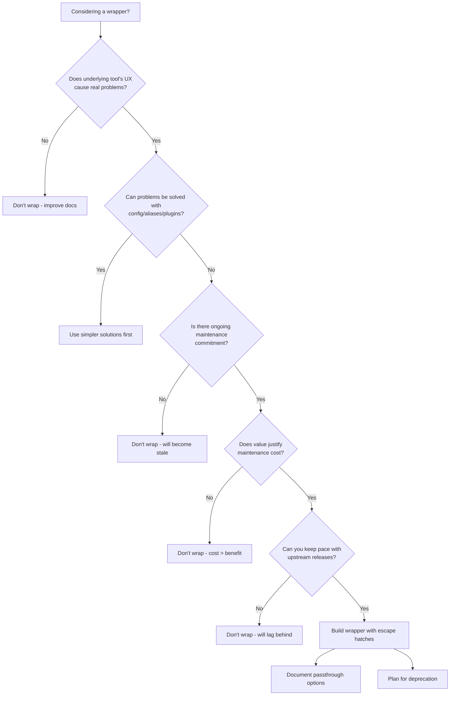
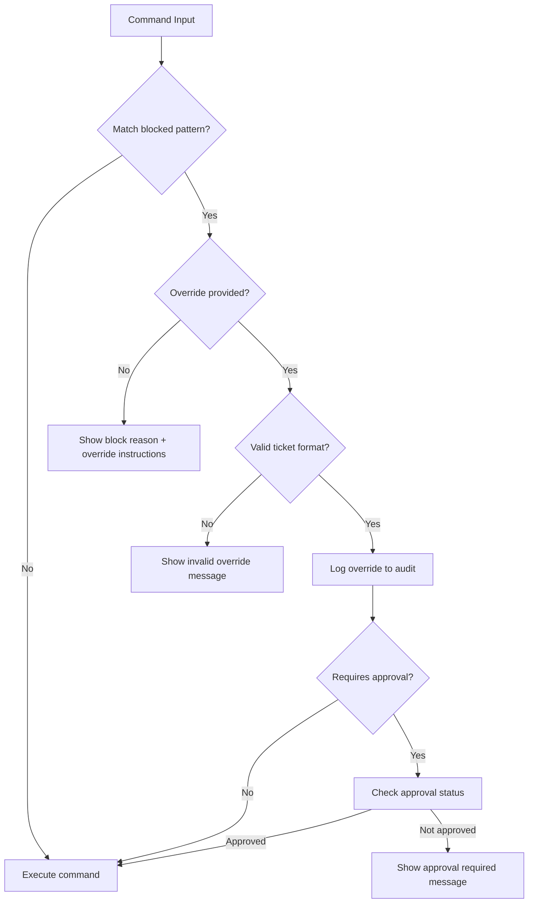
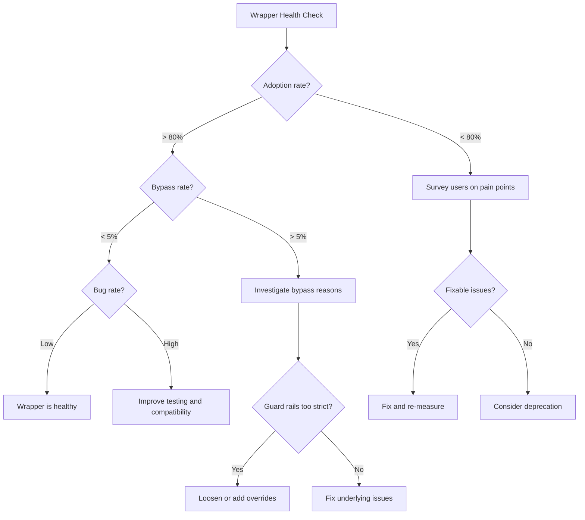

*[CLI]: Command Line Interface
*[API]: Application Programming Interface
*[SDK]: Software Development Kit
*[UX]: User Experience
*[DX]: Developer Experience
*[RBAC]: Role-Based Access Control
*[HCL]: HashiCorp Configuration Language
*[CI]: Continuous Integration
*[CD]: Continuous Deployment

# Internal CLIs: When Wrapping Tools Adds Value

## Introduction

Frame the internal CLI dilemma: platform teams often build wrapper CLIs around kubectl, terraform, helm, and other tools. Sometimes these wrappers genuinely improve developer experience—hiding complexity, enforcing standards, preventing footguns. Other times, they become maintenance nightmares that lag behind upstream, break unexpectedly, and require developers to learn both the wrapper AND the underlying tool. This section establishes criteria for when wrapping adds value versus when it creates overhead.

_Include a scenario: a platform team builds `deploy-cli` that wraps kubectl and helm. Initially it's simpler than raw commands. Then Kubernetes releases a new feature. helm updates its flag syntax. The CLI needs updates, but the original author left. Developers hit cryptic errors. They start bypassing the CLI. The wrapper becomes abandonware that everyone works around._

<Callout type="warning">
The bar for building a wrapper CLI should be high. Every abstraction layer you add is a maintenance commitment. If the underlying tool's UX is good enough with documentation and templates, don't wrap it—improve the docs instead.
</Callout>

## When Wrappers Add Value

### Legitimate Wrapper Use Cases

```yaml title="wrapper-value-analysis.yaml"
high_value_wrappers:
  complexity_hiding:
    description: "Multi-step workflows reduced to single commands"
    example: "deploy-service: builds, pushes, helm upgrades, runs smoke tests"
    value: "Reduces cognitive load, enforces correct sequence"
    criteria:
      - "Workflow requires 5+ manual steps"
      - "Steps have dependencies and ordering"
      - "Errors in sequence cause significant problems"
    warning: "Ensure escape hatches exist for edge cases"

  guard_rails:
    description: "Prevent dangerous operations or enforce policies"
    example: "kubectl-safe: blocks delete in production without approval"
    value: "Prevents outages, enforces compliance"
    criteria:
      - "Underlying tool allows dangerous operations"
      - "Consequences of mistakes are severe"
      - "Policy can be codified clearly"
    warning: "Don't create security theater—real protection or none"

  context_injection:
    description: "Automatically inject environment-specific configuration"
    example: "tf: auto-selects workspace, backend, var files by environment"
    value: "Eliminates wrong-environment mistakes"
    criteria:
      - "Multiple environments with different configs"
      - "Mixing up environments causes real problems"
      - "Context can be reliably detected"
    warning: "Be transparent about what context is injected"

  credential_management:
    description: "Handle authentication complexity transparently"
    example: "kube: auto-refreshes tokens, selects correct cluster config"
    value: "Reduces auth friction, centralizes credential handling"
    criteria:
      - "Auth involves multiple systems"
      - "Tokens expire frequently"
      - "Manual auth management is error-prone"
    warning: "Don't hide auth errors—surface them clearly"

  audit_logging:
    description: "Log all operations for compliance and debugging"
    example: "tf-audit: logs who ran what terraform commands when"
    value: "Compliance, incident investigation, change tracking"
    criteria:
      - "Audit requirements exist"
      - "Underlying tool doesn't provide adequate logging"
      - "Central logging adds significant value"
    warning: "Don't log secrets or sensitive data"

low_value_wrappers:
  alias_collection:
    description: "Just shorter names for common commands"
    example: "k instead of kubectl, tf instead of terraform"
    better_alternative: "Shell aliases, fish abbreviations"
    why_not_wrap: "No logic, just typing savings"

  flag_defaults:
    description: "Hardcoded flag values"
    example: "deploy --replicas=3 always"
    better_alternative: "Config files, environment variables"
    why_not_wrap: "Inflexible, hides what's happening"

  output_formatting:
    description: "Different output format"
    example: "Pretty-printing kubectl output"
    better_alternative: "kubectl plugins, jq, existing tools"
    why_not_wrap: "Solved problem, ecosystem tools exist"
```
Code: Wrapper value analysis framework.

### Decision Framework


Figure: Wrapper decision framework.

| Question | If Yes | If No |
|----------|--------|-------|
| Does the workflow require 5+ manual steps? | Consider wrapping | Use scripts/docs |
| Can mistakes cause production outages? | Consider guard rails | Document best practices |
| Do developers frequently make the same errors? | Consider automation | Improve training |
| Will you maintain this for 3+ years? | May be worth building | Use simpler solutions |
| Can you track upstream releases? | Wrapper is viable | Don't wrap |

Table: Wrapper decision criteria.

<Callout type="info">
The best wrappers are thin. They compose underlying tools rather than reimplementing them. They pass through unfamiliar flags. They surface the underlying tool's help. When developers outgrow the wrapper, the transition to raw tools should be seamless.
</Callout>

## Abstraction Design Principles

### The Transparent Wrapper Pattern

```typescript title="transparent-wrapper.ts"
#!/usr/bin/env node
// Transparent wrapper: adds value while staying out of the way

import { spawn } from 'child_process';
import { program } from 'commander';

interface WrapperConfig {
  tool: string;
  beforeHooks: Hook[];
  afterHooks: Hook[];
  flagTransforms: FlagTransform[];
  blockedCommands: BlockedCommand[];
}

// Core principle: everything not explicitly handled passes through
class TransparentWrapper {
  constructor(private config: WrapperConfig) {}

  async run(args: string[]): Promise<number> {
    const { command, flags, passthroughArgs } = this.parseArgs(args);

    // Check for blocked commands (guard rails)
    const blocked = this.checkBlocked(command, flags);
    if (blocked) {
      console.error(`❌ Blocked: ${blocked.reason}`);
      console.error(`   Override: ${blocked.override}`);
      return 1;
    }

    // Run before hooks (context injection, validation)
    for (const hook of this.config.beforeHooks) {
      const result = await hook.run(command, flags);
      if (!result.continue) {
        console.error(result.message);
        return result.exitCode;
      }
      // Hook may modify flags
      Object.assign(flags, result.addedFlags);
    }

    // Transform flags (environment-specific defaults)
    const transformedFlags = this.transformFlags(flags);

    // Build final command - PASSTHROUGH UNKNOWN FLAGS
    const finalArgs = [
      command,
      ...this.flagsToArgs(transformedFlags),
      ...passthroughArgs,  // Everything we don't understand passes through
    ];

    // Show what we're actually running (transparency)
    if (process.env.WRAPPER_DEBUG) {
      console.error(`[wrapper] Running: ${this.config.tool} ${finalArgs.join(' ')}`);
    }

    // Execute underlying tool
    const exitCode = await this.exec(this.config.tool, finalArgs);

    // Run after hooks (logging, notifications)
    for (const hook of this.config.afterHooks) {
      await hook.run(command, flags, exitCode);
    }

    return exitCode;
  }

  // Pass through to underlying tool's help
  showHelp(): void {
    console.log(`${this.config.tool} wrapper - adds environment context and guard rails\n`);
    console.log('Wrapper-specific options:');
    console.log('  --wrapper-debug    Show underlying command being run');
    console.log('  --wrapper-bypass   Skip all wrapper logic, run tool directly\n');
    console.log('All other options are passed through to the underlying tool.\n');

    // Show underlying tool's help too
    spawn(this.config.tool, ['--help'], { stdio: 'inherit' });
  }

  private exec(tool: string, args: string[]): Promise<number> {
    return new Promise((resolve) => {
      const proc = spawn(tool, args, { stdio: 'inherit' });
      proc.on('close', resolve);
    });
  }
}
```
Code: Transparent wrapper implementation.

### Context Injection

```typescript title="context-injection.ts"
// Automatic environment context injection

interface EnvironmentContext {
  cluster: string;
  namespace: string;
  environment: 'dev' | 'staging' | 'production';
  region: string;
}

class ContextInjector {
  async detectContext(): Promise<EnvironmentContext> {
    // Detection hierarchy: explicit > git branch > directory > config

    // 1. Explicit environment variable
    if (process.env.DEPLOY_ENV) {
      return this.loadContext(process.env.DEPLOY_ENV);
    }

    // 2. Git branch naming convention
    const branch = await this.getGitBranch();
    if (branch) {
      const envMatch = branch.match(/^(dev|staging|prod)/);
      if (envMatch) {
        return this.loadContext(envMatch[1]);
      }
    }

    // 3. Directory structure
    const cwd = process.cwd();
    if (cwd.includes('/environments/')) {
      const envDir = cwd.split('/environments/')[1]?.split('/')[0];
      if (envDir) {
        return this.loadContext(envDir);
      }
    }

    // 4. Default from config
    return this.loadContext('dev');
  }

  // Show detected context clearly
  displayContext(ctx: EnvironmentContext): void {
    console.log('┌─────────────────────────────────────┐');
    console.log(`│ Environment: ${ctx.environment.padEnd(22)}│`);
    console.log(`│ Cluster:     ${ctx.cluster.padEnd(22)}│`);
    console.log(`│ Namespace:   ${ctx.namespace.padEnd(22)}│`);
    console.log(`│ Region:      ${ctx.region.padEnd(22)}│`);
    console.log('└─────────────────────────────────────┘');
  }
}

// kubectl wrapper with context injection
class KubectlWrapper {
  async run(args: string[]): Promise<number> {
    const context = await this.contextInjector.detectContext();

    // Always show context for destructive operations
    if (this.isDestructive(args)) {
      this.contextInjector.displayContext(context);

      if (context.environment === 'production') {
        const confirmed = await this.confirmProduction();
        if (!confirmed) return 1;
      }
    }

    // Inject context as flags
    const contextFlags = [
      `--context=${context.cluster}`,
      `--namespace=${context.namespace}`,
    ];

    // Don't override if user explicitly specified
    const finalArgs = this.mergeFlags(contextFlags, args);

    return this.exec('kubectl', finalArgs);
  }

  private isDestructive(args: string[]): boolean {
    const destructiveVerbs = ['delete', 'drain', 'cordon', 'taint', 'scale'];
    return args.some(arg => destructiveVerbs.includes(arg));
  }
}
```
Code: Context injection with transparency.

<Callout type="success">
Always show injected context. Hidden magic leads to "I thought I was in dev" incidents. A clear banner showing environment, cluster, and namespace before each command prevents mistakes and builds trust in the wrapper.
</Callout>

## Guard Rails Implementation

### Blocking Dangerous Operations

```typescript title="guard-rails.ts"
interface BlockedCommand {
  pattern: RegExp;
  environments: string[];
  reason: string;
  override?: string;
  requiresApproval?: boolean;
}

const kubectlGuardRails: BlockedCommand[] = [
  {
    pattern: /delete\s+(namespace|ns)\s+/,
    environments: ['production', 'staging'],
    reason: 'Namespace deletion requires manual approval',
    override: 'Use --force-delete with ticket number: --force-delete=TICKET-123',
    requiresApproval: true,
  },
  {
    pattern: /delete\s+.*--all/,
    environments: ['production'],
    reason: 'Bulk deletion blocked in production',
    override: 'Delete resources individually or use --force-bulk=TICKET-123',
    requiresApproval: true,
  },
  {
    pattern: /edit\s+(deployment|statefulset|daemonset)/,
    environments: ['production', 'staging'],
    reason: 'Direct edits cause drift from GitOps state',
    override: 'Commit changes to git and let ArgoCD sync',
  },
  {
    pattern: /exec.*--.*sh|bash|\/bin\/sh/,
    environments: ['production'],
    reason: 'Interactive shells in production require audit logging',
    override: 'Use `kube shell --reason="debugging issue X"` for audited access',
  },
  {
    pattern: /scale.*replicas=0/,
    environments: ['production'],
    reason: 'Scaling to zero blocks all traffic',
    override: 'Use `kube scale --replicas=0 --confirm-zero` after verification',
  },
];

const terraformGuardRails: BlockedCommand[] = [
  {
    pattern: /destroy/,
    environments: ['production'],
    reason: 'Terraform destroy in production requires change management',
    override: 'Submit change request, then run with --cm-ticket=CM-123',
    requiresApproval: true,
  },
  {
    pattern: /apply.*-auto-approve/,
    environments: ['production', 'staging'],
    reason: 'Auto-approve bypasses plan review',
    override: 'Remove -auto-approve and review the plan',
  },
  {
    pattern: /state\s+(rm|mv|push)/,
    environments: ['production'],
    reason: 'State manipulation requires pair review',
    override: 'Use `tf state-op` with --reviewer=@teammate',
    requiresApproval: true,
  },
  {
    pattern: /import/,
    environments: ['production'],
    reason: 'Import must be reviewed to prevent state corruption',
    override: 'Use `tf import-reviewed` with plan file',
  },
];

class GuardRailEnforcer {
  constructor(
    private rules: BlockedCommand[],
    private environment: string,
  ) {}

  check(command: string): { blocked: boolean; rule?: BlockedCommand } {
    for (const rule of this.rules) {
      if (!rule.environments.includes(this.environment)) continue;

      if (rule.pattern.test(command)) {
        return { blocked: true, rule };
      }
    }

    return { blocked: false };
  }

  async checkWithOverride(
    command: string,
    providedOverride?: string
  ): Promise<{ allowed: boolean; message?: string }> {
    const result = this.check(command);

    if (!result.blocked) {
      return { allowed: true };
    }

    const rule = result.rule!;

    // Check if valid override provided
    if (providedOverride && rule.override) {
      const ticketPattern = /[A-Z]+-\d+/;
      const ticket = providedOverride.match(ticketPattern)?.[0];

      if (ticket) {
        // Log the override for audit
        await this.logOverride(command, rule, ticket);
        return { allowed: true };
      }
    }

    return {
      allowed: false,
      message: `
❌ BLOCKED: ${rule.reason}

Command: ${command}
Environment: ${this.environment}

To proceed: ${rule.override || 'Contact platform team'}
`,
    };
  }

  private async logOverride(
    command: string,
    rule: BlockedCommand,
    ticket: string
  ): Promise<void> {
    const entry = {
      timestamp: new Date().toISOString(),
      user: process.env.USER,
      command,
      rule: rule.reason,
      ticket,
      environment: this.environment,
    };

    // Send to audit log
    console.warn(`[AUDIT] Override used: ${JSON.stringify(entry)}`);
  }
}
```
Code: Guard rail implementation with override support.


Figure: Guard rail enforcement flow.

<Callout type="warning">
Guard rails must have escape hatches. Emergencies happen. The goal is to slow down and create an audit trail, not to completely prevent necessary operations. A hard block with no override leads to developers bypassing the wrapper entirely.
</Callout>

## Maintenance Burden

### Version Compatibility Matrix

```yaml title="version-compatibility.yaml"
# Tracking upstream tool versions your wrapper supports

compatibility_matrix:
  kubectl_wrapper:
    wrapper_version: "2.3.0"
    tested_versions:
      kubectl:
        - "1.28.x"
        - "1.29.x"
        - "1.30.x"  # Current
      kubernetes_api:
        - "1.27"
        - "1.28"
        - "1.29"
        - "1.30"
    known_issues:
      - version: "kubectl 1.31"
        issue: "New --dry-run syntax not yet supported"
        workaround: "Use --wrapper-bypass for dry-run commands"
        eta: "Next wrapper release"

  terraform_wrapper:
    wrapper_version: "1.5.0"
    tested_versions:
      terraform:
        - "1.6.x"
        - "1.7.x"
        - "1.8.x"  # Current
      providers:
        aws: "5.x"
        google: "5.x"
        azurerm: "3.x"
    known_issues:
      - version: "terraform 1.9"
        issue: "New testing framework flags unrecognized"
        workaround: "Use terraform directly for test commands"

maintenance_schedule:
  upstream_tracking:
    frequency: "Weekly check for new releases"
    automation: "Dependabot for CLI deps, manual for tool versions"

  compatibility_testing:
    frequency: "On each upstream minor release"
    scope: "Full test suite against new version"

  deprecation_policy:
    support_window: "Current + 2 previous minor versions"
    notification: "30 days before dropping support"

  breaking_changes:
    policy: "Semver for wrapper, document upstream breaking changes"
    migration_guide: "Required for any wrapper major version"
```
Code: Version compatibility tracking.

### Automated Compatibility Testing

```typescript title="compatibility-tests.ts"
// CI pipeline for wrapper compatibility testing

interface CompatibilityTest {
  tool: string;
  version: string;
  tests: TestCase[];
}

const kubectlCompatibilityTests: CompatibilityTest[] = [
  {
    tool: 'kubectl',
    version: '1.30.0',
    tests: [
      {
        name: 'get pods passthrough',
        wrapperCommand: 'kube get pods',
        expectedKubectlArgs: ['get', 'pods', '--context=...', '--namespace=...'],
        shouldSucceed: true,
      },
      {
        name: 'apply with context injection',
        wrapperCommand: 'kube apply -f deployment.yaml',
        expectedKubectlArgs: ['apply', '-f', 'deployment.yaml', '--context=...'],
        shouldSucceed: true,
      },
      {
        name: 'delete blocked in prod',
        wrapperCommand: 'kube delete namespace critical',
        environment: 'production',
        shouldSucceed: false,
        expectedError: /Namespace deletion requires/,
      },
      {
        name: 'unknown flags passthrough',
        wrapperCommand: 'kube get pods --new-flag-from-future',
        expectedKubectlArgs: ['get', 'pods', '--new-flag-from-future', ...],
        shouldSucceed: true,  // Unknown flags should pass through
      },
    ],
  },
];

// Test that wrapper doesn't break on new tool versions
describe('Kubectl wrapper compatibility', () => {
  const versions = ['1.28.0', '1.29.0', '1.30.0'];

  for (const version of versions) {
    describe(`kubectl ${version}`, () => {
      beforeAll(async () => {
        // Switch kubectl version (via asdf, mise, or direct download)
        await exec(`asdf local kubectl ${version}`);
      });

      it('should passthrough unknown flags', async () => {
        // New versions may add flags we don't know about
        // Wrapper should not fail on unknown flags
        const result = await runWrapper([
          'get', 'pods', '--some-future-flag',
        ]);

        // Wrapper should attempt passthrough, kubectl may fail
        // but wrapper shouldn't crash
        expect(result.wrapperError).toBeUndefined();
      });

      it('should preserve help output', async () => {
        const wrapperHelp = await runWrapper(['--help']);
        const kubectlHelp = await exec('kubectl --help');

        // Wrapper help should include or link to kubectl help
        expect(wrapperHelp.stdout).toContain('kubectl');
      });

      it('should not mangle complex arguments', async () => {
        // Test with JSONPath, selectors, etc.
        const result = await runWrapper([
          'get', 'pods',
          '-o', 'jsonpath={.items[*].metadata.name}',
          '-l', 'app=myapp,version!=v1',
        ]);

        expect(result.passedToKubectl).toContain(
          '-o', 'jsonpath={.items[*].metadata.name}'
        );
      });
    });
  }
});
```
Code: Compatibility testing framework.

| Maintenance Task | Frequency | Effort | Risk if Skipped |
|------------------|-----------|--------|-----------------|
| Upstream version testing | Monthly | 2-4 hours | Wrapper breaks on upgrade |
| Dependency updates | Weekly | 1 hour | Security vulnerabilities |
| Flag compatibility check | Per upstream release | 2-4 hours | Silent failures |
| Documentation updates | Per wrapper change | 1-2 hours | User confusion |
| Deprecation warnings | Quarterly | 2 hours | Surprise breaking changes |

Table: Wrapper maintenance commitments.

<Callout type="info">
Build compatibility testing into CI. Run your wrapper's test suite against multiple versions of the underlying tool. When a new version breaks tests, you'll know immediately—not when a developer files a bug report.
</Callout>

## Documentation Strategy

### Wrapper Documentation Structure

```markdown title="wrapper-docs-template.md"
# kube - kubectl wrapper

## What This Wrapper Does

kube is a thin wrapper around kubectl that provides:
- **Automatic context injection** - Detects environment from git branch/directory
- **Production guard rails** - Blocks destructive commands without approval
- **Audit logging** - Logs all commands for compliance

## What This Wrapper Does NOT Do

- Replace kubectl knowledge - you still need to understand kubectl
- Hide kubectl output - all output passes through unchanged
- Block emergency access - overrides are always available

## Quick Start

```bash
# Works exactly like kubectl
kube get pods
kube describe deployment my-app

# Context is auto-detected and shown
kube apply -f deployment.yaml
# ┌─────────────────────────────────────┐
# │ Environment: staging                │
# │ Cluster:     staging-us-east-1      │
# └─────────────────────────────────────┘

# Blocked commands show override instructions
kube delete namespace production
# ❌ BLOCKED: Namespace deletion requires manual approval
# To proceed: kube delete namespace production --force-delete=TICKET-123
```

## Passthrough Mode

Everything the wrapper doesn't explicitly handle passes through to kubectl:

```bash
# These all work - wrapper passes unknown flags through
kube get pods -o wide --show-labels
kube logs -f deployment/my-app --since=1h
kube exec -it pod/debug -- /bin/bash
```

## Bypass Mode

Skip all wrapper logic when needed:

```bash
# Run kubectl directly, bypassing all wrapper logic
kube --wrapper-bypass get pods

# Or just use kubectl directly
kubectl get pods
```

## Debugging

See what command the wrapper is actually running:

```bash
WRAPPER_DEBUG=1 kube get pods
# [wrapper] Context: staging-us-east-1/default
# [wrapper] Running: kubectl get pods --context=staging-us-east-1 --namespace=default
```

## Common Issues

### "Unknown flag" errors

The wrapper passes unknown flags to kubectl. If kubectl doesn't recognize a flag,
you'll see kubectl's error. This usually means:
- Typo in the flag name
- Flag only available in newer kubectl version
- Flag requires different syntax

### "Command blocked" when you need to proceed

See the block message for override instructions. All blocks have escape hatches.
```
Code: Wrapper documentation template.

### Teaching Underlying Tools, Not Just the Wrapper

```yaml title="documentation-philosophy.yaml"
documentation_philosophy:
  teach_underlying_tool:
    principle: "Wrapper docs should make users better at the underlying tool"
    implementation:
      - "Link to official kubectl/terraform docs, don't duplicate"
      - "Explain what wrapper translates to in underlying tool"
      - "Show equivalent raw commands alongside wrapper commands"
      - "Encourage graduation to raw tools for advanced use cases"

  transparent_behavior:
    principle: "Users should always know what's happening"
    implementation:
      - "Document every flag the wrapper adds or modifies"
      - "Provide --debug mode showing actual commands"
      - "Never silently swallow output or errors"
      - "Show context before every operation"

  escape_hatches:
    principle: "Users should never be trapped in the wrapper"
    implementation:
      - "Document bypass mode prominently"
      - "Show how to do everything without the wrapper"
      - "Acknowledge when raw tool is better choice"

  failure_transparency:
    principle: "When things go wrong, users should understand why"
    implementation:
      - "Distinguish wrapper errors from tool errors"
      - "Include underlying command in error messages"
      - "Link to troubleshooting for common issues"

anti_patterns:
  hiding_complexity:
    problem: "Wrapper hides what kubectl/terraform is doing"
    consequence: "Users can't troubleshoot or learn"
    fix: "Always show or make available the underlying commands"

  proprietary_concepts:
    problem: "Wrapper introduces new concepts users must learn"
    consequence: "Knowledge doesn't transfer, vendor lock-in"
    fix: "Map wrapper concepts to underlying tool concepts"

  assuming_wrapper_only:
    problem: "Documentation assumes wrapper is only interface"
    consequence: "Users lost when they need raw tool"
    fix: "Document both wrapper and raw tool approaches"
```
Code: Documentation philosophy for transparent wrappers.

<Callout type="success">
The goal of wrapper documentation is to make users competent with the underlying tool, not dependent on the wrapper. When someone "graduates" from the wrapper to raw kubectl, that's success—they're now more capable, not less.
</Callout>

## Signs Your Wrapper Is Failing

### Wrapper Smell Tests

```yaml title="wrapper-smells.yaml"
red_flags:
  developers_bypass_wrapper:
    symptom: "People use raw kubectl/terraform instead of wrapper"
    diagnosis:
      - "Wrapper is slower than raw tool"
      - "Wrapper breaks features people need"
      - "Wrapper errors are confusing"
      - "Guard rails are too restrictive"
    fix: "Survey users, fix pain points, or deprecate"

  wrapper_knowledge_required:
    symptom: "New hires must learn wrapper before tool"
    diagnosis:
      - "Wrapper introduces proprietary concepts"
      - "Wrapper behavior differs from underlying tool"
      - "Can't use internet resources to solve wrapper problems"
    fix: "Align wrapper behavior with tool, improve passthrough"

  changelog_anxiety:
    symptom: "Upstream releases cause wrapper breakage"
    diagnosis:
      - "Wrapper parses tool output (fragile)"
      - "Wrapper assumes specific flag syntax"
      - "No compatibility testing"
    fix: "Make wrapper more resilient, improve testing"

  documentation_divergence:
    symptom: "Wrapper docs are always out of date"
    diagnosis:
      - "Too many wrapper-specific features"
      - "No doc automation"
      - "Wrapper changes faster than docs"
    fix: "Reduce wrapper surface area, automate docs"

  single_maintainer_dependency:
    symptom: "Only one person can fix wrapper issues"
    diagnosis:
      - "Wrapper is complex"
      - "No documentation of internals"
      - "Tribal knowledge required"
    fix: "Simplify, document, or deprecate"

health_metrics:
  adoption_rate:
    healthy: "> 80% of commands through wrapper"
    warning: "50-80% through wrapper"
    critical: "< 50% through wrapper"

  bypass_rate:
    healthy: "< 5% use --bypass flag"
    warning: "5-20% use --bypass"
    critical: "> 20% use --bypass"

  time_to_update:
    healthy: "Wrapper updated within 1 week of upstream"
    warning: "1-4 weeks behind upstream"
    critical: "> 4 weeks behind upstream"

  bug_rate:
    healthy: "< 1 wrapper bug per month"
    warning: "1-4 wrapper bugs per month"
    critical: "> 4 wrapper bugs per month"
```
Code: Wrapper health indicators.


Figure: Wrapper health assessment flow.

<Callout type="danger">
If developers routinely bypass your wrapper, it's already failed. A wrapper that people work around is worse than no wrapper—it's complexity with no benefit. Either fix the pain points or deprecate gracefully.
</Callout>

## Deprecation Path

### Graceful Wrapper Sunset

```typescript title="deprecation-strategy.ts"
// Gradual deprecation with clear migration path

class DeprecationManager {
  private deprecationPhases = [
    {
      phase: 1,
      name: 'Announcement',
      duration: '30 days',
      behavior: 'Show deprecation notice on every run',
      action: () => this.showDeprecationNotice(),
    },
    {
      phase: 2,
      name: 'Migration assistance',
      duration: '60 days',
      behavior: 'Show equivalent raw command alongside wrapper execution',
      action: () => this.showMigrationHint(),
    },
    {
      phase: 3,
      name: 'Opt-in only',
      duration: '30 days',
      behavior: 'Wrapper disabled by default, enable with flag',
      action: () => this.requireOptIn(),
    },
    {
      phase: 4,
      name: 'Removal',
      duration: 'Final',
      behavior: 'Wrapper removed, show removal notice',
      action: () => this.showRemovalNotice(),
    },
  ];

  private showDeprecationNotice(): void {
    console.warn(`
╔══════════════════════════════════════════════════════════════════╗
║  DEPRECATION NOTICE: kube wrapper will be retired on 2024-06-01  ║
║                                                                  ║
║  Why: kubectl's native features now cover our use cases          ║
║  Migration: See https://wiki.company.com/kube-migration          ║
║  Questions: #platform-support                                    ║
╚══════════════════════════════════════════════════════════════════╝
`);
  }

  private showMigrationHint(): void {
    // Show the raw command that would accomplish the same thing
    const rawCommand = this.translateToRawCommand(this.currentCommand);
    console.warn(`
[Migration hint] Equivalent kubectl command:
  ${rawCommand}
  
Learn more: https://wiki.company.com/kube-migration
`);
  }

  private translateToRawCommand(wrapperCommand: string[]): string {
    // Show users exactly what to type without the wrapper
    return `kubectl ${wrapperCommand.join(' ')} --context=\${KUBE_CONTEXT}`;
  }
}

// Migration guide content
const migrationGuide = `
# Migrating from kube wrapper to kubectl

## Why we're deprecating

The kube wrapper was built when:
- kubectl didn't support context files well
- We needed custom guard rails for production
- Multi-cluster management was painful

Today:
- kubectl contexts work well
- OPA Gatekeeper provides guard rails in-cluster
- GitOps handles most deployments

## Migration steps

### 1. Set up kubectl contexts

\`\`\`bash
# Your contexts are already configured, just use them directly
kubectl config get-contexts

# Set default context
kubectl config use-context staging-us-east-1
\`\`\`

### 2. Use kubectl directly

\`\`\`bash
# Before (wrapper)
kube get pods

# After (kubectl)
kubectl get pods
\`\`\`

### 3. Production safeguards

Guard rails are now enforced by OPA Gatekeeper in-cluster.
Dangerous operations are blocked at the API server level.

## Common wrapper features and alternatives

| Wrapper feature | Alternative |
|-----------------|-------------|
| Auto-context | \`kubectl config use-context\` or kubie |
| Prod confirmation | OPA Gatekeeper policies |
| Audit logging | Kubernetes audit logs |
| Command shortcuts | Shell aliases |
`;
```
Code: Deprecation strategy with migration path.

<Callout type="info">
When deprecating a wrapper, provide concrete alternatives for every feature. "Use kubectl" isn't helpful. "Use `kubectl config use-context` for environment switching, OPA Gatekeeper for guard rails, and Kubernetes audit logs for compliance" is actionable.
</Callout>

## Conclusion

Summarize the key principles: wrappers should add demonstrable value—complexity hiding, guard rails, context injection—not just provide aliases; design for transparency with passthrough of unknown flags and visible context injection; plan for maintenance from day one with compatibility testing; document to teach the underlying tool, not create wrapper dependency; and monitor wrapper health through adoption and bypass rates. Emphasize that the best wrapper is one that makes itself unnecessary over time as users become proficient with the underlying tool.

<Callout type="success">
A successful wrapper eventually gets deprecated—not because it failed, but because users learned the underlying tool and the ecosystem caught up. Build wrappers with their eventual retirement in mind. The goal is empowerment, not dependence.
</Callout>

---

## Cover Prompt

### Prompt 1: The Thin Layer

Create an image of a transparent glass layer sitting between a developer's hands and a complex tool dashboard. The glass layer simplifies the view—filtering, organizing, highlighting important controls—but the underlying tool is still visible through it. Arrows show passthrough of commands. Style: transparent interface, layered visualization, clarity through abstraction, 16:9 aspect ratio.

### Prompt 2: The Translation Bridge

Design an image of a bridge connecting two lands: "Developer Intent" on one side and "Tool Complexity" on the other. The bridge has translators who convert simple requests into complex commands, but there's also a direct path for those who want to cross without translation. Style: bridge metaphor, translation service, optional assistance, 16:9 aspect ratio.

### Prompt 3: The Guard Rail Highway

Illustrate a highway with guard rails along the edges. Vehicles (commands) travel freely on the main road, but the rails prevent driving off cliffs labeled "Production Delete" and "Accidental Destroy." Emergency exits exist with gates that require keys (tickets). Style: highway safety, protective barriers, escape hatches, 16:9 aspect ratio.

### Prompt 4: The Wrapper Lifecycle

Create an image showing the lifecycle of a wrapper: born as a helpful assistant, growing with features, becoming bloated with complexity, and finally transforming into documentation as users outgrow it. A timeline shows healthy metrics at each stage. Style: lifecycle visualization, evolution metaphor, graceful sunset, 16:9 aspect ratio.

### Prompt 5: The Transparent Toolbox

Design an image of a transparent toolbox that holds regular tools (kubectl, terraform, helm) but has smart compartments that organize them, label them by environment, and prevent certain tools from being used in certain areas. The tools themselves are unchanged—just better organized. Style: transparent container, organization system, smart storage, 16:9 aspect ratio.
