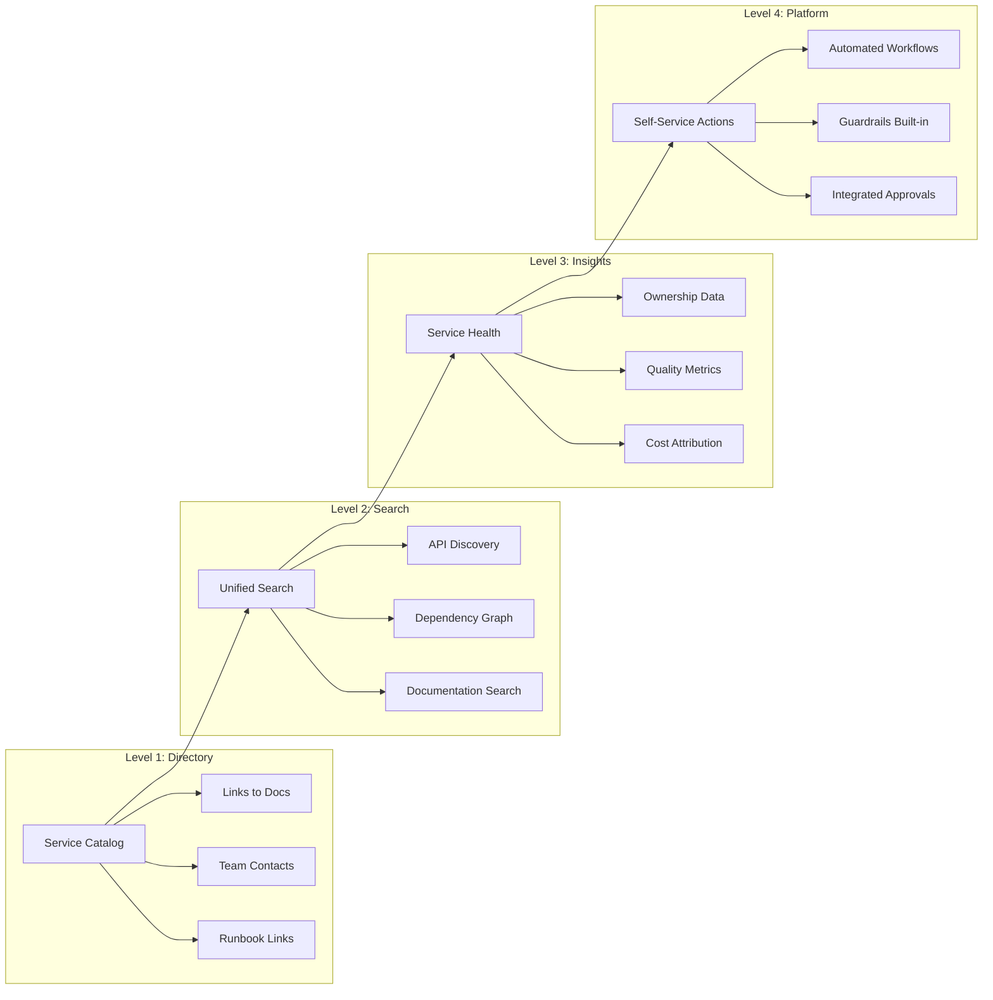
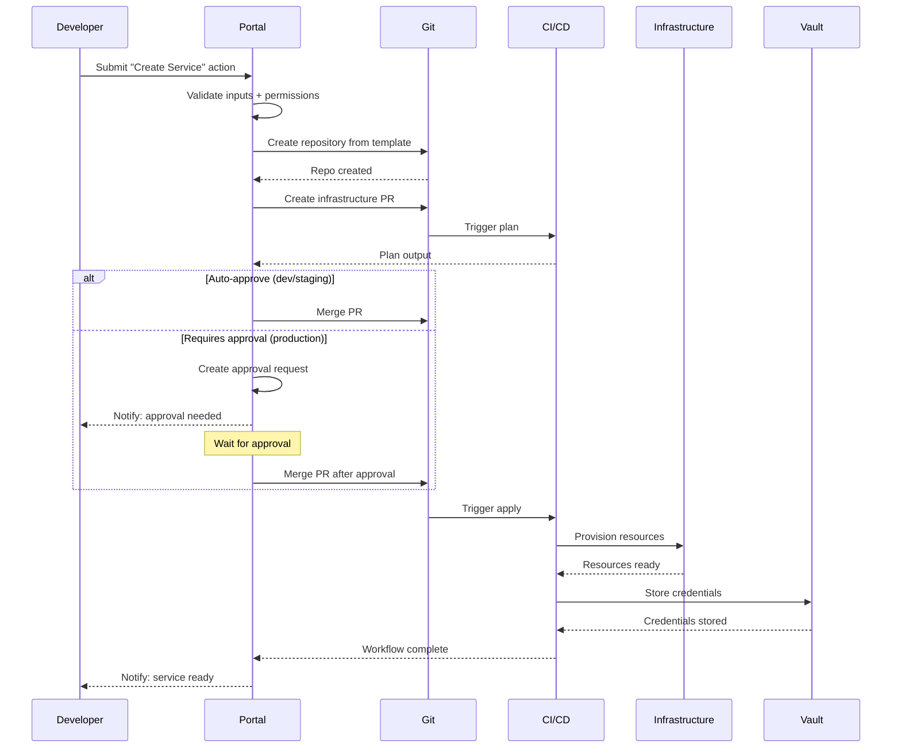
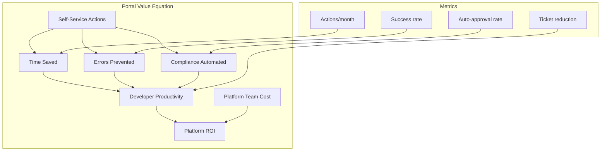

*[IDP]: Internal Developer Portal/Platform
*[API]: Application Programming Interface
*[CI]: Continuous Integration
*[CD]: Continuous Deployment
*[RBAC]: Role-Based Access Control
*[SSO]: Single Sign-On
*[K8s]: Kubernetes
*[PR]: Pull Request
*[SLA]: Service Level Agreement

# Portal vs Platform: Why Your IDP Is Just Links

## Introduction

Frame the portal-vs-platform distinction: many organizations build an "Internal Developer Portal" that's essentially a wiki with links—service catalogs, runbook pointers, team contact lists. These are useful but don't reduce toil. A true platform does things: provisions infrastructure, creates repositories, deploys services, grants access. The difference is between "here's the documentation for how to request a database" and "click here to get a database." This section establishes that self-service actions are what transform a portal from a directory into a platform.

_Include a scenario: a developer needs a new PostgreSQL database for a feature. In a portal-only world, they find a Confluence page with instructions to file a Jira ticket, wait for the DBA team, attend a review meeting, and get credentials in 3-5 business days. In a platform world, they select "New Database" in the portal, fill out a form, and have a provisioned database with credentials in 15 minutes._

<Callout type="warning">
If your "platform" requires developers to read documentation and file tickets to get things done, you've built a directory, not a platform. Platforms execute workflows. Directories point to workflows that humans execute.
</Callout>

## The Portal Maturity Model

### From Links to Actions


Figure: Portal maturity progression.

```yaml title="maturity-levels.yaml"
portal_maturity:
  level_1_directory:
    description: "Aggregated links and documentation"
    value: "Single place to find information"
    limitation: "Developers still do all the work"
    examples:
      - "Confluence home page"
      - "GitHub wiki with service list"
      - "Spreadsheet of services and owners"
    developer_experience: "I know where to look, but I still have to do everything manually"

  level_2_search:
    description: "Searchable, indexed knowledge"
    value: "Faster discovery, less context switching"
    limitation: "Finding doesn't mean doing"
    examples:
      - "Backstage with service catalog"
      - "Searchable API registry"
      - "Dependency graph visualization"
    developer_experience: "I can find what I need quickly, but getting things done still requires tickets"

  level_3_insights:
    description: "Aggregated metrics and health data"
    value: "Visibility into system state"
    limitation: "Seeing problems doesn't fix them"
    examples:
      - "Service scorecards"
      - "Tech debt tracking"
      - "Ownership and coverage reports"
    developer_experience: "I can see what's wrong, but fixing it requires navigating multiple systems"

  level_4_platform:
    description: "Self-service actions with automation"
    value: "Developers can do, not just see"
    limitation: "Requires significant investment"
    examples:
      - "One-click service creation"
      - "Automated environment provisioning"
      - "Self-service access requests with auto-approval"
    developer_experience: "I can get what I need without waiting for other teams"

value_comparison:
  metric: "Time to provision new database"
  level_1: "3-5 business days (ticket, review, manual provisioning)"
  level_2: "3-5 business days (easier to find docs, same process)"
  level_3: "3-5 business days (can see queue length, same process)"
  level_4: "15 minutes (self-service with guardrails)"
```
Code: Portal maturity levels with concrete examples.

| Level | What Developers Can Do | What Developers Still Can't Do |
|-------|------------------------|-------------------------------|
| Directory | Find documentation | Execute workflows |
| Search | Quickly find services and APIs | Provision or modify resources |
| Insights | See health and ownership | Fix issues without tickets |
| Platform | Self-service common tasks | Only edge cases need tickets |

Table: Capability comparison across maturity levels.

<Callout type="info">
Most organizations plateau at Level 2 or 3. They build beautiful service catalogs with scorecards and graphs, but developers still file tickets for everything. The jump to Level 4 requires different thinking: instead of "what should developers know?" ask "what should developers be able to do?"
</Callout>

## Self-Service Action Design

### Anatomy of a Good Action

```yaml title="action-anatomy.yaml"
# Well-designed self-service action structure

action:
  id: "provision-postgresql-database"
  name: "Create PostgreSQL Database"
  description: "Provision a new PostgreSQL database with configured access"

  # Clear categorization
  category: "Databases"
  tags: ["postgresql", "data", "self-service"]

  # Ownership and support
  owner: "platform-data-team"
  support_channel: "#data-platform-help"
  documentation: "https://wiki/database-provisioning"

  # Input form
  inputs:
    - id: "name"
      label: "Database Name"
      type: "string"
      required: true
      validation:
        pattern: "^[a-z][a-z0-9-]{2,30}$"
        message: "Lowercase letters, numbers, hyphens. 3-31 chars."

    - id: "environment"
      label: "Environment"
      type: "select"
      required: true
      options:
        - value: "dev"
          label: "Development"
        - value: "staging"
          label: "Staging"
        - value: "production"
          label: "Production"
          requires_approval: true

    - id: "size"
      label: "Instance Size"
      type: "select"
      required: true
      options:
        - value: "small"
          label: "Small (2 vCPU, 8GB RAM) - $50/mo"
        - value: "medium"
          label: "Medium (4 vCPU, 16GB RAM) - $150/mo"
        - value: "large"
          label: "Large (8 vCPU, 32GB RAM) - $400/mo"
          requires_approval: true

    - id: "owner_team"
      label: "Owning Team"
      type: "team_picker"
      required: true
      default: "{{current_user.team}}"

  # What happens when submitted
  workflow:
    steps:
      - name: "Validate request"
        action: "validate"
        checks:
          - "User has database provisioning permission"
          - "Team hasn't exceeded database quota"
          - "Name not already in use"

      - name: "Create Terraform PR"
        action: "create_pull_request"
        repository: "infrastructure/databases"
        template: "postgresql-instance"
        variables:
          db_name: "{{inputs.name}}"
          environment: "{{inputs.environment}}"
          instance_class: "{{inputs.size}}"
          owner_team: "{{inputs.owner_team}}"

      - name: "Auto-merge if approved"
        action: "conditional_merge"
        condition: "{{inputs.environment}} != 'production'"

      - name: "Wait for Terraform apply"
        action: "wait_for_pipeline"
        timeout: "15m"

      - name: "Store credentials"
        action: "create_secret"
        vault_path: "databases/{{inputs.name}}"

      - name: "Notify user"
        action: "notify"
        channels: ["email", "slack"]
        message: "Database {{inputs.name}} is ready. Credentials at {{vault_path}}"

  # What the user sees
  outputs:
    - name: "connection_string"
      label: "Connection String"
      sensitive: true
    - name: "credentials_location"
      label: "Credentials Location"
    - name: "dashboard_link"
      label: "Monitoring Dashboard"
```
Code: Well-designed self-service action structure.

### Action Design Principles

```typescript title="action-design-principles.ts"
// Principles for designing self-service actions

interface ActionDesignPrinciples {
  // Principle 1: Obvious outcomes
  obviousOutcomes: {
    rule: 'User should know exactly what will happen before clicking submit';
    implementation: [
      'Show preview of resources to be created',
      'Display cost estimates',
      'List permissions that will be granted',
      'Show timeline for completion',
    ];
    antiPattern: 'Submit and pray - user has no idea what happens next';
  };

  // Principle 2: Sensible defaults
  sensibleDefaults: {
    rule: 'Most fields should have good defaults for common cases';
    implementation: [
      'Pre-fill team from user context',
      'Default to smallest viable size',
      'Default to dev environment',
      'Pre-select common options',
    ];
    antiPattern: 'Blank form requiring research to fill out';
  };

  // Principle 3: Guardrails, not gates
  guardrailsNotGates: {
    rule: 'Prevent mistakes, dont block legitimate work';
    implementation: [
      'Validate inputs in real-time',
      'Warn about expensive choices',
      'Block only truly dangerous operations',
      'Auto-approve within policy bounds',
    ];
    antiPattern: 'Every request requires manual approval';
  };

  // Principle 4: Transparent execution
  transparentExecution: {
    rule: 'User can see what is happening and why';
    implementation: [
      'Show workflow steps and progress',
      'Link to underlying PR/pipeline',
      'Explain approval requirements',
      'Surface errors clearly',
    ];
    antiPattern: 'Black box - submitted, no visibility';
  };

  // Principle 5: Recoverable failures
  recoverableFailures: {
    rule: 'Failures should be fixable without starting over';
    implementation: [
      'Retry failed steps',
      'Edit and resubmit',
      'Clear error messages with remediation',
      'Partial completion handling',
    ];
    antiPattern: 'Failure requires filing a ticket';
  };
}

// Example: Database provisioning form with good UX
const databaseProvisioningForm: ActionForm = {
  sections: [
    {
      title: 'Basic Information',
      description: 'Name and environment for your database',
      fields: [
        {
          id: 'name',
          type: 'text',
          label: 'Database Name',
          placeholder: 'my-service-db',
          helpText: 'Lowercase, hyphens allowed. Will be prefixed with team name.',
          validation: {
            pattern: /^[a-z][a-z0-9-]{2,20}$/,
            realtime: true,  // Validate as user types
          },
          preview: (value, context) =>
            `Full name: ${context.team}-${value}-${context.environment}`,
        },
      ],
    },
    {
      title: 'Sizing',
      description: 'Choose based on expected load',
      helpLink: '/docs/database-sizing-guide',
      fields: [
        {
          id: 'size',
          type: 'select',
          label: 'Instance Size',
          options: DATABASE_SIZES,
          default: 'small',
          onChange: (value, form) => {
            // Update cost estimate when size changes
            form.setCostEstimate(calculateCost(value, form.values.environment));
          },
        },
      ],
    },
  ],

  // Show what will be created before submit
  preview: (values) => ({
    resources: [
      { type: 'RDS Instance', name: `${values.team}-${values.name}` },
      { type: 'Security Group', name: `${values.name}-sg` },
      { type: 'IAM Role', name: `${values.name}-access` },
      { type: 'Vault Secret', name: `databases/${values.name}` },
    ],
    cost: calculateMonthlyCost(values),
    timeline: values.environment === 'production' ? '~30 min (requires approval)' : '~15 min',
  }),
};
```
Code: Action design principles with implementation examples.

<Callout type="success">
The best self-service actions feel like filling out a form to order something online: clear options, sensible defaults, transparent pricing, and a tracking number when you submit. If your action feels like filling out a government form, redesign it.
</Callout>

## Workflow Automation

### Orchestrating Multi-Step Actions


Figure: Multi-step service creation workflow.

```typescript title="workflow-orchestration.ts"
// Workflow orchestration engine for self-service actions

interface WorkflowStep {
  id: string;
  name: string;
  action: string;
  inputs: Record<string, any>;
  onSuccess?: string;  // Next step ID
  onFailure?: 'retry' | 'abort' | 'skip' | string;
  timeout?: string;
  retries?: number;
}

interface Workflow {
  id: string;
  name: string;
  steps: WorkflowStep[];
  rollback?: WorkflowStep[];
}

class WorkflowEngine {
  async execute(
    workflow: Workflow,
    context: WorkflowContext
  ): Promise<WorkflowResult> {
    const execution = await this.createExecution(workflow, context);

    for (const step of workflow.steps) {
      try {
        // Update status
        await this.updateStepStatus(execution.id, step.id, 'running');
        this.notifyProgress(context.user, step.name, 'running');

        // Execute step
        const result = await this.executeStep(step, context);

        // Store result for subsequent steps
        context.stepResults[step.id] = result;

        await this.updateStepStatus(execution.id, step.id, 'completed', result);
        this.notifyProgress(context.user, step.name, 'completed');

      } catch (error) {
        await this.updateStepStatus(execution.id, step.id, 'failed', { error });

        // Handle failure based on configuration
        switch (step.onFailure) {
          case 'retry':
            const retried = await this.retryStep(step, context, step.retries || 3);
            if (!retried.success) {
              return this.handleWorkflowFailure(workflow, execution, step, context);
            }
            break;

          case 'skip':
            // Continue to next step
            break;

          case 'abort':
          default:
            return this.handleWorkflowFailure(workflow, execution, step, context);
        }
      }
    }

    return {
      success: true,
      executionId: execution.id,
      outputs: this.collectOutputs(workflow, context),
    };
  }

  private async handleWorkflowFailure(
    workflow: Workflow,
    execution: WorkflowExecution,
    failedStep: WorkflowStep,
    context: WorkflowContext
  ): Promise<WorkflowResult> {
    // Execute rollback if defined
    if (workflow.rollback) {
      this.notifyProgress(context.user, 'Rolling back...', 'running');

      for (const rollbackStep of workflow.rollback) {
        try {
          await this.executeStep(rollbackStep, context);
        } catch (rollbackError) {
          // Log but continue rollback
          console.error('Rollback step failed:', rollbackError);
        }
      }
    }

    return {
      success: false,
      executionId: execution.id,
      failedStep: failedStep.id,
      error: `Workflow failed at step: ${failedStep.name}`,
      rollbackCompleted: !!workflow.rollback,
    };
  }
}

// Example: Service creation workflow
const createServiceWorkflow: Workflow = {
  id: 'create-service',
  name: 'Create New Service',
  steps: [
    {
      id: 'validate',
      name: 'Validate Request',
      action: 'validate-service-request',
      inputs: {
        serviceName: '{{inputs.name}}',
        team: '{{inputs.team}}',
      },
      onFailure: 'abort',
    },
    {
      id: 'create-repo',
      name: 'Create Repository',
      action: 'github-create-repo',
      inputs: {
        name: '{{inputs.name}}',
        template: '{{inputs.template}}',
        team: '{{inputs.team}}',
      },
      onFailure: 'abort',
    },
    {
      id: 'create-infra-pr',
      name: 'Create Infrastructure PR',
      action: 'create-terraform-pr',
      inputs: {
        repository: 'infrastructure',
        template: 'service-resources',
        variables: {
          service_name: '{{inputs.name}}',
          environment: '{{inputs.environment}}',
        },
      },
      onFailure: 'abort',
    },
    {
      id: 'wait-for-approval',
      name: 'Wait for Approval',
      action: 'wait-for-pr-approval',
      inputs: {
        prUrl: '{{steps.create-infra-pr.outputs.pr_url}}',
        autoApprove: '{{inputs.environment}} != "production"',
      },
      timeout: '24h',
      onFailure: 'abort',
    },
    {
      id: 'apply-terraform',
      name: 'Apply Infrastructure',
      action: 'wait-for-pipeline',
      inputs: {
        pipelineUrl: '{{steps.create-infra-pr.outputs.pipeline_url}}',
      },
      timeout: '30m',
      onFailure: 'retry',
      retries: 2,
    },
    {
      id: 'register-service',
      name: 'Register in Service Catalog',
      action: 'register-service',
      inputs: {
        name: '{{inputs.name}}',
        repository: '{{steps.create-repo.outputs.repo_url}}',
        owner: '{{inputs.team}}',
      },
      onFailure: 'skip',  // Non-critical
    },
    {
      id: 'notify',
      name: 'Send Notification',
      action: 'notify-user',
      inputs: {
        user: '{{context.user}}',
        message: 'Service {{inputs.name}} is ready!',
        links: {
          repository: '{{steps.create-repo.outputs.repo_url}}',
          dashboard: '{{steps.apply-terraform.outputs.dashboard_url}}',
        },
      },
      onFailure: 'skip',
    },
  ],
  rollback: [
    {
      id: 'delete-repo',
      name: 'Delete Repository',
      action: 'github-delete-repo',
      inputs: {
        name: '{{inputs.name}}',
      },
    },
    {
      id: 'close-pr',
      name: 'Close Infrastructure PR',
      action: 'github-close-pr',
      inputs: {
        prUrl: '{{steps.create-infra-pr.outputs.pr_url}}',
      },
    },
  ],
};
```
Code: Workflow orchestration with rollback support.

<Callout type="warning">
Every workflow needs a rollback plan. If step 4 fails, what happens to resources created in steps 1-3? Orphaned repositories, half-provisioned infrastructure, and dangling credentials erode trust in self-service. Design for failure from the start.
</Callout>

## Approval Workflows

### Smart Approval Routing

```yaml title="approval-policies.yaml"
# Approval policy configuration

approval_policies:
  # Policy 1: Environment-based
  environment_based:
    description: "Production changes require approval"
    rules:
      - condition: "environment == 'production'"
        requires_approval: true
        approvers:
          - type: "team_lead"
            team: "{{request.team}}"
          - type: "role"
            role: "platform-approver"
        approval_count: 1

      - condition: "environment == 'staging'"
        requires_approval: false
        auto_approve: true

      - condition: "environment == 'dev'"
        requires_approval: false
        auto_approve: true

  # Policy 2: Cost-based
  cost_based:
    description: "Expensive resources require approval"
    rules:
      - condition: "estimated_monthly_cost > 500"
        requires_approval: true
        approvers:
          - type: "team_lead"
            team: "{{request.team}}"
          - type: "finance"
        approval_count: 2

      - condition: "estimated_monthly_cost > 100"
        requires_approval: true
        approvers:
          - type: "team_lead"
            team: "{{request.team}}"
        approval_count: 1

      - condition: "estimated_monthly_cost <= 100"
        requires_approval: false
        auto_approve: true

  # Policy 3: Scope-based
  scope_based:
    description: "Changes affecting multiple teams require broader approval"
    rules:
      - condition: "affected_teams.length > 1"
        requires_approval: true
        approvers:
          - type: "each_team_lead"
            teams: "{{affected_teams}}"
        approval_count: "all"

  # Policy 4: Time-based
  time_based:
    description: "Off-hours changes require additional approval"
    rules:
      - condition: "is_change_freeze_window()"
        requires_approval: true
        approvers:
          - type: "role"
            role: "change-freeze-exception"
        approval_count: 1
        message: "Change freeze is active. Exception required."

  # Policy 5: Risk-based
  risk_based:
    description: "High-risk operations require senior approval"
    high_risk_operations:
      - "delete_database"
      - "modify_iam_permissions"
      - "change_network_config"
      - "modify_encryption_keys"
    rules:
      - condition: "operation in high_risk_operations"
        requires_approval: true
        approvers:
          - type: "role"
            role: "security-reviewer"
          - type: "team_lead"
            team: "{{request.team}}"
        approval_count: 2
```
Code: Flexible approval policy configuration.

### Approval UX

```typescript title="approval-system.ts"
interface ApprovalRequest {
  id: string;
  workflowExecutionId: string;
  actionName: string;
  requestedBy: User;
  requestedAt: Date;

  // What's being requested
  summary: string;
  details: Record<string, any>;
  impact: ImpactAssessment;

  // Approval requirements
  requiredApprovals: ApprovalRequirement[];
  currentApprovals: Approval[];
  status: 'pending' | 'approved' | 'rejected' | 'expired';

  // Context for approvers
  links: {
    terraformPlan?: string;
    costEstimate?: string;
    documentation?: string;
  };
}

interface ImpactAssessment {
  environment: string;
  affectedServices: string[];
  estimatedCost: number;
  riskLevel: 'low' | 'medium' | 'high';
  rollbackPossible: boolean;
}

class ApprovalService {
  async createApprovalRequest(
    execution: WorkflowExecution,
    policy: ApprovalPolicy
  ): Promise<ApprovalRequest> {
    const request: ApprovalRequest = {
      id: generateId(),
      workflowExecutionId: execution.id,
      actionName: execution.workflow.name,
      requestedBy: execution.context.user,
      requestedAt: new Date(),

      summary: this.generateSummary(execution),
      details: execution.context.inputs,
      impact: await this.assessImpact(execution),

      requiredApprovals: policy.getRequiredApprovers(execution),
      currentApprovals: [],
      status: 'pending',

      links: {
        terraformPlan: execution.stepResults['create-infra-pr']?.planUrl,
        costEstimate: execution.stepResults['validate']?.costEstimate,
      },
    };

    await this.store.save(request);
    await this.notifyApprovers(request);

    return request;
  }

  private async notifyApprovers(request: ApprovalRequest): Promise<void> {
    const approvers = this.resolveApprovers(request.requiredApprovals);

    for (const approver of approvers) {
      await this.notifications.send(approver, {
        type: 'approval_request',
        title: `Approval needed: ${request.actionName}`,
        body: `
${request.requestedBy.name} is requesting approval for:

**${request.summary}**

Environment: ${request.impact.environment}
Estimated Cost: $${request.impact.estimatedCost}/month
Risk Level: ${request.impact.riskLevel}

[Review and Approve](${this.getApprovalUrl(request)})
        `,
        actions: [
          { label: 'Approve', action: 'approve', primary: true },
          { label: 'Reject', action: 'reject' },
          { label: 'View Details', action: 'view' },
        ],
      });
    }
  }

  async approve(
    requestId: string,
    approver: User,
    comment?: string
  ): Promise<ApprovalRequest> {
    const request = await this.store.get(requestId);

    // Validate approver is authorized
    if (!this.isAuthorizedApprover(approver, request)) {
      throw new Error('User is not authorized to approve this request');
    }

    // Add approval
    request.currentApprovals.push({
      approver,
      decision: 'approved',
      comment,
      timestamp: new Date(),
    });

    // Check if all requirements met
    if (this.isFullyApproved(request)) {
      request.status = 'approved';
      await this.resumeWorkflow(request.workflowExecutionId);
    }

    await this.store.save(request);
    await this.notifyRequestor(request, 'approval_received');

    return request;
  }
}
```
Code: Approval system with notification and tracking.

| Approval Type | Use Case | SLA | Auto-Escalation |
|---------------|----------|-----|-----------------|
| Auto-approve | Dev/staging, low cost | Instant | N/A |
| Single approver | Standard production | 4 hours | After 2 hours |
| Multiple approvers | High risk, multi-team | 8 hours | After 4 hours |
| Sequential approval | Compliance-critical | 24 hours | After 8 hours |

Table: Approval types and SLAs.

<Callout type="info">
Approvals should be the exception, not the rule. If most requests require manual approval, you haven't built self-service—you've built a ticket system with a nicer UI. Use policy-based auto-approval aggressively for low-risk operations.
</Callout>

## Integration Patterns

### Connecting to Existing Systems

```yaml title="integration-architecture.yaml"
integration_patterns:
  git_provider:
    purpose: "Repository creation, PR management"
    integrations:
      - name: "GitHub"
        capabilities:
          - "Create repositories from templates"
          - "Create/merge pull requests"
          - "Manage team permissions"
          - "Trigger workflows"
        auth: "GitHub App"

      - name: "GitLab"
        capabilities:
          - "Create projects from templates"
          - "Create/merge merge requests"
          - "Manage group access"
          - "Trigger pipelines"
        auth: "Access Token"

  infrastructure:
    purpose: "Resource provisioning"
    integrations:
      - name: "Terraform Cloud"
        capabilities:
          - "Create workspaces"
          - "Queue plans/applies"
          - "Read state outputs"
        auth: "API Token"

      - name: "AWS"
        capabilities:
          - "Direct resource creation"
          - "Read resource state"
        auth: "IAM Role (assume role)"

      - name: "Kubernetes"
        capabilities:
          - "Apply manifests"
          - "Create namespaces"
          - "Manage RBAC"
        auth: "ServiceAccount"

  secrets:
    purpose: "Credential management"
    integrations:
      - name: "HashiCorp Vault"
        capabilities:
          - "Create secrets"
          - "Generate credentials"
          - "Manage policies"
        auth: "AppRole"

      - name: "AWS Secrets Manager"
        capabilities:
          - "Create/read secrets"
          - "Automatic rotation"
        auth: "IAM Role"

  observability:
    purpose: "Monitoring and alerting"
    integrations:
      - name: "Datadog"
        capabilities:
          - "Create dashboards"
          - "Configure monitors"
          - "Set up SLOs"
        auth: "API Key"

      - name: "PagerDuty"
        capabilities:
          - "Create services"
          - "Configure escalations"
        auth: "API Key"

  communication:
    purpose: "Notifications"
    integrations:
      - name: "Slack"
        capabilities:
          - "Send messages"
          - "Interactive approvals"
          - "Channel creation"
        auth: "Bot Token"

      - name: "Email"
        capabilities:
          - "Send notifications"
        auth: "SMTP/SendGrid"
```
Code: Portal integration architecture.

```typescript title="integration-adapter.ts"
// Integration adapter pattern for extensible platform

interface IntegrationAdapter {
  id: string;
  type: string;
  capabilities: string[];

  // Standard methods all adapters implement
  healthCheck(): Promise<HealthStatus>;
  execute(action: string, params: Record<string, any>): Promise<ActionResult>;
}

// GitHub adapter implementation
class GitHubAdapter implements IntegrationAdapter {
  id = 'github';
  type = 'git_provider';
  capabilities = [
    'create_repository',
    'create_pull_request',
    'merge_pull_request',
    'add_team_to_repo',
  ];

  constructor(private octokit: Octokit) {}

  async execute(action: string, params: Record<string, any>): Promise<ActionResult> {
    switch (action) {
      case 'create_repository':
        return this.createRepository(params);
      case 'create_pull_request':
        return this.createPullRequest(params);
      default:
        throw new Error(`Unknown action: ${action}`);
    }
  }

  private async createRepository(params: {
    name: string;
    template?: string;
    team: string;
    visibility: 'public' | 'private' | 'internal';
  }): Promise<ActionResult> {
    let repo;

    if (params.template) {
      // Create from template
      repo = await this.octokit.repos.createUsingTemplate({
        template_owner: this.config.templateOrg,
        template_repo: params.template,
        name: params.name,
        owner: this.config.org,
        private: params.visibility === 'private',
        include_all_branches: false,
      });
    } else {
      repo = await this.octokit.repos.createInOrg({
        org: this.config.org,
        name: params.name,
        private: params.visibility === 'private',
        auto_init: true,
      });
    }

    // Add team access
    await this.octokit.teams.addOrUpdateRepoPermissionsInOrg({
      org: this.config.org,
      team_slug: params.team,
      owner: this.config.org,
      repo: params.name,
      permission: 'push',
    });

    return {
      success: true,
      outputs: {
        repo_url: repo.data.html_url,
        clone_url: repo.data.clone_url,
        repo_id: repo.data.id,
      },
    };
  }
}

// Registry of all integrations
class IntegrationRegistry {
  private adapters: Map<string, IntegrationAdapter> = new Map();

  register(adapter: IntegrationAdapter): void {
    this.adapters.set(adapter.id, adapter);
  }

  async executeAction(
    integrationId: string,
    action: string,
    params: Record<string, any>
  ): Promise<ActionResult> {
    const adapter = this.adapters.get(integrationId);
    if (!adapter) {
      throw new Error(`Integration not found: ${integrationId}`);
    }

    if (!adapter.capabilities.includes(action)) {
      throw new Error(`Integration ${integrationId} does not support action: ${action}`);
    }

    return adapter.execute(action, params);
  }
}
```
Code: Integration adapter pattern.

<Callout type="success">
Design integrations as adapters with standard interfaces. This lets you swap providers (GitHub → GitLab, Terraform Cloud → Atlantis) without rewriting actions. The action definition shouldn't care which Git provider you use.
</Callout>

## Measuring Portal Value

### Platform Metrics

```yaml title="platform-metrics.yaml"
platform_metrics:
  adoption_metrics:
    action_usage:
      description: "Number of self-service actions executed"
      query: "count(workflow_executions) by action, team"
      target: "Growing month-over-month"

    unique_users:
      description: "Developers using self-service actions"
      query: "count(distinct user_id) from workflow_executions"
      target: "> 80% of engineering org"

    action_coverage:
      description: "Percentage of common tasks available as actions"
      calculation: "available_actions / identified_common_tasks"
      target: "> 70% coverage"

  efficiency_metrics:
    time_to_provision:
      description: "Time from request to resource ready"
      before_portal: "3-5 business days (ticket-based)"
      with_portal: "< 30 minutes (self-service)"
      target: "< 15 minutes for standard requests"

    approval_wait_time:
      description: "Time waiting for human approval"
      target: "< 4 hours for production requests"

    automation_rate:
      description: "Percentage of requests auto-approved"
      target: "> 70% auto-approved"

  quality_metrics:
    action_success_rate:
      description: "Percentage of actions completing successfully"
      target: "> 95%"

    rollback_rate:
      description: "Percentage of actions requiring rollback"
      target: "< 2%"

    support_ticket_reduction:
      description: "Reduction in platform team tickets"
      calculation: "1 - (current_tickets / baseline_tickets)"
      target: "> 50% reduction"

  satisfaction_metrics:
    developer_nps:
      description: "Net Promoter Score for platform"
      target: "> 30"

    action_rating:
      description: "Average rating of individual actions"
      target: "> 4.0 / 5.0"

    support_satisfaction:
      description: "Satisfaction when escalation needed"
      target: "> 4.0 / 5.0"

dashboard_queries:
  weekly_action_volume: |
    SELECT
      date_trunc('week', created_at) as week,
      action_name,
      count(*) as executions,
      avg(case when status = 'success' then 1 else 0 end) as success_rate,
      avg(duration_seconds) as avg_duration
    FROM workflow_executions
    WHERE created_at > now() - interval '12 weeks'
    GROUP BY 1, 2
    ORDER BY 1, 3 desc

  time_savings: |
    SELECT
      action_name,
      count(*) as executions,
      avg(duration_seconds) / 60 as avg_minutes,
      sum(estimated_manual_hours) as saved_hours
    FROM workflow_executions
    WHERE status = 'success'
      AND created_at > now() - interval '30 days'
    GROUP BY 1
    ORDER BY 4 desc
```
Code: Platform metrics and measurement.


Figure: Portal value measurement model.

| Metric | Baseline (Portal) | Target (Platform) | Value |
|--------|-------------------|-------------------|-------|
| Time to new database | 3-5 days | 15 minutes | 99% reduction |
| Time to new service | 1-2 weeks | 1 hour | 95% reduction |
| Platform tickets/week | 50 | 15 | 70% reduction |
| Manual approvals needed | 90% | 25% | 72% reduction |

Table: Portal vs platform value comparison.

<Callout type="info">
Track both efficiency metrics (time saved) and adoption metrics (who's using it). High efficiency with low adoption means developers don't trust the platform. High adoption with low efficiency means actions need optimization. You need both.
</Callout>

## Conclusion

Summarize the portal-vs-platform distinction: a portal indexes and links; a platform executes and provisions. The difference is measured in developer time—are they reading docs and filing tickets, or clicking buttons and getting resources? Key practices include designing actions with obvious outcomes and sensible defaults, automating approvals through policy rather than defaulting to manual review, building robust workflow orchestration with rollback support, and measuring platform value through adoption, efficiency, and satisfaction metrics. Emphasize that Level 4 platform maturity requires significant investment but delivers proportional returns in developer productivity and platform team leverage.

<Callout type="success">
The test of a real platform: can a new developer join, need a database, and have it provisioned without asking anyone for help? If yes, you've built a platform. If no—if they need to read Confluence, file a Jira ticket, or ping someone on Slack—you've built a prettier ticket system.
</Callout>

---

## Cover Prompt

### Prompt 1: The Vending Machine vs Information Desk

Create an image showing two contrasts: on the left, an information desk with a person pointing at directories and pamphlets labeled "How to Request Things." On the right, a modern vending machine where developers select what they need (databases, services, environments) and receive them immediately. Style: service contrast, self-service automation, immediate fulfillment, 16:9 aspect ratio.

### Prompt 2: The Control Tower

Design an image of an air traffic control tower for developer workflows. Screens show actions in progress, approval requests, and completed provisions. Controllers route requests through automated channels, with only exceptional cases requiring human attention. Planes (requests) land smoothly on runways (completed actions). Style: control tower aesthetic, workflow orchestration, automation visibility, 16:9 aspect ratio.

### Prompt 3: The Ticket Graveyard vs Action Pipeline

Illustrate a split scene: on the left, a graveyard of Jira tickets with headstones showing "DB Request - 5 days waiting," "New Service - 2 weeks pending." On the right, a modern pipeline where identical requests flow through automated stages and emerge as provisioned resources in minutes. Style: contrast metaphor, queue elimination, automation transformation, 16:9 aspect ratio.

### Prompt 4: The Self-Service Marketplace

Create an image of a modern marketplace storefront where developers browse and select platform offerings like products: "New Kubernetes Namespace - 5 min," "PostgreSQL Database - 15 min," "Complete Service - 1 hour." Each product has clear pricing and delivery time. A developer checks out with a shopping cart. Style: marketplace aesthetic, product catalog, clear offerings, 16:9 aspect ratio.

### Prompt 5: The Approval Funnel

Design an image of a funnel where many requests enter at the top. Most (labeled "auto-approve") flow straight through the center. Only a few (labeled "production," "high-cost," "high-risk") are diverted to a side channel where approvers review them. The funnel outputs provisioned resources at scale. Style: funnel visualization, policy-based routing, approval efficiency, 16:9 aspect ratio.
