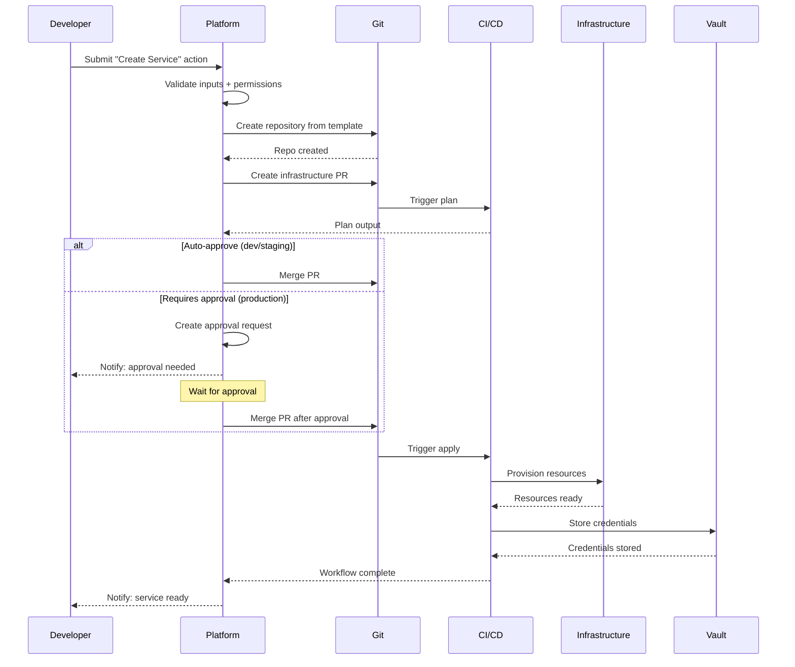

*[IDP]: Internal Developer Portal/Platform
*[API]: Application Programming Interface
*[CI]: Continuous Integration
*[CD]: Continuous Deployment
*[RBAC]: Role-Based Access Control
*[SSO]: Single Sign-On
*[K8s]: Kubernetes
*[PR]: Pull Request
*[SLA]: Service Level Agreement

Last month I watched a developer spend three days getting a PostgreSQL database. The company had a beautiful internal developer portal - Backstage, fully themed, comprehensive service catalog, scorecards showing tech debt metrics. The developer found the "Database Provisioning" page in under 30 seconds. Then he read the instructions: file a Jira ticket with the DBA team, wait for triage, attend a 15-minute review meeting to justify the request, and receive credentials via a separate ticket once provisioning completed. Three to five business days, assuming no holidays or sick leave on the DBA team.

The portal worked perfectly. The developer knew exactly where to go and what to do. And yet the outcome was identical to not having a portal at all - the same tickets, the same meetings, the same waiting.

That's the portal-versus-platform distinction that trips up most organizations. A portal _indexes_ things: it aggregates links, surfaces documentation, shows who owns what. A platform _does_ things: it provisions infrastructure, creates repositories, grants access. The portal tells you how to request a database. The platform gives you a database.

The difference matters because it determines whether your internal developer platform actually reduces toil or just makes toil easier to find. Self-service actions are what transform a directory into a platform. Without them, you've built a prettier wiki.

<Callout type="warning">
If your "platform" requires developers to read documentation and file tickets to get things done, you've built a directory, not a platform. Platforms execute workflows. Directories point to workflows that humans execute.
</Callout>

## The Portal Maturity Model

Most internal developer portals evolve through predictable stages. Understanding where you are helps clarify where to invest next - and where most organizations get stuck.

_Level 1: Directory._ This is the starting point - a central place that aggregates links to documentation, team contacts, and runbooks. Think Confluence home pages, GitHub wikis with service lists, or spreadsheets tracking ownership. The value is real: developers know where to look. But they still have to do everything manually. Finding the database provisioning doc doesn't provision the database.

_Level 2: Search._ The directory becomes searchable and indexed. Backstage with a service catalog lives here, along with API registries and dependency graph visualizations. Discovery is faster. Context switching drops. But finding something quickly doesn't mean you can act on it quickly. The developer who locates the database docs in 30 seconds still files the same ticket and waits the same 3-5 days.

_Level 3: Insights._ Now the portal shows health metrics, ownership data, and quality scorecards. You can see which services have test coverage gaps, which teams own what, and how much each service costs. Visibility improves dramatically. But seeing problems doesn't fix them. The dashboard showing your DBA team has a 47-ticket backlog doesn't get your database provisioned faster.

_Level 4: Platform._ Self-service actions with automation. Developers can provision databases, create services, and request access - not by finding documentation, but by clicking buttons and filling forms that trigger real workflows. The difference isn't incremental. It's the difference between "3-5 business days" and "15 minutes."

| Level | What Developers Can Do | What They Still Can't Do |
|-------|------------------------|--------------------------|
| Directory | Find documentation | Execute workflows |
| Search | Quickly find services and APIs | Provision or modify resources |
| Insights | See health and ownership | Fix issues without tickets |
| Platform | Self-service common tasks | Only edge cases need tickets |

Table: Portal maturity levels.

<Callout type="info">
Most organizations plateau at Level 2 or 3. They build beautiful service catalogs with scorecards and graphs, but developers still file tickets for everything. The jump to Level 4 requires different thinking: instead of "what should developers know?" ask "what should developers be able to do?"
</Callout>

## Self-Service Action Design

The difference between a good self-service action and a frustrating one often comes down to design decisions that seem minor but compound. A database provisioning action that takes 30 seconds to fill out and 15 minutes to complete feels magical. The same action with a confusing form, unclear outcomes, and no progress visibility feels like a different kind of ticket system.

### Anatomy of a Good Action

A well-designed action has clear structure: identity (what it is), inputs (what the user provides), workflow (what happens), and outputs (what the user gets back). Here's what that looks like for database provisioning:

```yaml title="backstage-action-definition.yaml"
# Backstage scaffolder action for PostgreSQL provisioning
apiVersion: scaffolder.backstage.io/v1beta3
kind: Template
metadata:
  name: provision-postgresql-database
  title: Create PostgreSQL Database
  description: Provision a new PostgreSQL database with configured access
  tags: ["postgresql", "database", "self-service"]
spec:
  owner: platform-data-team
  type: database

  parameters:
    - title: Database Configuration
      required: [name, environment, size]
      properties:
        name:
          title: Database Name
          type: string
          pattern: "^[a-z][a-z0-9-]{2,30}$"
          description: Lowercase letters, numbers, hyphens. 3-31 chars.
        environment:
          title: Environment
          type: string
          enum: [dev, staging, production]
          default: dev
        size:
          title: Instance Size
          type: string
          enum: [small, medium, large]
          enumNames:
            - Small (2 vCPU, 8GB) - $50/mo
            - Medium (4 vCPU, 16GB) - $150/mo
            - Large (8 vCPU, 32GB) - $400/mo
          default: small

  steps:
    - id: create-terraform-pr
      name: Create Infrastructure PR
      action: publish:github:pull-request
      input:
        repoUrl: github.com?repo=infrastructure&owner=myorg
        branchName: db-${{ parameters.name }}
        title: "Provision database: ${{ parameters.name }}"

    - id: wait-for-apply
      name: Apply Infrastructure
      action: terraform:wait-for-apply
      input:
        prUrl: ${{ steps.create-terraform-pr.output.remoteUrl }}

    - id: store-credentials
      name: Store Credentials
      action: vault:create-secret
      input:
        path: databases/${{ parameters.name }}
```
Code: Backstage scaffolder action for database provisioning.

The YAML is straightforward, but the design decisions matter. Notice the sensible defaults (dev environment, small size), the clear cost indication in the enum labels, and the validation pattern that prevents naming mistakes before submission. For more on Backstage scaffolder actions, see the [Backstage documentation on software templates](https://backstage.io/docs/features/software-templates/).

### Action Design Guidelines

_Obvious outcomes._ Users should know exactly what will happen before clicking submit. Show a preview of resources to be created, display cost estimates, list permissions that will be granted. The anti-pattern is "submit and pray" - the user clicks a button and has no idea what happens next.

_Sensible defaults._ Most fields should have good defaults for the common case. Pre-fill the team from user context. Default to the smallest viable size. Default to dev environment. A blank form requiring research to fill out is a friction multiplier.

_Guardrails, not gates._ Prevent mistakes without blocking legitimate work. Validate inputs in real-time. Warn about expensive choices. But auto-approve within policy bounds - if every request requires manual approval, you haven't built self-service, you've built a ticket system with a nicer UI.

_Transparent execution._ Users can see what's happening and why. Show workflow steps and progress. Link to the underlying PR or pipeline. Explain approval requirements when they apply. Surface errors clearly with remediation steps.

_Recoverable failures._ Failures should be fixable without starting over. Allow retrying failed steps. Let users edit and resubmit. Provide clear error messages with remediation guidance. If a failure requires filing a support ticket, the action has failed its purpose.

<Callout type="success">
The best self-service actions feel like filling out a form to order something online: clear options, sensible defaults, transparent pricing, and a tracking number when you submit. If your action feels like filling out a government form, redesign it.
</Callout>

## Workflow Automation

Self-service actions rarely involve a single step. Provisioning a new service might mean creating a repository, generating infrastructure-as-code, waiting for Terraform to apply, storing credentials in Vault, and registering the service in the catalog. Each step can fail. Each step depends on outputs from previous steps. And if something fails halfway through, you need a plan for the orphaned resources.

This is workflow orchestration - coordinating multi-step processes with proper error handling, progress visibility, and rollback support.

### The Anatomy of a Multi-Step Workflow

Consider what happens when a developer requests a new service. The portal validates their inputs and permissions, creates a repository from a template, generates a Terraform PR for the service's infrastructure, waits for approval (or auto-approves for non-production), applies the Terraform changes, stores the resulting credentials, and notifies the developer. That's seven steps with dependencies between them.


Figure: Multi-step service creation workflow.

The sequence diagram shows the happy path, but real workflows need to handle failures at every step. What if the repository creation succeeds but the Terraform PR fails? What if the apply times out? What if credential storage fails after infrastructure is already provisioned?

### Designing for Failure

Each workflow step needs three things: a clear action, defined failure behavior, and (where appropriate) a rollback action.

_Failure behaviors_ fall into a few categories. Some failures should abort the entire workflow - if validation fails, there's no point continuing. Some should retry - transient API errors often resolve on the second attempt. Some should skip - failing to send a notification shouldn't block an otherwise successful provisioning. And some should trigger manual intervention - edge cases that automation can't handle.

_Rollback steps_ clean up resources created by earlier steps when a later step fails. If you create a repository in step 2 but the infrastructure PR fails in step 3, the rollback should delete that repository. Without rollback, failed workflows leave orphaned resources that accumulate over time - repositories nobody uses, partial infrastructure deployments, dangling secrets.

The key insight is that _non-critical steps should fail gracefully_. Registering a service in the catalog is nice to have, but if it fails, the service still exists and works. Mark these steps as "skip on failure" so they don't block the overall workflow.

<Callout type="warning">
Every workflow needs a rollback plan. If step 4 fails, what happens to resources created in steps 1-3? Orphaned repositories, half-provisioned infrastructure, and dangling credentials erode trust in self-service. Design for failure from the start.
</Callout>

## Approval Workflows

Approvals are where self-service platforms often regress into ticket systems. The instinct is understandable - production changes are risky, expensive resources need oversight, compliance requires audit trails. But if every request routes through a manual approval queue, you've just built Jira with a different skin.

The solution is _policy-based approval routing_: define rules that auto-approve low-risk requests while routing high-risk ones to the right approvers. Most requests should flow through automatically. Approvals become the exception, not the rule.

### Approval Policy Dimensions

Different situations warrant different approval requirements. Here are the dimensions that typically matter:

_Environment-based._ Dev and staging requests auto-approve instantly. Production requests require team lead approval. This is the most common pattern and handles the majority of cases.

_Cost-based._ Resources under $100/month auto-approve. Resources between $100-500 need team lead sign-off. Resources over $500 require team lead plus finance approval. Thresholds vary by organization, but the principle is consistent: more expensive means more oversight.

_Scope-based._ Changes affecting only your own team auto-approve. Changes affecting multiple teams require approval from each affected team's lead. This prevents one team from unilaterally impacting another's infrastructure.

_Risk-based._ Standard operations auto-approve. High-risk operations - deleting databases, modifying IAM permissions, changing network configs, rotating encryption keys - require security review regardless of environment.

_Time-based._ Normal business hours follow standard policies. Change freeze windows require explicit exception approval. This prevents well-meaning developers from deploying during critical periods.

These dimensions combine. A production database deletion during change freeze might require team lead approval _and_ security review _and_ change freeze exception - three separate approvers. A dev environment S3 bucket during business hours? Instant auto-approval.

In Backstage, you'd implement these rules through a custom approval plugin or integrate with Open Policy Agent (OPA) for policy-as-code. The scaffolder evaluates the policy before executing steps, routing to the appropriate approval workflow or proceeding automatically based on the policy decision.

| Approval Type | Use Case | SLA | Auto-Escalation |
|---------------|----------|-----|-----------------|
| Auto-approve | Dev/staging, low cost | Instant | N/A |
| Single approver | Standard production | 4 hours | After 2 hours |
| Multiple approvers | High risk, multi-team | 8 hours | After 4 hours |
| Sequential approval | Compliance-critical | 24 hours | After 8 hours |

Table: Approval types and SLAs.

### Making Approvals Fast

Even when manual approval is required, it shouldn't be slow. A few practices help:

_Give approvers context._ The approval notification should include everything needed to make a decision: what's being requested, who's requesting it, what environment, estimated cost, risk level, and links to the Terraform plan or other details. Approvers shouldn't need to dig through systems to understand the request.

_Set SLAs with auto-escalation._ A production approval that sits in queue for 6 hours is blocking a developer. Set expectations (e.g., 4-hour SLA for standard production requests) and auto-escalate to backup approvers when SLAs are at risk.

_Enable approval from notifications._ If your platform sends Slack notifications, include approve/reject buttons in the message. If it sends emails, include one-click approval links. Every click required to approve is friction that slows the process.

_Track approval metrics._ Measure time-to-approval by policy type. If production approvals consistently take 8 hours when the SLA is 4, you either need more approvers, faster approvers, or a policy change.

<Callout type="info">
Approvals should be the exception, not the rule. If most requests require manual approval, you haven't built self-service - you've built a ticket system with a nicer UI. Use policy-based auto-approval aggressively for low-risk operations.
</Callout>

## Integration Patterns

A self-service platform doesn't exist in isolation. It needs to talk to your Git provider to create repositories, your infrastructure tooling to provision resources, your secrets manager to store credentials, your observability stack to set up monitoring, and your communication tools to send notifications. The integration layer is where the platform connects to reality.

### Integration Categories

Most platforms need integrations across five categories:

_Git providers_ handle repository creation, pull request management, and team permissions. GitHub and GitLab are the common choices. The platform creates repos from templates, opens PRs for infrastructure changes, and manages who can access what. Authentication typically uses GitHub Apps or access tokens with appropriate scopes.

_Infrastructure provisioning_ is where resources actually get created. Terraform Cloud (or Atlantis for self-hosted) handles the IaC workflow - creating workspaces, queuing plans and applies, reading state outputs. For direct resource creation, you need AWS/GCP/Azure SDK access via IAM roles or service accounts. Kubernetes clusters need ServiceAccount tokens for applying manifests and managing RBAC.

_Secrets management_ stores and distributes credentials securely. HashiCorp Vault is the most common choice, using AppRole authentication for the platform to create secrets and generate dynamic credentials. AWS Secrets Manager is simpler if you're already AWS-native.

_Observability_ integration means the platform can provision monitoring alongside infrastructure. Datadog or Prometheus for metrics, PagerDuty for alerting. When a new service is created, its dashboards and alerts should be created automatically - not added manually weeks later when someone remembers.

_Communication_ enables notifications and interactive approvals. Slack integration with a bot token lets the platform send messages, create channels, and handle approval buttons directly in chat. Email provides fallback notifications.

### The Adapter Pattern

The key architectural insight is that actions shouldn't know which specific provider they're using. A "create repository" step should work whether you use GitHub, GitLab, or Bitbucket. This means designing integrations as adapters with standard interfaces.

Each adapter declares its capabilities (what actions it can perform), implements a standard execution interface, and handles provider-specific authentication. The platform's action definitions reference abstract capabilities like `createRepository(name, template, visibility)` and `createPullRequest(repo, branch, title, body)` rather than provider-specific APIs. The GitHub adapter implements these by calling the GitHub API; the GitLab adapter calls the GitLab API. The action definition doesn't know or care which one runs.

This abstraction pays off when you need to swap providers. Moving from GitHub to GitLab, or from Terraform Cloud to Atlantis, becomes a configuration change rather than a rewrite of every action that touches those systems.

| Integration Type | Common Providers | Authentication | Key Capabilities |
|------------------|------------------|----------------|------------------|
| Git provider | GitHub, GitLab | GitHub App, Access Token | Repos, PRs, permissions |
| Infrastructure | Terraform Cloud, AWS | API Token, IAM Role | Provision, state, outputs |
| Secrets | Vault, AWS Secrets Manager | AppRole, IAM Role | Create, rotate, policies |
| Observability | Datadog, Prometheus | API Key | Dashboards, monitors, SLOs |
| Communication | Slack, Email | Bot Token, SMTP | Messages, approvals |

Table: Common integration patterns.

<Callout type="success">
Design integrations as adapters with standard interfaces. This lets you swap providers (GitHub to GitLab, Terraform Cloud to Atlantis) without rewriting actions. The action definition shouldn't care which Git provider you use.
</Callout>

## Measuring Portal Value

Building a platform is an investment - in tooling, integrations, and ongoing maintenance. Justifying that investment requires metrics that show the platform is actually delivering value. The trap is measuring what's easy (action count) instead of what matters (developer productivity).

### Metric Categories

_Adoption metrics_ tell you whether developers are actually using the platform. Track the number of self-service actions executed, the percentage of the engineering org using actions, and the coverage of common tasks available as actions. Growing adoption means the platform is solving real problems. Flat or declining adoption means something's wrong - either discoverability, trust, or the actions themselves.

_Efficiency metrics_ measure time savings. Compare time-to-provision before and after the platform: how long did it take to get a database via tickets versus via self-service? Track approval wait times. Measure what percentage of requests auto-approve versus requiring manual intervention. The goal is dramatic improvement - not 20% faster, but 95% faster.

_Quality metrics_ track whether the platform is reliable. Action success rate should be above 95% - if actions fail frequently, developers stop trusting them. Rollback rate indicates how often workflows fail partway through and need cleanup. Support ticket reduction shows whether the platform is actually offloading work from the platform team or just creating different work.

_Satisfaction metrics_ capture developer perception. Net Promoter Score for the platform overall, ratings for individual actions, and satisfaction when escalation is needed. High efficiency with low satisfaction means the platform works but feels bad to use - maybe the UX is confusing or errors are frustrating.

### Interpreting Metric Combinations

Metrics are most useful in combination. Here's what different patterns indicate:

_High efficiency, low adoption_ - the platform works but developers don't trust it or can't find it. Improve discoverability, add more actions for common tasks, or investigate why developers prefer the old way.

_High adoption, low efficiency_ - developers use the platform but it's slow. Actions need optimization, approval policies are too strict, or workflows have bottlenecks.

_High adoption, high efficiency, low satisfaction_ - the platform works and is fast, but developers don't like using it. UX problems, confusing errors, or missing features they expected.

_Declining adoption with stable efficiency_ - something changed. Maybe a competing tool emerged, a key action broke, or the platform team shipped something unpopular. Investigate quickly.

### The Metrics That Matter Most

If you can only track a few things, focus on these:

| Metric | Baseline (Portal) | Target (Platform) | Value |
|--------|-------------------|-------------------|-------|
| Time to new database | 3-5 days | 15 minutes | 99% reduction |
| Time to new service | 1-2 weeks | 1 hour | 95% reduction |
| Platform tickets/week | 50 | 15 | 70% reduction |
| Manual approvals needed | 90% | 25% | 72% reduction |

Table: Portal vs platform value comparison.

The first two metrics (time to provision) are the most compelling for stakeholders. "We reduced database provisioning from 3-5 days to 15 minutes" is a story everyone understands. The last two metrics (ticket reduction, auto-approval rate) show operational efficiency - the platform team can do more with less manual intervention.

<Callout type="info">
Track both efficiency metrics (time saved) and adoption metrics (who's using it). High efficiency with low adoption means developers don't trust the platform. High adoption with low efficiency means actions need optimization. You need both.
</Callout>

## Conclusion

The distinction between portal and platform comes down to one question: what happens after a developer finds what they need? In a portal, they read documentation and file tickets. In a platform, they click a button and get resources.

That developer waiting three days for a database? In a real platform, they'd have filled out a form, seen a preview of what would be created, clicked submit, and had credentials in their hands within 15 minutes. No tickets. No meetings. No waiting for another team's availability.

Getting there requires intentional design. Actions need obvious outcomes and sensible defaults. Approval policies should auto-approve aggressively and only route exceptions to humans. Workflow orchestration must handle failures gracefully and clean up after itself. Integrations should abstract away provider specifics so you can evolve the underlying systems without rewriting everything.

Level 4 platform maturity isn't cheap. It requires investment in tooling, integration work, and ongoing maintenance. But the returns are proportional: developer productivity multiplied across the organization, platform team leverage instead of ticket-by-ticket toil, and the compounding benefits of standardization and automation.

<Callout type="success">
The test of a real platform: can a new developer join, need a database, and have it provisioned without asking anyone for help? If yes, you've built a platform. If no - if they need to read Confluence, file a Jira ticket, or ping someone on Slack - you've built a prettier ticket system.
</Callout>
