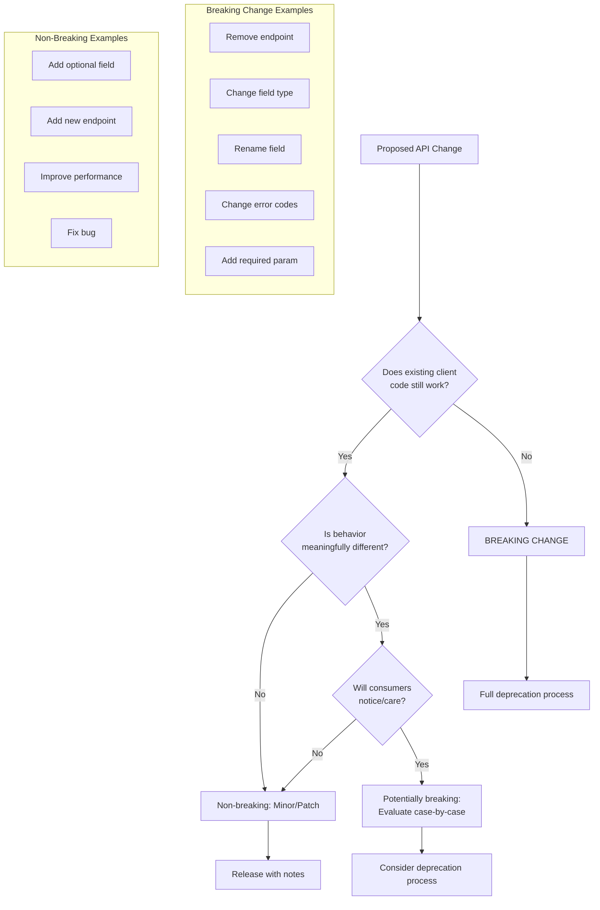
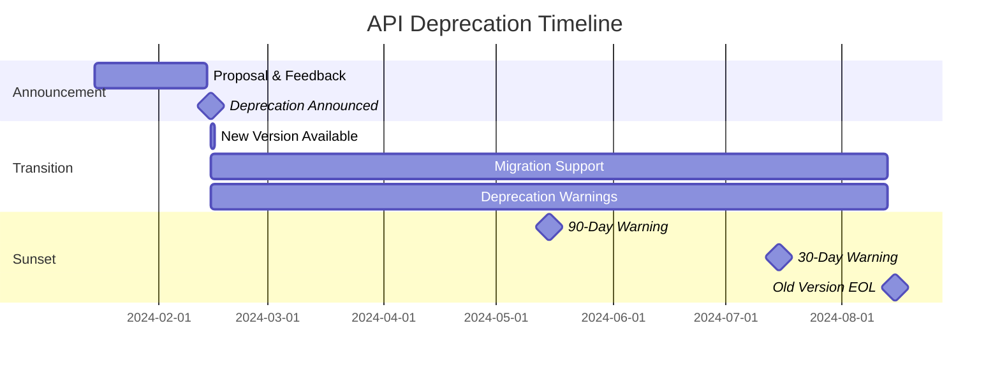
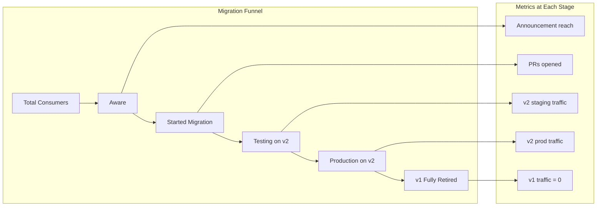

*[API]: Application Programming Interface
*[SDK]: Software Development Kit
*[SLA]: Service Level Agreement
*[CI]: Continuous Integration
*[CD]: Continuous Deployment
*[REST]: Representational State Transfer
*[gRPC]: Google Remote Procedure Call
*[SemVer]: Semantic Versioning
*[EOL]: End of Life

# Versioning Internal Platform APIs

## Introduction

Frame the internal API challenge: platform teams build APIs for internal consumers—other engineering teams, CI/CD pipelines, self-service tools. There's a temptation to treat these differently than external APIs: "we can just tell people to update," "everyone's in the same building," "we'll coordinate in Slack." This leads to surprise breaking changes, angry internal customers, blocked deployments, and eroded trust. This section establishes that internal APIs deserve the same versioning discipline as external ones, often more because internal customers can't just choose a different provider.

_Include a scenario: a platform team ships a "small cleanup" to their deployment API. They rename a field, remove a deprecated endpoint, and update the response format—all without versioning. Monday morning, 40 CI pipelines fail. Teams scramble to update their scripts. A critical hotfix is blocked. The platform team spends the week doing emergency migrations instead of planned work. Relationships with consuming teams are damaged for months._

<Callout type="warning">
Internal customers are captive customers. They can't switch to a competitor's platform. This makes breaking their workflows worse, not better—they have no recourse except escalating to leadership or building workarounds that create tech debt.
</Callout>

## Versioning Strategies

### Choosing a Versioning Scheme

```yaml title="versioning-strategies.yaml"
versioning_approaches:
  url_path_versioning:
    format: "/api/v1/deployments, /api/v2/deployments"
    pros:
      - "Explicit and visible"
      - "Easy to route at load balancer"
      - "Clear which version client is using"
      - "Simple to deprecate old versions"
    cons:
      - "URL pollution"
      - "Harder to share links across versions"
    best_for: "REST APIs with distinct version lifecycles"
    example: |
      GET /api/v1/services/{id}  # Original
      GET /api/v2/services/{id}  # New response format

  header_versioning:
    format: "Accept: application/vnd.platform.v2+json"
    pros:
      - "Clean URLs"
      - "Follows HTTP content negotiation"
      - "Can version at resource level"
    cons:
      - "Hidden—easy to forget"
      - "Harder to test in browser"
      - "Load balancer routing more complex"
    best_for: "APIs where URL stability matters"
    example: |
      GET /api/services/{id}
      Accept: application/vnd.platform.v2+json

  query_parameter_versioning:
    format: "/api/services?version=2"
    pros:
      - "Explicit"
      - "Easy to add to existing calls"
    cons:
      - "Pollutes query string"
      - "Can conflict with filtering"
      - "Often forgotten by clients"
    best_for: "Quick additions, not recommended for primary versioning"

  date_based_versioning:
    format: "/api/2024-01-15/services"
    pros:
      - "Clear when version was released"
      - "Natural deprecation timeline"
      - "Used successfully by Stripe, AWS"
    cons:
      - "Many versions accumulate"
      - "Date doesn't indicate compatibility"
    best_for: "APIs with frequent, incremental changes"
    example: |
      GET /api/2024-01-15/deployments
      GET /api/2024-06-01/deployments  # Includes new fields

recommendation:
  internal_platform_apis: "URL path versioning (/api/v1/...)"
  rationale:
    - "Maximum visibility—consumers always see which version"
    - "Easy to audit usage across versions"
    - "Simple load balancer routing"
    - "Clear sunset timeline communication"
```
Code: API versioning strategy comparison.

### Semantic Versioning for APIs

```typescript title="api-semver.ts"
// Semantic versioning interpretation for APIs

interface ApiVersionPolicy {
  major: MajorVersionRules;
  minor: MinorVersionRules;
  patch: PatchVersionRules;
}

const apiVersionPolicy: ApiVersionPolicy = {
  major: {
    description: 'Breaking changes that require consumer updates',
    triggers: [
      'Removing an endpoint',
      'Removing a required field from response',
      'Adding a required field to request',
      'Changing field type (string → number)',
      'Changing authentication mechanism',
      'Changing error response format',
      'Renaming fields (without alias)',
    ],
    consumer_impact: 'Must update code before upgrading',
    support_policy: 'Previous major supported for 12 months',
    communication: '90 days advance notice minimum',
  },

  minor: {
    description: 'Backward-compatible additions',
    triggers: [
      'Adding new optional endpoint',
      'Adding optional field to request',
      'Adding field to response',
      'Adding new enum value',
      'Adding optional query parameter',
    ],
    consumer_impact: 'Can upgrade without code changes',
    support_policy: 'All minors within major are supported',
    communication: 'Release notes, no advance notice required',
  },

  patch: {
    description: 'Backward-compatible fixes',
    triggers: [
      'Bug fixes',
      'Performance improvements',
      'Documentation updates',
      'Security patches',
    ],
    consumer_impact: 'Transparent—no consumer action needed',
    support_policy: 'Applied to all supported versions',
    communication: 'Changelog entry',
  },
};

// Version compatibility checker
class VersionCompatibility {
  isBackwardCompatible(oldVersion: string, newVersion: string): boolean {
    const old = this.parse(oldVersion);
    const new_ = this.parse(newVersion);

    // Same major version = backward compatible
    return old.major === new_.major;
  }

  requiresMigration(oldVersion: string, newVersion: string): boolean {
    const old = this.parse(oldVersion);
    const new_ = this.parse(newVersion);

    // Major version bump = migration required
    return new_.major > old.major;
  }

  getMigrationPath(from: string, to: string): MigrationStep[] {
    const fromVersion = this.parse(from);
    const toVersion = this.parse(to);

    const steps: MigrationStep[] = [];

    // Must migrate through each major version
    for (let major = fromVersion.major + 1; major <= toVersion.major; major++) {
      steps.push({
        from: `v${major - 1}`,
        to: `v${major}`,
        guide: `/docs/migration/v${major - 1}-to-v${major}`,
        breakingChanges: this.getBreakingChanges(major),
      });
    }

    return steps;
  }
}
```
Code: Semantic versioning policy for APIs.

| Change Type | Version Bump | Consumer Action | Notice Required |
|-------------|--------------|-----------------|-----------------|
| Remove endpoint | Major | Update code | 90 days |
| Remove field | Major | Update code | 90 days |
| Add required field | Major | Update code | 90 days |
| Add optional endpoint | Minor | None | Release notes |
| Add response field | Minor | None | Release notes |
| Bug fix | Patch | None | Changelog |

Table: Version bump decision guide.

<Callout type="info">
The key question for any change: "Will existing client code break?" If yes, it's a major version bump with full deprecation process. If no, it's minor or patch. When in doubt, assume breaking—consumers will tell you if you're being too conservative.
</Callout>

## Breaking Change Management

### Identifying Breaking Changes


Figure: Breaking change identification flowchart.

```yaml title="breaking-change-catalog.yaml"
# Catalog of breaking vs non-breaking changes

definitely_breaking:
  endpoint_changes:
    - change: "Remove endpoint"
      example: "DELETE /api/v1/legacy-deploy removed"
      impact: "Calls to endpoint fail with 404"

    - change: "Change HTTP method"
      example: "POST /deploy → PUT /deploy"
      impact: "Existing calls fail with 405"

    - change: "Change URL path"
      example: "/services/{id} → /services/{serviceId}"
      impact: "Existing URLs return 404"

  request_changes:
    - change: "Add required field"
      example: "Must now include 'environment' in body"
      impact: "Requests without field fail validation"

    - change: "Remove accepted field"
      example: "No longer accept 'legacyMode' parameter"
      impact: "May silently ignore or error"

    - change: "Change field type"
      example: "'replicas' changed from string to number"
      impact: "Type mismatch errors"

    - change: "Tighten validation"
      example: "'name' now max 50 chars (was 100)"
      impact: "Previously valid requests now fail"

  response_changes:
    - change: "Remove field"
      example: "'deployedAt' no longer in response"
      impact: "Client code accessing field fails"

    - change: "Change field type"
      example: "'status' changed from string to object"
      impact: "Deserialization/parsing fails"

    - change: "Change field meaning"
      example: "'count' now includes deleted items"
      impact: "Logic depending on value breaks"

  behavior_changes:
    - change: "Change error codes"
      example: "Validation errors now 422 (was 400)"
      impact: "Error handling logic breaks"

    - change: "Change pagination default"
      example: "Default page size 100 → 20"
      impact: "Clients expecting more items affected"

not_breaking:
  additive_changes:
    - change: "Add optional request field"
      example: "Can now include 'labels' in request"
      safe_because: "Existing requests still valid"

    - change: "Add response field"
      example: "Response now includes 'createdBy'"
      safe_because: "Clients should ignore unknown fields"

    - change: "Add new endpoint"
      example: "New GET /api/v1/deployments/{id}/logs"
      safe_because: "Existing endpoints unchanged"

    - change: "Loosen validation"
      example: "'name' now allows 200 chars (was 100)"
      safe_because: "Previously valid still valid"

  behavioral_improvements:
    - change: "Performance improvement"
      safe_because: "Same results, faster"

    - change: "Bug fix"
      safe_because: "Correct behavior"
      caveat: "Unless clients depend on buggy behavior"
```
Code: Breaking change catalog with examples.

### Breaking Change Process

```typescript title="breaking-change-process.ts"
interface BreakingChangeProposal {
  id: string;
  title: string;
  description: string;
  affectedEndpoints: string[];
  affectedVersions: string[];

  // Impact analysis
  impact: {
    knownConsumers: Consumer[];
    estimatedMigrationEffort: 'trivial' | 'small' | 'medium' | 'large';
    rollbackPossible: boolean;
  };

  // Timeline
  timeline: {
    proposalDate: Date;
    feedbackDeadline: Date;
    deprecationAnnouncement: Date;
    newVersionRelease: Date;
    oldVersionSunset: Date;
  };

  // Migration support
  migration: {
    guide: string;
    codeExamples: CodeExample[];
    automatedMigration?: string;
    supportChannel: string;
  };
}

class BreakingChangeManager {
  async proposeBreakingChange(
    proposal: BreakingChangeProposal
  ): Promise<void> {
    // Step 1: Identify affected consumers
    const consumers = await this.identifyConsumers(
      proposal.affectedEndpoints
    );
    proposal.impact.knownConsumers = consumers;

    // Step 2: Create proposal document
    await this.createProposalDoc(proposal);

    // Step 3: Notify affected teams
    await this.notifyAffectedTeams(proposal, consumers);

    // Step 4: Open feedback period
    await this.openFeedbackPeriod(proposal);

    // Step 5: Schedule deprecation timeline
    await this.scheduleTimeline(proposal);
  }

  private async identifyConsumers(endpoints: string[]): Promise<Consumer[]> {
    const consumers: Consumer[] = [];

    // Check API gateway logs
    const gatewayStats = await this.apiGateway.getEndpointConsumers(
      endpoints,
      { period: '30d' }
    );

    for (const stat of gatewayStats) {
      consumers.push({
        team: stat.clientTeam,
        service: stat.clientService,
        callVolume: stat.requestCount,
        lastSeen: stat.lastRequest,
        contactChannel: await this.getTeamChannel(stat.clientTeam),
      });
    }

    return consumers;
  }

  private async notifyAffectedTeams(
    proposal: BreakingChangeProposal,
    consumers: Consumer[]
  ): Promise<void> {
    const message = `
🚨 **Breaking Change Proposal: ${proposal.title}**

**What's Changing:**
${proposal.description}

**Affected Endpoints:**
${proposal.affectedEndpoints.map(e => `- \`${e}\``).join('\n')}

**Timeline:**
- Feedback deadline: ${formatDate(proposal.timeline.feedbackDeadline)}
- New version release: ${formatDate(proposal.timeline.newVersionRelease)}
- Old version sunset: ${formatDate(proposal.timeline.oldVersionSunset)}

**Migration Guide:** ${proposal.migration.guide}

**Your Impact:**
Based on our logs, your team uses affected endpoints.
Please review and provide feedback by ${formatDate(proposal.timeline.feedbackDeadline)}.

Questions? ${proposal.migration.supportChannel}
    `;

    for (const consumer of consumers) {
      await this.slack.sendToChannel(consumer.contactChannel, message);
      await this.email.send(consumer.teamLead, message);
    }
  }
}
```
Code: Breaking change management process.

<Callout type="success">
Identify consumers before announcing changes. API gateway logs, service mesh telemetry, and SDK analytics tell you who's actually using what. Targeted notification to affected teams gets better response than broadcast announcements that everyone ignores.
</Callout>

## Deprecation Communication

### Deprecation Timeline


Figure: Deprecation timeline with milestones.

```yaml title="deprecation-policy.yaml"
deprecation_policy:
  minimum_timelines:
    major_version_sunset:
      total_duration: "12 months"
      announcement_to_release: "30 days (feedback period)"
      release_to_sunset: "12 months"
      final_warning: "30 days before sunset"

    minor_feature_deprecation:
      total_duration: "6 months"
      announcement_to_sunset: "6 months"
      final_warning: "30 days before sunset"

    security_emergency:
      total_duration: "30 days minimum"
      requires: "Security team approval"
      communication: "Direct contact with all known consumers"

  communication_channels:
    announcement:
      - "API changelog"
      - "Developer newsletter"
      - "Slack #platform-announcements"
      - "Direct notification to known consumers"

    ongoing:
      - "Deprecation warnings in API responses"
      - "Dashboard showing deprecated endpoint usage"
      - "Weekly migration progress reports"

    final_warning:
      - "Direct email to team leads"
      - "Slack DMs to high-usage consumers"
      - "Calendar invites for sunset date"

  response_headers:
    deprecation: "Deprecation: true"
    sunset: "Sunset: Sat, 15 Aug 2024 00:00:00 GMT"
    link_to_docs: 'Link: </docs/migration/v1-to-v2>; rel="deprecation"'

  api_response_warning:
    example: |
      {
        "data": { ... },
        "_meta": {
          "deprecation": {
            "deprecated": true,
            "sunsetDate": "2024-08-15",
            "replacement": "/api/v2/deployments",
            "migrationGuide": "https://docs/migration/v1-to-v2"
          }
        }
      }
```
Code: Deprecation policy and communication.

### Multi-Channel Communication

```typescript title="deprecation-communication.ts"
interface DeprecationAnnouncement {
  id: string;
  type: 'major_version' | 'endpoint' | 'field' | 'behavior';
  what: string;
  why: string;
  when: {
    announced: Date;
    sunsetDate: Date;
  };
  migration: {
    replacement: string;
    guide: string;
    effort: string;
  };
}

class DeprecationCommunicator {
  async announce(deprecation: DeprecationAnnouncement): Promise<void> {
    // 1. Update API documentation
    await this.updateDocs(deprecation);

    // 2. Add to changelog
    await this.addToChangelog(deprecation);

    // 3. Configure API to return deprecation headers
    await this.configureDeprecationHeaders(deprecation);

    // 4. Send announcements
    await this.sendAnnouncements(deprecation);

    // 5. Schedule reminders
    await this.scheduleReminders(deprecation);

    // 6. Create migration tracking dashboard
    await this.createMigrationDashboard(deprecation);
  }

  private async sendAnnouncements(
    deprecation: DeprecationAnnouncement
  ): Promise<void> {
    // Slack announcement
    await this.slack.post('#platform-announcements', {
      blocks: [
        {
          type: 'header',
          text: `📢 Deprecation Notice: ${deprecation.what}`,
        },
        {
          type: 'section',
          text: `**Why:** ${deprecation.why}\n**Sunset Date:** ${formatDate(deprecation.when.sunsetDate)}`,
        },
        {
          type: 'section',
          text: `**Migration:** ${deprecation.migration.replacement}\n**Guide:** ${deprecation.migration.guide}`,
        },
        {
          type: 'actions',
          elements: [
            {
              type: 'button',
              text: 'View Migration Guide',
              url: deprecation.migration.guide,
            },
            {
              type: 'button',
              text: 'Check My Usage',
              url: `/dashboard/deprecations/${deprecation.id}/my-usage`,
            },
          ],
        },
      ],
    });

    // Email to engineering
    await this.email.sendToList('engineering@company.com', {
      subject: `[Platform] Deprecation Notice: ${deprecation.what}`,
      template: 'deprecation-announcement',
      data: deprecation,
    });

    // Direct notification to known consumers
    const consumers = await this.getAffectedConsumers(deprecation);
    for (const consumer of consumers) {
      await this.notifyConsumerDirectly(consumer, deprecation);
    }
  }

  private async scheduleReminders(
    deprecation: DeprecationAnnouncement
  ): Promise<void> {
    const sunsetDate = deprecation.when.sunsetDate;

    // 90 days before
    await this.scheduler.schedule({
      date: subDays(sunsetDate, 90),
      action: 'send_90_day_warning',
      data: { deprecationId: deprecation.id },
    });

    // 30 days before
    await this.scheduler.schedule({
      date: subDays(sunsetDate, 30),
      action: 'send_30_day_warning',
      data: { deprecationId: deprecation.id },
    });

    // 7 days before
    await this.scheduler.schedule({
      date: subDays(sunsetDate, 7),
      action: 'send_final_warning',
      data: { deprecationId: deprecation.id },
    });

    // Sunset day
    await this.scheduler.schedule({
      date: sunsetDate,
      action: 'execute_sunset',
      data: { deprecationId: deprecation.id },
    });
  }
}
```
Code: Multi-channel deprecation communication.

| Timeline | Communication | Audience | Action Required |
|----------|---------------|----------|-----------------|
| Announcement | Changelog, Slack, email | All engineers | Awareness |
| 90 days | Slack reminder, dashboard | Affected teams | Plan migration |
| 30 days | Direct email, Slack DM | Remaining consumers | Urgent migration |
| 7 days | Personal outreach | Critical consumers | Emergency |
| Sunset day | Final notice | All | Complete |

Table: Deprecation communication timeline.

<Callout type="warning">
Never surprise people with deprecations. Even if policy says "90 days notice," earlier is better. Give consumers time to plan, prioritize, and execute migration—not scramble under deadline pressure.
</Callout>

## Migration Support

### Making Migration Easy

```yaml title="migration-support.yaml"
migration_support_tiers:
  tier_1_self_service:
    description: "Consumers can migrate independently"
    provided:
      - "Comprehensive migration guide"
      - "Before/after code examples"
      - "Comparison table of old vs new API"
      - "FAQ document"
      - "Self-service migration validator"
    support_channel: "#platform-help (async)"

  tier_2_assisted:
    description: "Platform team provides guidance"
    provided:
      - "Everything in tier 1"
      - "Office hours for questions"
      - "Code review of migration PRs"
      - "Migration progress tracking"
    support_channel: "Scheduled office hours"

  tier_3_hands_on:
    description: "Platform team does the migration"
    provided:
      - "Everything in tier 2"
      - "Platform team creates migration PRs"
      - "Pair programming sessions"
      - "Production deployment support"
    criteria: "High-impact consumers, complex migrations"
    support_channel: "Dedicated Slack channel"

migration_guide_template:
  sections:
    - title: "Overview"
      content:
        - "What's changing and why"
        - "Timeline and deadlines"
        - "Who needs to migrate"

    - title: "Quick Start"
      content:
        - "Minimal changes for basic migration"
        - "Copy-paste code snippets"
        - "5-minute migration path"

    - title: "Detailed Changes"
      content:
        - "Endpoint-by-endpoint mapping"
        - "Request/response format changes"
        - "Authentication changes"

    - title: "Code Examples"
      content:
        - "Before and after for each language"
        - "Common patterns migrated"
        - "Edge cases covered"

    - title: "Testing"
      content:
        - "How to test migration"
        - "Dual-write/dual-read patterns"
        - "Rollback procedures"

    - title: "FAQ"
      content:
        - "Common questions answered"
        - "Troubleshooting guide"
        - "Known issues"
```
Code: Migration support tiers and guide template.

### Automated Migration Tools

```typescript title="migration-automation.ts"
// Tools to automate or assist migration

interface MigrationTool {
  name: string;
  type: 'codemod' | 'validator' | 'adapter' | 'report';
  description: string;
}

// Codemod for automated code transformation
class ApiMigrationCodemod {
  async migrate(sourceFile: string): Promise<MigrationResult> {
    const ast = parse(sourceFile);
    const changes: CodeChange[] = [];

    // Find API calls and transform
    traverse(ast, {
      CallExpression(path) {
        // Transform: api.v1.getService(id) → api.v2.getService(id)
        if (this.isV1ApiCall(path)) {
          changes.push(this.transformToV2(path));
        }

        // Transform: response.deployedAt → response.deployment.timestamp
        if (this.isDeprecatedFieldAccess(path)) {
          changes.push(this.transformFieldAccess(path));
        }
      },
    });

    return {
      originalFile: sourceFile,
      transformedFile: generate(ast),
      changes,
      manualReviewRequired: changes.some(c => c.needsReview),
    };
  }
}

// Compatibility adapter for gradual migration
class V1CompatibilityAdapter {
  // Adapter that accepts v1 format and translates to v2
  async handleV1Request(v1Request: V1Request): Promise<V1Response> {
    // Transform v1 request to v2 format
    const v2Request = this.transformRequest(v1Request);

    // Call v2 API
    const v2Response = await this.v2Api.call(v2Request);

    // Transform v2 response back to v1 format
    const v1Response = this.transformResponse(v2Response);

    // Log for migration tracking
    await this.logCompatibilityUsage(v1Request.clientId);

    return v1Response;
  }

  private transformRequest(v1: V1Request): V2Request {
    return {
      // v1 field → v2 field mapping
      serviceId: v1.service_id,  // snake_case → camelCase
      environment: v1.env || 'production',  // Default added in v2
      configuration: {
        ...v1.config,
        replicas: parseInt(v1.config.replicas),  // string → number
      },
    };
  }
}

// Migration validator
class MigrationValidator {
  async validate(service: string): Promise<ValidationReport> {
    const report: ValidationReport = {
      service,
      status: 'pass',
      checks: [],
    };

    // Check: No v1 API calls in code
    const v1Calls = await this.scanForV1Calls(service);
    report.checks.push({
      name: 'No v1 API calls',
      status: v1Calls.length === 0 ? 'pass' : 'fail',
      details: v1Calls,
    });

    // Check: v2 SDK version
    const sdkVersion = await this.getSdkVersion(service);
    report.checks.push({
      name: 'v2 SDK installed',
      status: sdkVersion.startsWith('2.') ? 'pass' : 'fail',
      details: { current: sdkVersion, required: '2.x' },
    });

    // Check: No deprecated field usage
    const deprecatedFields = await this.scanForDeprecatedFields(service);
    report.checks.push({
      name: 'No deprecated fields',
      status: deprecatedFields.length === 0 ? 'pass' : 'warn',
      details: deprecatedFields,
    });

    return report;
  }
}

// Migration progress tracker
class MigrationTracker {
  async getProgress(deprecationId: string): Promise<MigrationProgress> {
    const consumers = await this.getAffectedConsumers(deprecationId);

    const progress = await Promise.all(
      consumers.map(async (consumer) => ({
        team: consumer.team,
        service: consumer.service,
        v1Usage: await this.getV1Usage(consumer, '7d'),
        v2Usage: await this.getV2Usage(consumer, '7d'),
        migrationStatus: await this.getMigrationStatus(consumer),
      }))
    );

    return {
      totalConsumers: consumers.length,
      migrated: progress.filter(p => p.migrationStatus === 'complete').length,
      inProgress: progress.filter(p => p.migrationStatus === 'in_progress').length,
      notStarted: progress.filter(p => p.migrationStatus === 'not_started').length,
      details: progress,
    };
  }
}
```
Code: Migration automation tools.

<Callout type="success">
The easier migration is, the faster it happens. Codemods that automatically transform code, adapters that provide temporary compatibility, and validators that confirm migration completeness all reduce friction and accelerate adoption.
</Callout>

## Measuring Success

### Deprecation Metrics

```yaml title="deprecation-metrics.yaml"
deprecation_metrics:
  adoption_metrics:
    new_version_adoption:
      description: "Percentage of traffic on new version"
      query: "sum(api_requests{version='v2'}) / sum(api_requests) * 100"
      target: "> 90% before sunset"

    migration_velocity:
      description: "Consumers migrated per week"
      query: "count(services where v2_usage > v1_usage) per week"
      target: "Linear progress toward sunset"

    holdouts:
      description: "Consumers still on old version near sunset"
      query: "count(services where v1_usage > 0 AND days_to_sunset < 30)"
      target: "< 5% at 30-day warning"

  health_metrics:
    migration_errors:
      description: "Errors during migration period"
      query: "sum(api_errors{migration_period='true'})"
      target: "No increase vs baseline"

    support_tickets:
      description: "Migration-related support requests"
      query: "count(tickets{label='migration'})"
      target: "Manageable by platform team"

    rollbacks:
      description: "Services that rolled back migration"
      query: "count(services{migrated='true', rolled_back='true'})"
      target: "< 1%"

  timeline_metrics:
    on_schedule:
      description: "Deprecation proceeding on timeline"
      measure: "Actual vs planned milestone dates"
      target: "No delays > 2 weeks"

    sunset_achieved:
      description: "Old version successfully sunset"
      measure: "Old version traffic = 0"
      target: "On announced date"

dashboard:
  sections:
    - name: "Migration Overview"
      widgets:
        - type: "gauge"
          title: "v2 Adoption"
          metric: "new_version_adoption"

        - type: "timeline"
          title: "Migration Progress"
          metric: "migration_velocity"

    - name: "Consumer Status"
      widgets:
        - type: "table"
          title: "Migration Status by Team"
          columns: ["team", "status", "v1_traffic", "v2_traffic", "blocker"]

    - name: "Health"
      widgets:
        - type: "line_chart"
          title: "Error Rate During Migration"
          metric: "migration_errors"
```
Code: Deprecation and migration metrics.


Figure: Migration funnel with metrics.

| Metric | 90 Days Out | 30 Days Out | Sunset Day |
|--------|-------------|-------------|------------|
| v2 Adoption | > 30% | > 80% | 100% |
| Consumers Migrated | > 50% | > 95% | 100% |
| Migration Errors | Baseline | Baseline | N/A |
| Holdouts Identified | All known | Action plans | Resolved |

Table: Migration milestone targets.

<Callout type="info">
Track migration as a funnel: awareness → started → testing → production. If consumers are stuck at a particular stage, investigate why. Often it's a missing migration tool, unclear documentation, or blocking bug—not resistance.
</Callout>

## Conclusion

Summarize the key practices for internal API versioning: treat internal APIs with the same rigor as external—internal customers deserve predictable, well-communicated changes; use semantic versioning to clearly signal breaking vs non-breaking changes; follow a structured deprecation process with 90+ days notice for breaking changes; invest in migration support (guides, codemods, adapters) to make adoption easy; communicate through multiple channels with escalating urgency; and track migration progress to catch holdouts early. Emphasize that the investment in versioning discipline pays off in trust, faster adoption of new versions, and reduced support burden.

<Callout type="success">
Good API versioning is invisible—consumers barely notice migrations because they're well-communicated, well-supported, and well-timed. Bad versioning is very visible: broken pipelines, emergency meetings, and angry Slack messages. Invest in the former to avoid the latter.
</Callout>

---

## Cover Prompt

### Prompt 1: The Version Bridge

Create an image of two islands labeled "v1" and "v2" connected by a well-constructed bridge. On the v1 island, people pack their belongings (code). On the bridge, helpers guide them across with maps and tools. The v2 island has modern infrastructure and welcoming signs. Some boats (emergency migration) are available for stragglers. Style: bridge crossing, migration journey, helpful guidance, 16:9 aspect ratio.

### Prompt 2: The Deprecation Countdown

Design an image of a control room with a large countdown display showing "Days Until Sunset: 30." Screens show migration progress bars for different teams, some at 100%, others lagging. Operators send messages to teams still on the old version. A "Sunset Protocol" document is visible. Style: mission control, countdown aesthetic, progress tracking, 16:9 aspect ratio.

### Prompt 3: The Breaking Change Alarm

Illustrate a factory quality control station where API changes are inspected. A "Breaking Change Detector" machine scans changes and sorts them: green path for "safe" changes, red path with alarm for "breaking" changes. The red path leads to a full review process with documentation and communication stations. Style: factory inspection, sorting mechanism, quality gates, 16:9 aspect ratio.

### Prompt 4: The Migration Toolkit

Create an image of a well-organized toolkit labeled "Migration Kit." Tools inside include a "Codemod Wrench," "Compatibility Adapter," "Validation Scanner," and "Documentation Guide." A developer selects tools for their migration project. The toolkit has a "Platform Team Support" badge. Style: toolkit organization, helpful tools, migration support, 16:9 aspect ratio.

### Prompt 5: The Version Timeline

Design an image of a timeline path through a landscape. Milestones mark "Announcement," "New Version Release," "90-Day Warning," "30-Day Warning," and "Sunset." Travelers (consumers) move along the path at different speeds. Guides at each milestone help stragglers catch up. The path is well-lit and clearly marked. Style: journey timeline, milestone markers, progression visualization, 16:9 aspect ratio.
