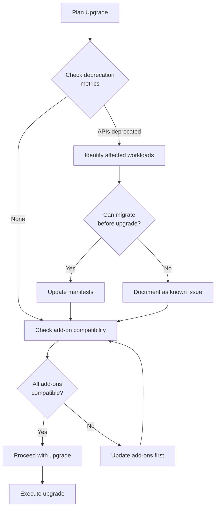
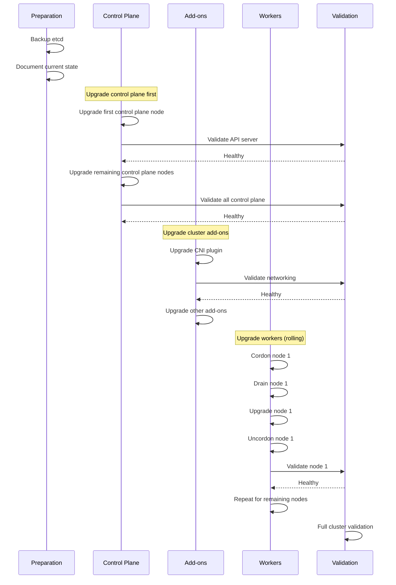
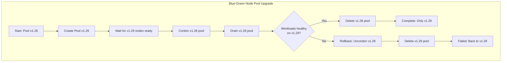

*[K8s]: Kubernetes
*[API]: Application Programming Interface
*[CRD]: Custom Resource Definition
*[PDB]: Pod Disruption Budget
*[PSP]: Pod Security Policy
*[PSA]: Pod Security Admission
*[etcd]: Distributed key-value store used by Kubernetes
*[CNI]: Container Network Interface
*[CSI]: Container Storage Interface
*[HPA]: Horizontal Pod Autoscaler
*[PVC]: Persistent Volume Claim

# Kubernetes Upgrades: Making Them Boring

## Introduction

Frame the Kubernetes upgrade challenge: Kubernetes releases new versions roughly every 4 months. Each version brings new features, deprecates old APIs, and eventually removes them. Falling behind means accumulating upgrade debt, missing security patches, and eventually facing a multi-version jump that's far riskier than incremental updates. Yet upgrades feel scary—the control plane manages everything, and mistakes can take down the entire cluster. This section establishes that the goal is making upgrades boring through preparation, validation, and practiced procedures.

_Include a scenario: a team delayed upgrades for 18 months because "everything is working fine." When they finally must upgrade for security compliance, they face a 5-version jump. Deprecated APIs are everywhere, controllers break, workloads fail. What should have been four 2-hour maintenance windows becomes a 3-week crisis. The lesson: frequent, incremental upgrades are less risky than infrequent large jumps._

<Callout type="warning">
The riskiest upgrade is the one you've been avoiding. Each version you skip accumulates: deprecated APIs, changed behaviors, incompatible add-ons. A cluster 3+ versions behind is an emergency waiting to happen.
</Callout>

## Upgrade Preparation

### Pre-Upgrade Checklist

```yaml title="pre-upgrade-checklist.yaml"
pre_upgrade_checklist:
  timing_and_planning:
    - item: "Review release notes for target version"
      why: "Understand what's changing"
      link: "https://kubernetes.io/releases/"

    - item: "Check deprecation warnings"
      why: "Identify APIs that will break"
      command: "kubectl get --raw /metrics | grep apiserver_requested_deprecated_apis"

    - item: "Verify upgrade path is supported"
      why: "Can only upgrade one minor version at a time"
      rule: "1.27 → 1.28 ✓, 1.27 → 1.29 ✗"

    - item: "Schedule maintenance window"
      why: "Even with zero-downtime, have buffer for issues"
      recommendation: "2-4 hours depending on cluster size"

  cluster_health:
    - item: "All nodes Ready"
      command: "kubectl get nodes"
      expected: "All nodes show Ready status"

    - item: "No pending pods"
      command: "kubectl get pods -A --field-selector=status.phase=Pending"
      expected: "No unexpected pending pods"

    - item: "Control plane healthy"
      command: "kubectl get componentstatuses"
      expected: "All components healthy"

    - item: "etcd healthy"
      command: "etcdctl endpoint health --cluster"
      expected: "All endpoints healthy"

    - item: "Sufficient resource headroom"
      why: "Upgrades temporarily reduce capacity"
      check: "Node CPU/memory < 70% utilization"

  backup_and_recovery:
    - item: "etcd backup taken"
      command: "etcdctl snapshot save /backup/etcd-$(date +%Y%m%d).db"
      retention: "Keep until upgrade validated"

    - item: "Cluster state documented"
      includes:
        - "kubectl get all -A -o yaml > cluster-state.yaml"
        - "Helm list all releases"
        - "Document custom configurations"

    - item: "Rollback procedure documented"
      why: "Know how to revert before you start"
      test: "Practiced in non-prod environment"

  compatibility_verification:
    - item: "Add-ons compatible with target version"
      check_list:
        - "CNI plugin (Calico, Cilium, etc.)"
        - "CSI drivers"
        - "Ingress controller"
        - "Cert-manager"
        - "Monitoring stack"
      how: "Check add-on documentation for version matrix"

    - item: "Custom controllers tested"
      why: "May use deprecated APIs or changed behaviors"
      test: "Run in staging against target version"

    - item: "Workload manifests validated"
      command: "kubectl convert -f manifests/ --output-version apps/v1"
      why: "Catch deprecated APIs before upgrade"
```
Code: Comprehensive pre-upgrade checklist.

### Deprecated API Detection

```bash title="deprecated-api-detection.sh"
#!/bin/bash
# Detect deprecated API usage before upgrade

set -euo pipefail

TARGET_VERSION="${1:-1.29}"

echo "=== Checking for deprecated API usage ==="

# Method 1: Check API server metrics (runtime usage)
echo ""
echo "APIs being actively used that are deprecated:"
kubectl get --raw /metrics 2>/dev/null | \
  grep apiserver_requested_deprecated_apis | \
  grep -v "^#" | \
  sort -t'"' -k2

# Method 2: Static analysis with pluto
echo ""
echo "Scanning manifests with pluto..."
if command -v pluto &> /dev/null; then
  # Scan all resources in cluster
  kubectl get all -A -o yaml | pluto detect -t k8s=v${TARGET_VERSION} -

  # Scan Helm releases
  for release in $(helm list -A -q); do
    namespace=$(helm list -A | grep "^$release" | awk '{print $2}')
    echo "Checking Helm release: $release in $namespace"
    helm template "$release" --namespace "$namespace" | \
      pluto detect -t k8s=v${TARGET_VERSION} - 2>/dev/null || true
  done
else
  echo "pluto not installed - install from https://github.com/FairwindsOps/pluto"
fi

# Method 3: Check specific known deprecations
echo ""
echo "Checking for specific deprecations in ${TARGET_VERSION}..."

# Example: PodSecurityPolicy removed in 1.25
if [[ "$TARGET_VERSION" > "1.24" ]]; then
  psp_count=$(kubectl get psp 2>/dev/null | wc -l || echo "0")
  if [[ "$psp_count" -gt 1 ]]; then
    echo "⚠️  PodSecurityPolicy in use - removed in 1.25"
    echo "   Migrate to Pod Security Admission"
  fi
fi

# Example: Ingress v1beta1 removed in 1.22
if [[ "$TARGET_VERSION" > "1.21" ]]; then
  beta_ingress=$(kubectl get ingress.v1beta1.networking.k8s.io -A 2>/dev/null | wc -l || echo "0")
  if [[ "$beta_ingress" -gt 1 ]]; then
    echo "⚠️  Ingress v1beta1 in use - removed in 1.22"
    echo "   Migrate to networking.k8s.io/v1"
  fi
fi

# Method 4: Check kubelet version skew
echo ""
echo "Checking version skew..."
control_plane_version=$(kubectl version -o json | jq -r '.serverVersion.minor' | tr -d '+')
kubectl get nodes -o json | jq -r '.items[] | "\(.metadata.name): \(.status.nodeInfo.kubeletVersion)"' | while read line; do
  node_version=$(echo "$line" | grep -oP '\d+\.\d+' | head -1 | cut -d. -f2)
  skew=$((control_plane_version - node_version))
  if [[ "$skew" -gt 2 ]]; then
    echo "⚠️  $line - version skew > 2"
  else
    echo "✓ $line"
  fi
done

echo ""
echo "=== Pre-upgrade API check complete ==="
```
Code: Deprecated API detection script.


Figure: Pre-upgrade validation flow.

<Callout type="info">
Run deprecated API detection continuously, not just before upgrades. Pluto in CI catches new deprecated API usage in PRs before it reaches the cluster. The best time to fix a deprecated API is when the PR is open, not during upgrade prep.
</Callout>

## Upgrade Ordering

### Component Upgrade Sequence


Figure: Upgrade component sequence.

```yaml title="upgrade-sequence.yaml"
upgrade_sequence:
  phase_1_preparation:
    duration: "30 minutes"
    steps:
      - name: "Final health check"
        commands:
          - "kubectl get nodes"
          - "kubectl get pods -A | grep -v Running"
        abort_if: "Unhealthy nodes or critical pods"

      - name: "Take etcd backup"
        command: "etcdctl snapshot save /backup/pre-upgrade-$(date +%s).db"
        verify: "etcdctl snapshot status /backup/pre-upgrade-*.db"

      - name: "Enable maintenance mode"
        actions:
          - "Notify on-call"
          - "Update status page"
          - "Pause non-critical deployments"

  phase_2_control_plane:
    duration: "30-60 minutes"
    warning: "API server will be unavailable briefly during each node upgrade"
    steps:
      - name: "Upgrade first control plane node"
        tool_specific:
          kubeadm: "kubeadm upgrade apply v1.29.0"
          eks: "eksctl upgrade cluster"
          gke: "gcloud container clusters upgrade --master"
          aks: "az aks upgrade --control-plane-only"

      - name: "Verify API server"
        commands:
          - "kubectl version"
          - "kubectl get nodes"
          - "kubectl get componentstatuses"
        wait: "60 seconds between checks"

      - name: "Upgrade remaining control plane nodes"
        note: "For HA clusters with multiple control plane nodes"
        command: "kubeadm upgrade node"

  phase_3_addons:
    duration: "15-30 minutes"
    steps:
      - name: "Upgrade CNI"
        why: "Must be compatible with new kubelet"
        verify: "Pod networking works"

      - name: "Upgrade CoreDNS"
        why: "Often has version requirements"
        verify: "DNS resolution works"

      - name: "Upgrade other add-ons"
        order:
          - "metrics-server"
          - "cert-manager"
          - "ingress-controller"
          - "monitoring stack"
        verify_each: true

  phase_4_worker_nodes:
    duration: "10-15 minutes per node"
    steps:
      - name: "Cordon node"
        command: "kubectl cordon <node-name>"
        effect: "No new pods scheduled"

      - name: "Drain node"
        command: |
          kubectl drain <node-name> \
            --ignore-daemonsets \
            --delete-emptydir-data \
            --timeout=300s
        wait_for: "All pods evicted or timeout"

      - name: "Upgrade kubelet and kubectl"
        tool_specific:
          kubeadm: |
            apt-get update
            apt-get install -y kubelet=1.29.0-00 kubectl=1.29.0-00
            systemctl daemon-reload
            systemctl restart kubelet
          managed: "Node pool upgrade or node replacement"

      - name: "Uncordon node"
        command: "kubectl uncordon <node-name>"
        effect: "Node available for scheduling"

      - name: "Verify node"
        commands:
          - "kubectl get node <node-name>"
          - "kubectl describe node <node-name> | grep -A5 Conditions"
        wait: "Until Ready"

  phase_5_validation:
    duration: "15-30 minutes"
    steps:
      - name: "Cluster health check"
        checks:
          - "All nodes Ready"
          - "All system pods Running"
          - "No pending pods"

      - name: "Application smoke tests"
        checks:
          - "Sample API calls succeed"
          - "Ingress routing works"
          - "DNS resolution works"
          - "Storage access works"

      - name: "Monitoring verification"
        checks:
          - "Metrics collecting"
          - "Logs streaming"
          - "Alerts configured"
```
Code: Detailed upgrade sequence by phase.

| Phase | Duration | Risk Level | Rollback Difficulty |
|-------|----------|------------|---------------------|
| Preparation | 30 min | Low | N/A |
| Control Plane | 30-60 min | High | Hard (restore from backup) |
| Add-ons | 15-30 min | Medium | Medium (reinstall previous) |
| Workers | 10-15 min/node | Low | Easy (don't uncordon) |
| Validation | 15-30 min | Low | N/A |

Table: Upgrade phases with risk assessment.

<Callout type="warning">
Control plane upgrades are the highest-risk phase. API server downtime affects all kubectl operations, controllers, and workloads trying to update. Have your rollback procedure ready and tested before touching the control plane.
</Callout>

## Risk Reduction Strategies

### Canary Cluster Pattern

```yaml title="canary-cluster-strategy.yaml"
canary_cluster_pattern:
  description: "Upgrade non-critical clusters first to catch issues"

  cluster_tiers:
    tier_1_canary:
      examples:
        - "dev-cluster"
        - "staging-cluster"
        - "internal-tools-cluster"
      upgrade_timing: "Day 1"
      soak_period: "3-5 business days"
      monitoring:
        - "Error rates"
        - "API server latency"
        - "Node stability"
        - "Workload health"
      proceed_if: "No issues after soak period"

    tier_2_non_critical_prod:
      examples:
        - "prod-secondary-region"
        - "batch-processing-cluster"
      upgrade_timing: "After tier 1 soak"
      soak_period: "5-7 business days"
      monitoring:
        - "Same as tier 1"
        - "Business metrics"
      proceed_if: "No issues after soak period"

    tier_3_critical_prod:
      examples:
        - "prod-primary-region"
        - "customer-facing-cluster"
      upgrade_timing: "After tier 2 soak"
      soak_period: "7-14 business days"
      extra_precautions:
        - "Reduced blast radius (upgrade during low traffic)"
        - "Extra monitoring"
        - "Immediate rollback capability"

  rollback_triggers:
    automatic:
      - "Control plane unreachable > 5 minutes"
      - "Error rate increase > 50%"
      - "Node failure rate > 10%"
    manual:
      - "Unexpected workload behavior"
      - "Performance degradation"
      - "Team judgment call"
```
Code: Canary cluster upgrade strategy.

### Node Pool Strategies

```typescript title="node-pool-upgrade.ts"
// Node pool upgrade strategies for managed Kubernetes

interface NodePoolUpgradeStrategy {
  name: string;
  description: string;
  pros: string[];
  cons: string[];
  bestFor: string;
}

const strategies: NodePoolUpgradeStrategy[] = [
  {
    name: 'In-place rolling upgrade',
    description: 'Upgrade nodes one at a time within existing pool',
    pros: [
      'No IP address changes',
      'Minimal disruption',
      'Lower cost (no extra nodes)',
    ],
    cons: [
      'Slower (sequential)',
      'Reduced capacity during upgrade',
      'Harder to rollback',
    ],
    bestFor: 'Small clusters, tight capacity',
  },

  {
    name: 'Blue-green node pools',
    description: 'Create new pool at new version, migrate workloads, delete old',
    pros: [
      'Easy rollback (keep old pool)',
      'No capacity reduction',
      'Clean nodes (no state accumulation)',
    ],
    cons: [
      'Temporary double cost',
      'IP addresses change',
      'More complex orchestration',
    ],
    bestFor: 'Production clusters, stateless workloads',
  },

  {
    name: 'Surge upgrade',
    description: 'Create extra nodes, upgrade, remove extras',
    pros: [
      'Faster than pure rolling',
      'Maintains capacity',
      'Balance of speed and safety',
    ],
    cons: [
      'Temporary extra cost',
      'Some IP churn',
    ],
    bestFor: 'Most production scenarios',
  },
];

// Blue-green node pool implementation
class BlueGreenNodePoolUpgrade {
  async upgrade(
    cluster: string,
    currentPool: string,
    targetVersion: string
  ): Promise<void> {
    const newPoolName = `${currentPool}-${targetVersion.replace(/\./g, '-')}`;

    // Step 1: Create new node pool at target version
    console.log(`Creating new node pool: ${newPoolName}`);
    await this.createNodePool({
      cluster,
      name: newPoolName,
      version: targetVersion,
      size: await this.getPoolSize(cluster, currentPool),
      taints: [{ key: 'upgrade', value: 'in-progress', effect: 'NoSchedule' }],
    });

    // Step 2: Wait for nodes to be ready
    await this.waitForNodesReady(cluster, newPoolName);

    // Step 3: Remove taint to allow scheduling
    await this.removeTaint(cluster, newPoolName, 'upgrade');

    // Step 4: Cordon old pool
    console.log(`Cordoning old pool: ${currentPool}`);
    await this.cordonPool(cluster, currentPool);

    // Step 5: Drain old pool (workloads move to new pool)
    console.log(`Draining old pool: ${currentPool}`);
    await this.drainPool(cluster, currentPool);

    // Step 6: Validate workloads on new pool
    const healthy = await this.validateWorkloads(cluster);
    if (!healthy) {
      // Rollback: uncordon old pool, delete new pool
      console.error('Validation failed, rolling back');
      await this.uncordonPool(cluster, currentPool);
      await this.deleteNodePool(cluster, newPoolName);
      throw new Error('Upgrade validation failed');
    }

    // Step 7: Delete old pool
    console.log(`Deleting old pool: ${currentPool}`);
    await this.deleteNodePool(cluster, currentPool);

    console.log('Upgrade complete');
  }
}
```
Code: Blue-green node pool upgrade strategy.


Figure: Blue-green node pool upgrade flow.

<Callout type="success">
Blue-green node pools give you the easiest rollback path: if anything goes wrong, uncordon the old pool and delete the new one. The cost of running both pools temporarily is insurance against upgrade failures.
</Callout>

## Rollback Procedures

### Control Plane Rollback

```yaml title="control-plane-rollback.yaml"
control_plane_rollback:
  when_to_rollback:
    immediate_triggers:
      - "API server won't start after upgrade"
      - "etcd cluster unhealthy"
      - "Control plane components crash looping"
    considered_triggers:
      - "Significant API latency increase"
      - "Intermittent failures"
      - "Unexpected behavior"

  etcd_restore_procedure:
    warning: "This resets cluster state to backup time"
    steps:
      - name: "Stop all control plane components"
        commands:
          - "systemctl stop kube-apiserver"
          - "systemctl stop kube-controller-manager"
          - "systemctl stop kube-scheduler"
          - "systemctl stop etcd"

      - name: "Restore etcd from backup"
        command: |
          etcdctl snapshot restore /backup/pre-upgrade.db \
            --data-dir=/var/lib/etcd-restore \
            --name=$(hostname) \
            --initial-cluster=$(hostname)=https://$(hostname):2380 \
            --initial-advertise-peer-urls=https://$(hostname):2380

      - name: "Replace etcd data directory"
        commands:
          - "mv /var/lib/etcd /var/lib/etcd-failed"
          - "mv /var/lib/etcd-restore /var/lib/etcd"
          - "chown -R etcd:etcd /var/lib/etcd"

      - name: "Restore previous control plane binaries"
        note: "Depends on how upgrade was performed"
        kubeadm: |
          apt-get install -y kubelet=1.28.0-00 kubeadm=1.28.0-00 kubectl=1.28.0-00
          # Or restore from backup

      - name: "Start etcd"
        command: "systemctl start etcd"
        verify: "etcdctl endpoint health"

      - name: "Start control plane components"
        commands:
          - "systemctl start kube-apiserver"
          - "systemctl start kube-controller-manager"
          - "systemctl start kube-scheduler"
        verify: "kubectl get componentstatuses"

      - name: "Verify cluster state"
        commands:
          - "kubectl get nodes"
          - "kubectl get pods -A"
        note: "State reflects backup time, not current"

  managed_kubernetes_rollback:
    eks:
      note: "EKS doesn't support control plane downgrade"
      options:
        - "Restore from Terraform/CloudFormation"
        - "Create new cluster, migrate workloads"

    gke:
      note: "GKE supports rollback within maintenance window"
      command: |
        gcloud container clusters upgrade CLUSTER_NAME \
          --master \
          --cluster-version=PREVIOUS_VERSION

    aks:
      note: "AKS doesn't support control plane downgrade"
      options:
        - "Create new cluster"
        - "Azure support ticket"
```
Code: Control plane rollback procedures.

### Worker Node Rollback

```bash title="worker-rollback.sh"
#!/bin/bash
# Worker node rollback script

set -euo pipefail

NODE_NAME="${1:?Node name required}"
PREVIOUS_VERSION="${2:?Previous version required}"

echo "=== Rolling back $NODE_NAME to $PREVIOUS_VERSION ==="

# Step 1: Cordon the node
echo "Cordoning node..."
kubectl cordon "$NODE_NAME"

# Step 2: Drain the node
echo "Draining node..."
kubectl drain "$NODE_NAME" \
  --ignore-daemonsets \
  --delete-emptydir-data \
  --timeout=300s

# Step 3: SSH and downgrade kubelet
echo "Downgrading kubelet..."
ssh "$NODE_NAME" << EOF
  # Hold packages at specific version
  apt-mark unhold kubelet kubectl

  # Install previous version
  apt-get update
  apt-get install -y kubelet=${PREVIOUS_VERSION}-00 kubectl=${PREVIOUS_VERSION}-00

  # Hold at this version
  apt-mark hold kubelet kubectl

  # Restart kubelet
  systemctl daemon-reload
  systemctl restart kubelet
EOF

# Step 4: Wait for node to be ready
echo "Waiting for node to be ready..."
kubectl wait --for=condition=Ready node/"$NODE_NAME" --timeout=300s

# Step 5: Verify version
echo "Verifying version..."
node_version=$(kubectl get node "$NODE_NAME" -o jsonpath='{.status.nodeInfo.kubeletVersion}')
if [[ "$node_version" == *"$PREVIOUS_VERSION"* ]]; then
  echo "✓ Node rolled back to $node_version"
else
  echo "✗ Version mismatch: expected $PREVIOUS_VERSION, got $node_version"
  exit 1
fi

# Step 6: Uncordon the node
echo "Uncordoning node..."
kubectl uncordon "$NODE_NAME"

echo "=== Rollback complete ==="
```
Code: Worker node rollback script.

| Rollback Scenario | Complexity | Data Loss Risk | Downtime |
|-------------------|------------|----------------|----------|
| Single worker node | Low | None | Per-node |
| All worker nodes | Medium | None | Rolling |
| Control plane (kubeadm) | High | Possible | Minutes |
| Control plane (managed) | Very High | Possible | Hours |

Table: Rollback scenario risk assessment.

<Callout type="danger">
Managed Kubernetes services (EKS, GKE, AKS) often don't support control plane downgrades. Your "rollback" may be creating a new cluster and migrating workloads. Test this procedure before you need it.
</Callout>

## Post-Upgrade Validation

### Comprehensive Validation Suite

```typescript title="post-upgrade-validation.ts"
interface ValidationCheck {
  name: string;
  category: 'infrastructure' | 'networking' | 'storage' | 'workloads' | 'addons';
  critical: boolean;
  check: () => Promise<ValidationResult>;
}

const postUpgradeValidation: ValidationCheck[] = [
  // Infrastructure checks
  {
    name: 'All nodes Ready',
    category: 'infrastructure',
    critical: true,
    check: async () => {
      const nodes = await kubectl.getNodes();
      const notReady = nodes.filter(n =>
        !n.status.conditions.find(c => c.type === 'Ready' && c.status === 'True')
      );
      return {
        passed: notReady.length === 0,
        details: notReady.length > 0
          ? `Nodes not ready: ${notReady.map(n => n.metadata.name).join(', ')}`
          : 'All nodes ready',
      };
    },
  },
  {
    name: 'Control plane components healthy',
    category: 'infrastructure',
    critical: true,
    check: async () => {
      const health = await kubectl.getComponentStatuses();
      const unhealthy = health.filter(c => c.conditions[0]?.status !== 'True');
      return {
        passed: unhealthy.length === 0,
        details: unhealthy.map(c => `${c.metadata.name}: ${c.conditions[0]?.message}`),
      };
    },
  },
  {
    name: 'API server responding',
    category: 'infrastructure',
    critical: true,
    check: async () => {
      const start = Date.now();
      try {
        await kubectl.version();
        const latency = Date.now() - start;
        return {
          passed: latency < 1000,
          details: `API server latency: ${latency}ms`,
        };
      } catch (error) {
        return { passed: false, details: `API server unreachable: ${error}` };
      }
    },
  },

  // Networking checks
  {
    name: 'DNS resolution working',
    category: 'networking',
    critical: true,
    check: async () => {
      const result = await kubectl.exec(
        'test-pod', 'default',
        ['nslookup', 'kubernetes.default']
      );
      return {
        passed: result.exitCode === 0,
        details: result.stdout,
      };
    },
  },
  {
    name: 'Pod-to-pod networking',
    category: 'networking',
    critical: true,
    check: async () => {
      // Deploy test pods on different nodes, verify connectivity
      const result = await runNetworkTest();
      return {
        passed: result.allPassed,
        details: result.summary,
      };
    },
  },
  {
    name: 'Ingress routing',
    category: 'networking',
    critical: true,
    check: async () => {
      const response = await fetch('https://test-app.internal/health');
      return {
        passed: response.ok,
        details: `Ingress health check: ${response.status}`,
      };
    },
  },

  // Storage checks
  {
    name: 'PVCs bound',
    category: 'storage',
    critical: true,
    check: async () => {
      const pvcs = await kubectl.getPVCs('--all-namespaces');
      const unbound = pvcs.filter(p => p.status.phase !== 'Bound');
      return {
        passed: unbound.length === 0,
        details: unbound.length > 0
          ? `Unbound PVCs: ${unbound.map(p => p.metadata.name).join(', ')}`
          : 'All PVCs bound',
      };
    },
  },
  {
    name: 'Storage class available',
    category: 'storage',
    critical: false,
    check: async () => {
      const storageClasses = await kubectl.getStorageClasses();
      const defaultSC = storageClasses.find(sc =>
        sc.metadata.annotations?.['storageclass.kubernetes.io/is-default-class'] === 'true'
      );
      return {
        passed: !!defaultSC,
        details: defaultSC
          ? `Default storage class: ${defaultSC.metadata.name}`
          : 'No default storage class',
      };
    },
  },

  // Workload checks
  {
    name: 'System pods running',
    category: 'workloads',
    critical: true,
    check: async () => {
      const pods = await kubectl.getPods('kube-system');
      const notRunning = pods.filter(p => p.status.phase !== 'Running');
      return {
        passed: notRunning.length === 0,
        details: notRunning.length > 0
          ? `System pods not running: ${notRunning.map(p => p.metadata.name).join(', ')}`
          : 'All system pods running',
      };
    },
  },
  {
    name: 'No pending pods',
    category: 'workloads',
    critical: false,
    check: async () => {
      const pending = await kubectl.getPods('--all-namespaces', '--field-selector=status.phase=Pending');
      return {
        passed: pending.length === 0,
        details: pending.length > 0
          ? `Pending pods: ${pending.map(p => `${p.metadata.namespace}/${p.metadata.name}`).join(', ')}`
          : 'No pending pods',
      };
    },
  },
];

// Run all validations
async function runPostUpgradeValidation(): Promise<ValidationReport> {
  const results: ValidationResult[] = [];

  for (const check of postUpgradeValidation) {
    console.log(`Running: ${check.name}...`);
    try {
      const result = await check.check();
      results.push({
        ...result,
        name: check.name,
        category: check.category,
        critical: check.critical,
      });
      console.log(result.passed ? '✓' : '✗', check.name);
    } catch (error) {
      results.push({
        name: check.name,
        category: check.category,
        critical: check.critical,
        passed: false,
        details: `Check failed with error: ${error}`,
      });
      console.log('✗', check.name, error);
    }
  }

  const criticalFailures = results.filter(r => r.critical && !r.passed);

  return {
    passed: criticalFailures.length === 0,
    results,
    summary: {
      total: results.length,
      passed: results.filter(r => r.passed).length,
      failed: results.filter(r => !r.passed).length,
      criticalFailures: criticalFailures.length,
    },
  };
}
```
Code: Comprehensive post-upgrade validation suite.

```yaml title="smoke-tests.yaml"
# Application-level smoke tests to run after upgrade

smoke_tests:
  - name: "API health endpoint"
    type: "http"
    endpoint: "https://api.internal/health"
    expected_status: 200
    timeout: 10s

  - name: "Database connectivity"
    type: "tcp"
    endpoint: "postgres.database:5432"
    timeout: 5s

  - name: "Cache connectivity"
    type: "tcp"
    endpoint: "redis.cache:6379"
    timeout: 5s

  - name: "Queue connectivity"
    type: "tcp"
    endpoint: "rabbitmq.messaging:5672"
    timeout: 5s

  - name: "Authentication service"
    type: "http"
    endpoint: "https://auth.internal/health"
    expected_status: 200

  - name: "Sample API call"
    type: "http"
    endpoint: "https://api.internal/v1/users/me"
    headers:
      Authorization: "Bearer ${TEST_TOKEN}"
    expected_status: 200

  - name: "Metrics collection"
    type: "prometheus_query"
    query: "up{job='kubernetes-nodes'}"
    expected: "all values = 1"

  - name: "Log collection"
    type: "log_query"
    query: "kubernetes.namespace:kube-system"
    expected: "recent logs present"
```
Code: Application smoke tests.

<Callout type="info">
Validation should be automated and fast. If checking takes hours, you won't check often enough. A comprehensive validation suite that runs in 5 minutes lets you validate after each phase, catching issues early.
</Callout>

## Conclusion

Summarize the key practices for boring Kubernetes upgrades: prepare thoroughly with deprecated API detection and compatibility checks; follow strict upgrade ordering (control plane → add-ons → workers); use canary clusters and blue-green node pools to reduce risk; have tested rollback procedures ready before starting; and validate comprehensively after each phase. Emphasize that the investment in upgrade infrastructure pays dividends—teams that upgrade frequently and incrementally have fewer incidents than teams that do rare, large upgrades.

<Callout type="success">
The goal is making upgrades so routine they're boring. Quarterly upgrades, practiced procedures, automated validation, and quick rollback capability transform upgrades from scary events into regular maintenance. The teams that upgrade often are the teams that upgrade well.
</Callout>

---

## Cover Prompt

### Prompt 1: The Upgrade Ladder

Create an image of a ladder with rungs labeled with Kubernetes versions (1.27, 1.28, 1.29, 1.30). A climber ascends one rung at a time, with safety equipment attached. Below, someone tries to jump multiple rungs and struggles. A safety net (rollback) is visible below. Style: ladder climbing, incremental progress, safety equipment, 16:9 aspect ratio.

### Prompt 2: The Control Tower

Design an image of an air traffic control tower managing a Kubernetes upgrade. Screens show cluster health, node status, and upgrade progress. Controllers guide "planes" (pods) to land safely while runways (nodes) are upgraded one at a time. A "Go/No-Go" decision board is visible. Style: air traffic control, coordination, safety protocols, 16:9 aspect ratio.

### Prompt 3: The Version Conveyor Belt

Illustrate a factory assembly line where clusters move through upgrade stations: "Pre-Check," "Control Plane," "Add-ons," "Workers," "Validation." Quality inspectors check at each station. Defective clusters are diverted to a "Rollback" lane. Successfully upgraded clusters exit with a "Certified" stamp. Style: manufacturing process, quality control stations, certification, 16:9 aspect ratio.

### Prompt 4: The Blue-Green Handoff

Create an image of a relay race where a "blue" runner (old nodes) passes the baton (workloads) to a "green" runner (new nodes). The handoff zone is carefully marked. Judges (monitoring) watch the exchange. If the green runner stumbles, the blue runner can take the baton back. Style: relay race, careful handoff, backup ready, 16:9 aspect ratio.

### Prompt 5: The Upgrade Playbook

Design an image of an open playbook/strategy book labeled "Kubernetes Upgrade Playbook." Pages show diagrams of upgrade sequences, checklists, and decision trees. A coach (platform engineer) reviews the plays with the team before the "game" (upgrade). The playbook is well-worn from practice. Style: sports playbook, strategy planning, team preparation, 16:9 aspect ratio.
