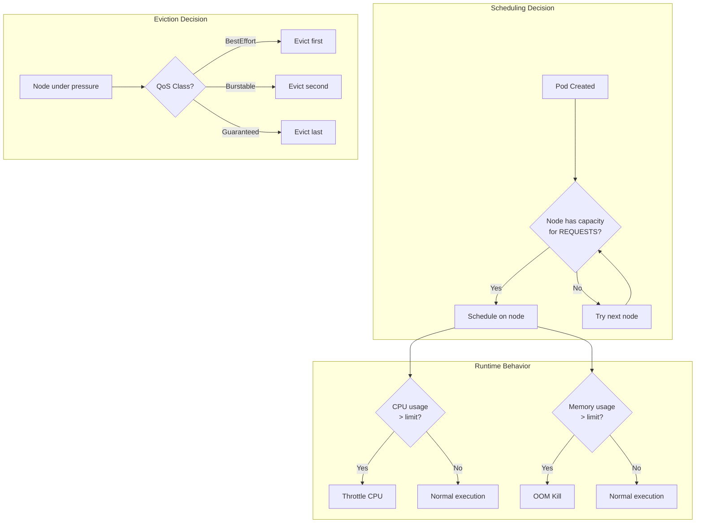
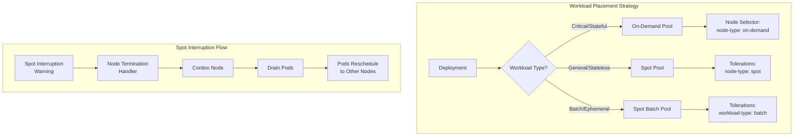
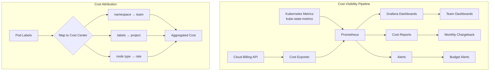

*[K8s]: Kubernetes
*[VPA]: Vertical Pod Autoscaler
*[HPA]: Horizontal Pod Autoscaler
*[QoS]: Quality of Service
*[OOM]: Out of Memory
*[CPU]: Central Processing Unit
*[RAM]: Random Access Memory
*[EC2]: Elastic Compute Cloud
*[GCE]: Google Compute Engine
*[AKS]: Azure Kubernetes Service
*[EKS]: Elastic Kubernetes Service
*[GKE]: Google Kubernetes Engine

# Kubernetes Cost Drivers: What Moves the Bill

## Introduction

Frame the Kubernetes cost challenge: compute is typically 60-80% of Kubernetes spend, yet most teams have no visibility into whether their resource requests match actual usage. The default behavior—developers requesting "enough" resources with generous padding—leads to clusters running at 20-30% utilization while paying for 100%. This section establishes that cost optimization isn't about penny-pinching; it's about eliminating waste that funds nothing. The savings often fund actual improvements: better observability, more environments, or simply budget for the next project.

_Include a scenario: a team running 50 nodes discovers through cost analysis that average CPU utilization is 15% and memory is 25%. Resource requests are 3-4x actual usage. Right-sizing resource requests and enabling cluster autoscaler reduces to 20 nodes—a 60% cost reduction with zero performance impact. The lesson: you can't optimize what you don't measure._

<Callout type="info">
Kubernetes cost optimization has three levers: use cheaper compute (spot instances), use less compute (right-sizing), and use compute more efficiently (bin packing). Most savings come from the boring work of accurate resource requests, not clever architecture.
</Callout>

## Understanding Kubernetes Resource Model

### Requests vs Limits

```yaml title="resource-model-explained.yaml"
# Understanding what requests and limits actually do

apiVersion: v1
kind: Pod
metadata:
  name: resource-example
spec:
  containers:
    - name: app
      image: myapp:latest
      resources:
        # Requests: What the scheduler uses for placement
        # - Guaranteed to be available
        # - Used for bin packing decisions
        # - Determines QoS class
        requests:
          cpu: "500m"      # 0.5 CPU cores reserved
          memory: "256Mi"  # 256 MiB reserved

        # Limits: Maximum the container can use
        # - CPU: Throttled if exceeded (not killed)
        # - Memory: OOM killed if exceeded
        # - Optional but recommended
        limits:
          cpu: "1000m"    # Can burst to 1 CPU
          memory: "512Mi" # Hard ceiling, OOM if exceeded

---
# QoS Classes (automatically assigned)

# Guaranteed: requests == limits for all containers
# - Highest priority, last to be evicted
# - Best for critical workloads
guaranteed_example:
  resources:
    requests:
      cpu: "500m"
      memory: "256Mi"
    limits:
      cpu: "500m"
      memory: "256Mi"

# Burstable: requests < limits (or limits not set)
# - Medium priority
# - Most common class
burstable_example:
  resources:
    requests:
      cpu: "250m"
      memory: "128Mi"
    limits:
      cpu: "500m"
      memory: "256Mi"

# BestEffort: No requests or limits set
# - Lowest priority, first to be evicted
# - Avoid in production
best_effort_example:
  resources: {}  # Don't do this
```
Code: Resource requests and limits explained.


Figure: Resource model behavior flow.

| Aspect | Request | Limit |
|--------|---------|-------|
| Scheduling | Used for placement decisions | Not considered |
| CPU behavior | Guaranteed minimum | Throttled if exceeded |
| Memory behavior | Guaranteed minimum | OOM killed if exceeded |
| Cluster capacity | Sum of requests = schedulable capacity | Sum of limits can exceed node capacity |
| Cost impact | Directly determines node count | Indirectly affects density |

Table: Requests vs limits comparison.

<Callout type="warning">
Setting requests too high wastes money (nodes appear full but aren't). Setting requests too low causes scheduling failures (pods can't find nodes) or performance issues (resource contention). The goal is requests that match actual usage with a small buffer.
</Callout>

### The Over-Provisioning Problem

```typescript title="over-provisioning-analysis.ts"
// Analyzing resource efficiency in a cluster

interface PodResourceUsage {
  namespace: string;
  pod: string;
  container: string;
  cpuRequest: number;      // millicores
  cpuUsage: number;        // millicores (avg)
  cpuUsagePeak: number;    // millicores (p99)
  memoryRequest: number;   // bytes
  memoryUsage: number;     // bytes (avg)
  memoryUsagePeak: number; // bytes (p99)
}

function analyzeOverProvisioning(pods: PodResourceUsage[]): OverProvisioningReport {
  const analysis = pods.map(pod => {
    const cpuEfficiency = (pod.cpuUsage / pod.cpuRequest) * 100;
    const memoryEfficiency = (pod.memoryUsage / pod.memoryRequest) * 100;

    // Calculate waste
    const cpuWaste = pod.cpuRequest - pod.cpuUsagePeak;
    const memoryWaste = pod.memoryRequest - pod.memoryUsagePeak;

    return {
      ...pod,
      cpuEfficiency: cpuEfficiency.toFixed(1),
      memoryEfficiency: memoryEfficiency.toFixed(1),
      cpuWasteMillicores: Math.max(0, cpuWaste),
      memoryWasteBytes: Math.max(0, memoryWaste),

      // Recommendations
      recommendedCpuRequest: Math.ceil(pod.cpuUsagePeak * 1.2), // 20% buffer
      recommendedMemoryRequest: Math.ceil(pod.memoryUsagePeak * 1.2),
    };
  });

  // Aggregate statistics
  const totalCpuRequested = pods.reduce((sum, p) => sum + p.cpuRequest, 0);
  const totalCpuUsed = pods.reduce((sum, p) => sum + p.cpuUsage, 0);
  const totalMemoryRequested = pods.reduce((sum, p) => sum + p.memoryRequest, 0);
  const totalMemoryUsed = pods.reduce((sum, p) => sum + p.memoryUsage, 0);

  return {
    summary: {
      clusterCpuEfficiency: ((totalCpuUsed / totalCpuRequested) * 100).toFixed(1),
      clusterMemoryEfficiency: ((totalMemoryUsed / totalMemoryRequested) * 100).toFixed(1),
      totalCpuWaste: totalCpuRequested - totalCpuUsed,
      totalMemoryWaste: totalMemoryRequested - totalMemoryUsed,
    },
    worstOffenders: analysis
      .sort((a, b) => b.cpuWasteMillicores - a.cpuWasteMillicores)
      .slice(0, 20),
    recommendations: analysis.filter(a =>
      a.cpuWasteMillicores > 100 || a.memoryWasteBytes > 128 * 1024 * 1024
    ),
  };
}

// Example output
const report = analyzeOverProvisioning(clusterPods);
console.log(`Cluster CPU efficiency: ${report.summary.clusterCpuEfficiency}%`);
console.log(`Cluster memory efficiency: ${report.summary.clusterMemoryEfficiency}%`);
console.log(`Wasted CPU: ${report.summary.totalCpuWaste}m`);
console.log(`Wasted memory: ${(report.summary.totalMemoryWaste / 1024 / 1024 / 1024).toFixed(1)} GiB`);
```
Code: Over-provisioning analysis.

## Right-Sizing Resources

### Gathering Usage Data

```yaml title="metrics-collection.yaml"
# Prometheus queries for resource usage analysis

queries:
  # Average CPU usage over 7 days
  cpu_average: |
    avg_over_time(
      rate(container_cpu_usage_seconds_total{
        container!="",
        container!="POD"
      }[5m])[7d:1h]
    ) * 1000

  # P95 CPU usage over 7 days
  cpu_p95: |
    quantile_over_time(0.95,
      rate(container_cpu_usage_seconds_total{
        container!="",
        container!="POD"
      }[5m])[7d:1h]
    ) * 1000

  # P99 CPU usage over 7 days
  cpu_p99: |
    quantile_over_time(0.99,
      rate(container_cpu_usage_seconds_total{
        container!="",
        container!="POD"
      }[5m])[7d:1h]
    ) * 1000

  # Average memory usage
  memory_average: |
    avg_over_time(
      container_memory_working_set_bytes{
        container!="",
        container!="POD"
      }[7d:1h]
    )

  # P95 memory usage
  memory_p95: |
    quantile_over_time(0.95,
      container_memory_working_set_bytes{
        container!="",
        container!="POD"
      }[7d:1h]
    )

  # CPU request vs usage ratio
  cpu_efficiency: |
    sum by (namespace, pod, container) (
      rate(container_cpu_usage_seconds_total{container!=""}[5m])
    )
    /
    sum by (namespace, pod, container) (
      kube_pod_container_resource_requests{resource="cpu"}
    )

  # Memory request vs usage ratio
  memory_efficiency: |
    sum by (namespace, pod, container) (
      container_memory_working_set_bytes{container!=""}
    )
    /
    sum by (namespace, pod, container) (
      kube_pod_container_resource_requests{resource="memory"}
    )
```
Code: Prometheus queries for usage analysis.

### Vertical Pod Autoscaler

```yaml title="vpa-configuration.yaml"
# VPA for automatic right-sizing recommendations

apiVersion: autoscaling.k8s.io/v1
kind: VerticalPodAutoscaler
metadata:
  name: api-server-vpa
  namespace: production
spec:
  targetRef:
    apiVersion: apps/v1
    kind: Deployment
    name: api-server

  # Recommendation mode - doesn't apply changes automatically
  updatePolicy:
    updateMode: "Off"  # Off = recommendations only
                       # Initial = apply on pod creation
                       # Recreate = apply by evicting pods
                       # Auto = choose best method

  resourcePolicy:
    containerPolicies:
      - containerName: api
        # Bounds for recommendations
        minAllowed:
          cpu: "100m"
          memory: "128Mi"
        maxAllowed:
          cpu: "4"
          memory: "8Gi"
        # Which resources to manage
        controlledResources: ["cpu", "memory"]
        # How to adjust for variance
        controlledValues: RequestsAndLimits

---
# Check VPA recommendations
# kubectl describe vpa api-server-vpa

# Example output:
# Recommendation:
#   Container Recommendations:
#     Container Name: api
#     Lower Bound:
#       Cpu:     250m
#       Memory:  256Mi
#     Target:
#       Cpu:     500m
#       Memory:  512Mi
#     Uncapped Target:
#       Cpu:     500m
#       Memory:  512Mi
#     Upper Bound:
#       Cpu:     1
#       Memory:  1Gi
```
Code: VPA configuration for right-sizing.

```bash title="right-sizing-workflow.sh"
#!/bin/bash
# Right-sizing workflow using VPA recommendations

set -euo pipefail

NAMESPACE="${1:-default}"

echo "=== Right-Sizing Analysis for namespace: $NAMESPACE ==="

# Step 1: Deploy VPA in recommendation mode for all deployments
echo "Deploying VPAs in recommendation mode..."
for deployment in $(kubectl get deployments -n "$NAMESPACE" -o name); do
  name=$(echo "$deployment" | cut -d'/' -f2)

  kubectl apply -f - <<EOF
apiVersion: autoscaling.k8s.io/v1
kind: VerticalPodAutoscaler
metadata:
  name: ${name}-vpa
  namespace: $NAMESPACE
spec:
  targetRef:
    apiVersion: apps/v1
    kind: Deployment
    name: $name
  updatePolicy:
    updateMode: "Off"
EOF
done

echo "VPAs deployed. Wait 24-48 hours for accurate recommendations."
echo ""

# Step 2: Collect recommendations
echo "Current VPA recommendations:"
kubectl get vpa -n "$NAMESPACE" -o custom-columns=\
'NAME:.metadata.name,'\
'CPU_TARGET:.status.recommendation.containerRecommendations[0].target.cpu,'\
'MEM_TARGET:.status.recommendation.containerRecommendations[0].target.memory,'\
'CPU_LOWER:.status.recommendation.containerRecommendations[0].lowerBound.cpu,'\
'CPU_UPPER:.status.recommendation.containerRecommendations[0].upperBound.cpu'

# Step 3: Compare with current requests
echo ""
echo "Current resource requests:"
kubectl get pods -n "$NAMESPACE" -o custom-columns=\
'POD:.metadata.name,'\
'CPU_REQ:.spec.containers[0].resources.requests.cpu,'\
'MEM_REQ:.spec.containers[0].resources.requests.memory,'\
'CPU_LIM:.spec.containers[0].resources.limits.cpu,'\
'MEM_LIM:.spec.containers[0].resources.limits.memory'

# Step 4: Generate right-sizing patches
echo ""
echo "Generating patches based on VPA recommendations..."
for vpa in $(kubectl get vpa -n "$NAMESPACE" -o name); do
  vpa_name=$(echo "$vpa" | cut -d'/' -f2)
  deployment_name=${vpa_name%-vpa}

  cpu_target=$(kubectl get vpa "$vpa_name" -n "$NAMESPACE" \
    -o jsonpath='{.status.recommendation.containerRecommendations[0].target.cpu}')
  mem_target=$(kubectl get vpa "$vpa_name" -n "$NAMESPACE" \
    -o jsonpath='{.status.recommendation.containerRecommendations[0].target.memory}')

  if [[ -n "$cpu_target" && -n "$mem_target" ]]; then
    echo "# Patch for $deployment_name"
    echo "kubectl patch deployment $deployment_name -n $NAMESPACE --type=json -p='[
      {\"op\": \"replace\", \"path\": \"/spec/template/spec/containers/0/resources/requests/cpu\", \"value\": \"$cpu_target\"},
      {\"op\": \"replace\", \"path\": \"/spec/template/spec/containers/0/resources/requests/memory\", \"value\": \"$mem_target\"}
    ]'"
    echo ""
  fi
done
```
Code: Right-sizing workflow using VPA.

<Callout type="success">
Start VPA in "Off" mode to get recommendations without automatic changes. Review recommendations weekly, apply them through your normal deployment process, and validate that workloads remain healthy. Automatic modes work but remove the human verification step.
</Callout>

## Spot and Preemptible Instances

### Spot Instance Fundamentals

```yaml title="spot-instance-strategy.yaml"
spot_instance_fundamentals:
  what_are_spot_instances:
    definition: "Spare cloud capacity sold at steep discount"
    discount: "50-90% off on-demand pricing"
    catch: "Can be reclaimed with 2-minute warning"

  cloud_provider_names:
    aws: "Spot Instances"
    gcp: "Preemptible VMs / Spot VMs"
    azure: "Spot VMs"

  when_to_use:
    good_fit:
      - "Stateless workloads"
      - "Batch processing"
      - "Development environments"
      - "CI/CD runners"
      - "Workloads that can restart quickly"
    bad_fit:
      - "Databases"
      - "Stateful services without replication"
      - "Long-running jobs that can't checkpoint"
      - "Single-replica critical services"

  interruption_handling:
    preparation:
      - "Multiple replicas across availability zones"
      - "Graceful shutdown handling"
      - "Pod Disruption Budgets"
      - "Quick startup times"
    detection:
      - "Node termination handler daemon"
      - "Cloud provider metadata service"
      - "2-minute warning (AWS) / 30-second (GCP)"
```
Code: Spot instance fundamentals.

### Node Pool Configuration

```yaml title="mixed-node-pools.yaml"
# EKS managed node group with spot instances

apiVersion: eksctl.io/v1alpha5
kind: ClusterConfig
metadata:
  name: production-cluster
  region: us-west-2

managedNodeGroups:
  # On-demand pool for critical workloads
  - name: on-demand-critical
    instanceTypes: ["m5.xlarge", "m5a.xlarge"]
    desiredCapacity: 3
    minSize: 3
    maxSize: 10
    labels:
      node-type: on-demand
      workload-type: critical
    taints:
      - key: workload-type
        value: critical
        effect: NoSchedule

  # Spot pool for general workloads
  - name: spot-general
    instanceTypes:
      - "m5.xlarge"
      - "m5a.xlarge"
      - "m5n.xlarge"
      - "m6i.xlarge"
      - "m6a.xlarge"
    spot: true
    desiredCapacity: 5
    minSize: 0
    maxSize: 50
    labels:
      node-type: spot
      workload-type: general
    taints:
      - key: node-type
        value: spot
        effect: NoSchedule

  # Spot pool for batch workloads
  - name: spot-batch
    instanceTypes:
      - "c5.2xlarge"
      - "c5a.2xlarge"
      - "c6i.2xlarge"
    spot: true
    desiredCapacity: 0
    minSize: 0
    maxSize: 100
    labels:
      node-type: spot
      workload-type: batch
    taints:
      - key: workload-type
        value: batch
        effect: NoSchedule

---
# GKE node pool with spot VMs

apiVersion: container.google.com/v1
kind: NodePool
metadata:
  name: spot-pool
spec:
  config:
    machineType: n2-standard-4
    spot: true
    labels:
      node-type: spot
    taints:
      - key: cloud.google.com/gke-spot
        value: "true"
        effect: NoSchedule
  autoscaling:
    enabled: true
    minNodeCount: 0
    maxNodeCount: 50
```
Code: Mixed node pool configuration.


Figure: Workload placement and interruption handling.

### Workload Configuration for Spot

```yaml title="spot-tolerant-workload.yaml"
# Deployment configured for spot instances

apiVersion: apps/v1
kind: Deployment
metadata:
  name: api-server
  namespace: production
spec:
  replicas: 5  # Multiple replicas for resilience
  strategy:
    type: RollingUpdate
    rollingUpdate:
      maxUnavailable: 1
      maxSurge: 2
  selector:
    matchLabels:
      app: api-server
  template:
    metadata:
      labels:
        app: api-server
    spec:
      # Spread across zones for spot diversification
      topologySpreadConstraints:
        - maxSkew: 1
          topologyKey: topology.kubernetes.io/zone
          whenUnsatisfied: ScheduleAnyway
          labelSelector:
            matchLabels:
              app: api-server

      # Tolerate spot taint
      tolerations:
        - key: node-type
          value: spot
          effect: NoSchedule

      # Prefer spot but allow on-demand
      affinity:
        nodeAffinity:
          preferredDuringSchedulingIgnoredDuringExecution:
            - weight: 100
              preference:
                matchExpressions:
                  - key: node-type
                    operator: In
                    values: ["spot"]
            - weight: 1
              preference:
                matchExpressions:
                  - key: node-type
                    operator: In
                    values: ["on-demand"]

      # Graceful shutdown for spot interruption
      terminationGracePeriodSeconds: 30

      containers:
        - name: api
          image: myapp/api:latest
          # Fast startup
          readinessProbe:
            httpGet:
              path: /health
              port: 8080
            initialDelaySeconds: 5
            periodSeconds: 5
          # Handle SIGTERM gracefully
          lifecycle:
            preStop:
              exec:
                command: ["/bin/sh", "-c", "sleep 5"]
          resources:
            requests:
              cpu: "500m"
              memory: "512Mi"

---
# Pod Disruption Budget for spot workloads
apiVersion: policy/v1
kind: PodDisruptionBudget
metadata:
  name: api-server-pdb
  namespace: production
spec:
  minAvailable: 3  # At least 3 pods must remain
  selector:
    matchLabels:
      app: api-server
```
Code: Spot-tolerant workload configuration.

<Callout type="info">
The key to spot success is redundancy: multiple replicas, spread across availability zones, with graceful shutdown handling. A workload that survives losing 1-2 nodes at any time handles spot interruptions naturally.
</Callout>

### Node Termination Handler

```yaml title="node-termination-handler.yaml"
# AWS Node Termination Handler (runs as DaemonSet)

apiVersion: apps/v1
kind: DaemonSet
metadata:
  name: aws-node-termination-handler
  namespace: kube-system
spec:
  selector:
    matchLabels:
      app: aws-node-termination-handler
  template:
    metadata:
      labels:
        app: aws-node-termination-handler
    spec:
      nodeSelector:
        node-type: spot
      tolerations:
        - operator: Exists
      serviceAccountName: aws-node-termination-handler
      hostNetwork: true
      containers:
        - name: handler
          image: public.ecr.aws/aws-ec2/aws-node-termination-handler:v1.19.0
          env:
            - name: NODE_NAME
              valueFrom:
                fieldRef:
                  fieldPath: spec.nodeName
            - name: POD_NAME
              valueFrom:
                fieldRef:
                  fieldPath: metadata.name
            - name: NAMESPACE
              valueFrom:
                fieldRef:
                  fieldPath: metadata.namespace
            # Enable IMDS monitoring for spot interruption
            - name: ENABLE_SPOT_INTERRUPTION_DRAINING
              value: "true"
            # Enable scheduled event monitoring
            - name: ENABLE_SCHEDULED_EVENT_DRAINING
              value: "true"
            # Cordon and drain on interruption
            - name: CORDON_ONLY
              value: "false"
            # Webhook for notifications
            - name: WEBHOOK_URL
              value: "https://hooks.slack.com/services/xxx"
```
Code: Node termination handler configuration.

| Provider | Warning Time | Detection Method | Handler |
|----------|--------------|------------------|---------|
| AWS | 2 minutes | IMDS + EventBridge | aws-node-termination-handler |
| GCP | 30 seconds | Metadata server | Built-in GKE handling |
| Azure | 30 seconds | Scheduled Events API | Node drain handler |

Table: Spot interruption handling by provider.

## Cost Visibility and Allocation

### Cost Allocation by Namespace

```yaml title="cost-allocation-labels.yaml"
# Standardized labels for cost allocation

label_standards:
  required_labels:
    - name: "cost-center"
      description: "Business unit paying for the resources"
      examples: ["engineering", "data-science", "marketing"]

    - name: "environment"
      description: "Deployment environment"
      examples: ["production", "staging", "development"]

    - name: "service"
      description: "Service or application name"
      examples: ["api-gateway", "user-service", "ml-pipeline"]

    - name: "team"
      description: "Team responsible for the workload"
      examples: ["platform", "payments", "search"]

  optional_labels:
    - name: "project"
      description: "Specific project or initiative"

    - name: "temporary"
      description: "If resource is temporary, when to delete"
      example: "2024-03-01"

---
# Namespace with cost allocation labels
apiVersion: v1
kind: Namespace
metadata:
  name: payments-production
  labels:
    cost-center: engineering
    environment: production
    team: payments

---
# LimitRange to enforce resource requirements
apiVersion: v1
kind: LimitRange
metadata:
  name: default-limits
  namespace: payments-production
spec:
  limits:
    - type: Container
      default:
        cpu: "500m"
        memory: "512Mi"
      defaultRequest:
        cpu: "100m"
        memory: "128Mi"
      min:
        cpu: "50m"
        memory: "64Mi"
      max:
        cpu: "4"
        memory: "8Gi"

---
# ResourceQuota for namespace budget
apiVersion: v1
kind: ResourceQuota
metadata:
  name: compute-quota
  namespace: payments-production
spec:
  hard:
    requests.cpu: "50"
    requests.memory: "100Gi"
    limits.cpu: "100"
    limits.memory: "200Gi"
    pods: "200"
```
Code: Cost allocation labels and quotas.

### Cost Monitoring Dashboard

```typescript title="cost-dashboard-queries.ts"
// Prometheus/Grafana queries for cost visibility

const costQueries = {
  // Total CPU requested by namespace
  cpuByNamespace: `
    sum by (namespace) (
      kube_pod_container_resource_requests{resource="cpu"}
    )
  `,

  // Total memory requested by namespace
  memoryByNamespace: `
    sum by (namespace) (
      kube_pod_container_resource_requests{resource="memory"}
    )
  `,

  // CPU efficiency (usage/requests) by namespace
  cpuEfficiencyByNamespace: `
    sum by (namespace) (rate(container_cpu_usage_seconds_total{container!=""}[5m]))
    /
    sum by (namespace) (kube_pod_container_resource_requests{resource="cpu"})
  `,

  // Estimated cost by namespace (requires node cost annotation)
  estimatedCostByNamespace: `
    sum by (namespace) (
      (
        sum by (namespace, node) (
          kube_pod_container_resource_requests{resource="cpu"}
        )
        * on (node) group_left()
        (kube_node_labels{label_node_kubernetes_io_instance_type=~".*"})
      )
      * $CPU_COST_PER_CORE_HOUR
    )
  `,

  // Wasted resources (requested - used) by team
  wastedCpuByTeam: `
    sum by (label_team) (
      kube_pod_container_resource_requests{resource="cpu"}
    )
    -
    sum by (label_team) (
      rate(container_cpu_usage_seconds_total{container!=""}[5m])
    )
  `,

  // Spot vs on-demand distribution
  spotDistribution: `
    count by (label_node_type) (
      kube_node_labels
    )
  `,
};

// Grafana dashboard panel configuration
const dashboardPanels = [
  {
    title: 'Monthly Estimated Cost by Namespace',
    type: 'piechart',
    query: costQueries.estimatedCostByNamespace,
  },
  {
    title: 'Resource Efficiency by Namespace',
    type: 'table',
    queries: [
      costQueries.cpuEfficiencyByNamespace,
      costQueries.memoryEfficiencyByNamespace,
    ],
    thresholds: [
      { value: 0.3, color: 'red' },    // <30% = red
      { value: 0.5, color: 'yellow' }, // 30-50% = yellow
      { value: 0.7, color: 'green' },  // >70% = green
    ],
  },
  {
    title: 'Wasted Resources (Top 10)',
    type: 'bargauge',
    query: costQueries.wastedCpuByTeam,
  },
];
```
Code: Cost monitoring dashboard queries.


Figure: Cost visibility and attribution pipeline.

<Callout type="success">
The most impactful cost visibility is showing teams their waste, not their spend. A dashboard showing "You're using 30% of what you requested" drives action. A dashboard showing "You spent $5,000" doesn't tell teams what to do differently.
</Callout>

## Cluster Autoscaler Optimization

### Autoscaler Configuration

```yaml title="cluster-autoscaler-config.yaml"
# Cluster Autoscaler deployment with optimization settings

apiVersion: apps/v1
kind: Deployment
metadata:
  name: cluster-autoscaler
  namespace: kube-system
spec:
  replicas: 1
  selector:
    matchLabels:
      app: cluster-autoscaler
  template:
    spec:
      containers:
        - name: cluster-autoscaler
          image: k8s.gcr.io/autoscaling/cluster-autoscaler:v1.28.0
          command:
            - ./cluster-autoscaler
            - --cloud-provider=aws
            - --namespace=kube-system

            # Scale-down settings
            - --scale-down-enabled=true
            - --scale-down-delay-after-add=10m
            - --scale-down-delay-after-delete=10s
            - --scale-down-delay-after-failure=3m
            - --scale-down-unneeded-time=10m
            - --scale-down-utilization-threshold=0.5

            # Bin packing settings
            - --expander=least-waste
            - --max-node-provision-time=15m
            - --max-graceful-termination-sec=600

            # Balance similar node groups
            - --balance-similar-node-groups=true

            # Skip nodes with local storage
            - --skip-nodes-with-local-storage=false

            # Skip nodes with system pods
            - --skip-nodes-with-system-pods=false

---
# Expander strategies explained
expander_strategies:
  random:
    description: "Pick a random node group"
    use_case: "Simple, when all groups are equivalent"

  most-pods:
    description: "Pick the group that schedules the most pending pods"
    use_case: "Minimize scaling events"

  least-waste:
    description: "Pick the group with least idle resources after scaling"
    use_case: "Best for cost optimization"

  price:
    description: "Pick the cheapest group"
    use_case: "When node groups have different costs"

  priority:
    description: "Pick based on configured priority"
    use_case: "Control scaling order (prefer spot over on-demand)"
```
Code: Cluster autoscaler optimization configuration.

### Priority-Based Autoscaling

```yaml title="priority-expander.yaml"
# Priority expander for preferring spot instances

apiVersion: v1
kind: ConfigMap
metadata:
  name: cluster-autoscaler-priority-expander
  namespace: kube-system
data:
  priorities: |-
    100:
      - spot-.*              # Highest priority: spot pools
    50:
      - on-demand-general.*  # Medium priority: on-demand general
    10:
      - on-demand-critical.* # Low priority: on-demand critical (fallback)

---
# With this configuration:
# 1. Autoscaler first tries to scale spot pools
# 2. If spot capacity unavailable, uses on-demand-general
# 3. Last resort is on-demand-critical (most expensive)

# Add to cluster-autoscaler command:
# - --expander=priority
# - --expanderConfigMap=cluster-autoscaler-priority-expander
```
Code: Priority-based autoscaling for cost optimization.

| Setting | Cost Optimization | Stability | Recommendation |
|---------|-------------------|-----------|----------------|
| scale-down-utilization-threshold | 0.5 (aggressive) | Lower | Start at 0.5, increase if too much churn |
| scale-down-unneeded-time | 5m (aggressive) | Lower | 10m is balanced default |
| scale-down-delay-after-add | 10m (balanced) | Higher | Prevents thrashing |
| expander | priority or least-waste | N/A | Use priority for spot preference |

Table: Autoscaler tuning recommendations.

## Conclusion

Summarize the key cost optimization strategies: start with visibility (you can't optimize what you don't measure), right-size resources using VPA recommendations and historical data, leverage spot instances for stateless workloads with proper interruption handling, and tune the cluster autoscaler to prefer cheaper capacity. Emphasize that the biggest wins come from fixing over-provisioned resources—the boring work of adjusting requests to match actual usage. Teams that invest in cost visibility and right-sizing typically reduce spend by 40-60% without any architectural changes.

<Callout type="info">
Cost optimization is continuous, not a one-time project. Usage patterns change, new services deploy with default resources, and spot savings vary. Build cost review into your regular operations—a monthly cost review meeting that looks at efficiency dashboards and identifies right-sizing opportunities keeps savings compounding.
</Callout>

---

## Cover Prompt

### Prompt 1: The Resource Scale

Create an image of a balance scale where one side holds Kubernetes pods (represented as small containers) and the other side holds coins/money. The scale is perfectly balanced. A platform engineer adjusts weights labeled "Requests" and "Limits" to maintain balance. Style: balance scale, resource equilibrium, financial balance, 16:9 aspect ratio.

### Prompt 2: The Spot Market Floor

Design an image of a stock trading floor where traders bid on cloud compute. Large screens show "SPOT PRICE" fluctuating. Some traders grab cheap "SPOT" tickets while others pay premium for "ON-DEMAND" tickets. A warning light labeled "INTERRUPTION" blinks occasionally. Style: trading floor energy, price competition, risk/reward, 16:9 aspect ratio.

### Prompt 3: The Resource Efficiency Thermometer

Illustrate a large thermometer-style gauge showing "Resource Efficiency." The scale goes from "20% WASTE" (red zone) through "50% EFFICIENCY" (yellow) to "80% OPTIMIZED" (green). A platform engineer adjusts a dial that moves the mercury up. Wasted resources (empty server racks) fade as efficiency increases. Style: efficiency gauge, waste visualization, improvement metric, 16:9 aspect ratio.

### Prompt 4: The Bin Packing Tetris

Create an image of a Tetris-like game where different-shaped blocks (representing pods with various resource profiles) are being efficiently packed into rectangular containers (nodes). A scoreboard shows "COST SAVED" increasing as blocks fit tighter. Poorly packed configurations show wasted space highlighted in red. Style: Tetris puzzle, efficient packing, space optimization, 16:9 aspect ratio.

### Prompt 5: The Cloud Wallet

Design an image of a wallet labeled "Cloud Budget" with Kubernetes pods as currency. Some pods are marked "RIGHT-SIZED" (green, efficient), others "OVER-PROVISIONED" (red, wasteful). A magnifying glass examines pod sizes against actual usage graphs. Optimized pods stretch the wallet further. Style: budget management, resource currency, financial efficiency, 16:9 aspect ratio.
