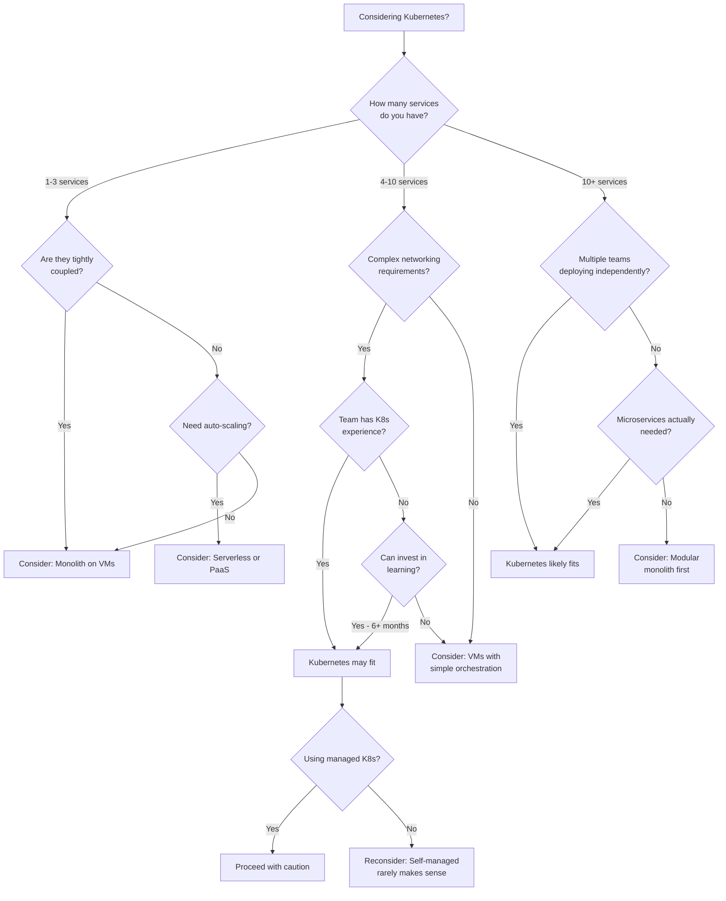
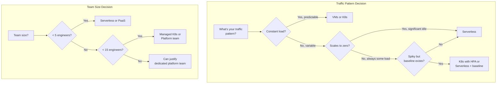
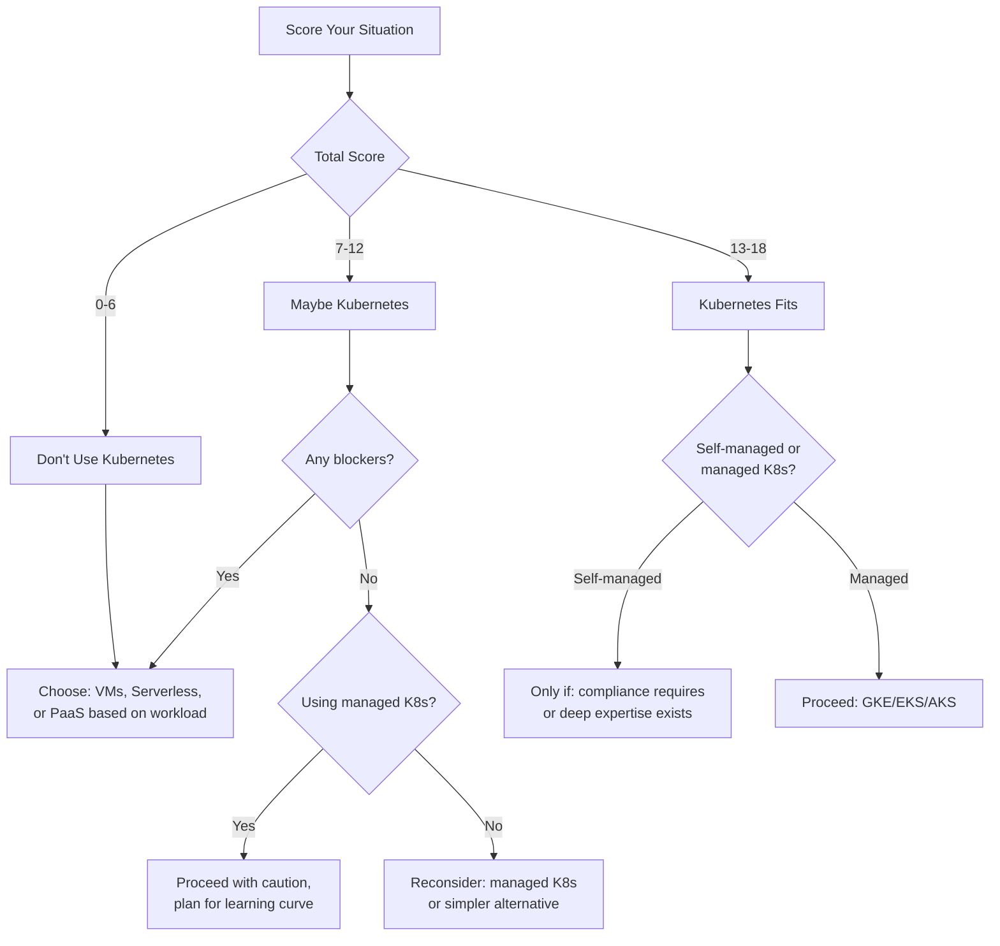

*[K8s]: Kubernetes
*[VM]: Virtual Machine
*[PaaS]: Platform as a Service
*[IaaS]: Infrastructure as a Service
*[FaaS]: Function as a Service
*[CI/CD]: Continuous Integration/Continuous Deployment
*[SLA]: Service Level Agreement
*[TCO]: Total Cost of Ownership
*[FTE]: Full-Time Equivalent
*[CNCF]: Cloud Native Computing Foundation

# When Not to Use Kubernetes: A Decision Framework

## Introduction

Frame the counter-intuitive premise: Kubernetes is a powerful platform, but it's not universally the right choice. The industry has a Kubernetes adoption problem—teams adopt it because it's "what everyone uses" rather than because it solves their specific problems. The result is organizations maintaining complex infrastructure for workloads that would run better on simpler alternatives. This section establishes that choosing infrastructure wisely means sometimes choosing not to use Kubernetes, and that this isn't a failure—it's engineering maturity.

_Include a scenario: a 5-person startup runs a single monolithic application on 3 VMs with a load balancer. They migrate to Kubernetes because "we need to scale" and "it's industry standard." Six months later, they have the same application running on Kubernetes, but now they're also maintaining a cluster, debugging networking issues, managing Helm charts, and spending 40% of engineering time on infrastructure instead of product. The lesson: Kubernetes solves specific problems, and if you don't have those problems, you're just buying complexity._

<Callout type="warning">
The goal of infrastructure is to run your workloads reliably and efficiently—not to use any particular technology. If your workloads run better on VMs, serverless, or managed services, choosing those over Kubernetes isn't settling for less. It's making the right engineering decision.
</Callout>

## The Kubernetes Complexity Tax

### What You're Signing Up For

```yaml title="kubernetes-complexity-inventory.yaml"
kubernetes_complexity_inventory:
  infrastructure_components:
    control_plane:
      - "API server (availability, scaling, security)"
      - "etcd cluster (backup, restore, capacity planning)"
      - "Controller manager"
      - "Scheduler"
      note: "Even managed K8s requires understanding these"

    node_infrastructure:
      - "Node provisioning and lifecycle"
      - "Container runtime (containerd, CRI-O)"
      - "kubelet configuration"
      - "Node networking (CNI plugin)"

    networking:
      - "Pod networking (overlay or native)"
      - "Service networking (ClusterIP, NodePort, LoadBalancer)"
      - "Ingress controllers"
      - "Network policies"
      - "DNS (CoreDNS)"
      - "Service mesh (optional but common)"

    storage:
      - "Storage classes"
      - "CSI drivers"
      - "PersistentVolume management"
      - "Backup and recovery"

  operational_overhead:
    day_to_day:
      - "Deployment debugging"
      - "Resource tuning (requests, limits)"
      - "Log aggregation"
      - "Metrics and alerting"
      - "Certificate management"

    periodic:
      - "Cluster upgrades (every 3-4 months)"
      - "Security patching"
      - "Capacity planning"
      - "Add-on updates"

    incident_response:
      - "Node failures"
      - "Network partitions"
      - "etcd issues"
      - "Resource exhaustion"
      - "Cascading failures"

  knowledge_requirements:
    must_understand:
      - "Container concepts"
      - "Kubernetes resource model"
      - "YAML manifests (lots of them)"
      - "Networking fundamentals"
      - "Linux systems"

    should_understand:
      - "Distributed systems"
      - "Cloud provider specifics"
      - "Security best practices"
      - "Observability patterns"
```
Code: Kubernetes complexity inventory.

### The Hidden Costs

```typescript title="tco-comparison.ts"
// Total Cost of Ownership comparison framework

interface InfrastructureCost {
  compute: number;           // Monthly cloud spend
  humanTime: {
    operations: number;      // Hours/month on ops
    debugging: number;       // Hours/month debugging infra
    upgrades: number;        // Hours/month on upgrades
    learning: number;        // Hours/month keeping skills current
  };
  opportunityCost: number;   // What else could engineers build?
  riskCost: number;          // Incident frequency × impact
}

function calculateKubernetesTCO(
  workloadCount: number,
  teamSize: number,
  hourlyEngineerCost: number
): InfrastructureCost {
  return {
    // Kubernetes clusters cost more to run
    compute: estimateClusterCost(workloadCount),

    humanTime: {
      // Ongoing operations: monitoring, tuning, responding
      operations: 20 + (workloadCount * 0.5), // hours/month

      // Debugging: "why won't this pod schedule?"
      debugging: 10 + (workloadCount * 0.3),

      // Upgrades: quarterly, takes focused time
      upgrades: 8, // averaged monthly

      // Learning: K8s changes fast
      learning: teamSize * 4, // hours/month per person
    },

    // What features didn't ship because of infra work?
    opportunityCost: calculateOpportunityCost(teamSize, hourlyEngineerCost),

    // Kubernetes incidents can cascade
    riskCost: estimateIncidentCost(workloadCount),
  };
}

function calculateSimpleVMTCO(
  workloadCount: number,
  teamSize: number,
  hourlyEngineerCost: number
): InfrastructureCost {
  return {
    // VMs are simpler, often cheaper for small scale
    compute: estimateVMCost(workloadCount),

    humanTime: {
      // Less to operate
      operations: 5 + (workloadCount * 0.2),

      // Debugging is usually simpler
      debugging: 3 + (workloadCount * 0.1),

      // OS updates, less complex than K8s upgrades
      upgrades: 4,

      // Less to learn
      learning: teamSize * 1,
    },

    opportunityCost: calculateOpportunityCost(teamSize * 0.3, hourlyEngineerCost),
    riskCost: estimateIncidentCost(workloadCount * 0.5),
  };
}

// Example comparison
const k8sCost = calculateKubernetesTCO(10, 5, 100);
const vmCost = calculateSimpleVMTCO(10, 5, 100);

console.log('Total human time per month:');
console.log(`  Kubernetes: ${Object.values(k8sCost.humanTime).reduce((a, b) => a + b)} hours`);
console.log(`  Simple VMs: ${Object.values(vmCost.humanTime).reduce((a, b) => a + b)} hours`);
```
Code: TCO comparison framework.

| Cost Category | Kubernetes | Simple VMs | Serverless |
|---------------|------------|------------|------------|
| Compute (10 services) | $2,000-5,000/mo | $500-1,500/mo | $100-2,000/mo* |
| Operations hours/mo | 30-50 | 10-20 | 5-15 |
| Learning curve | Steep (months) | Moderate (weeks) | Low (days) |
| Upgrade burden | High (quarterly) | Medium (monthly) | None |
| Incident complexity | High | Low | Varies |

*Serverless costs vary dramatically with traffic patterns

Table: Infrastructure approach cost comparison.

<Callout type="info">
The largest hidden cost is opportunity cost. Every hour spent debugging why pods won't schedule is an hour not spent building product features. For small teams, this trade-off often doesn't make sense.
</Callout>

## Decision Framework

### The Kubernetes Fit Assessment


Figure: Kubernetes fit decision tree.

### Workload Fit Criteria

```yaml title="workload-fit-assessment.yaml"
workload_fit_assessment:
  kubernetes_fits_well:
    multiple_services:
      description: "Many services that need independent deployment"
      threshold: "10+ services"
      why: "K8s overhead amortizes across many workloads"

    horizontal_scaling:
      description: "Workloads that scale by adding instances"
      examples:
        - "Stateless web services"
        - "API servers"
        - "Queue workers"
      why: "K8s excels at pod replication and load balancing"

    diverse_resource_needs:
      description: "Services with varying CPU/memory requirements"
      why: "K8s bin packing optimizes node utilization"

    complex_networking:
      description: "Service-to-service communication, traffic management"
      examples:
        - "Service mesh requirements"
        - "Complex routing rules"
        - "Network policy enforcement"

    multi_team_deployment:
      description: "Multiple teams deploying independently"
      why: "Namespace isolation, RBAC, resource quotas"

    cloud_portability:
      description: "Need to run across multiple clouds"
      caveat: "Less important than often claimed"

  kubernetes_fits_poorly:
    single_application:
      description: "One application, maybe with a database"
      better_choice: "VMs, PaaS (Heroku, Railway, Render)"
      why: "K8s overhead isn't justified"

    small_team:
      description: "Team of 1-5 engineers"
      better_choice: "Managed services, serverless"
      why: "Can't afford the operational overhead"

    stateful_workloads_primary:
      description: "Primarily databases, message queues, caches"
      better_choice: "Managed database services"
      why: "K8s stateful support is complex; managed services are better"

    batch_processing:
      description: "Periodic jobs, not long-running services"
      better_choice: "AWS Batch, Cloud Run Jobs, simple cron"
      why: "K8s is designed for long-running workloads"

    edge_or_embedded:
      description: "IoT devices, edge locations"
      better_choice: "K3s, specialized edge platforms"
      why: "Full K8s is too heavy"

    legacy_applications:
      description: "Applications not designed for containers"
      better_choice: "VMs"
      why: "Containerizing legacy apps is often painful"
```
Code: Workload fit assessment criteria.

### Team Capability Requirements

```typescript title="team-readiness-assessment.ts"
// Assess team readiness for Kubernetes

interface TeamCapability {
  skill: string;
  level: 'none' | 'basic' | 'intermediate' | 'advanced';
  criticalFor: 'day1' | 'day30' | 'day90';
}

const requiredCapabilities: TeamCapability[] = [
  // Day 1: Must have before starting
  { skill: 'Container fundamentals (Docker)', level: 'intermediate', criticalFor: 'day1' },
  { skill: 'Linux systems administration', level: 'intermediate', criticalFor: 'day1' },
  { skill: 'Networking basics (TCP/IP, DNS, load balancing)', level: 'intermediate', criticalFor: 'day1' },
  { skill: 'YAML proficiency', level: 'basic', criticalFor: 'day1' },
  { skill: 'Cloud provider familiarity', level: 'basic', criticalFor: 'day1' },

  // Day 30: Need within first month
  { skill: 'Kubernetes resource model (pods, deployments, services)', level: 'intermediate', criticalFor: 'day30' },
  { skill: 'kubectl proficiency', level: 'intermediate', criticalFor: 'day30' },
  { skill: 'Debugging pods (logs, exec, describe)', level: 'intermediate', criticalFor: 'day30' },
  { skill: 'Helm or Kustomize', level: 'basic', criticalFor: 'day30' },
  { skill: 'Resource requests and limits', level: 'basic', criticalFor: 'day30' },

  // Day 90: Need for sustainable operations
  { skill: 'Kubernetes networking (CNI, services, ingress)', level: 'intermediate', criticalFor: 'day90' },
  { skill: 'Storage (PV, PVC, storage classes)', level: 'intermediate', criticalFor: 'day90' },
  { skill: 'RBAC and security', level: 'intermediate', criticalFor: 'day90' },
  { skill: 'Cluster upgrades', level: 'intermediate', criticalFor: 'day90' },
  { skill: 'Monitoring and alerting', level: 'intermediate', criticalFor: 'day90' },
  { skill: 'Troubleshooting distributed systems', level: 'intermediate', criticalFor: 'day90' },
];

function assessTeamReadiness(
  teamSkills: Map<string, 'none' | 'basic' | 'intermediate' | 'advanced'>
): TeamReadinessReport {
  const gaps: string[] = [];
  const trainingNeeded: string[] = [];

  for (const req of requiredCapabilities) {
    const currentLevel = teamSkills.get(req.skill) || 'none';
    const levelOrder = ['none', 'basic', 'intermediate', 'advanced'];

    if (levelOrder.indexOf(currentLevel) < levelOrder.indexOf(req.level)) {
      if (req.criticalFor === 'day1') {
        gaps.push(`BLOCKER: ${req.skill} (need ${req.level}, have ${currentLevel})`);
      } else {
        trainingNeeded.push(`${req.skill}: ${currentLevel} → ${req.level} (by ${req.criticalFor})`);
      }
    }
  }

  return {
    ready: gaps.length === 0,
    blockers: gaps,
    trainingPlan: trainingNeeded,
    estimatedRampUp: calculateRampUpTime(gaps, trainingNeeded),
    recommendation: gaps.length > 3
      ? 'Consider simpler infrastructure until team skills develop'
      : gaps.length > 0
        ? 'Address blockers before Kubernetes adoption'
        : 'Team is ready for Kubernetes',
  };
}
```
Code: Team readiness assessment.

<Callout type="warning">
A team without Kubernetes experience will spend 3-6 months reaching operational competence. During that time, they're learning infrastructure instead of building product. For startups and small teams, this delay can be fatal.
</Callout>

## Better Alternatives by Use Case

### When VMs Win

```yaml title="vm-wins.yaml"
vm_advantages:
  simplicity:
    description: "One application, one server"
    examples:
      - "Marketing website"
      - "Internal tools"
      - "MVP/prototype"
    implementation: "Single VM behind load balancer"

  predictable_workloads:
    description: "Known traffic patterns, no scaling needed"
    examples:
      - "Internal dashboard (100 users)"
      - "Scheduled batch jobs"
      - "B2B SaaS with predictable usage"
    implementation: "Right-sized VMs, maybe an autoscaling group"

  legacy_applications:
    description: "Apps not designed for containers"
    examples:
      - "Monolithic Java application"
      - "Windows applications"
      - ".NET Framework apps"
    implementation: "VMs with configuration management"

  long_running_connections:
    description: "WebSockets, streaming, stateful sessions"
    challenge: "K8s pod restarts break connections"
    implementation: "VMs with sticky sessions"

modern_vm_options:
  aws:
    - name: "EC2 with Auto Scaling Groups"
      good_for: "Predictable scaling patterns"
    - name: "Lightsail"
      good_for: "Simple applications, predictable pricing"

  gcp:
    - name: "Compute Engine with MIGs"
      good_for: "Auto-healing and scaling"
    - name: "App Engine Flex"
      good_for: "Container-like without K8s complexity"

  azure:
    - name: "VM Scale Sets"
      good_for: "Windows workloads"
    - name: "App Service"
      good_for: "Web apps with managed infrastructure"

deployment_tooling:
  configuration_management:
    - "Ansible (push-based, simple)"
    - "Chef/Puppet (pull-based, more complex)"
  immutable_deployments:
    - "Packer for VM images"
    - "AMI/image-based deployments"
  orchestration:
    - "HashiCorp Nomad (simpler than K8s)"
    - "Docker Swarm (if you need containers)"
```
Code: When VMs are the better choice.

### When Serverless Wins

```yaml title="serverless-wins.yaml"
serverless_advantages:
  variable_traffic:
    description: "Traffic varies dramatically"
    examples:
      - "E-commerce (holiday spikes)"
      - "Media (viral content)"
      - "Gaming (launch day)"
    why: "Pay only for what you use, scale to zero"

  event_driven:
    description: "React to events, not constant load"
    examples:
      - "File processing triggers"
      - "Webhook handlers"
      - "Queue consumers"
    why: "Natural fit for FaaS model"

  small_team:
    description: "Can't afford ops overhead"
    examples:
      - "Startup (< 5 engineers)"
      - "Side project"
      - "Internal tools"
    why: "Zero infrastructure management"

  api_backends:
    description: "Request-response workloads"
    examples:
      - "REST APIs"
      - "GraphQL servers"
      - "Mobile backends"
    why: "Automatic scaling, no capacity planning"

serverless_options:
  functions:
    - name: "AWS Lambda"
      limits: "15 min timeout, 10GB memory"
      good_for: "Short tasks, event processing"

    - name: "Google Cloud Functions"
      limits: "9 min timeout (HTTP), 540 min (events)"
      good_for: "GCP ecosystem integration"

    - name: "Azure Functions"
      limits: "Configurable timeout"
      good_for: "Enterprise, .NET workloads"

  containers:
    - name: "AWS Fargate"
      description: "Container without cluster management"
      good_for: "Long-running containers, ECS familiarity"

    - name: "Google Cloud Run"
      description: "Container with serverless scaling"
      good_for: "Containers that scale to zero"

    - name: "Azure Container Instances"
      description: "Single container deployment"
      good_for: "Simple container workloads"

serverless_limitations:
  cold_starts:
    impact: "100ms-2s latency on first request"
    mitigation: "Provisioned concurrency, keep-warm"

  execution_limits:
    impact: "Can't run long processes"
    mitigation: "Break into smaller functions, use Step Functions"

  vendor_lock_in:
    impact: "Tied to provider's APIs"
    mitigation: "Abstract provider-specific code"

  debugging:
    impact: "Harder to reproduce issues locally"
    mitigation: "Good observability, local emulators"
```
Code: When serverless is the better choice.


Figure: Decision factors for infrastructure choice.

### When PaaS Wins

```yaml title="paas-wins.yaml"
paas_advantages:
  time_to_market:
    description: "Need to ship fast"
    why: "Deploy in minutes, not days"
    trade_off: "Less control, potentially higher cost at scale"

  developer_experience:
    description: "Developers focus on code, not infra"
    why: "git push to deploy"
    trade_off: "Less flexibility, vendor patterns"

  managed_everything:
    description: "Don't want to manage anything"
    includes:
      - "Automatic SSL"
      - "Managed databases"
      - "Built-in CI/CD"
      - "Preview environments"

paas_options:
  general_purpose:
    - name: "Heroku"
      pricing: "$7-250+/dyno/month"
      good_for: "Startups, rapid prototyping"
      limits: "Can get expensive at scale"

    - name: "Railway"
      pricing: "Usage-based, ~$5+/service/month"
      good_for: "Modern apps, good DX"
      limits: "Newer, smaller ecosystem"

    - name: "Render"
      pricing: "$7-85+/service/month"
      good_for: "Heroku alternative, better pricing"
      limits: "Less mature than Heroku"

    - name: "Fly.io"
      pricing: "Usage-based"
      good_for: "Edge deployment, global distribution"
      limits: "More DIY than traditional PaaS"

  frontend_focused:
    - name: "Vercel"
      pricing: "Free tier, $20+/member/month"
      good_for: "Next.js, frontend frameworks"
      limits: "Backend is serverless functions"

    - name: "Netlify"
      pricing: "Free tier, $19+/member/month"
      good_for: "Static sites, JAMstack"
      limits: "Similar to Vercel"

paas_graduation_signals:
  consider_moving_when:
    - "Monthly bill exceeds $5k-10k"
    - "Need more control over infrastructure"
    - "Performance requirements exceed PaaS limits"
    - "Compliance requires specific configurations"
    - "Team has grown and can afford ops overhead"

  dont_move_just_because:
    - "It's not 'real' infrastructure"
    - "Everyone else uses Kubernetes"
    - "You might need to scale someday"
    - "You want to learn K8s"
```
Code: When PaaS is the better choice.

<Callout type="success">
Many successful companies run on PaaS well past their startup phase. If your PaaS bill is $5,000/month and your engineering team's time is worth $50,000/month, spending 20% of engineering time on Kubernetes operations to save $3,000 is a bad trade.
</Callout>

## Migration Considerations

### If You're Already on Kubernetes

```yaml title="kubernetes-exit-strategy.yaml"
already_on_kubernetes:
  when_to_consider_leaving:
    operational_burden:
      signal: "> 20% engineering time on cluster operations"
      question: "Is this justified by our workload complexity?"

    team_capability_gap:
      signal: "Constant firefighting, no one understands the cluster"
      question: "Can we invest in training, or is this the wrong tool?"

    cost_inefficiency:
      signal: "Low cluster utilization, high per-workload cost"
      question: "Would simpler infrastructure be cheaper?"

    feature_velocity:
      signal: "Shipping slower than before K8s adoption"
      question: "Is infrastructure helping or hurting?"

  migration_strategy:
    phase_1_assessment:
      - "Inventory all workloads"
      - "Categorize by fit (K8s-appropriate vs. not)"
      - "Calculate current cost (compute + human time)"
      - "Estimate cost on alternatives"

    phase_2_pilot:
      - "Select one non-critical workload"
      - "Migrate to simpler infrastructure"
      - "Measure operational burden change"
      - "Validate cost savings"

    phase_3_staged_migration:
      - "Migrate workloads by category"
      - "Start with poor K8s fit workloads"
      - "Keep good K8s fit workloads if justified"
      - "Consider managed K8s for remaining workloads"

    phase_4_evaluation:
      - "Compare before/after metrics"
      - "Engineering time on ops"
      - "Deployment frequency"
      - "Incident rate and severity"
      - "Total cost"

  workload_migration_order:
    migrate_first:
      - "Batch jobs → Managed batch services"
      - "Databases → Managed databases"
      - "Simple web apps → PaaS or VMs"
      - "Cron jobs → Scheduled functions"

    migrate_last_or_keep:
      - "Multi-replica stateless services"
      - "Complex service mesh requirements"
      - "Multi-tenant platforms"
```
Code: Kubernetes exit strategy.

### The Hybrid Approach

```typescript title="hybrid-infrastructure.ts"
// Hybrid infrastructure: Right tool for each job

interface WorkloadPlacement {
  workload: string;
  platform: 'kubernetes' | 'serverless' | 'vm' | 'paas' | 'managed-service';
  reasoning: string;
}

const hybridArchitecture: WorkloadPlacement[] = [
  // Managed services for stateful workloads
  {
    workload: 'PostgreSQL database',
    platform: 'managed-service',
    reasoning: 'RDS/Cloud SQL handles backups, replication, upgrades',
  },
  {
    workload: 'Redis cache',
    platform: 'managed-service',
    reasoning: 'ElastiCache/Memorystore, no operational burden',
  },
  {
    workload: 'Kafka/message queue',
    platform: 'managed-service',
    reasoning: 'MSK/Confluent Cloud, complex to self-manage',
  },

  // Serverless for event-driven and variable workloads
  {
    workload: 'Image processing',
    platform: 'serverless',
    reasoning: 'Bursty, scales to zero, Lambda/Cloud Functions',
  },
  {
    workload: 'Webhook handlers',
    platform: 'serverless',
    reasoning: 'Event-driven, low baseline traffic',
  },
  {
    workload: 'Scheduled reports',
    platform: 'serverless',
    reasoning: 'Runs periodically, no need for always-on',
  },

  // Kubernetes for complex stateless services
  {
    workload: 'API gateway',
    platform: 'kubernetes',
    reasoning: 'High traffic, complex routing, service mesh',
  },
  {
    workload: 'Microservices backend',
    platform: 'kubernetes',
    reasoning: 'Multiple services, independent scaling, complex networking',
  },

  // VMs or PaaS for simple workloads
  {
    workload: 'Admin dashboard',
    platform: 'paas',
    reasoning: 'Internal tool, low traffic, simple deployment',
  },
  {
    workload: 'Marketing website',
    platform: 'paas',
    reasoning: 'Static/JAMstack, Vercel/Netlify',
  },
];

// The key insight: match platform to workload characteristics
function recommendPlatform(workload: WorkloadCharacteristics): string {
  if (workload.stateful && workload.requiresHighAvailability) {
    return 'managed-service';
  }
  if (workload.eventDriven || workload.scalesToZero) {
    return 'serverless';
  }
  if (workload.multipleServices && workload.complexNetworking) {
    return 'kubernetes';
  }
  if (workload.simple && workload.lowTraffic) {
    return 'paas';
  }
  return 'vm'; // Default fallback
}
```
Code: Hybrid infrastructure approach.

<Callout type="info">
Most organizations that use Kubernetes well don't use it for everything. They run databases on managed services, batch jobs on serverless, simple tools on PaaS, and reserve Kubernetes for workloads that actually benefit from it.
</Callout>

## Making the Decision

### Decision Scorecard

```yaml title="decision-scorecard.yaml"
kubernetes_decision_scorecard:
  # Score each factor 0-3, sum them up

  workload_factors:
    service_count:
      question: "How many independently deployed services?"
      scoring:
        "1-3 services": 0
        "4-10 services": 1
        "10-20 services": 2
        "20+ services": 3

    scaling_requirements:
      question: "How do your workloads scale?"
      scoring:
        "Fixed capacity": 0
        "Occasional scaling": 1
        "Regular scaling": 2
        "Complex auto-scaling": 3

    networking_complexity:
      question: "How complex is service-to-service communication?"
      scoring:
        "Single service": 0
        "Simple service calls": 1
        "Complex routing": 2
        "Service mesh needed": 3

  team_factors:
    team_size:
      question: "Engineering team size?"
      scoring:
        "1-5 people": 0
        "5-15 people": 1
        "15-50 people": 2
        "50+ people": 3

    kubernetes_experience:
      question: "Team Kubernetes experience?"
      scoring:
        "None": 0
        "Basic (tutorials)": 1
        "Production experience": 2
        "Deep expertise": 3

    operations_capacity:
      question: "Can you dedicate ops resources?"
      scoring:
        "No dedicated ops": 0
        "Part-time ops": 1
        "Dedicated ops person": 2
        "Platform team": 3

  interpretation:
    "0-6": "Kubernetes is likely overkill. Consider VMs, serverless, or PaaS."
    "7-12": "Kubernetes might fit if using managed K8s and investing in training."
    "13-18": "Kubernetes is a reasonable choice. Use managed K8s."

  critical_blockers:
    - "Team size < 5 with no K8s experience"
    - "Single application workload"
    - "No budget for learning/mistakes"
    - "< 6 months runway"
```
Code: Kubernetes decision scorecard.


Figure: Decision scorecard interpretation.

## Conclusion

Summarize the key points: Kubernetes is a powerful platform for the right use cases—many services, complex networking, multi-team deployments, horizontal scaling requirements. But it comes with significant complexity and operational burden that isn't justified for every workload. The best infrastructure decision considers workload characteristics, team capabilities, and total cost of ownership—not industry trends or resume-driven development. Emphasize that choosing simpler infrastructure when appropriate isn't settling; it's making the engineering decision that lets you focus on your actual product.

<Callout type="warning">
The question isn't "Should we use Kubernetes?" It's "What infrastructure best serves our workloads, team, and business?" Sometimes that's Kubernetes. Often, especially for smaller organizations, it's something simpler. The best engineers choose the right tool, not the most powerful one.
</Callout>

---

## Cover Prompt

### Prompt 1: The Complexity Scale

Create an image of a scale weighing Kubernetes (represented as a complex gear mechanism) against simpler alternatives (a single clean gear). The Kubernetes side is heavy with add-ons, YAML files, and complexity. The simpler side is lighter but still functional. A thoughtful engineer considers which side to choose. Style: balance scale, complexity visualization, thoughtful decision, 16:9 aspect ratio.

### Prompt 2: The Tool Shed

Design an image of a tool shed where a developer chooses between tools. A massive industrial machine labeled "Kubernetes" sits next to simpler tools: a hammer (VMs), a screwdriver (PaaS), and a multi-tool (Serverless). The task at hand is a simple nail—the industrial machine is overkill. Style: tool selection, right-sizing decisions, practical choice, 16:9 aspect ratio.

### Prompt 3: The Fork in the Road

Illustrate a fork in a road where a team decides between two paths. One path leads to Kubernetes (complex, winding, requires equipment). The other path leads directly to "Product" (simpler, shorter). Signs show "Complexity Ahead" vs "Ship Faster." Some teams need the complex path; others don't. Style: decision crossroads, path comparison, journey metaphor, 16:9 aspect ratio.

### Prompt 4: The Iceberg

Create an image of the Kubernetes iceberg. Above water: "Container Orchestration." Below water (much larger): networking, storage, security, upgrades, monitoring, debugging, YAML, team training, incident response. A small boat (small team) considers whether to navigate around or through. Style: iceberg metaphor, hidden complexity, awareness, 16:9 aspect ratio.

### Prompt 5: The Fitness Test

Design an image of a "Kubernetes Fitness Test" where workloads are evaluated. Some workloads pass easily (many services, scaling needs). Others fail the test (single app, small team, stateful). A coach points some workloads to the Kubernetes track and others to simpler alternatives. Style: fitness evaluation, workload assessment, appropriate placement, 16:9 aspect ratio.
