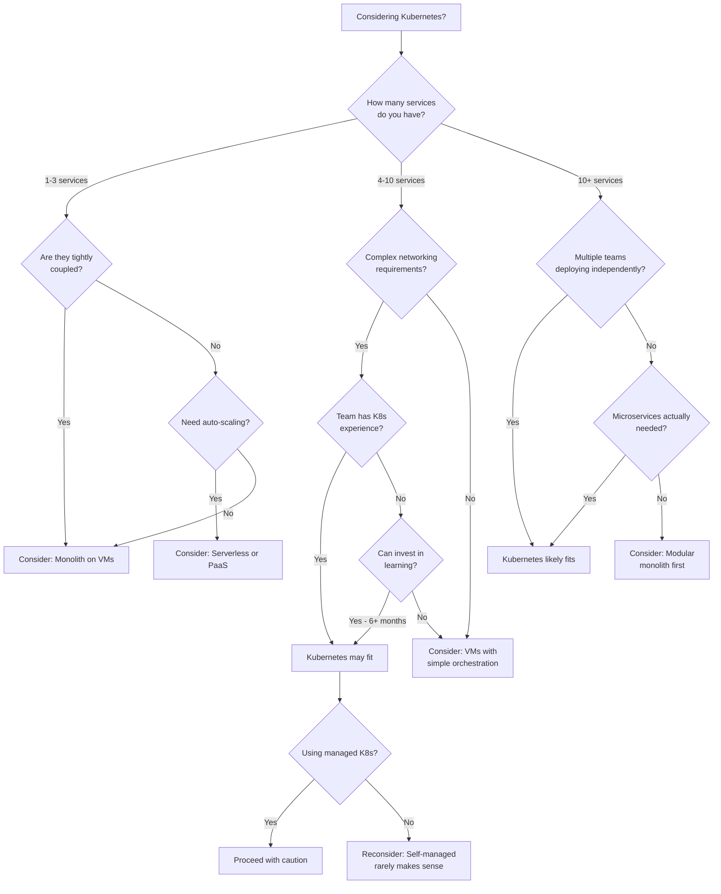
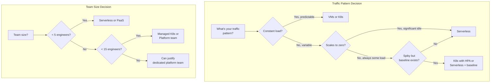

*[K8s]: Kubernetes
*[VM]: Virtual Machine
*[PaaS]: Platform as a Service
*[IaaS]: Infrastructure as a Service
*[FaaS]: Function as a Service
*[CI/CD]: Continuous Integration/Continuous Deployment
*[SLA]: Service Level Agreement
*[TCO]: Total Cost of Ownership
*[FTE]: Full-Time Equivalent

## Introduction

I'm going to make an argument that might feel counterintuitive: Kubernetes is often the wrong choice. Not because it's bad technology, but because it solves specific problems that many organizations don't actually have. The industry has a Kubernetes adoption problem. Teams adopt it because it's "what everyone uses" rather than because it solves their specific problems. The result is organizations maintaining complex infrastructure for workloads that would run better on simpler alternatives.

Here's a scenario I've seen play out multiple times. A five-person startup runs a single monolithic application on three VMs with a load balancer. Everything works. Deployments are simple. The team ships features. Then someone decides they need to migrate to Kubernetes because "we need to scale" and "it's industry standard."

Six months later, after weeks of migration work, they have the same application running on Kubernetes. But now they're also maintaining a cluster, debugging CNI networking issues, managing Helm charts, configuring ingress controllers, and spending 40% of engineering time on infrastructure instead of product. They just bought complexity without gaining capability.

Kubernetes solves specific problems: multi-service orchestration, complex networking, multi-team deployment isolation, sophisticated scaling requirements. If you don't have those problems, you're paying the Kubernetes tax without getting the benefits.

<Callout type="warning">
The goal of infrastructure is to run your workloads reliably and efficiently, not to use any particular technology. If your workloads run better on VMs, serverless, or managed services, choosing those over Kubernetes isn't settling for less. It's making the right engineering decision.
</Callout>

## The Kubernetes Complexity Tax

### What You're Signing Up For

When you adopt Kubernetes, you're not just getting container orchestration. You're signing up for an entire ecosystem of components, each with its own failure modes and operational requirements.

Even with managed Kubernetes (EKS, GKE, AKS), you still need to understand the control plane: how the API server handles requests, how etcd stores state, how the scheduler places pods. "Managed" means the cloud provider handles upgrades and availability, not that you can ignore how it works. When something breaks, you need to understand the system to debug it.

Then there's node infrastructure. You're responsible for node provisioning and lifecycle, container runtime configuration, kubelet settings, and CNI plugin behavior. Networking alone includes pod networking (overlay or native), service networking (ClusterIP, NodePort, LoadBalancer), ingress controllers, network policies, CoreDNS, and often a service mesh. Storage adds storage classes, CSI drivers, PersistentVolume management, and backup strategies.

The operational overhead is continuous. Day-to-day, you're debugging deployments, tuning resource requests and limits, aggregating logs, managing metrics and alerts, and rotating certificates. Periodically, you're doing cluster upgrades every three to four months, applying security patches, capacity planning, and updating add-ons. When incidents happen, you're dealing with node failures, network partitions, etcd issues, resource exhaustion, and cascading failures that can be genuinely difficult to diagnose.

Your team needs to understand container concepts, the Kubernetes resource model, YAML manifests (lots of them), networking fundamentals, and Linux systems. Beyond that, they should understand distributed systems principles, cloud provider specifics, security best practices, and observability patterns. This isn't optional knowledge. It's table stakes for operating Kubernetes in production.

### The Hidden Costs

The compute costs are only part of the picture. Human time is where Kubernetes really costs you.

For a team of five running ten services on Kubernetes, expect 20-30 hours per month on ongoing operations: monitoring, tuning, responding to alerts. Add another 10-15 hours debugging infrastructure issues ("why won't this pod schedule?"). Cluster upgrades, averaged monthly, consume around 8 hours. And keeping skills current in an ecosystem that changes as fast as Kubernetes costs each engineer 4+ hours per month. That's 50-70+ hours of engineering time per month spent on infrastructure, not product.

Compare that to the same workloads on VMs. Operations drops to 5-10 hours monthly. Debugging is simpler because there's less abstraction. OS updates are less complex than Kubernetes upgrades. The learning burden is dramatically lower. You might spend 15-25 hours per month total.

| Cost Category | Kubernetes | Simple VMs | Serverless |
|---------------|------------|------------|------------|
| Compute (10 services) | $2,000-5,000/mo | $500-1,500/mo | $100-2,000/mo* |
| Operations hours/mo | 30-50 | 10-20 | 5-15 |
| Learning curve | Steep (months) | Moderate (weeks) | Low (days) |
| Upgrade burden | High (quarterly) | Medium (monthly) | None |
| Incident complexity | High | Low | Varies |

Table: Infrastructure approach cost comparison. Serverless costs vary dramatically with traffic patterns.

<Callout type="info">
The largest hidden cost is opportunity cost. Every hour spent debugging why pods won't schedule is an hour not spent building product features. For small teams, this trade-off often doesn't make sense.
</Callout>

## Decision Framework

### The Kubernetes Fit Assessment

The first question isn't "Should we use Kubernetes?" It's "What problems are we trying to solve?" Kubernetes fits well when you have genuine complexity that justifies the operational overhead. It fits poorly when you're adding complexity to solve problems you don't actually have.

Figure: Kubernetes fit decision tree.

The service count matters because Kubernetes overhead amortizes across workloads. Running one service on Kubernetes means you're paying the full complexity tax for a single application. Running fifty services means the overhead is spread thin.

### Workload Fit Criteria

Kubernetes fits well when your workloads have these characteristics:

_Multiple services needing independent deployment_. When you have 10+ services that deploy on different schedules, Kubernetes' deployment model shines. Teams can push changes without coordinating, and the orchestration layer handles the complexity.

_Horizontal scaling requirements_. Stateless web services, API servers, and queue workers that scale by adding instances are Kubernetes' sweet spot. Pod replication, load balancing, and the Horizontal Pod Autoscaler handle this elegantly.

_Diverse resource needs_. When services have varying CPU and memory requirements, Kubernetes bin packing optimizes node utilization. You're not paying for dedicated VMs sized for peak load.

_Complex networking_. Service mesh requirements, sophisticated routing rules, and network policy enforcement become more manageable with Kubernetes' networking primitives.

_Multi-team deployment_. Namespace isolation, RBAC, and resource quotas let multiple teams deploy independently without stepping on each other.

Kubernetes fits _poorly_ in these situations:

_Single application_. If you have one application, maybe with a database, Kubernetes overhead isn't justified. VMs or PaaS platforms like Heroku, Railway, or Render will serve you better.

_Small team_. A team of one to five engineers can't afford the operational overhead. The learning curve alone will consume months of productivity.

_Primarily stateful workloads_. If you're mostly running databases, message queues, and caches, use managed services. Kubernetes' stateful support works, but it's complex. RDS, Cloud SQL, ElastiCache, and similar services are operationally simpler.

_Batch processing_. Periodic jobs that aren't long-running services fit better on AWS Batch, Cloud Run Jobs, or simple cron. Kubernetes is optimized for always-on workloads.

_Legacy applications_. Applications not designed for containers are painful to containerize. If it runs fine on VMs, keep it on VMs.

### Team Capability Requirements

Kubernetes requires specific skills across a timeline:

_Day one prerequisites_ (must have before starting):

- Intermediate: container fundamentals, Linux systems administration, networking basics (TCP/IP, DNS, load balancing)
- Basic: YAML proficiency, cloud provider familiarity

_Day thirty_ (need within first month):

- Intermediate: Kubernetes resource model (pods, deployments, services), kubectl, pod debugging (logs, exec, describe)
- Basic: Helm or Kustomize, resource requests/limits

_Day ninety_ (for sustainable operations):

- Intermediate: Kubernetes networking (CNI, services, ingress), storage (PV, PVC, storage classes), RBAC and security, cluster upgrades, monitoring and alerting, troubleshooting distributed systems

If your team has more than three skill gaps in the day-one requirements, consider simpler infrastructure until those skills develop. Even with a solid foundation, expect three to six months to reach operational competence.

<Callout type="warning">
A team without Kubernetes experience will spend 3-6 months reaching operational competence. During that time, they're learning infrastructure instead of building product. For startups and small teams, this delay can be fatal.
</Callout>

## Better Alternatives by Use Case

If Kubernetes isn't the right choice, what is? The answer depends on your workload characteristics, team size, and operational appetite. The good news is that the alternatives have matured significantly. VMs aren't the "old way" anymore—they're a legitimate choice with modern tooling. Serverless has moved past the hype cycle into genuine production use. And PaaS platforms have evolved from "toy infrastructure" into platforms that run real businesses at scale.

### When VMs Win

VMs aren't outdated technology. For many workloads, they're the right choice.

_Simplicity wins_. If you have one application on one server, a VM behind a load balancer is dramatically simpler than Kubernetes. Marketing websites, internal tools, and MVPs don't need container orchestration. They need to work.

_Predictable workloads_. When traffic patterns are known and scaling isn't needed, right-sized VMs (maybe with an autoscaling group for redundancy) are easier to operate. Internal dashboards serving 100 users, scheduled batch jobs, and B2B SaaS with predictable usage patterns all fit this model.

_Legacy applications_. Apps not designed for containers, monolithic Java applications, Windows applications, and .NET Framework workloads often run better on VMs. Containerizing them is painful and rarely worth it.

_Long-running connections_. WebSockets, streaming, and stateful sessions suffer when pods restart. VMs with sticky sessions handle these workloads more gracefully.

_Modern cloud options_. VM platforms are better than you might remember. AWS offers EC2 with Auto Scaling Groups for predictable scaling, and Lightsail for simple applications with predictable pricing. GCP has Compute Engine with Managed Instance Groups for auto-healing, and App Engine Flex for container-like deployment without Kubernetes complexity. Azure provides VM Scale Sets for Windows workloads and App Service for managed web apps.

_Deployment tooling_. Ansible handles configuration management with a simple push-based model. Packer builds immutable VM images for AMI-based deployments. And if you want container benefits without Kubernetes complexity, HashiCorp Nomad provides workload orchestration (containers, VMs, and standalone executables) with a simpler operational model—fewer moving parts, easier upgrades, and a gentler learning curve. Docker Swarm offers basic container orchestration built into Docker itself, making it a natural fit for smaller deployments where you already use Docker but don't need Kubernetes' full feature set.

### When Serverless Wins

Serverless shines when your traffic is unpredictable or your team is small.

_Variable traffic_. E-commerce sites with holiday spikes, media platforms with viral content, and games on launch day all benefit from paying only for what you use. Scaling to zero during quiet periods can cut costs dramatically compared to always-on infrastructure.

_Event-driven workloads_. File processing triggers, webhook handlers, and queue consumers are natural fits for FaaS. You're reacting to events, not maintaining constant capacity.

_Small teams_. If you have fewer than five engineers, you probably can't afford Kubernetes operational overhead. Serverless gives you zero infrastructure management so you can focus on product.

_API backends_. REST APIs, GraphQL servers, and mobile backends with request-response patterns get automatic scaling and no capacity planning.

For functions, AWS Lambda offers 15-minute timeouts and up to 10GB memory, good for short tasks and event processing. Google Cloud Functions integrates well with the GCP ecosystem. Azure Functions has configurable timeouts and strong .NET support.

For containerized workloads that don't fit the function model, AWS Fargate runs containers without cluster management. Google Cloud Run provides container deployment with serverless scaling, including scale-to-zero. Azure Container Instances handles simple container workloads.

The limitations are real. Cold starts add 100ms-2s latency on first requests; provisioned concurrency helps but adds cost. Execution limits prevent long-running processes, so you'll need to break work into smaller functions or use orchestration like Step Functions. Debugging is harder to reproduce locally. But for the right workloads, these tradeoffs are worth it.

Two factors dominate the infrastructure decision: traffic patterns and team size. This diagram captures the core logic.

Figure: Decision factors for infrastructure choice.

### When PaaS Wins

PaaS platforms trade control for speed. When time-to-market matters more than infrastructure flexibility, that's a good trade.

_Speed to deploy_. Git push to deploy. Automatic SSL. Preview environments. You're shipping in minutes, not days. The tradeoff is less control and potentially higher cost at scale, but for many organizations, engineering velocity is worth more than infrastructure savings.

_Developer experience_. When developers focus on code instead of infrastructure, they ship faster. PaaS platforms handle the undifferentiated heavy lifting.

_Managed everything_. If you don't want to manage databases, CI/CD, SSL certificates, or preview environments, PaaS platforms bundle it all.

The general-purpose options have matured significantly. Heroku ($7-250+/dyno/month) remains solid for startups and rapid prototyping, though it gets expensive at scale. Railway (usage-based, ~$5+/service/month) offers good developer experience for modern apps. Render ($7-85+/service/month) provides a cost-effective Heroku alternative. Fly.io (usage-based) excels at edge deployment and global distribution, though it's more DIY than traditional PaaS.

For frontend-focused workloads, Vercel and Netlify both offer free tiers and excel at static sites, JAMstack[^jamstack], and framework-specific deployments (Vercel for Next.js, Netlify for general JAMstack). Backend support is serverless functions, which works well for many use cases.

[^jamstack]: JAMstack (JavaScript, APIs, Markup) is an architecture where sites are pre-rendered at build time and served from a CDN, with dynamic functionality handled by JavaScript calling APIs. It trades server-side rendering complexity for simpler deployment and better performance.

When should you consider leaving PaaS? When your monthly bill exceeds $5k-10k, when you need more infrastructure control, when performance requirements exceed PaaS limits, or when compliance requires specific configurations. When _shouldn't_ you leave? Because "it's not real infrastructure," because everyone else uses Kubernetes, because you might need to scale someday, or because you want to learn Kubernetes. Those are bad reasons.

<Callout type="success">
Many successful companies run on PaaS well past their startup phase. If your PaaS bill is $5,000/month and your engineering team's time is worth $50,000/month, spending 20% of engineering time on Kubernetes operations to save $3,000 is a bad trade.
</Callout>

## Migration Considerations

### If You're Already on Kubernetes

Maybe you adopted Kubernetes and it's not working out. That's not a failure—it's information. Here are the signals that suggest reconsidering:

_Operational burden exceeds value_. If more than 20% of engineering time goes to cluster operations, ask whether that's justified by your workload complexity. For a team of five running three services, that's almost certainly too much.

_Constant firefighting_. When no one on the team really understands the cluster and incidents feel like whack-a-mole, you're paying the Kubernetes tax without building the skills to get the benefits. You can invest in training, but be honest about whether that's the right allocation of resources.

_Cost inefficiency_. Low cluster utilization and high per-workload costs suggest your workloads don't benefit from Kubernetes' bin-packing advantages. Would simpler infrastructure be cheaper?

_Feature velocity has dropped_. If you're shipping slower than before Kubernetes adoption—measured by deployment frequency, lead time for changes, or simply features shipped per sprint—infrastructure is hurting instead of helping. That's the opposite of what it should do.

If you decide to migrate away, do it in phases. Start with assessment: inventory all workloads, categorize them by Kubernetes fit, calculate current costs (compute plus human time), and estimate costs on alternatives. Then pilot with one non-critical workload—migrate it to simpler infrastructure, measure the operational burden change, and validate cost savings before committing to more.

For staged migration, start with workloads that fit Kubernetes poorly: batch jobs move to managed batch services, databases to managed database services, simple web apps to PaaS or VMs, and cron jobs to scheduled functions. Keep the workloads that actually benefit from Kubernetes: multi-replica stateless services, complex service mesh requirements, and multi-tenant platforms. Consider moving remaining workloads to managed Kubernetes if self-managed operations are the pain point.

### The Hybrid Approach

The most pragmatic organizations don't commit to one platform for everything. They match platforms to workload characteristics.

_Managed services for stateful workloads_. PostgreSQL on RDS or Cloud SQL handles backups, replication, and upgrades. Redis on ElastiCache or Memorystore eliminates operational burden. Kafka on MSK or Confluent Cloud avoids the complexity of self-managing message queues. These services exist because running stateful workloads well is genuinely hard.

_Serverless for event-driven and variable workloads_. Image processing that's bursty and scales to zero fits Lambda or Cloud Functions. Webhook handlers with event-driven, low-baseline traffic are natural serverless workloads. Scheduled reports that run periodically don't need always-on infrastructure.

_Kubernetes for complex stateless services_. API gateways with high traffic, complex routing, and service mesh requirements benefit from Kubernetes. Microservices backends with multiple services needing independent scaling and complex networking are the use case Kubernetes was designed for.

_PaaS for simple workloads_. Admin dashboards (internal tools with low traffic) deploy trivially on Heroku or Railway. Marketing websites on Vercel or Netlify get CDN distribution, automatic SSL, and preview environments without any infrastructure management.

<Callout type="info">
Most organizations that use Kubernetes well don't use it for everything. They run databases on managed services, batch jobs on serverless, simple tools on PaaS, and reserve Kubernetes for workloads that actually benefit from it.
</Callout>

## Making the Decision

### Decision Scorecard

Here's a simple scoring framework to help clarify whether Kubernetes makes sense for your situation. Score each factor from 0-3, then sum them up.

| Factor | 0 | 1 | 2 | 3 |
|--------|---|---|---|---|
| Service count | 1-3 services | 4-10 services | 10-20 services | 20+ services |
| Scaling requirements | Fixed capacity | Occasional scaling | Regular scaling | Complex auto-scaling |
| Networking complexity | Single service | Simple service calls | Complex routing | Service mesh needed |
| Team size | 1-5 people | 5-15 people | 15-50 people | 50+ people |
| K8s experience | None | Basic (tutorials) | Production experience | Deep expertise |
| Operations capacity | No dedicated ops | Part-time ops | Dedicated ops person | Platform team |

Table: Kubernetes decision scorecard. Score each factor 0-3, then sum for total.

_Interpretation_: **0-6** means Kubernetes is likely overkill—consider VMs, serverless, or PaaS. **7-12** means Kubernetes might fit if you're using managed K8s and investing in training. **13-18** means Kubernetes is a reasonable choice; use managed K8s.

Some factors are critical blockers regardless of score: team size under 5 with no Kubernetes experience, single application workload, no budget for learning and mistakes, or less than 6 months of runway. If any of these apply, simpler infrastructure is almost certainly the right choice.

## Conclusion

Kubernetes is a powerful platform for the right use cases: many services that need independent deployment, complex networking requirements, multi-team deployments with isolation needs, and horizontal scaling that benefits from orchestration. When you have these problems, Kubernetes' complexity is justified by the problems it solves.

But it comes with significant operational burden that isn't justified for every workload. The complexity tax is real: ongoing operations, cluster upgrades, debugging distributed systems, and keeping skills current. For small teams, single applications, or workloads that don't need orchestration, simpler infrastructure isn't settling—it's the right engineering decision.

The best infrastructure choice considers workload characteristics, team capabilities, and total cost of ownership. Not industry trends. Not what "everyone else" is using. The question isn't "Should we use Kubernetes?" It's "What infrastructure best serves our workloads, team, and business?"

Sometimes that's Kubernetes. Often, especially for smaller organizations, it's something simpler. VMs with modern tooling. Serverless for variable workloads. PaaS for fast deployment. Managed services for stateful workloads. The best engineers choose the right tool, not the most powerful one.

<Callout type="warning">
If you're evaluating Kubernetes, start with the scorecard. If you score below 7, save yourself months of complexity and pick a simpler path. Your future self will thank you.
</Callout>
