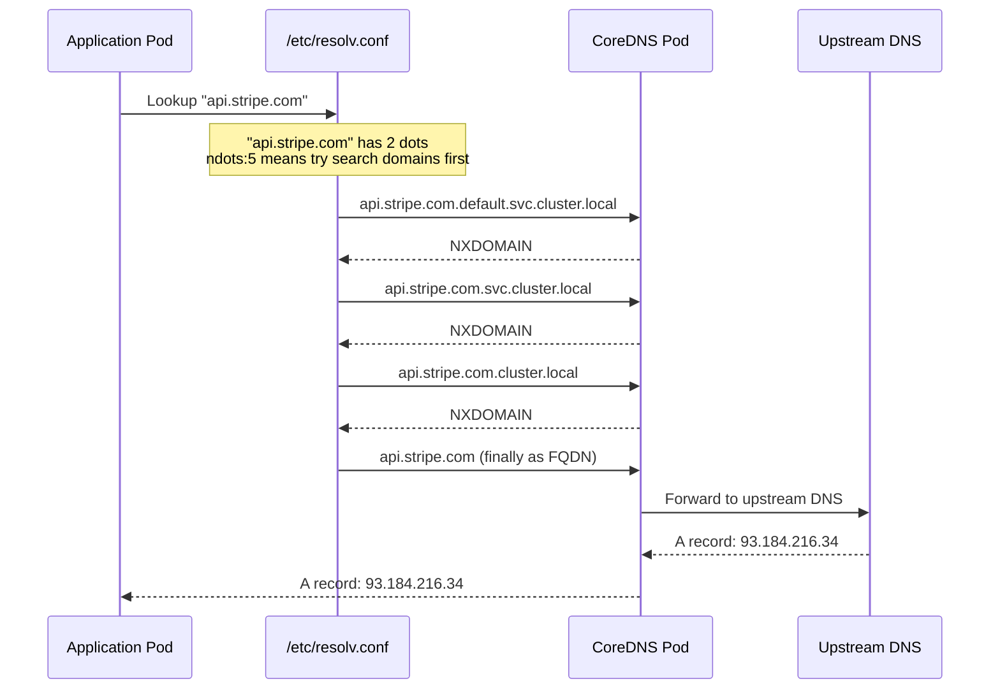

*[FQDN]: Fully Qualified Domain Name
*[TTL]: Time To Live

An application works perfectly in development. You deploy it to Kubernetes, and suddenly external API calls take 5+ seconds. The API itself responds in 100ms. You spend hours debugging network policies, service meshes, and egress configurations. Finally, you discover the culprit: `ndots:5`.

That single configuration option—the default in every Kubernetes cluster—causes every lookup like `api.stripe.com` to first try `api.stripe.com.default.svc.cluster.local`, then `api.stripe.com.svc.cluster.local`, then `api.stripe.com.cluster.local`, before finally trying the actual hostname. Three failed lookups, each potentially timing out, equals mysterious latency.

I've watched teams lose days to this problem. The symptoms look like network issues, timeout misconfigurations, or flaky external services. But most Kubernetes DNS latency traces back to one misunderstood setting. The good news: once you know what to look for, you can diagnose the problem in 30 seconds and fix it in another 30.

## Understanding the ndots Problem

The `ndots` option controls when the resolver tries search domains versus treating a hostname as absolute. The rule is simple: if a hostname has fewer dots than the `ndots` value, the resolver appends search domains first. With the default `ndots:5`, any hostname with 4 or fewer dots—which includes nearly every external hostname—gets the search domain treatment.

Here's what happens when your application looks up `api.stripe.com`. The resolver counts two dots. Two is less than five, so it appends each search domain in order before trying the hostname as-is. The diagram below shows this slow path:



Figure: External DNS lookup showing failed search domain queries before success.

Each of those NXDOMAIN responses takes time. The math is painful: with the default 5-second timeout, three failed queries could mean 15+ seconds of latency before your application gets a response. Even with a tuned 1-second timeout, you're looking at 3+ seconds versus the 100ms the API actually needs.

Why does Kubernetes default to `ndots:5`? Because internal service names can have up to 4 dots (`service.namespace.svc.cluster.local`). The high ndots value ensures internal service discovery works without requiring FQDNs. But it also means every external hostname pays a tax of failed lookups.

<Callout type="success" title="The Trailing Dot Trick">
Adding a trailing dot to hostnames (`api.stripe.com.`) marks them as absolute FQDNs, bypassing all search domain lookups. It looks odd in configuration files, but it works immediately without any cluster-level changes.
</Callout>

## Diagnosing ndots Issues

Before optimizing, confirm that ndots is actually your problem. The diagnostic takes 30 seconds and gives you concrete numbers to work with.

First, launch a debug pod with DNS tools:

```bash title="launch-debug-pod.sh"
kubectl run dns-debug --image=nicolaka/netshoot --rm -it --restart=Never -- bash
```

Code: Launch a debug pod with DNS tools.

Once inside the pod, compare resolution times with and without the trailing dot:

```bash title="ndots-diagnostic.sh"
# Test without trailing dot (search domains applied)
time nslookup api.stripe.com

# Test with trailing dot (FQDN, no search domains)
time nslookup api.stripe.com.
```

Code: The key diagnostic—compare resolution with and without trailing dot.

What counts as "significantly faster"? If the FQDN version (with the trailing dot) resolves in 50-100ms while the non-FQDN version takes 2-5 seconds, you've found your problem. The difference tells you exactly how much overhead the search domains add. In severe cases, I've seen the non-FQDN version take 15+ seconds while the FQDN version returns in under 100ms.

<Newsletter />

Once you've confirmed ndots is the issue, you have two fixes. The first is adjusting the pod's DNS configuration:

```yaml title="pod-dnsconfig.yaml"
apiVersion: v1
kind: Pod
metadata:
  name: api-client
spec:
  dnsConfig:
    options:
      - name: ndots
        value: "2"
      - name: timeout
        value: "2"
  containers:
    - name: app
      image: myapp:latest
```

Code: Reduce ndots at the pod level.

Setting `ndots:2` means hostnames with 2 or more dots (like `api.stripe.com`) are treated as absolute first. Internal service discovery still works because you'll use the full service name anyway.

The second fix is using FQDNs in your application configuration:

```yaml title="external-endpoints-configmap.yaml"
apiVersion: v1
kind: ConfigMap
metadata:
  name: external-endpoints
data:
  STRIPE_API_HOST: "api.stripe.com."
  TWILIO_API_HOST: "api.twilio.com."
  DATADOG_HOST: "api.datadoghq.com."
```

Code: Trailing dots in ConfigMap values bypass search domains.

This approach requires no cluster changes and works immediately. The trailing dot tells the resolver to skip the search domain dance entirely.

### Which Fix Should You Choose?

Both approaches work, but they fit different situations. Use **pod-level dnsConfig** when you control the deployment manifests and want a systematic fix that applies to all external lookups from that pod. This is the cleaner solution for new applications or when you're refactoring existing ones.

Use **trailing dots in configuration** when you need a quick fix without changing deployment manifests, or when you're dealing with a third-party application where you can only modify environment variables. It's also useful for targeted fixes—if only one external service is causing problems, you can add the trailing dot to just that hostname.

For most teams, I recommend starting with trailing dots for immediate relief, then migrating to pod-level dnsConfig as part of your next deployment update.

## The Impact: Before and After

To make this concrete, here's what the fix looks like in practice. Before applying either fix, a simple HTTP request to an external API:

| Metric | Before Fix | After Fix |
|--------|------------|-----------|
| DNS resolution time | 3.2 seconds | 85ms |
| Total request latency | 3.4 seconds | 285ms |
| P99 latency | 15+ seconds | 450ms |

Table: Latency improvement after fixing ndots.

The P99 improvement is particularly dramatic because timeout-related latency spikes disappear entirely. Your application goes from "sometimes slow for no apparent reason" to consistently fast.

## Quick Debugging Reference

When connectivity issues arise and you suspect DNS, here's the fastest path to confirmation:

1. **Launch a debug pod**: `kubectl run dns-debug --image=nicolaka/netshoot --rm -it --restart=Never -- bash`

2. **Run the ndots test**: Compare `time nslookup api.example.com` vs `time nslookup api.example.com.`

3. **Interpret the results**: If the FQDN (with dot) is 10x+ faster, apply one of the fixes above

<Download
  resource="kubernetes-dns-debugging-ndots-coredns-troubleshooting"
  title="Download the Kubernetes DNS Guide"
  description="Get the complete DNS troubleshooting playbook for ndots latency, CoreDNS tuning, and resolver-path diagnostics."
  listItems={[
    {
      text: "Ndots diagnosis quick checklist",
    },
    {
      text: "CoreDNS tuning configuration guide",
    },
    {
      text: "Node-local DNS caching setup",
    },
    {
      text: "DNS incident debugging workflow",
    },
  ]}
/>

If the ndots test doesn't show a significant difference, the problem lies elsewhere—check CoreDNS health with `kubectl get pods -n kube-system -l k8s-app=kube-dns` and examine its logs for errors.

<Callout type="warning" title="Always Test From Inside a Pod">
Node-level DNS and pod-level DNS are configured differently. A successful `nslookup` from the node doesn't prove DNS works for your application pods. Always test from inside a pod to get accurate results.
</Callout>

The ndots issue is the most common DNS problem in Kubernetes, but it's not the only one. If you're dealing with high-traffic clusters, CoreDNS performance tuning and node-local DNS caching can provide additional improvements. But for most teams, fixing ndots eliminates 90% of DNS-related latency issues.
