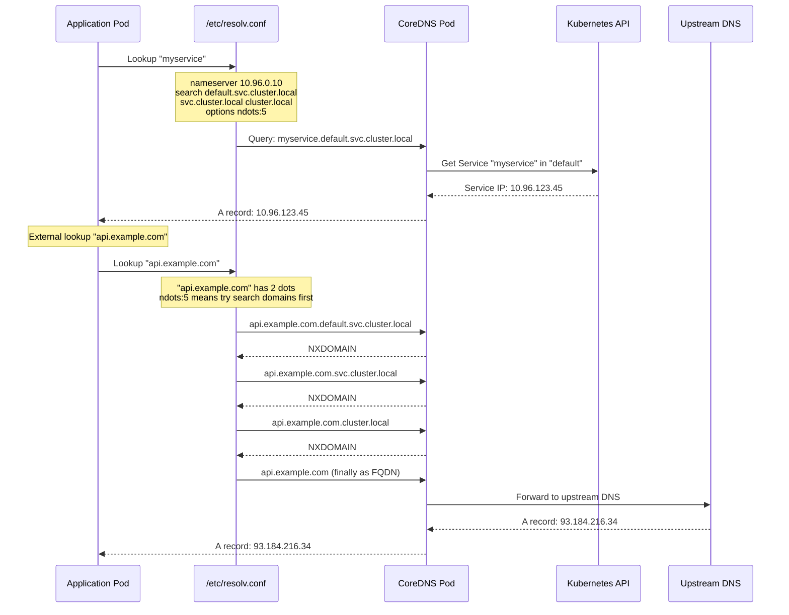
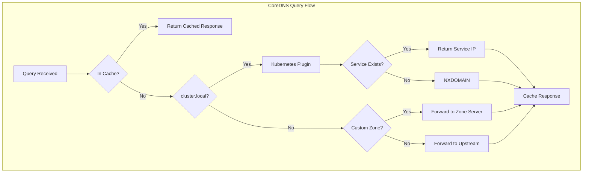
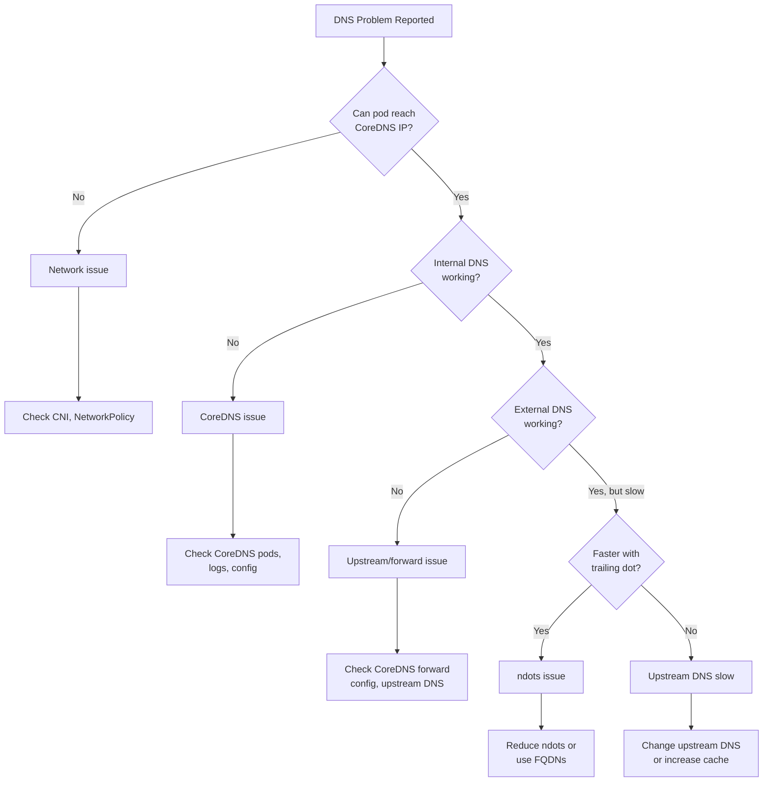

*[DNS]: Domain Name System
*[FQDN]: Fully Qualified Domain Name
*[TTL]: Time To Live
*[SRV]: Service Record
*[CNAME]: Canonical Name Record
*[A]: Address Record (IPv4)
*[AAAA]: Address Record (IPv6)
*[PTR]: Pointer Record
*[UDP]: User Datagram Protocol
*[TCP]: Transmission Control Protocol

# DNS Debugging in Kubernetes: ndots and CoreDNS

## Introduction

Frame the DNS debugging challenge: in Kubernetes, DNS is the most common cause of mysterious application failures, latency spikes, and "works sometimes" bugs. The Kubernetes DNS system—with its search domains, ndots configuration, and CoreDNS backend—adds layers of complexity that catch even experienced engineers. When your application can't reach a service, when external API calls are slow, when connections intermittently fail—DNS is guilty until proven innocent. This section establishes that understanding Kubernetes DNS internals isn't optional; it's required knowledge for debugging production issues.

_Include a scenario: an application works perfectly in development but in Kubernetes, external API calls take 5+ seconds. The API itself responds in 100ms. After hours of debugging, the team discovers the issue: ndots:5 (the default) causes every lookup like `api.stripe.com` to first try `api.stripe.com.default.svc.cluster.local`, then four more search domain suffixes, before finally trying the actual hostname. Five failed lookups × 1 second timeout = 5 seconds of latency. The fix: adding a trailing dot or adjusting ndots._

<Callout type="warning">
When something in Kubernetes is slow or broken and you don't know why, check DNS first. Not because DNS is always the problem—but because it's the problem often enough that ruling it out early saves hours of debugging.
</Callout>

## Kubernetes DNS Architecture

### How DNS Resolution Works


Figure: Kubernetes DNS resolution flow.

```yaml title="dns-architecture-explained.yaml"
kubernetes_dns_components:
  resolv_conf:
    location: "/etc/resolv.conf in every pod"
    contents:
      nameserver: "10.96.0.10"  # CoreDNS ClusterIP
      search:
        - "default.svc.cluster.local"      # Same namespace services
        - "svc.cluster.local"               # All services
        - "cluster.local"                   # All cluster resources
      options:
        ndots: 5  # Names with < 5 dots get search domains appended

  coredns:
    deployment: "kube-system/coredns"
    purpose: "DNS server for all cluster DNS queries"
    capabilities:
      - "Service discovery (service.namespace.svc.cluster.local)"
      - "Pod DNS (pod-ip.namespace.pod.cluster.local)"
      - "Upstream forwarding for external names"
      - "Caching"
      - "Custom DNS entries via ConfigMap"

  service_dns_records:
    clusterip_service:
      format: "servicename.namespace.svc.cluster.local"
      record_type: "A record → ClusterIP"
      example: "api-server.production.svc.cluster.local → 10.96.45.67"

    headless_service:
      format: "servicename.namespace.svc.cluster.local"
      record_type: "A records → All pod IPs"
      use_case: "StatefulSets, direct pod access"

    srv_records:
      format: "_port._protocol.servicename.namespace.svc.cluster.local"
      use_case: "Service discovery with port information"

  pod_dns_records:
    format: "pod-ip-with-dashes.namespace.pod.cluster.local"
    example: "10-244-1-5.default.pod.cluster.local"
```
Code: Kubernetes DNS architecture explained.

### The resolv.conf Configuration

```bash title="examining-resolv-conf.sh"
#!/bin/bash
# Examine DNS configuration in a pod

# Check resolv.conf
kubectl exec -it debug-pod -- cat /etc/resolv.conf
# Output:
# nameserver 10.96.0.10
# search default.svc.cluster.local svc.cluster.local cluster.local
# options ndots:5

# What each line means:
# nameserver: IP of CoreDNS service (kube-dns)
# search: Domains to append when name has < ndots dots
# ndots:5: If hostname has fewer than 5 dots, try search domains first

# Verify CoreDNS service IP
kubectl get svc -n kube-system kube-dns
# NAME       TYPE        CLUSTER-IP   EXTERNAL-IP   PORT(S)
# kube-dns   ClusterIP   10.96.0.10   <none>        53/UDP,53/TCP

# Check which DNS server the pod is using
kubectl exec -it debug-pod -- nslookup kubernetes.default
# Server:    10.96.0.10
# Address:   10.96.0.10#53
# Name:      kubernetes.default.svc.cluster.local
# Address:   10.96.0.1
```
Code: Examining pod DNS configuration.

| DNS Option | Default | Purpose | Impact |
|------------|---------|---------|--------|
| ndots | 5 | Dots threshold for search domain use | Lower = fewer unnecessary queries |
| timeout | 5 | Seconds before query timeout | Lower = faster failure, but risk of false negatives |
| attempts | 2 | Retry count per nameserver | Higher = more resilient, but slower failure |
| rotate | off | Round-robin nameservers | On = better load distribution |
| single-request | off | One request at a time | On = fixes some UDP issues |

Table: DNS options in resolv.conf.

<Callout type="info">
The default ndots:5 is chosen because Kubernetes service names can have up to 4 dots (service.namespace.svc.cluster.local). But this means external hostnames like `api.stripe.com` (2 dots) trigger 4+ failed lookups before succeeding. For applications making many external calls, this adds significant latency.
</Callout>

## The ndots Problem

### Understanding ndots Behavior

```typescript title="ndots-explained.ts"
// How ndots affects DNS resolution

interface DNSResolution {
  hostname: string;
  ndots: number;
  searchDomains: string[];
  queriesGenerated: string[];
}

function simulateDNSResolution(
  hostname: string,
  ndots: number = 5,
  searchDomains: string[] = [
    'default.svc.cluster.local',
    'svc.cluster.local',
    'cluster.local',
  ]
): DNSResolution {
  const dotCount = (hostname.match(/\./g) || []).length;
  const queries: string[] = [];

  // If hostname ends with dot, it's absolute (FQDN)
  if (hostname.endsWith('.')) {
    queries.push(hostname);
    return { hostname, ndots, searchDomains, queriesGenerated: queries };
  }

  // If dots < ndots, try search domains first
  if (dotCount < ndots) {
    for (const domain of searchDomains) {
      queries.push(`${hostname}.${domain}`);
    }
    // Then try as absolute name
    queries.push(hostname);
  } else {
    // If dots >= ndots, try absolute first
    queries.push(hostname);
    // Then search domains
    for (const domain of searchDomains) {
      queries.push(`${hostname}.${domain}`);
    }
  }

  return { hostname, ndots, searchDomains, queriesGenerated: queries };
}

// Example: External API call with default ndots:5
console.log(simulateDNSResolution('api.stripe.com'));
// queriesGenerated: [
//   'api.stripe.com.default.svc.cluster.local',  // NXDOMAIN
//   'api.stripe.com.svc.cluster.local',          // NXDOMAIN
//   'api.stripe.com.cluster.local',              // NXDOMAIN
//   'api.stripe.com'                              // SUCCESS
// ]
// 3 unnecessary queries before success!

// Example: Same call with ndots:2
console.log(simulateDNSResolution('api.stripe.com', 2));
// queriesGenerated: [
//   'api.stripe.com',                             // SUCCESS (tried first!)
//   'api.stripe.com.default.svc.cluster.local',
//   'api.stripe.com.svc.cluster.local',
//   'api.stripe.com.cluster.local'
// ]
// Absolute name tried first because dots (2) >= ndots (2)

// Example: Using FQDN with trailing dot
console.log(simulateDNSResolution('api.stripe.com.'));
// queriesGenerated: [
//   'api.stripe.com.'  // Only query needed
// ]
```
Code: Understanding ndots behavior.

### Measuring ndots Impact

```bash title="ndots-impact-measurement.sh"
#!/bin/bash
# Measure DNS resolution overhead from ndots

set -euo pipefail

# Create a debug pod with DNS tools
kubectl run dns-debug --image=nicolaka/netshoot --rm -it --restart=Never -- bash

# Inside the pod:

# Method 1: Count DNS queries with tcpdump
tcpdump -i any port 53 -c 20 &
sleep 1
nslookup api.stripe.com
# Watch for multiple queries to search domains

# Method 2: Measure resolution time
echo "With search domains (default ndots:5):"
time for i in {1..10}; do
  nslookup api.stripe.com > /dev/null 2>&1
done

echo "With FQDN (trailing dot):"
time for i in {1..10}; do
  nslookup api.stripe.com. > /dev/null 2>&1
done

# Method 3: Query count with dig
echo "Queries generated for 'api.stripe.com':"
dig +trace +all api.stripe.com 2>&1 | grep -c "QUERY"

# Method 4: Detailed timing with dig
dig api.stripe.com +stats
# Look for "Query time" and compare with FQDN version
dig api.stripe.com. +stats
```
Code: Measuring ndots impact.

```yaml title="ndots-optimization.yaml"
# Pod spec with optimized DNS settings

apiVersion: v1
kind: Pod
metadata:
  name: optimized-dns
spec:
  dnsConfig:
    options:
      # Reduce ndots for applications making many external calls
      - name: ndots
        value: "2"
      # Single request mode can help with some UDP issues
      - name: single-request-reopen
        value: ""
      # Reduce timeout for faster failure
      - name: timeout
        value: "2"
      # Increase attempts for reliability
      - name: attempts
        value: "3"

  containers:
    - name: app
      image: myapp:latest

---
# Alternative: Use FQDN in application code

# Instead of:
#   http.get('api.stripe.com')
# Use:
#   http.get('api.stripe.com.')  # Trailing dot = FQDN

# Or configure in environment:
apiVersion: v1
kind: ConfigMap
metadata:
  name: external-endpoints
data:
  STRIPE_API_HOST: "api.stripe.com."  # Note trailing dot
  TWILIO_API_HOST: "api.twilio.com."
```
Code: ndots optimization strategies.

<Callout type="success">
The fastest fix for external DNS latency is adding a trailing dot to hostnames. `api.stripe.com.` (with dot) is an absolute FQDN and skips all search domain lookups. It's ugly but effective.
</Callout>

## CoreDNS Configuration

### Understanding the Corefile

```yaml title="coredns-corefile.yaml"
# CoreDNS ConfigMap in kube-system namespace

apiVersion: v1
kind: ConfigMap
metadata:
  name: coredns
  namespace: kube-system
data:
  Corefile: |
    # Cluster domain zone
    .:53 {
        # Log all queries (useful for debugging, verbose for production)
        # log

        # Report errors to stdout
        errors

        # Serve health check endpoint
        health {
            lameduck 5s
        }

        # Serve readiness probe
        ready

        # Kubernetes plugin: answers service/pod DNS queries
        kubernetes cluster.local in-addr.arpa ip6.arpa {
            # Watch pods for DNS
            pods insecure
            # Only create records for ready endpoints
            fallthrough in-addr.arpa ip6.arpa
            # TTL for records
            ttl 30
        }

        # Prometheus metrics
        prometheus :9153

        # Forward external queries to upstream DNS
        forward . /etc/resolv.conf {
            # Maximum concurrent connections per upstream
            max_concurrent 1000
        }

        # Cache responses
        cache 30

        # Detect forwarding loops
        loop

        # Reload Corefile changes
        reload

        # Load balance queries
        loadbalance
    }
```
Code: Default CoreDNS configuration.

### CoreDNS Tuning

```yaml title="coredns-tuned.yaml"
# Optimized CoreDNS configuration for large clusters

apiVersion: v1
kind: ConfigMap
metadata:
  name: coredns
  namespace: kube-system
data:
  Corefile: |
    .:53 {
        errors
        health {
            lameduck 5s
        }
        ready

        kubernetes cluster.local in-addr.arpa ip6.arpa {
            pods insecure
            fallthrough in-addr.arpa ip6.arpa
            ttl 30
        }

        prometheus :9153

        # Larger cache for high-traffic clusters
        cache {
            # Cache successful responses for 60 seconds
            success 9984 60
            # Cache NXDOMAIN for 30 seconds (reduces search domain overhead)
            denial 9984 30
            # Prefetch popular records before expiry
            prefetch 10 60s 10%
        }

        # Forward to specific upstream DNS (not /etc/resolv.conf)
        forward . 8.8.8.8 8.8.4.4 {
            max_concurrent 1000
            # Health check upstreams
            health_check 5s
        }

        # Alternative: Use node's DNS
        # forward . /etc/resolv.conf

        loop
        reload 10s
        loadbalance round_robin
    }

    # Custom zone for internal services
    internal.company.com:53 {
        errors
        cache 300
        forward . 10.0.0.53  # Internal DNS server
    }

---
# Scale CoreDNS for large clusters

apiVersion: apps/v1
kind: Deployment
metadata:
  name: coredns
  namespace: kube-system
spec:
  replicas: 3  # Increase from default 2
  template:
    spec:
      containers:
        - name: coredns
          resources:
            requests:
              cpu: 100m
              memory: 70Mi
            limits:
              cpu: 1000m
              memory: 170Mi
```
Code: Tuned CoreDNS configuration.


Figure: CoreDNS query flow.

<Callout type="info">
Caching NXDOMAIN responses (negative caching) is crucial for performance. Without it, every lookup of `api.stripe.com` retries all the failed search domain queries on every request. A 30-second negative cache TTL prevents this.
</Callout>

## DNS Debugging Workflow

### Systematic Debugging Steps

```bash title="dns-debugging-workflow.sh"
#!/bin/bash
# Systematic DNS debugging workflow

set -euo pipefail

NAMESPACE="${1:-default}"
POD="${2:-}"

echo "=== DNS Debugging Workflow ==="

# Step 1: Verify CoreDNS is running
echo ""
echo "Step 1: CoreDNS health check"
kubectl get pods -n kube-system -l k8s-app=kube-dns
kubectl get endpoints -n kube-system kube-dns

# Step 2: Verify kube-dns service
echo ""
echo "Step 2: kube-dns service"
kubectl get svc -n kube-system kube-dns
DNS_IP=$(kubectl get svc -n kube-system kube-dns -o jsonpath='{.spec.clusterIP}')
echo "CoreDNS ClusterIP: $DNS_IP"

# Step 3: Check CoreDNS logs for errors
echo ""
echo "Step 3: CoreDNS logs (last 50 lines)"
kubectl logs -n kube-system -l k8s-app=kube-dns --tail=50 | grep -E "(error|Error|NXDOMAIN|timeout)" || echo "No obvious errors"

# Step 4: Test from a debug pod
echo ""
echo "Step 4: Creating debug pod..."
kubectl run dns-debug-$$ --image=nicolaka/netshoot --restart=Never --rm -it -- bash -c '
  echo "=== resolv.conf ==="
  cat /etc/resolv.conf

  echo ""
  echo "=== Testing cluster DNS ==="
  echo "Lookup kubernetes.default:"
  nslookup kubernetes.default

  echo ""
  echo "=== Testing service discovery ==="
  echo "Lookup kube-dns.kube-system.svc.cluster.local:"
  nslookup kube-dns.kube-system.svc.cluster.local

  echo ""
  echo "=== Testing external DNS ==="
  echo "Lookup google.com:"
  time nslookup google.com

  echo ""
  echo "=== Testing with FQDN ==="
  echo "Lookup google.com. (with dot):"
  time nslookup google.com.

  echo ""
  echo "=== Detailed dig output ==="
  dig +all +stats kubernetes.default
'

# Step 5: Check for DNS policy issues
echo ""
echo "Step 5: Check network policies affecting kube-dns"
kubectl get networkpolicies -A -o wide

# Step 6: Check CoreDNS metrics
echo ""
echo "Step 6: CoreDNS metrics"
kubectl exec -n kube-system -it $(kubectl get pods -n kube-system -l k8s-app=kube-dns -o jsonpath='{.items[0].metadata.name}') -- wget -qO- http://localhost:9153/metrics | grep -E "^coredns_(dns_requests_total|dns_responses_total|forward_requests_total|cache_hits_total)"
```
Code: Systematic DNS debugging workflow.

### Common DNS Issues

```yaml title="common-dns-issues.yaml"
common_dns_issues:
  issue_1:
    symptom: "DNS lookups timeout or fail intermittently"
    possible_causes:
      - "CoreDNS pods overloaded"
      - "Network policy blocking DNS traffic"
      - "Node DNS (resolv.conf) misconfigured"
    debugging:
      - "kubectl get pods -n kube-system -l k8s-app=kube-dns"
      - "kubectl top pods -n kube-system -l k8s-app=kube-dns"
      - "Check for NetworkPolicy blocking UDP/TCP 53"
    fix:
      - "Scale CoreDNS replicas"
      - "Add NetworkPolicy exception for kube-dns"
      - "Check upstream DNS configuration"

  issue_2:
    symptom: "External DNS slow, internal DNS fast"
    possible_causes:
      - "ndots causing search domain queries"
      - "Upstream DNS slow"
      - "Forward loop in CoreDNS"
    debugging:
      - "Compare: nslookup external.com vs nslookup external.com."
      - "Check CoreDNS forward configuration"
      - "Test upstream DNS directly: dig @8.8.8.8 external.com"
    fix:
      - "Reduce ndots in pod dnsConfig"
      - "Use trailing dot for external FQDNs"
      - "Configure explicit upstream DNS in CoreDNS"

  issue_3:
    symptom: "Service discovery fails for new services"
    possible_causes:
      - "Service not yet propagated to CoreDNS"
      - "Service in different namespace"
      - "Service has no endpoints"
    debugging:
      - "kubectl get svc,ep -n <namespace>"
      - "kubectl logs -n kube-system -l k8s-app=kube-dns"
      - "nslookup servicename.namespace.svc.cluster.local"
    fix:
      - "Wait for service propagation (usually < 10s)"
      - "Use full FQDN with namespace"
      - "Ensure pods are ready (endpoints exist)"

  issue_4:
    symptom: "DNS works from some pods but not others"
    possible_causes:
      - "Pod DNS policy misconfigured"
      - "Node-level DNS issues"
      - "NetworkPolicy per-namespace"
    debugging:
      - "kubectl get pod <pod> -o jsonpath='{.spec.dnsPolicy}'"
      - "Compare /etc/resolv.conf between working and broken pods"
      - "Check which node the broken pod is on"
    fix:
      - "Set dnsPolicy: ClusterFirst"
      - "Check node's /etc/resolv.conf"
      - "Review NetworkPolicies in pod's namespace"

  issue_5:
    symptom: "High DNS latency (> 100ms)"
    possible_causes:
      - "CoreDNS cache misses"
      - "Upstream DNS slow"
      - "Too many search domain queries"
    debugging:
      - "Check CoreDNS cache hit ratio in metrics"
      - "Measure upstream DNS latency: dig @upstream-ip example.com"
      - "Count queries with tcpdump on port 53"
    fix:
      - "Increase CoreDNS cache size"
      - "Use faster upstream DNS (8.8.8.8, 1.1.1.1)"
      - "Optimize ndots or use FQDNs"
```
Code: Common DNS issues and solutions.


Figure: DNS debugging decision tree.

<Callout type="warning">
When debugging DNS, always test from inside a pod. Node-level DNS and pod-level DNS are configured differently. A test that works from the node doesn't prove DNS works for pods.
</Callout>

## Advanced DNS Patterns

### Custom DNS Entries

```yaml title="custom-dns-entries.yaml"
# Method 1: CoreDNS hosts plugin (cluster-wide)

apiVersion: v1
kind: ConfigMap
metadata:
  name: coredns-custom
  namespace: kube-system
data:
  custom.server: |
    # Custom hosts entries
    internal-api.company.com:53 {
        hosts {
            10.0.1.100 internal-api.company.com
            10.0.1.101 internal-db.company.com
            fallthrough
        }
        cache 300
    }

# Then patch CoreDNS to include custom config:
# kubectl edit configmap coredns -n kube-system
# Add: import /etc/coredns/custom/*.server

---
# Method 2: ExternalName service (namespace-scoped)

apiVersion: v1
kind: Service
metadata:
  name: external-api
  namespace: production
spec:
  type: ExternalName
  externalName: api.external-provider.com

# Now pods can use: external-api.production.svc.cluster.local
# Which resolves to api.external-provider.com

---
# Method 3: Headless service with endpoints (static IPs)

apiVersion: v1
kind: Service
metadata:
  name: legacy-database
  namespace: production
spec:
  clusterIP: None  # Headless
  ports:
    - port: 5432

---
apiVersion: v1
kind: Endpoints
metadata:
  name: legacy-database
  namespace: production
subsets:
  - addresses:
      - ip: 10.0.50.100
      - ip: 10.0.50.101
    ports:
      - port: 5432

# Now: legacy-database.production.svc.cluster.local
# Returns: 10.0.50.100, 10.0.50.101
```
Code: Custom DNS entry patterns.

### DNS Policies

```yaml title="dns-policies.yaml"
# Pod DNS policy options

apiVersion: v1
kind: Pod
metadata:
  name: dns-policy-examples
spec:
  # Option 1: ClusterFirst (default)
  # - Uses cluster DNS (CoreDNS) for all queries
  # - Best for most workloads
  dnsPolicy: ClusterFirst

---
apiVersion: v1
kind: Pod
metadata:
  name: host-dns-example
spec:
  # Option 2: Default
  # - Uses node's DNS configuration
  # - Bypasses CoreDNS entirely
  # - Use when pod needs node's DNS (rare)
  dnsPolicy: Default

---
apiVersion: v1
kind: Pod
metadata:
  name: host-network-example
spec:
  # Option 3: ClusterFirstWithHostNet
  # - For pods with hostNetwork: true
  # - Still uses CoreDNS for cluster DNS
  hostNetwork: true
  dnsPolicy: ClusterFirstWithHostNet

---
apiVersion: v1
kind: Pod
metadata:
  name: custom-dns-example
spec:
  # Option 4: None
  # - Completely custom DNS configuration
  # - Must provide dnsConfig
  dnsPolicy: None
  dnsConfig:
    nameservers:
      - 8.8.8.8
      - 8.8.4.4
    searches:
      - custom.local
    options:
      - name: ndots
        value: "1"
      - name: timeout
        value: "3"
```
Code: DNS policy options.

| Policy | Use Case | CoreDNS Used | When to Use |
|--------|----------|--------------|-------------|
| ClusterFirst | Default for most pods | Yes | Standard workloads |
| Default | Node DNS needed | No | Legacy apps, specific DNS requirements |
| ClusterFirstWithHostNet | Host network pods | Yes | Monitoring agents, CNI pods |
| None | Full custom DNS | No | External DNS only, testing |

Table: DNS policy comparison.

### Node-Local DNS Cache

```yaml title="nodelocal-dns-cache.yaml"
# NodeLocal DNS Cache deployment
# Reduces CoreDNS load and improves latency

apiVersion: apps/v1
kind: DaemonSet
metadata:
  name: node-local-dns
  namespace: kube-system
spec:
  selector:
    matchLabels:
      k8s-app: node-local-dns
  template:
    metadata:
      labels:
        k8s-app: node-local-dns
    spec:
      hostNetwork: true
      dnsPolicy: Default
      tolerations:
        - operator: Exists
      containers:
        - name: node-cache
          image: registry.k8s.io/dns/k8s-dns-node-cache:1.22.20
          args:
            - -localip
            - "169.254.20.10"  # Link-local IP for cache
            - -conf
            - /etc/Corefile
            - -upstreamsvc
            - kube-dns  # Forward misses to CoreDNS
          ports:
            - containerPort: 53
              hostPort: 53
              protocol: UDP
            - containerPort: 53
              hostPort: 53
              protocol: TCP
          livenessProbe:
            httpGet:
              host: 169.254.20.10
              path: /health
              port: 8080
          resources:
            requests:
              cpu: 25m
              memory: 5Mi

# After deploying, update kubelet to use local cache:
# --cluster-dns=169.254.20.10

# Benefits:
# - DNS queries stay on local node (no network hop)
# - Reduces CoreDNS pod load
# - Faster response times
# - Resilient to CoreDNS pod failures (cached entries)
```
Code: Node-local DNS cache setup.

<Callout type="success">
Node-local DNS cache is the best optimization for high-traffic clusters. It eliminates network hops for cached queries, reduces CoreDNS load, and provides resilience against CoreDNS pod failures. The latency improvement is typically 2-10x for cached queries.
</Callout>

## Conclusion

Summarize the key DNS debugging principles: understand the Kubernetes DNS architecture (resolv.conf → CoreDNS → upstream), know how ndots and search domains affect external lookups, use systematic debugging workflows, and tune CoreDNS for your cluster's needs. Emphasize that DNS issues are common but diagnosable—the key is building muscle memory for the debugging workflow so when the inevitable "DNS is broken" incident occurs, you can quickly identify whether it's an ndots issue, CoreDNS problem, upstream failure, or network policy blocking traffic.

<Callout type="info">
Build DNS debugging into your standard runbooks. When an application has connectivity issues, DNS should be the first thing you rule out—not because it's always the problem, but because it's the problem often enough that quick DNS diagnosis saves hours of debugging in the wrong direction.
</Callout>

---

## Cover Prompt

### Prompt 1: The DNS Maze

Create an image of a maze where a query packet tries to find its destination. The maze paths are labeled with search domains (default.svc.cluster.local, svc.cluster.local, cluster.local). Dead ends have "NXDOMAIN" signs. The exit is labeled "api.stripe.com" but requires navigating through unnecessary paths first. Style: maze puzzle, query navigation, complexity visualization, 16:9 aspect ratio.

### Prompt 2: The Resolution Pipeline

Design an image of a water treatment facility representing DNS resolution. Water (queries) flows through filters labeled "resolv.conf," "CoreDNS," "Cache," and "Upstream." Some water gets recycled (cached), some goes through multiple unnecessary filters (ndots overhead). Clean water emerges as resolved IPs. Style: industrial pipeline, filtering process, efficiency visualization, 16:9 aspect ratio.

### Prompt 3: The DNS Detective

Illustrate a detective (SRE/engineer) with a magnifying glass examining DNS clues. Evidence board shows "ndots:5," "search domains," "CoreDNS logs," and "NXDOMAIN." The detective traces the path of a failed query with red string connecting clues. Case file labeled "Why is DNS slow?" Style: detective investigation, clue tracking, mystery solving, 16:9 aspect ratio.

### Prompt 4: The Query Multiplication

Create an image showing one DNS query entering a machine labeled "Kubernetes DNS" and five queries emerging from the other side. Each output query is stamped with a different search domain suffix. An engineer looks frustrated at the multiplication. A switch labeled "ndots" controls the multiplication factor. Style: query multiplication, overhead visualization, tuning control, 16:9 aspect ratio.

### Prompt 5: The DNS Layers

Design an image of a layered cake representing DNS stack. Bottom layer: "Node DNS." Middle layer: "CoreDNS." Top layer: "Pod resolv.conf." Each layer has its own configuration knobs. A diagnostic probe checks each layer. Some layers have "ISSUE" flags. Style: layered architecture, diagnostic probing, stack visualization, 16:9 aspect ratio.
