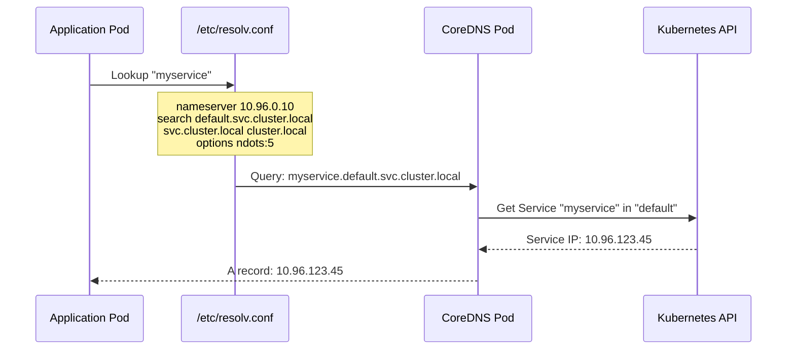
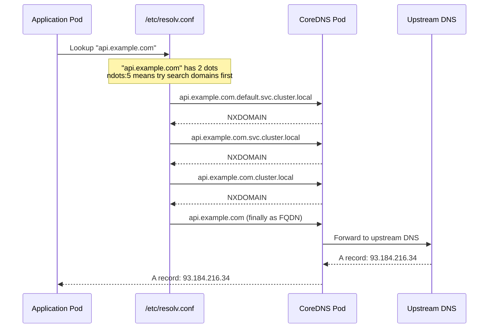
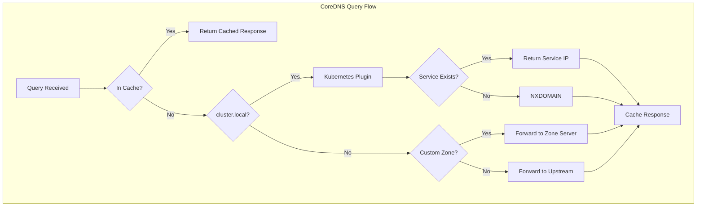
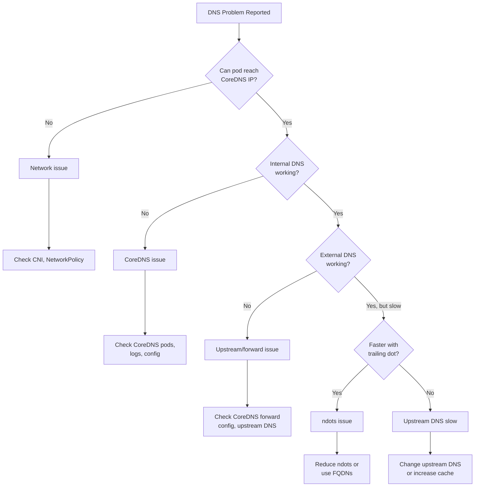

*[FQDN]: Fully Qualified Domain Name
*[TTL]: Time To Live
*[SRV]: Service Record
*[CNAME]: Canonical Name Record
*[A]: Address Record (IPv4)
*[AAAA]: Address Record (IPv6)
*[PTR]: Pointer Record
*[UDP]: User Datagram Protocol
*[TCP]: Transmission Control Protocol

An application works perfectly in development. In Kubernetes, external API calls take 5+ seconds. The API itself responds in 100ms. After hours of debugging network policies, service meshes, and egress configurations, the team discovers the culprit: `ndots:5`.

That single configuration option, the default in every Kubernetes cluster, causes every lookup like `api.stripe.com` to first try `api.stripe.com.default.svc.cluster.local`, then `api.stripe.com.svc.cluster.local`, then `api.stripe.com.cluster.local`, before finally trying the actual hostname. Three failed lookups at roughly one second each equals the mysterious latency. The fix took thirty seconds: add a trailing dot to the hostname.

I've seen this pattern repeatedly. Mysterious application failures, latency spikes, and "works sometimes" bugs that trace back to DNS. The Kubernetes DNS system adds layers of complexity that catch even experienced engineers off guard. When your application can't reach a service, DNS should be your first suspect.

This article covers the DNS internals you need to debug production issues: how `resolv.conf` and search domains work, why `ndots` creates overhead for external lookups, how to tune CoreDNS, and a systematic workflow for diagnosing DNS problems.

<Callout type="warning" title="The First Rule of Kubernetes Debugging">
When something is slow or broken and you don't know why, check DNS first. Not because DNS is always the problem, but because it's the problem often enough that ruling it out early saves hours of debugging in the wrong direction.
</Callout>

## Kubernetes DNS Architecture

Understanding the DNS stack is essential for effective debugging. Kubernetes doesn't use a single DNS server. It's a layered system where your pod's `resolv.conf` configuration determines how queries are constructed, CoreDNS handles the actual resolution, and upstream servers resolve anything outside the cluster. Each layer has its own configuration and failure modes.

### How DNS Resolution Works

The first diagram shows internal service discovery—the fast path. When you look up a service name, the search domain gets appended, CoreDNS finds the service in the Kubernetes API, and you get an IP back immediately.



Figure: Internal service discovery—fast path with single query.

The second diagram shows what happens with external lookups—this is where the trouble starts. Because `api.example.com` has only 2 dots and ndots is 5, the resolver tries three search domain suffixes before finally querying the actual hostname.



Figure: External DNS lookup—slow path with multiple failed queries before success.

The key components work together: every pod gets a `/etc/resolv.conf` that points to CoreDNS and defines search domains. CoreDNS runs as a deployment in `kube-system`, watches the Kubernetes API for services and endpoints, and forwards external queries to upstream DNS servers. Service DNS records follow a predictable format: `servicename.namespace.svc.cluster.local` resolves to the service's ClusterIP, while headless services return the pod IPs directly.

### The resolv.conf Configuration

Every debugging session should start by examining the pod's DNS configuration. The `resolv.conf` file tells you exactly which nameserver the pod uses, which search domains get appended, and crucially, the ndots setting that controls when those search domains apply.

```bash title="examining-resolv-conf.sh"
# Examine DNS configuration in a pod
kubectl exec -it debug-pod -- cat /etc/resolv.conf
# Output:
# nameserver 10.96.0.10
# search default.svc.cluster.local svc.cluster.local cluster.local
# options ndots:5

# Verify CoreDNS service IP matches
kubectl get svc -n kube-system kube-dns
# NAME       TYPE        CLUSTER-IP   EXTERNAL-IP   PORT(S)
# kube-dns   ClusterIP   10.96.0.10   <none>        53/UDP,53/TCP

# Test that DNS resolution works
kubectl exec -it debug-pod -- nslookup kubernetes.default
# Server:    10.96.0.10
# Address:   10.96.0.10#53
# Name:      kubernetes.default.svc.cluster.local
# Address:   10.96.0.1
```

Code: Examining pod DNS configuration.

The options in `resolv.conf` control DNS behavior in ways that matter for debugging and performance tuning.

| DNS Option | Default | Purpose | Impact |
|------------|---------|---------|--------|
| ndots | 5 | Dots threshold for search domain use | Lower = fewer unnecessary queries |
| timeout | 5 | Seconds before query timeout | Lower = faster failure, but risk of false negatives |
| attempts | 2 | Retry count per nameserver | Higher = more resilient, but slower failure |
| rotate | off | Round-robin nameservers | On = better load distribution |
| single-request | off | One request at a time | On = fixes some UDP issues |

Table: DNS options in resolv.conf.

<Callout type="info" title="Why ndots Defaults to 5">
The default `ndots:5` exists because Kubernetes service names can have up to 4 dots (service.namespace.svc.cluster.local). This ensures internal service discovery works without requiring an FQDN. But it also means external hostnames like `api.stripe.com` (2 dots) trigger multiple failed lookups before succeeding. For applications making many external calls, this adds significant latency.
</Callout>

## The ndots Problem

The previous section mentioned ndots several times—now let's dig into why this single option causes so much trouble. In my experience, `ndots` is the root cause of most external DNS latency in Kubernetes. Understanding exactly how it works transforms a mysterious performance problem into a straightforward configuration fix.

### Understanding ndots Behavior

The rule is simple: if a hostname has fewer dots than the `ndots` value, the resolver tries search domains first. With the default `ndots:5`, any hostname with 4 or fewer dots (which includes nearly every external hostname) gets the search domain treatment.

Here's what that means in practice. When your application looks up `api.stripe.com`, the resolver counts two dots. Two is less than five, so it appends each search domain in order before trying the hostname as-is. The Python script below illustrates this logic—it's not production code, but it helps visualize exactly what the resolver does:

```python title="ndots-resolution-simulator.py"
def simulate_dns_resolution(
    hostname: str,
    ndots: int = 5,
    search_domains: list[str] = None
) -> list[str]:
    if search_domains is None:
        search_domains = [
            'default.svc.cluster.local',
            'svc.cluster.local',
            'cluster.local',
        ]

    # Trailing dot means absolute FQDN - skip search domains entirely
    if hostname.endswith('.'):
        return [hostname]

    dot_count = hostname.count('.')
    queries = []

    # If dots < ndots, try search domains first
    if dot_count < ndots:
        for domain in search_domains:
            queries.append(f"{hostname}.{domain}")
        queries.append(hostname)  # Finally try as absolute
    else:
        # If dots >= ndots, try absolute first
        queries.append(hostname)
        for domain in search_domains:
            queries.append(f"{hostname}.{domain}")

    return queries

# --- Examples ---

# Default ndots:5 - search domains tried first
print(simulate_dns_resolution('api.stripe.com'))
# Output: ['api.stripe.com.default.svc.cluster.local', 'api.stripe.com.svc.cluster.local', 'api.stripe.com.cluster.local', 'api.stripe.com']

# With ndots:2 - absolute tried first (dots >= ndots)
print(simulate_dns_resolution('api.stripe.com', ndots=2))
# Output: ['api.stripe.com', 'api.stripe.com.default.svc.cluster.local', ...]

# Trailing dot - only one query needed
print(simulate_dns_resolution('api.stripe.com.'))
# Output: ['api.stripe.com.']
```

Code: Simulating ndots resolution behavior.

The difference between `ndots:5` and `ndots:2` for an external API call is three unnecessary DNS queries. With the default 5-second timeout, that's potentially 15+ seconds of latency before your application gets a response. Even with a tuned 1-second timeout, you're looking at 3+ seconds versus 100ms.

### Measuring ndots Impact

Before optimizing, measure the actual impact in your cluster. The difference between `nslookup api.stripe.com` and `nslookup api.stripe.com.` tells you exactly how much overhead the search domains add.

```bash title="launch-debug-pod.sh"
# Spin up a debug pod with DNS tools
kubectl run dns-debug --image=nicolaka/netshoot --rm -it --restart=Never -- bash
```

Code: Launch a debug pod with DNS tools.

Once you're inside the pod, compare resolution times with and without the trailing dot:

```bash title="measure-ndots-inside-pod.sh"
# Compare resolution times
echo "Without trailing dot (search domains applied):"
time nslookup api.stripe.com

echo "With trailing dot (FQDN, no search domains):"
time nslookup api.stripe.com.

# Watch the actual queries with tcpdump
tcpdump -i any port 53 &
nslookup api.stripe.com
# You'll see queries for api.stripe.com.default.svc.cluster.local,
# api.stripe.com.svc.cluster.local, etc.
kill %1  # Stop tcpdump when done
```

Code: Measuring ndots overhead inside the debug pod.

Once you've confirmed ndots is the issue, you have two fixes: adjust the pod's DNS configuration, or use FQDNs in your application.

```yaml title="ndots-optimization.yaml"
# Option 1: Reduce ndots at the pod level
apiVersion: v1
kind: Pod
metadata:
  name: api-client
spec:
  dnsConfig:
    options:
      - name: ndots
        value: "2"
      - name: timeout
        value: "2"
      - name: attempts
        value: "3"
  containers:
    - name: app
      image: myapp:latest

---
# Option 2: Use FQDNs in configuration
apiVersion: v1
kind: ConfigMap
metadata:
  name: external-endpoints
data:
  STRIPE_API_HOST: "api.stripe.com."    # Trailing dot = FQDN
  TWILIO_API_HOST: "api.twilio.com."
  DATADOG_HOST: "api.datadoghq.com."
```

Code: Two approaches to fixing ndots overhead.

<Callout type="success" title="The Trailing Dot Trick">
Adding a trailing dot to hostnames (`api.stripe.com.`) is the fastest fix for external DNS latency. It marks the hostname as an absolute FQDN, bypassing all search domain lookups. It looks odd in configuration files, but it works immediately without any cluster-level changes.
</Callout>

## CoreDNS Configuration

CoreDNS is the DNS server that handles all cluster queries. I find that understanding its configuration pays dividends when you need to tune performance, debug forwarding issues, or add custom DNS entries.

### Understanding the Corefile

The CoreDNS configuration lives in a ConfigMap in `kube-system`. The Corefile uses a plugin-based architecture where each directive enables specific functionality. Here's the default configuration with annotations explaining what each plugin does:

```yaml title="coredns-default-config.yaml"
# View your cluster's CoreDNS config:
# kubectl get configmap coredns -n kube-system -o yaml

apiVersion: v1
kind: ConfigMap
metadata:
  name: coredns
  namespace: kube-system
data:
  Corefile: |
    .:53 {
        errors                    # Log errors to stdout
        health { lameduck 5s }    # Health endpoint at :8080/health
        ready                     # Readiness endpoint at :8181/ready

        kubernetes cluster.local in-addr.arpa ip6.arpa {
            pods insecure         # Create pod DNS records
            fallthrough in-addr.arpa ip6.arpa
            ttl 30                # Record TTL in seconds
        }

        prometheus :9153          # Metrics at :9153/metrics
        forward . /etc/resolv.conf { max_concurrent 1000 }
        cache 30                  # Cache all responses for 30s
        loop                      # Detect and break forwarding loops
        reload                    # Auto-reload on config changes
        loadbalance               # Round-robin A/AAAA records
    }
```

Code: Default CoreDNS Corefile configuration.

The `kubernetes` plugin handles service discovery. It watches the Kubernetes API for services and endpoints, then answers DNS queries for `*.cluster.local` with the appropriate ClusterIPs or pod IPs. The `forward` plugin sends everything else to upstream DNS servers.

### CoreDNS Tuning

For high-traffic clusters or when external DNS latency is a concern, tuning the cache and forward plugins makes a measurable difference. The most impactful change is enabling negative caching to stop repeated NXDOMAIN queries from the ndots search domain behavior.

```yaml title="coredns-tuned.yaml" {21-24}
apiVersion: v1
kind: ConfigMap
metadata:
  name: coredns
  namespace: kube-system
data:
  Corefile: |
    .:53 {
        errors
        health { lameduck 5s }
        ready

        kubernetes cluster.local in-addr.arpa ip6.arpa {
            pods insecure
            fallthrough in-addr.arpa ip6.arpa
            ttl 30
        }

        prometheus :9153

        # Tuned cache: separate settings for success and denial
        cache {
            success 9984 60       # Cache positive responses 60s
            denial 9984 30        # Cache NXDOMAIN responses 30s
            prefetch 10 60s 10%   # Prefetch popular records before expiry
        }

        # Explicit upstream DNS (faster than node's resolv.conf)
        forward . 8.8.8.8 8.8.4.4 {
            max_concurrent 1000
            health_check 5s
        }

        loop
        reload 10s
        loadbalance round_robin
    }
```

Code: Tuned CoreDNS configuration with negative caching.

The diagram below shows how CoreDNS processes queries. Notice that cache hits return immediately, and the Kubernetes plugin only handles `cluster.local` queries. Everything else forwards upstream.



Figure: CoreDNS query processing flow.

For large clusters with hundreds of pods making DNS queries, you may also need to scale the CoreDNS deployment itself. The default two replicas can become a bottleneck.

```yaml title="coredns-scaling.yaml" {8}
# Scale CoreDNS for high query volume
apiVersion: apps/v1
kind: Deployment
metadata:
  name: coredns
  namespace: kube-system
spec:
  replicas: 3  # Default is 2
  template:
    spec:
      containers:
        - name: coredns
          resources:
            requests:
              cpu: 100m
              memory: 70Mi
            limits:
              cpu: 1000m
              memory: 170Mi
```

Code: Scaling CoreDNS for high-traffic clusters.

<Callout type="info" title="Negative Caching Matters">
Caching NXDOMAIN responses is crucial for performance. Without it, every lookup of `api.stripe.com` retries all the failed search domain queries on every request. A 30-second negative cache TTL prevents this repeated work.
</Callout>

## DNS Debugging Workflow

When DNS breaks, you need a systematic approach that quickly narrows down the problem. Is CoreDNS running? Is it reachable? Is the issue internal DNS, external DNS, or both? The following workflow answers these questions in order of likelihood.

### Systematic Debugging Steps

Start by verifying the DNS infrastructure is healthy, then test from a pod to isolate pod-level versus cluster-level issues.

```bash title="dns-quick-check.sh"
# Step 1: Is CoreDNS running?
kubectl get pods -n kube-system -l k8s-app=kube-dns
kubectl get endpoints -n kube-system kube-dns

# Step 2: What's the CoreDNS service IP?
kubectl get svc -n kube-system kube-dns

# Step 3: Any errors in CoreDNS logs?
kubectl logs -n kube-system -l k8s-app=kube-dns --tail=50 | \
  grep -E "(error|Error|SERVFAIL|timeout)" || echo "No obvious errors"
```

Code: Quick CoreDNS health check.

Once you've verified CoreDNS is running, test from inside a pod. This is critical because node-level DNS and pod-level DNS are configured differently.

```bash title="launch-dns-debug-pod.sh"
# Spin up a debug pod with DNS tools
kubectl run dns-debug --image=nicolaka/netshoot --rm -it --restart=Never -- bash
```

Code: Launch a debug pod.

Once inside the pod, run through this diagnostic sequence:

```bash title="dns-diagnostic-sequence.sh"
cat /etc/resolv.conf                    # Check DNS config
nslookup kubernetes.default             # Test internal DNS
nslookup google.com                     # Test external DNS
time nslookup api.stripe.com            # Measure external latency
time nslookup api.stripe.com.           # Compare with FQDN (trailing dot)
```

Code: DNS diagnostic commands to run inside the pod.

The comparison between `nslookup api.stripe.com` and `nslookup api.stripe.com.` is the key diagnostic for ndots issues. If the FQDN version is significantly faster, you've found your problem.

### Common DNS Issues

Most DNS problems fall into a few categories. The decision tree below helps you quickly identify which category you're dealing with.



Figure: DNS debugging decision tree.

Here's what to check for each common scenario:

**DNS timeouts or intermittent failures**: Check if CoreDNS pods are overloaded (`kubectl top pods -n kube-system -l k8s-app=kube-dns`), look for NetworkPolicies blocking UDP/TCP port 53, and verify the upstream DNS in CoreDNS's forward configuration is reachable.

**External DNS slow, internal DNS fast**: This is almost always an ndots issue. Compare resolution time with and without a trailing dot. If the FQDN is faster, reduce ndots in pod dnsConfig or use FQDNs in your application configuration.

**Service discovery fails for new services**: Services usually propagate to CoreDNS within 10 seconds. If lookups fail, verify the service exists and has endpoints (`kubectl get svc,ep -n <namespace>`). Also check that you're using the correct namespace in the FQDN.

**DNS works in some pods but not others**: Compare `/etc/resolv.conf` between working and broken pods. Check each pod's `dnsPolicy` setting. If the broken pod is on a specific node, investigate node-level DNS or NetworkPolicies scoped to that namespace.

<Callout type="warning" title="Always Test From Inside a Pod">
When debugging DNS, always test from inside a pod. Node-level DNS and pod-level DNS are configured differently. A successful `nslookup` from the node doesn't prove DNS works for your application pods.
</Callout>

## Advanced DNS Patterns

Beyond basic debugging, I've found several DNS patterns that solve common architectural challenges: mapping external services into the cluster DNS namespace, controlling how specific pods resolve names, and caching DNS at the node level for high-traffic clusters.

### Custom DNS Entries

Sometimes you need to map hostnames that don't exist in your cluster—legacy databases, external APIs behind corporate firewalls, or services that require specific IP addresses. Kubernetes provides three approaches depending on scope and flexibility.

**ExternalName services** create a CNAME alias within the cluster. This is the simplest approach when you just need to reference an external hostname using cluster DNS conventions:

```yaml title="external-name-service.yaml"
apiVersion: v1
kind: Service
metadata:
  name: payment-api
  namespace: production
spec:
  type: ExternalName
  externalName: api.stripe.com
```

Code: ExternalName service creates a cluster-internal alias.

With this service, pods can resolve `payment-api.production.svc.cluster.local`, which returns a CNAME pointing to `api.stripe.com`. This keeps external service references abstract—if you switch payment providers, you update one Service definition instead of every application config.

**Headless services with manual endpoints** work when you need to point to specific IP addresses—typically on-premise databases or legacy systems that don't have DNS entries:

```yaml title="headless-service-endpoints.yaml"
apiVersion: v1
kind: Service
metadata:
  name: legacy-db
  namespace: production
spec:
  clusterIP: None
  ports:
    - port: 5432
---
apiVersion: v1
kind: Endpoints
metadata:
  name: legacy-db
  namespace: production
subsets:
  - addresses:
      - ip: 10.0.50.100
      - ip: 10.0.50.101
    ports:
      - port: 5432
```

Code: Headless service with manual endpoints for static IPs.

Now `legacy-db.production.svc.cluster.local` resolves to both IP addresses, and clients can use standard Kubernetes service discovery even for external resources.

### DNS Policies

The `dnsPolicy` field on a pod controls which DNS server the pod uses. Most pods use the default (`ClusterFirst`), but certain scenarios require different configurations.

| Policy | CoreDNS Used | Use Case |
|--------|--------------|----------|
| `ClusterFirst` | Yes | Default for standard workloads |
| `Default` | No | Pod needs the node's DNS, not cluster DNS |
| `ClusterFirstWithHostNet` | Yes | Pods with `hostNetwork: true` that still need cluster DNS |
| `None` | No | Fully custom DNS configuration via `dnsConfig` |

Table: DNS policy comparison.

The `None` policy with explicit `dnsConfig` is useful when you need complete control—for example, a pod that should only resolve against specific nameservers and ignore cluster DNS entirely:

```yaml title="custom-dns-policy.yaml"
apiVersion: v1
kind: Pod
metadata:
  name: external-only
spec:
  dnsPolicy: None
  dnsConfig:
    nameservers:
      - 8.8.8.8
      - 8.8.4.4
    searches:
      - company.internal
    options:
      - name: ndots
        value: "1"
      - name: timeout
        value: "3"
```

Code: Pod with fully custom DNS configuration.

### Node-Local DNS Cache

For high-traffic clusters, the most impactful optimization is node-local DNS caching. Instead of every DNS query crossing the network to reach CoreDNS pods, a local cache on each node handles the majority of lookups.

The architecture is straightforward: a DaemonSet runs a DNS cache on every node using a link-local IP address (`169.254.20.10`). Pods query this local cache first; cache misses are forwarded to CoreDNS. The benefits compound in clusters with hundreds of pods making frequent DNS queries.

```yaml title="nodelocal-dns-daemonset.yaml"
apiVersion: apps/v1
kind: DaemonSet
metadata:
  name: node-local-dns
  namespace: kube-system
spec:
  selector:
    matchLabels:
      k8s-app: node-local-dns
  template:
    metadata:
      labels:
        k8s-app: node-local-dns
    spec:
      hostNetwork: true
      dnsPolicy: Default
      tolerations:
        - operator: Exists
      containers:
        - name: node-cache
          image: registry.k8s.io/dns/k8s-dns-node-cache:1.22.20
          args:
            - -localip
            - "169.254.20.10"
            - -conf
            - /etc/Corefile
            - -upstreamsvc
            - kube-dns
          ports:
            - containerPort: 53
              hostPort: 53
              protocol: UDP
            - containerPort: 53
              hostPort: 53
              protocol: TCP
          resources:
            requests:
              cpu: 25m
              memory: 5Mi
```

Code: Node-local DNS cache DaemonSet.

This DaemonSet requires a Corefile ConfigMap mounted at `/etc/Corefile` (not shown) that defines the caching and forwarding rules. The official [Kubernetes documentation on NodeLocal DNSCache](https://kubernetes.io/docs/tasks/administer-cluster/nodelocaldns/) provides the complete manifests including the ConfigMap.

After deploying the DaemonSet and ConfigMap, configure kubelet to use the local cache by setting `--cluster-dns=169.254.20.10`. New pods will then query the node-local cache instead of CoreDNS directly.

<Callout type="success" title="The Best DNS Optimization">
Node-local DNS cache is the single most effective optimization for high-traffic clusters. It eliminates network hops for cached queries, reduces CoreDNS load by 80-90%, and provides resilience against CoreDNS pod failures. Cached query latency drops from 1-5ms to sub-millisecond.
</Callout>

## Conclusion

DNS problems in Kubernetes follow predictable patterns once you understand the architecture. The query path—pod's `resolv.conf` → CoreDNS → upstream DNS—gives you three places to look when things break. The `ndots:5` default causes the majority of external DNS latency issues, and the fix is straightforward: reduce ndots in `dnsConfig` or use trailing dots for external FQDNs.

When debugging, work systematically: verify CoreDNS is running, test from inside a pod (not the node), compare internal versus external resolution, and check whether trailing dots improve latency. Most DNS incidents fall into one of four categories — CoreDNS overload, ndots misconfiguration, upstream DNS issues, or NetworkPolicies blocking port 53—and the debugging workflow identifies which category within minutes.

For production clusters, the optimizations that matter most are negative caching in CoreDNS (to avoid hammering upstream DNS with repeated NXDOMAIN queries), scaling CoreDNS beyond the default two replicas, and deploying node-local DNS cache for high-traffic workloads. These changes are low-risk and high-impact.

<Callout type="info" title="DNS Quick Check Runbook">
When connectivity issues arise, run through this checklist:

1. **Is CoreDNS running?** `kubectl get pods -n kube-system -l k8s-app=kube-dns`
2. **Can you resolve internal names?** `nslookup kubernetes.default` from inside a pod
3. **Can you resolve external names?** `nslookup google.com` from inside a pod
4. **Is it an ndots issue?** Compare `time nslookup api.example.com` vs `time nslookup api.example.com.`
5. **Check CoreDNS logs** for errors: `kubectl logs -n kube-system -l k8s-app=kube-dns --tail=50`

DNS should be guilty until proven innocent—ruling it out takes 30 seconds and saves hours debugging in the wrong direction.
</Callout>
