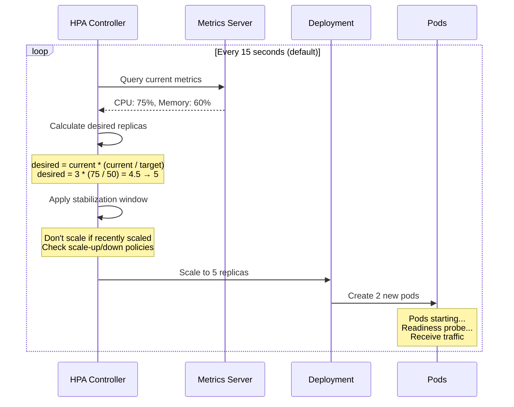
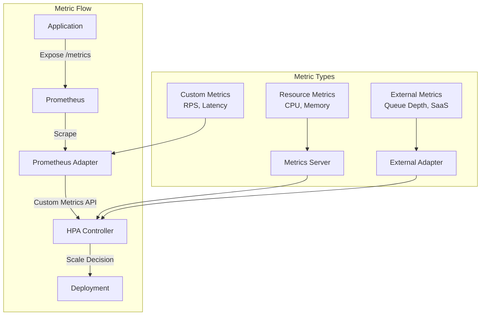
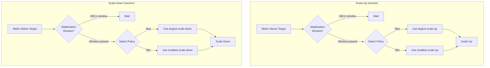
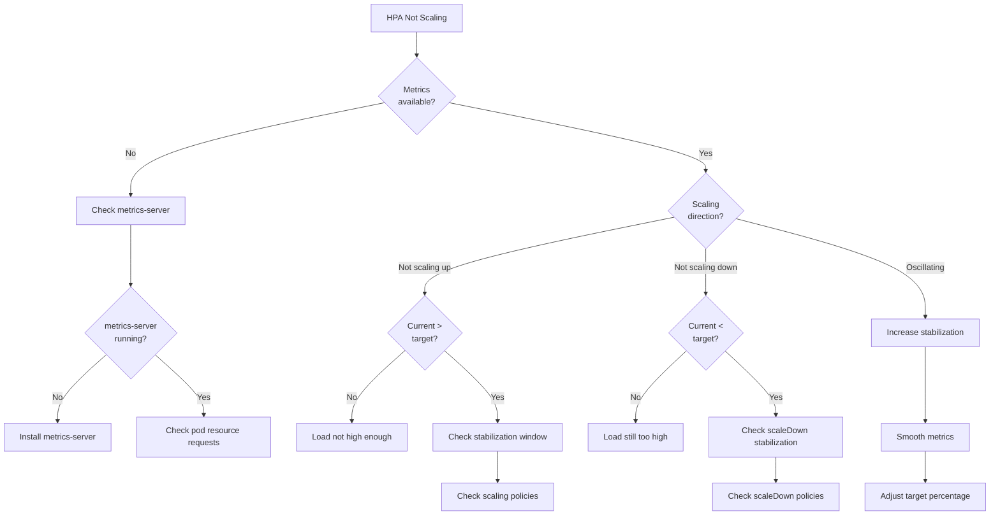

*[HPA]: Horizontal Pod Autoscaler
*[VPA]: Vertical Pod Autoscaler
*[CPU]: Central Processing Unit
*[QPS]: Queries Per Second
*[RPS]: Requests Per Second
*[P99]: 99th Percentile
*[P95]: 95th Percentile
*[SLO]: Service Level Objective
*[KEDA]: Kubernetes Event-Driven Autoscaling

# HPA Autoscaling: Signals, Delays, and Traps

## Introduction

Frame the HPA challenge: the Horizontal Pod Autoscaler is deceptively simple—set a target CPU percentage, and Kubernetes scales your pods automatically. But in production, teams discover that HPA reacts too slowly to traffic spikes, oscillates between scaling up and down, or scales on the wrong signals entirely. The gap between "HPA works" and "HPA works well for my traffic pattern" is where most autoscaling frustration lives. This section establishes that HPA tuning is about understanding the inherent delays, choosing the right metrics, and configuring stabilization to match your workload's characteristics.

_Include a scenario: an e-commerce site configures HPA with a 50% CPU target. During a flash sale, traffic spikes 10x in 30 seconds. But HPA takes 2 minutes to detect the load, another 30 seconds to scale, and another minute for new pods to become ready. By the time capacity catches up, 3+ minutes of degraded performance have occurred, and frustrated users have left. The lesson: HPA's reactive nature means you need to either tune for faster response or accept the delay and over-provision baseline capacity._

<Callout type="warning">
HPA is reactive, not predictive. By the time HPA decides to scale up, your workload is already under stress. The goal of HPA tuning is to minimize that reaction time while avoiding oscillation—a balance that requires understanding your traffic patterns.
</Callout>

## HPA Fundamentals

### How HPA Works


Figure: HPA scaling decision flow.

```yaml title="hpa-basic.yaml"
# Basic HPA configuration

apiVersion: autoscaling/v2
kind: HorizontalPodAutoscaler
metadata:
  name: api-server-hpa
  namespace: production
spec:
  scaleTargetRef:
    apiVersion: apps/v1
    kind: Deployment
    name: api-server

  # Replica bounds
  minReplicas: 3
  maxReplicas: 50

  # Scaling metrics
  metrics:
    # Resource metric: CPU utilization
    - type: Resource
      resource:
        name: cpu
        target:
          type: Utilization
          averageUtilization: 50  # Target 50% CPU across all pods

    # Resource metric: Memory utilization
    - type: Resource
      resource:
        name: memory
        target:
          type: Utilization
          averageUtilization: 70  # Target 70% memory

---
# The scaling formula:
# desiredReplicas = ceil(currentReplicas * (currentMetric / targetMetric))
#
# Example:
# - Current: 3 replicas at 75% CPU
# - Target: 50% CPU
# - Desired: ceil(3 * (75/50)) = ceil(4.5) = 5 replicas
```
Code: Basic HPA configuration.

### The Delay Problem

```yaml title="hpa-delay-breakdown.yaml"
hpa_delay_breakdown:
  total_delay: "60-180 seconds typical"

  components:
    metrics_collection:
      delay: "15 seconds"
      cause: "Metrics server scrape interval"
      configurable: "Yes (kubelet --housekeeping-interval)"

    hpa_sync:
      delay: "15 seconds (default)"
      cause: "HPA controller sync period"
      configurable: "Yes (--horizontal-pod-autoscaler-sync-period)"

    stabilization_window:
      delay: "0-300 seconds"
      cause: "Prevents flapping by waiting before scale"
      configurable: "Yes (behavior.scaleUp/scaleDown.stabilizationWindowSeconds)"

    pod_creation:
      delay: "1-10 seconds"
      cause: "Kubernetes scheduling, image pull"
      configurable: "Partially (preloaded images, priority)"

    pod_readiness:
      delay: "5-60+ seconds"
      cause: "Application startup, readiness probe"
      configurable: "Application-dependent"

  timeline_example:
    "T+0s": "Traffic spike begins"
    "T+15s": "Metrics server captures new load"
    "T+30s": "HPA evaluates and decides to scale"
    "T+30-45s": "Stabilization check passes"
    "T+45s": "New pods scheduled"
    "T+50s": "Pods start (image already cached)"
    "T+80s": "Pods pass readiness probe"
    "T+80s": "New capacity receives traffic"
    result: "80+ seconds of degraded performance"
```
Code: HPA delay breakdown.

| Delay Component | Typical Duration | Can Reduce? | How |
|-----------------|------------------|-------------|-----|
| Metrics scrape | 15s | Yes | Reduce scrape interval |
| HPA sync | 15s | Yes | Controller flag |
| Stabilization | 0-300s | Yes | behavior config |
| Pod scheduling | 1-10s | Limited | Pre-warmed nodes |
| Pod startup | 5-60s+ | Yes | Optimize app startup |
| Readiness probe | 5-30s | Yes | Tune probe timing |

Table: HPA delay components.

<Callout type="info">
The minimum realistic scale-up time is around 30-45 seconds even with aggressive tuning. If your traffic can spike faster than that, HPA alone won't save you. Consider predictive scaling, higher baseline capacity, or request queuing.
</Callout>

## Metric Selection

### CPU vs Custom Metrics

```yaml title="metric-comparison.yaml"
metric_types:
  cpu_utilization:
    pros:
      - "Built-in, no setup required"
      - "Works for compute-bound workloads"
      - "Predictable relationship to load"
    cons:
      - "Lags behind actual load (work in progress)"
      - "Doesn't reflect I/O-bound workloads"
      - "Can be misleading for async processing"
    best_for:
      - "CPU-intensive APIs"
      - "Compute workers"
      - "Synchronous request processing"

  memory_utilization:
    pros:
      - "Built-in"
      - "Good for memory-intensive workloads"
    cons:
      - "Often doesn't correlate with load"
      - "Memory is often stable regardless of traffic"
      - "Slow to decrease after load drops"
    best_for:
      - "In-memory caches"
      - "Batch processing with large datasets"

  requests_per_second:
    pros:
      - "Directly measures load"
      - "Leading indicator (increases before CPU)"
      - "Application-agnostic"
    cons:
      - "Requires custom metrics setup"
      - "Doesn't account for request complexity"
    best_for:
      - "Web APIs"
      - "High-traffic services"

  queue_depth:
    pros:
      - "Perfect for async workers"
      - "Directly measures backlog"
      - "Leading indicator"
    cons:
      - "Requires custom metrics"
      - "Need to tune threshold"
    best_for:
      - "Queue consumers"
      - "Background job processors"

  response_latency:
    pros:
      - "Reflects user experience"
      - "Catches overload before failure"
    cons:
      - "Lagging indicator"
      - "Can be noisy"
      - "Requires custom metrics"
    best_for:
      - "SLO-driven scaling"
      - "User-facing services"
```
Code: Metric type comparison.

### Custom Metrics with Prometheus

```yaml title="custom-metrics-hpa.yaml"
# HPA with custom Prometheus metrics

apiVersion: autoscaling/v2
kind: HorizontalPodAutoscaler
metadata:
  name: api-server-hpa
  namespace: production
spec:
  scaleTargetRef:
    apiVersion: apps/v1
    kind: Deployment
    name: api-server

  minReplicas: 3
  maxReplicas: 50

  metrics:
    # Scale on requests per second per pod
    - type: Pods
      pods:
        metric:
          name: http_requests_per_second
        target:
          type: AverageValue
          averageValue: "100"  # Target 100 RPS per pod

    # Scale on response latency (P95)
    - type: Pods
      pods:
        metric:
          name: http_request_duration_p95
        target:
          type: AverageValue
          averageValue: "200m"  # Target 200ms P95 latency

    # Scale on external metric (queue depth)
    - type: External
      external:
        metric:
          name: rabbitmq_queue_messages
          selector:
            matchLabels:
              queue: "order-processing"
        target:
          type: AverageValue
          averageValue: "50"  # Target 50 messages per pod

---
# Prometheus adapter configuration for custom metrics

apiVersion: v1
kind: ConfigMap
metadata:
  name: adapter-config
  namespace: custom-metrics
data:
  config.yaml: |
    rules:
      # RPS per pod
      - seriesQuery: 'http_requests_total{namespace!="",pod!=""}'
        resources:
          overrides:
            namespace: {resource: "namespace"}
            pod: {resource: "pod"}
        name:
          matches: "^(.*)_total$"
          as: "${1}_per_second"
        metricsQuery: 'sum(rate(<<.Series>>{<<.LabelMatchers>>}[2m])) by (<<.GroupBy>>)'

      # P95 latency per pod
      - seriesQuery: 'http_request_duration_seconds_bucket{namespace!="",pod!=""}'
        resources:
          overrides:
            namespace: {resource: "namespace"}
            pod: {resource: "pod"}
        name:
          as: "http_request_duration_p95"
        metricsQuery: 'histogram_quantile(0.95, sum(rate(<<.Series>>{<<.LabelMatchers>>}[2m])) by (le, <<.GroupBy>>))'
```
Code: Custom metrics HPA configuration.


Figure: Custom metrics architecture.

<Callout type="success">
The best scaling metric is one that increases before your system is stressed, not after. Requests per second and queue depth are leading indicators. CPU and latency are lagging indicators—they show problems that already exist.
</Callout>

## HPA Behavior Configuration

### Stabilization and Scaling Policies

```yaml title="hpa-behavior.yaml"
# Advanced HPA behavior configuration

apiVersion: autoscaling/v2
kind: HorizontalPodAutoscaler
metadata:
  name: api-server-hpa
  namespace: production
spec:
  scaleTargetRef:
    apiVersion: apps/v1
    kind: Deployment
    name: api-server

  minReplicas: 3
  maxReplicas: 50

  metrics:
    - type: Resource
      resource:
        name: cpu
        target:
          type: Utilization
          averageUtilization: 50

  behavior:
    # Scale-up behavior: be aggressive
    scaleUp:
      # No stabilization delay - scale up immediately
      stabilizationWindowSeconds: 0

      policies:
        # Allow adding 100% of current replicas
        - type: Percent
          value: 100
          periodSeconds: 15

        # Or add 4 pods at a time
        - type: Pods
          value: 4
          periodSeconds: 15

      # Use the policy that scales up faster
      selectPolicy: Max

    # Scale-down behavior: be conservative
    scaleDown:
      # Wait 5 minutes before scaling down
      stabilizationWindowSeconds: 300

      policies:
        # Remove max 10% of pods per minute
        - type: Percent
          value: 10
          periodSeconds: 60

        # Or remove 2 pods per minute
        - type: Pods
          value: 2
          periodSeconds: 60

      # Use the policy that scales down slower
      selectPolicy: Min
```
Code: Advanced HPA behavior configuration.

### Common Behavior Patterns

```yaml title="behavior-patterns.yaml"
behavior_patterns:
  fast_response:
    description: "For traffic that spikes quickly"
    use_case: "Flash sales, viral content"
    config:
      scaleUp:
        stabilizationWindowSeconds: 0
        policies:
          - type: Percent
            value: 200
            periodSeconds: 15
        selectPolicy: Max
      scaleDown:
        stabilizationWindowSeconds: 300
        policies:
          - type: Percent
            value: 10
            periodSeconds: 60
        selectPolicy: Min
    trade_off: "May over-scale, higher cost"

  stable_traffic:
    description: "For predictable daily patterns"
    use_case: "Business hours traffic, scheduled jobs"
    config:
      scaleUp:
        stabilizationWindowSeconds: 60
        policies:
          - type: Percent
            value: 50
            periodSeconds: 60
        selectPolicy: Max
      scaleDown:
        stabilizationWindowSeconds: 600
        policies:
          - type: Percent
            value: 20
            periodSeconds: 120
        selectPolicy: Min
    trade_off: "Slower response, more stable"

  cost_optimized:
    description: "For non-critical workloads"
    use_case: "Batch processing, internal tools"
    config:
      scaleUp:
        stabilizationWindowSeconds: 60
        policies:
          - type: Pods
            value: 2
            periodSeconds: 60
        selectPolicy: Min
      scaleDown:
        stabilizationWindowSeconds: 120
        policies:
          - type: Percent
            value: 50
            periodSeconds: 60
        selectPolicy: Max
    trade_off: "May degrade during spikes, lower cost"

  never_scale_to_zero:
    description: "Keep minimum capacity at all times"
    use_case: "Always-on services"
    config:
      scaleDown:
        policies:
          - type: Pods
            value: 0
            periodSeconds: 60
    note: "Effectively disables scale-down"
```
Code: Common HPA behavior patterns.


Figure: HPA behavior policy selection.

<Callout type="info">
The asymmetric pattern—aggressive scale-up, conservative scale-down—is correct for most workloads. Over-provisioning costs money; under-provisioning loses customers. Err on the side of too much capacity.
</Callout>

## Tuning for Traffic Patterns

### Traffic Pattern Analysis

```typescript title="traffic-analysis.ts"
// Analyze traffic patterns to tune HPA

interface TrafficPattern {
  type: 'steady' | 'diurnal' | 'spiky' | 'unpredictable';
  characteristics: {
    peakToTroughRatio: number;      // Max traffic / Min traffic
    rampUpTimeSeconds: number;       // How fast traffic increases
    rampDownTimeSeconds: number;     // How fast traffic decreases
    spikeFrequency: 'rare' | 'occasional' | 'frequent';
    predictable: boolean;
  };
}

function recommendHPAConfig(pattern: TrafficPattern): HPABehavior {
  const { peakToTroughRatio, rampUpTimeSeconds, predictable } = pattern.characteristics;

  // Fast ramp-up needs aggressive scale-up
  const scaleUpStabilization = rampUpTimeSeconds < 60 ? 0 :
                               rampUpTimeSeconds < 300 ? 30 : 60;

  // High peak:trough needs fast scaling
  const scaleUpPercent = peakToTroughRatio > 5 ? 200 :
                         peakToTroughRatio > 2 ? 100 : 50;

  // Predictable traffic can scale down faster
  const scaleDownStabilization = predictable ? 180 : 300;

  return {
    scaleUp: {
      stabilizationWindowSeconds: scaleUpStabilization,
      policies: [
        { type: 'Percent', value: scaleUpPercent, periodSeconds: 15 },
        { type: 'Pods', value: 4, periodSeconds: 15 },
      ],
      selectPolicy: 'Max',
    },
    scaleDown: {
      stabilizationWindowSeconds: scaleDownStabilization,
      policies: [
        { type: 'Percent', value: 20, periodSeconds: 60 },
      ],
      selectPolicy: 'Min',
    },
  };
}

// Example patterns
const flashSalePattern: TrafficPattern = {
  type: 'spiky',
  characteristics: {
    peakToTroughRatio: 20,      // 20x normal traffic
    rampUpTimeSeconds: 10,      // Spikes in 10 seconds
    rampDownTimeSeconds: 600,   // Fades over 10 minutes
    spikeFrequency: 'rare',
    predictable: true,          // Scheduled sales
  },
};

const businessHoursPattern: TrafficPattern = {
  type: 'diurnal',
  characteristics: {
    peakToTroughRatio: 3,       // 3x peak vs night
    rampUpTimeSeconds: 3600,    // Ramps up over an hour
    rampDownTimeSeconds: 3600,
    spikeFrequency: 'rare',
    predictable: true,
  },
};

console.log('Flash sale HPA config:', recommendHPAConfig(flashSalePattern));
console.log('Business hours HPA config:', recommendHPAConfig(businessHoursPattern));
```
Code: Traffic pattern analysis for HPA tuning.

### Combining HPA with Scheduled Scaling

```yaml title="scheduled-scaling.yaml"
# Use CronHPA or KEDA for scheduled scaling

# KEDA ScaledObject with scheduled scaling
apiVersion: keda.sh/v1alpha1
kind: ScaledObject
metadata:
  name: api-server-scaler
  namespace: production
spec:
  scaleTargetRef:
    name: api-server

  minReplicaCount: 3
  maxReplicaCount: 50

  triggers:
    # Normal CPU-based scaling
    - type: cpu
      metadata:
        type: Utilization
        value: "50"

    # Scheduled pre-scaling for known events
    - type: cron
      metadata:
        timezone: America/New_York
        # Scale up before business hours
        start: "0 8 * * 1-5"    # 8 AM Mon-Fri
        end: "0 9 * * 1-5"      # Until 9 AM
        desiredReplicas: "10"   # Start with 10 pods

    - type: cron
      metadata:
        timezone: America/New_York
        # Scale up before known flash sale
        start: "0 11 15 * *"    # 11 AM on the 15th
        end: "0 15 15 * *"      # Until 3 PM
        desiredReplicas: "30"   # Pre-provision for sale

---
# Alternative: Kubernetes CronJob to pre-scale

apiVersion: batch/v1
kind: CronJob
metadata:
  name: prescale-for-business-hours
  namespace: production
spec:
  schedule: "0 7 * * 1-5"  # 7 AM Mon-Fri
  jobTemplate:
    spec:
      template:
        spec:
          containers:
            - name: scaler
              image: bitnami/kubectl
              command:
                - /bin/sh
                - -c
                - |
                  kubectl scale deployment api-server \
                    --replicas=10 \
                    -n production
          restartPolicy: OnFailure
```
Code: Scheduled scaling for predictable traffic.

| Traffic Pattern | Scale-Up Strategy | Scale-Down Strategy | Additional Measures |
|-----------------|-------------------|---------------------|---------------------|
| Flash sales (10s spike) | 0s stabilization, 200% per 15s | 300s stabilization | Pre-scale with cron |
| Business hours (gradual) | 60s stabilization, 50% per 60s | 600s stabilization | Scheduled min replicas |
| Unpredictable spikes | 0s stabilization, 100% per 15s | 300s stabilization | Higher min replicas |
| Steady traffic | 60s stabilization, 25% per 60s | 300s stabilization | Standard HPA |

Table: HPA configuration by traffic pattern.

<Callout type="warning">
For known traffic events (sales, campaigns, TV spots), don't rely on HPA alone. Pre-scale ahead of time. HPA's job is to handle unexpected variations, not to catch up after you knew traffic was coming.
</Callout>

## Debugging HPA Issues

### Common Problems and Solutions

```yaml title="hpa-troubleshooting.yaml"
hpa_troubleshooting:
  problem_1:
    symptom: "HPA stuck at minReplicas despite high load"
    checks:
      - command: "kubectl describe hpa <name>"
        look_for: "unable to get metrics"
      - command: "kubectl get pods -n kube-system | grep metrics-server"
        look_for: "Running status"
      - command: "kubectl top pods"
        look_for: "Metrics available"
    common_causes:
      - "Metrics server not running"
      - "Pod doesn't have resource requests set"
      - "Custom metrics adapter not configured"
    fix:
      - "Install/fix metrics server"
      - "Add resource requests to pod spec"
      - "Configure prometheus adapter"

  problem_2:
    symptom: "HPA oscillates up and down rapidly"
    checks:
      - command: "kubectl describe hpa <name>"
        look_for: "ScalingActive / ScalingLimited events"
      - command: "kubectl get hpa -w"
        look_for: "Replica count changes"
    common_causes:
      - "Stabilization window too short"
      - "Target utilization too aggressive"
      - "Metrics too noisy"
    fix:
      - "Increase stabilizationWindowSeconds"
      - "Adjust target (e.g., 50% instead of 80%)"
      - "Smooth metrics with longer averaging period"

  problem_3:
    symptom: "HPA scales too slowly for traffic spikes"
    checks:
      - command: "kubectl describe hpa <name>"
        look_for: "Last scale time, stabilization events"
    common_causes:
      - "Default stabilization (300s for scale-up)"
      - "Conservative scaling policies"
      - "Slow pod startup"
    fix:
      - "Set stabilizationWindowSeconds: 0 for scale-up"
      - "Increase scaleUp policy percentages"
      - "Optimize application startup time"
      - "Pre-warm pods with higher minReplicas"

  problem_4:
    symptom: "HPA never scales down"
    checks:
      - command: "kubectl describe hpa <name>"
        look_for: "ScalingLimited reason"
      - command: "kubectl get hpa <name> -o yaml"
        look_for: "behavior.scaleDown policies"
    common_causes:
      - "Scale-down disabled in policies"
      - "Very long stabilization window"
      - "Metrics never drop below target"
    fix:
      - "Check behavior.scaleDown configuration"
      - "Reduce stabilization window"
      - "Verify metrics are actually dropping"
```
Code: HPA troubleshooting guide.

### Debugging Commands

```bash title="hpa-debugging.sh"
#!/bin/bash
# HPA debugging commands

HPA_NAME="${1:-api-server-hpa}"
NAMESPACE="${2:-production}"

echo "=== HPA Status ==="
kubectl get hpa "$HPA_NAME" -n "$NAMESPACE"

echo ""
echo "=== HPA Details ==="
kubectl describe hpa "$HPA_NAME" -n "$NAMESPACE"

echo ""
echo "=== Current Metrics ==="
kubectl get hpa "$HPA_NAME" -n "$NAMESPACE" -o jsonpath='{.status.currentMetrics}' | jq .

echo ""
echo "=== Desired Replicas Calculation ==="
kubectl get hpa "$HPA_NAME" -n "$NAMESPACE" -o jsonpath='{.status}' | jq '{
  currentReplicas: .currentReplicas,
  desiredReplicas: .desiredReplicas,
  currentMetrics: .currentMetrics
}'

echo ""
echo "=== Recent HPA Events ==="
kubectl get events -n "$NAMESPACE" \
  --field-selector involvedObject.name="$HPA_NAME" \
  --sort-by='.lastTimestamp' | tail -20

echo ""
echo "=== Pod Resource Usage ==="
kubectl top pods -n "$NAMESPACE" -l app=api-server

echo ""
echo "=== Metrics Server Health ==="
kubectl get apiservices | grep metrics

echo ""
echo "=== Watch HPA (Ctrl+C to stop) ==="
echo "kubectl get hpa $HPA_NAME -n $NAMESPACE -w"
```
Code: HPA debugging commands.


Figure: HPA debugging decision tree.

<Callout type="info">
`kubectl describe hpa` is your primary debugging tool. The "Conditions" section shows why HPA isn't scaling. "AbleToScale: False" usually means metrics issues. "ScalingLimited" means policy or stabilization constraints.
</Callout>

## Advanced Patterns

### Multi-Metric HPA

```yaml title="multi-metric-hpa.yaml"
# HPA with multiple metrics - uses the one requiring most replicas

apiVersion: autoscaling/v2
kind: HorizontalPodAutoscaler
metadata:
  name: api-server-hpa
  namespace: production
spec:
  scaleTargetRef:
    apiVersion: apps/v1
    kind: Deployment
    name: api-server

  minReplicas: 3
  maxReplicas: 50

  metrics:
    # CPU: handle compute-bound scenarios
    - type: Resource
      resource:
        name: cpu
        target:
          type: Utilization
          averageUtilization: 50

    # RPS: handle request-heavy scenarios
    - type: Pods
      pods:
        metric:
          name: http_requests_per_second
        target:
          type: AverageValue
          averageValue: "100"

    # Latency: handle degraded performance
    - type: Pods
      pods:
        metric:
          name: http_request_duration_p99_seconds
        target:
          type: Value
          value: "500m"  # Scale up if P99 > 500ms

# How multi-metric works:
# - Each metric calculates desired replicas independently
# - HPA uses the MAXIMUM of all calculations
# - Example:
#   - CPU says: 5 replicas needed
#   - RPS says: 8 replicas needed
#   - Latency says: 3 replicas needed
#   - Result: 8 replicas (highest)
```
Code: Multi-metric HPA configuration.

### KEDA for Event-Driven Scaling

```yaml title="keda-scaling.yaml"
# KEDA for advanced scaling scenarios

# Scale on queue depth
apiVersion: keda.sh/v1alpha1
kind: ScaledObject
metadata:
  name: order-processor-scaler
  namespace: production
spec:
  scaleTargetRef:
    name: order-processor

  minReplicaCount: 1
  maxReplicaCount: 100

  # Scale to zero when idle
  idleReplicaCount: 0

  # Cooldown periods
  cooldownPeriod: 300       # Wait 5 min before scaling to zero
  pollingInterval: 15       # Check metrics every 15s

  triggers:
    # RabbitMQ queue depth
    - type: rabbitmq
      metadata:
        host: amqp://rabbitmq.messaging:5672
        queueName: orders
        mode: QueueLength
        value: "10"  # 10 messages per pod

    # Also consider pending messages
    - type: rabbitmq
      metadata:
        host: amqp://rabbitmq.messaging:5672
        queueName: orders
        mode: MessageRate
        value: "50"  # 50 msg/sec per pod

---
# Scale on Prometheus metrics
apiVersion: keda.sh/v1alpha1
kind: ScaledObject
metadata:
  name: api-scaler
  namespace: production
spec:
  scaleTargetRef:
    name: api-server

  minReplicaCount: 3
  maxReplicaCount: 50

  triggers:
    - type: prometheus
      metadata:
        serverAddress: http://prometheus.monitoring:9090
        metricName: http_requests_total
        threshold: "100"
        query: |
          sum(rate(http_requests_total{deployment="api-server"}[2m]))
```
Code: KEDA for advanced scaling.

<Callout type="success">
KEDA extends HPA with support for scale-to-zero and external event sources (queues, databases, cloud services). If HPA's built-in capabilities aren't enough, KEDA is the standard solution—don't build custom scaling logic.
</Callout>

## Conclusion

Summarize the key HPA tuning principles: understand the inherent delays (metrics collection + sync + stabilization + pod startup), choose metrics that are leading indicators of load, configure aggressive scale-up with conservative scale-down, and pre-scale for known traffic events. Emphasize that HPA tuning is an iterative process—start with defaults, observe behavior under real load, and adjust based on whether you're scaling too slowly, oscillating, or wasting resources. The goal is an autoscaler that handles normal traffic variations smoothly while minimizing both cost and performance impact.

<Callout type="info">
The best HPA configuration is invisible—you never think about it because it handles traffic variations without intervention. Getting there requires measuring actual behavior, not guessing at configurations. Instrument your HPA, observe its scaling decisions, and tune based on real data.
</Callout>

---

## Cover Prompt

### Prompt 1: The Reaction Race

Create an image of a race track where an HPA controller (represented as a robot) chases a traffic spike (represented as a wave). The wave is ahead, causing visible stress on the application. Markers show "Metrics Delay," "Stabilization," "Pod Startup" as hurdles the robot must clear. Style: racing pursuit, time delay visualization, catch-up challenge, 16:9 aspect ratio.

### Prompt 2: The Scaling Dashboard

Design an image of a control room with dashboards showing traffic patterns and replica counts. Operators adjust knobs labeled "Stabilization," "Scale-Up %," "Min Replicas." Graphs show traffic (jagged line) and capacity (stepped line) with gaps between them. The goal is minimizing the gap. Style: control room, metric visualization, tuning interface, 16:9 aspect ratio.

### Prompt 3: The Asymmetric Scales

Illustrate a balance scale where one side (scale-up) has a rocket booster attached, and the other side (scale-down) has an anchor. A traffic chart shows spikes up and gradual decline. The asymmetric treatment reflects the different risks of under vs. over-provisioning. Style: weighted balance, asymmetric response, risk visualization, 16:9 aspect ratio.

### Prompt 4: The Traffic Wave

Create an image of a surfer (application) riding a traffic wave. Behind them, a fleet of pods paddles to catch up. Some pods are ready (on surfboards), others are still starting up (in the water). A timer shows the delay between wave rise and pod readiness. Style: surfing metaphor, wave timing, capacity pursuit, 16:9 aspect ratio.

### Prompt 5: The Oscillation Dampener

Design an image of a sine wave (oscillating HPA) being smoothed by a dampener labeled "Stabilization Window." Without dampening, the wave is chaotic. With dampening, it's smooth but slightly delayed. An engineer adjusts the dampener dial. Style: wave dampening, oscillation control, stability tuning, 16:9 aspect ratio.
