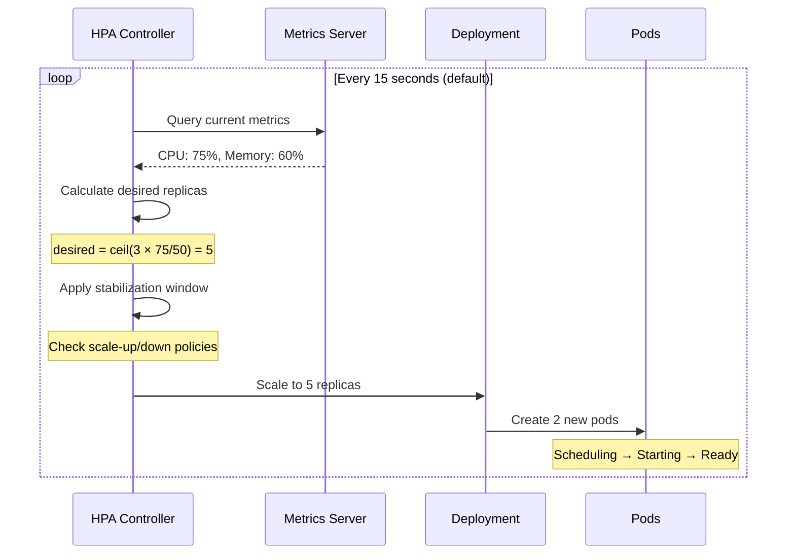
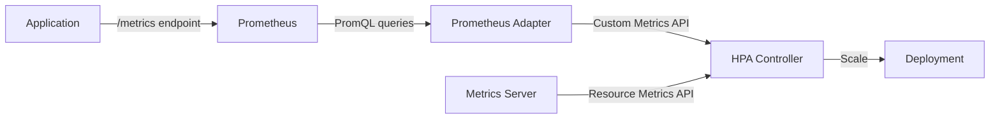
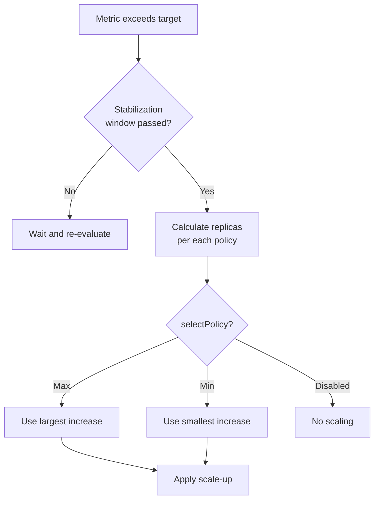
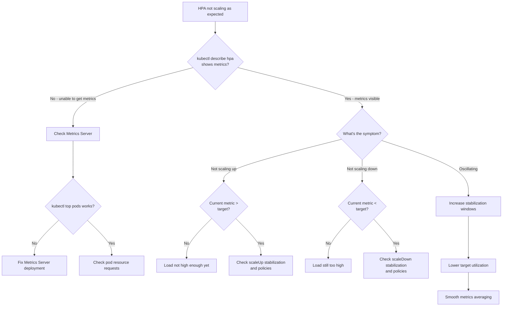

*[VPA]: Vertical Pod Autoscaler
*[QPS]: Queries Per Second
*[RPS]: Requests Per Second
*[P99]: 99th Percentile
*[P95]: 95th Percentile
*[SLO]: Service Level Objective

The Horizontal Pod Autoscaler (HPA) looks deceptively simple: set a target CPU percentage, and Kubernetes scales your pods automatically. In practice, teams discover that HPA reacts too slowly to traffic spikes, oscillates between scaling up and down, or scales on entirely the wrong signals. The gap between "HPA works" and "HPA works well for my traffic pattern" is where most autoscaling frustration lives.

I've watched this play out repeatedly. An e-commerce team configures HPA with a 50% CPU target. During a flash sale, traffic spikes 10x in 30 seconds. HPA takes 15 seconds to detect the load via the metrics server, another 15 seconds for the controller sync, then the stabilization window kicks in. Meanwhile, new pods need to be scheduled, images pulled, and readiness probes passed. By the time capacity catches up—3+ minutes later—frustrated users have already left. The service survived, but barely.

The lesson: HPA is reactive, not predictive. By the time it decides to scale, your workload is already under stress. The goal of HPA tuning is to minimize that reaction time while avoiding oscillation—a balance that requires understanding your traffic patterns, choosing the right metrics, and configuring stabilization windows that match your workload's characteristics.

<Callout type="warning" title="HPA Cannot Predict the Future">
HPA responds to current conditions, not anticipated load. If your traffic can spike faster than HPA can respond (typically 30-90 seconds minimum), you need either pre-scaling for known events, higher baseline capacity, or request queuing to absorb the delay.
</Callout>

## HPA Fundamentals

### How HPA Works

The HPA controller runs a simple loop: every 15 seconds (by default), it queries the metrics server, calculates how many replicas are needed to hit the target utilization, and adjusts the deployment accordingly. The scaling formula is straightforward:

$$
\text{desiredReplicas} = \text{currentReplicas} \times \frac{\text{currentMetric}}{\text{targetMetric}}
$$

If you have 3 replicas running at 75% CPU with a target of 50%, HPA calculates $3 \times (75/50) = 5$ replicas. The ceiling function ensures you always round up—better to have slightly more capacity than slightly less.



Figure: HPA scaling decision flow.

A basic HPA configuration targets CPU utilization across all pods. The `scaleTargetRef` points to the deployment you want to scale, and `minReplicas`/`maxReplicas` set the bounds:

```yaml title="hpa-basic.yaml"
apiVersion: autoscaling/v2
kind: HorizontalPodAutoscaler
metadata:
  name: api-server-hpa
  namespace: production
spec:
  scaleTargetRef:
    apiVersion: apps/v1
    kind: Deployment
    name: api-server

  minReplicas: 3
  maxReplicas: 50

  metrics:
    - type: Resource
      resource:
        name: cpu
        target:
          type: Utilization
          averageUtilization: 50
```

Code: Basic HPA configuration targeting 50% CPU utilization.

The 50% target might seem conservative, but it's intentional. You want headroom to absorb traffic increases while HPA scales up. A target of 80% means you're already near capacity when HPA decides to act—and by the time new pods are ready, you've been overloaded for minutes.

### The Delay Problem

The HPA loop sounds fast—15-second intervals—but the total time from "traffic spike begins" to "new capacity receives traffic" is much longer. Every step in the pipeline adds latency.

| Delay Component | Typical Duration | Can Reduce? | How |
|-----------------|------------------|-------------|-----|
| Metrics scrape | 15-60s | Yes | `--metric-resolution` flag on Metrics Server |
| HPA sync[^hpa-sync] | 15s | Yes | `--horizontal-pod-autoscaler-sync-period` flag |
| Stabilization | 0-300s | Yes | `behavior.scaleUp.stabilizationWindowSeconds` |
| Pod scheduling | 1-10s | Limited | Pre-warmed nodes, pod priority |
| Pod startup | 5-60s+ | Yes | Optimize application startup time |
| Readiness probe | 5-30s | Yes | Tune probe timing |

Table: HPA delay components and mitigation options.

[^hpa-sync]: The HPA sync period and metrics collection interval are distinct cycles that run independently. The _metrics scrape_ interval (`--metric-resolution`, defaulting to 60 seconds in many deployments) controls how often the Metrics Server polls kubelets for fresh data. The _HPA sync_ period (`--horizontal-pod-autoscaler-sync-period`, defaulting to 15 seconds) controls how often the HPA controller evaluates the metrics API and makes scaling decisions. Since these cycles aren't synchronized, worst-case latency is the sum of both intervals plus kubelet collection overhead (~10 seconds)—meaning a CPU spike could take 85+ seconds to trigger a scale-up even before stabilization delays.

Here's a best-case timeline for a traffic spike (assuming 15-second metrics resolution and cached images):

- **T+0s**: Traffic spike begins
- **T+15s**: Metrics server captures the new load
- **T+30s**: HPA evaluates and decides to scale
- **T+45s**: Stabilization check passes (assuming aggressive config)
- **T+50s**: New pods scheduled, images pulled (cached)
- **T+80s**: Pods pass readiness probe, receive traffic

That's 80+ seconds of degraded performance with _aggressive_ tuning and favorable conditions. With default settings—which include a 300-second stabilization window for scale-up in older Kubernetes versions—it's even worse.

<Callout type="info" title="Minimum Realistic Time to Scale Up">
Even with aggressive tuning, the minimum realistic time to scale up is 30-45 seconds. If your traffic can spike faster than that, HPA alone won't save you. Consider predictive scaling, higher baseline capacity, or request queuing to absorb the delay.
</Callout>

## Metric Selection

### CPU vs Custom Metrics

The metric you choose determines how quickly HPA reacts—and whether it reacts to the right signal at all. Most teams start with CPU utilization because it's built-in, but CPU is a _lagging_ indicator: by the time CPU spikes, requests are already queuing. For web services, requests per second or queue depth are _leading_ indicators that increase before your system shows stress.

| Metric Type | Pros | Cons | Best For |
|-------------|------|------|----------|
| CPU utilization | Built-in, no setup; predictable relationship to compute load | Lags behind actual load; doesn't reflect I/O-bound work; misleading for async processing | CPU-intensive APIs, compute workers, synchronous request processing |
| Memory utilization | Built-in; good for memory-intensive workloads | Often doesn't correlate with traffic; stable regardless of load; slow to decrease | In-memory caches, batch processing with large datasets |
| Requests per second | Directly measures load; leading indicator; application-agnostic | Requires custom metrics setup; doesn't account for request complexity | Web APIs, high-traffic services |
| Queue depth | Perfect for async workers; directly measures backlog; leading indicator | Requires custom metrics; threshold needs tuning | Queue consumers, background job processors |
| Response latency | Reflects user experience; catches overload before failure | Lagging indicator; can be noisy; requires custom metrics | SLO-driven scaling, user-facing services |

Table: Metric types for HPA scaling.

### Custom Metrics with Prometheus

Custom metrics let you scale on application-specific signals instead of generic resource utilization. The setup requires three components: your application exposing metrics, Prometheus scraping them, and an adapter translating Prometheus queries into the Kubernetes custom metrics API.



Figure: Custom metrics flow from application to HPA.

HPA supports three metric types, each suited to different scenarios:

- **Resource metrics** (CPU, memory): Built-in via Metrics Server. No setup required, but limited to what kubelets report.
- **Pod metrics**: Custom metrics exposed by your application and scraped by Prometheus. Queried per-pod, then averaged.
- **External metrics**: Metrics from outside Kubernetes—queue depths, SaaS API usage, database connections. Useful when scaling should respond to external systems.

Here's an HPA configuration using all three types. HPA evaluates each metric independently and scales to the _highest_ replica count any metric requests:

```yaml title="custom-metrics-hpa.yaml"
apiVersion: autoscaling/v2
kind: HorizontalPodAutoscaler
metadata:
  name: api-server-hpa
  namespace: production
spec:
  scaleTargetRef:
    apiVersion: apps/v1
    kind: Deployment
    name: api-server
  minReplicas: 3
  maxReplicas: 50
  metrics:
    # Pod metric: requests per second
    - type: Pods
      pods:
        metric:
          name: http_requests_per_second
        target:
          type: AverageValue
          averageValue: "100"  # 100 RPS per pod

    # Pod metric: P95 latency
    - type: Pods
      pods:
        metric:
          name: http_request_duration_p95
        target:
          type: AverageValue
          averageValue: "200m"  # 200ms P95 target

    # External metric: queue depth
    - type: External
      external:
        metric:
          name: rabbitmq_queue_messages
          selector:
            matchLabels:
              queue: order-processing
        target:
          type: AverageValue
          averageValue: "50"  # 50 messages per pod
```

Code: HPA with pod metrics (RPS, latency) and external metrics (queue depth).

The Prometheus Adapter translates PromQL queries into the custom metrics API format. Each rule maps a Prometheus metric to a Kubernetes resource (namespace, pod) and defines how to query it:

```yaml title="prometheus-adapter-config.yaml"
apiVersion: v1
kind: ConfigMap
metadata:
  name: adapter-config
  namespace: custom-metrics
data:
  config.yaml: |
    rules:
      # Convert http_requests_total counter to per-second rate
      - seriesQuery: 'http_requests_total{namespace!="",pod!=""}'
        resources:
          overrides:
            namespace: {resource: "namespace"}
            pod: {resource: "pod"}
        name:
          matches: "^(.*)_total$"
          as: "${1}_per_second"
        metricsQuery: 'sum(rate(<<.Series>>{<<.LabelMatchers>>}[2m])) by (<<.GroupBy>>)'

      # Calculate P95 from histogram buckets
      - seriesQuery: 'http_request_duration_seconds_bucket{namespace!="",pod!=""}'
        resources:
          overrides:
            namespace: {resource: "namespace"}
            pod: {resource: "pod"}
        name:
          as: "http_request_duration_p95"
        metricsQuery: 'histogram_quantile(0.95, sum(rate(<<.Series>>{<<.LabelMatchers>>}[2m])) by (le, <<.GroupBy>>))'
```

Code: Prometheus Adapter configuration for RPS and P95 latency metrics.

The `[2m]` window in the PromQL queries smooths out brief spikes. A shorter window (30 seconds) makes scaling more responsive but increases oscillation risk. A longer window (5 minutes) stabilizes scaling but delays reaction to genuine load changes. Two minutes is a reasonable starting point.

<Callout type="success" title="Leading vs Lagging Indicators">
When possible, scale on leading indicators (RPS, queue depth) rather than lagging ones (CPU, latency). By the time CPU spikes, requests are already queuing.
</Callout>

## HPA Behavior Configuration

### Stabilization and Scaling Policies

The `behavior` field in HPA v2 gives you fine-grained control over scaling speed. Two mechanisms work together: _stabilization windows_ prevent thrashing by requiring metrics to stay above/below thresholds for a duration before acting, and _scaling policies_ limit how many replicas can be added or removed per time period.

The key insight is that scaling up and scaling down should be asymmetric. When traffic spikes, you want capacity _now_—waiting costs customer experience. When traffic drops, you want to wait—scaling down too fast means you'll scale right back up if traffic returns, wasting the pods you just terminated.

```yaml title="hpa-behavior.yaml"
apiVersion: autoscaling/v2
kind: HorizontalPodAutoscaler
metadata:
  name: api-server-hpa
  namespace: production
spec:
  scaleTargetRef:
    apiVersion: apps/v1
    kind: Deployment
    name: api-server
  minReplicas: 3
  maxReplicas: 50
  metrics:
    - type: Resource
      resource:
        name: cpu
        target:
          type: Utilization
          averageUtilization: 50
  behavior:
    scaleUp:
      stabilizationWindowSeconds: 0        # Scale immediately
      policies:
        - type: Percent
          value: 100                        # Double capacity
          periodSeconds: 15
        - type: Pods
          value: 4                          # Or add 4 pods
          periodSeconds: 15
      selectPolicy: Max                     # Use whichever adds more

    scaleDown:
      stabilizationWindowSeconds: 300       # Wait 5 minutes
      policies:
        - type: Percent
          value: 10                         # Remove 10% of pods
          periodSeconds: 60
        - type: Pods
          value: 2                          # Or remove 2 pods
          periodSeconds: 60
      selectPolicy: Min                     # Use whichever removes fewer
```

Code: Asymmetric HPA behavior—aggressive scale-up, conservative scale-down.

The `selectPolicy` field determines how HPA chooses between multiple policies:

- **Max**: Use the policy that results in the largest change. For scale-up, this means adding the most pods. Good for aggressive scaling.
- **Min**: Use the policy that results in the smallest change. For scale-down, this means removing the fewest pods. Good for conservative scaling.
- **Disabled**: Don't scale in this direction at all.



Figure: HPA policy selection flow.

### Common Behavior Patterns

Different traffic patterns call for different behavior configurations. The tradeoff is always between responsiveness (scale fast to handle spikes) and stability (avoid oscillation and wasted resources).

| Pattern | Use Case | Scale-Up | Scale-Down | Tradeoff |
|---------|----------|----------|------------|----------|
| Fast response | Flash sales, viral content | 0s stabilization, 200%/15s, Max | 300s stabilization, 10%/60s, Min | May over-provision, higher cost |
| Stable traffic | Business hours, scheduled jobs | 60s stabilization, 50%/60s, Max | 600s stabilization, 20%/120s, Min | Slower response, more stable |
| Cost optimized | Batch processing, internal tools | 60s stabilization, 2 pods/60s, Min | 120s stabilization, 50%/60s, Max | May degrade during spikes, lower cost |
| Never scale down | Always-on services | Normal policies | 0 pods/60s (effectively disabled) | Maximum availability, maximum cost |

Table: HPA behavior patterns by traffic type.

For flash sales or viral traffic, you want the most aggressive scale-up possible. Zero stabilization means HPA acts on the first evaluation that shows high load. A 200% policy means you can double capacity every 15 seconds—going from 5 to 10 to 20 to 40 pods in under a minute if needed:

```yaml title="flash-sale-behavior.yaml"
behavior:
  scaleUp:
    stabilizationWindowSeconds: 0
    policies:
      - type: Percent
        value: 200
        periodSeconds: 15
    selectPolicy: Max
  scaleDown:
    stabilizationWindowSeconds: 300
    policies:
      - type: Percent
        value: 10
        periodSeconds: 60
    selectPolicy: Min
```

Code: Aggressive scale-up for flash sale traffic.

For predictable business-hours traffic, you can afford slower scaling. A 60-second stabilization window filters out brief metric noise, and a 50% scale-up rate is fast enough to handle gradual morning ramp-up without over-provisioning:

```yaml title="business-hours-behavior.yaml"
behavior:
  scaleUp:
    stabilizationWindowSeconds: 60
    policies:
      - type: Percent
        value: 50
        periodSeconds: 60
    selectPolicy: Max
  scaleDown:
    stabilizationWindowSeconds: 600
    policies:
      - type: Percent
        value: 20
        periodSeconds: 120
    selectPolicy: Min
```

Code: Moderate scaling for predictable daily traffic.

<Callout type="info" title="Asymmetric Scaling Is Usually Correct">
The pattern of aggressive scale-up and conservative scale-down fits most workloads. Over-provisioning wastes money; under-provisioning loses customers. When in doubt, err on the side of too much capacity. You can always tune down the aggressiveness once you understand your traffic patterns.
</Callout>

## Tuning for Traffic Patterns

The "right" HPA configuration depends entirely on your traffic. An e-commerce site with predictable business-hours traffic needs different settings than a social platform that might go viral at any moment. Generic configurations either scale too slowly for spiky traffic or waste money on stable traffic. Understanding your traffic patterns lets you tune HPA for your specific tradeoffs.

### Traffic Pattern Analysis

Before tuning HPA, you need to understand your traffic. Four characteristics matter most:

1. **Peak-to-trough ratio**: How much does traffic vary? A 3x ratio (business hours vs night) is manageable. A 20x ratio (flash sale) requires aggressive scaling.
2. **Ramp-up time**: How fast does traffic increase? Gradual morning ramp-up over an hour is easy. A spike in 10 seconds is hard.
3. **Predictability**: Do you know when traffic will increase? Scheduled events can be pre-scaled. Random viral content cannot.
4. **Spike frequency**: Rare spikes justify aggressive over-provisioning. Frequent spikes need tighter cost control.

These characteristics map to specific HPA strategies. The table below shows common traffic patterns and the scaling approaches that work best for each:

| Traffic Type | Peak:Trough | Ramp-Up | Predictable | Recommended Strategy |
|--------------|-------------|---------|-------------|---------------------|
| Business hours | 2-5x | 1-2 hours | Yes | Scheduled pre-scaling + moderate HPA |
| Flash sales | 10-50x | Seconds | Yes | Aggressive pre-scaling + fast HPA |
| Viral content | 5-100x | Minutes | No | High baseline + aggressive HPA |
| Steady API | 1.5-2x | Gradual | N/A | Standard HPA, optimize for cost |

Table: Traffic pattern characteristics and scaling strategies.

The key insight is that HPA alone can't handle instantaneous spikes. If traffic can increase 10x in 10 seconds, you need capacity _already running_ when the spike hits. HPA's role becomes handling the variance around your pre-provisioned baseline, not catching up from zero.

### Combining HPA with Scheduled Scaling

For predictable traffic patterns, combine HPA with scheduled scaling. KEDA (Kubernetes Event-Driven Autoscaling) supports cron triggers that set minimum replica counts at specific times, while HPA handles real-time adjustments within those bounds.

```yaml title="keda-scheduled-scaling.yaml"
apiVersion: keda.sh/v1alpha1
kind: ScaledObject
metadata:
  name: api-server-scaler
  namespace: production
spec:
  scaleTargetRef:
    name: api-server
  minReplicaCount: 3
  maxReplicaCount: 50
  triggers:
    # Baseline: CPU-based reactive scaling
    - type: cpu
      metadata:
        type: Utilization
        value: "50"

    # Pre-scale for business hours (8 AM Mon-Fri)
    - type: cron
      metadata:
        timezone: America/New_York
        start: "0 8 * * 1-5"
        end: "0 9 * * 1-5"
        desiredReplicas: "10"

    # Pre-scale for known flash sale (15th of month)
    - type: cron
      metadata:
        timezone: America/New_York
        start: "0 11 15 * *"
        end: "0 15 15 * *"
        desiredReplicas: "30"
```

Code: KEDA ScaledObject combining CPU-based HPA with scheduled pre-scaling.

If you don't have KEDA, a simple CronJob can pre-scale deployments before known traffic events:

```yaml title="prescale-cronjob.yaml"
apiVersion: batch/v1
kind: CronJob
metadata:
  name: prescale-for-business-hours
  namespace: production
spec:
  schedule: "0 7 * * 1-5"  # 7 AM Mon-Fri, 1 hour before peak
  jobTemplate:
    spec:
      template:
        spec:
          serviceAccountName: scaler-sa  # Needs patch permissions
          containers:
            - name: scaler
              image: bitnami/kubectl:latest
              command: ["kubectl", "scale", "deployment/api-server",
                        "--replicas=10", "-n", "production"]
          restartPolicy: OnFailure
```

Code: CronJob for pre-scaling before business hours.

The pattern is simple: pre-scale 30-60 minutes before expected traffic, then let HPA handle the actual load. If your prediction was low, HPA scales up. If your prediction was high, HPA (eventually) scales down. Either way, you're not scrambling to add capacity while users wait.

<Callout type="warning" title="Don't Rely on HPA for Planned Events">
If you know traffic is coming—a sale, a marketing campaign, a TV appearance—pre-scale. HPA's job is handling _unexpected_ variance, not catching up to traffic you knew about. The 30-90 second HPA response time is unacceptable when you could have had pods ready hours in advance.
</Callout>

## Debugging HPA Issues

HPA failures are frustrating because they're often silent—you don't notice until traffic spikes and capacity doesn't follow. The good news is that HPA exposes its decision-making through `kubectl describe hpa`, and most problems fall into a few categories: metrics unavailable, scaling too slow, oscillating, or not scaling down.

### Common Problems and Solutions

**Problem: HPA stuck at minReplicas despite high load**

This usually means HPA can't see your metrics. Check the Conditions section in `kubectl describe hpa`—look for "unable to get metrics" or "AbleToScale: False". The most common causes:

- Metrics Server not running or unhealthy
- Pods missing resource requests (HPA can't calculate utilization without knowing the baseline)
- Custom metrics adapter not configured for non-CPU metrics

```bash
# Check if metrics are available
kubectl top pods -n production

# Check metrics server health
kubectl get apiservices | grep metrics

# Verify pods have resource requests
kubectl get pod <pod-name> -o jsonpath='{.spec.containers[*].resources.requests}'
```

Code: Diagnosing missing metrics.

**Problem: HPA oscillates rapidly between replica counts**

Thrashing—scaling up, then immediately scaling down, then up again—indicates either too-short stabilization windows or too-aggressive targets. Watch the replica count over time:

```bash
# Watch HPA changes in real-time
kubectl get hpa api-server-hpa -n production -w

# Check recent scaling events
kubectl describe hpa api-server-hpa -n production | grep -A 20 "Events:"
```

Code: Monitoring HPA oscillation.

Fixes: Increase `stabilizationWindowSeconds` (especially for scale-down), lower the target utilization (50% instead of 80%), or smooth your metrics with longer averaging windows in your Prometheus queries.

**Problem: HPA scales too slowly for traffic spikes**

If HPA is working but not fast enough, check the behavior configuration. Default stabilization windows (especially the 300-second scale-up window in older Kubernetes versions) add significant delay.

```bash
# Check current behavior configuration
kubectl get hpa api-server-hpa -n production -o yaml | grep -A 30 "behavior:"

# Check last scale time
kubectl describe hpa api-server-hpa -n production | grep "Last Scale Time"
```

Code: Checking HPA behavior configuration.

Fixes: Set `scaleUp.stabilizationWindowSeconds: 0`, increase scale-up policy percentages, optimize pod startup time, or raise `minReplicas` to maintain headroom.

**Problem: HPA never scales down**

Pods sitting idle waste money. If HPA won't scale down even when load is low, check whether scale-down is accidentally disabled or the stabilization window is extremely long.

```bash
# Check scale-down policies
kubectl get hpa api-server-hpa -n production -o jsonpath='{.spec.behavior.scaleDown}' | jq .

# Verify metrics are actually below target
kubectl get hpa api-server-hpa -n production
```

Code: Diagnosing scale-down failures.

Look for `selectPolicy: Disabled` in scale-down, or a policy with `value: 0` that prevents any pod removal.

### Debugging Decision Tree

When HPA isn't behaving as expected, work through this diagnostic flow:



Figure: HPA debugging decision tree.

### Essential Debugging Commands

These commands cover most HPA debugging scenarios:

```bash title="hpa-debug.sh"
#!/bin/bash
HPA="api-server-hpa"
NS="production"

# Quick status check
kubectl get hpa $HPA -n $NS

# Full details including conditions and events
kubectl describe hpa $HPA -n $NS

# Current metrics in JSON format
kubectl get hpa $HPA -n $NS -o jsonpath='{.status.currentMetrics}' | jq .

# Scaling history from events
kubectl get events -n $NS \
  --field-selector involvedObject.name=$HPA \
  --sort-by='.lastTimestamp' | tail -15

# Current pod resource usage
kubectl top pods -n $NS -l app=api-server
```

Code: Essential HPA debugging commands.

<Callout type="info" title="kubectl describe hpa Is Your Best Friend">
The Conditions section of `kubectl describe hpa` tells you exactly why HPA is or isn't scaling. "AbleToScale: False" means metrics problems. "ScalingLimited" means policy or min/max constraints. "ScalingActive: True" with no changes means the current replica count already matches the target. Start there before digging deeper.
</Callout>

## Advanced Patterns

Standard HPA covers most use cases, but some scenarios require more sophisticated approaches: combining multiple metrics so any bottleneck triggers scaling, scaling to zero for idle workloads, or handling event-driven architectures where traditional metrics don't apply.

### Multi-Metric HPA

HPA can evaluate multiple metrics simultaneously. When you configure several metrics, HPA calculates the desired replica count for each and uses the _maximum_—the metric requiring the most replicas wins. This ensures you scale up when _any_ resource becomes constrained, not just one.

```yaml title="multi-metric-hpa.yaml"
apiVersion: autoscaling/v2
kind: HorizontalPodAutoscaler
metadata:
  name: api-server-hpa
  namespace: production
spec:
  scaleTargetRef:
    apiVersion: apps/v1
    kind: Deployment
    name: api-server
  minReplicas: 3
  maxReplicas: 50
  metrics:
    # CPU: catches compute-bound bottlenecks
    - type: Resource
      resource:
        name: cpu
        target:
          type: Utilization
          averageUtilization: 50

    # RPS: catches request-heavy scenarios before CPU spikes
    - type: Pods
      pods:
        metric:
          name: http_requests_per_second
        target:
          type: AverageValue
          averageValue: "100"

    # Latency: catches degraded performance regardless of cause
    - type: Pods
      pods:
        metric:
          name: http_request_duration_p99_seconds
        target:
          type: AverageValue
          averageValue: "500m"  # Scale if P99 > 500ms
```

Code: Multi-metric HPA using CPU, RPS, and latency.

Here's how the calculation works. Suppose current state is 5 replicas:

- **CPU metric**: 60% utilization, target 50% → $5 \times (60/50) = 6$ replicas
- **RPS metric**: 120 RPS/pod, target 100 → $5 \times (120/100) = 6$ replicas
- **Latency metric**: 400ms P99, target 500ms → $5 \times (400/500) = 4$ replicas

HPA takes the maximum: 6 replicas. The latency metric calculates fewer replicas than currently running (4 < 5), which would suggest scaling down if it were the only metric—but CPU and RPS both want more capacity, so we scale up. This "max wins" behavior ensures you don't under-provision when _any_ metric indicates stress.

This pattern is particularly useful for services with mixed workloads—some requests are CPU-heavy, others are I/O-heavy. A single metric might miss bottlenecks that only affect certain request types.

### KEDA for Event-Driven Scaling

KEDA (Kubernetes Event-Driven Autoscaling) extends HPA with two capabilities standard HPA lacks: scaling to zero, and scaling on external event sources like message queues, databases, or cloud services.

For queue-based workers, KEDA scales based on queue depth rather than pod metrics. When the queue is empty, KEDA can scale to zero pods, saving resources. When messages arrive, KEDA spins up pods to process them:

```yaml title="keda-queue-scaling.yaml"
apiVersion: keda.sh/v1alpha1
kind: ScaledObject
metadata:
  name: order-processor-scaler
  namespace: production
spec:
  scaleTargetRef:
    name: order-processor
  minReplicaCount: 1
  maxReplicaCount: 100
  idleReplicaCount: 0           # Scale to zero when idle
  cooldownPeriod: 300           # Wait 5 min before scaling to zero
  pollingInterval: 15           # Check queue every 15s
  triggers:
    - type: rabbitmq
      metadata:
        host: amqp://rabbitmq.messaging:5672
        queueName: orders
        mode: QueueLength
        value: "10"             # Target 10 messages per pod
    - type: rabbitmq
      metadata:
        host: amqp://rabbitmq.messaging:5672
        queueName: orders
        mode: MessageRate
        value: "50"             # Also consider message arrival rate
```

Code: KEDA scaling queue workers based on RabbitMQ depth.

KEDA also supports Prometheus as a trigger source, letting you scale on any metric Prometheus collects—including business metrics like active users or transaction volume:

```yaml title="keda-prometheus-scaling.yaml"
apiVersion: keda.sh/v1alpha1
kind: ScaledObject
metadata:
  name: api-scaler
  namespace: production
spec:
  scaleTargetRef:
    name: api-server
  minReplicaCount: 3
  maxReplicaCount: 50
  triggers:
    - type: prometheus
      metadata:
        serverAddress: http://prometheus.monitoring:9090
        threshold: "100"
        query: sum(rate(http_requests_total{deployment="api-server"}[2m]))
```

Code: KEDA scaling on Prometheus metrics.

The key difference from standard HPA with Prometheus Adapter is KEDA's native support for scale-to-zero and its simpler configuration for external sources. If you need either capability, KEDA is the standard solution.

<Callout type="success" title="When to Use KEDA">
Use KEDA when you need scale-to-zero (queue workers, batch jobs, dev environments) or when scaling on external sources (message queues, databases, cloud service metrics). For standard CPU/memory/custom-metrics scaling without scale-to-zero, native HPA is simpler and has fewer moving parts.
</Callout>

## Conclusion

HPA tuning comes down to four principles:

**Understand the delays.** The path from "traffic spike" to "new pod serving requests" includes metrics collection (15-60s), HPA sync (15s), stabilization windows (0-300s), pod scheduling (1-10s), container startup (5-60s), and readiness probes (5-30s). With defaults, you're looking at 90+ seconds minimum. Aggressive tuning can get you to 30-45 seconds, but no faster. If your traffic can spike harder than that, HPA alone won't save you.

**Choose leading indicators.** CPU and latency are lagging indicators—they show problems that already exist. Requests per second and queue depth are leading indicators—they spike the moment traffic arrives, before your system shows stress. Scale on what's coming, not what's already hurting.

**Scale up fast, scale down slow.** The asymmetric pattern fits most workloads: zero stabilization on scale up so you respond immediately, 5+ minute stabilization on scale down so you don't thrash. Over-provisioning costs money. Under-provisioning loses customers. When in doubt, err toward more capacity.

**Pre-scale for known events.** HPA handles unexpected variance. It shouldn't be catching up to traffic you knew about. Flash sales, marketing campaigns, scheduled batch jobs—pre-scale hours in advance with cron triggers or KEDA. Let HPA handle the variance around your pre-provisioned baseline.

The tuning process is iterative. Start with defaults, run under real load, and watch what happens. If you're scaling too slowly, reduce stabilization windows and increase policy percentages. If you're oscillating, increase stabilization and lower your target utilization. If you're wasting money on idle pods, tighten scale-down policies or raise target utilization. There's no universal "best" configuration—only the configuration that matches your traffic pattern.

<Callout type="info" title="The Goal Is Invisibility">
The best HPA configuration is one you never think about. Traffic varies, capacity adjusts, users don't notice. Getting there requires measuring actual behavior—not guessing at configurations. Instrument your HPA, watch its scaling decisions under real load, and tune based on data. The article's examples are starting points, not destinations.
</Callout>
