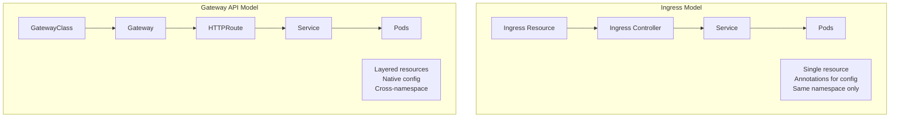
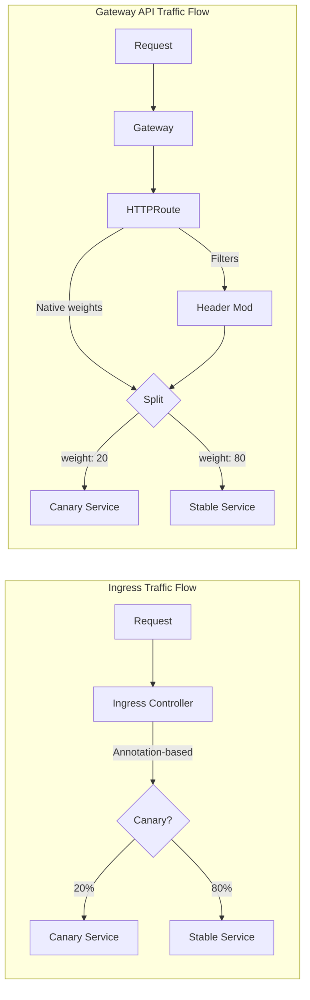
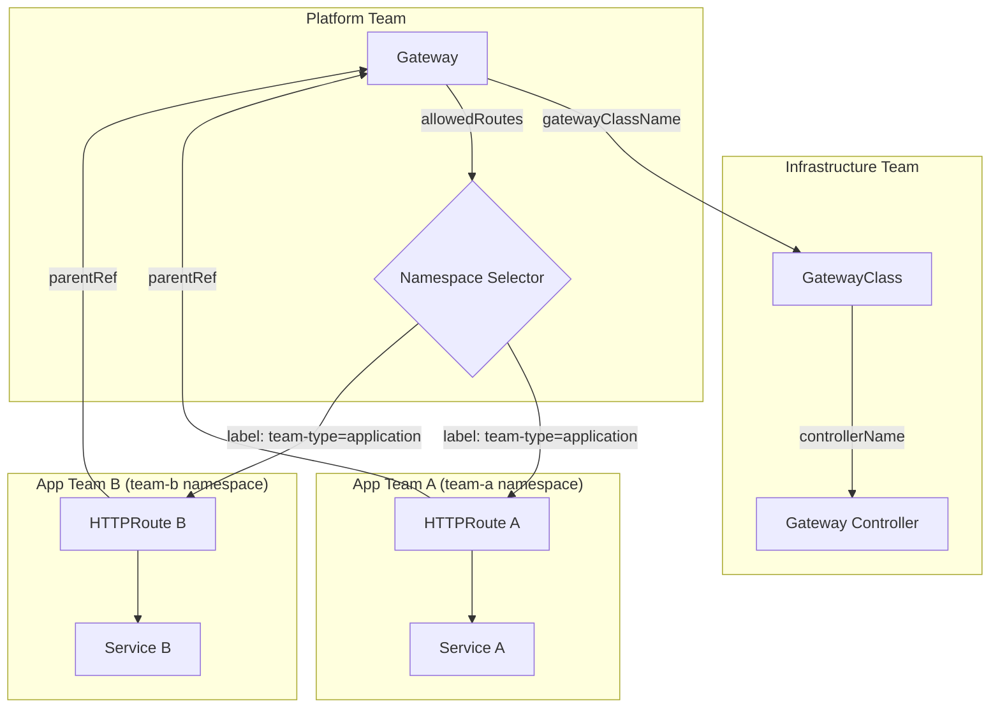
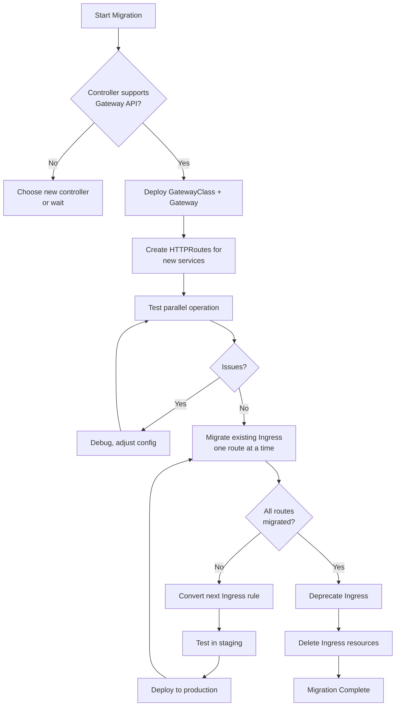
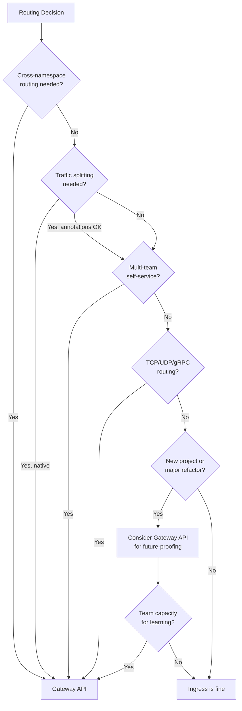

*[API]: Application Programming Interface
*[HTTP]: Hypertext Transfer Protocol
*[HTTPS]: HTTP Secure
*[TLS]: Transport Layer Security
*[TCP]: Transmission Control Protocol
*[UDP]: User Datagram Protocol
*[gRPC]: Google Remote Procedure Call
*[SNI]: Server Name Indication
*[CRD]: Custom Resource Definition
*[RBAC]: Role-Based Access Control

# Ingress vs Gateway API: A Practical Comparison

## Introduction

Frame the Ingress vs Gateway API decision: Kubernetes Ingress has been the standard for HTTP routing since 2015, but its limitations led to every ingress controller implementing different annotations and behaviors. Gateway API, launched in 2020 and reaching GA in 2023, addresses these limitations with a more expressive, portable, and role-oriented design. But more powerful doesn't always mean better for your use case. This section establishes that the choice between Ingress and Gateway API depends on your current tooling, team structure, and routing requirements—not on which technology is newer.

_Include a scenario: a team running NGINX Ingress Controller considers migrating to Gateway API because "it's the future." They discover that their simple host-based routing with TLS termination works perfectly with Ingress, and Gateway API would add complexity without new capabilities. Meanwhile, another team managing a multi-tenant platform with complex traffic splitting and cross-namespace routing finds Gateway API solves problems they've been working around with hacky Ingress annotations. The lesson: evaluate based on your actual requirements, not industry hype._

<Callout type="info">
Gateway API isn't a replacement for Ingress—it's an alternative with different tradeoffs. Ingress is simpler and more mature. Gateway API is more powerful and more portable. Both will coexist for years. Choose based on what you need today.
</Callout>

## Understanding the Models

### Ingress Model

```yaml title="ingress-model.yaml"
# Ingress: Simple, flat model
# One resource type handles routing + TLS + backend configuration

apiVersion: networking.k8s.io/v1
kind: Ingress
metadata:
  name: web-ingress
  namespace: production
  annotations:
    # Controller-specific configuration (not portable)
    nginx.ingress.kubernetes.io/rewrite-target: /
    nginx.ingress.kubernetes.io/ssl-redirect: "true"
    nginx.ingress.kubernetes.io/proxy-body-size: "50m"
    # Different controller = different annotations
    # kubernetes.io/ingress.class: "nginx"  # deprecated
spec:
  ingressClassName: nginx  # Which controller handles this
  tls:
    - hosts:
        - api.example.com
      secretName: api-tls-secret
  rules:
    - host: api.example.com
      http:
        paths:
          - path: /v1
            pathType: Prefix
            backend:
              service:
                name: api-v1
                port:
                  number: 80
          - path: /v2
            pathType: Prefix
            backend:
              service:
                name: api-v2
                port:
                  number: 80

---
# Ingress limitations:
# 1. Only HTTP/HTTPS (no TCP, UDP, gRPC native)
# 2. Controller-specific annotations (not portable)
# 3. Single namespace scope
# 4. Limited traffic manipulation
# 5. No role separation (infra vs app teams)
```
Code: Ingress model and limitations.

### Gateway API Model

```yaml title="gateway-api-model.yaml"
# Gateway API: Layered, role-oriented model
# Separates infrastructure from application routing

# Layer 1: GatewayClass (cluster-scoped, managed by infra team)
# Defines which controller implements the Gateway
apiVersion: gateway.networking.k8s.io/v1
kind: GatewayClass
metadata:
  name: production-gateway-class
spec:
  controllerName: gateway.nginx.org/nginx-gateway-controller
  description: "Production NGINX Gateway"

---
# Layer 2: Gateway (namespace-scoped, managed by platform team)
# Defines listeners (ports, protocols, TLS)
apiVersion: gateway.networking.k8s.io/v1
kind: Gateway
metadata:
  name: production-gateway
  namespace: gateway-infra
spec:
  gatewayClassName: production-gateway-class
  listeners:
    - name: https
      port: 443
      protocol: HTTPS
      hostname: "*.example.com"
      tls:
        mode: Terminate
        certificateRefs:
          - name: wildcard-tls
            namespace: gateway-infra
      allowedRoutes:
        namespaces:
          from: Selector
          selector:
            matchLabels:
              gateway-access: "true"

    - name: http
      port: 80
      protocol: HTTP
      hostname: "*.example.com"
      allowedRoutes:
        namespaces:
          from: Same

---
# Layer 3: HTTPRoute (namespace-scoped, managed by app teams)
# Defines routing rules, can reference Gateway in other namespace
apiVersion: gateway.networking.k8s.io/v1
kind: HTTPRoute
metadata:
  name: api-routes
  namespace: production  # App team's namespace
spec:
  parentRefs:
    - name: production-gateway
      namespace: gateway-infra  # Cross-namespace reference!
  hostnames:
    - "api.example.com"
  rules:
    - matches:
        - path:
            type: PathPrefix
            value: /v1
      backendRefs:
        - name: api-v1
          port: 80

    - matches:
        - path:
            type: PathPrefix
            value: /v2
      backendRefs:
        - name: api-v2
          port: 80
```
Code: Gateway API layered model.


Figure: Ingress vs Gateway API model comparison.

| Aspect | Ingress | Gateway API |
|--------|---------|-------------|
| Resource types | 1 (Ingress) | 3+ (GatewayClass, Gateway, *Route) |
| Configuration | Annotations (not portable) | Native fields (portable) |
| Namespace scope | Same namespace only | Cross-namespace supported |
| Protocols | HTTP/HTTPS | HTTP, HTTPS, TCP, UDP, gRPC, TLS |
| Traffic splitting | Annotation-dependent | Native support |
| Header manipulation | Annotation-dependent | Native filters |
| Role separation | No | Yes (infra/platform/app) |

Table: Ingress vs Gateway API comparison.

<Callout type="warning">
Gateway API's layered model adds complexity. If you don't need cross-namespace routing, traffic splitting, or role separation, the extra layers are overhead without benefit. Ingress's simplicity is a feature, not a limitation.
</Callout>

## Feature Comparison

### Routing Capabilities

```yaml title="routing-comparison.yaml"
routing_capabilities:
  path_matching:
    ingress:
      types: ["Exact", "Prefix", "ImplementationSpecific"]
      example: |
        path: /api
        pathType: Prefix
    gateway_api:
      types: ["Exact", "PathPrefix", "RegularExpression"]
      example: |
        path:
          type: RegularExpression
          value: "/api/v[0-9]+/.*"

  header_matching:
    ingress: "Not supported natively (annotation-dependent)"
    gateway_api:
      supported: true
      example: |
        matches:
          - headers:
              - name: X-Version
                value: beta
            path:
              type: PathPrefix
              value: /api

  query_parameter_matching:
    ingress: "Not supported"
    gateway_api:
      supported: true
      example: |
        matches:
          - queryParams:
              - name: debug
                value: "true"

  method_matching:
    ingress: "Not supported"
    gateway_api:
      supported: true
      example: |
        matches:
          - method: POST
            path:
              type: Exact
              value: /api/submit
```
Code: Routing capability comparison.

### Traffic Management

```yaml title="traffic-management-comparison.yaml"
# Traffic splitting: Ingress (nginx example with annotations)
apiVersion: networking.k8s.io/v1
kind: Ingress
metadata:
  name: canary-ingress
  annotations:
    nginx.ingress.kubernetes.io/canary: "true"
    nginx.ingress.kubernetes.io/canary-weight: "20"
spec:
  ingressClassName: nginx
  rules:
    - host: api.example.com
      http:
        paths:
          - path: /
            pathType: Prefix
            backend:
              service:
                name: api-canary
                port:
                  number: 80

---
# Traffic splitting: Gateway API (native support)
apiVersion: gateway.networking.k8s.io/v1
kind: HTTPRoute
metadata:
  name: api-route
spec:
  parentRefs:
    - name: production-gateway
  hostnames:
    - api.example.com
  rules:
    - backendRefs:
        - name: api-stable
          port: 80
          weight: 80
        - name: api-canary
          port: 80
          weight: 20

---
# Header manipulation: Gateway API
apiVersion: gateway.networking.k8s.io/v1
kind: HTTPRoute
metadata:
  name: api-route-with-headers
spec:
  parentRefs:
    - name: production-gateway
  rules:
    - matches:
        - path:
            type: PathPrefix
            value: /api
      filters:
        # Add request headers
        - type: RequestHeaderModifier
          requestHeaderModifier:
            add:
              - name: X-Request-ID
                value: "${request_id}"
            set:
              - name: X-Forwarded-Proto
                value: https
            remove:
              - X-Internal-Header

        # Add response headers
        - type: ResponseHeaderModifier
          responseHeaderModifier:
            add:
              - name: X-Response-Time
                value: "${upstream_response_time}"

      backendRefs:
        - name: api-service
          port: 80

---
# URL rewriting: Gateway API
apiVersion: gateway.networking.k8s.io/v1
kind: HTTPRoute
metadata:
  name: rewrite-route
spec:
  parentRefs:
    - name: production-gateway
  rules:
    - matches:
        - path:
            type: PathPrefix
            value: /api/v1
      filters:
        - type: URLRewrite
          urlRewrite:
            path:
              type: ReplacePrefixMatch
              replacePrefixMatch: /v1
      backendRefs:
        - name: api-service
          port: 80
```
Code: Traffic management comparison.


Figure: Traffic management flow comparison.

<Callout type="success">
Gateway API's native traffic splitting and header manipulation are its strongest advantages. If you're currently using complex Ingress annotations for canary deployments or A/B testing, Gateway API makes these patterns first-class citizens.
</Callout>

### Protocol Support

```yaml title="protocol-support.yaml"
# Gateway API: TCP routing (not possible with Ingress)
apiVersion: gateway.networking.k8s.io/v1alpha2
kind: TCPRoute
metadata:
  name: database-route
spec:
  parentRefs:
    - name: tcp-gateway
      sectionName: postgres
  rules:
    - backendRefs:
        - name: postgres-primary
          port: 5432

---
# Gateway API: UDP routing
apiVersion: gateway.networking.k8s.io/v1alpha2
kind: UDPRoute
metadata:
  name: dns-route
spec:
  parentRefs:
    - name: udp-gateway
  rules:
    - backendRefs:
        - name: dns-service
          port: 53

---
# Gateway API: gRPC routing (native, not annotation-based)
apiVersion: gateway.networking.k8s.io/v1
kind: GRPCRoute
metadata:
  name: grpc-route
spec:
  parentRefs:
    - name: production-gateway
  hostnames:
    - grpc.example.com
  rules:
    - matches:
        - method:
            service: myapp.UserService
            method: GetUser
      backendRefs:
        - name: user-service
          port: 9090

---
# Gateway API: TLS passthrough
apiVersion: gateway.networking.k8s.io/v1alpha2
kind: TLSRoute
metadata:
  name: tls-passthrough
spec:
  parentRefs:
    - name: tls-gateway
      sectionName: passthrough
  hostnames:
    - secure.example.com
  rules:
    - backendRefs:
        - name: secure-backend
          port: 443
```
Code: Gateway API protocol support.

| Protocol | Ingress | Gateway API | Status |
|----------|---------|-------------|--------|
| HTTP | ✓ Native | ✓ HTTPRoute | GA |
| HTTPS (terminate) | ✓ Native | ✓ HTTPRoute + TLS | GA |
| HTTPS (passthrough) | Annotation-dependent | ✓ TLSRoute | GA |
| TCP | Not supported | ✓ TCPRoute | Beta |
| UDP | Not supported | ✓ UDPRoute | Alpha |
| gRPC | Annotation-dependent | ✓ GRPCRoute | GA |

Table: Protocol support comparison.

## Role-Based Ownership

### Multi-Team Architecture

```yaml title="role-based-ownership.yaml"
# Gateway API enables clear role separation

# Infrastructure Team: Manages GatewayClass
# - Selects and configures the controller
# - Sets cluster-wide policies
apiVersion: gateway.networking.k8s.io/v1
kind: GatewayClass
metadata:
  name: production
spec:
  controllerName: gateway.envoyproxy.io/gatewayclass-controller
  parametersRef:
    group: gateway.envoyproxy.io
    kind: EnvoyProxy
    name: production-config
    namespace: gateway-system

---
# Platform Team: Manages Gateway
# - Configures listeners, TLS
# - Controls which namespaces can attach routes
apiVersion: gateway.networking.k8s.io/v1
kind: Gateway
metadata:
  name: shared-gateway
  namespace: gateway-system
spec:
  gatewayClassName: production
  listeners:
    - name: https
      port: 443
      protocol: HTTPS
      hostname: "*.example.com"
      tls:
        mode: Terminate
        certificateRefs:
          - name: wildcard-cert
      allowedRoutes:
        namespaces:
          from: Selector
          selector:
            matchLabels:
              team-type: "application"  # Only app teams can attach
        kinds:
          - kind: HTTPRoute  # Only HTTP routes allowed

---
# Application Team A: Manages their HTTPRoute
# - Can only attach to allowed Gateways
# - Can only route to services in their namespace
apiVersion: gateway.networking.k8s.io/v1
kind: HTTPRoute
metadata:
  name: team-a-routes
  namespace: team-a  # Must have label: team-type: application
spec:
  parentRefs:
    - name: shared-gateway
      namespace: gateway-system
  hostnames:
    - "team-a.example.com"
  rules:
    - matches:
        - path:
            type: PathPrefix
            value: /
      backendRefs:
        - name: team-a-service  # Can only reference local services
          port: 80

---
# RBAC to enforce role separation
apiVersion: rbac.authorization.k8s.io/v1
kind: ClusterRole
metadata:
  name: gatewayclass-admin
rules:
  - apiGroups: ["gateway.networking.k8s.io"]
    resources: ["gatewayclasses"]
    verbs: ["*"]

---
apiVersion: rbac.authorization.k8s.io/v1
kind: Role
metadata:
  name: httproute-admin
  namespace: team-a
rules:
  - apiGroups: ["gateway.networking.k8s.io"]
    resources: ["httproutes"]
    verbs: ["*"]
```
Code: Role-based ownership with Gateway API.


Figure: Role-based ownership model.

<Callout type="info">
Role separation is Gateway API's killer feature for large organizations. Platform teams can manage shared infrastructure while application teams self-service their routing—with guardrails enforced by the Gateway's `allowedRoutes` configuration.
</Callout>

## Migration Strategy

### Assessment Checklist

```yaml title="migration-assessment.yaml"
migration_assessment:
  should_migrate_now:
    strong_signals:
      - "Need cross-namespace routing"
      - "Need native traffic splitting"
      - "Need TCP/UDP/gRPC routing"
      - "Multi-team platform with self-service"
      - "Current annotations are complex and fragile"
      - "Planning controller change anyway"
    supporting_signals:
      - "Controller already supports Gateway API"
      - "Team has capacity for migration"
      - "New cluster/greenfield project"

  should_stay_on_ingress:
    strong_signals:
      - "Simple host/path routing is sufficient"
      - "Single team manages all routing"
      - "No cross-namespace requirements"
      - "Current setup works well"
    supporting_signals:
      - "Controller doesn't support Gateway API yet"
      - "Team unfamiliar with Gateway API"
      - "Tight timeline, can't afford migration risk"

  controller_gateway_api_support:
    full_support:
      - "Envoy Gateway"
      - "Istio"
      - "Contour"
      - "Kong"
      - "Traefik"
    partial_support:
      - "NGINX Gateway Fabric (replacing nginx-ingress)"
      - "HAProxy Kubernetes Ingress"
    no_support:
      - "Some legacy/proprietary controllers"
```
Code: Migration assessment checklist.

### Incremental Migration Path

```yaml title="migration-path.yaml"
# Phase 1: Run both in parallel (same controller if possible)

# Keep existing Ingress
apiVersion: networking.k8s.io/v1
kind: Ingress
metadata:
  name: legacy-ingress
  namespace: production
spec:
  ingressClassName: nginx
  rules:
    - host: api.example.com
      http:
        paths:
          - path: /v1
            pathType: Prefix
            backend:
              service:
                name: api-v1
                port:
                  number: 80

---
# Add Gateway API for new routes
apiVersion: gateway.networking.k8s.io/v1
kind: Gateway
metadata:
  name: new-gateway
  namespace: gateway-system
spec:
  gatewayClassName: nginx  # Same controller
  listeners:
    - name: https
      port: 443
      protocol: HTTPS
      hostname: "*.example.com"

---
apiVersion: gateway.networking.k8s.io/v1
kind: HTTPRoute
metadata:
  name: new-api-route
  namespace: production
spec:
  parentRefs:
    - name: new-gateway
      namespace: gateway-system
  hostnames:
    - "api.example.com"
  rules:
    - matches:
        - path:
            type: PathPrefix
            value: /v2  # New version uses Gateway API
      backendRefs:
        - name: api-v2
          port: 80

---
# Phase 2: Migrate routes one at a time

migration_phases:
  phase_1_parallel:
    duration: "2-4 weeks"
    actions:
      - "Deploy Gateway + GatewayClass"
      - "Create HTTPRoutes for new services only"
      - "Monitor both paths"
    rollback: "Delete Gateway resources, Ingress unchanged"

  phase_2_migrate:
    duration: "4-8 weeks"
    actions:
      - "Convert Ingress rules to HTTPRoutes one by one"
      - "Test each migration in staging first"
      - "Keep Ingress as fallback"
    rollback: "Revert HTTPRoute, Ingress still works"

  phase_3_cutover:
    duration: "1-2 weeks"
    actions:
      - "Route all traffic through Gateway"
      - "Keep Ingress in read-only mode (no new rules)"
      - "Monitor for issues"
    rollback: "Restore Ingress rules"

  phase_4_cleanup:
    duration: "1 week"
    actions:
      - "Delete unused Ingress resources"
      - "Document new patterns"
      - "Update team training"
    rollback: "N/A (point of no return)"
```
Code: Incremental migration path.

### Ingress to HTTPRoute Conversion

```typescript title="ingress-to-httproute.ts"
// Convert Ingress to HTTPRoute

interface IngressRule {
  host: string;
  paths: {
    path: string;
    pathType: string;
    backend: {
      service: {
        name: string;
        port: { number: number };
      };
    };
  }[];
}

interface HTTPRouteRule {
  matches: { path: { type: string; value: string } }[];
  backendRefs: { name: string; port: number }[];
}

function convertIngressToHTTPRoute(
  ingress: { metadata: any; spec: any },
  gatewayRef: { name: string; namespace: string }
): any {
  const httpRoute = {
    apiVersion: 'gateway.networking.k8s.io/v1',
    kind: 'HTTPRoute',
    metadata: {
      name: `${ingress.metadata.name}-route`,
      namespace: ingress.metadata.namespace,
    },
    spec: {
      parentRefs: [gatewayRef],
      hostnames: [] as string[],
      rules: [] as HTTPRouteRule[],
    },
  };

  for (const rule of ingress.spec.rules || []) {
    // Add hostname
    if (rule.host && !httpRoute.spec.hostnames.includes(rule.host)) {
      httpRoute.spec.hostnames.push(rule.host);
    }

    // Convert paths to rules
    for (const path of rule.http?.paths || []) {
      httpRoute.spec.rules.push({
        matches: [
          {
            path: {
              type: convertPathType(path.pathType),
              value: path.path,
            },
          },
        ],
        backendRefs: [
          {
            name: path.backend.service.name,
            port: path.backend.service.port.number,
          },
        ],
      });
    }
  }

  return httpRoute;
}

function convertPathType(ingressPathType: string): string {
  const mapping: Record<string, string> = {
    Exact: 'Exact',
    Prefix: 'PathPrefix',
    ImplementationSpecific: 'PathPrefix', // May need adjustment
  };
  return mapping[ingressPathType] || 'PathPrefix';
}

// Handle annotations that need filter conversion
function convertAnnotationsToFilters(annotations: Record<string, string>): any[] {
  const filters = [];

  // NGINX rewrite annotation
  if (annotations['nginx.ingress.kubernetes.io/rewrite-target']) {
    filters.push({
      type: 'URLRewrite',
      urlRewrite: {
        path: {
          type: 'ReplacePrefixMatch',
          replacePrefixMatch: annotations['nginx.ingress.kubernetes.io/rewrite-target'],
        },
      },
    });
  }

  // Custom headers annotation
  if (annotations['nginx.ingress.kubernetes.io/configuration-snippet']) {
    console.warn('configuration-snippet requires manual conversion');
    // These typically need HTTPRoute filters or Policy attachments
  }

  return filters;
}
```
Code: Ingress to HTTPRoute conversion logic.


Figure: Migration decision flow.

<Callout type="warning">
Don't migrate during high-traffic periods or with tight deadlines. The parallel operation phase should run long enough to catch edge cases. Rushed migrations create incidents—plan for a multi-week timeline.
</Callout>

## Ecosystem Maturity

### Controller Support Matrix

```yaml title="controller-support.yaml"
controller_support:
  envoy_gateway:
    gateway_api_version: "v1.0+"
    status: "GA"
    features:
      - "HTTPRoute, GRPCRoute, TCPRoute, UDPRoute, TLSRoute"
      - "BackendTLSPolicy"
      - "Rate limiting via policy"
    notes: "Purpose-built for Gateway API, very complete"

  istio:
    gateway_api_version: "v1.0+"
    status: "GA"
    features:
      - "HTTPRoute, GRPCRoute, TCPRoute, TLSRoute"
      - "Service mesh integration"
      - "Advanced traffic management"
    notes: "Gateway API is now preferred over Istio Gateway"

  contour:
    gateway_api_version: "v1.0+"
    status: "GA"
    features:
      - "HTTPRoute, GRPCRoute, TLSRoute"
      - "HTTPProxy (Contour CRD) interop"
    notes: "Mature, well-tested implementation"

  kong:
    gateway_api_version: "v1.0+"
    status: "GA"
    features:
      - "HTTPRoute, GRPCRoute, TCPRoute, UDPRoute"
      - "Kong plugins via policy attachment"
    notes: "Full feature set available"

  traefik:
    gateway_api_version: "v1.0+"
    status: "GA"
    features:
      - "HTTPRoute, GRPCRoute, TCPRoute, TLSRoute"
      - "Middleware via policy"
    notes: "Experimental features available"

  nginx_gateway_fabric:
    gateway_api_version: "v1.0+"
    status: "GA"
    features:
      - "HTTPRoute, GRPCRoute"
      - "NGINX-specific extensions"
    notes: "Replaces nginx-ingress for Gateway API"

  haproxy:
    gateway_api_version: "v1.0+"
    status: "Beta"
    features:
      - "HTTPRoute, TCPRoute"
    notes: "Newer, less mature than others"
```
Code: Controller support matrix.

### Tooling and Ecosystem

```yaml title="ecosystem-comparison.yaml"
ecosystem_comparison:
  documentation:
    ingress:
      quality: "Excellent, mature"
      coverage: "Comprehensive, many examples"
      community: "Extensive blog posts, Stack Overflow"
    gateway_api:
      quality: "Good, improving"
      coverage: "Official docs comprehensive, fewer community examples"
      community: "Growing, less historical content"

  debugging_tools:
    ingress:
      - "kubectl describe ingress"
      - "Ingress controller logs"
      - "Annotations validation in controller"
    gateway_api:
      - "kubectl describe gateway/httproute"
      - "Status conditions on resources"
      - "gwctl CLI (experimental)"

  gitops_support:
    ingress:
      - "ArgoCD: Native"
      - "Flux: Native"
      - "Helm: Common patterns"
    gateway_api:
      - "ArgoCD: Native (CRDs must be installed)"
      - "Flux: Native"
      - "Helm: Emerging patterns"

  observability:
    ingress: "Controller-specific metrics and dashboards"
    gateway_api: "Standardizing on common metrics (WIP)"

  policy_management:
    ingress: "Annotations (controller-specific)"
    gateway_api: "Policy Attachment (portable, standard)"
```
Code: Ecosystem comparison.

| Aspect | Ingress | Gateway API |
|--------|---------|-------------|
| Years in production | 8+ years | 3+ years |
| Stack Overflow questions | 10,000+ | 500+ |
| Battle-tested patterns | Extensive | Growing |
| Breaking changes risk | Low (stable API) | Low (v1 is GA) |
| Controller coverage | Universal | ~80% of major controllers |

Table: Ecosystem maturity comparison.

<Callout type="info">
Gateway API reached GA (v1.0) in late 2023. The core APIs (GatewayClass, Gateway, HTTPRoute, GRPCRoute) are stable. Experimental APIs (TCPRoute, UDPRoute) may change. For production HTTP routing, Gateway API is now mature enough for most use cases.
</Callout>

## Decision Framework

### When to Choose What

```yaml title="decision-framework.yaml"
decision_framework:
  choose_ingress_when:
    requirements:
      - "HTTP/HTTPS routing only"
      - "Single namespace scope"
      - "Simple host/path routing"
      - "Team already knows Ingress well"
    context:
      - "Small team, limited capacity"
      - "Existing setup works well"
      - "No need for advanced traffic management"
      - "Controller doesn't support Gateway API"
    example_scenarios:
      - "Single application with TLS termination"
      - "Simple microservices in one namespace"
      - "Internal tools with basic routing"

  choose_gateway_api_when:
    requirements:
      - "Cross-namespace routing"
      - "Traffic splitting (canary, blue-green)"
      - "TCP/UDP/gRPC routing"
      - "Multi-team self-service"
      - "Header-based routing"
    context:
      - "Platform team supporting multiple app teams"
      - "Complex traffic management requirements"
      - "Planning for future growth"
      - "New cluster/greenfield project"
    example_scenarios:
      - "Multi-tenant platform"
      - "Canary deployment pipelines"
      - "Mixed protocol workloads"
      - "Service mesh integration"

  hybrid_approach:
    description: "Use both based on workload needs"
    ingress_for:
      - "Legacy applications"
      - "Simple internal services"
    gateway_api_for:
      - "New platform services"
      - "Complex routing requirements"
```
Code: Decision framework.


Figure: Decision flowchart.

## Conclusion

Summarize the key decision factors: Ingress is simpler, more mature, and sufficient for basic HTTP routing in single-namespace scenarios. Gateway API is more powerful, portable, and designed for multi-team platforms with complex routing requirements. The choice isn't about which is "better"—it's about which fits your current needs and team capabilities. Emphasize that migration should be driven by concrete requirements (cross-namespace, traffic splitting, role separation) rather than by the desire to use newer technology. Both APIs will coexist for years; there's no urgency to migrate if Ingress meets your needs.

<Callout type="success">
The best choice is the one that solves your actual problems with acceptable complexity. If Ingress works for you, keep using it. If you need Gateway API's capabilities, it's mature enough for production. Make the decision based on requirements, not hype.
</Callout>

---

## Cover Prompt

### Prompt 1: The Two Paths

Create an image of a fork in a road where a traveler (platform engineer) chooses between two paths. One path is labeled "Ingress" (shorter, simpler, well-worn). The other is labeled "Gateway API" (longer, more features along the way, newer pavement). Signposts show what each path offers. Style: crossroads decision, path comparison, feature signposts, 16:9 aspect ratio.

### Prompt 2: The Layered Cake vs Flat Bread

Design an image comparing two approaches to building: a flat bread (Ingress—simple, single layer) and a layered cake (Gateway API—multiple tiers with different flavors/roles). A baker considers which to make based on the occasion. The cake is more impressive but requires more ingredients. Style: baking metaphor, complexity comparison, appropriate choice, 16:9 aspect ratio.

### Prompt 3: The Control Tower

Illustrate an air traffic control tower (Gateway) managing multiple runways (listeners) with planes (requests) being directed to different terminals (services). Controllers at different levels (GatewayClass, Gateway, HTTPRoute) have different responsibilities. Compare with a simpler single-runway airport (Ingress). Style: aviation control, layered management, traffic coordination, 16:9 aspect ratio.

### Prompt 4: The Migration Bridge

Create an image of a bridge being built between two islands: "Ingress Island" (established, smaller) and "Gateway API Island" (newer, larger). Some traffic still uses boats (legacy Ingress), while the bridge (migration path) allows gradual transition. Workers (engineers) build the bridge incrementally. Style: bridge construction, gradual migration, parallel operation, 16:9 aspect ratio.

### Prompt 5: The Team Handoff

Design an image of a relay race with three runners representing different teams (Infra → Platform → App). The first runner carries a baton labeled "GatewayClass," hands off to "Gateway," who hands off to "HTTPRoute." Compare with a single runner doing everything (Ingress). Style: relay teamwork, role separation, handoff coordination, 16:9 aspect ratio.
