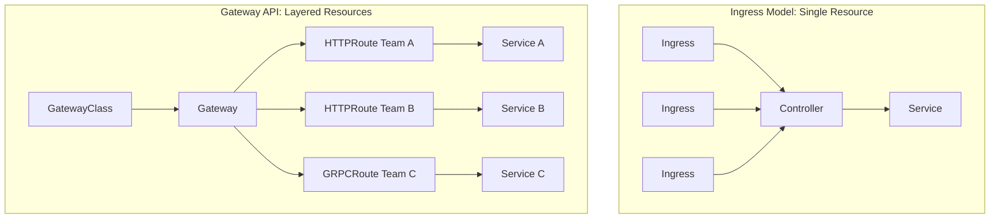
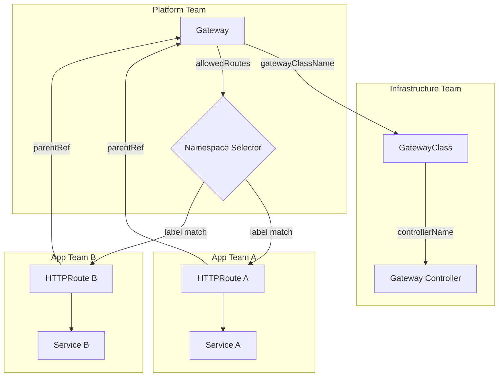

*[GA]: General Availability
*[TLS]: Transport Layer Security
*[TCP]: Transmission Control Protocol
*[UDP]: User Datagram Protocol
*[gRPC]: Google Remote Procedure Call
*[SNI]: Server Name Indication
*[CRD]: Custom Resource Definition
*[RBAC]: Role-Based Access Control

Kubernetes Ingress has been the standard for HTTP routing since 2015, but its limitations led to every ingress controller implementing different annotations and behaviors. If you've ever tried to port an Ingress configuration from NGINX to Traefik, you've felt this pain — annotations that worked perfectly on one controller are silently ignored by another. Gateway API, which launched in 2020 and reached GA in 2023, addresses these limitations with a more expressive, portable, and role-oriented design.

But more powerful doesn't always mean better for your use case.

I've seen this play out both ways. A team running NGINX Ingress Controller decided to migrate to Gateway API because "it's the future." They spent two weeks converting resources, only to discover that their simple host-based routing with TLS termination worked perfectly with Ingress — Gateway API added complexity without new capabilities. Meanwhile, another team I worked with was managing a multi-tenant platform with complex traffic splitting and cross-namespace routing. They'd accumulated a mess of hacky Ingress annotations to work around limitations. For them, Gateway API solved real problems and simplified their configuration.

The lesson: evaluate based on your actual requirements, not industry hype. The choice between Ingress and Gateway API depends on your current tooling, team structure, and routing complexity — not on which technology is newer.

<Callout type="info">
There's no deprecation timeline for Ingress. The Kubernetes networking SIG has stated both APIs will be supported indefinitely. Plan your technology choices assuming Ingress remains viable for at least the next 5-10 years.
</Callout>

## Understanding the Models

Before diving into features and migration, it helps to understand how these two APIs think about routing. Ingress is flat—one resource type handles everything. Gateway API is layered—different resource types for different concerns, managed by different teams.

### Ingress Model

Ingress uses a single resource type that combines routing rules, TLS configuration, and backend references. Everything lives in one YAML file, which makes simple cases easy but complex cases awkward. The catch is that Ingress itself only defines the _interface_—the actual behavior depends entirely on which controller you're running. NGINX Ingress Controller interprets annotations one way; Traefik interprets them differently; some controllers ignore certain annotations entirely.

```yaml title="ingress-example.yaml"
# Single Ingress resource handles routing, TLS, and backend config
apiVersion: networking.k8s.io/v1
kind: Ingress
metadata:
  name: web-ingress
  namespace: production
  annotations:
    # Controller-specific configuration (not portable)
    nginx.ingress.kubernetes.io/rewrite-target: /
    nginx.ingress.kubernetes.io/ssl-redirect: "true"
    nginx.ingress.kubernetes.io/proxy-body-size: "50m"
spec:
  ingressClassName: nginx
  tls:
    - hosts:
        - api.example.com
      secretName: api-tls-secret
  rules:
    - host: api.example.com
      http:
        paths:
          - path: /v1
            pathType: Prefix
            backend:
              service:
                name: api-v1
                port:
                  number: 80
          - path: /v2
            pathType: Prefix
            backend:
              service:
                name: api-v2
                port:
                  number: 80
```

Code: Ingress resource combining routing, TLS, and backends in one resource.

This simplicity has real limitations. Ingress only supports HTTP and HTTPS—no TCP, UDP, or native gRPC routing. Configuration portability is poor because any non-trivial behavior requires controller-specific annotations. All resources must live in the same namespace as the services they route to. And there's no separation between infrastructure concerns (which controller, what TLS policy) and application concerns (which paths route where).

### Gateway API Model

Gateway API takes a different approach: separate resource types for separate concerns, with explicit ownership boundaries between infrastructure teams, platform teams, and application teams.

The architecture has three layers. _GatewayClass_ is cluster-scoped and defines which controller implementation handles Gateways—typically managed by the infrastructure team. _Gateway_ is namespace-scoped and defines listeners (ports, protocols, TLS termination)—typically managed by the platform team. _HTTPRoute_ (and other Route types) defines the actual routing rules—typically managed by application teams who only need to reference the Gateway they want to attach to.

```yaml title="gateway-api-example.yaml"
# Layer 1: GatewayClass (cluster-scoped, managed by infra team)
apiVersion: gateway.networking.k8s.io/v1
kind: GatewayClass
metadata:
  name: production-gateway-class
spec:
  controllerName: gateway.nginx.org/nginx-gateway-controller
  description: "Production NGINX Gateway"

---
# Layer 2: Gateway (namespace-scoped, managed by platform team)
apiVersion: gateway.networking.k8s.io/v1
kind: Gateway
metadata:
  name: production-gateway
  namespace: gateway-infra
spec:
  gatewayClassName: production-gateway-class
  listeners:
    - name: https
      port: 443
      protocol: HTTPS
      hostname: "*.example.com"
      tls:
        mode: Terminate
        certificateRefs:
          - name: wildcard-tls
            namespace: gateway-infra
      allowedRoutes:
        namespaces:
          from: Selector
          selector:
            matchLabels:
              gateway-access: "true"

---
# Layer 3: HTTPRoute (namespace-scoped, managed by app teams)
apiVersion: gateway.networking.k8s.io/v1
kind: HTTPRoute
metadata:
  name: api-routes
  namespace: production
spec:
  parentRefs:
    - name: production-gateway
      namespace: gateway-infra  # Cross-namespace reference
  hostnames:
    - "api.example.com"
  rules:
    - matches:
        - path:
            type: PathPrefix
            value: /v1
      backendRefs:
        - name: api-v1
          port: 80
    - matches:
        - path:
            type: PathPrefix
            value: /v2
      backendRefs:
        - name: api-v2
          port: 80
```

Code: Gateway API's layered model separates infrastructure, platform, and application concerns.

Notice how the HTTPRoute in the `production` namespace can reference a Gateway in the `gateway-infra` namespace. This cross-namespace capability is fundamental to Gateway API's multi-team model—application teams don't need access to the Gateway namespace to define their routes.



Figure: Ingress uses flat resources in each namespace; Gateway API uses a shared Gateway with multiple routes from different teams.

The table below summarizes the key differences. If you're scanning for a quick answer: Ingress is simpler when you don't need the advanced features, Gateway API is more capable when you do.

| Aspect | Ingress | Gateway API |
|--------|---------|-------------|
| Resource types | 1 (Ingress) | 3+ (GatewayClass, Gateway, *Route) |
| Configuration | Annotations (not portable) | Native fields (portable) |
| Namespace scope | Same namespace only | Cross-namespace supported |
| Protocols | HTTP/HTTPS | HTTP, HTTPS, TCP, UDP, gRPC, TLS |
| Traffic splitting | Annotation-dependent | Native support |
| Header manipulation | Annotation-dependent | Native filters |
| Role separation | No | Yes (infra/platform/app) |

Table: Ingress vs Gateway API comparison.

<Callout type="warning">
Gateway API's layered model adds complexity. If you don't need cross-namespace routing, traffic splitting, or role separation, the extra layers are overhead without benefit. Ingress's simplicity is a feature, not a limitation.
</Callout>

## Feature Comparison

### Routing Capabilities

Beyond basic host and path matching, modern routing often requires matching on headers, query parameters, or HTTP methods. Ingress provides limited support for these patterns—you're dependent on controller-specific annotations that may or may not exist. Gateway API makes advanced matching a first-class feature.

| Capability | Ingress | Gateway API |
|------------|---------|-------------|
| Path matching | Exact, Prefix, ImplementationSpecific | Exact, PathPrefix, RegularExpression |
| Header matching | Annotation-dependent | Native (`matches.headers`) |
| Query parameter matching | Not supported | Native (`matches.queryParams`) |
| HTTP method matching | Not supported | Native (`matches.method`) |

Table: Routing capability comparison.

The difference becomes concrete when you need to route requests based on something other than URL path. With Gateway API, routing beta users to a different backend based on a header is straightforward:

```yaml title="header-based-routing.yaml"
# Gateway API: Route beta users to canary backend
apiVersion: gateway.networking.k8s.io/v1
kind: HTTPRoute
metadata:
  name: api-beta-route
spec:
  parentRefs:
    - name: production-gateway
  hostnames:
    - api.example.com
  rules:
    - matches:
        - headers:
            - name: X-Beta-User
              value: "true"
          path:
            type: PathPrefix
            value: /api
      backendRefs:
        - name: api-canary
          port: 80
```

Code: Header-based routing in Gateway API.

With Ingress, you'd need to check whether your controller supports a custom annotation for header routing—and if you ever switch controllers, that annotation likely won't transfer.

### Traffic Management

Traffic splitting for canary deployments is where the annotation problem really shows. With NGINX Ingress Controller, you create a separate "canary" Ingress resource with specific annotations. With Traefik, you use different annotations. With HAProxy, different still. None of these approaches are portable.

Gateway API handles traffic splitting natively through the `weight` field on backend references:

```yaml title="traffic-splitting.yaml"
# Gateway API: Native weighted traffic splitting
apiVersion: gateway.networking.k8s.io/v1
kind: HTTPRoute
metadata:
  name: api-canary-route
spec:
  parentRefs:
    - name: production-gateway
  hostnames:
    - api.example.com
  rules:
    - backendRefs:
        - name: api-stable
          port: 80
          weight: 80
        - name: api-canary
          port: 80
          weight: 20
```

Code: Weighted traffic splitting in Gateway API—no annotations required.

Header manipulation follows the same pattern. Gateway API provides native filters for adding, modifying, or removing request and response headers. URL rewriting is similarly built-in. These capabilities that required controller-specific configuration in Ingress are portable across any Gateway API implementation.

```yaml title="header-manipulation.yaml"
# Gateway API: Request and response header modification
apiVersion: gateway.networking.k8s.io/v1
kind: HTTPRoute
metadata:
  name: api-with-headers
spec:
  parentRefs:
    - name: production-gateway
  rules:
    - matches:
        - path:
            type: PathPrefix
            value: /api
      filters:
        - type: RequestHeaderModifier
          requestHeaderModifier:
            add:
              - name: X-Request-Source
                value: "gateway"
            remove:
              - X-Internal-Only
        - type: ResponseHeaderModifier
          responseHeaderModifier:
            add:
              - name: X-Served-By
                value: "api-cluster"
      backendRefs:
        - name: api-service
          port: 80
```

Code: Header manipulation using Gateway API filters.

<Callout type="success">
Gateway API's native traffic splitting and header manipulation are its strongest advantages. If you're currently using complex Ingress annotations for canary deployments or A/B testing, Gateway API makes these patterns first-class citizens.
</Callout>

### Protocol Support

Ingress was designed for HTTP and HTTPS. Period. If you need to route TCP traffic to a database, UDP traffic to a DNS server, or gRPC traffic with method-level routing, Ingress doesn't help. Some controllers added annotation-based workarounds, but these are non-standard and limited.

Gateway API includes dedicated route types for different protocols. TCPRoute and UDPRoute (currently in beta and alpha respectively) enable layer-4 routing. GRPCRoute provides native gRPC support with service and method matching. TLSRoute handles TLS passthrough without termination.

```yaml title="grpc-routing.yaml"
# Gateway API: Native gRPC routing with method matching
apiVersion: gateway.networking.k8s.io/v1
kind: GRPCRoute
metadata:
  name: user-service-route
spec:
  parentRefs:
    - name: production-gateway
  hostnames:
    - grpc.example.com
  rules:
    - matches:
        - method:
            service: myapp.UserService
            method: GetUser
      backendRefs:
        - name: user-service
          port: 9090
```

Code: gRPC routing with method-level matching in Gateway API.

The table below summarizes protocol support across both APIs. For HTTP workloads, either option works. For anything else, Gateway API is your only portable choice.

| Protocol | Ingress | Gateway API | Status |
|----------|---------|-------------|--------|
| HTTP | ✓ Native | ✓ HTTPRoute | GA |
| HTTPS (terminate) | ✓ Native | ✓ HTTPRoute + TLS | GA |
| HTTPS (passthrough) | Annotation-dependent | ✓ TLSRoute | GA |
| TCP | Not supported | ✓ TCPRoute | Beta |
| UDP | Not supported | ✓ UDPRoute | Alpha |
| gRPC | Annotation-dependent | ✓ GRPCRoute | GA |

Table: Protocol support comparison. Status column reflects Gateway API specification maturity (GA/Beta/Alpha), not individual controller implementation status.

## Role-Based Ownership

In organizations with multiple teams, the question of _who manages what_ becomes critical. With Ingress, there's no natural separation—anyone with permission to create Ingress resources in a namespace can affect cluster-wide routing behavior. This leads to either overly permissive access (risky) or centralized bottlenecks where a platform team manages all routing (slow).

Gateway API's layered architecture maps naturally to organizational boundaries. Each layer corresponds to a different team with different responsibilities and different access levels.

### Multi-Team Architecture

The three-layer model creates clear ownership:

- **Infrastructure team** manages GatewayClass resources. They select and configure the controller, set cluster-wide policies, and typically have cluster-admin access. This layer changes rarely—maybe during major upgrades or when adding new controller capabilities.

- **Platform team** manages Gateway resources. They configure listeners, TLS certificates, and crucially, which namespaces can attach routes. They control the blast radius of application team changes through the `allowedRoutes` configuration.

- **Application teams** manage HTTPRoute resources in their own namespaces. They define their routing rules, but can only attach to Gateways that explicitly allow their namespace. They can't affect other teams' traffic.

```yaml title="multi-team-gateway.yaml"
# Platform team's Gateway with namespace restrictions
apiVersion: gateway.networking.k8s.io/v1
kind: Gateway
metadata:
  name: shared-gateway
  namespace: gateway-system
spec:
  gatewayClassName: production
  listeners:
    - name: https
      port: 443
      protocol: HTTPS
      hostname: "*.example.com"
      tls:
        mode: Terminate
        certificateRefs:
          - name: wildcard-cert
      allowedRoutes:
        namespaces:
          from: Selector
          selector:
            matchLabels:
              gateway-access: "true"
        kinds:
          - kind: HTTPRoute

---
# Application team's HTTPRoute (in their namespace)
apiVersion: gateway.networking.k8s.io/v1
kind: HTTPRoute
metadata:
  name: team-a-routes
  namespace: team-a  # Must have label: gateway-access: "true"
spec:
  parentRefs:
    - name: shared-gateway
      namespace: gateway-system
  hostnames:
    - "team-a.example.com"
  rules:
    - matches:
        - path:
            type: PathPrefix
            value: /
      backendRefs:
        - name: team-a-service
          port: 80
```

Code: Gateway with namespace selector controlling which teams can attach routes.

The `allowedRoutes.namespaces.selector` is the key mechanism. Only namespaces with the label `gateway-access: "true"` can create HTTPRoutes that attach to this Gateway. The platform team controls which namespaces get that label, effectively controlling which teams can self-service their routing.

This separation is enforced at the Kubernetes API level, not just by convention. If an application team tries to create an HTTPRoute referencing a Gateway that doesn't allow their namespace, the route won't attach—it will show an error in its status conditions.



Figure: Role-based ownership with Gateway API.

You'll want to back this up with Kubernetes RBAC. Give the infrastructure team permissions on GatewayClass resources, the platform team permissions on Gateway resources in the gateway-system namespace, and application teams permissions only on HTTPRoute resources in their own namespaces. The Gateway API resources and RBAC work together to create a self-service model with appropriate guardrails.

<Callout type="info">
Role separation is Gateway API's killer feature for large organizations. Platform teams can manage shared infrastructure while application teams self-service their routing—with guardrails enforced by the Gateway's `allowedRoutes` configuration.
</Callout>

## Migration Strategy

If you've decided Gateway API is right for your use case, you don't need to migrate everything at once. Ingress and Gateway API can coexist on the same cluster, even with the same controller. This enables an incremental approach that minimizes risk.

### Migration Readiness Checklist

Assuming you've already decided Gateway API is the right fit (see the Decision Framework section), the next question is whether now is the right time to execute the migration.

**Timing signals that suggest waiting:**

- You're in the middle of a major release or incident stabilization period
- The team responsible for routing config doesn't have capacity for learning and testing
- Your controller's Gateway API support is still in beta or missing route types you need
- You have a complex `configuration-snippet` annotation that doesn't have a clear Gateway API equivalent
- Your CI/CD pipeline doesn't have good staging coverage for routing changes

**Prerequisite checklist before starting:**

- [ ] Controller supports Gateway API at GA level for the route types you need — most major controllers (NGINX Gateway Fabric, Envoy Gateway, Istio, Contour, Kong, Traefik) have GA support
- [ ] Team has read the official Gateway API getting started guide
- [ ] Staging environment can run parallel Ingress and Gateway API resources
- [ ] Rollback plan documented (typically: delete HTTPRoute, traffic returns to Ingress)
- [ ] Monitoring covers both Ingress and Gateway API traffic paths
- [ ] At least one low-risk service identified for initial migration

**Effort estimation:**

Migration timelines depend heavily on annotation complexity. If your Ingress resources use only standard fields (hosts, paths, TLS), conversion is mechanical and you can migrate a route in under an hour. If you're relying on custom annotations, rate limiting policies, or `configuration-snippet` blocks, plan for research time to find Gateway API equivalents. A typical 20-service cluster with moderate annotation usage takes 4-8 weeks for a careful migration with parallel operation.

### Incremental Migration Path

The safest migration runs both APIs in parallel, migrating routes one at a time with the ability to roll back each change independently.

**Phase 1: Parallel operation (2-4 weeks)**

Deploy the GatewayClass and Gateway resources, but only create HTTPRoutes for _new_ services. Your existing Ingress resources continue to handle existing traffic. This phase validates that your Gateway setup works without risking existing routes.

```yaml title="parallel-operation.yaml"
# New API version uses Gateway API
apiVersion: gateway.networking.k8s.io/v1
kind: HTTPRoute
metadata:
  name: api-v2-route
  namespace: production
spec:
  parentRefs:
    - name: production-gateway
      namespace: gateway-system
  hostnames:
    - "api.example.com"
  rules:
    - matches:
        - path:
            type: PathPrefix
            value: /v2
      backendRefs:
        - name: api-v2
          port: 80
# Existing /v1 routes still handled by Ingress
```

Code: New routes use Gateway API while existing Ingress handles legacy paths.

This coexistence works because Ingress and Gateway API are separate resource types that controllers watch independently. When a request arrives, the controller checks both APIs and routes based on the matching rules. Requests to `/v2` match the HTTPRoute; requests to `/v1` match the Ingress. There's no conflict because they handle different paths. If you need to migrate an existing path, create the HTTPRoute first with a different hostname for testing, then update DNS or the hostname field to cut over.

**Phase 2: Migrate routes (4-8 weeks)**

Convert Ingress rules to HTTPRoutes one at a time. Test each migration in staging first, then deploy to production. Keep the original Ingress rule as a fallback—you can revert instantly if something breaks.

**Phase 3: Cutover (1-2 weeks)**

Once all routes are migrated, route all traffic through Gateway. Keep Ingress resources in read-only mode (no new rules) while you monitor for issues. This is your last chance to catch problems before cleanup.

**Phase 4: Cleanup (1 week)**

Delete unused Ingress resources, document the new patterns, and update team training. This is the point of no return—make sure you're confident before proceeding.

The key insight is that rollback is easy in phases 1-3. If an HTTPRoute causes problems, delete it and the traffic falls back to Ingress. Only in phase 4, when you delete Ingress resources, do you commit to Gateway API.

### Ingress to HTTPRoute Conversion

Converting an Ingress resource to an HTTPRoute is mostly mechanical, but there are gotchas. The path matching types have different names: Ingress `Prefix` becomes HTTPRoute `PathPrefix`. Ingress `ImplementationSpecific` has no direct equivalent—you'll need to understand what your controller actually did with it and pick the appropriate HTTPRoute match type.

| Ingress pathType | HTTPRoute path.type | Notes |
|------------------|---------------------|-------|
| Exact | Exact | Direct mapping |
| Prefix | PathPrefix | Direct mapping |
| ImplementationSpecific | Varies | Check controller docs |

Table: Path type mapping between Ingress and HTTPRoute.

The harder part is annotations. Each annotation that your Ingress uses for non-standard behavior needs to be converted to Gateway API's native features or policy attachments. Common conversions:

- **Rewrite annotations** → URLRewrite filter
- **Header add/remove annotations** → RequestHeaderModifier / ResponseHeaderModifier filters
- **Rate limiting annotations** → Policy attachment (controller-specific)
- **Authentication annotations** → Policy attachment or external auth service

The `configuration-snippet` annotation is the hardest to migrate. It allows arbitrary NGINX config, which means you need to understand exactly what it's doing and find the Gateway API equivalent. Sometimes there isn't one—you may need a controller-specific extension or policy.

<Callout type="warning">
Don't migrate during high-traffic periods or with tight deadlines. The parallel operation phase should run long enough to catch edge cases. Rushed migrations create incidents—plan for a multi-week timeline.
</Callout>

## Ecosystem Maturity

Gateway API is newer, which means less community content and less battle-tested operational knowledge. That gap is closing, but it's worth understanding where you might hit friction.

### Controller Support

All major ingress controllers now support Gateway API at some level. The implementations vary in completeness:

| Controller | Gateway API Status | Route Types | Notes |
|------------|-------------------|-------------|-------|
| Envoy Gateway | GA | HTTP, gRPC, TCP, UDP, TLS | Purpose-built for Gateway API |
| Istio | GA | HTTP, gRPC, TCP, TLS | Preferred over Istio Gateway |
| Contour | GA | HTTP, gRPC, TLS | Mature implementation |
| Kong | GA | HTTP, gRPC, TCP, UDP | Full plugin support via policy |
| Traefik | GA | HTTP, gRPC, TCP, TLS | Middleware via policy |
| NGINX Gateway Fabric | GA | HTTP, gRPC | Successor to nginx-ingress |
| HAProxy | Beta | HTTP, TCP | Newer, less mature |

Table: Controller Gateway API support.

If you're currently using NGINX Ingress Controller, note that Gateway API support comes through a different project—NGINX Gateway Fabric—not the original nginx-ingress. They can coexist, but they're separate deployments.

### Tooling and Documentation

Ingress has an 8-year head start. You'll find more blog posts, more examples, and more answers to edge-case questions. Gateway API's official documentation is comprehensive, but community content is still catching up.

Debugging tools are similar in capability but different in approach. Gateway API resources have richer status conditions that tell you exactly why a route isn't working. Run `kubectl describe httproute <name>` and look at the `conditions` section:

```text
Status:
  Parents:
    Conditions:
      Type:    Accepted
      Status:  False
      Reason:  NotAllowedByListeners
      Message: Route hostname "api.example.com" does not match listener
```

Code: HTTPRoute status conditions showing why a route failed to attach.

This structured feedback beats digging through controller logs—you can see immediately that the hostname doesn't match the Gateway's listener configuration. Ingress debugging typically means reading controller logs to understand why traffic isn't routing as expected.

For GitOps workflows (ArgoCD, Flux), both work natively. The main gotcha with Gateway API is that you need the CRDs installed before ArgoCD tries to sync resources that use them—plan your sync waves accordingly.

| Aspect | Ingress | Gateway API |
|--------|---------|-------------|
| Years in production | 8+ years | 3+ years |
| Stack Overflow questions | 10,000+ | 500+ |
| Battle-tested patterns | Extensive | Growing |
| Breaking changes risk | Low (stable API) | Low (v1 is GA) |
| Controller coverage | Universal | ~80% of major controllers |

Table: Ecosystem maturity comparison.

<Callout type="info">
Gateway API reached GA (v1.0) in late 2023. The core APIs (GatewayClass, Gateway, HTTPRoute, GRPCRoute) are stable. Experimental APIs (TCPRoute, UDPRoute) may change. For production HTTP routing, Gateway API is now mature enough for most use cases.
</Callout>

## Decision Framework

After all the feature comparisons and migration details, the decision comes down to a few key questions.

### When to Choose Ingress

Stick with Ingress if:

- Your routing needs are simple: host-based routing, path prefixes, TLS termination
- Everything lives in one namespace (or a small number of namespaces managed by one team)
- Your current setup works and you don't have concrete problems to solve
- Your team doesn't have capacity to learn a new API right now
- Your controller doesn't support Gateway API yet

Example scenarios: a single application with a few endpoints, internal tools with basic routing, straightforward microservices where one team owns everything.

### When to Choose Gateway API

Choose Gateway API if:

- You need cross-namespace routing (app teams routing to a shared Gateway)
- You need native traffic splitting for canary or blue-green deployments
- You need TCP, UDP, or gRPC routing
- You're building a multi-team platform with self-service routing
- You're planning a controller migration anyway
- It's a greenfield project and you want to start with the more portable option

Example scenarios: multi-tenant platforms, deployment pipelines with canary stages, mixed-protocol workloads, service mesh integration.

### The Hybrid Approach

You don't have to choose one or the other. Many organizations run both:

- **Ingress** for legacy applications and simple internal services where migration effort isn't justified
- **Gateway API** for new platform services and anything requiring advanced features

Consider a concrete example: your cluster runs an internal admin dashboard that hasn't changed in two years (Ingress works fine), a legacy API that's in maintenance mode (no reason to migrate), and a new public API with canary deployment requirements (Gateway API). Running both APIs lets you use Gateway API where it adds value without touching stable workloads that don't need its features.

This works because both APIs can coexist on the same cluster, even with the same controller. The main cost is cognitive load—your team needs to know both patterns. Document which services use which API and establish a convention for new services.

## Conclusion

The choice between Ingress and Gateway API isn't about which technology is "better"—it's about which fits your current needs and team capabilities.

Ingress is simpler, more mature, and has years of battle-tested operational patterns. If your routing needs are straightforward—host-based routing, path prefixes, TLS termination in a single namespace—Ingress does the job with less complexity.

Gateway API is more powerful and more portable. Its layered architecture enables multi-team self-service with guardrails. Native support for traffic splitting, header manipulation, and non-HTTP protocols eliminates the annotation sprawl that makes Ingress configurations fragile. If you need these capabilities, Gateway API delivers them in a standardized way that works across controllers.

Both APIs will coexist for years—the Kubernetes networking SIG has confirmed there's no deprecation timeline for Ingress. Migrating purely because Gateway API is "the future" is a poor use of engineering time. Migrate when you have concrete requirements that Gateway API solves better: cross-namespace routing, native traffic splitting, protocol support, or role separation. For greenfield projects where you don't have strong opinions, Gateway API is a reasonable default—it's mature enough for production, and starting there avoids a future migration.

<Callout type="success">
The best choice is the one that solves your actual problems with acceptable complexity. If Ingress works for you, keep using it. If you need Gateway API's capabilities, it's mature enough for production. Make the decision based on requirements, not hype.
</Callout>

---
