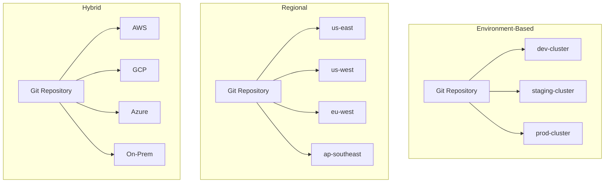
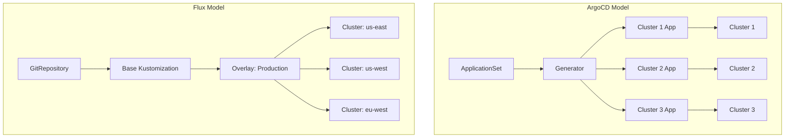
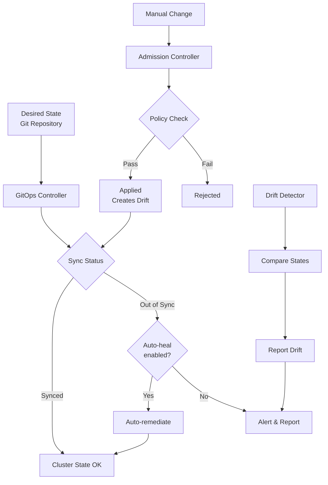

*[K8s]: Kubernetes
*[GitOps]: Git Operations
*[CRD]: Custom Resource Definition
*[RBAC]: Role-Based Access Control
*[API]: Application Programming Interface
*[CI/CD]: Continuous Integration/Continuous Deployment
*[GKE]: Google Kubernetes Engine
*[EKS]: Elastic Kubernetes Service
*[AKS]: Azure Kubernetes Service

# Multi-Cluster Kubernetes: Federation vs Fleet

## Introduction

Frame the multi-cluster challenge: running multiple Kubernetes clusters is easy; keeping them consistent is hard. As organizations grow, they accumulate clusters—dev, staging, production, regional deployments, edge locations, disaster recovery. Each cluster starts as a copy but drifts over time. Security patches get applied unevenly, configurations diverge, and debugging becomes "works in staging but not production." This section establishes that multi-cluster management isn't about the tools; it's about the operating model—how you balance consistency with environment-specific flexibility.

_Include a scenario: a platform team manages 15 clusters across dev, staging, and three production regions. Each cluster started from the same template. Two years later, they discover: three different versions of the ingress controller, five different network policy configurations, inconsistent resource quotas, and no documentation of what's intentionally different vs. accidentally drifted. When a security vulnerability requires patching all clusters, they spend two weeks figuring out what's actually running where. The lesson: multi-cluster management is a strategy, not an afterthought._

<Callout type="warning">
The hardest part of multi-cluster isn't deploying to many clusters—it's knowing what's supposed to be the same vs. different, and detecting when drift occurs. Without this clarity, you're managing 15 snowflakes, not a fleet.
</Callout>

## Multi-Cluster Architectures

### Common Patterns

```yaml title="multi-cluster-patterns.yaml"
multi_cluster_patterns:
  environment_based:
    description: "Separate clusters per environment"
    clusters:
      - "dev-cluster"
      - "staging-cluster"
      - "production-cluster"
    use_case: "Standard SDLC pipeline"
    configuration_model:
      same: ["Core add-ons", "Security policies", "RBAC structure"]
      different: ["Resource quotas", "Replica counts", "Feature flags"]

  regional:
    description: "Clusters per geographic region"
    clusters:
      - "us-east-prod"
      - "us-west-prod"
      - "eu-west-prod"
      - "ap-southeast-prod"
    use_case: "Global applications, data sovereignty"
    configuration_model:
      same: ["Application versions", "Security policies", "Monitoring"]
      different: ["Regional endpoints", "Compliance settings", "Capacity"]

  workload_isolation:
    description: "Clusters per workload type or team"
    clusters:
      - "frontend-cluster"
      - "backend-cluster"
      - "data-platform-cluster"
      - "ml-cluster"
    use_case: "Resource isolation, blast radius reduction"
    configuration_model:
      same: ["Network policies", "Security baseline"]
      different: ["Node types", "Add-ons", "Resource profiles"]

  hybrid_cloud:
    description: "Clusters across cloud providers"
    clusters:
      - "aws-primary"
      - "gcp-dr"
      - "azure-edge"
      - "on-prem-sensitive"
    use_case: "Vendor diversification, edge computing"
    configuration_model:
      same: ["Application manifests", "Security policies"]
      different: ["Cloud-specific integrations", "Storage classes"]
```
Code: Common multi-cluster patterns.


Figure: Multi-cluster topology patterns.

### Consistency vs Flexibility Spectrum

```yaml title="consistency-spectrum.yaml"
consistency_spectrum:
  fully_consistent:
    description: "All clusters are identical"
    pros:
      - "Simple mental model"
      - "Easy to reason about"
      - "Guaranteed reproducibility"
    cons:
      - "No environment-specific tuning"
      - "Over-provision dev/staging"
      - "Inflexible"
    tools: ["Simple GitOps with same manifests"]

  layered_configuration:
    description: "Base config + environment overrides"
    pros:
      - "Balance of consistency and flexibility"
      - "Clear inheritance model"
      - "Environment-appropriate settings"
    cons:
      - "More complex"
      - "Override explosion risk"
    tools: ["Kustomize overlays", "Helm values files"]

  policy_governed:
    description: "Guardrails, not identical configs"
    pros:
      - "Maximum flexibility within bounds"
      - "Teams can customize"
      - "Innovation enabled"
    cons:
      - "Drift within policy bounds"
      - "Harder to debug"
    tools: ["OPA/Gatekeeper", "Kyverno", "Policy engines"]

  fully_flexible:
    description: "Each cluster is independent"
    pros:
      - "Maximum autonomy"
      - "Teams own their clusters"
    cons:
      - "Configuration chaos"
      - "No consistency guarantees"
      - "Security risks"
    tools: ["Independent GitOps repos per cluster"]
```
Code: Consistency vs flexibility spectrum.

| Approach | Consistency | Flexibility | Operational Overhead | Best For |
|----------|-------------|-------------|---------------------|----------|
| Fully Consistent | Very High | Very Low | Low | Small fleet, simple apps |
| Layered Config | High | Medium | Medium | Typical enterprise |
| Policy Governed | Medium | High | High | Platform teams, multi-tenant |
| Fully Flexible | Low | Very High | Variable | Autonomous teams |

Table: Consistency vs flexibility tradeoffs.

<Callout type="info">
Most organizations land on "layered configuration" with policy guardrails. Pure consistency is too rigid; pure flexibility is chaos. The middle ground—shared base with controlled overrides—balances predictability with practicality.
</Callout>

## Fleet Management Tools

### Tool Comparison

```yaml title="fleet-tools-comparison.yaml"
fleet_management_tools:
  argocd_applicationsets:
    description: "Generate ArgoCD Applications for multiple clusters"
    model: "Pull-based GitOps"
    strengths:
      - "Native ArgoCD integration"
      - "Generator patterns (list, cluster, git)"
      - "Progressive rollout support"
      - "Mature ecosystem"
    limitations:
      - "Requires ArgoCD per cluster or hub"
      - "Complex for very large fleets (500+ clusters)"
    best_for: "Teams already using ArgoCD"

  flux_multi_cluster:
    description: "Flux with multi-tenancy and cluster API"
    model: "Pull-based GitOps"
    strengths:
      - "Native multi-tenancy"
      - "Kustomization inheritance"
      - "Lightweight agents"
      - "Strong RBAC model"
    limitations:
      - "Less UI/visualization"
      - "Steeper learning curve"
    best_for: "GitOps-native teams, CLI-first workflows"

  rancher_fleet:
    description: "Rancher's multi-cluster GitOps"
    model: "Pull-based with central management"
    strengths:
      - "Central UI for fleet visibility"
      - "Bundle concept for grouping"
      - "Works with any Git provider"
      - "Cluster grouping/targeting"
    limitations:
      - "Rancher ecosystem lock-in"
      - "Additional infrastructure"
    best_for: "Rancher users, central ops teams"

  google_config_sync:
    description: "GKE Config Sync (Anthos)"
    model: "Pull-based with policy controller"
    strengths:
      - "Deep GKE integration"
      - "Policy Controller built-in"
      - "Hierarchy controller for namespaces"
    limitations:
      - "GKE/Anthos focused"
      - "Less flexible for non-GKE"
    best_for: "GKE-centric organizations"

  crossplane:
    description: "Control plane for infrastructure and config"
    model: "Kubernetes-native control plane"
    strengths:
      - "Unified infrastructure + config"
      - "Composition abstractions"
      - "Strong typing with XRDs"
    limitations:
      - "Steep learning curve"
      - "Complex for simple use cases"
    best_for: "Platform engineering, IDP builders"
```
Code: Fleet management tool comparison.

### ArgoCD ApplicationSets

```yaml title="argocd-applicationset.yaml"
# ArgoCD ApplicationSet for multi-cluster deployment

apiVersion: argoproj.io/v1alpha1
kind: ApplicationSet
metadata:
  name: platform-services
  namespace: argocd
spec:
  generators:
    # Generate one Application per cluster
    - clusters:
        selector:
          matchLabels:
            env: production
        values:
          revision: main

    - clusters:
        selector:
          matchLabels:
            env: staging
        values:
          revision: staging

  template:
    metadata:
      name: "platform-services-{{name}}"
      labels:
        env: "{{metadata.labels.env}}"
        region: "{{metadata.labels.region}}"
    spec:
      project: platform
      source:
        repoURL: https://github.com/org/platform-config
        targetRevision: "{{values.revision}}"
        path: "clusters/{{name}}/platform-services"

        # Kustomize for environment-specific config
        kustomize:
          patches:
            - target:
                kind: Deployment
              patch: |
                - op: replace
                  path: /spec/replicas
                  value: {{metadata.labels.replicas}}

      destination:
        server: "{{server}}"
        namespace: platform-services

      syncPolicy:
        automated:
          prune: true
          selfHeal: true
        syncOptions:
          - CreateNamespace=true
          - PrunePropagationPolicy=foreground

---
# Cluster secrets with labels for targeting
apiVersion: v1
kind: Secret
metadata:
  name: us-east-prod
  namespace: argocd
  labels:
    argocd.argoproj.io/secret-type: cluster
    env: production
    region: us-east
    replicas: "5"
type: Opaque
stringData:
  name: us-east-prod
  server: https://us-east-prod.k8s.example.com
  config: |
    {
      "bearerToken": "...",
      "tlsClientConfig": {
        "insecure": false,
        "caData": "..."
      }
    }
```
Code: ArgoCD ApplicationSet for multi-cluster.

### Flux Multi-Cluster

```yaml title="flux-multi-cluster.yaml"
# Flux multi-cluster with Kustomization hierarchy

# Base Kustomization applied to all clusters
apiVersion: kustomize.toolkit.fluxcd.io/v1
kind: Kustomization
metadata:
  name: platform-base
  namespace: flux-system
spec:
  interval: 10m
  sourceRef:
    kind: GitRepository
    name: platform-config
  path: ./base/platform
  prune: true

---
# Environment-specific overlay
apiVersion: kustomize.toolkit.fluxcd.io/v1
kind: Kustomization
metadata:
  name: platform-production
  namespace: flux-system
spec:
  interval: 10m
  dependsOn:
    - name: platform-base
  sourceRef:
    kind: GitRepository
    name: platform-config
  path: ./overlays/production
  prune: true
  patches:
    - patch: |
        - op: replace
          path: /spec/replicas
          value: 5
      target:
        kind: Deployment
        labelSelector: "tier=platform"

---
# Cluster-specific configuration
apiVersion: kustomize.toolkit.fluxcd.io/v1
kind: Kustomization
metadata:
  name: cluster-config
  namespace: flux-system
spec:
  interval: 10m
  dependsOn:
    - name: platform-production
  sourceRef:
    kind: GitRepository
    name: platform-config
  path: ./clusters/${CLUSTER_NAME}
  prune: true
  postBuild:
    substituteFrom:
      - kind: ConfigMap
        name: cluster-vars
      - kind: Secret
        name: cluster-secrets

---
# Repository structure for Flux multi-cluster
# platform-config/
# ├── base/
# │   └── platform/
# │       ├── kustomization.yaml
# │       ├── namespace.yaml
# │       ├── deployment.yaml
# │       └── service.yaml
# ├── overlays/
# │   ├── development/
# │   │   └── kustomization.yaml
# │   ├── staging/
# │   │   └── kustomization.yaml
# │   └── production/
# │       └── kustomization.yaml
# └── clusters/
#     ├── us-east-prod/
#     │   └── kustomization.yaml
#     ├── us-west-prod/
#     │   └── kustomization.yaml
#     └── eu-west-prod/
#         └── kustomization.yaml
```
Code: Flux multi-cluster configuration.


Figure: ArgoCD vs Flux multi-cluster models.

<Callout type="success">
ArgoCD ApplicationSets excel at generating many similar applications with cluster-specific values. Flux's Kustomization hierarchy excels at layered configuration with clear inheritance. Choose based on your team's mental model.
</Callout>

## Configuration Templating

### Kustomize for Multi-Cluster

```yaml title="kustomize-multi-cluster.yaml"
# Base configuration (base/kustomization.yaml)
apiVersion: kustomize.config.k8s.io/v1beta1
kind: Kustomization

resources:
  - namespace.yaml
  - deployment.yaml
  - service.yaml
  - configmap.yaml

commonLabels:
  app.kubernetes.io/managed-by: fleet

---
# Production overlay (overlays/production/kustomization.yaml)
apiVersion: kustomize.config.k8s.io/v1beta1
kind: Kustomization

resources:
  - ../../base

namePrefix: prod-

replicas:
  - name: api-server
    count: 5

images:
  - name: api-server
    newTag: v2.1.0  # Production-pinned version

patches:
  - target:
      kind: Deployment
      name: api-server
    patch: |
      - op: add
        path: /spec/template/spec/containers/0/resources
        value:
          requests:
            cpu: "500m"
            memory: "512Mi"
          limits:
            cpu: "2000m"
            memory: "2Gi"

configMapGenerator:
  - name: app-config
    behavior: merge
    literals:
      - LOG_LEVEL=info
      - ENABLE_DEBUG=false

---
# Cluster-specific (clusters/us-east-prod/kustomization.yaml)
apiVersion: kustomize.config.k8s.io/v1beta1
kind: Kustomization

resources:
  - ../../overlays/production

patches:
  - target:
      kind: ConfigMap
      name: app-config
    patch: |
      - op: add
        path: /data/REGION
        value: us-east-1
      - op: add
        path: /data/DB_HOST
        value: us-east-prod.db.example.com

  - target:
      kind: Deployment
      name: api-server
    patch: |
      - op: replace
        path: /spec/template/spec/nodeSelector
        value:
          topology.kubernetes.io/region: us-east-1
```
Code: Kustomize multi-cluster structure.

### Helm with Fleet Values

```yaml title="helm-fleet-values.yaml"
# Base values (values/base.yaml)
replicaCount: 2

image:
  repository: myapp/api
  tag: latest
  pullPolicy: IfNotPresent

resources:
  requests:
    cpu: 100m
    memory: 128Mi

config:
  logLevel: debug
  enableMetrics: true

---
# Production values (values/production.yaml)
replicaCount: 5

image:
  tag: v2.1.0
  pullPolicy: Always

resources:
  requests:
    cpu: 500m
    memory: 512Mi
  limits:
    cpu: 2000m
    memory: 2Gi

config:
  logLevel: info
  enableMetrics: true

podDisruptionBudget:
  enabled: true
  minAvailable: 3

---
# Cluster-specific values (values/clusters/us-east-prod.yaml)
replicaCount: 8  # Higher traffic region

config:
  region: us-east-1
  dbHost: us-east-prod.db.example.com

nodeSelector:
  topology.kubernetes.io/region: us-east-1

tolerations:
  - key: "dedicated"
    operator: "Equal"
    value: "api"
    effect: "NoSchedule"

---
# Helmfile for multi-cluster deployment
# helmfile.yaml

environments:
  development:
    values:
      - values/development.yaml
  staging:
    values:
      - values/staging.yaml
  production:
    values:
      - values/production.yaml

releases:
  - name: api-server
    namespace: production
    chart: ./charts/api-server
    values:
      - values/base.yaml
      - values/{{ .Environment.Name }}.yaml
      - values/clusters/{{ requiredEnv "CLUSTER_NAME" }}.yaml
```
Code: Helm fleet values structure.

| Approach | Pros | Cons | Best For |
|----------|------|------|----------|
| Kustomize overlays | Native K8s, no templating | Patch complexity | Simple overrides |
| Helm values hierarchy | Powerful templating | Value file explosion | Complex apps |
| Jsonnet | Programmable, DRY | Learning curve | Large-scale platforms |
| CUE | Type-safe, validation | Newer, less adoption | Config validation |

Table: Configuration templating approaches.

<Callout type="info">
The "values file explosion" problem is real: base + environment + region + cluster = many files to manage. Combat this with clear naming conventions, validation in CI, and documentation of which values are set where.
</Callout>

## Drift Detection and Prevention

### Detecting Configuration Drift

```yaml title="drift-detection.yaml"
# ArgoCD drift detection (built-in)
apiVersion: argoproj.io/v1alpha1
kind: Application
metadata:
  name: platform-services
spec:
  # ... other config
  syncPolicy:
    automated:
      # Allow ArgoCD to auto-sync (fix drift)
      prune: true
      selfHeal: true
    syncOptions:
      # Show diff in UI
      - Validate=true

---
# Custom drift detection job
apiVersion: batch/v1
kind: CronJob
metadata:
  name: drift-detector
  namespace: fleet-management
spec:
  schedule: "0 * * * *"  # Every hour
  jobTemplate:
    spec:
      template:
        spec:
          containers:
            - name: detector
              image: fleet-tools:latest
              command:
                - /bin/sh
                - -c
                - |
                  # Compare actual state to desired state
                  for cluster in $(get-clusters); do
                    echo "Checking $cluster..."

                    # Get desired state from Git
                    git clone $CONFIG_REPO /tmp/desired

                    # Get actual state from cluster
                    kubectl --context=$cluster get all -A -o yaml > /tmp/actual.yaml

                    # Compare and report
                    drift-compare /tmp/desired /tmp/actual.yaml | \
                      send-to-slack "#platform-alerts"
                  done
              env:
                - name: CONFIG_REPO
                  value: "https://github.com/org/platform-config"
          restartPolicy: OnFailure

---
# Drift detection metrics
drift_metrics:
  prometheus_queries:
    # ArgoCD sync status
    argocd_out_of_sync: |
      argocd_app_info{sync_status="OutOfSync"}

    # Flux reconciliation failures
    flux_reconcile_failures: |
      gotk_reconcile_condition{type="Ready", status="False"}

    # Custom drift score
    drift_score: |
      sum by (cluster) (
        resource_drift_count{severity="high"} * 10 +
        resource_drift_count{severity="medium"} * 5 +
        resource_drift_count{severity="low"}
      )
```
Code: Drift detection approaches.

### Policy-Based Prevention

```yaml title="drift-prevention.yaml"
# OPA Gatekeeper constraint to prevent drift

apiVersion: templates.gatekeeper.sh/v1
kind: ConstraintTemplate
metadata:
  name: k8srequiredlabels
spec:
  crd:
    spec:
      names:
        kind: K8sRequiredLabels
      validation:
        openAPIV3Schema:
          type: object
          properties:
            labels:
              type: array
              items:
                type: string
  targets:
    - target: admission.k8s.gatekeeper.sh
      rego: |
        package k8srequiredlabels

        violation[{"msg": msg}] {
          provided := {label | input.review.object.metadata.labels[label]}
          required := {label | label := input.parameters.labels[_]}
          missing := required - provided
          count(missing) > 0
          msg := sprintf("Missing required labels: %v", [missing])
        }

---
apiVersion: constraints.gatekeeper.sh/v1beta1
kind: K8sRequiredLabels
metadata:
  name: fleet-managed-resources
spec:
  match:
    kinds:
      - apiGroups: ["apps"]
        kinds: ["Deployment", "StatefulSet", "DaemonSet"]
  parameters:
    labels:
      - "app.kubernetes.io/managed-by"
      - "fleet.example.com/cluster"
      - "fleet.example.com/environment"

---
# Kyverno policy to enforce GitOps-only changes
apiVersion: kyverno.io/v1
kind: ClusterPolicy
metadata:
  name: require-gitops-annotation
spec:
  validationFailureAction: Enforce
  background: true
  rules:
    - name: check-gitops-source
      match:
        any:
          - resources:
              kinds:
                - Deployment
                - Service
                - ConfigMap
              namespaces:
                - production
                - staging
      validate:
        message: "Resources must be managed by GitOps. Manual changes are not allowed."
        pattern:
          metadata:
            annotations:
              argocd.argoproj.io/tracking-id: "*"
```
Code: Policy-based drift prevention.


Figure: Drift detection and prevention flow.

<Callout type="warning">
Drift prevention through admission control is powerful but can block emergency changes. Always have a break-glass procedure—a way for authorized users to make manual changes in emergencies, with automatic detection and follow-up.
</Callout>

## Operational Patterns

### Progressive Rollout Across Fleet

```yaml title="progressive-rollout.yaml"
# ArgoCD progressive sync with waves

apiVersion: argoproj.io/v1alpha1
kind: ApplicationSet
metadata:
  name: platform-progressive-rollout
spec:
  generators:
    - list:
        elements:
          # Wave 1: Canary cluster
          - cluster: canary-cluster
            wave: "1"

          # Wave 2: Non-critical production
          - cluster: prod-secondary
            wave: "2"

          # Wave 3: Primary production
          - cluster: prod-primary
            wave: "3"

  strategy:
    type: RollingSync
    rollingSync:
      steps:
        - matchExpressions:
            - key: wave
              operator: In
              values: ["1"]
          # Wait for manual approval after canary

        - matchExpressions:
            - key: wave
              operator: In
              values: ["2"]
          # Auto-proceed after 30 minutes if healthy
          maxUpdate: 1

        - matchExpressions:
            - key: wave
              operator: In
              values: ["3"]

  template:
    metadata:
      name: "platform-{{cluster}}"
      labels:
        wave: "{{wave}}"
    spec:
      source:
        repoURL: https://github.com/org/platform-config
        path: "clusters/{{cluster}}"
      destination:
        server: "{{server}}"
        namespace: platform
      syncPolicy:
        automated:
          selfHeal: true

---
# Rollout verification
apiVersion: argoproj.io/v1alpha1
kind: AnalysisTemplate
metadata:
  name: fleet-rollout-check
spec:
  metrics:
    - name: error-rate
      interval: 1m
      successCondition: result[0] < 0.01
      provider:
        prometheus:
          address: http://prometheus:9090
          query: |
            sum(rate(http_requests_total{status=~"5.*",cluster="{{args.cluster}}"}[5m]))
            /
            sum(rate(http_requests_total{cluster="{{args.cluster}}"}[5m]))

    - name: latency-p99
      interval: 1m
      successCondition: result[0] < 500
      provider:
        prometheus:
          address: http://prometheus:9090
          query: |
            histogram_quantile(0.99,
              sum(rate(http_request_duration_seconds_bucket{cluster="{{args.cluster}}"}[5m])) by (le)
            ) * 1000
```
Code: Progressive rollout across fleet.

### Fleet-Wide Operations

```typescript title="fleet-operations.ts"
// Fleet operations tooling

interface Cluster {
  name: string;
  environment: 'development' | 'staging' | 'production';
  region: string;
  endpoint: string;
  priority: number; // Lower = deploy first
}

interface FleetOperation {
  name: string;
  clusters: Cluster[];
  action: (cluster: Cluster) => Promise<void>;
  verification: (cluster: Cluster) => Promise<boolean>;
  rollbackOnFailure: boolean;
}

class FleetManager {
  async executeOperation(operation: FleetOperation): Promise<FleetResult> {
    // Sort clusters by priority (canary first, critical last)
    const sortedClusters = operation.clusters.sort((a, b) => a.priority - b.priority);

    const results: ClusterResult[] = [];

    for (const cluster of sortedClusters) {
      console.log(`Executing on ${cluster.name}...`);

      try {
        // Execute action
        await operation.action(cluster);

        // Wait for stabilization
        await this.waitForStabilization(cluster);

        // Verify success
        const verified = await operation.verification(cluster);

        if (!verified) {
          throw new Error(`Verification failed for ${cluster.name}`);
        }

        results.push({ cluster: cluster.name, status: 'success' });
        console.log(`✓ ${cluster.name} completed successfully`);

        // Wait before next cluster
        if (cluster.environment === 'production') {
          await this.waitBetweenClusters(300); // 5 min between prod clusters
        }

      } catch (error) {
        results.push({ cluster: cluster.name, status: 'failed', error });
        console.error(`✗ ${cluster.name} failed: ${error}`);

        if (operation.rollbackOnFailure) {
          console.log('Rolling back previous clusters...');
          await this.rollbackClusters(results.filter(r => r.status === 'success'));
          break;
        }
      }
    }

    return { results, summary: this.summarize(results) };
  }

  async compareFleetState(): Promise<FleetComparison> {
    const clusters = await this.getClusters();
    const comparisons: ClusterComparison[] = [];

    for (const cluster of clusters) {
      const desired = await this.getDesiredState(cluster);
      const actual = await this.getActualState(cluster);
      const drift = this.computeDrift(desired, actual);

      comparisons.push({
        cluster: cluster.name,
        desiredVersion: desired.version,
        actualVersion: actual.version,
        driftCount: drift.length,
        driftItems: drift,
      });
    }

    return { comparisons, summary: this.summarizeDrift(comparisons) };
  }
}

// Example usage
const fleetManager = new FleetManager();

// Upgrade platform services across fleet
await fleetManager.executeOperation({
  name: 'platform-upgrade-v2.1',
  clusters: await fleetManager.getClusters(),
  action: async (cluster) => {
    await kubectl(cluster, 'apply -f platform-v2.1/');
  },
  verification: async (cluster) => {
    const health = await checkHealth(cluster, 'platform-services');
    return health.status === 'healthy';
  },
  rollbackOnFailure: true,
});
```
Code: Fleet operations tooling.

| Operation Type | Strategy | Verification | Rollback |
|----------------|----------|--------------|----------|
| Security patch | Parallel (all at once) | Basic health | Per-cluster |
| Feature rollout | Progressive waves | Canary metrics | Full fleet |
| Config change | Sequential | Config validation | Previous config |
| Add-on upgrade | Progressive | Integration tests | Previous version |

Table: Fleet operation strategies.

<Callout type="success">
Progressive rollout is essential for production fleet operations. Start with a canary cluster, verify health, then proceed to non-critical clusters, and finally critical clusters. Each wave should have clear success criteria before proceeding.
</Callout>

## Conclusion

Summarize the key multi-cluster management principles: define what should be consistent vs. different across clusters, choose tools that match your team's operating model (ArgoCD for Application-centric, Flux for Kustomization-centric), implement drift detection with policy-based prevention, and use progressive rollout for fleet-wide changes. Emphasize that multi-cluster management is primarily an organizational challenge—the tools only work if you've defined clear ownership, documented intended differences, and built processes for fleet-wide operations.

<Callout type="info">
Multi-cluster management maturity comes from discipline, not tools. The best fleet management setup fails if teams don't follow the processes. Start with clear policies on what can differ between clusters, automate drift detection, and make the right path the easy path.
</Callout>

---

## Cover Prompt

### Prompt 1: The Fleet Admiral

Create an image of a naval admiral (platform engineer) overlooking a fleet of ships (Kubernetes clusters) from a control tower. Some ships are in formation (consistent), others slightly off course (drifted). The admiral uses a telescope (monitoring) to check each ship's position against a map (desired state). Style: naval command, fleet coordination, oversight visualization, 16:9 aspect ratio.

### Prompt 2: The Configuration Tree

Design an image of a tree where the trunk represents base configuration, main branches represent environments (dev, staging, prod), and smaller branches represent individual clusters. Leaves on each branch show cluster-specific settings. A gardener (platform engineer) prunes branches to maintain consistency while allowing growth. Style: tree metaphor, inheritance visualization, maintenance, 16:9 aspect ratio.

### Prompt 3: The Synchronized Orchestra

Illustrate an orchestra where each section (cluster) plays from the same sheet music (Git repository) but with section-specific dynamics (environment overrides). A conductor (GitOps controller) ensures they stay synchronized. Musicians who drift off tempo are highlighted. Style: orchestral coordination, synchronization, drift detection, 16:9 aspect ratio.

### Prompt 4: The Manufacturing Line

Create an image of a manufacturing facility with multiple production lines (clusters) all producing the same product (platform services). Quality inspectors (drift detectors) check each line's output against a reference standard. Lines showing variance are flagged for adjustment. Style: manufacturing consistency, quality control, standardization, 16:9 aspect ratio.

### Prompt 5: The Wave Deployment

Design an image of waves rolling onto a beach, each wave representing a deployment wave (canary → staging → production regions). A surfer (platform engineer) rides the first wave, checking conditions before the next wave arrives. Warning flags mark any issues that should stop subsequent waves. Style: wave progression, phased rollout, validation checkpoints, 16:9 aspect ratio.
