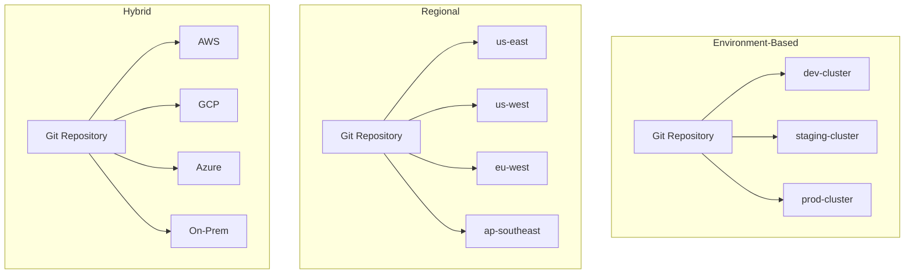
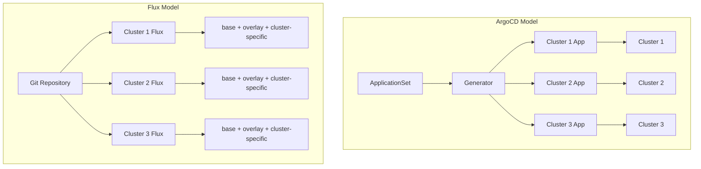
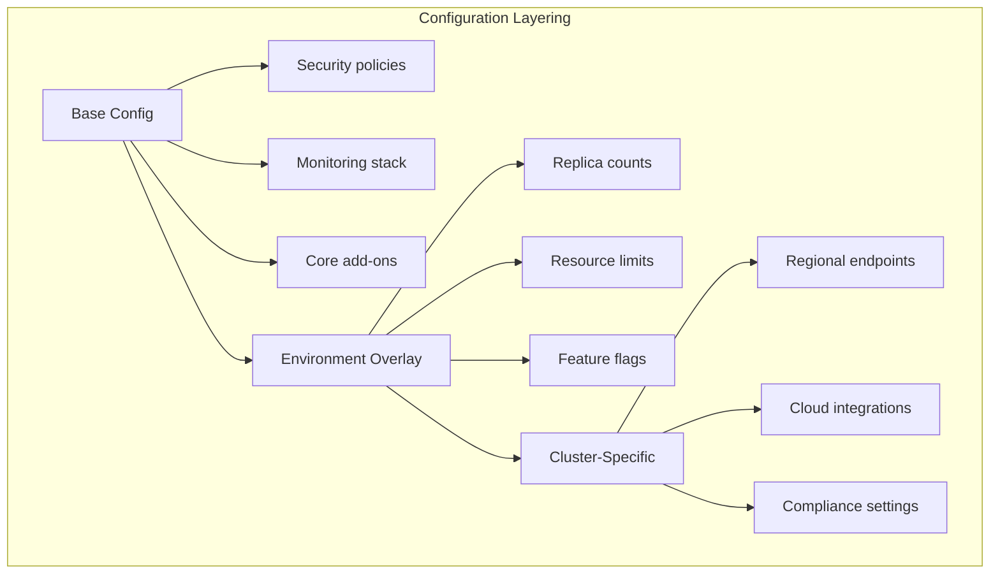

*[K8s]: Kubernetes
*[GitOps]: Git Operations
*[CRD]: Custom Resource Definition
*[RBAC]: Role-Based Access Control
*[GKE]: Google Kubernetes Engine
*[EKS]: Elastic Kubernetes Service
*[AKS]: Azure Kubernetes Service

Running multiple Kubernetes clusters is easy. Keeping them consistent is hard.

As organizations grow, they accumulate clusters: dev, staging, production, regional deployments, edge locations, disaster recovery. Each cluster starts as a copy of the others, templated from the same base configuration. A platform team I worked with managed 15 clusters across dev, staging, and three production regions. They'd done everything right at the start: infrastructure-as-code, consistent tooling, documented architecture. But two years later, hotfixes had been applied to some clusters and not others, "temporary" manual changes became permanent, and someone upgraded the service mesh in US-East but forgot US-West. The clusters that started identical had become 15 unique configurations—and nobody could tell you what was _intentionally_ different versus what had _accidentally_ drifted.

The multi-cluster management problem isn't primarily about tools. It's about the operating model: how you balance consistency with environment-specific flexibility, how you detect when drift occurs, and how you maintain clarity about what's _supposed_ to be the same versus what's _supposed_ to be different. This article covers the patterns and tools that make fleet management tractable: configuration templating strategies, GitOps-based deployment, drift detection, and progressive rollout across clusters.

<Callout type="warning">
The hardest part of multi-cluster isn't deploying to many clusters—it's knowing what's supposed to be the same vs. different, and detecting when drift occurs. Without this clarity, you're managing independent configurations, not a fleet.
</Callout>

### A Brief History: Why Not Federation?

Kubernetes Federation (KubeFed) was the original attempt to solve multi-cluster management. The idea was appealing: a control plane that could deploy resources across multiple clusters from a single API. You'd create a "FederatedDeployment" and it would propagate to member clusters automatically.

In practice, Federation never gained traction. The v1 implementation was deprecated in 2018, and KubeFed v2 saw limited adoption before being archived in 2022. The problems were fundamental: Federation tried to abstract away cluster differences, but real-world multi-cluster deployments _need_ those differences. A one-size-fits-all API couldn't handle the nuanced configuration variations between dev and production, between AWS and on-prem, between US-East and EU-West.

The industry moved toward a different model: GitOps-based fleet management. Instead of a control plane pushing identical configs everywhere, each cluster pulls its configuration from Git, with templating systems handling the variations. This approach—implemented by tools like ArgoCD ApplicationSets, Flux, and Rancher Fleet—provides the consistency benefits Federation promised while preserving the flexibility real deployments require.

## Multi-Cluster Architectures

### Common Patterns

Organizations arrive at multi-cluster architectures for different reasons, and the reason shapes the configuration strategy. Understanding _why_ you have multiple clusters determines what should be consistent versus different across them.

_Environment-based_ clusters are the most common pattern: dev, staging, and production running as separate clusters. The configuration model here is straightforward—core add-ons, security policies, and RBAC structure should be identical, while resource quotas, replica counts, and feature flags differ by environment. You want staging to behave like production, just smaller.

_Regional_ clusters serve global applications or data sovereignty requirements. US-East, US-West, EU-West, and AP-Southeast might all run the same application versions and security policies, but with region-specific endpoints, compliance settings, and capacity. The challenge here is keeping application deployments synchronized while allowing regional customization.

_Workload isolation_ clusters separate concerns by team or workload type: frontend, backend, data platform, ML training. Each cluster shares network policies and security baselines, but node types, add-ons, and resource profiles differ dramatically. An ML training cluster needs GPUs and tolerates batch job failures; a frontend cluster needs fast scaling and zero-downtime deployments.

_Hybrid cloud_ clusters span providers: AWS primary, GCP disaster recovery, Azure edge, on-premises for sensitive workloads. Application manifests and security policies stay consistent, but cloud-specific integrations (load balancers, storage classes, IAM bindings) differ by necessity.



Figure: Multi-cluster topology patterns.

### Consistency vs Flexibility Spectrum

Every multi-cluster strategy sits somewhere on a spectrum from "all clusters are identical" to "each cluster is independent." Neither extreme works well in practice.

_Fully consistent_ means all clusters get exactly the same configuration. This is simple to reason about and guarantees reproducibility, but it's inflexible. You end up over-provisioning dev and staging to match production, or you can't tune production for its actual load patterns. This approach only works for small fleets with simple applications.

_Layered configuration_ uses a base configuration with environment-specific overrides. This is the sweet spot for most organizations. You define what's shared (security policies, monitoring stack, core add-ons) and what varies (replica counts, resource limits, feature flags). Kustomize overlays and Helm values files are the typical implementation. The risk is "override explosion"—so many layers of patches that nobody can trace what a cluster actually runs.

_Policy-governed_ configuration sets guardrails rather than identical configs. Teams can customize their clusters within bounds enforced by OPA/Gatekeeper[^opa-gatekeeper] or Kyverno[^kyverno]. This enables innovation and team autonomy, but drift happens within the policy bounds. Debugging becomes harder because clusters are intentionally different.

[^opa-gatekeeper]: OPA (Open Policy Agent) is an open-source, general-purpose policy engine that unifies policy enforcement across the stack, using a declarative language called Rego to define complex rules. Gatekeeper is a specialized project that integrates OPA into Kubernetes—it acts as a validating admission controller, intercepting requests to the Kubernetes API and checking them against OPA policies before resources are created or modified.

[^kyverno]: Kyverno is a Kubernetes-native policy engine. Unlike Gatekeeper, it doesn't require learning Rego; policies are written in standard YAML. It can validate, mutate (modify), and generate resources, as well as verify container image signatures.

_Fully flexible_ means each cluster is independent, with its own GitOps repo and configuration. Maximum autonomy, maximum chaos. Security risks emerge when teams deviate from baselines. This only works with truly autonomous teams who don't need cross-cluster consistency.

| Approach | Consistency | Flexibility | Operational Overhead | Best For |
|----------|-------------|-------------|---------------------|----------|
| Fully Consistent | Very High | Very Low | Low | Small fleet, simple apps |
| Layered Config | High | Medium | Medium | Typical enterprise |
| Policy Governed | Medium | High | High | Platform teams, multi-tenant |
| Fully Flexible | Low | Very High | Variable | Autonomous teams |

Table: Consistency vs flexibility tradeoffs.

<Callout type="info">
Most organizations land on "layered configuration" with policy guardrails. Pure consistency is too rigid; pure flexibility is chaos. The middle ground—shared base with controlled overrides—balances predictability with practicality.
</Callout>

## Fleet Management Tools

The fleet management landscape has matured around a few dominant approaches. All of them embrace GitOps—storing desired state in Git and reconciling clusters toward that state—but they differ in how they handle multi-cluster targeting, configuration layering, and operational visibility.

### Tool Comparison

_ArgoCD ApplicationSets_ extend ArgoCD's Application concept with generators that create Applications dynamically based on clusters, Git directories, or custom lists. If you're already running ArgoCD, ApplicationSets are the natural choice. The generator patterns (cluster, list, git, matrix, merge) handle most multi-cluster scenarios elegantly. The limitation is scale: beyond 500 clusters, the ApplicationSet controller can struggle, and you'll need sharding or multiple ArgoCD instances.

_Flux_ takes a different approach, building multi-cluster support into its Kustomization hierarchy. Each cluster runs its own Flux controllers pulling from Git, with dependencies between Kustomizations enabling layered configuration. Flux excels at lightweight, distributed deployments where each cluster is fairly autonomous. The trade-off is less centralized visibility—there's no built-in UI showing fleet-wide status.

_Rancher Fleet_ provides centralized multi-cluster GitOps with a strong UI for fleet visibility. The "bundle" concept groups related resources for deployment across cluster groups. It's pull-based (clusters pull their configs), but the Rancher UI gives operators a single pane of glass. The downside is ecosystem lock-in—Fleet integrates deeply with Rancher's cluster management.

_Google Config Sync_ (part of Anthos) offers deep GKE integration with built-in policy controller and namespace hierarchy management. If your fleet is GKE-centric, Config Sync provides tight integration with Google Cloud's IAM and audit logging. For multi-cloud or on-prem clusters, it's less flexible.

_Crossplane_ approaches fleet management differently—as a Kubernetes-native control plane extension for both infrastructure and configuration. You define Compositions that abstract cluster provisioning and configuration together. This is powerful for platform teams building internal developer platforms, but the learning curve is steep.

| Tool | Model | Best For | Scale Ceiling | Learning Curve |
|------|-------|----------|---------------|----------------|
| ArgoCD ApplicationSets | Pull-based, centralized | Teams already using ArgoCD | ~500 clusters | Medium |
| Flux | Pull-based, distributed | CLI-first, GitOps-native teams | 1000+ clusters | Medium-High |
| Rancher Fleet | Pull-based, central UI | Rancher ecosystem users | ~500 clusters | Low-Medium |
| Config Sync | Pull-based, GKE-native | GKE-centric organizations | GKE limits | Low |

Table: Fleet management tool comparison.

<Callout type="info">
Crossplane deserves mention but serves a different purpose—it's a control plane for provisioning infrastructure _and_ configuration together, not purely a fleet deployment tool. If you're building an internal developer platform where cluster provisioning and app deployment are unified, Crossplane is worth evaluating. For pure configuration management across existing clusters, stick with the GitOps tools above.
</Callout>

### ArgoCD ApplicationSets

ApplicationSets are ArgoCD's answer to multi-cluster deployment. The core concept is a _generator_ that produces a list of parameters, combined with a _template_ that stamps out Applications using those parameters. The cluster generator is the most common—it queries ArgoCD's cluster secrets and creates one Application per matching cluster.

The example below deploys platform services across all production and staging clusters. The cluster generator selects clusters by label (`env: production` or `env: staging`), and the template creates Applications that pull from different Git branches based on environment. Each cluster's Application syncs from a cluster-specific path in the repository.

```yaml title="argocd-applicationset.yaml"
apiVersion: argoproj.io/v1alpha1
kind: ApplicationSet
metadata:
  name: platform-services
  namespace: argocd
spec:
  generators:
    - clusters:
        selector:
          matchLabels:
            env: production
        values:
          revision: main
    - clusters:
        selector:
          matchLabels:
            env: staging
        values:
          revision: staging
  template:
    metadata:
      name: "platform-services-{{name}}"
      labels:
        env: "{{metadata.labels.env}}"
        region: "{{metadata.labels.region}}"
    spec:
      project: platform
      source:
        repoURL: https://github.com/org/platform-config
        targetRevision: "{{values.revision}}"
        path: "clusters/{{name}}/platform-services"
        kustomize:
          patches:
            - target:
                kind: Deployment
              patch: |
                - op: replace
                  path: /spec/replicas
                  value: {{metadata.labels.replicas}}
      destination:
        server: "{{server}}"
        namespace: platform-services
      syncPolicy:
        automated:
          prune: true
          selfHeal: true
        syncOptions:
          - CreateNamespace=true
          - PrunePropagationPolicy=foreground
```

Code: ApplicationSet using cluster generator with environment-based targeting.

The magic is in the cluster labels. ArgoCD stores cluster connection details as Kubernetes Secrets with special labels. The cluster generator reads these secrets, extracts both connection info and custom labels, then passes them to the template. You can embed cluster-specific values (like replica counts) directly in the cluster secret's labels, making the ApplicationSet template fully generic.

```yaml title="argocd-cluster-secret.yaml"
apiVersion: v1
kind: Secret
metadata:
  name: us-east-prod
  namespace: argocd
  labels:
    argocd.argoproj.io/secret-type: cluster
    env: production
    region: us-east
    replicas: "5"
type: Opaque
stringData:
  name: us-east-prod
  server: https://us-east-prod.k8s.example.com
  # config contains bearerToken and tlsClientConfig (omitted for brevity)
```

Code: Cluster secret with labels for ApplicationSet targeting.

### Flux Multi-Cluster

Flux takes a fundamentally different approach: instead of a central controller generating Applications, each cluster runs its own Flux controllers that pull configuration from Git. Multi-cluster management emerges from how you structure your Git repository and how Flux Kustomizations depend on each other.

The key abstraction is the Flux _Kustomization_ (not to be confused with Kustomize's `kustomization.yaml`—Flux borrowed the name but it's a different resource). A Flux Kustomization points to a path in a Git repository and reconciles those manifests to the cluster. The `dependsOn` field creates ordering: base configs apply first, then environment overlays, then cluster-specific configs.

```yaml title="flux-kustomization-hierarchy.yaml"
# Base Kustomization applied to all clusters
apiVersion: kustomize.toolkit.fluxcd.io/v1
kind: Kustomization
metadata:
  name: platform-base
  namespace: flux-system
spec:
  interval: 10m
  sourceRef:
    kind: GitRepository
    name: platform-config
  path: ./base/platform
  prune: true
---
# Environment-specific overlay
apiVersion: kustomize.toolkit.fluxcd.io/v1
kind: Kustomization
metadata:
  name: platform-production
  namespace: flux-system
spec:
  interval: 10m
  dependsOn:
    - name: platform-base
  sourceRef:
    kind: GitRepository
    name: platform-config
  path: ./overlays/production
  prune: true
  patches:
    - patch: |
        - op: replace
          path: /spec/replicas
          value: 5
      target:
        kind: Deployment
        labelSelector: "tier=platform"
---
# Cluster-specific configuration
apiVersion: kustomize.toolkit.fluxcd.io/v1
kind: Kustomization
metadata:
  name: cluster-config
  namespace: flux-system
spec:
  interval: 10m
  dependsOn:
    - name: platform-production
  sourceRef:
    kind: GitRepository
    name: platform-config
  path: ./clusters/${CLUSTER_NAME}
  prune: true
  postBuild:
    substituteFrom:
      - kind: ConfigMap
        name: cluster-vars
      - kind: Secret
        name: cluster-secrets
```

Code: Flux Kustomization hierarchy with base, overlay, and cluster-specific layers.

The repository structure mirrors the Kustomization hierarchy. Base configurations define the canonical resources. Environment overlays patch those resources for dev/staging/production. Cluster-specific directories handle the last-mile customization—things like cluster-specific ingress hostnames or region-specific resource limits. The `postBuild.substituteFrom` feature lets you inject cluster-specific values from ConfigMaps or Secrets at reconciliation time, avoiding the need to duplicate paths for every cluster.

```
platform-config/
├── base/
│   └── platform/
│       ├── kustomization.yaml
│       ├── namespace.yaml
│       ├── deployment.yaml
│       └── service.yaml
├── overlays/
│   ├── development/
│   ├── staging/
│   └── production/
│       └── kustomization.yaml
└── clusters/
    ├── us-east-prod/
    ├── us-west-prod/
    └── eu-west-prod/
        └── kustomization.yaml
```

Figure: Repository structure for Flux multi-cluster configuration.



Figure: ArgoCD generates Applications centrally; Flux controllers pull independently from the same Git repo.

<Callout type="success">
ArgoCD ApplicationSets excel at generating many similar applications with cluster-specific values. Flux's Kustomization hierarchy excels at layered configuration with clear inheritance. Choose based on your team's mental model.
</Callout>

## Configuration Templating

Once you've chosen a fleet management tool, the next decision is how to generate cluster-specific configurations from shared definitions. The fleet tool handles _where_ configs deploy; the templating strategy handles _what_ varies between clusters.

The two dominant approaches are Kustomize (patch-based) and Helm (template-based), though alternatives like Jsonnet[^jsonnet] and CUE[^cue] exist for organizations with more complex needs.

[^jsonnet]: Jsonnet is a data templating language from Google, designed to generate JSON (and by extension, YAML). It's a full programming language with functions, conditionals, and imports, making it powerful for complex configuration generation. The trade-off is that Jsonnet requires learning a new language, and debugging can be challenging when templates become deeply nested.

[^cue]: CUE (Configure, Unify, Execute) is an open-source data constraint language designed for defining schemas and validating data. It's a superset of JSON—any valid JSON is also valid CUE—but adds type constraints, default values, and logical unification. CUE isn't part of Kubernetes or the CNCF, but it's widely used in the Kubernetes ecosystem for configuration validation and generation.



Figure: Configuration layering from fleet-wide to cluster-specific.

### Kustomize for Multi-Cluster

Kustomize uses a layered approach: a base directory contains canonical manifests, and overlay directories patch those manifests for specific environments or clusters. There's no templating—just strategic merge patches and JSON patches that modify the base resources.

The typical structure has three layers: base (shared across all clusters), environment overlays (development, staging, production), and cluster-specific overlays for last-mile customization. Each layer's `kustomization.yaml` references the previous layer and adds patches.

```yaml title="kustomize-base.yaml"
# Base configuration (base/kustomization.yaml)
apiVersion: kustomize.config.k8s.io/v1beta1
kind: Kustomization
resources:
  - namespace.yaml
  - deployment.yaml
  - service.yaml
  - configmap.yaml
commonLabels:
  app.kubernetes.io/managed-by: fleet
```

Code: Base kustomization with shared resources.

```yaml title="kustomize-production-overlay.yaml"
# Production overlay (overlays/production/kustomization.yaml)
apiVersion: kustomize.config.k8s.io/v1beta1
kind: Kustomization
resources:
  - ../../base
namePrefix: prod-
replicas:
  - name: api-server
    count: 5
images:
  - name: api-server
    newTag: v2.1.0
patches:
  - target:
      kind: Deployment
      name: api-server
    patch: |
      - op: add
        path: /spec/template/spec/containers/0/resources
        value:
          requests:
            cpu: "500m"
            memory: "512Mi"
          limits:
            cpu: "2000m"
            memory: "2Gi"
configMapGenerator:
  - name: app-config
    behavior: merge
    literals:
      - LOG_LEVEL=info
      - ENABLE_DEBUG=false
```

Code: Production overlay with resource limits and config.

```yaml title="kustomize-cluster-overlay.yaml"
# Cluster-specific (clusters/us-east-prod/kustomization.yaml)
apiVersion: kustomize.config.k8s.io/v1beta1
kind: Kustomization
resources:
  - ../../overlays/production
patches:
  - target:
      kind: ConfigMap
      name: app-config
    patch: |
      - op: add
        path: /data/REGION
        value: us-east-1
      - op: add
        path: /data/DB_HOST
        value: us-east-prod.db.example.com
  - target:
      kind: Deployment
      name: api-server
    patch: |
      - op: replace
        path: /spec/template/spec/nodeSelector
        value:
          topology.kubernetes.io/region: us-east-1
```

Code: Cluster-specific overlay with regional configuration.

The advantage of Kustomize is that there's no templating language to learn—it's native Kubernetes YAML with patches. The disadvantage is that complex transformations require many patches, and the final rendered output isn't obvious from reading the source files.

### Helm with Fleet Values

Helm takes the opposite approach: templates with variable substitution. A single chart can deploy to any cluster by providing different values files. For fleet management, you layer values files just like Kustomize overlays: base values, environment values, cluster-specific values.

```yaml title="helm-base-values.yaml"
# Base values (values/base.yaml)
replicaCount: 2
image:
  repository: myapp/api
  tag: latest
  pullPolicy: IfNotPresent
resources:
  requests:
    cpu: 100m
    memory: 128Mi
config:
  logLevel: debug
  enableMetrics: true
```

Code: Base Helm values for all environments.

```yaml title="helm-production-values.yaml"
# Production values (values/production.yaml)
replicaCount: 5
image:
  tag: v2.1.0
  pullPolicy: Always
resources:
  requests:
    cpu: 500m
    memory: 512Mi
  limits:
    cpu: 2000m
    memory: 2Gi
config:
  logLevel: info
  enableMetrics: true
podDisruptionBudget:
  enabled: true
  minAvailable: 3
```

Code: Production values with higher resources and PDB.

```yaml title="helm-cluster-values.yaml"
# Cluster-specific values (values/clusters/us-east-prod.yaml)
replicaCount: 8  # Higher traffic region
config:
  region: us-east-1
  dbHost: us-east-prod.db.example.com
nodeSelector:
  topology.kubernetes.io/region: us-east-1
tolerations:
  - key: "dedicated"
    operator: "Equal"
    value: "api"
    effect: "NoSchedule"
```

Code: Cluster-specific values for high-traffic region.

Helmfile orchestrates this layering, merging values files in order and injecting environment variables for cluster-specific paths:

```yaml title="helmfile.yaml"
environments:
  development:
    values:
      - values/development.yaml
  staging:
    values:
      - values/staging.yaml
  production:
    values:
      - values/production.yaml

releases:
  - name: api-server
    namespace: production
    chart: ./charts/api-server
    values:
      - values/base.yaml
      - values/{{ .Environment.Name }}.yaml
      - values/clusters/{{ requiredEnv "CLUSTER_NAME" }}.yaml
```

Code: Helmfile for multi-cluster deployment orchestration.

| Approach | Pros | Cons | Best For |
|----------|------|------|----------|
| Kustomize overlays | Native K8s, no templating | Patch complexity grows | Simple environment overrides |
| Helm values hierarchy | Powerful templating | Values file explosion | Complex apps with many variants |
| Jsonnet | Programmable, DRY | Steep learning curve | Large-scale platforms |
| CUE | Type-safe, validation | Newer, less ecosystem adoption | Configuration validation focus |

Table: Configuration templating approaches.

<Callout type="info">
The "values file explosion" problem is real: base + environment + region + cluster = many files to manage. Combat this with clear naming conventions, validation in CI, and documentation of which values are set where.
</Callout>

## Drift Detection and Prevention

Drift—the divergence between desired state in Git and actual state in clusters—is the silent killer of fleet consistency. It happens gradually: a hotfix applied directly to production, a debugging session that left a ConfigMap modified, an operator who "just needed to bump the replica count." Each change seems harmless, but they accumulate until your fleet is a collection of undocumented variations that nobody fully understands.

### Detecting Configuration Drift

GitOps tools provide built-in drift detection. ArgoCD compares the rendered manifests from Git against the live cluster state on every sync interval (default 3 minutes). When they differ, the Application shows as "OutOfSync" in the UI and emits metrics. Flux does the same comparison through its reconciliation loop, surfacing drift through the `Ready` condition on Kustomization resources.

The key configuration choice is whether to _detect_ drift or _auto-remediate_ it. ArgoCD's `selfHeal: true` setting automatically reverts any manual changes, forcing the cluster back to the Git-defined state. This is powerful for preventing drift but can be dangerous if someone made a legitimate emergency change.

```yaml title="argocd-sync-policy.yaml"
apiVersion: argoproj.io/v1alpha1
kind: Application
metadata:
  name: platform-services
spec:
  syncPolicy:
    automated:
      prune: true      # Delete resources removed from Git
      selfHeal: true   # Revert manual changes automatically
    syncOptions:
      - Validate=true  # Validate manifests before applying
```

Code: ArgoCD sync policy with auto-remediation.

For fleet-wide visibility, export drift metrics to your monitoring system. ArgoCD exposes `argocd_app_info` metrics with sync status labels. Flux exposes reconciliation status through `gotk_reconcile_condition`. Build dashboards that show drift across all clusters at a glance, and alert when clusters stay out-of-sync for more than a few reconciliation cycles.

```promql
# ArgoCD: count of out-of-sync applications by cluster
count by (dest_server) (argocd_app_info{sync_status="OutOfSync"})

# Flux: count of failed reconciliations by cluster
count by (exported_namespace) (gotk_reconcile_condition{type="Ready", status="False"})
```

Code: Prometheus queries for fleet-wide drift visibility.

### Policy-Based Prevention

Detection tells you when drift happens; prevention stops it from happening in the first place. Kubernetes admission controllers can intercept API requests before resources are created or modified, rejecting changes that violate fleet policies.

The two main policy engines are OPA/Gatekeeper and Kyverno. For drift prevention, the common patterns are:

1. **Require fleet management labels**: Reject resources that lack labels indicating they're fleet-managed. This catches resources created outside the GitOps flow.

2. **Require GitOps annotations**: Reject modifications to resources that should only be changed through Git. ArgoCD adds tracking annotations; policies can require their presence.

3. **Restrict manual changes in production**: Allow direct kubectl access in dev/staging but block it in production namespaces.

Here's a Gatekeeper constraint that requires fleet management labels on all workloads:

```yaml title="gatekeeper-required-labels.yaml"
apiVersion: templates.gatekeeper.sh/v1
kind: ConstraintTemplate
metadata:
  name: k8srequiredlabels
spec:
  crd:
    spec:
      names:
        kind: K8sRequiredLabels
      validation:
        openAPIV3Schema:
          type: object
          properties:
            labels:
              type: array
              items:
                type: string
  targets:
    - target: admission.k8s.gatekeeper.sh
      rego: |
        package k8srequiredlabels
        violation[{"msg": msg}] {
          provided := {label | input.review.object.metadata.labels[label]}
          required := {label | label := input.parameters.labels[_]}
          missing := required - provided
          count(missing) > 0
          msg := sprintf("Missing required labels: %v", [missing])
        }
---
apiVersion: constraints.gatekeeper.sh/v1beta1
kind: K8sRequiredLabels
metadata:
  name: fleet-managed-resources
spec:
  match:
    kinds:
      - apiGroups: ["apps"]
        kinds: ["Deployment", "StatefulSet", "DaemonSet"]
  parameters:
    labels:
      - "app.kubernetes.io/managed-by"
      - "fleet.example.com/cluster"
```

Code: Gatekeeper constraint requiring fleet management labels.

And a Kyverno policy that rejects changes to resources without GitOps annotations:

```yaml title="kyverno-gitops-only.yaml"
apiVersion: kyverno.io/v1
kind: ClusterPolicy
metadata:
  name: require-gitops-annotation
spec:
  validationFailureAction: Enforce
  background: true
  rules:
    - name: check-gitops-source
      match:
        any:
          - resources:
              kinds:
                - Deployment
                - Service
                - ConfigMap
              namespaces:
                - production
      validate:
        message: "Resources in production must be managed by GitOps."
        pattern:
          metadata:
            annotations:
              argocd.argoproj.io/tracking-id: "*"
```

Code: Kyverno policy enforcing GitOps-only changes in production.

<Callout type="warning">
Drift prevention through admission control is powerful but can block emergency changes. Always have a break-glass procedure—a way for authorized users to make manual changes in emergencies, with automatic detection and follow-up.
</Callout>

## Operational Patterns

Day-to-day fleet management involves two distinct challenges: rolling out changes across clusters safely, and performing fleet-wide operations when something goes wrong. Both require thinking about ordering, verification, and rollback.

### Progressive Rollout Across Fleet

Never deploy to all production clusters simultaneously. A bad configuration change, a broken image tag, a misconfigured resource limit—any of these can take down your entire fleet if deployed everywhere at once. Progressive rollout deploys to clusters in waves, verifying health between each wave.

The typical wave structure is:

1. **Canary cluster**: A single non-critical cluster (or a dedicated canary) that receives changes first. If something breaks, the blast radius is minimal.
2. **Non-critical production**: Secondary regions, lower-traffic clusters, or less critical workloads. These validate the change works at production scale without risking your primary clusters.
3. **Primary production**: The clusters that matter most. By the time changes reach here, they've been validated in real production conditions.

ArgoCD's ApplicationSet supports progressive rollout through its RollingSync strategy. You assign wave labels to clusters and define steps that sync clusters matching each wave:

```yaml title="progressive-rollout-applicationset.yaml"
apiVersion: argoproj.io/v1alpha1
kind: ApplicationSet
metadata:
  name: platform-progressive-rollout
spec:
  generators:
    - list:
        elements:
          - cluster: canary-cluster
            wave: "1"
          - cluster: prod-secondary
            wave: "2"
          - cluster: prod-primary
            wave: "3"
  strategy:
    type: RollingSync
    rollingSync:
      steps:
        - matchExpressions:
            - key: wave
              operator: In
              values: ["1"]
        - matchExpressions:
            - key: wave
              operator: In
              values: ["2"]
          maxUpdate: 1
        - matchExpressions:
            - key: wave
              operator: In
              values: ["3"]
  template:
    metadata:
      name: "platform-{{cluster}}"
      labels:
        wave: "{{wave}}"
    spec:
      source:
        repoURL: https://github.com/org/platform-config
        path: "clusters/{{cluster}}"
      destination:
        server: "{{server}}"
        namespace: platform
      syncPolicy:
        automated:
          selfHeal: true
```

Code: ApplicationSet with progressive rollout waves.

Between waves, you need automated verification. Argo Rollouts' AnalysisTemplates can query Prometheus for error rates and latency, automatically blocking progression if metrics exceed thresholds:

```yaml title="rollout-analysis.yaml"
apiVersion: argoproj.io/v1alpha1
kind: AnalysisTemplate
metadata:
  name: fleet-rollout-check
spec:
  metrics:
    - name: error-rate
      interval: 1m
      successCondition: result[0] < 0.01
      provider:
        prometheus:
          address: http://prometheus:9090
          query: |
            sum(rate(http_requests_total{status=~"5.*",cluster="{{args.cluster}}"}[5m]))
            /
            sum(rate(http_requests_total{cluster="{{args.cluster}}"}[5m]))
    - name: latency-p99
      interval: 1m
      successCondition: result[0] < 500
      provider:
        prometheus:
          address: http://prometheus:9090
          query: |
            histogram_quantile(0.99,
              sum(rate(http_request_duration_seconds_bucket{cluster="{{args.cluster}}"}[5m])) by (le)
            ) * 1000
```

Code: AnalysisTemplate for automated rollout verification.

### Fleet-Wide Operations

Sometimes you need to perform operations across the entire fleet that don't fit the GitOps model: emergency patching, fleet-wide debugging, state comparison, or coordinated restarts. For these, you need operational tooling that understands cluster ordering and can handle failures gracefully.

The key principles are:

1. **Order by criticality**: Operate on canary/dev clusters first, production last. If something fails, you find out before touching critical infrastructure.
2. **Verify between clusters**: Don't blindly proceed. Check health, validate the operation succeeded, wait for stabilization.
3. **Have a rollback plan**: Know how to undo the operation. For some operations (like config changes), rollback is straightforward. For others (like data migrations), it's not.
4. **Respect rate limits**: Don't hammer your clusters. Add delays between operations, especially in production.

| Operation Type | Strategy | Verification | Rollback |
|----------------|----------|--------------|----------|
| Security patch | Parallel (all at once) | Basic health | Per-cluster |
| Feature rollout | Progressive waves | Canary metrics | Full fleet |
| Config change | Sequential | Config validation | Previous config |
| Add-on upgrade | Progressive | Integration tests | Previous version |

Table: Fleet operation strategies by type.

<Callout type="success">
Progressive rollout is essential for production fleet operations. Start with a canary cluster, verify health, then proceed to non-critical clusters, and finally critical clusters. Each wave should have clear success criteria before proceeding.
</Callout>

## Conclusion

The shift from Kubernetes Federation to GitOps-based fleet management reflects a fundamental insight: multi-cluster consistency isn't about making clusters identical, it's about making differences _intentional and documented_. Federation failed because it tried to abstract away cluster variations. Modern fleet tools succeed because they embrace variations while providing guardrails.

The practical path forward has four components. First, document your fleet topology explicitly—which clusters exist, what each serves, what should be shared versus different. This documentation becomes the foundation for your templating strategy, whether you choose Kustomize overlays or Helm values hierarchies.

Second, choose tools that match how your team thinks. ArgoCD ApplicationSets work well if you think in terms of "deploy this app to these clusters." Flux's Kustomization hierarchy fits teams who think in terms of "base config plus environment overrides plus cluster-specific tweaks." Fighting your team's mental model leads to workarounds that undermine the system.

Third, implement drift detection from day one, before clusters have had time to diverge. The choice between auto-remediation and alert-and-review depends on your risk tolerance—auto-heal everything in dev, be more cautious in production. Either way, you need visibility into what's drifting and why.

Finally, treat fleet-wide changes as first-class operations with their own patterns: progressive rollout through canary clusters, automated verification between waves, and clear rollback procedures. The overhead of wave-based deployment pays for itself the first time it catches a bad change before it reaches your primary production clusters.

One area this article hasn't covered in depth is secrets management across clusters—synchronizing credentials, certificates, and API keys while maintaining proper access controls. Tools like External Secrets Operator, Sealed Secrets, and HashiCorp Vault each solve this differently. That's a topic for its own deep dive.

<Callout type="info">
Fleet management maturity is measured by how confidently you can answer: "What's different between these clusters, and is that difference intentional?" If you can't answer quickly, start with documentation. Tools amplify good processes; they can't substitute for them.
</Callout>
