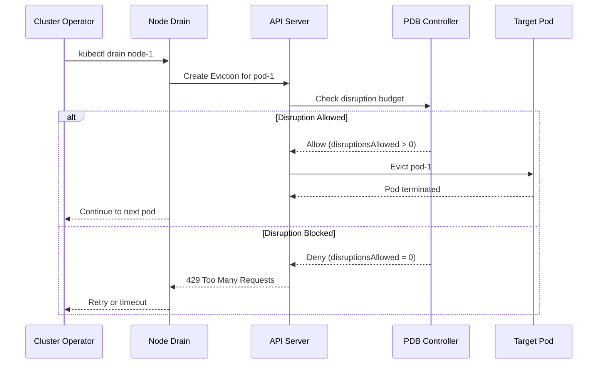
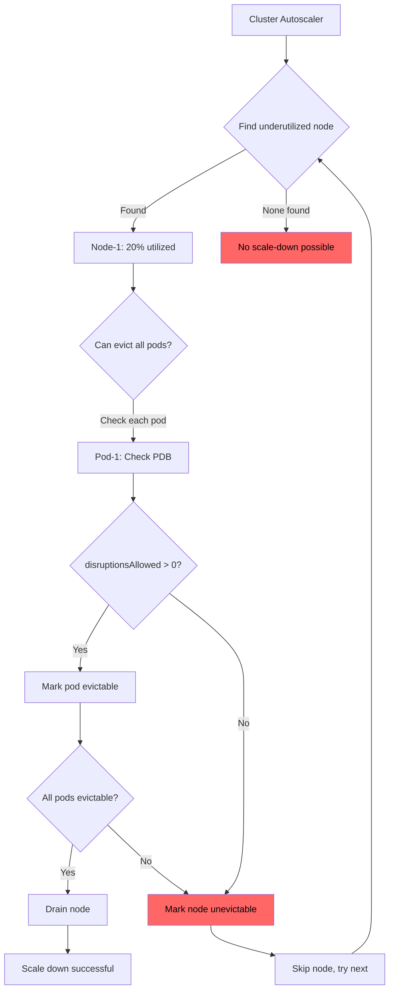
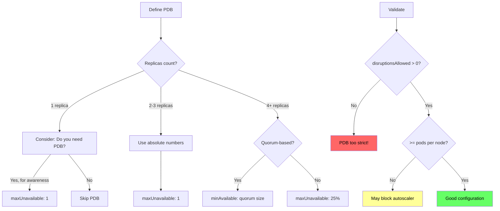

*[PDB]: Pod Disruption Budget
*[K8s]: Kubernetes
*[HPA]: Horizontal Pod Autoscaler
*[CA]: Cluster Autoscaler
*[API]: Application Programming Interface
*[SLA]: Service Level Agreement
*[RBAC]: Role-Based Access Control

# Disruption Budgets: Surviving Autoscaler Churn

## Introduction

Frame the tension between availability and operations: PodDisruptionBudgets (PDBs) protect workloads from voluntary disruptions—node drains, upgrades, autoscaler scale-downs—but poorly configured PDBs create a different problem. Overly strict PDBs can block node rotations entirely, prevent security patches, and cause cluster autoscaler deadlocks. This section establishes that PDBs are a contract between workload owners and cluster operators, and like any contract, the terms matter.

_Include a scenario: a platform team schedules a node rotation for security patching. The rotation begins at 2 AM. By 6 AM, the on-call engineer is paged—half the nodes are stuck in "draining" state. Investigation reveals that a critical service has `maxUnavailable: 0` with 3 replicas, but all 3 pods landed on nodes scheduled for rotation. The PDB that was supposed to protect availability is now preventing the security patch that protects availability. The lesson: PDBs require thinking about both directions—protecting from disruption AND allowing necessary operations._

<Callout type="warning">
A PDB that blocks all disruptions doesn't protect your service—it protects it from getting security patches, upgrades, and capacity optimization. The goal is controlled disruption, not zero disruption.
</Callout>

## PDB Fundamentals

### How PDBs Work

```yaml title="pdb-basics.yaml"
# PodDisruptionBudget anatomy

apiVersion: policy/v1
kind: PodDisruptionBudget
metadata:
  name: api-server-pdb
  namespace: production
spec:
  # Target pods via label selector
  selector:
    matchLabels:
      app: api-server

  # Option 1: Minimum pods that must remain available
  minAvailable: 2

  # Option 2: Maximum pods that can be unavailable
  # maxUnavailable: 1

  # Note: Can only specify ONE of minAvailable or maxUnavailable

---
# PDB status shows current state
# kubectl get pdb api-server-pdb -o yaml
status:
  currentHealthy: 5        # Pods currently ready
  desiredHealthy: 2        # Minimum required by PDB
  disruptionsAllowed: 3    # How many can be disrupted now
  expectedPods: 5          # Total pods matching selector

  # conditions show PDB health
  conditions:
    - type: DisruptionAllowed
      status: "True"
      reason: SufficientPods
      message: "The disruption budget allows 3 disruptions"
```
Code: PDB structure and status.


Figure: PDB eviction flow.

### minAvailable vs maxUnavailable

```yaml title="min-vs-max.yaml"
# Understanding the difference

# Scenario: 5-replica deployment

# Option 1: minAvailable: 2
# - At least 2 pods must be running
# - Can disrupt up to 3 pods simultaneously
# - Safe for cluster operations
pdb_min_available:
  replicas: 5
  minAvailable: 2
  disruptionsAllowed: 3  # 5 - 2 = 3

# Option 2: minAvailable: 80%
# - At least 80% of pods must be running
# - 80% of 5 = 4 pods minimum
# - Can disrupt 1 pod at a time
pdb_min_percent:
  replicas: 5
  minAvailable: "80%"
  disruptionsAllowed: 1  # 5 - ceil(5*0.8) = 1

# Option 3: maxUnavailable: 1
# - At most 1 pod can be unavailable
# - 4 must remain available
# - Similar to 80% but explicit
pdb_max_unavailable:
  replicas: 5
  maxUnavailable: 1
  disruptionsAllowed: 1

# Option 4: maxUnavailable: 25%
# - At most 25% can be unavailable
# - floor(5*0.25) = 1 can be unavailable
pdb_max_percent:
  replicas: 5
  maxUnavailable: "25%"
  disruptionsAllowed: 1

---
# The dangerous patterns

# DANGER: minAvailable equals replicas
apiVersion: policy/v1
kind: PodDisruptionBudget
metadata:
  name: too-strict-pdb
spec:
  selector:
    matchLabels:
      app: critical-service
  minAvailable: 3  # Same as replica count!

# Result: disruptionsAllowed = 0
# No pods can EVER be evicted voluntarily
# Node drains will hang forever

---
# DANGER: maxUnavailable: 0
apiVersion: policy/v1
kind: PodDisruptionBudget
metadata:
  name: zero-tolerance-pdb
spec:
  selector:
    matchLabels:
      app: critical-service
  maxUnavailable: 0

# Same result: no voluntary disruptions allowed
```
Code: minAvailable vs maxUnavailable scenarios.

| Configuration | 5 Replicas | 10 Replicas | Behavior |
|---------------|------------|-------------|----------|
| minAvailable: 2 | 3 can disrupt | 8 can disrupt | Absolute minimum |
| minAvailable: 80% | 1 can disrupt | 2 can disrupt | Scales with replicas |
| maxUnavailable: 1 | 1 can disrupt | 1 can disrupt | Absolute maximum down |
| maxUnavailable: 25% | 1 can disrupt | 2 can disrupt | Scales with replicas |

Table: PDB configuration impact.

<Callout type="info">
Use `maxUnavailable` for most cases—it's easier to reason about ("at most 1 pod down at a time"). Use `minAvailable` when you have a hard minimum for quorum-based systems (etcd needs 2 of 3, ZooKeeper needs 2 of 3).
</Callout>

## Cluster Autoscaler Interaction

### Scale-Down and PDBs

```yaml title="autoscaler-pdb-interaction.yaml"
# Cluster Autoscaler respects PDBs during scale-down

cluster_autoscaler_config:
  # Autoscaler will NOT scale down a node if:
  # 1. Evicting pods would violate a PDB
  # 2. Node has pods with local storage (unless configured)
  # 3. Node has pods not managed by controller

  scale_down_behavior:
    # How long node must be underutilized before scale-down
    scale-down-unneeded-time: 10m

    # How long to wait after scale-up before considering scale-down
    scale-down-delay-after-add: 10m

    # Maximum time to wait for pod eviction
    max-graceful-termination-sec: 600

    # Skip nodes with pods that have PDB violations
    skip-nodes-with-pdb: true  # Default behavior

---
# PDB blocking scenario
scenario:
  setup:
    - node_count: 5
    - workload: "10 pods, evenly distributed (2 per node)"
    - pdb: "minAvailable: 9"

  autoscaler_attempts_scale_down:
    node_1:
      pods: ["pod-1", "pod-2"]
      can_evict: false  # Would violate PDB (10-2=8 < 9)

    node_2:
      pods: ["pod-3", "pod-4"]
      can_evict: false  # Same reason

  result: "No nodes can be removed"
  cost_impact: "Paying for 5 nodes when 3 would suffice"
```
Code: Cluster autoscaler PDB interaction.

### Avoiding Autoscaler Deadlocks

```yaml title="autoscaler-deadlock.yaml"
# Deadlock scenario and prevention

# The deadlock: PDB prevents scale-down, but pods are spread
# across underutilized nodes

deadlock_example:
  situation:
    nodes: 10
    utilization: "20% average"  # Very underutilized
    pods: 30 (app with minAvailable: 28)
    distribution: "3 pods per node"

  why_deadlock:
    - "Each node has 3 pods"
    - "Evicting any node's pods would leave 27 < 28"
    - "No single node can be drained"
    - "Cluster stays at 10 nodes forever"

  cost: "$500/month wasted on unused capacity"

---
# Prevention: Allow sufficient disruption headroom

apiVersion: policy/v1
kind: PodDisruptionBudget
metadata:
  name: allows-scale-down
spec:
  selector:
    matchLabels:
      app: my-service
  # Allow at least max-pods-per-node to be disrupted
  # If nodes have up to 4 pods, allow 4+ disruptions
  maxUnavailable: 5  # More than pods per node

---
# Alternative: Use percentage that allows node drain
apiVersion: policy/v1
kind: PodDisruptionBudget
metadata:
  name: percent-based-pdb
spec:
  selector:
    matchLabels:
      app: my-service
  # 20% of 30 pods = 6 can be unavailable
  # Enough to drain any single node
  maxUnavailable: "20%"

---
# Calculate safe PDB settings
pdb_calculation:
  formula: |
    maxUnavailable >= ceil(total_pods / node_count)

  example:
    total_pods: 30
    node_count: 10
    pods_per_node: 3
    safe_maxUnavailable: 4  # At least 4 to drain any node

  with_headroom:
    # Add buffer for pod scheduling delays
    recommended_maxUnavailable: 5
```
Code: Avoiding autoscaler deadlocks.


Figure: Autoscaler scale-down decision flow.

<Callout type="warning">
The most common PDB deadlock: you have N nodes with M pods spread evenly, and your PDB requires more than (total_pods - pods_per_node) to be available. Calculate your PDB settings based on your cluster topology, not just your application needs.
</Callout>

## Node Rotation Strategies

### Rolling Node Updates

```yaml title="node-rotation.yaml"
# Node rotation patterns that work with PDBs

# Strategy 1: Surge-then-drain (recommended)
surge_then_drain:
  steps:
    1_add_new_nodes:
      action: "Add N new nodes with updated config"
      pdb_impact: "None - only adding capacity"

    2_cordon_old_nodes:
      action: "kubectl cordon old-node-*"
      pdb_impact: "None - prevents new scheduling only"

    3_drain_sequentially:
      action: "kubectl drain old-node-1 --delete-emptydir-data"
      pdb_impact: "PDB checked for each eviction"

    4_verify_and_continue:
      action: "Wait for pods to reschedule, then drain next"
      pdb_impact: "Respect disruptionsAllowed"

---
# Drain command with PDB awareness
apiVersion: batch/v1
kind: Job
metadata:
  name: rolling-node-update
spec:
  template:
    spec:
      containers:
        - name: drain-controller
          image: bitnami/kubectl:latest
          command:
            - /bin/bash
            - -c
            - |
              # Get nodes to rotate
              OLD_NODES=$(kubectl get nodes -l node-version=old -o name)

              for node in $OLD_NODES; do
                echo "Draining $node..."

                # Cordon first (no new pods)
                kubectl cordon $node

                # Drain with timeout and PDB respect
                kubectl drain $node \
                  --delete-emptydir-data \
                  --ignore-daemonsets \
                  --timeout=600s \
                  --pod-selector='app!=critical-singleton'

                # Check drain status
                if [ $? -eq 0 ]; then
                  echo "$node drained successfully"
                  # Delete node (or let autoscaler do it)
                  kubectl delete node $node
                else
                  echo "WARN: $node drain timed out, checking PDB status"
                  kubectl get pdb -A -o wide
                  # Alert but continue to next node
                fi

                # Wait for cluster to stabilize
                sleep 60

                # Verify all PDBs are satisfied
                kubectl get pdb -A | grep -v "ALLOWED" | grep -v "NAME" && \
                  echo "WARN: Some PDBs not satisfied"
              done
      restartPolicy: OnFailure
```
Code: Node rotation with PDB awareness.

### Handling Stuck Drains

```yaml title="stuck-drain-handling.yaml"
# Diagnosing and resolving stuck drains

# Step 1: Identify blocking PDBs
diagnosis_commands:
  check_pdb_status: |
    kubectl get pdb -A -o wide
    # Look for ALLOWED=0 or ALLOWED column

  check_specific_pdb: |
    kubectl describe pdb <pdb-name> -n <namespace>
    # Check conditions and events

  find_pods_on_draining_node: |
    kubectl get pods -A -o wide --field-selector spec.nodeName=<node>

  check_pod_pdb_mapping: |
    # Find which PDB protects a pod
    for pdb in $(kubectl get pdb -A -o name); do
      selector=$(kubectl get $pdb -o jsonpath='{.spec.selector.matchLabels}')
      echo "$pdb: $selector"
    done

---
# Step 2: Resolution options

resolution_options:
  option_1_wait:
    description: "Wait for pods to become healthy"
    when: "Pods are starting up or failing health checks"
    action: "Fix pod health issues, PDB will allow disruption"

  option_2_scale_up:
    description: "Add replicas to satisfy PDB"
    when: "minAvailable > current healthy pods"
    action: |
      kubectl scale deployment <name> --replicas=<higher>
      # Wait for new pods to be ready
      # Then drain will succeed

  option_3_adjust_pdb:
    description: "Relax PDB temporarily"
    when: "PDB is too strict for operations"
    action: |
      kubectl patch pdb <name> -p '{"spec":{"minAvailable":1}}'
      # Perform drain
      # Restore original PDB

  option_4_force_delete:
    description: "Delete pods without eviction API"
    when: "Emergency, accepting availability risk"
    action: |
      kubectl delete pod <pod> --grace-period=0 --force
    warning: "Bypasses PDB entirely - use only in emergencies"

---
# Automation: Smart drain with backoff
apiVersion: v1
kind: ConfigMap
metadata:
  name: smart-drain-script
data:
  drain.sh: |
    #!/bin/bash
    NODE=$1
    MAX_RETRIES=10
    RETRY_DELAY=60

    kubectl cordon $NODE

    for i in $(seq 1 $MAX_RETRIES); do
      echo "Drain attempt $i of $MAX_RETRIES..."

      if kubectl drain $NODE \
        --delete-emptydir-data \
        --ignore-daemonsets \
        --timeout=300s 2>&1; then
        echo "Drain successful"
        exit 0
      fi

      # Check why drain failed
      BLOCKING_PDBS=$(kubectl get pdb -A -o json | \
        jq -r '.items[] | select(.status.disruptionsAllowed == 0) | .metadata.name')

      if [ -n "$BLOCKING_PDBS" ]; then
        echo "Blocked by PDBs: $BLOCKING_PDBS"
        echo "Waiting for pods to become healthy..."
      fi

      sleep $RETRY_DELAY
    done

    echo "Drain failed after $MAX_RETRIES attempts"
    exit 1
```
Code: Handling stuck drains.

| Symptom | Likely Cause | Resolution |
|---------|--------------|------------|
| disruptionsAllowed: 0 | Too strict PDB | Relax PDB or scale up deployment |
| Pods not Ready | Health check failures | Fix pod health issues |
| Drain timeout | PDB blocking + slow pod startup | Increase timeout, fix startup time |
| All nodes stuck | Fleet-wide PDB issue | Review PDB strategy |

Table: Stuck drain diagnosis.

<Callout type="danger">
Never use `--force` in production node drains unless you've exhausted all other options and accepted the availability impact. Forced deletion bypasses PDBs entirely and can cause cascading failures in quorum-based systems.
</Callout>

## Production PDB Patterns

### Recommended Configurations

```yaml title="production-pdb-patterns.yaml"
# Pattern 1: Stateless web services
apiVersion: policy/v1
kind: PodDisruptionBudget
metadata:
  name: web-service-pdb
spec:
  selector:
    matchLabels:
      app: web-service
      tier: frontend
  # Allow 25% unavailable - balances availability with operations
  maxUnavailable: "25%"

---
# Pattern 2: Stateful services (databases, caches)
apiVersion: policy/v1
kind: PodDisruptionBudget
metadata:
  name: redis-cluster-pdb
spec:
  selector:
    matchLabels:
      app: redis
      role: primary
  # Quorum-based: 3-node cluster needs 2 for quorum
  minAvailable: 2

---
# Pattern 3: Singleton services (leader election)
apiVersion: policy/v1
kind: PodDisruptionBudget
metadata:
  name: scheduler-pdb
spec:
  selector:
    matchLabels:
      app: custom-scheduler
  # Only 1 replica - allow disruption but warn
  maxUnavailable: 1
  # Note: This effectively allows full disruption
  # Consider if PDB is even useful here

---
# Pattern 4: Batch/job workloads
# Generally: NO PDB for batch jobs
# Jobs should be restartable and handle interruption
# PDB on jobs creates operational headaches

---
# Pattern 5: DaemonSets
apiVersion: policy/v1
kind: PodDisruptionBudget
metadata:
  name: logging-agent-pdb
spec:
  selector:
    matchLabels:
      app: fluentd
  # DaemonSets: one per node, so maxUnavailable is node count
  # Allow 10% of nodes to be drained simultaneously
  maxUnavailable: "10%"

---
# Pattern 6: Minimum viable PDB for all deployments
# Recommended baseline for any production deployment
apiVersion: policy/v1
kind: PodDisruptionBudget
metadata:
  name: default-pdb-template
spec:
  selector:
    matchLabels:
      app: "{{ .name }}"
  # Never block all disruptions
  # Always allow at least 1 pod to be evicted
  maxUnavailable: 1
```
Code: Production PDB patterns.

### Anti-Patterns to Avoid

```yaml title="pdb-anti-patterns.yaml"
# Anti-pattern 1: minAvailable equals replica count
# NEVER DO THIS
apiVersion: policy/v1
kind: PodDisruptionBudget
metadata:
  name: blocks-everything
spec:
  selector:
    matchLabels:
      app: my-service
  minAvailable: 3  # Same as deployment replicas!

# Problem: disruptionsAllowed = 0, nothing can be evicted
# Fix: minAvailable: 2 (or maxUnavailable: 1)

---
# Anti-pattern 2: PDB without enough replicas
apiVersion: apps/v1
kind: Deployment
metadata:
  name: my-service
spec:
  replicas: 2  # Only 2 replicas
---
apiVersion: policy/v1
kind: PodDisruptionBudget
metadata:
  name: my-service-pdb
spec:
  selector:
    matchLabels:
      app: my-service
  minAvailable: 2  # Requires both pods!

# Problem: If one pod fails, PDB blocks operations
# Fix: Either increase replicas or reduce minAvailable

---
# Anti-pattern 3: Percentage that rounds to all pods
apiVersion: policy/v1
kind: PodDisruptionBudget
metadata:
  name: percentage-trap
spec:
  selector:
    matchLabels:
      app: small-service
  minAvailable: "90%"  # With 3 replicas = ceil(2.7) = 3

# Problem: 90% of 3 = 2.7, rounds UP to 3, blocks all
# Fix: Use absolute numbers for small deployments

---
# Anti-pattern 4: Multiple PDBs for same pods
apiVersion: policy/v1
kind: PodDisruptionBudget
metadata:
  name: pdb-1
spec:
  selector:
    matchLabels:
      app: my-service
  maxUnavailable: 1
---
apiVersion: policy/v1
kind: PodDisruptionBudget
metadata:
  name: pdb-2
spec:
  selector:
    matchLabels:
      app: my-service
      version: v2
  minAvailable: 2

# Problem: Pods matching both PDBs must satisfy BOTH
# This is stricter than either alone
# Fix: Use one PDB per logical pod group

---
# Anti-pattern 5: PDB on single-replica deployments
# Questionable value - PDB allows 0 or 1 unavailable
# If 1 unavailable is acceptable, why have PDB?
# If 0 unavailable is needed, run more replicas
```
Code: PDB anti-patterns.


Figure: PDB configuration decision tree.

<Callout type="success">
The golden rule: always have at least 1 more replica than your minAvailable requires, AND ensure maxUnavailable is at least as large as your maximum pods-per-node. This prevents both availability violations and autoscaler deadlocks.
</Callout>

## Monitoring and Alerting

### PDB Health Metrics

```yaml title="pdb-monitoring.yaml"
# Prometheus queries for PDB health

prometheus_queries:
  # PDBs that are blocking disruptions
  pdbs_blocking: |
    kube_poddisruptionbudget_status_pod_disruptions_allowed == 0

  # PDBs where current healthy < desired
  pdbs_unhealthy: |
    kube_poddisruptionbudget_status_current_healthy
    < kube_poddisruptionbudget_status_desired_healthy

  # Ratio of disruptions allowed to expected pods
  pdb_flexibility_ratio: |
    kube_poddisruptionbudget_status_pod_disruptions_allowed
    / kube_poddisruptionbudget_status_expected_pods

  # PDBs that have been blocking for extended period
  pdbs_stuck_blocking: |
    (kube_poddisruptionbudget_status_pod_disruptions_allowed == 0)
    and on(namespace, poddisruptionbudget)
    (changes(kube_poddisruptionbudget_status_pod_disruptions_allowed[1h]) == 0)

---
# Alert rules
apiVersion: monitoring.coreos.com/v1
kind: PrometheusRule
metadata:
  name: pdb-alerts
spec:
  groups:
    - name: pdb.rules
      rules:
        - alert: PDBBlockingDisruptions
          expr: |
            kube_poddisruptionbudget_status_pod_disruptions_allowed == 0
          for: 30m
          labels:
            severity: warning
          annotations:
            summary: "PDB {{ $labels.poddisruptionbudget }} blocking all disruptions"
            description: "PDB in namespace {{ $labels.namespace }} has disruptionsAllowed=0 for 30+ minutes"
            runbook: "Check if deployment is unhealthy or PDB is misconfigured"

        - alert: PDBViolated
          expr: |
            kube_poddisruptionbudget_status_current_healthy
            < kube_poddisruptionbudget_status_desired_healthy
          for: 5m
          labels:
            severity: critical
          annotations:
            summary: "PDB {{ $labels.poddisruptionbudget }} violated"
            description: "Current healthy pods ({{ $value }}) below minimum required"

        - alert: PDBTooStrict
          expr: |
            kube_poddisruptionbudget_status_pod_disruptions_allowed
            < (kube_poddisruptionbudget_status_expected_pods / 4)
          for: 24h
          labels:
            severity: info
          annotations:
            summary: "PDB {{ $labels.poddisruptionbudget }} may be too strict"
            description: "PDB allows fewer than 25% of pods to be disrupted"

---
# Grafana dashboard query
grafana_panels:
  pdb_overview:
    title: "PDB Status Overview"
    query: |
      sum by (namespace) (
        kube_poddisruptionbudget_status_pod_disruptions_allowed == 0
      )

  disruption_capacity:
    title: "Fleet Disruption Capacity"
    query: |
      sum(kube_poddisruptionbudget_status_pod_disruptions_allowed)
      / sum(kube_poddisruptionbudget_status_expected_pods) * 100
```
Code: PDB monitoring setup.

### Operational Dashboards

```typescript title="pdb-dashboard.ts"
// PDB health dashboard component

interface PDBStatus {
  name: string;
  namespace: string;
  currentHealthy: number;
  desiredHealthy: number;
  disruptionsAllowed: number;
  expectedPods: number;
  status: 'healthy' | 'warning' | 'critical';
}

function assessPDBHealth(pdb: PDBStatus): PDBAssessment {
  const assessment: PDBAssessment = {
    status: 'healthy',
    issues: [],
    recommendations: [],
  };

  // Check if PDB is violated
  if (pdb.currentHealthy < pdb.desiredHealthy) {
    assessment.status = 'critical';
    assessment.issues.push(`Only ${pdb.currentHealthy}/${pdb.desiredHealthy} healthy pods`);
    assessment.recommendations.push('Investigate pod failures immediately');
  }

  // Check if PDB is blocking operations
  if (pdb.disruptionsAllowed === 0) {
    if (assessment.status !== 'critical') {
      assessment.status = 'warning';
    }
    assessment.issues.push('No disruptions currently allowed');

    if (pdb.currentHealthy === pdb.desiredHealthy) {
      assessment.recommendations.push(
        'Consider reducing minAvailable or increasing replicas'
      );
    }
  }

  // Check if PDB is too strict for autoscaler
  const flexibilityRatio = pdb.disruptionsAllowed / pdb.expectedPods;
  if (flexibilityRatio < 0.2) {
    assessment.issues.push(`Low flexibility: only ${(flexibilityRatio * 100).toFixed(0)}% can be disrupted`);
    assessment.recommendations.push('May block cluster autoscaler scale-down');
  }

  return assessment;
}

// Cluster-wide PDB report
async function generatePDBReport(kubeconfig: string): Promise<PDBReport> {
  const pdbs = await getAllPDBs(kubeconfig);
  const nodes = await getNodeCount(kubeconfig);
  const podsPerNode = await getAveragePodsPerNode(kubeconfig);

  const report: PDBReport = {
    totalPDBs: pdbs.length,
    blocking: pdbs.filter(p => p.disruptionsAllowed === 0).length,
    violated: pdbs.filter(p => p.currentHealthy < p.desiredHealthy).length,
    autoscalerSafe: pdbs.filter(p => p.disruptionsAllowed >= podsPerNode).length,
    details: pdbs.map(assessPDBHealth),
  };

  return report;
}
```
Code: PDB health assessment.

| Metric | Healthy | Warning | Critical |
|--------|---------|---------|----------|
| disruptionsAllowed | > 20% of pods | 1-20% of pods | 0 |
| currentHealthy vs desired | Equal | - | Below |
| Blocking duration | < 5 min | 5-30 min | > 30 min |
| Flexibility ratio | > 25% | 10-25% | < 10% |

Table: PDB health thresholds.

<Callout type="info">
Alert on PDBs blocking disruptions for more than 30 minutes—this indicates either a misconfigured PDB or unhealthy pods. Either way, it needs human attention before it blocks the next operational event.
</Callout>

## Conclusion

Summarize the key PDB principles: PDBs are contracts between workload owners and platform operators. The goal is controlled disruption, not zero disruption. Configure PDBs to allow at least enough disruptions for single-node drains, monitor for PDBs that block operations, and have clear procedures for resolving stuck drains. Emphasize that PDBs should enable operations, not block them—a cluster that can't be maintained is not a reliable cluster.

<Callout type="success">
The best PDB configuration is invisible: it protects your workloads during operations without anyone noticing. If your platform team is constantly battling PDBs during node rotations, the PDBs are misconfigured—not too loose, but too strict.
</Callout>

---

## Cover Prompt

### Prompt 1: The Traffic Controller

Create an image of an air traffic controller managing planes (pods) on runways (nodes). The controller uses a board showing minimum planes that must remain airborne (minAvailable). Some runways are closed for maintenance while ensuring enough planes stay flying. Style: air traffic control, managed disruption, operational continuity, 16:9 aspect ratio.

### Prompt 2: The Hospital Capacity

Design an image of a hospital administrator managing bed capacity during renovations. A board shows minimum beds that must stay available (PDB). Workers renovate some rooms while patients are carefully moved to maintain minimum capacity. Style: hospital management, capacity planning, controlled renovation, 16:9 aspect ratio.

### Prompt 3: The Bridge Lanes

Illustrate a bridge with multiple lanes where some lanes are closed for maintenance. A sign shows "Minimum 3 lanes open at all times" (minAvailable). Traffic controllers manage which lanes can be closed while maintaining flow. Workers blocked from closing more lanes until traffic redistributes. Style: traffic management, lane closure coordination, 16:9 aspect ratio.

### Prompt 4: The Orchestra Rotation

Create an image of an orchestra where musicians (pods) take breaks in rotation. The conductor (PDB) ensures minimum players per section remain at all times. Some musicians rest while others play, with a display showing "Minimum 4 violins required." Style: orchestra coordination, rotation scheduling, ensemble management, 16:9 aspect ratio.

### Prompt 5: The Factory Shift Change

Design an image of a factory floor during shift change. Some workers leave (node drain) while others arrive (new pods). A capacity board shows minimum workers required per station (minAvailable). Supervisors coordinate to never drop below minimum. Stuck workers unable to leave because minimum isn't met yet. Style: shift coordination, factory operations, capacity constraints, 16:9 aspect ratio.
