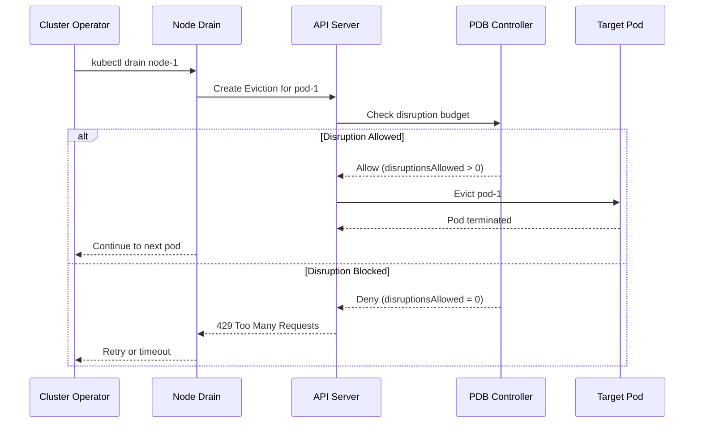
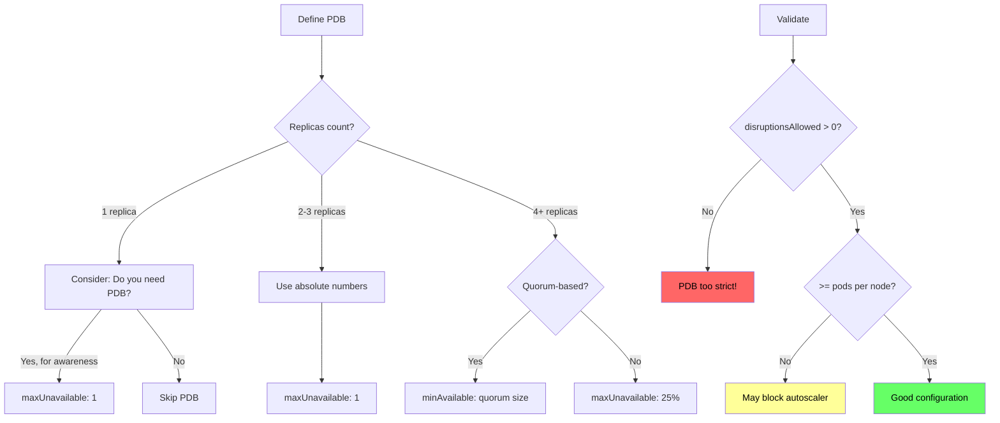

*[PDB]: Pod Disruption Budget
*[PDBs]: Pod Disruption Budget
*[K8s]: Kubernetes
*[HPA]: Horizontal Pod Autoscaler
*[CA]: Cluster Autoscaler
*[API]: Application Programming Interface
*[SLA]: Service Level Agreement
*[RBAC]: Role-Based Access Control

A PodDisruptionBudget (PDB) is a native Kubernetes resource that limits how many pods can be down simultaneously during voluntary disruptions—node drains, upgrades, autoscaler scale-downs. It's the mechanism that keeps your service available while the cluster changes around it. But poorly configured PDBs create a different problem: overly strict budgets can block node rotations entirely, prevent security patches, and cause cluster autoscaler deadlocks. A PDB is a contract between workload owners and cluster operators, and like any contract, the terms matter.

Here's a scenario I've seen more than once: a platform team schedules node rotation for security patching. The rotation begins at 2 AM. By 6 AM, the on-call engineer is paged—half the nodes are stuck in "draining" state.

Investigation reveals a critical service with `minAvailable: 3` and 3 replicas, but all 3 pods landed on nodes scheduled for rotation. The PDB that was supposed to protect availability is now _preventing_ the security patch that protects availability. The lesson: PDBs require thinking about both directions—protecting from disruption _and_ allowing necessary operations.

<Callout type="warning">
A PDB that blocks all disruptions doesn't protect your service—it protects it from getting security patches, upgrades, and capacity optimization. The goal is controlled disruption, not zero disruption.
</Callout>

## PDB Fundamentals

### How PDBs Work

A PDB targets pods via a label selector and specifies either a minimum number that must remain available (`minAvailable`) or a maximum that can be unavailable (`maxUnavailable`). When something attempts to evict a pod—whether it's `kubectl drain`, the cluster autoscaler, or a node upgrade controller—the API server checks the PDB before allowing the eviction.

```yaml title="pdb-basics.yaml"
apiVersion: policy/v1
kind: PodDisruptionBudget
metadata:
  name: api-server-pdb
  namespace: production
spec:
  selector:
    matchLabels:
      app: api-server
  # Minimum pods that must remain available
  minAvailable: 2
  # OR maximum pods that can be unavailable (pick one, not both)
  # maxUnavailable: 1
```

Code: Basic PDB structure targeting pods with the `app: api-server` label.

The PDB controller continuously tracks how many matching pods are healthy and calculates a key field: `disruptionsAllowed`. This number tells you how many pods can currently be evicted without violating the budget. If it's zero, nothing can be evicted. You can check the current state with `kubectl get pdb`:

```text
NAME             MIN AVAILABLE   MAX UNAVAILABLE   ALLOWED DISRUPTIONS   AGE
api-server-pdb   2               N/A               3                     24h
```

Figure: PDB status showing 3 disruptions allowed (5 healthy pods minus 2 minimum).

The eviction flow works like this: when a drain or autoscaler attempts to evict a pod, it creates an Eviction object through the API server. The API server checks the relevant PDB. If `disruptionsAllowed` is greater than zero, the eviction proceeds. If it's zero, the API returns a 429 (Too Many Requests) and the eviction is blocked.



Figure: PDB eviction decision flow.

### minAvailable vs maxUnavailable

Choosing the wrong mode is one of the most common causes of autoscaler deadlocks. The two PDB modes look similar but behave differently as your replica count changes. Consider a 5-replica deployment:

- `minAvailable: 2` means at least 2 must stay up, so 3 can be disrupted simultaneously
- `maxUnavailable: 1` means at most 1 can be down, so only 1 can be disrupted at a time

The math gets interesting with percentages. `minAvailable: 80%` on 5 replicas means ceil(5 × 0.8) = 4 must stay up, allowing only 1 disruption. `maxUnavailable: 25%` means floor(5 × 0.25) = 1 can be down. Same result, but the behavior diverges as you scale.

| Configuration       | 5 Replicas    | 10 Replicas   | Behavior              |
| ------------------- | ------------- | ------------- | --------------------- |
| minAvailable: 2     | 3 can disrupt | 8 can disrupt | Absolute minimum      |
| minAvailable: 80%   | 1 can disrupt | 2 can disrupt | Scales with replicas  |
| maxUnavailable: 1   | 1 can disrupt | 1 can disrupt | Absolute maximum down |
| maxUnavailable: 25% | 1 can disrupt | 2 can disrupt | Scales with replicas  |

Table: How PDB configurations scale with replica count.

The dangerous patterns to avoid: setting `minAvailable` equal to your replica count, or setting `maxUnavailable: 0`. Both result in `disruptionsAllowed: 0`, meaning no pods can _ever_ be evicted voluntarily. Node drains will hang forever.

<Callout type="info">
Use `maxUnavailable` for most cases—it's easier to reason about ("at most 1 pod down at a time"). Use `minAvailable` when you have a hard minimum for quorum-based systems (etcd needs 2 of 3, ZooKeeper needs 2 of 3).
</Callout>

## Cluster Autoscaler Interaction

The cluster autoscaler respects PDBs during scale-down operations. Before removing an underutilized node, it checks whether evicting all pods on that node would violate any PDB. If it would, the node is skipped. This is usually the right behavior—you don't want cost optimization to cause outages—but it creates a common operational trap.

### Scale-Down and PDBs

Here's the scenario: you have 10 pods spread evenly across 5 nodes (2 pods per node), with a PDB requiring `minAvailable: 9`. The autoscaler identifies node-1 as underutilized and attempts scale-down. But evicting node-1's 2 pods would leave only 8 healthy pods, violating the PDB. The autoscaler tries node-2—same problem. Every node is blocked.

The result: you're paying for 5 nodes when 3 would be enough. The PDB that protects availability is now costing you money.

### Avoiding Autoscaler Deadlocks

The deadlock happens when your PDB's `disruptionsAllowed` is smaller than the maximum pods on any single node. The fix is straightforward: ensure your PDB allows at least as many disruptions as the most pods you'll have on one node.

<Callout type="info">
**The autoscaler-safe formula:** `maxUnavailable >= ceil(total_pods / node_count)`
</Callout>

For 30 pods across 10 nodes (3 pods per node), you need `maxUnavailable: 4` or higher. With a 20% buffer for scheduling delays during drain, `maxUnavailable: 5` is safer.

```yaml title="autoscaler-safe-pdb.yaml"
apiVersion: policy/v1
kind: PodDisruptionBudget
metadata:
  name: autoscaler-friendly-pdb
spec:
  selector:
    matchLabels:
      app: my-service
  # 20% of pods can be unavailable
  # For 30 pods: floor(30 * 0.2) = 6 can be down
  # Safely covers draining any single node (3 pods)
  maxUnavailable: "20%"
```

Code: PDB configured to allow autoscaler scale-down.

The percentage approach scales automatically as your deployment grows. If you scale to 60 pods across 20 nodes, 20% still allows 12 disruptions—more than enough to drain any node.

<Callout type="warning">
The most common PDB deadlock: you have N nodes with M pods spread evenly, and your PDB requires more than (total_pods - pods_per_node) to be available. Calculate your PDB settings based on your cluster topology, not just your application needs.
</Callout>

## Node Rotation Strategies

Node rotations happen for many reasons: security patches, Kubernetes version upgrades, instance type changes, or AMI updates. The key to smooth rotations is working _with_ PDBs rather than fighting them.

### Rolling Node Updates

The recommended approach is surge-then-drain: add new nodes first, then drain old ones sequentially. This maintains capacity throughout the rotation and gives PDBs room to work.

1. **Add new nodes** with the updated configuration.
2. **Cordon old nodes** to prevent new pods from scheduling on them.
3. **Drain nodes one at a time**, waiting for pods to reschedule before continuing.
4. **Remove drained nodes** once empty.

This sequence maintains capacity throughout the rotation. Cordoning doesn't evict anything—it just marks nodes as unschedulable. Step 3 is where PDBs do their job, ensuring availability while pods migrate. If you're using managed node groups, the autoscaler handles step 4 automatically.

The drain command respects PDBs by default:

```bash
kubectl drain node-1 \
  --delete-emptydir-data \
  --ignore-daemonsets \
  --timeout=600s
```

Code: Basic drain command with common flags.

The `--timeout` flag is critical. Without it, a blocked drain will hang forever. With it, you'll get an error after 10 minutes that tells you which PDB is blocking.

### Handling Stuck Drains

When a drain times out, the first step is identifying what's blocking it:

```bash
# Check which PDBs have zero disruptions allowed
kubectl get pdb -A -o wide | grep "0"

# Find pods still on the draining node
kubectl get pods -A --field-selector spec.nodeName=node-1
```

Code: Diagnosing a stuck drain.

You're looking for PDBs where the `ALLOWED DISRUPTIONS` column shows `0`—those are the ones blocking your drain. Cross-reference with the pods still on the node to identify the culprit.

Once you've identified the blocking PDB, you have several options depending on the situation:

**Wait for pods to become healthy.** If `disruptionsAllowed` is zero because pods are failing health checks, fix the health issue. Once pods are healthy, the PDB will allow disruptions again.

**Scale up the deployment.** If you have `minAvailable: 3` but only 3 replicas and one is unhealthy, add a fourth replica. Once it's ready, you'll have headroom to drain.

**Temporarily relax the PDB.** For planned maintenance windows, you can patch the PDB to be less strict:

```bash
# Relax PDB for maintenance
kubectl patch pdb my-service-pdb -p '{"spec":{"minAvailable":1}}'

# Perform drain
kubectl drain node-1 --delete-emptydir-data --ignore-daemonsets

# Restore original PDB
kubectl patch pdb my-service-pdb -p '{"spec":{"minAvailable":2}}'
```

Code: Temporarily relaxing a PDB for maintenance.

**Force delete as last resort.** If you're in an emergency and need the node drained _now_, you can bypass the eviction API entirely with `kubectl delete pod --force --grace-period=0`. This ignores PDBs completely—the pod just disappears.

| Symptom                 | Likely Cause                | Resolution                           |
| ----------------------- | --------------------------- | ------------------------------------ |
| disruptionsAllowed: 0   | Too strict PDB              | Relax PDB or scale up deployment     |
| Pods not Ready          | Health check failures       | Fix pod health issues                |
| Drain timeout           | PDB blocking + slow startup | Increase timeout, fix startup time   |
| All nodes stuck         | Fleet-wide PDB issue        | Review PDB strategy                  |

Table: Stuck drain diagnosis guide.

<Callout type="danger">
Never use `--force` in production node drains unless you've exhausted all other options and accepted the availability impact. Forced deletion bypasses PDBs entirely and can cause cascading failures in quorum-based systems.
</Callout>

## Production PDB Patterns

After working through the mechanics, let's look at what actually works in production. The right PDB depends on your workload type.

### Recommended Configurations

**Stateless web services** benefit from percentage-based PDBs that scale with your deployment:

```yaml title="stateless-pdb.yaml"
apiVersion: policy/v1
kind: PodDisruptionBudget
metadata:
  name: web-service-pdb
spec:
  selector:
    matchLabels:
      app: web-service
  maxUnavailable: "25%"
```

Code: PDB for stateless services allowing 25% unavailable.

Twenty-five percent is a good default—it balances availability (75% always up) with operational flexibility (multiple pods can be evicted simultaneously during node drains).

**Stateful and quorum-based services** like etcd, ZooKeeper, or Redis clusters need `minAvailable` set to their quorum size:

```yaml title="quorum-pdb.yaml"
apiVersion: policy/v1
kind: PodDisruptionBudget
metadata:
  name: etcd-pdb
spec:
  selector:
    matchLabels:
      app: etcd
  # 3-node cluster needs 2 for quorum
  minAvailable: 2
```

Code: PDB for a 3-node etcd cluster requiring quorum.

**DaemonSets** are tricky because there's one pod per node. A percentage-based PDB controls how many nodes can drain simultaneously:

```yaml title="daemonset-pdb.yaml"
apiVersion: policy/v1
kind: PodDisruptionBudget
metadata:
  name: fluentd-pdb
spec:
  selector:
    matchLabels:
      app: fluentd
  # Allow 10% of nodes to drain at once
  maxUnavailable: "10%"
```

Code: PDB for a logging DaemonSet.

The right percentage depends on your tolerance for gaps. For logging agents like Fluentd, 10% means brief log gaps during rotation—usually acceptable. For monitoring agents or security daemons where gaps are more problematic, use 5%. For non-critical DaemonSets, 20-25% speeds up rotations significantly.

**Batch jobs and CronJobs** generally shouldn't have PDBs. Jobs should be restartable by design, and a PDB on a job creates operational headaches without providing real protection.

**Single-replica deployments** are a judgment call. A PDB with `maxUnavailable: 1` doesn't prevent disruption—it just makes the eviction use the eviction API instead of direct deletion. This can be useful for visibility and for systems that watch eviction events, but it doesn't provide availability protection. If you need zero downtime, run more replicas.

### Anti-Patterns to Avoid

Several PDB configurations look reasonable but cause problems:

**minAvailable equals replica count.** If you have 3 replicas and `minAvailable: 3`, nothing can ever be evicted. This is the most common PDB misconfiguration.

**Percentages that round badly.** `minAvailable: 90%` with 3 replicas means ceil(2.7) = 3 pods required—blocking all evictions. Use absolute numbers for small deployments.

**Multiple overlapping PDBs.** If a pod matches two PDBs, _both_ must allow the disruption. This is stricter than either PDB alone and often catches teams by surprise. For example: Team A creates a PDB for `app: payments` allowing 1 disruption, Team B creates a PDB for `tier: critical` allowing 2 disruptions. Pods with both labels need _both_ PDBs to allow eviction simultaneously—effectively the stricter of the two.



Figure: PDB configuration decision tree.

<Callout type="success">
The golden rule: always have at least 1 more replica than your minAvailable requires, AND ensure maxUnavailable is at least as large as your maximum pods-per-node. This prevents both availability violations and autoscaler deadlocks.
</Callout>

## Monitoring and Alerting

PDBs fail silently. A misconfigured PDB doesn't cause an immediate outage—it causes the _next_ node rotation to hang at 3 AM. Monitoring catches problems before they block operations.

### PDB Health Metrics

The kube-state-metrics project exposes PDB status as Prometheus metrics (ensure kube-state-metrics is deployed and scraped by Prometheus—it's included in most monitoring stacks like kube-prometheus-stack). The key metrics to watch:

- `kube_poddisruptionbudget_status_pod_disruptions_allowed` — how many pods can currently be evicted
- `kube_poddisruptionbudget_status_current_healthy` — pods currently passing health checks
- `kube_poddisruptionbudget_status_desired_healthy` — minimum required by the PDB

The most important alert is for PDBs that are blocking all disruptions:

```yaml title="pdb-alerts.yaml"
apiVersion: monitoring.coreos.com/v1
kind: PrometheusRule
metadata:
  name: pdb-alerts
spec:
  groups:
    - name: pdb.rules
      rules:
        - alert: PDBBlockingDisruptions
          expr: kube_poddisruptionbudget_status_pod_disruptions_allowed == 0
          for: 30m
          labels:
            severity: warning
          annotations:
            summary: "PDB {{ $labels.poddisruptionbudget }} blocking all disruptions"
            description: "PDB in {{ $labels.namespace }} has disruptionsAllowed=0 for 30+ minutes"

        - alert: PDBViolated
          expr: |
            kube_poddisruptionbudget_status_current_healthy
            < kube_poddisruptionbudget_status_desired_healthy
          for: 5m
          labels:
            severity: critical
          annotations:
            summary: "PDB {{ $labels.poddisruptionbudget }} violated"
            description: "Current healthy pods below minimum required"
```

Code: Essential PDB alerts for Prometheus.

The 30-minute threshold for `PDBBlockingDisruptions` balances signal quality with early warning. Brief blocking during deployments is normal; sustained blocking indicates a problem.

The `PDBViolated` alert is more urgent—it means you're already below your availability target, likely due to pod failures unrelated to eviction.

### Health Thresholds

Use these thresholds to assess PDB health at a glance:

| Metric                      | Healthy        | Warning       | Critical  |
| --------------------------- | -------------- | ------------- | --------- |
| disruptionsAllowed          | > 20% of pods  | 1-20% of pods | 0         |
| currentHealthy vs desired   | Equal          | -             | Below     |
| Blocking duration           | < 5 min        | 5-30 min      | > 30 min  |
| Flexibility ratio           | > 25%          | 10-25%        | < 10%     |

Table: PDB health thresholds for monitoring.

The flexibility ratio (disruptions allowed divided by total pods) tells you whether a PDB will block autoscaler scale-down. Below 20%, you're likely to hit deadlocks.

<Callout type="info">
Alert on PDBs blocking disruptions for more than 30 minutes—this indicates either a misconfigured PDB or unhealthy pods. Either way, it needs human attention before it blocks the next operational event.
</Callout>

## Conclusion

PDBs are contracts between workload owners and platform operators. The goal is controlled disruption, not zero disruption.

Configure PDBs to allow at least enough disruptions for single-node drains—that's the minimum for cluster operations to work. Monitor for PDBs that block disruptions, and have clear procedures for resolving stuck drains when they happen.

A cluster that can't be maintained isn't a reliable cluster. PDBs that block security patches, version upgrades, and capacity optimization aren't protecting availability—they're trading one kind of risk for another. The best PDB configuration is invisible: it protects your workloads during operations without anyone noticing. That 6 AM page about stuck nodes? With proper PDB configuration, it doesn't happen.

<Callout type="success">
If your platform team is constantly battling PDBs during node rotations, the PDBs are misconfigured—not too loose, but too strict.
</Callout>
