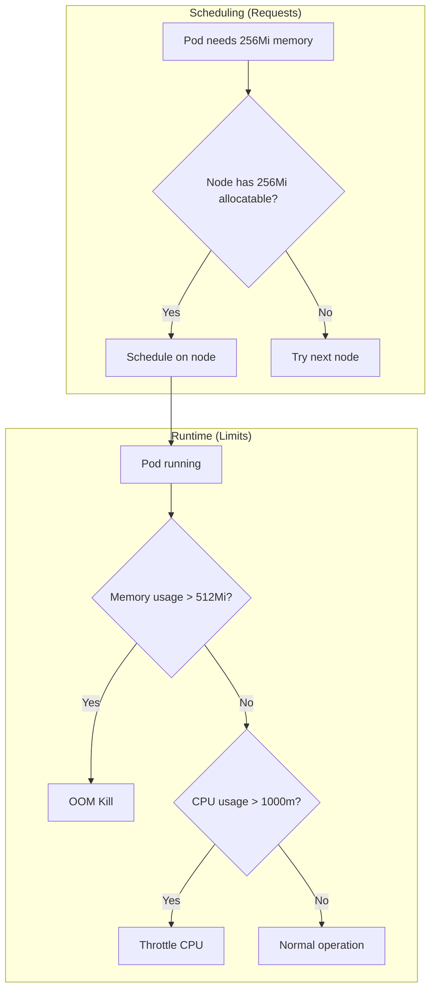
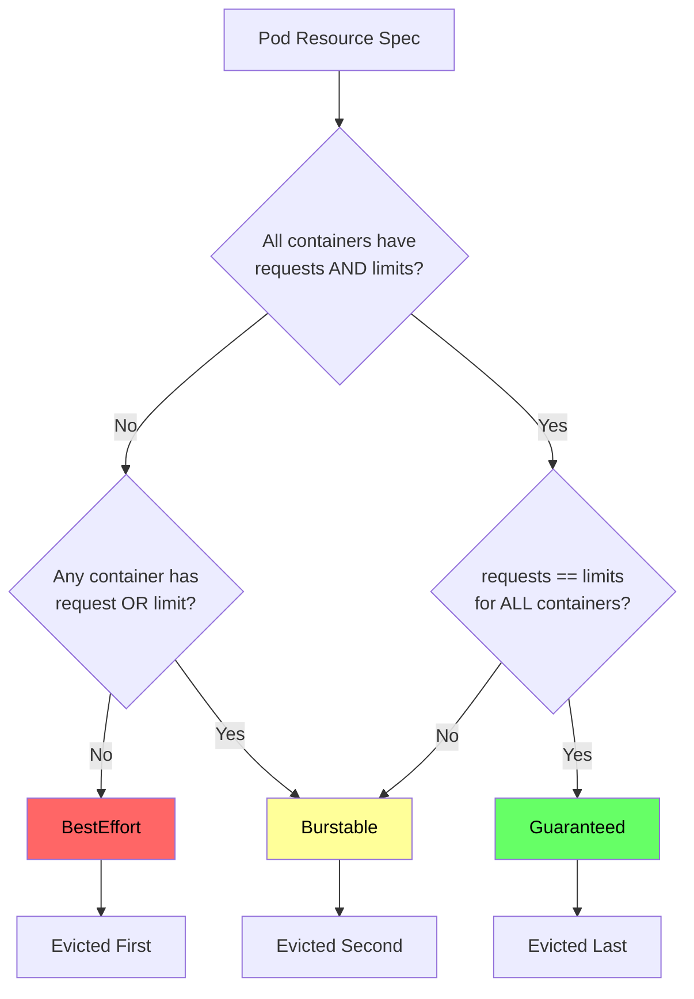
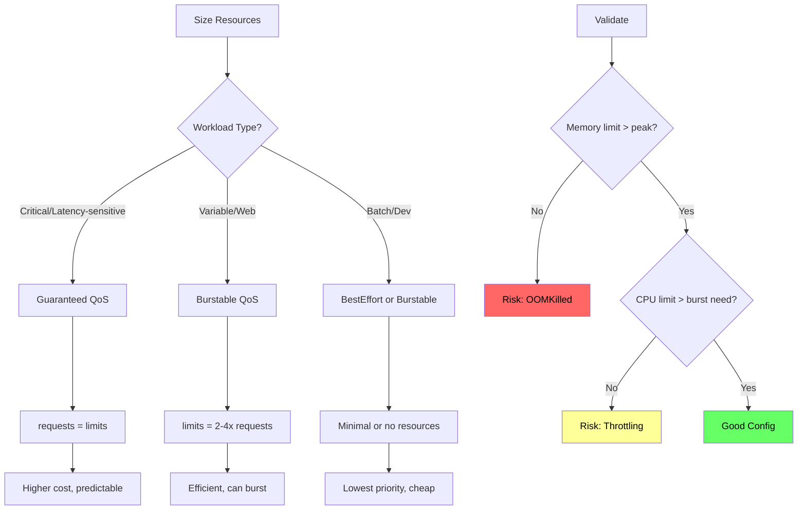

*[K8s]: Kubernetes
*[QoS]: Quality of Service
*[OOM]: Out of Memory
*[CPU]: Central Processing Unit
*[RAM]: Random Access Memory
*[cgroup]: Control Group
*[VPA]: Vertical Pod Autoscaler
*[HPA]: Horizontal Pod Autoscaler
*[OOMKilled]: Out of Memory Killed

# Pod Sizing: Requests, Limits, and QoS Classes

## Introduction

Frame the resource model as the foundation of Kubernetes scheduling and stability: every pod consumes CPU and memory, but how you declare those resources determines where pods land, how they behave under pressure, and which pods die when nodes run low. This section establishes that requests and limits aren't just "nice to have" settings—they're the contract between your workload and the cluster. Get them wrong, and you'll face either wasted capacity (over-requesting), noisy neighbor problems (under-limiting), or surprise evictions (mismatched QoS).

_Include a scenario: a production cluster with 10 nodes starts experiencing random pod evictions at 3 AM. Investigation reveals: memory pressure on nodes because 60% of pods have no memory limits, allowing a few memory-hungry pods to consume all available RAM. The pods being evicted are the well-behaved ones—they set requests but no limits, making them "Burstable" QoS and first in line for eviction. The lesson: QoS class determines eviction order, and most teams don't realize what class their pods belong to._

<Callout type="warning">
The most common resource mistake: setting requests without limits (or vice versa). This creates Burstable QoS pods that can be evicted before pods with no resource specs at all. Understanding QoS classes is essential for production workloads.
</Callout>

## The Resource Model

### Requests vs Limits

```yaml title="requests-limits-basics.yaml"
# Understanding the two resource dimensions

apiVersion: v1
kind: Pod
metadata:
  name: resource-example
spec:
  containers:
    - name: app
      image: myapp:latest
      resources:
        # Requests: What you're asking for (scheduling)
        requests:
          cpu: "250m"      # 0.25 CPU cores
          memory: "256Mi"  # 256 mebibytes

        # Limits: Maximum allowed (enforcement)
        limits:
          cpu: "1000m"    # 1 CPU core
          memory: "512Mi"  # 512 mebibytes

---
# What each setting means

resource_model:
  requests:
    purpose: "Scheduling and guaranteed resources"
    scheduler_behavior: "Pod placed on node with this much available"
    runtime_behavior: "Minimum resources reserved for this pod"

    cpu:
      unit: "millicores (1000m = 1 core)"
      enforcement: "None - pod can use more if available"
      impact: "Scheduling only"

    memory:
      unit: "bytes (Mi = mebibytes, Gi = gibibytes)"
      enforcement: "None - pod can use more if available"
      impact: "Scheduling + eviction priority"

  limits:
    purpose: "Hard ceiling on resource usage"
    scheduler_behavior: "Not used for scheduling"
    runtime_behavior: "Enforced by kernel/kubelet"

    cpu:
      unit: "millicores"
      enforcement: "Throttling (pod slowed down)"
      impact: "Performance degradation when exceeded"

    memory:
      unit: "bytes"
      enforcement: "OOM kill (pod terminated)"
      impact: "Pod restart when exceeded"
```
Code: Requests vs limits explained.


Figure: Requests affect scheduling, limits affect runtime.

### CPU Behavior

```yaml title="cpu-behavior.yaml"
# CPU: Compressible resource

cpu_characteristics:
  compressible: true
  enforcement: "Throttling (CFS quota)"
  impact_when_exceeded: "Slower execution, not termination"

# How CPU limits work under the hood
cfs_quota_explanation:
  period: "100ms (cfs_period_us = 100000)"
  quota_formula: "cpu_limit * period"

  examples:
    - cpu_limit: "100m"   # 0.1 cores
      quota: "10ms per 100ms period"
      explanation: "Pod can use CPU for 10ms, then waits 90ms"

    - cpu_limit: "500m"   # 0.5 cores
      quota: "50ms per 100ms period"

    - cpu_limit: "2000m"  # 2 cores
      quota: "200ms per 100ms period"
      explanation: "Can use 2 cores fully, or burst on more"

---
# CPU throttling symptoms
throttling_indicators:
  prometheus_query: |
    # Throttling percentage
    sum(rate(container_cpu_cfs_throttled_periods_total[5m]))
    / sum(rate(container_cpu_cfs_periods_total[5m])) * 100

  symptoms:
    - "Increased latency during traffic spikes"
    - "Timeouts on CPU-bound operations"
    - "Slow container startup"
    - "Health check failures"

  diagnosis: |
    # Check if pod is being throttled
    kubectl top pod <pod-name>

    # Get throttling metrics from cAdvisor
    curl localhost:10255/metrics | grep cfs_throttled

---
# CPU request vs limit scenarios
scenarios:
  under_requested:
    request: "100m"
    actual_need: "500m"
    impact: "Scheduled on node that can't handle it"
    result: "Steals CPU from other pods"

  over_requested:
    request: "2000m"
    actual_need: "200m"
    impact: "Fewer pods fit per node"
    result: "Wasted cluster capacity, higher costs"

  limit_too_low:
    limit: "200m"
    burst_need: "1000m"
    impact: "Throttled during traffic spikes"
    result: "Latency spikes, timeout errors"
```
Code: CPU behavior and throttling.

### Memory Behavior

```yaml title="memory-behavior.yaml"
# Memory: Incompressible resource

memory_characteristics:
  compressible: false
  enforcement: "OOM kill (cgroup limits)"
  impact_when_exceeded: "Pod termination (OOMKilled)"

# How memory limits work
oom_killer_behavior:
  trigger: "Container memory usage exceeds limit"
  action: "Kernel OOM killer terminates process"
  pod_status: "OOMKilled (exit code 137)"

  order_of_killing:
    1: "Process with highest oom_score_adj"
    2: "Process using most memory over request"
    3: "Random selection among equals"

---
# Memory scenarios
scenarios:
  no_limit:
    behavior: "Can use all node memory"
    risk: "Node-level OOM affects all pods"
    qos_class: "BestEffort or Burstable"

  limit_too_low:
    limit: "256Mi"
    actual_peak: "400Mi"
    result: "Frequent OOMKilled restarts"
    symptoms: ["CrashLoopBackOff", "Exit code 137"]

  limit_equals_request:
    request: "512Mi"
    limit: "512Mi"
    result: "Guaranteed QoS"
    benefit: "Protected from eviction"

---
# Diagnosing OOM issues
oom_diagnosis:
  check_pod_status: |
    kubectl describe pod <pod-name> | grep -A5 "Last State"
    # Look for: Reason: OOMKilled

  check_container_memory: |
    kubectl top pod <pod-name> --containers

  check_node_memory: |
    kubectl describe node <node-name> | grep -A10 "Allocated resources"

  prometheus_query: |
    # Memory usage vs limit
    container_memory_working_set_bytes
    / container_spec_memory_limit_bytes * 100

    # OOM events
    increase(container_oom_events_total[1h])
```
Code: Memory behavior and OOM kills.

| Resource | Type | Enforcement | Exceeded Behavior | Recovery |
|----------|------|-------------|-------------------|----------|
| CPU | Compressible | CFS throttling | Slowed execution | Automatic |
| Memory | Incompressible | OOM kill | Pod termination | Restart |

Table: CPU vs memory enforcement.

<Callout type="danger">
Memory limits are a kill switch. If your application exceeds its memory limit even briefly, it gets OOM killed—no warning, no graceful shutdown. Always set memory limits with headroom above your application's peak usage, not its average.
</Callout>

## QoS Classes

### Understanding the Three Classes

```yaml title="qos-classes.yaml"
# Kubernetes assigns QoS class based on resource specs

qos_classes:
  guaranteed:
    condition: "All containers have requests = limits for CPU AND memory"
    priority: "Highest - last to be evicted"
    use_case: "Critical production workloads"
    eviction_order: 3  # Evicted last

  burstable:
    condition: "At least one container has request or limit set"
    priority: "Medium - evicted before Guaranteed"
    use_case: "Most workloads with variable resource needs"
    eviction_order: 2

  besteffort:
    condition: "No requests or limits set on any container"
    priority: "Lowest - evicted first"
    use_case: "Batch jobs, development workloads"
    eviction_order: 1  # Evicted first

---
# Examples of each class

# Guaranteed QoS
apiVersion: v1
kind: Pod
metadata:
  name: guaranteed-pod
spec:
  containers:
    - name: app
      resources:
        requests:
          cpu: "500m"
          memory: "512Mi"
        limits:
          cpu: "500m"      # Same as request
          memory: "512Mi"  # Same as request
# QoS: Guaranteed

---
# Burstable QoS
apiVersion: v1
kind: Pod
metadata:
  name: burstable-pod
spec:
  containers:
    - name: app
      resources:
        requests:
          cpu: "250m"
          memory: "256Mi"
        limits:
          cpu: "1000m"     # Different from request
          memory: "512Mi"  # Different from request
# QoS: Burstable

---
# Also Burstable (only requests, no limits)
apiVersion: v1
kind: Pod
metadata:
  name: burstable-no-limits
spec:
  containers:
    - name: app
      resources:
        requests:
          cpu: "250m"
          memory: "256Mi"
        # No limits specified
# QoS: Burstable

---
# BestEffort QoS
apiVersion: v1
kind: Pod
metadata:
  name: besteffort-pod
spec:
  containers:
    - name: app
      image: myapp:latest
      # No resources specified at all
# QoS: BestEffort
```
Code: QoS class examples.


Figure: QoS class determination flow.

### Eviction Behavior

```yaml title="eviction-behavior.yaml"
# How kubelet evicts pods under resource pressure

eviction_process:
  triggers:
    memory_pressure:
      signal: "memory.available"
      threshold: "100Mi (default)"

    disk_pressure:
      signal: "nodefs.available"
      threshold: "10%"

    pid_pressure:
      signal: "pid.available"
      threshold: "100"

  eviction_order:
    1: "BestEffort pods (no resources specified)"
    2: "Burstable pods exceeding requests"
    3: "Burstable pods within requests"
    4: "Guaranteed pods (only if node is critically low)"

---
# Eviction priority calculation for Burstable pods
eviction_priority:
  formula: |
    priority = (memory_usage - memory_request) / memory_request

  explanation: |
    Pods using more memory relative to their request are evicted first.
    A pod using 200% of its request is evicted before one using 110%.

  example:
    pod_a:
      request: "256Mi"
      usage: "512Mi"  # 200% of request
      priority: 1.0   # Higher = evicted first

    pod_b:
      request: "256Mi"
      usage: "280Mi"  # 109% of request
      priority: 0.09  # Lower = evicted later

---
# Viewing eviction events
diagnosis:
  check_node_conditions: |
    kubectl describe node <node> | grep -A5 Conditions
    # Look for MemoryPressure, DiskPressure, PIDPressure

  check_eviction_events: |
    kubectl get events --field-selector reason=Evicted

  check_kubelet_logs: |
    journalctl -u kubelet | grep -i evict

---
# Kubelet eviction configuration
kubelet_config:
  eviction_hard:
    memory.available: "100Mi"
    nodefs.available: "10%"
    imagefs.available: "15%"

  eviction_soft:
    memory.available: "200Mi"
    nodefs.available: "15%"

  eviction_soft_grace_period:
    memory.available: "1m"
    nodefs.available: "1m"
```
Code: Eviction behavior and configuration.

| QoS Class | Eviction Priority | Memory Enforcement | CPU Enforcement | Use Case |
|-----------|-------------------|-------------------|-----------------|----------|
| BestEffort | First (highest) | None | None | Dev/batch |
| Burstable | Middle | Limit (OOM) | Limit (throttle) | Most workloads |
| Guaranteed | Last (lowest) | Request=Limit | Request=Limit | Critical services |

Table: QoS class behavior summary.

<Callout type="info">
The surprise: Burstable pods with requests but no limits can be evicted before BestEffort pods that happen to use less memory. The eviction algorithm considers actual usage relative to requests, not just QoS class. Size your requests accurately.
</Callout>

## Common Misconfigurations

### The Anti-Patterns

```yaml title="resource-antipatterns.yaml"
# Anti-pattern 1: No resources at all
apiVersion: apps/v1
kind: Deployment
metadata:
  name: no-resources
spec:
  template:
    spec:
      containers:
        - name: app
          image: myapp:latest
          # No resources = BestEffort
          # Problems:
          # - Scheduling is random (no capacity check)
          # - First to be evicted under pressure
          # - Can consume entire node resources
          # - No predictable performance

---
# Anti-pattern 2: Requests only (no limits)
apiVersion: apps/v1
kind: Deployment
metadata:
  name: requests-only
spec:
  template:
    spec:
      containers:
        - name: app
          resources:
            requests:
              cpu: "100m"
              memory: "128Mi"
            # No limits
          # Problems:
          # - QoS = Burstable (can be evicted)
          # - Memory leak can consume entire node
          # - CPU hog affects neighbors
          # - Unpredictable costs (node usage)

---
# Anti-pattern 3: Limits only (no requests)
apiVersion: apps/v1
kind: Deployment
metadata:
  name: limits-only
spec:
  template:
    spec:
      containers:
        - name: app
          resources:
            # No requests (defaults to limits)
            limits:
              cpu: "1000m"
              memory: "1Gi"
          # Note: K8s sets request = limit if only limit specified
          # Result: Guaranteed QoS but likely over-requested
          # Problems:
          # - Reserves full limit on node (wasteful)
          # - Fewer pods fit per node
          # - Higher infrastructure costs

---
# Anti-pattern 4: Request > Limit (invalid)
apiVersion: apps/v1
kind: Deployment
metadata:
  name: invalid-config
spec:
  template:
    spec:
      containers:
        - name: app
          resources:
            requests:
              memory: "1Gi"
            limits:
              memory: "512Mi"  # Less than request!
          # Result: API validation error
          # "Invalid value: limits.memory must be >= requests.memory"

---
# Anti-pattern 5: Memory limit without request
apiVersion: apps/v1
kind: Deployment
metadata:
  name: memory-limit-only
spec:
  template:
    spec:
      containers:
        - name: app
          resources:
            limits:
              memory: "512Mi"
            # Request defaults to limit (512Mi)
            # May over-request for apps that use less
```
Code: Resource configuration anti-patterns.

### The Correct Patterns

```yaml title="resource-best-practices.yaml"
# Pattern 1: Guaranteed QoS for critical services
apiVersion: apps/v1
kind: Deployment
metadata:
  name: critical-service
spec:
  template:
    spec:
      containers:
        - name: app
          resources:
            requests:
              cpu: "500m"
              memory: "512Mi"
            limits:
              cpu: "500m"      # Same as request
              memory: "512Mi"  # Same as request
          # Benefits:
          # - Last to be evicted
          # - Predictable performance
          # - No noisy neighbor issues
          # Tradeoff:
          # - Can't burst above request

---
# Pattern 2: Burstable with headroom for variable workloads
apiVersion: apps/v1
kind: Deployment
metadata:
  name: web-service
spec:
  template:
    spec:
      containers:
        - name: app
          resources:
            requests:
              cpu: "250m"      # Baseline
              memory: "256Mi"  # Baseline
            limits:
              cpu: "1000m"     # 4x burst for traffic spikes
              memory: "512Mi"  # 2x headroom for safety
          # Benefits:
          # - Efficient node utilization
          # - Can handle traffic bursts
          # Tradeoffs:
          # - Lower eviction priority than Guaranteed
          # - CPU throttling possible under contention

---
# Pattern 3: Init container sizing
apiVersion: apps/v1
kind: Deployment
metadata:
  name: with-init
spec:
  template:
    spec:
      initContainers:
        - name: init-db
          resources:
            requests:
              cpu: "100m"
              memory: "128Mi"
            limits:
              cpu: "500m"      # Higher for faster init
              memory: "256Mi"
      containers:
        - name: app
          resources:
            requests:
              cpu: "250m"
              memory: "256Mi"
            limits:
              cpu: "500m"
              memory: "512Mi"
          # Note: Init containers run before main containers
          # Pod scheduled based on max(init, main) resources

---
# Pattern 4: Sidecar sizing
apiVersion: apps/v1
kind: Deployment
metadata:
  name: with-sidecar
spec:
  template:
    spec:
      containers:
        - name: app
          resources:
            requests:
              cpu: "250m"
              memory: "256Mi"
            limits:
              cpu: "500m"
              memory: "512Mi"
        - name: envoy-sidecar
          resources:
            requests:
              cpu: "100m"      # Sidecars often need less
              memory: "64Mi"
            limits:
              cpu: "200m"
              memory: "128Mi"
          # Total pod resources: sum of all containers
          # Pod QoS: determined by ALL containers
```
Code: Resource configuration best practices.


Figure: Resource sizing decision tree.

<Callout type="success">
The rule of thumb: set CPU limits 2-4x requests (allow bursting), set memory limits 1.5-2x requests (headroom without waste). Monitor actual usage for two weeks, then right-size based on P95 metrics.
</Callout>

## Right-Sizing with Data

### Measuring Actual Usage

```yaml title="measuring-usage.yaml"
# Prometheus queries for right-sizing

prometheus_queries:
  # CPU usage (actual vs requested)
  cpu_utilization: |
    # Average CPU usage over 7 days
    avg_over_time(
      rate(container_cpu_usage_seconds_total{
        container!="POD",
        container!=""
      }[5m])[7d:1h]
    )

  cpu_vs_request: |
    # CPU usage as percentage of request
    sum by (namespace, pod, container) (
      rate(container_cpu_usage_seconds_total[5m])
    )
    /
    sum by (namespace, pod, container) (
      kube_pod_container_resource_requests{resource="cpu"}
    ) * 100

  # Memory usage (actual vs requested)
  memory_utilization: |
    # Memory usage over 7 days (use working_set, not rss)
    avg_over_time(
      container_memory_working_set_bytes{
        container!="POD",
        container!=""
      }[7d:1h]
    )

  memory_vs_request: |
    # Memory usage as percentage of request
    sum by (namespace, pod, container) (
      container_memory_working_set_bytes
    )
    /
    sum by (namespace, pod, container) (
      kube_pod_container_resource_requests{resource="memory"}
    ) * 100

---
# Key percentiles for sizing
sizing_queries:
  cpu_p95: |
    # 95th percentile CPU - use for requests
    quantile_over_time(0.95,
      rate(container_cpu_usage_seconds_total[5m])[7d:1h]
    )

  cpu_max: |
    # Maximum CPU - use for limits
    max_over_time(
      rate(container_cpu_usage_seconds_total[5m])[7d:1h]
    )

  memory_p95: |
    # 95th percentile memory - use for requests
    quantile_over_time(0.95,
      container_memory_working_set_bytes[7d:1h]
    )

  memory_max: |
    # Maximum memory - use for limits (add 20% buffer)
    max_over_time(
      container_memory_working_set_bytes[7d:1h]
    ) * 1.2
```
Code: Prometheus queries for right-sizing.

### VPA Recommendations

```yaml title="vpa-usage.yaml"
# Vertical Pod Autoscaler for automatic recommendations

apiVersion: autoscaling.k8s.io/v1
kind: VerticalPodAutoscaler
metadata:
  name: api-server-vpa
  namespace: production
spec:
  targetRef:
    apiVersion: apps/v1
    kind: Deployment
    name: api-server

  # Mode options:
  # - "Off": Only generate recommendations
  # - "Initial": Set resources on pod creation only
  # - "Auto": Automatically update running pods
  updatePolicy:
    updateMode: "Off"  # Start with recommendations only

  resourcePolicy:
    containerPolicies:
      - containerName: "*"
        # Minimum resources (floor)
        minAllowed:
          cpu: "100m"
          memory: "128Mi"
        # Maximum resources (ceiling)
        maxAllowed:
          cpu: "4000m"
          memory: "8Gi"
        # Which resources to manage
        controlledResources: ["cpu", "memory"]
        # How to handle limits
        controlledValues: RequestsAndLimits

---
# Check VPA recommendations
# kubectl describe vpa api-server-vpa
vpa_status_example:
  recommendation:
    containerRecommendations:
      - containerName: api-server
        # Lower bound (minimum recommended)
        lowerBound:
          cpu: "200m"
          memory: "256Mi"
        # Target (recommended value)
        target:
          cpu: "500m"
          memory: "512Mi"
        # Uncapped target (what it would recommend without maxAllowed)
        uncappedTarget:
          cpu: "500m"
          memory: "512Mi"
        # Upper bound (handles traffic spikes)
        upperBound:
          cpu: "1200m"
          memory: "1Gi"

---
# Interpreting VPA recommendations
vpa_interpretation:
  target: "Use for requests (represents normal operation)"
  upperBound: "Use for limits (handles spikes)"
  lowerBound: "Minimum safe resources"

  recommended_approach:
    requests: "VPA target"
    limits_cpu: "VPA upperBound * 1.2"
    limits_memory: "VPA upperBound * 1.5"
```
Code: VPA for resource recommendations.

| Metric | Use For | Calculation |
|--------|---------|-------------|
| P50 CPU | Baseline understanding | Median usage |
| P95 CPU | Requests | Normal operation ceiling |
| Max CPU | Limits | Peak burst need |
| P95 Memory | Requests | Normal operation |
| Max Memory + 20% | Limits | Peak + safety buffer |

Table: Metrics for right-sizing.

<Callout type="info">
VPA in "Off" mode is your best friend. It watches your workloads and tells you what they actually need without making changes. Run it for two weeks, review recommendations, then apply manually. Only enable "Auto" mode when you trust the recommendations.
</Callout>

## Namespace Defaults and Limits

### LimitRange Configuration

```yaml title="limitrange.yaml"
# LimitRange: Set defaults and constraints per namespace

apiVersion: v1
kind: LimitRange
metadata:
  name: default-limits
  namespace: production
spec:
  limits:
    # Default for containers without explicit resources
    - type: Container
      default:
        cpu: "500m"
        memory: "512Mi"
      defaultRequest:
        cpu: "100m"
        memory: "128Mi"
      min:
        cpu: "50m"
        memory: "64Mi"
      max:
        cpu: "4000m"
        memory: "8Gi"

    # Pod-level limits (sum of all containers)
    - type: Pod
      max:
        cpu: "8000m"
        memory: "16Gi"

    # PVC size limits
    - type: PersistentVolumeClaim
      min:
        storage: "1Gi"
      max:
        storage: "100Gi"

---
# How LimitRange affects pods
limitrange_behavior:
  no_resources_specified:
    before: "BestEffort QoS"
    after: "Gets default/defaultRequest values"
    result: "Burstable or Guaranteed QoS"

  under_minimum:
    request: "10m CPU"
    minimum: "50m CPU"
    result: "API rejects pod creation"

  over_maximum:
    limit: "16Gi memory"
    maximum: "8Gi memory"
    result: "API rejects pod creation"

---
# Verify LimitRange is working
verification:
  check_limitrange: |
    kubectl describe limitrange -n production

  test_defaults: |
    # Create pod without resources
    kubectl run test --image=nginx -n production
    kubectl get pod test -o yaml | grep -A10 resources
    # Should show default values applied

  test_limits: |
    # Try to exceed limits
    kubectl run big --image=nginx --requests='memory=20Gi' -n production
    # Error: must be less than or equal to max
```
Code: LimitRange for namespace defaults.

### ResourceQuota for Capacity

```yaml title="resourcequota.yaml"
# ResourceQuota: Total namespace resource limits

apiVersion: v1
kind: ResourceQuota
metadata:
  name: production-quota
  namespace: production
spec:
  hard:
    # Compute resources
    requests.cpu: "50"          # 50 CPU cores total
    requests.memory: "100Gi"    # 100 GiB memory total
    limits.cpu: "100"           # 100 CPU cores limit total
    limits.memory: "200Gi"      # 200 GiB memory limit total

    # Object counts
    pods: "100"                 # Maximum 100 pods
    services: "20"              # Maximum 20 services
    persistentvolumeclaims: "10"

    # Storage
    requests.storage: "500Gi"   # Total PVC storage

---
# Quota scopes (apply to specific pod types)
apiVersion: v1
kind: ResourceQuota
metadata:
  name: guaranteed-quota
  namespace: production
spec:
  hard:
    pods: "20"
  scopeSelector:
    matchExpressions:
      - operator: In
        scopeName: PriorityClass
        values: ["high-priority"]

---
# Monitoring quota usage
quota_monitoring:
  check_usage: |
    kubectl describe resourcequota -n production
    # Shows: Used / Hard for each resource

  prometheus_query: |
    # Quota utilization percentage
    kube_resourcequota{type="used"}
    / kube_resourcequota{type="hard"} * 100

  alert_on_high_usage: |
    # Alert when namespace is 80% of quota
    kube_resourcequota{type="used"}
    / kube_resourcequota{type="hard"} > 0.8
```
Code: ResourceQuota for namespace capacity.

| Control | Scope | Purpose | Enforcement |
|---------|-------|---------|-------------|
| LimitRange | Container/Pod | Defaults and bounds | Pod creation |
| ResourceQuota | Namespace | Total capacity | Object creation |
| PriorityClass | Cluster | Eviction order | Scheduling + eviction |

Table: Resource control mechanisms.

<Callout type="warning">
Always pair LimitRange with ResourceQuota. LimitRange ensures every pod has resources defined; ResourceQuota ensures the namespace doesn't consume unlimited cluster capacity. Without both, you have gaps in your resource governance.
</Callout>

## Monitoring and Alerting

### Resource Utilization Dashboards

```yaml title="resource-monitoring.yaml"
# Key metrics to monitor

monitoring_metrics:
  # Request vs actual usage (identifies over/under-provisioning)
  cpu_efficiency: |
    sum by (namespace) (rate(container_cpu_usage_seconds_total[5m]))
    /
    sum by (namespace) (kube_pod_container_resource_requests{resource="cpu"})
    * 100

  memory_efficiency: |
    sum by (namespace) (container_memory_working_set_bytes)
    /
    sum by (namespace) (kube_pod_container_resource_requests{resource="memory"})
    * 100

  # Node utilization
  node_cpu_usage: |
    100 - (avg by (node) (irate(node_cpu_seconds_total{mode="idle"}[5m])) * 100)

  node_memory_usage: |
    (1 - node_memory_MemAvailable_bytes / node_memory_MemTotal_bytes) * 100

---
# Alert rules
apiVersion: monitoring.coreos.com/v1
kind: PrometheusRule
metadata:
  name: resource-alerts
spec:
  groups:
    - name: resource.rules
      rules:
        - alert: PodMemoryNearLimit
          expr: |
            container_memory_working_set_bytes
            / container_spec_memory_limit_bytes > 0.9
          for: 10m
          labels:
            severity: warning
          annotations:
            summary: "Pod {{ $labels.pod }} memory usage at {{ $value | humanizePercentage }}"

        - alert: PodOOMKilled
          expr: |
            increase(kube_pod_container_status_restarts_total{reason="OOMKilled"}[1h]) > 0
          labels:
            severity: critical
          annotations:
            summary: "Pod {{ $labels.pod }} was OOM killed"

        - alert: CPUThrottlingHigh
          expr: |
            rate(container_cpu_cfs_throttled_periods_total[5m])
            / rate(container_cpu_cfs_periods_total[5m]) > 0.5
          for: 15m
          labels:
            severity: warning
          annotations:
            summary: "Pod {{ $labels.pod }} CPU throttled {{ $value | humanizePercentage }}"

        - alert: ResourceOverProvisioned
          expr: |
            sum by (namespace, pod) (
              kube_pod_container_resource_requests{resource="memory"}
            ) / sum by (namespace, pod) (
              container_memory_working_set_bytes
            ) > 3
          for: 7d
          labels:
            severity: info
          annotations:
            summary: "Pod {{ $labels.pod }} using < 33% of requested memory"
```
Code: Resource monitoring and alerts.

### Cost Attribution

```typescript title="cost-attribution.ts"
// Calculate resource costs per namespace/team

interface ResourceUsage {
  namespace: string;
  cpuRequestsCores: number;
  memoryRequestsGiB: number;
  cpuUsageCores: number;
  memoryUsageGiB: number;
}

interface CostRate {
  cpuPerCoreHour: number;
  memoryPerGiBHour: number;
}

function calculateCosts(
  usage: ResourceUsage,
  rates: CostRate,
  hours: number
): CostReport {
  // Cost based on requests (what you reserved)
  const requestedCost = {
    cpu: usage.cpuRequestsCores * rates.cpuPerCoreHour * hours,
    memory: usage.memoryRequestsGiB * rates.memoryPerGiBHour * hours,
    total: 0,
  };
  requestedCost.total = requestedCost.cpu + requestedCost.memory;

  // Cost based on actual usage (what you consumed)
  const actualCost = {
    cpu: usage.cpuUsageCores * rates.cpuPerCoreHour * hours,
    memory: usage.memoryUsageGiB * rates.memoryPerGiBHour * hours,
    total: 0,
  };
  actualCost.total = actualCost.cpu + actualCost.memory;

  // Efficiency metrics
  const efficiency = {
    cpu: (usage.cpuUsageCores / usage.cpuRequestsCores) * 100,
    memory: (usage.memoryUsageGiB / usage.memoryRequestsGiB) * 100,
    wastedCost: requestedCost.total - actualCost.total,
  };

  return {
    namespace: usage.namespace,
    requestedCost,
    actualCost,
    efficiency,
    recommendation: generateRecommendation(efficiency),
  };
}

function generateRecommendation(efficiency: Efficiency): string {
  if (efficiency.cpu < 20 && efficiency.memory < 20) {
    return 'Severely over-provisioned. Reduce requests by 50% or more.';
  }
  if (efficiency.cpu < 50 || efficiency.memory < 50) {
    return 'Over-provisioned. Review VPA recommendations for right-sizing.';
  }
  if (efficiency.cpu > 90 || efficiency.memory > 90) {
    return 'Near capacity. Consider increasing requests for stability.';
  }
  return 'Well-sized. Continue monitoring.';
}
```
Code: Cost attribution by resource usage.

| Efficiency Range | CPU Interpretation | Memory Interpretation | Action |
|------------------|-------------------|----------------------|--------|
| < 20% | Severely over-requested | Severely over-requested | Reduce by 50%+ |
| 20-50% | Over-requested | Over-requested | Right-size with VPA |
| 50-80% | Well-sized | Well-sized | Maintain |
| > 80% | Near limit | Near limit (risk) | Increase headroom |

Table: Resource efficiency interpretation.

<Callout type="success">
Most organizations run at 20-30% resource efficiency. Moving to 50-60% efficiency can cut infrastructure costs by 30-50%. The key is right-sizing requests based on actual usage, not guesses, while maintaining enough headroom for Guaranteed QoS on critical services.
</Callout>

## Conclusion

Summarize the resource model fundamentals: requests determine scheduling and eviction priority, limits enforce runtime boundaries. QoS class—determined automatically from your resource specs—decides eviction order under pressure. Configure Guaranteed QoS for critical services (requests = limits), Burstable for most workloads (limits > requests), and use LimitRange/ResourceQuota to enforce namespace-level governance. Right-size based on metrics, not guesses, using VPA recommendations and P95 usage data. The goal is the sweet spot: enough resources for reliability, not so much that you waste money.

<Callout type="info">
Resources are a contract. Requests are your promise of what you need. Limits are your promise of what you'll never exceed. QoS class is how Kubernetes prioritizes that contract when the cluster is under pressure. Write good contracts.
</Callout>

---

## Cover Prompt

### Prompt 1: The Reservation System

Create an image of a hotel reservation system where rooms (resources) are being allocated to guests (pods). Some guests have guaranteed reservations (Guaranteed QoS), others are on standby (Burstable), and walk-ins (BestEffort) wait in the lobby. During high demand, standby guests are moved to smaller rooms while walk-ins are turned away. Style: hotel management, reservation prioritization, capacity allocation, 16:9 aspect ratio.

### Prompt 2: The Buffet Line

Design an image of a buffet with three lines: VIP (Guaranteed), regular (Burstable), and budget (BestEffort). Each line has a plate size limit (memory limit) and time limit (CPU limit). When food runs low, budget diners are asked to leave first. VIP diners have reserved portions. Style: buffet resource allocation, priority queuing, fair sharing, 16:9 aspect ratio.

### Prompt 3: The Parking Garage

Illustrate a parking garage where cars (pods) have different parking levels. Reserved spots (Guaranteed) are always available. General parking (Burstable) can be used but may be asked to move. Street parking (BestEffort) is first to be towed when space is needed. A control tower monitors capacity. Style: parking management, space allocation, eviction hierarchy, 16:9 aspect ratio.

### Prompt 4: The Orchestra Seating

Create an image of an orchestra pit with assigned seating. Principal musicians (Guaranteed) have permanent chairs with their name. Section members (Burstable) have assigned areas but may shift. Substitutes (BestEffort) stand at the back and leave first if space is tight. A capacity board shows available seats. Style: orchestra seating, priority allocation, space management, 16:9 aspect ratio.

### Prompt 5: The Airplane Classes

Design an image of an airplane with three classes: first (Guaranteed), business (Burstable), and economy (BestEffort). During overbooking, economy passengers are bumped first. First class passengers have guaranteed seats and meals. A boarding display shows class prioritization. Style: airline class system, priority boarding, resource tiering, 16:9 aspect ratio.
