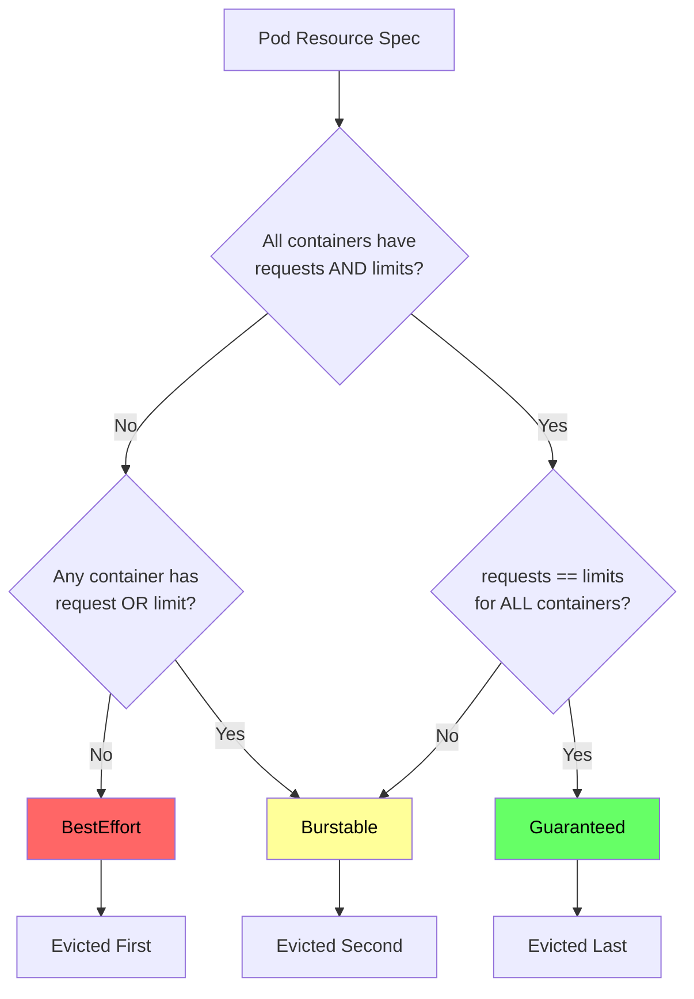
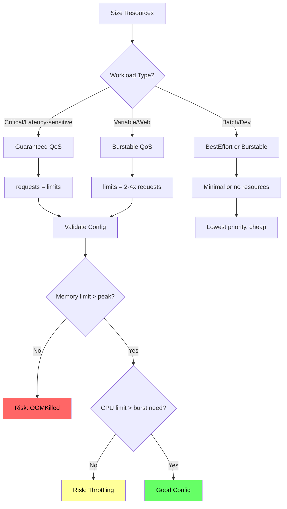

*[K8s]: Kubernetes
*[QoS]: Quality of Service
*[OOM]: Out of Memory
*[cgroup]: Control Group
*[VPA]: Vertical Pod Autoscaler
*[OOMKilled]: Out of Memory Killed
*[RSS]: Resident Set Size

Every pod in Kubernetes consumes CPU and memory, but _how_ you declare those resources determines where pods land, how they behave under pressure, and which pods die when nodes run low. Requests and limits aren't optional settings you can figure out later—they're the contract between your workload and the cluster. Get them wrong and you'll face wasted capacity (over-requesting), noisy neighbor problems (under-limiting), or surprise evictions (mismatched QoS classes).

Here's a scenario I've seen multiple times: a production cluster with 10 nodes starts experiencing random pod evictions at 3 AM. Investigation reveals memory pressure on several nodes—60% of pods have no memory limits, so a few memory-hungry pods consumed all available RAM. The pods being evicted aren't the resource hogs. They're the well-behaved ones that set requests but no limits, making them "Burstable" QoS and first in line for eviction.

The lesson: QoS class determines eviction order, and most teams don't realize what class their pods belong to until they're debugging an outage.

<Callout type="warning">
The most common resource mistake: setting requests without limits (or vice versa). This creates Burstable QoS pods that can be evicted before pods with no resource specs at all. Understanding QoS classes is essential for production workloads.
</Callout>

## The Resource Model

### Requests vs Limits

Kubernetes has two resource dimensions that serve different purposes. _Requests_ tell the scheduler how much capacity a pod needs—the scheduler won't place a pod on a node unless that much capacity is available. _Limits_ tell the kernel the maximum a pod can use—exceed the limit and enforcement kicks in.

```yaml title="pod-resources.yaml"
apiVersion: v1
kind: Pod
metadata:
  name: api-server
spec:
  containers:
    - name: app
      image: api-server:v1.2.0
      resources:
        requests:
          cpu: "250m"      # 0.25 CPU cores - scheduling guarantee
          memory: "256Mi"  # 256 MiB - scheduling guarantee
        limits:
          cpu: "1000m"     # 1 CPU core - hard ceiling
          memory: "512Mi"  # 512 MiB - hard ceiling
```

Code: Basic resource specification with requests and limits.

The key insight: requests affect _where_ pods run, limits affect _how_ pods run once scheduled. The scheduler sums up all requests on a node and won't over-commit beyond allocatable capacity. But limits are enforced at runtime by the kernel—a pod can burst above its request (using spare capacity) until it hits its limit. This split creates flexibility: you can request 256Mi (your baseline need) but set a 512Mi limit (your peak need), letting pods burst when memory is available without reserving peak capacity on every node.

### CPU Behavior

CPU is a _compressible_ resource. When a pod exceeds its CPU limit, Kubernetes doesn't kill it—it throttles it. The pod runs slower, but it keeps running.

Under the hood, CPU limits use Linux's Completely Fair Scheduler (CFS) quotas. The kernel gives each container a time budget per scheduling period (typically 100ms). A pod with a 500m CPU limit gets 50ms of CPU time per 100ms period. Use it up and the pod waits until the next period.

The symptoms of CPU throttling are subtle: increased latency during traffic spikes, timeouts on CPU-bound operations, slow container startup, and health check failures. Unlike OOM kills, there's no clear error message—just degraded performance.

You can detect throttling with Prometheus:

```promql
# Throttling percentage - values above 25% indicate a problem
sum(rate(container_cpu_cfs_throttled_periods_total[5m]))
/ sum(rate(container_cpu_cfs_periods_total[5m])) * 100
```

Code: Prometheus query to detect CPU throttling.

The common CPU mistakes: under-requesting causes pods to steal CPU from neighbors (the scheduler didn't know they needed it). Over-requesting wastes cluster capacity. Setting limits too low causes throttling during legitimate traffic spikes. I've seen teams set CPU limits equal to requests "for predictability" and then wonder why their services time out under load—they'd eliminated the ability to burst.

### Memory Behavior

Memory is _incompressible_. When a pod exceeds its memory limit, there's no graceful degradation—the kernel's OOM killer terminates the process immediately. You'll see exit code 137 and a `Reason: OOMKilled` in the pod status.

The OOM killer is ruthless. It doesn't wait for graceful shutdown, doesn't respect termination grace periods, and doesn't care that you were in the middle of processing a request. The process just disappears.

```bash
# Check if a pod was OOM killed
kubectl describe pod api-server | grep -A5 "Last State"
# Look for: Reason: OOMKilled, Exit Code: 137
```

Code: Diagnosing OOM kills.

Memory limits without headroom are time bombs. If your application normally uses 400Mi but occasionally peaks at 450Mi during garbage collection or traffic spikes, a 450Mi limit will eventually kill it. Set limits with at least 50% headroom above observed peak usage—memory OOM is not recoverable like CPU throttling.

The eviction angle matters too: pods without memory limits can consume all node memory, triggering node-level OOM that affects _all_ pods on the node. This is why "no limits" is dangerous—one runaway pod can take down its neighbors.

| Resource | Type           | Enforcement    | Exceeded Behavior | Recovery  |
| -------- | -------------- | -------------- | ----------------- | --------- |
| CPU      | Compressible   | CFS throttling | Slowed execution  | Automatic |
| Memory   | Incompressible | OOM kill       | Pod termination   | Restart   |

Table: CPU vs memory enforcement.

<Callout type="danger">
Memory limits are a kill switch. If your application exceeds its memory limit even briefly, it gets OOM killed—no warning, no graceful shutdown. Always set memory limits with headroom above your application's peak usage, not its average.
</Callout>

## QoS Classes

### Understanding the Three Classes

Kubernetes automatically assigns every pod a Quality of Service class based on its resource specification. This class determines eviction priority when nodes run low on resources. You don't set the QoS class directly—it's derived from how you configure requests and limits.

**Guaranteed** is the highest priority class. To get it, every container in the pod must have requests _and_ limits set for both CPU and memory, and the requests must equal the limits. These pods are evicted last.

**Burstable** is the middle tier. Any pod with at least one resource request or limit, but that doesn't qualify for Guaranteed, falls here. This includes pods with requests only, limits only, or requests that don't match limits. Most production workloads end up Burstable.

**BestEffort** is the lowest priority. Pods with no resource specifications at all—no requests, no limits on any container—get this class. They're evicted first under pressure.

```yaml title="qos-guaranteed.yaml"
# Guaranteed QoS: requests = limits for all resources
apiVersion: v1
kind: Pod
metadata:
  name: payment-processor
spec:
  containers:
    - name: app
      image: payment-processor:v2.1.0
      resources:
        requests:
          cpu: "500m"
          memory: "512Mi"
        limits:
          cpu: "500m"      # Same as request
          memory: "512Mi"  # Same as request
```

Code: Guaranteed QoS configuration (requests equal limits).

The tricky part is that Burstable is a broad category. A pod with carefully tuned requests and limits is Burstable. A pod with only a CPU request and nothing else is also Burstable. They have the same QoS class but very different behavior.

```yaml title="qos-burstable.yaml"
# Burstable QoS: requests != limits
apiVersion: v1
kind: Pod
metadata:
  name: web-server
spec:
  containers:
    - name: app
      image: web-server:v1.0.0
      resources:
        requests:
          cpu: "250m"
          memory: "256Mi"
        limits:
          cpu: "1000m"     # Different from request (can burst)
          memory: "512Mi"  # Different from request (has headroom)
```

Code: Burstable QoS configuration (requests differ from limits).

```yaml title="qos-besteffort.yaml"
# BestEffort QoS: no resources specified at all
apiVersion: v1
kind: Pod
metadata:
  name: batch-job
spec:
  containers:
    - name: app
      image: batch-processor:v1.0.0
      # No resources block - this pod is BestEffort
      # Will be evicted first under node pressure
```

Code: BestEffort QoS configuration (no resource specifications).



Figure: QoS class determination flow.

You can check a pod's QoS class with `kubectl get pod <name> -o yaml | grep qosClass`. If you're surprised by the result, remember that _all_ containers in the pod must meet the Guaranteed criteria—one container without limits drops the whole pod to Burstable.

### Eviction Behavior

When a node runs low on resources, the kubelet starts evicting pods. The eviction order follows QoS class, but there's more nuance than "BestEffort first, Guaranteed last."

The kubelet monitors several signals: `memory.available`, `nodefs.available` (disk), and `pid.available`. When any signal crosses its threshold (typically 100Mi for memory, 10% for disk), the node enters a pressure condition and eviction begins.

Within each QoS class, the kubelet prioritizes eviction based on resource usage relative to requests. The simplified formula for Burstable pods: `(usage - request) / request`. Pods using more memory relative to their request get evicted first. A pod using 200% of its memory request is evicted before one using 110%. (The actual [eviction algorithm](https://kubernetes.io/docs/concepts/scheduling-eviction/node-pressure-eviction/#pod-selection-for-kubelet-eviction) is more complex, incorporating priority classes and other factors.)

This creates a counterintuitive situation: a Burstable pod that set a low request but is using a lot of memory can be evicted before a BestEffort pod that happens to be using less. Accurate requests matter—they're not just for scheduling, they're also your eviction defense.

```bash
# Check if a node is under pressure
kubectl describe node <node-name> | grep -A5 Conditions
# Look for: MemoryPressure, DiskPressure, PIDPressure

# Find recently evicted pods
kubectl get events --field-selector reason=Evicted
```

Code: Diagnosing eviction events.

| QoS Class  | Eviction Priority | Memory Enforcement | CPU Enforcement   | Use Case          |
| ---------- | ----------------- | ------------------ | ----------------- | ----------------- |
| BestEffort | First (highest)   | None               | None              | Dev/batch         |
| Burstable  | Middle            | Limit (OOM)        | Limit (throttle)  | Most workloads    |
| Guaranteed | Last (lowest)     | Request=Limit      | Request=Limit     | Critical services |

Table: QoS class behavior summary.

<Callout type="info">
The surprise: Burstable pods with requests but no limits can be evicted before BestEffort pods that happen to use less memory. The eviction algorithm considers actual usage relative to requests, not just QoS class. Size your requests accurately.
</Callout>

## Common Misconfigurations

### The Anti-Patterns

I've seen the same resource misconfigurations across dozens of clusters. Here are the patterns that cause the most operational pain:

**No resources at all.** Pods without any resource specs get BestEffort QoS—first to be evicted, no scheduling guarantees, can consume unlimited node resources. This is the default if you don't specify anything, which is why so many teams accidentally run BestEffort pods in production.

**Requests only, no limits.** This creates Burstable pods that can consume unbounded memory or CPU. A memory leak in one pod can starve its neighbors or trigger node-level OOM. The pod gets scheduled based on its request, but nothing stops it from using 10x that amount.

**Limits only, no requests.** Kubernetes helpfully sets requests equal to limits when you only specify limits. The result is Guaranteed QoS, but you're probably over-reserving—the pod reserves its peak capacity even when it only needs a fraction of it. This wastes cluster capacity and increases costs.

<Callout type="info">
**Related pitfall: PodDisruptionBudget deadlocks.** If you set `minAvailable` equal to your replica count, and all pods land on nodes that need draining (for upgrades or scaling), your PDB blocks all evictions—creating a deadlock. This interacts badly with resource settings because well-sized pods tend to pack onto fewer nodes, increasing the chance that a single node drain affects your entire deployment.
</Callout>

```yaml title="antipattern-requests-only.yaml"
# Anti-pattern: requests without limits
apiVersion: apps/v1
kind: Deployment
metadata:
  name: web-service
spec:
  template:
    spec:
      containers:
        - name: app
          image: web-service:v1.0.0
          resources:
            requests:
              cpu: "100m"
              memory: "128Mi"
            # No limits - pod can consume unbounded resources
            # QoS: Burstable (can be evicted)
            # Risk: memory leak takes down the node
```

Code: Anti-pattern showing requests without limits.

### The Correct Patterns

The right configuration depends on your workload type and tolerance for risk:

**Critical services** should use Guaranteed QoS. Set requests equal to limits for predictable performance and maximum eviction protection. The tradeoff is that you can't burst—if you need 2x CPU during traffic spikes, you have to request 2x all the time.

```yaml title="pattern-guaranteed.yaml"
# Pattern: Guaranteed QoS for critical services
apiVersion: apps/v1
kind: Deployment
metadata:
  name: payment-processor
spec:
  template:
    spec:
      containers:
        - name: app
          image: payment-processor:v2.1.0
          resources:
            requests:
              cpu: "500m"
              memory: "512Mi"
            limits:
              cpu: "500m"      # Same as request
              memory: "512Mi"  # Same as request
```

Code: Guaranteed QoS for latency-sensitive workloads.

**Variable workloads** like web servers benefit from Burstable with headroom. Set limits higher than requests to allow bursting during traffic spikes while keeping baseline reservation efficient.

```yaml title="pattern-burstable.yaml"
# Pattern: Burstable with headroom for web services
apiVersion: apps/v1
kind: Deployment
metadata:
  name: api-gateway
spec:
  template:
    spec:
      containers:
        - name: app
          image: api-gateway:v3.0.0
          resources:
            requests:
              cpu: "250m"      # Baseline need
              memory: "256Mi"  # Baseline need
            limits:
              cpu: "1000m"     # 4x burst for traffic spikes
              memory: "512Mi"  # 2x headroom for safety
```

Code: Burstable QoS with burst headroom.

**Multi-container pods** need careful attention. The pod's QoS is determined by _all_ containers—if your main container has requests=limits but your sidecar doesn't, the whole pod is Burstable. Size sidecars explicitly.

```yaml title="pattern-sidecar.yaml"
# Pattern: Multi-container pod with explicit sidecar sizing
apiVersion: apps/v1
kind: Deployment
metadata:
  name: service-with-envoy
spec:
  template:
    spec:
      containers:
        - name: app
          image: my-service:v1.0.0
          resources:
            requests:
              cpu: "250m"
              memory: "256Mi"
            limits:
              cpu: "500m"
              memory: "512Mi"
        - name: envoy
          image: envoyproxy/envoy:v1.28.0
          resources:
            requests:
              cpu: "100m"
              memory: "64Mi"
            limits:
              cpu: "200m"
              memory: "128Mi"
```

Code: Sidecar containers need explicit resource specs.



Figure: Resource sizing decision tree.

<Callout type="success">
The rule of thumb: set CPU limits 2-4x requests (allow bursting), set memory limits 1.5-2x requests (headroom without waste). Monitor actual usage for two weeks, then right-size based on P95 metrics.
</Callout>

## Right-Sizing with Data

### Measuring Actual Usage

Guessing at resource values is how you end up with either OOM kills (too low) or wasted capacity (too high). The fix is measuring actual usage over time and sizing based on real data.

The key metrics come from Prometheus via cAdvisor[^cadvisor] and kube-state-metrics[^ksm]. For CPU, you want the rate of `container_cpu_usage_seconds_total`. For memory, use `container_memory_working_set_bytes`—not RSS, which includes cached memory that can be reclaimed.

[^cadvisor]: cAdvisor is an open-source agent developed by Google that runs inside the kubelet. It automatically discovers all containers on a node and collects real-time resource statistics (CPU, memory, network, disk I/O) at the `/metrics/cadvisor` endpoint. It has no long-term storage—Prometheus scrapes and stores the data.

[^ksm]: kube-state-metrics (KSM) is an add-on that listens to the Kubernetes API server and generates metrics about the state of cluster objects. While cAdvisor focuses on container-level performance, KSM tracks high-level resource state: "Is this pod running?" "How many replicas are ready?" It exposes raw, unmodified data at `/metrics` in Prometheus format.

```promql
# CPU usage as percentage of request (identifies over/under-provisioning)
sum by (namespace, pod) (rate(container_cpu_usage_seconds_total[5m]))
/
sum by (namespace, pod) (kube_pod_container_resource_requests{resource="cpu"})
* 100
```

Code: Prometheus query for CPU utilization vs request.

The percentile you use matters. P50 tells you what's normal. P95 tells you what you need to handle without degradation. Max tells you your peak burst need.

For requests, use P95 over a representative time window (at least 7 days to capture weekly patterns). For limits, use max plus a safety buffer—20% for CPU (throttling is recoverable), 50% for memory (OOM is not).

```promql
# P95 memory over 7 days - use for requests
quantile_over_time(0.95, container_memory_working_set_bytes[7d:1h])

# Max memory over 7 days + 50% buffer - use for limits
max_over_time(container_memory_working_set_bytes[7d:1h]) * 1.5
```

Code: Prometheus queries for sizing requests and limits.

### VPA Recommendations

The Vertical Pod Autoscaler (VPA) automates this measurement. In "Off" mode, it watches your workloads and generates recommendations without making changes—perfect for right-sizing exercises.

```yaml title="vpa-recommendation-only.yaml"
# VPA in recommendation-only mode
apiVersion: autoscaling.k8s.io/v1
kind: VerticalPodAutoscaler
metadata:
  name: api-server-vpa
  namespace: production
spec:
  targetRef:
    apiVersion: apps/v1
    kind: Deployment
    name: api-server
  updatePolicy:
    updateMode: "Off"  # Generate recommendations only
  resourcePolicy:
    containerPolicies:
      - containerName: "*"
        minAllowed:
          cpu: "100m"
          memory: "128Mi"
        maxAllowed:
          cpu: "4000m"
          memory: "8Gi"
```

Code: VPA configured for recommendations only.

After a week or two of observation, check the recommendations:

```bash
kubectl describe vpa api-server-vpa
```

Code: Checking VPA recommendations.

The VPA output includes several values: `lowerBound` (minimum safe), `target` (recommended for normal operation), and `upperBound` (recommended for spikes). A practical approach: use `target` for requests and `upperBound` with a buffer for limits.

| Metric           | Use For  | Calculation                            |
| ---------------- | -------- | -------------------------------------- |
| P50 CPU          | Baseline | Median usage                           |
| P95 CPU          | Requests | Normal operation ceiling               |
| Max CPU + 20%    | Limits   | Peak + buffer (throttling recoverable) |
| P95 Memory       | Requests | Normal operation                       |
| Max Memory + 50% | Limits   | Peak + buffer (OOM not recoverable)    |

Table: Metrics for right-sizing. See the efficiency table in Cost Attribution for interpreting utilization percentages.

<Callout type="info">
VPA in "Off" mode is your best friend. It watches your workloads and tells you what they actually need without making changes. Run it for two weeks, review recommendations, then apply manually. Only enable "Auto" mode when you trust the recommendations.
</Callout>

## Namespace Defaults and Limits

### LimitRange Configuration

Individual pod configurations are only half the story. Namespace-level controls give platform teams guardrails that apply to all workloads, even those deployed by teams who forget to set resources.

A LimitRange sets defaults and constraints for containers within a namespace. When a pod is created without resource specs, the LimitRange injects default values. When a pod requests too much or too little, the API rejects it.

```yaml title="limitrange.yaml"
apiVersion: v1
kind: LimitRange
metadata:
  name: default-limits
  namespace: production
spec:
  limits:
    - type: Container
      default:          # Applied as limits if not specified
        cpu: "500m"
        memory: "512Mi"
      defaultRequest:   # Applied as requests if not specified
        cpu: "100m"
        memory: "128Mi"
      min:              # Minimum allowed (rejects pods below this)
        cpu: "50m"
        memory: "64Mi"
      max:              # Maximum allowed (rejects pods above this)
        cpu: "4000m"
        memory: "8Gi"
```

Code: LimitRange with defaults and constraints.

The behavior is straightforward: deploy a pod without resources and it gets `defaultRequest` for requests and `default` for limits. Try to deploy a pod with 10Gi memory and the API rejects it because max is 8Gi. This converts accidental BestEffort pods into Burstable pods and prevents any single container from monopolizing node resources.

```bash
# Verify LimitRange is working
kubectl describe limitrange -n production

# Test: create pod without resources, check what it received
kubectl run test --image=nginx -n production
kubectl get pod test -o yaml | grep -A10 resources
```

Code: Verifying LimitRange defaults are applied.

### ResourceQuota for Capacity

While LimitRange controls individual pods, ResourceQuota controls total namespace consumption. It caps the aggregate requests and limits across all pods in a namespace, preventing any single team from consuming the entire cluster.

```yaml title="resourcequota.yaml"
apiVersion: v1
kind: ResourceQuota
metadata:
  name: production-quota
  namespace: production
spec:
  hard:
    requests.cpu: "50"          # 50 CPU cores total
    requests.memory: "100Gi"    # 100 GiB memory total
    limits.cpu: "100"           # 100 CPU cores limit total
    limits.memory: "200Gi"      # 200 GiB memory limit total
    pods: "100"                 # Maximum 100 pods
```

Code: ResourceQuota limiting total namespace resources.

When a namespace hits its quota, new pods are rejected until existing pods are deleted or scaled down. You can check current usage with `kubectl describe resourcequota -n production`, which shows used vs. hard limits for each resource.

The combination matters: LimitRange ensures every pod has resources defined (no more accidental BestEffort), and ResourceQuota ensures the namespace doesn't consume unlimited cluster capacity. Without both, you have gaps.

| Control       | Scope          | Purpose             | Enforcement        |
| ------------- | -------------- | ------------------- | ------------------ |
| LimitRange    | Container/Pod  | Defaults and bounds | Pod creation       |
| ResourceQuota | Namespace      | Total capacity      | Object creation    |
| PriorityClass | Cluster        | Eviction order      | Scheduling/eviction|

Table: Resource control mechanisms.

<Callout type="warning">
Always pair LimitRange with ResourceQuota. LimitRange ensures every pod has resources defined; ResourceQuota ensures the namespace doesn't consume unlimited cluster capacity. Without both, you have gaps in your resource governance.
</Callout>

## Monitoring and Alerting

### Resource Utilization Dashboards

Right-sizing is an ongoing process, not a one-time exercise. Workloads change, traffic patterns shift, and code updates alter resource profiles. You need dashboards that continuously show request efficiency—actual usage compared to what you've reserved.

The core efficiency queries compare usage to requests at the namespace level:

```promql
# CPU efficiency: actual usage / requests (target: 50-80%)
sum by (namespace) (rate(container_cpu_usage_seconds_total[5m]))
/
sum by (namespace) (kube_pod_container_resource_requests{resource="cpu"})
* 100
```

Code: Namespace-level CPU efficiency.

```promql
# Memory efficiency: actual usage / requests (target: 50-80%)
sum by (namespace) (container_memory_working_set_bytes)
/
sum by (namespace) (kube_pod_container_resource_requests{resource="memory"})
* 100
```

Code: Namespace-level memory efficiency.

Efficiency under 50% means you're over-provisioned—paying for capacity you don't use. Over 80% means you're running hot with little headroom for traffic spikes. The sweet spot is 50-80%, though critical services should run lower (more headroom) and batch workloads can run higher.

Node-level metrics matter too. Even if individual pods are well-sized, poor bin-packing can leave nodes underutilized:

```promql
# Node CPU usage percentage
100 - (avg by (node) (irate(node_cpu_seconds_total{mode="idle"}[5m])) * 100)

# Node memory usage percentage
(1 - node_memory_MemAvailable_bytes / node_memory_MemTotal_bytes) * 100
```

Code: Node utilization metrics.

### Alert Rules

Dashboards are for humans browsing Grafana. Alerts are for catching problems at 3 AM. Here are the essential resource alerts:

**Memory near limit** catches pods about to OOM. At 90% of limit for 10 minutes, something's wrong—either a memory leak or an undersized limit.

```yaml title="alert-memory-near-limit.yaml"
apiVersion: monitoring.coreos.com/v1
kind: PrometheusRule
metadata:
  name: memory-near-limit
spec:
  groups:
    - name: resource.rules
      rules:
        - alert: PodMemoryNearLimit
          expr: |
            container_memory_working_set_bytes
            / container_spec_memory_limit_bytes > 0.9
          for: 10m
          labels:
            severity: warning
          annotations:
            summary: "Pod {{ $labels.pod }} at 90% memory limit"
```

Code: Prometheus alert rule for when pods approach memory limits.

**OOM kills** are always worth knowing about. Even if the pod restarts successfully, repeated OOM kills indicate a sizing problem.

```yaml title="alert-oom-killed.yaml"
      - alert: PodOOMKilled
        expr: |
          increase(kube_pod_container_status_restarts_total{reason="OOMKilled"}[1h]) > 0
        labels:
          severity: critical
        annotations:
          summary: "Pod {{ $labels.pod }} was OOM killed"
```

Code: Prometheus alert rule for OOM kills.

**CPU throttling** above 50% for 15 minutes suggests the CPU limit is too low. Some throttling is normal for bursty workloads, but sustained throttling causes latency problems.

```yaml title="alert-cpu-throttling.yaml"
      - alert: CPUThrottlingHigh
        expr: |
          rate(container_cpu_cfs_throttled_periods_total[5m])
          / rate(container_cpu_cfs_periods_total[5m]) > 0.5
        for: 15m
        labels:
          severity: warning
        annotations:
          summary: "Pod {{ $labels.pod }} throttled 50%+ of CPU periods"
```

Code: Prometheus alert rule for sustained CPU throttling.

### Cost Attribution

Resource efficiency directly translates to infrastructure cost. If you're using 25% of requested resources, you're paying for 4x what you need.

The cost model is straightforward: cloud providers charge for reserved capacity (requests), not actual usage. A namespace requesting 10 CPU cores and 20Gi memory pays the same whether it uses 100% or 10% of that capacity. The gap between requested and used is waste.

To calculate waste, multiply the efficiency gap by your hourly rates. If you're paying $0.05 per CPU-hour and a namespace requests 10 cores but uses 2, you're wasting $0.40 per hour—nearly $300 per month for one namespace.

| Efficiency | Interpretation          | Action                               |
| ---------- | ----------------------- | ------------------------------------ |
| &lt; 20%   | Severely over-requested | Reduce requests by 50% or more       |
| 20-50%     | Over-requested          | Right-size using VPA recommendations |
| 50-80%     | Well-sized              | Maintain current configuration       |
| &gt; 80%   | Running hot             | Increase headroom for stability      |

Table: Efficiency interpretation and actions.

Tools like Kubecost, OpenCost, or cloud provider cost management (AWS Cost Explorer with container insights, GCP Cost Management) can automate this tracking. They break down costs by namespace, label, or team—essential for chargeback models where teams pay for their own resource consumption.

<Callout type="success">
Most organizations run at 20-30% resource efficiency. Moving to 50-60% can cut infrastructure costs by 30-50%. The key is right-sizing based on actual usage, not guesses, while maintaining enough headroom for Guaranteed QoS on critical services.
</Callout>

## Conclusion

Remember the 3 AM evictions from the introduction? The well-behaved pods died because they had requests without limits—Burstable QoS, middle of the eviction queue. The pods with no resource specs (BestEffort) should have been evicted first, but the eviction algorithm also considers usage relative to requests. The fix isn't complicated, but it requires understanding the model.

Pod resource configuration comes down to two contracts: _requests_ are your promise to the scheduler about what you need, and _limits_ are your promise to the kernel about what you'll never exceed. The scheduler uses requests to place pods; the kernel uses limits to enforce boundaries. Get these wrong and you'll either waste money (over-requesting), starve neighbors (under-limiting), or face surprise evictions (wrong QoS class).

QoS class—Guaranteed, Burstable, or BestEffort—is derived from your resource specs, not set directly. It determines who dies first when nodes run low. If you care about a workload surviving node pressure, you need to care about its QoS class. Guaranteed (requests equal limits) for critical services, Burstable (limits greater than requests) for everything else that matters.

The operational checklist: set both requests _and_ limits on every container. Use LimitRange to catch teams who forget. Use ResourceQuota to cap namespace consumption. Measure actual usage with Prometheus and VPA for at least two weeks before setting initial values. Review and right-size quarterly—workloads change, traffic patterns shift, and yesterday's sizing becomes tomorrow's waste or outage. Alert on memory near limit, OOM kills, and sustained CPU throttling.

The goal isn't perfect efficiency—it's the right tradeoff between reliability and cost. Critical services get headroom. Batch jobs run lean. Everything gets measured.

<Callout type="info">
Resources are a contract. Requests are your promise of what you need. Limits are your promise of what you'll never exceed. QoS class is how Kubernetes prioritizes that contract when the cluster is under pressure. Write good contracts.
</Callout>
