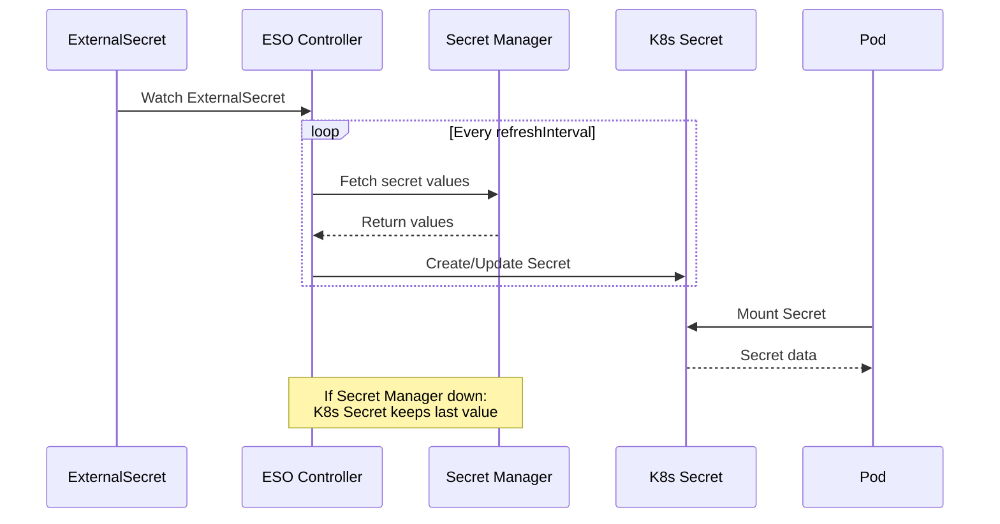
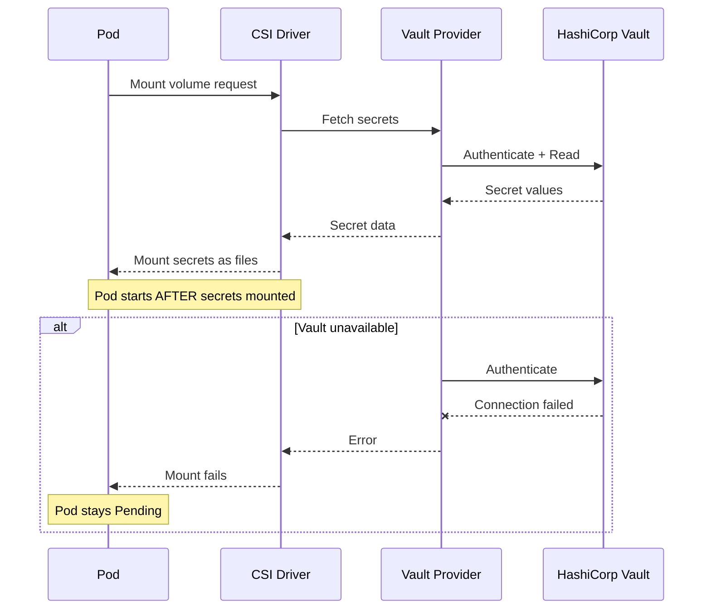
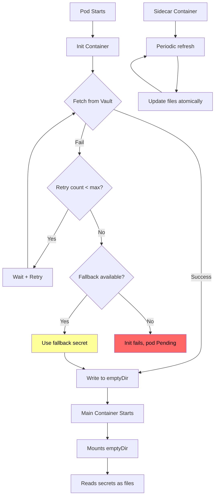
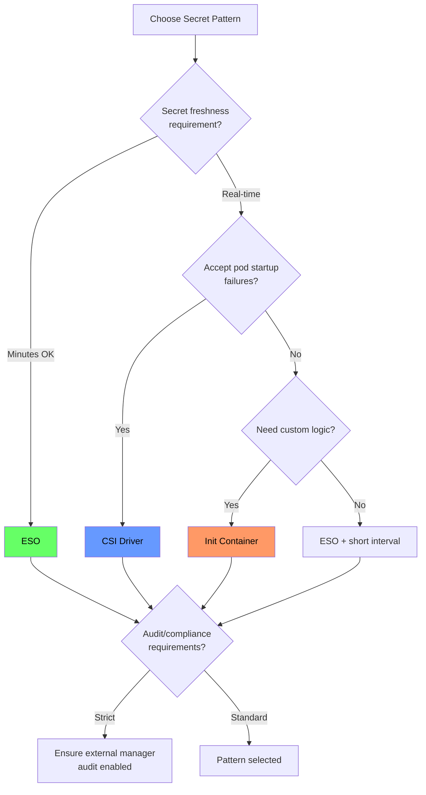

*[K8s]: Kubernetes
*[ESO]: External Secrets Operator
*[CSI]: Container Storage Interface
*[RBAC]: Role-Based Access Control
*[API]: Application Programming Interface
*[KMS]: Key Management Service
*[IAM]: Identity and Access Management
*[mTLS]: Mutual Transport Layer Security
*[JWT]: JSON Web Token

# Kubernetes Secrets: ESO vs CSI vs Init Containers

## Introduction

Frame the secret management challenge: Kubernetes Secrets are base64-encoded, stored in etcd, and accessible to anyone with namespace read access. For production workloads, you need secrets from external systems—HashiCorp Vault, AWS Secrets Manager, Azure Key Vault, GCP Secret Manager. The question isn't whether to integrate external secret managers, but how. Each injection pattern—External Secrets Operator, CSI driver, init containers—has different failure modes, latency characteristics, and operational complexity. This section establishes that the "best" approach depends on your specific requirements: sync frequency, failure tolerance, audit needs, and team expertise.

_Include a scenario: a platform team evaluates secret injection for a new cluster. Option A (External Secrets Operator) syncs secrets periodically—what if the secret changes between syncs? Option B (CSI driver) fetches at pod start—what if Vault is down during deployment? Option C (init container) gives maximum control—but adds complexity to every deployment. Each option traded off differently when their Vault cluster had a 30-minute outage. ESO-based pods kept running with cached secrets. CSI-based pods couldn't start. Init container pods depended on their specific retry logic. The lesson: understand failure modes before choosing._

<Callout type="warning">
Every secret injection pattern fails differently. ESO fails silently (stale secrets). CSI fails loudly (pods don't start). Init containers fail however you code them. Choose based on which failure mode your application can tolerate.
</Callout>

## Native Kubernetes Secrets

### The Baseline

```yaml title="native-secrets.yaml"
# Native Kubernetes Secret

apiVersion: v1
kind: Secret
metadata:
  name: database-credentials
  namespace: production
type: Opaque
data:
  # Base64 encoded (NOT encrypted!)
  username: YWRtaW4=           # "admin"
  password: c3VwZXJzZWNyZXQ=   # "supersecret"

---
# How pods consume secrets

# Option 1: Environment variables
apiVersion: v1
kind: Pod
metadata:
  name: app-with-env-secrets
spec:
  containers:
    - name: app
      image: myapp:latest
      env:
        - name: DB_USERNAME
          valueFrom:
            secretKeyRef:
              name: database-credentials
              key: username
        - name: DB_PASSWORD
          valueFrom:
            secretKeyRef:
              name: database-credentials
              key: password

---
# Option 2: Volume mount
apiVersion: v1
kind: Pod
metadata:
  name: app-with-volume-secrets
spec:
  containers:
    - name: app
      image: myapp:latest
      volumeMounts:
        - name: secrets
          mountPath: /etc/secrets
          readOnly: true
  volumes:
    - name: secrets
      secret:
        secretName: database-credentials
        # Files created: /etc/secrets/username, /etc/secrets/password
```
Code: Native Kubernetes secrets usage.

### Native Secrets Limitations

```yaml title="native-secrets-problems.yaml"
# Problems with native Kubernetes secrets

limitations:
  encoding_not_encryption:
    issue: "Base64 is encoding, not encryption"
    risk: "Anyone who can read the Secret object sees plaintext"
    mitigation: "Enable encryption at rest (EncryptionConfiguration)"

  etcd_storage:
    issue: "Secrets stored in etcd"
    risk: "etcd backup contains all secrets"
    mitigation: "Encrypt etcd, limit backup access"

  rbac_exposure:
    issue: "Namespace read access includes secrets"
    risk: "Developers can read production secrets"
    mitigation: "Separate namespaces, strict RBAC"

  no_rotation:
    issue: "No built-in rotation mechanism"
    risk: "Stale credentials, compliance issues"
    mitigation: "External secret manager integration"

  no_audit:
    issue: "No secret access audit trail"
    risk: "Can't track who accessed what"
    mitigation: "Use Vault or cloud secret managers"

---
# Encryption at rest configuration
apiVersion: apiserver.config.k8s.io/v1
kind: EncryptionConfiguration
resources:
  - resources:
      - secrets
    providers:
      # Use KMS for production
      - kms:
          name: aws-kms
          endpoint: unix:///var/run/kmsplugin/socket.sock
          cachesize: 1000
          timeout: 3s
      # Fallback to identity (unencrypted) for reading old secrets
      - identity: {}

---
# When native secrets are acceptable
acceptable_use_cases:
  - "Non-sensitive configuration"
  - "Development/staging environments"
  - "Short-lived credentials with auto-rotation"
  - "When encryption at rest is enabled"

unacceptable_use_cases:
  - "Production database passwords"
  - "API keys with billing implications"
  - "Credentials requiring audit trails"
  - "Secrets with compliance requirements"
```
Code: Native secrets limitations.

| Aspect | Native Secrets | External Secret Manager |
|--------|---------------|------------------------|
| Encryption at rest | Optional (must configure) | Built-in |
| Access audit | Limited (API audit logs) | Comprehensive |
| Rotation | Manual | Automatic |
| Versioning | None | Full history |
| Cross-cluster | Manual sync | Centralized |

Table: Native vs external secret management.

<Callout type="info">
Native Kubernetes secrets with encryption at rest and strict RBAC are acceptable for many workloads. The question is whether you need the additional capabilities—audit, rotation, versioning—that external managers provide.
</Callout>

## External Secrets Operator (ESO)

### Architecture and Setup

```yaml title="eso-architecture.yaml"
# External Secrets Operator architecture

eso_components:
  external_secrets_operator:
    role: "Watches ExternalSecret CRDs, syncs to K8s Secrets"
    deployment: "Runs in cluster, typically in external-secrets namespace"

  secret_store:
    role: "Connection config for external secret manager"
    scope: "SecretStore (namespace) or ClusterSecretStore (cluster-wide)"

  external_secret:
    role: "Declares which secrets to sync from external store"
    output: "Creates/updates Kubernetes Secret"

---
# Install ESO with Helm
# helm repo add external-secrets https://charts.external-secrets.io
# helm install external-secrets external-secrets/external-secrets

# ClusterSecretStore for AWS Secrets Manager
apiVersion: external-secrets.io/v1beta1
kind: ClusterSecretStore
metadata:
  name: aws-secrets-manager
spec:
  provider:
    aws:
      service: SecretsManager
      region: us-east-1
      auth:
        # Option 1: IAM Roles for Service Accounts (IRSA)
        jwt:
          serviceAccountRef:
            name: external-secrets-sa
            namespace: external-secrets

---
# ClusterSecretStore for HashiCorp Vault
apiVersion: external-secrets.io/v1beta1
kind: ClusterSecretStore
metadata:
  name: vault
spec:
  provider:
    vault:
      server: "https://vault.example.com"
      path: "secret"
      version: "v2"
      auth:
        kubernetes:
          mountPath: "kubernetes"
          role: "external-secrets"
          serviceAccountRef:
            name: external-secrets-sa
            namespace: external-secrets

---
# ClusterSecretStore for Azure Key Vault
apiVersion: external-secrets.io/v1beta1
kind: ClusterSecretStore
metadata:
  name: azure-keyvault
spec:
  provider:
    azurekv:
      tenantId: "your-tenant-id"
      vaultUrl: "https://your-vault.vault.azure.net"
      authType: WorkloadIdentity
      serviceAccountRef:
        name: external-secrets-sa
        namespace: external-secrets
```
Code: ESO architecture and secret stores.

### ExternalSecret Configuration

```yaml title="external-secret-config.yaml"
# ExternalSecret: Sync secrets from external manager to K8s

apiVersion: external-secrets.io/v1beta1
kind: ExternalSecret
metadata:
  name: database-credentials
  namespace: production
spec:
  # How often to sync (default: 1h)
  refreshInterval: 15m

  # Which SecretStore to use
  secretStoreRef:
    name: aws-secrets-manager
    kind: ClusterSecretStore

  # Target Kubernetes Secret configuration
  target:
    name: database-credentials
    creationPolicy: Owner  # ESO owns the Secret
    deletionPolicy: Retain  # Keep Secret if ExternalSecret deleted
    template:
      type: Opaque
      metadata:
        labels:
          app: myapp
          managed-by: external-secrets

  # Data to fetch
  data:
    - secretKey: username  # Key in K8s Secret
      remoteRef:
        key: production/database  # Path in Secrets Manager
        property: username        # JSON key in secret value

    - secretKey: password
      remoteRef:
        key: production/database
        property: password

---
# ExternalSecret with dataFrom (sync entire secret)
apiVersion: external-secrets.io/v1beta1
kind: ExternalSecret
metadata:
  name: app-config
  namespace: production
spec:
  refreshInterval: 30m
  secretStoreRef:
    name: vault
    kind: ClusterSecretStore
  target:
    name: app-config
  dataFrom:
    - extract:
        key: secret/data/production/app-config
        # All keys from Vault path become K8s Secret keys

---
# ExternalSecret with templating
apiVersion: external-secrets.io/v1beta1
kind: ExternalSecret
metadata:
  name: database-url
  namespace: production
spec:
  refreshInterval: 15m
  secretStoreRef:
    name: aws-secrets-manager
    kind: ClusterSecretStore
  target:
    name: database-url
    template:
      data:
        # Construct connection string from individual secrets
        DATABASE_URL: |
          postgresql://{{ .username }}:{{ .password }}@{{ .host }}:5432/{{ .database }}
  data:
    - secretKey: username
      remoteRef:
        key: production/database
        property: username
    - secretKey: password
      remoteRef:
        key: production/database
        property: password
    - secretKey: host
      remoteRef:
        key: production/database
        property: host
    - secretKey: database
      remoteRef:
        key: production/database
        property: database
```
Code: ExternalSecret configuration patterns.


Figure: ESO sync flow.

### ESO Failure Modes

```yaml title="eso-failure-modes.yaml"
# ESO failure modes and handling

failure_scenarios:
  secret_manager_unavailable:
    behavior: "ESO continues retrying, K8s Secret retains last value"
    impact: "Pods use stale secrets until connectivity restored"
    detection: "ExternalSecret status shows sync errors"
    mitigation: "Alert on sync failures, monitor staleness"

  invalid_credentials:
    behavior: "ESO can't authenticate to secret manager"
    impact: "K8s Secret not created/updated"
    detection: "ExternalSecret status: SecretSyncedError"
    mitigation: "Monitor ESO logs, check IAM/Vault policies"

  secret_not_found:
    behavior: "Referenced secret doesn't exist in manager"
    impact: "K8s Secret not created"
    detection: "ExternalSecret status shows error"
    mitigation: "Validate secret paths before deployment"

  secret_rotated_between_syncs:
    behavior: "Old secret used until next refreshInterval"
    impact: "Brief window with stale credentials"
    detection: "Compare K8s Secret with source"
    mitigation: "Shorter refreshInterval, or trigger manual sync"

---
# Monitoring ESO health
eso_monitoring:
  check_status: |
    kubectl get externalsecret -A
    # Look for: SecretSynced condition

  prometheus_metrics:
    sync_success: |
      externalsecret_status_condition{condition="Ready", status="True"}

    sync_failures: |
      increase(externalsecret_reconcile_error_total[1h])

    sync_latency: |
      externalsecret_reconcile_duration_seconds_bucket

---
# Alert on ESO issues
apiVersion: monitoring.coreos.com/v1
kind: PrometheusRule
metadata:
  name: eso-alerts
spec:
  groups:
    - name: eso.rules
      rules:
        - alert: ExternalSecretSyncFailed
          expr: |
            externalsecret_status_condition{condition="Ready", status="False"} == 1
          for: 15m
          labels:
            severity: warning
          annotations:
            summary: "ExternalSecret {{ $labels.name }} sync failing"

        - alert: ExternalSecretStale
          expr: |
            time() - externalsecret_status_condition{condition="Ready"} > 7200
          labels:
            severity: warning
          annotations:
            summary: "ExternalSecret {{ $labels.name }} not synced in 2+ hours"
```
Code: ESO failure modes and monitoring.

<Callout type="success">
ESO's biggest advantage: graceful degradation. If Vault goes down, your running pods keep working with cached secrets. The tradeoff: you might run with stale secrets until the next successful sync.
</Callout>

## Secrets Store CSI Driver

### Architecture and Setup

```yaml title="csi-driver-architecture.yaml"
# Secrets Store CSI Driver architecture

csi_components:
  secrets_store_csi_driver:
    role: "CSI driver that mounts secrets as volumes"
    deployment: "DaemonSet on every node"

  provider:
    role: "Plugin for specific secret manager"
    options:
      - "Vault provider"
      - "AWS provider"
      - "Azure provider"
      - "GCP provider"
    deployment: "DaemonSet alongside CSI driver"

  secret_provider_class:
    role: "Configuration for which secrets to mount"
    scope: "Namespaced"

---
# Install CSI driver with Helm
# helm repo add secrets-store-csi-driver https://kubernetes-sigs.github.io/secrets-store-csi-driver/charts
# helm install csi-secrets-store secrets-store-csi-driver/secrets-store-csi-driver

# SecretProviderClass for AWS Secrets Manager
apiVersion: secrets-store.csi.x-k8s.io/v1
kind: SecretProviderClass
metadata:
  name: aws-secrets
  namespace: production
spec:
  provider: aws
  parameters:
    objects: |
      - objectName: "production/database"
        objectType: "secretsmanager"
        jmesPath:
          - path: username
            objectAlias: db-username
          - path: password
            objectAlias: db-password

---
# SecretProviderClass for HashiCorp Vault
apiVersion: secrets-store.csi.x-k8s.io/v1
kind: SecretProviderClass
metadata:
  name: vault-secrets
  namespace: production
spec:
  provider: vault
  parameters:
    vaultAddress: "https://vault.example.com"
    roleName: "production-app"
    objects: |
      - objectName: "database-username"
        secretPath: "secret/data/production/database"
        secretKey: "username"
      - objectName: "database-password"
        secretPath: "secret/data/production/database"
        secretKey: "password"

---
# SecretProviderClass with sync to K8s Secret
apiVersion: secrets-store.csi.x-k8s.io/v1
kind: SecretProviderClass
metadata:
  name: vault-secrets-with-sync
  namespace: production
spec:
  provider: vault
  parameters:
    vaultAddress: "https://vault.example.com"
    roleName: "production-app"
    objects: |
      - objectName: "database-credentials"
        secretPath: "secret/data/production/database"
        secretKey: "credentials"
  # Optional: Also create K8s Secret from mounted secrets
  secretObjects:
    - secretName: database-credentials
      type: Opaque
      data:
        - objectName: database-credentials
          key: credentials
```
Code: CSI driver architecture and configuration.

### Pod Configuration

```yaml title="csi-pod-config.yaml"
# Pod using Secrets Store CSI Driver

apiVersion: v1
kind: Pod
metadata:
  name: app-with-csi-secrets
  namespace: production
spec:
  serviceAccountName: production-app  # For Vault/AWS auth
  containers:
    - name: app
      image: myapp:latest
      volumeMounts:
        - name: secrets
          mountPath: /mnt/secrets
          readOnly: true
      # Access secrets as files
      # /mnt/secrets/db-username
      # /mnt/secrets/db-password
  volumes:
    - name: secrets
      csi:
        driver: secrets-store.csi.k8s.io
        readOnly: true
        volumeAttributes:
          secretProviderClass: vault-secrets

---
# Pod with rotation enabled
apiVersion: v1
kind: Pod
metadata:
  name: app-with-rotation
  namespace: production
spec:
  serviceAccountName: production-app
  containers:
    - name: app
      image: myapp:latest
      volumeMounts:
        - name: secrets
          mountPath: /mnt/secrets
          readOnly: true
      # Application must watch for file changes
      # or re-read secrets periodically
  volumes:
    - name: secrets
      csi:
        driver: secrets-store.csi.k8s.io
        readOnly: true
        volumeAttributes:
          secretProviderClass: vault-secrets
          # Enable rotation (driver polls for updates)
          # Note: Requires driver configured with rotation enabled

---
# CSI driver rotation configuration (Helm values)
csi_driver_config:
  enableSecretRotation: true
  rotationPollInterval: 120s  # Check every 2 minutes

  # Sync to K8s Secret (optional)
  syncSecret:
    enabled: true
```
Code: Pod configuration with CSI driver.


Figure: CSI driver secret fetch flow.

### CSI Failure Modes

```yaml title="csi-failure-modes.yaml"
# CSI driver failure modes

failure_scenarios:
  secret_manager_unavailable:
    behavior: "Pod cannot start (volume mount fails)"
    impact: "Deployment blocked, new pods stuck in Pending"
    detection: "Pod events show mount errors"
    mitigation: "Circuit breaker, fallback to cached secrets"

  authentication_failure:
    behavior: "Provider can't authenticate to Vault/AWS"
    impact: "All new pods with that SecretProviderClass fail"
    detection: "Pod events, provider logs"
    mitigation: "Monitor auth token expiration, test connectivity"

  secret_rotation_during_runtime:
    behavior: "If rotation enabled, files update; app must detect"
    impact: "App may use old values if not watching files"
    detection: "Application-level monitoring"
    mitigation: "File watchers, periodic re-read, pod restart"

  node_provider_pod_failure:
    behavior: "Provider DaemonSet pod on node crashes"
    impact: "No new secret mounts on that node"
    detection: "DaemonSet pod status"
    mitigation: "Node affinity, provider pod monitoring"

---
# Diagnosing CSI issues
diagnosis:
  check_pod_events: |
    kubectl describe pod <pod-name>
    # Look for: MountVolume.SetUp failed

  check_csi_driver: |
    kubectl get pods -n kube-system -l app=secrets-store-csi-driver

  check_provider_logs: |
    kubectl logs -n kube-system -l app=secrets-store-csi-driver-provider-vault

  check_secret_provider_class: |
    kubectl describe secretproviderclass <name>

---
# Mitigating CSI startup failures
mitigation_patterns:
  # Pattern 1: Init container with retry
  init_container_fallback:
    description: "Use init container to pre-fetch and cache"
    benefit: "Control over retry logic"
    drawback: "Adds complexity"

  # Pattern 2: Cached secrets
  cached_secrets:
    description: "Store last-known-good in K8s Secret as backup"
    benefit: "Pods can start with stale secrets"
    drawback: "Stale secrets may cause issues"

  # Pattern 3: Circuit breaker
  circuit_breaker:
    description: "Stop deployments if secret fetch failing"
    benefit: "Prevent cascading failures"
    drawback: "Blocks all deployments"
```
Code: CSI failure modes and mitigation.

<Callout type="danger">
CSI driver's failure mode is loud: if Vault is down, pods don't start. This can cascade—a brief Vault outage during a deployment blocks the entire rollout. Plan for this with pre-deployment health checks or cached fallbacks.
</Callout>

## Init Container Pattern

### Implementation

```yaml title="init-container-secrets.yaml"
# Init container pattern for maximum control

apiVersion: apps/v1
kind: Deployment
metadata:
  name: app-with-init-secrets
  namespace: production
spec:
  template:
    spec:
      serviceAccountName: production-app

      # Shared volume for secrets
      volumes:
        - name: secrets
          emptyDir:
            medium: Memory  # tmpfs, not persisted

      initContainers:
        - name: fetch-secrets
          image: vault:latest
          command:
            - /bin/sh
            - -c
            - |
              set -e

              # Authenticate to Vault using K8s service account
              VAULT_TOKEN=$(vault write -field=token auth/kubernetes/login \
                role=production-app \
                jwt=$(cat /var/run/secrets/kubernetes.io/serviceaccount/token))

              export VAULT_TOKEN

              # Fetch secrets with retry logic
              MAX_RETRIES=5
              RETRY_DELAY=5

              for i in $(seq 1 $MAX_RETRIES); do
                if vault kv get -format=json secret/production/database > /secrets/database.json; then
                  echo "Secrets fetched successfully"

                  # Extract individual values
                  cat /secrets/database.json | jq -r '.data.data.username' > /secrets/db-username
                  cat /secrets/database.json | jq -r '.data.data.password' > /secrets/db-password

                  # Clean up JSON
                  rm /secrets/database.json

                  exit 0
                fi

                echo "Attempt $i failed, retrying in ${RETRY_DELAY}s..."
                sleep $RETRY_DELAY
              done

              echo "Failed to fetch secrets after $MAX_RETRIES attempts"
              exit 1
          env:
            - name: VAULT_ADDR
              value: "https://vault.example.com"
          volumeMounts:
            - name: secrets
              mountPath: /secrets

      containers:
        - name: app
          image: myapp:latest
          volumeMounts:
            - name: secrets
              mountPath: /etc/secrets
              readOnly: true
          # Access: /etc/secrets/db-username, /etc/secrets/db-password
```
Code: Init container secret fetching.

### Advanced Init Container Patterns

```yaml title="init-container-advanced.yaml"
# Advanced init container patterns

# Pattern 1: AWS Secrets Manager with fallback
apiVersion: apps/v1
kind: Deployment
metadata:
  name: app-with-aws-secrets
spec:
  template:
    spec:
      volumes:
        - name: secrets
          emptyDir:
            medium: Memory
        - name: fallback-secrets
          secret:
            secretName: database-credentials-fallback
            optional: true

      initContainers:
        - name: fetch-secrets
          image: amazon/aws-cli:latest
          command:
            - /bin/sh
            - -c
            - |
              set -e

              # Try to fetch from Secrets Manager
              if aws secretsmanager get-secret-value \
                --secret-id production/database \
                --query SecretString \
                --output text > /secrets/credentials.json 2>/dev/null; then

                echo "Fetched from AWS Secrets Manager"
                cat /secrets/credentials.json | jq -r '.username' > /secrets/db-username
                cat /secrets/credentials.json | jq -r '.password' > /secrets/db-password
                rm /secrets/credentials.json

              elif [ -f /fallback/username ]; then
                echo "Using fallback secrets"
                cp /fallback/username /secrets/db-username
                cp /fallback/password /secrets/db-password

              else
                echo "No secrets available!"
                exit 1
              fi
          volumeMounts:
            - name: secrets
              mountPath: /secrets
            - name: fallback-secrets
              mountPath: /fallback
              readOnly: true

---
# Pattern 2: Secret refresh sidecar
apiVersion: apps/v1
kind: Deployment
metadata:
  name: app-with-refresh-sidecar
spec:
  template:
    spec:
      volumes:
        - name: secrets
          emptyDir:
            medium: Memory

      initContainers:
        - name: fetch-secrets
          image: vault:latest
          command: ["/bin/sh", "-c", "...initial fetch..."]
          volumeMounts:
            - name: secrets
              mountPath: /secrets

      containers:
        - name: app
          image: myapp:latest
          volumeMounts:
            - name: secrets
              mountPath: /etc/secrets
              readOnly: true

        - name: secret-refresher
          image: vault:latest
          command:
            - /bin/sh
            - -c
            - |
              while true; do
                sleep 300  # Refresh every 5 minutes

                # Re-authenticate and fetch
                VAULT_TOKEN=$(vault write -field=token auth/kubernetes/login \
                  role=production-app \
                  jwt=$(cat /var/run/secrets/kubernetes.io/serviceaccount/token))

                export VAULT_TOKEN

                # Atomic update of secrets
                vault kv get -field=username secret/production/database > /secrets/db-username.new
                vault kv get -field=password secret/production/database > /secrets/db-password.new

                mv /secrets/db-username.new /secrets/db-username
                mv /secrets/db-password.new /secrets/db-password

                echo "Secrets refreshed at $(date)"
              done
          volumeMounts:
            - name: secrets
              mountPath: /secrets
```
Code: Advanced init container patterns.


Figure: Init container with fallback flow.

<Callout type="info">
The init container pattern gives you complete control: custom retry logic, fallback sources, logging, and error handling. The cost is complexity—you're writing and maintaining this logic yourself instead of relying on operators.
</Callout>

## Comparison and Selection

### Feature Comparison

```yaml title="pattern-comparison.yaml"
# Comprehensive comparison of secret injection patterns

comparison:
  external_secrets_operator:
    sync_model: "Periodic (pull-based)"
    latency: "refreshInterval delay (typically 15m-1h)"
    failure_behavior: "Silent - stale secrets"
    pod_startup_impact: "None (secrets pre-synced)"
    rotation_support: "Automatic on refresh"
    k8s_secret_created: "Yes (primary output)"
    complexity: "Medium"
    best_for: "Most workloads, GitOps workflows"

  csi_driver:
    sync_model: "On-demand (pod start)"
    latency: "Real-time at pod start"
    failure_behavior: "Loud - pods don't start"
    pod_startup_impact: "Adds latency (secret fetch)"
    rotation_support: "Optional (polling or manual)"
    k8s_secret_created: "Optional (secretObjects)"
    complexity: "Medium"
    best_for: "Fresh secrets required, strict compliance"

  init_container:
    sync_model: "On-demand (custom logic)"
    latency: "Real-time at pod start"
    failure_behavior: "Configurable"
    pod_startup_impact: "Adds latency (custom)"
    rotation_support: "Custom (sidecar pattern)"
    k8s_secret_created: "No (files only)"
    complexity: "High"
    best_for: "Complex requirements, custom retry logic"

  native_secrets:
    sync_model: "Manual"
    latency: "Instant (already in cluster)"
    failure_behavior: "None (static)"
    pod_startup_impact: "None"
    rotation_support: "Manual only"
    k8s_secret_created: "Yes (is the secret)"
    complexity: "Low"
    best_for: "Simple apps, dev environments"
```
Code: Pattern comparison overview.

| Criteria | ESO | CSI Driver | Init Container | Native |
|----------|-----|------------|----------------|--------|
| Setup complexity | Medium | Medium | High | Low |
| Operational overhead | Low | Medium | High | Very Low |
| Secret freshness | Minutes | Seconds | Seconds | Static |
| Failure impact | Low | High | Configurable | None |
| GitOps friendly | Yes | Partial | No | Yes |
| Multi-cloud support | Excellent | Good | Excellent | N/A |

Table: Pattern selection criteria.

### Decision Framework

```yaml title="selection-decision.yaml"
# Decision framework for choosing secret injection pattern

decision_tree:
  question_1:
    ask: "Do you need secrets refreshed while pods run?"
    yes: "Consider CSI driver with rotation or sidecar pattern"
    no: "Continue to question 2"

  question_2:
    ask: "Can your app tolerate slightly stale secrets (minutes)?"
    yes: "ESO is likely best choice"
    no: "Continue to question 3"

  question_3:
    ask: "Is it acceptable for pods to fail if secret manager is down?"
    yes: "CSI driver provides strictest guarantee"
    no: "Continue to question 4"

  question_4:
    ask: "Do you need custom retry/fallback logic?"
    yes: "Init container gives full control"
    no: "ESO with shorter refreshInterval"

---
# Use case recommendations
recommendations:
  web_applications:
    pattern: "ESO"
    reason: "Tolerates brief staleness, simple ops"
    config: "refreshInterval: 15m"

  payment_processing:
    pattern: "CSI driver"
    reason: "Must use current credentials"
    config: "No caching, fail-fast"

  database_connections:
    pattern: "ESO with short interval"
    reason: "Connection pools cache anyway"
    config: "refreshInterval: 5m"

  compliance_heavy:
    pattern: "CSI driver"
    reason: "Audit trail, no K8s Secret storage"
    config: "Direct mount, no secretObjects"

  multi_cloud_deployment:
    pattern: "ESO"
    reason: "Consistent across clouds"
    config: "Different ClusterSecretStore per cloud"

  legacy_apps:
    pattern: "Init container"
    reason: "Custom format, retry logic needed"
    config: "Fallback to cached secrets"
```
Code: Selection decision framework.


Figure: Secret pattern decision tree.

<Callout type="success">
For most workloads, ESO provides the best balance: simple operations, GitOps-friendly, graceful degradation. Use CSI driver when you absolutely need fresh secrets at startup. Use init containers when you need complete control over failure handling.
</Callout>

## Production Considerations

### Security Hardening

```yaml title="security-hardening.yaml"
# Security best practices for secret injection

security_checklist:
  vault_configuration:
    - "Use Kubernetes auth method (not static tokens)"
    - "Narrow policies: least privilege per role"
    - "Enable audit logging"
    - "Rotate root tokens regularly"
    - "Use namespaces for isolation"

  kubernetes_configuration:
    - "RBAC: limit Secret read access"
    - "Network policies: restrict access to secret manager"
    - "Pod security: non-root, read-only filesystem"
    - "Secrets in memory (emptyDir with medium: Memory)"

  cloud_provider_configuration:
    - "IAM roles: scoped to specific secrets"
    - "VPC endpoints: no public internet access"
    - "KMS: encrypt secrets at rest"
    - "CloudTrail/audit: log all access"

---
# Example: Hardened ESO setup
apiVersion: external-secrets.io/v1beta1
kind: ClusterSecretStore
metadata:
  name: vault-hardened
spec:
  provider:
    vault:
      server: "https://vault.internal.example.com"  # Internal only
      path: "secret"
      version: "v2"
      namespace: "production"  # Vault namespace isolation
      auth:
        kubernetes:
          mountPath: "kubernetes"
          role: "external-secrets-production"  # Scoped role
          serviceAccountRef:
            name: external-secrets-sa
            namespace: external-secrets
      # mTLS for Vault communication
      caProvider:
        type: Secret
        name: vault-ca
        namespace: external-secrets
        key: ca.crt

---
# Network policy to restrict secret manager access
apiVersion: networking.k8s.io/v1
kind: NetworkPolicy
metadata:
  name: allow-vault-access
  namespace: external-secrets
spec:
  podSelector:
    matchLabels:
      app: external-secrets
  policyTypes:
    - Egress
  egress:
    - to:
        - ipBlock:
            cidr: 10.0.0.0/8  # Internal network only
      ports:
        - protocol: TCP
          port: 8200  # Vault port
```
Code: Security hardening configuration.

### Monitoring and Alerting

```yaml title="secret-monitoring.yaml"
# Monitoring secret injection health

prometheus_rules:
  groups:
    - name: secrets.rules
      rules:
        # ESO sync failures
        - alert: ExternalSecretSyncFailed
          expr: externalsecret_status_condition{condition="Ready",status="False"} == 1
          for: 15m
          labels:
            severity: warning
          annotations:
            summary: "ExternalSecret {{ $labels.name }} not syncing"

        # CSI mount failures
        - alert: SecretCSIMountFailed
          expr: |
            increase(kubelet_csi_operations_seconds_count{
              driver_name="secrets-store.csi.k8s.io",
              method_name="NodePublishVolume",
              grpc_status_code!="OK"
            }[5m]) > 0
          labels:
            severity: critical
          annotations:
            summary: "CSI secret mount failures on {{ $labels.node }}"

        # Secret manager connectivity
        - alert: VaultUnreachable
          expr: vault_up == 0
          for: 5m
          labels:
            severity: critical
          annotations:
            summary: "Vault unreachable from cluster"

---
# Grafana dashboard queries
dashboard_panels:
  eso_sync_status:
    title: "ESO Sync Status"
    query: |
      sum by (namespace) (
        externalsecret_status_condition{condition="Ready",status="True"}
      )

  csi_mount_latency:
    title: "CSI Mount Latency"
    query: |
      histogram_quantile(0.95,
        rate(kubelet_csi_operations_seconds_bucket{
          driver_name="secrets-store.csi.k8s.io"
        }[5m])
      )

  secret_age:
    title: "Secret Freshness"
    query: |
      time() - kube_secret_created
```
Code: Secret injection monitoring.

| Metric | Warning Threshold | Critical Threshold | Response |
|--------|-------------------|-------------------|----------|
| ESO sync age | > 2x refreshInterval | > 4x refreshInterval | Check connectivity |
| CSI mount failures | > 1/hour | > 5/hour | Check provider pods |
| Vault latency | > 500ms | > 2s | Scale Vault, check network |
| Auth failures | Any | > 5/hour | Check IAM/Vault policies |

Table: Secret monitoring thresholds.

<Callout type="warning">
Monitor both the injection mechanism AND the secret manager. ESO sync success doesn't mean Vault is healthy—it means the last sync worked. Add end-to-end health checks that actually fetch a test secret.
</Callout>

## Conclusion

Summarize the secret injection tradeoffs: ESO provides the simplest operations with periodic sync and graceful degradation. CSI driver provides fresh secrets at startup but fails loudly when the secret manager is unavailable. Init containers provide maximum control at the cost of implementation complexity. Native secrets are acceptable for non-sensitive data with encryption at rest. The right choice depends on your application's tolerance for stale secrets, your compliance requirements, and your operational capacity. Most organizations benefit from standardizing on one pattern (usually ESO) with exceptions for specific high-security workloads.

<Callout type="info">
Don't over-engineer secret management. For most workloads, ESO with a 15-minute refresh and proper Vault policies is sufficient. Save the complexity of CSI drivers and custom init containers for workloads with strict real-time requirements or unusual compliance needs.
</Callout>

---

## Cover Prompt

### Prompt 1: The Vault Delivery Service

Create an image of a secure vault with three different delivery mechanisms: a periodic mail truck (ESO), an on-demand courier (CSI), and a custom robot (init container). Each mechanism has different characteristics—the truck delivers on schedule, the courier waits at the door, the robot has custom logic. A factory (pods) receives packages differently from each. Style: secure delivery, multiple channels, tradeoff visualization, 16:9 aspect ratio.

### Prompt 2: The Safe Deposit Box

Design an image of a bank vault with safety deposit boxes (secrets). Three access methods: a scheduled escort (ESO syncs periodically), direct access requiring presence (CSI at pod start), and a custom retrieval system with robots (init container). Each method shows different wait times and failure scenarios. Style: bank security, access patterns, reliability differences, 16:9 aspect ratio.

### Prompt 3: The Secret Pipeline

Illustrate a secure pipeline with multiple valves and paths. One path has a holding tank (ESO caching), another is direct flow (CSI real-time), a third has custom pumps and filters (init container). Each path shows what happens when the source is interrupted. Style: industrial pipeline, flow control, failure modes, 16:9 aspect ratio.

### Prompt 4: The Medication Dispensary

Create an image of a hospital pharmacy with three dispensing methods: daily pill packs prepared in advance (ESO), on-demand dispensing at the bedside (CSI), and custom compounding for special needs (init container). Shows what happens when the pharmacy is temporarily closed for each method. Style: pharmacy dispensing, preparation methods, availability patterns, 16:9 aspect ratio.

### Prompt 5: The Intelligence Network

Design an image of a spy network with three communication methods: dead drops with periodic checks (ESO), direct handler meetings (CSI), and custom encrypted channels (init container). Each method shows different reliability, latency, and failure scenarios when the network is compromised. Style: espionage, communication channels, security tradeoffs, 16:9 aspect ratio.
