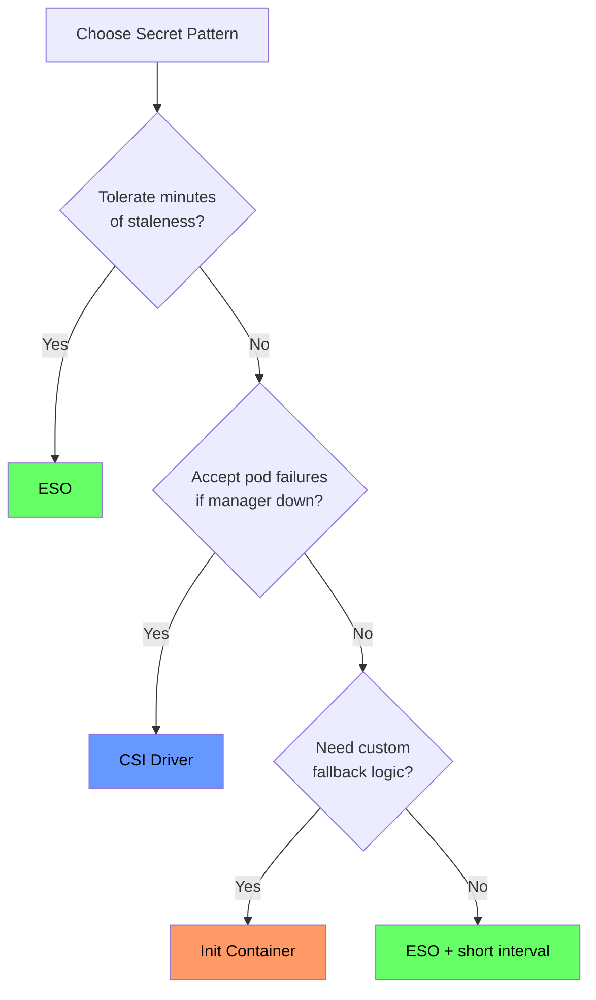

*[K8s]: Kubernetes
*[ESO]: External Secrets Operator
*[CSI]: Container Storage Interface
*[RBAC]: Role-Based Access Control

It's 3 AM and Vault is down. Your on-call engineer gets paged because deployments are failing—pods stuck in ContainerCreating, blocking a critical hotfix. Meanwhile, another team's services keep humming along despite the same outage. The difference isn't luck. It's how secrets get into pods.

Both teams use Vault. Both followed the documentation. But one team chose External Secrets Operator, which syncs secrets periodically and caches them as native Kubernetes secrets. The other chose the Secrets Store CSI Driver, which fetches secrets on-demand when pods start. When Vault went down, ESO's cached secrets kept working. CSI's synchronous fetches failed, and pods couldn't start. This isn't about which tool is better—it's about understanding the failure mode you've chosen _before_ it matters.

## The Two Patterns That Matter

External secrets management in Kubernetes has consolidated around two dominant patterns. External Secrets Operator runs as a controller in your cluster, periodically syncing secrets from Vault (or AWS Secrets Manager, Azure Key Vault, etc.) into native Kubernetes Secret objects. The Secrets Store CSI Driver takes a different approach: it mounts secrets directly into pods as volumes, fetching them from the external manager when pods start.

Both work fine when your secret manager is healthy. The difference is what happens when it isn't. ESO decouples secret fetching from pod lifecycle—the controller syncs independently, and pods consume cached Kubernetes Secrets. CSI couples them tightly—pods can't start until secrets are fetched. This architectural difference determines everything about how your applications behave during an outage.

| Pattern | Existing Pods | New Pods | Recovery |
|---------|---------------|----------|----------|
| ESO | ✅ Running | ✅ Start (cached) | Automatic |
| CSI Driver | ✅ Running | ❌ Blocked | May need intervention |

Table: Behavior during a 30-minute Vault outage.

Init containers offer a third path—DIY scripts that fetch secrets before your main container starts—but they require you to implement retry logic, fallback sources, and monitoring yourself. For most organizations, ESO or CSI covers the use case without that operational burden. (We cover init container patterns with fallback logic in our full guide.)

## ESO: Graceful Degradation

External Secrets Operator works by watching ExternalSecret custom resources in your cluster. When you create an ExternalSecret, the controller fetches the referenced secrets from your external manager and creates (or updates) a native Kubernetes Secret. Your pods consume that Secret normally—via environment variables or volume mounts—completely unaware that it originated from Vault.

The controller runs its reconciliation loop on a configurable interval (typically 15-30 minutes). Each cycle, it checks whether the external secret has changed and updates the Kubernetes Secret if needed. This decoupling is ESO's key advantage: the Kubernetes Secret _persists in etcd_ independent of the external manager's availability.

When Vault goes down, ESO's controller logs errors and keeps retrying. But the Kubernetes Secret it already created remains unchanged. Existing pods keep running with their last-synced values. Here's the part that surprises people: _new pods can also start_. They mount the Kubernetes Secret normally, unaware that ESO is failing to sync. The Secret itself is the cache.

The downside is silent staleness. If you rotate a database password in Vault but ESO can't sync for two hours, your pods run with the old password. They work fine—until something restarts them after the old password has been revoked. This is why monitoring sync status matters. An ExternalSecret that hasn't synced in multiple refresh intervals indicates a problem, even if your applications seem healthy.

<Callout type="info">
The cached Secret is encrypted in etcd only if you've configured encryption at rest on your cluster. The external manager's encryption doesn't carry over—once ESO syncs a secret into Kubernetes, it's subject to your cluster's encryption configuration.
</Callout>

For most workloads—web applications, APIs, microservices—15-30 minutes of staleness is acceptable. Connection pools cache connections anyway, so this staleness window rarely causes immediate failures. ESO's graceful degradation keeps services running through outages, which is usually the right tradeoff.

## CSI Driver: Loud Failures

The Secrets Store CSI Driver takes the opposite approach. Instead of syncing secrets to Kubernetes Secret objects, it mounts them directly into pods as volumes. When a pod starts, the CSI driver intercepts the volume mount, authenticates to Vault using the pod's service account, fetches the secrets, and presents them as files in the container's filesystem.

The pod _cannot start_ until this volume mount succeeds. If Vault is unavailable, the mount fails. The pod stays in ContainerCreating with events showing `MountVolume.SetUp failed`. No graceful degradation—no start.

This has cascading implications that aren't obvious until you experience them:

- New deployments block entirely—no pods can start
- In-progress rolling updates stall because replacement pods can't become ready
- Horizontal pod autoscaler scales up pods that immediately get stuck
- A node reboot during an incident restarts pods that can't fetch their secrets

Existing pods continue running—they already have their secrets mounted. But anything that needs to start fresh is blocked until Vault recovers.

This failure mode is loud, which is actually its advantage for certain use cases. Payment processing systems might prefer failing visibly over running with potentially stale credentials. Compliance requirements sometimes prohibit caching secrets in Kubernetes at all. If you need to guarantee that every pod startup uses fresh credentials from the authoritative source, CSI's blocking behavior is a feature, not a bug.

<Callout type="warning">
CSI's failure mode can cascade quickly during incidents. A Vault outage combined with a node failure means pods that were running fine suddenly can't restart. Plan for this with pre-deployment health checks or consider combining CSI with a fallback Kubernetes Secret.
</Callout>

## Choosing Your Failure Mode

The decision between ESO and CSI comes down to two questions: Can your application tolerate minutes of staleness? And can your operations tolerate blocked deployments during secret manager outages?

Figure: Pattern decision tree.

The diagram includes init containers as an option for custom fallback logic—useful when you need behavior that ESO and CSI don't provide out of the box. Our full guide covers implementation patterns including multi-source fallbacks and sidecar refresh.

For most organizations, ESO is the right default. It's operationally simpler, GitOps-friendly (ExternalSecrets are declarative resources you commit to version control), and its failure mode keeps services running. Reserve CSI for specific applications with strict compliance requirements or real-time credential needs.

The mistake isn't choosing either pattern. It's not understanding which failure mode you've chosen. The team that slept through the 3 AM Vault outage didn't get lucky—they understood that ESO's cached secrets would keep their services running. The team that got paged made a valid choice too; for their payment system, blocking on fresh credentials was the right call. Their runbooks reflected it.

Whatever you choose, document it. When the next outage happens, your incident responders shouldn't be learning your secret injection architecture for the first time.

<Callout type="success">
Start with ESO for the majority of workloads, with a 15-minute refresh interval, and monitor sync status with alerts on stale ExternalSecrets. Add CSI for specific high-security applications where staleness is unacceptable. This gives you operational simplicity with escape hatches for edge cases.
</Callout>

---

This article covers the core decision framework for Kubernetes secret injection. For implementation details—ClusterSecretStore configuration, ExternalSecret templating, CSI SecretProviderClass setup, init container patterns with fallback logic, security hardening, and monitoring alerts—download our comprehensive guide that walks through each pattern with production-ready examples.
