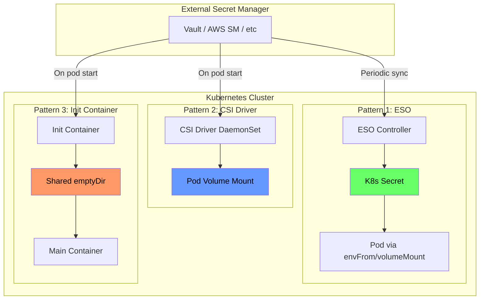
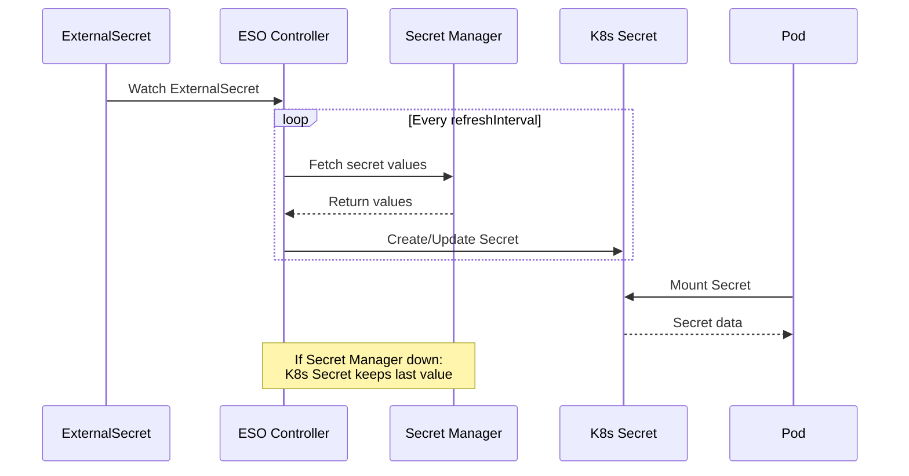
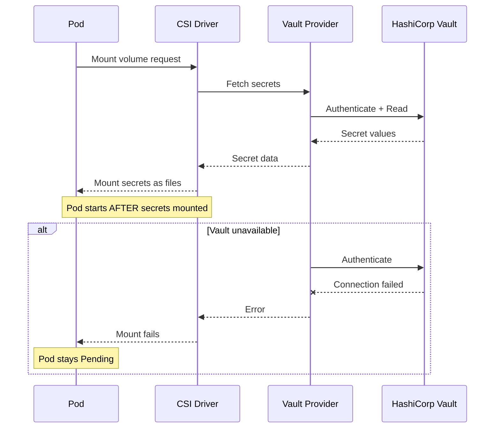
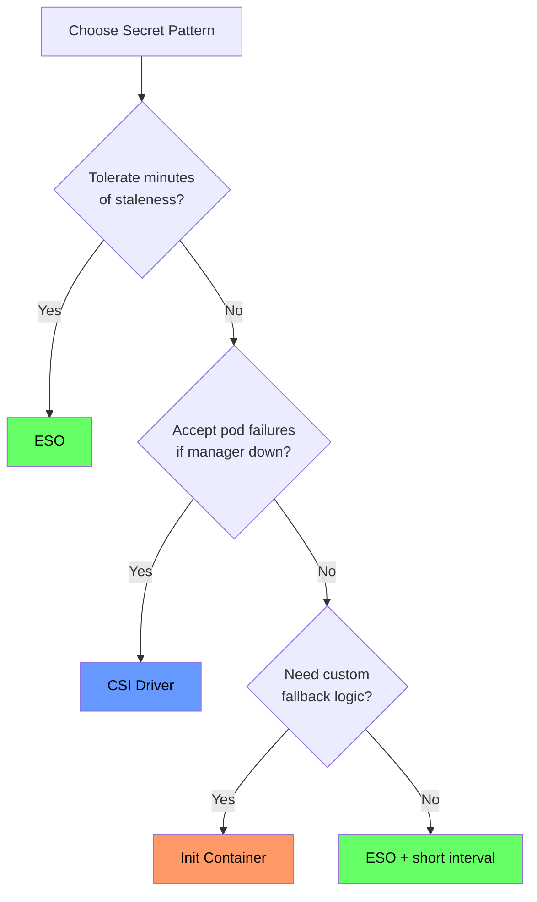

*[K8s]: Kubernetes
*[ESO]: External Secrets Operator
*[CSI]: Container Storage Interface
*[RBAC]: Role-Based Access Control
*[API]: Application Programming Interface
*[KMS]: Key Management Service
*[IAM]: Identity and Access Management
*[mTLS]: Mutual Transport Layer Security
*[JWT]: JSON Web Token

# Kubernetes Secrets: ESO vs CSI vs Init Containers

## Introduction

It's 3 AM and Vault is down. Your on-call engineer gets paged because deployments are failing—pods stuck in ContainerCreating, blocking a critical hotfix. Meanwhile, another team's services keep humming along despite the same outage. The difference isn't luck. It's how secrets get into pods.

Kubernetes secrets have a fundamental problem: they're base64-encoded, not encrypted. They sit in etcd alongside your cluster state, readable by anyone with RBAC access to the namespace. External secret managers like Vault, AWS Secrets Manager, and Azure Key Vault solve the security problem by keeping secrets outside the cluster—but they create a new problem. Your pods now depend on an external service, and that dependency has failure modes you need to understand _before_ the 3 AM page.

Three patterns dominate secret injection:

- __External Secrets Operator__ syncs secrets on a schedule and caches them as native Kubernetes secrets.
- __Secrets Store CSI Driver__ fetches secrets on-demand when pods start.
- __Init containers__ give you complete control but require you to implement everything yourself.

Each pattern fails differently when the secret manager goes away. Consider a 30-minute Vault outage during a leadership election:

| Pattern | Existing Pods | New Pods | Recovery |
|---------|--------------|----------|----------|
| ESO | ✅ Running | ✅ Start (cached) | Automatic |
| CSI Driver | ✅ Running | ❌ Blocked | May need intervention |
| Init Container | ✅ Running | ⚠️ Depends | Custom logic |

Table: Behavior during Vault outage.

ESO's pods keep running with their last-synced secrets, and new pods start successfully because the Kubernetes Secret already exists—it's just stale. CSI Driver pods that are already running continue fine, but any new pods can't fetch their secrets and get stuck. Init containers? That depends entirely on what retry and fallback logic you built.


Figure: Three secret injection patterns.

<Callout type="info">
This article uses HashiCorp Vault for examples, but the patterns apply equally to AWS Secrets Manager, Azure Key Vault, or any other provider. The injection mechanisms don't care where secrets come from—only how they get into pods.
</Callout>

## Native Kubernetes Secrets

Before diving into external secret managers, let's establish what native Kubernetes secrets actually provide. A Secret is a Kubernetes object that stores sensitive data—passwords, tokens, keys—separate from pod specs and container images. Pods consume secrets either as environment variables or as files mounted from a volume:

```yaml title="native-secrets.yaml"
apiVersion: v1
kind: Secret
metadata:
  name: database-credentials
  namespace: production
type: Opaque
data:
  username: YWRtaW4=           # base64("admin")
  password: c3VwZXJzZWNyZXQ=   # base64("supersecret")
---
apiVersion: v1
kind: Pod
metadata:
  name: app-with-secrets
spec:
  containers:
    - name: app
      image: myapp:latest
      env:
        - name: DB_USERNAME
          valueFrom:
            secretKeyRef:
              name: database-credentials
              key: username
      volumeMounts:
        - name: secrets
          mountPath: /etc/secrets
          readOnly: true
  volumes:
    - name: secrets
      secret:
        secretName: database-credentials
```
Code: Native Kubernetes secrets usage.

When mounted as a volume, each key in the Secret becomes a separate file. In this example, the pod gets `/etc/secrets/username` and `/etc/secrets/password`—plain text files containing the decoded secret values. Your application reads these files directly.

<Callout type="warning">
By default, secret files are mounted with 0644 permissions (owner read/write, group and world read). For sensitive credentials, tighten this with `defaultMode` in the volume spec: `defaultMode: 0400` restricts access to owner-read-only. Note that some applications may fail if they can't read their own config files—test permission changes before deploying.
</Callout>

The critical thing to understand: base64 is _encoding_, not encryption. Anyone with RBAC access to read secrets in a namespace can decode them trivially. By default, secrets are stored unencrypted in etcd—your cluster's backing store. An etcd backup contains every secret in plaintext.

You can enable encryption at rest using an EncryptionConfiguration that tells the API server to encrypt secrets before writing to etcd:

```yaml title="encryption-config.yaml"
apiVersion: apiserver.config.k8s.io/v1
kind: EncryptionConfiguration
resources:
  - resources:
      - secrets
    providers:
      - kms:
          name: aws-kms
          endpoint: unix:///var/run/kmsplugin/socket.sock
          cachesize: 1000
          timeout: 3s
      - identity: {}  # Fallback for reading old unencrypted secrets
```
Code: Encryption at rest configuration.

Even with encryption at rest, native secrets have operational limitations. There's no rotation mechanism—you update secrets manually and redeploy pods. There's no versioning—if you overwrite a secret, the old value is gone. And while Kubernetes audit logs can show who accessed the Secret _object_, they can't tell you who accessed the actual secret _value_ inside a running container. These gaps are why external secret managers exist.

## External Secrets Operator (ESO)

External Secrets Operator is a Kubernetes operator that syncs secrets from external managers—Vault, AWS Secrets Manager, Azure Key Vault, GCP Secret Manager—into native Kubernetes secrets. The operator runs in your cluster, periodically fetches secrets from the external source, and creates or updates Kubernetes Secret objects that your pods consume normally.

| Aspect | Native Secrets | External Manager |
|--------|---------------|------------------|
| Encryption at rest | Must configure | Built-in |
| Access audit | API-level only | Comprehensive |
| Rotation | Manual | Automatic |
| Versioning | None | Full history |
| Cross-cluster | Manual sync | Centralized |

Table: Native vs external secret management.

ESO uses three custom resources. A ClusterSecretStore (or namespace-scoped SecretStore) defines how to connect to the external secret manager—endpoint, authentication method, default paths. An ExternalSecret declares which secrets to sync from that store and how to map them into a Kubernetes Secret. The operator watches ExternalSecret resources and reconciles them on a configurable interval.

### Architecture and Setup

A ClusterSecretStore for AWS Secrets Manager using IAM Roles for Service Accounts:

```yaml title="cluster-secret-store-aws.yaml"
apiVersion: external-secrets.io/v1beta1
kind: ClusterSecretStore
metadata:
  name: aws-secrets-manager
spec:
  provider:
    aws:
      service: SecretsManager
      region: us-east-1
      auth:
        jwt:
          serviceAccountRef:
            name: external-secrets-sa
            namespace: external-secrets
```
Code: ClusterSecretStore for AWS Secrets Manager.

For Vault, the store configures Kubernetes authentication:

```yaml title="cluster-secret-store-vault.yaml"
apiVersion: external-secrets.io/v1beta1
kind: ClusterSecretStore
metadata:
  name: vault
spec:
  provider:
    vault:
      server: "https://vault.example.com"
      path: "secret"
      version: "v2"
      auth:
        kubernetes:
          mountPath: "kubernetes"
          role: "external-secrets"
          serviceAccountRef:
            name: external-secrets-sa
            namespace: external-secrets
```
Code: ClusterSecretStore for Vault.

Azure Key Vault follows the same pattern, using workload identity for authentication:

```yaml title="cluster-secret-store-azure.yaml"
apiVersion: external-secrets.io/v1beta1
kind: ClusterSecretStore
metadata:
  name: azure-keyvault
spec:
  provider:
    azurekv:
      tenantId: "your-tenant-id"
      vaultUrl: "https://your-vault.vault.azure.net"
      authType: WorkloadIdentity
      serviceAccountRef:
        name: external-secrets-sa
        namespace: external-secrets
```
Code: ClusterSecretStore for Azure Key Vault.

### ExternalSecret Configuration

With a ClusterSecretStore configured, you create ExternalSecret resources that specify which secrets to sync. The simplest form maps individual secret properties to Kubernetes Secret keys:

```yaml title="external-secret-basic.yaml"
apiVersion: external-secrets.io/v1beta1
kind: ExternalSecret
metadata:
  name: database-credentials
  namespace: production
spec:
  refreshInterval: 15m
  secretStoreRef:
    name: aws-secrets-manager
    kind: ClusterSecretStore
  target:
    name: database-credentials
    creationPolicy: Owner
  data:
    - secretKey: username
      remoteRef:
        key: production/database
        property: username
    - secretKey: password
      remoteRef:
        key: production/database
        property: password
```
Code: Basic ExternalSecret configuration.

The `refreshInterval` controls how often ESO checks the external source for changes. Shorter intervals mean fresher secrets but more API calls to your secret manager. For most workloads, 15-30 minutes balances freshness against API costs.

For secrets where you need to construct values from multiple sources—connection strings, for example—ESO supports templating:

```yaml title="external-secret-templated.yaml"
apiVersion: external-secrets.io/v1beta1
kind: ExternalSecret
metadata:
  name: database-url
  namespace: production
spec:
  refreshInterval: 15m
  secretStoreRef:
    name: aws-secrets-manager
    kind: ClusterSecretStore
  target:
    name: database-url
    template:
      data:
        DATABASE_URL: |
          postgresql://{{ .username }}:{{ .password }}@{{ .host }}:5432/{{ .database }}
  data:
    - secretKey: username
      remoteRef:
        key: production/database
        property: username
    - secretKey: password
      remoteRef:
        key: production/database
        property: password
    - secretKey: host
      remoteRef:
        key: production/database
        property: host
    - secretKey: database
      remoteRef:
        key: production/database
        property: database
```
Code: ExternalSecret with templating.

The key insight with ESO is the decoupling between secret fetching and pod lifecycle. The controller runs its reconciliation loop independently—watching ExternalSecrets, fetching from the external manager, updating Kubernetes Secrets. Pods consume those Secrets normally, unaware that they came from Vault or AWS. This decoupling is what gives ESO its graceful degradation: the Kubernetes Secret exists even when the external manager doesn't respond.


Figure: ESO sync flow.

### ESO Failure Modes

ESO's failure modes are relatively benign because it decouples secret fetching from pod lifecycle. When the secret manager goes down, the ESO controller logs errors and keeps retrying—but the Kubernetes Secret it already created remains unchanged. Existing pods keep running with their last-synced values. Crucially, _new_ pods can also start: they mount the Kubernetes Secret normally, unaware that ESO is failing to sync. The Kubernetes Secret itself is the cache—it persists in etcd independent of the external manager's availability.

<Callout type="danger">
The cached Secret is encrypted in etcd only if you've configured encryption at rest. The external manager's encryption doesn't carry over — once ESO syncs a secret into Kubernetes, it's subject to your cluster's encryption configuration.
</Callout>

The downside: silent staleness. If you rotate a database password in Vault but ESO can't sync for two hours, your pods run with the old password. They work fine until something restarts them with the now-invalid cached secret. This is why monitoring sync status matters:

```yaml title="eso-alerts.yaml"
apiVersion: monitoring.coreos.com/v1
kind: PrometheusRule
metadata:
  name: eso-alerts
spec:
  groups:
    - name: eso.rules
      rules:
        - alert: ExternalSecretSyncFailed
          expr: |
            externalsecret_status_condition{condition="Ready", status="False"} == 1
          for: 15m
          labels:
            severity: warning
          annotations:
            summary: "ExternalSecret {{ $labels.name }} sync failing"
        - alert: ExternalSecretStale
          expr: |
            time() - externalsecret_reconcile_timestamp_seconds > 7200
          labels:
            severity: warning
          annotations:
            summary: "ExternalSecret {{ $labels.name }} not synced in 2+ hours"
```
Code: ESO monitoring alerts.

You can check sync status directly with kubectl:

```bash
kubectl get externalsecret -A
# Look for Ready condition in STATUS column
```

<Callout type="success">
ESO's biggest advantage: graceful degradation. If Vault goes down, your running pods keep working with cached secrets. You might run with stale secrets until the next successful sync, but for most applications, that beats not running at all. For most applications, this is the right failure mode.
</Callout>

## Secrets Store CSI Driver

The Secrets Store CSI Driver takes a fundamentally different approach than ESO. Instead of syncing secrets to Kubernetes Secret objects, it mounts secrets directly into pods as volumes. When a pod starts, the CSI driver fetches secrets from the external manager and presents them as files in the container's filesystem—no Kubernetes Secret involved (unless you explicitly configure one).

The driver runs as a DaemonSet on every node, paired with a provider plugin for your secret manager (Vault, AWS, Azure, GCP). A SecretProviderClass resource defines which secrets to fetch and how to present them.

### Architecture and Setup

A SecretProviderClass for Vault specifies the Vault address, authentication role, and which secrets to mount:

```yaml title="secret-provider-class-vault.yaml"
apiVersion: secrets-store.csi.x-k8s.io/v1
kind: SecretProviderClass
metadata:
  name: vault-secrets
  namespace: production
spec:
  provider: vault
  parameters:
    vaultAddress: "https://vault.example.com"
    roleName: "production-app"
    objects: |
      - objectName: "database-username"
        secretPath: "secret/data/production/database"
        secretKey: "username"
      - objectName: "database-password"
        secretPath: "secret/data/production/database"
        secretKey: "password"
```
Code: SecretProviderClass for Vault.

For AWS Secrets Manager, the configuration uses IRSA for authentication:

```yaml title="secret-provider-class-aws.yaml"
apiVersion: secrets-store.csi.x-k8s.io/v1
kind: SecretProviderClass
metadata:
  name: aws-secrets
  namespace: production
spec:
  provider: aws
  parameters:
    objects: |
      - objectName: "production/database"
        objectType: "secretsmanager"
        jmesPath:
          - path: username
            objectAlias: db-username
          - path: password
            objectAlias: db-password
```
Code: SecretProviderClass for AWS Secrets Manager.

### Pod Configuration

Pods reference the SecretProviderClass through a CSI volume. The driver authenticates using the pod's service account, fetches the secrets, and mounts them as files:

```yaml title="pod-with-csi-secrets.yaml"
apiVersion: v1
kind: Pod
metadata:
  name: app-with-csi-secrets
  namespace: production
spec:
  serviceAccountName: production-app
  containers:
    - name: app
      image: myapp:latest
      volumeMounts:
        - name: secrets
          mountPath: /mnt/secrets
          readOnly: true
  volumes:
    - name: secrets
      csi:
        driver: secrets-store.csi.k8s.io
        readOnly: true
        volumeAttributes:
          secretProviderClass: vault-secrets
```
Code: Pod with CSI secret volume.

The pod _cannot start_ until the volume mounts successfully—which means until secrets are fetched from Vault. This is the key difference from ESO: the dependency is synchronous.

The CSI driver optionally supports rotation. Enable it by setting `--enable-secret-rotation=true` on the driver DaemonSet and adding `rotationPollInterval` to your SecretProviderClass. When enabled, the driver periodically re-fetches secrets and updates the mounted files. Your application must detect file changes (using inotify or periodic re-reads) to pick up rotated values—the driver updates files, but it can't restart your process.

The flow differs fundamentally from ESO: secrets are fetched synchronously during pod startup, not asynchronously by a controller.


Figure: CSI driver secret fetch flow.

### CSI Failure Modes

The CSI driver's failure mode is the opposite of ESO's: loud and blocking. If the secret manager is unavailable when a pod starts, the volume mount fails. The pod stays in `ContainerCreating` with events showing `MountVolume.SetUp failed`. No graceful degradation—no start.

This has cascading implications. A brief Vault outage during a deployment blocks the entire rollout. A node reboot during an incident restarts pods that can't fetch their secrets. Horizontal pod autoscaler scales up pods that immediately get stuck.

Diagnosing CSI failures:

```bash
# Check pod events for mount errors
kubectl describe pod <pod-name>

# Check CSI driver pods are healthy
kubectl get pods -n kube-system -l app=secrets-store-csi-driver

# Check provider logs for auth or connectivity issues
kubectl logs -n kube-system -l app=secrets-store-csi-driver-provider-vault
```

You can optionally configure the SecretProviderClass to also sync secrets to a Kubernetes Secret (via `secretObjects`), giving you a fallback if needed—but at that point you're combining the complexity of CSI with the staleness risk of cached secrets.

<Callout type="danger">
CSI driver's failure mode is loud: if Vault is down, pods don't start. This can cascade—a brief Vault outage during a deployment blocks the entire rollout. Plan for this with pre-deployment health checks or cached fallbacks.
</Callout>

## Init Container Pattern

The init container pattern is the DIY approach: you write shell scripts that fetch secrets before your main application starts. No operators, no CRDs—just an init container that runs the Vault CLI or AWS CLI, writes secrets to a shared volume, then exits. The main container mounts that volume and reads the files.

This gives you complete control over failure handling. You decide the retry count, backoff strategy, fallback sources, and logging. The cost is maintaining that logic yourself.

### Basic Implementation

The pattern uses an `emptyDir` volume with `medium: Memory` (tmpfs) shared between the init container and main container. The init container authenticates to Vault using the pod's service account, fetches secrets, and writes them as files:

```yaml title="init-container-secrets.yaml"
apiVersion: apps/v1
kind: Deployment
metadata:
  name: app-with-init-secrets
  namespace: production
spec:
  template:
    spec:
      serviceAccountName: production-app
      volumes:
        - name: secrets
          emptyDir:
            medium: Memory
      initContainers:
        - name: fetch-secrets
          image: vault:latest
          env:
            - name: VAULT_ADDR
              value: "https://vault.example.com"
          command:
            - /bin/sh
            - -c
            - |
              set -e
              VAULT_TOKEN=$(vault write -field=token auth/kubernetes/login \
                role=production-app \
                jwt=$(cat /var/run/secrets/kubernetes.io/serviceaccount/token))
              export VAULT_TOKEN

              MAX_RETRIES=5
              RETRY_DELAY=5
              for i in $(seq 1 $MAX_RETRIES); do
                if vault kv get -format=json secret/production/database > /secrets/database.json; then
                  jq -r '.data.data.username' /secrets/database.json > /secrets/db-username
                  jq -r '.data.data.password' /secrets/database.json > /secrets/db-password
                  rm /secrets/database.json
                  exit 0
                fi
                echo "Attempt $i failed, retrying in ${RETRY_DELAY}s..."
                sleep $RETRY_DELAY
              done
              echo "Failed to fetch secrets after $MAX_RETRIES attempts"
              exit 1
          volumeMounts:
            - name: secrets
              mountPath: /secrets
      containers:
        - name: app
          image: myapp:latest
          volumeMounts:
            - name: secrets
              mountPath: /etc/secrets
              readOnly: true
```
Code: Init container with retry logic.

The main container reads `/etc/secrets/db-username` and `/etc/secrets/db-password` as plain text files. Using `medium: Memory` keeps secrets in tmpfs rather than writing them to disk—important for compliance.

### Fallback Pattern

For resilience during secret manager outages, you can combine the init container with a fallback Kubernetes Secret. Try the external source first; fall back to cached credentials if unavailable:

```yaml title="init-container-fallback.yaml"
apiVersion: apps/v1
kind: Deployment
metadata:
  name: app-with-fallback
spec:
  template:
    spec:
      volumes:
        - name: secrets
          emptyDir:
            medium: Memory
        - name: fallback-secrets
          secret:
            secretName: database-credentials-fallback
            optional: true
      initContainers:
        - name: fetch-secrets
          image: amazon/aws-cli:latest
          command:
            - /bin/sh
            - -c
            - |
              set -e
              if aws secretsmanager get-secret-value \
                --secret-id production/database \
                --query SecretString \
                --output text > /secrets/credentials.json 2>/dev/null; then
                jq -r '.username' /secrets/credentials.json > /secrets/db-username
                jq -r '.password' /secrets/credentials.json > /secrets/db-password
                rm /secrets/credentials.json
              elif [ -f /fallback/username ]; then
                echo "Using fallback secrets"
                cp /fallback/username /secrets/db-username
                cp /fallback/password /secrets/db-password
              else
                echo "No secrets available!"
                exit 1
              fi
          volumeMounts:
            - name: secrets
              mountPath: /secrets
            - name: fallback-secrets
              mountPath: /fallback
              readOnly: true
      containers:
        - name: app
          image: myapp:latest
          volumeMounts:
            - name: secrets
              mountPath: /etc/secrets
              readOnly: true
```
Code: Init container with fallback to cached secrets.

The fallback Secret could be synced by ESO or maintained manually. This gives you CSI-like freshness with ESO-like resilience—at the cost of maintaining the logic yourself.

### Sidecar Refresh Pattern

Init containers only run at pod startup. For long-running pods that need rotated secrets, add a sidecar container that periodically refreshes the files:

```yaml title="sidecar-refresh.yaml"
containers:
  - name: app
    image: myapp:latest
    volumeMounts:
      - name: secrets
        mountPath: /etc/secrets
        readOnly: true
  - name: secret-refresher
    image: vault:latest
    command:
      - /bin/sh
      - -c
      - |
        while true; do
          sleep 300
          VAULT_TOKEN=$(vault write -field=token auth/kubernetes/login \
            role=production-app \
            jwt=$(cat /var/run/secrets/kubernetes.io/serviceaccount/token))
          export VAULT_TOKEN
          vault kv get -field=username secret/production/database > /secrets/db-username.new
          vault kv get -field=password secret/production/database > /secrets/db-password.new
          mv /secrets/db-username.new /secrets/db-username
          mv /secrets/db-password.new /secrets/db-password
        done
    volumeMounts:
      - name: secrets
        mountPath: /secrets
```
Code: Sidecar container for secret rotation.

The atomic `mv` ensures your application sees either the old or new file, never a partial write. Your application still needs to detect file changes (inotify or periodic re-read) to pick up rotated values.

<Callout type="info">
This sidecar pattern works with any file-based secret mounting—including CSI driver volumes. If CSI's built-in rotation doesn't meet your needs, you can layer a sidecar on top for custom refresh logic.
</Callout>

<Callout type="info">
The init container pattern makes sense when you need behavior that ESO and CSI don't provide: custom retry logic, multiple fallback sources, complex secret transformations, or integration with legacy systems. For standard use cases, the operational overhead usually isn't worth it.
</Callout>

## Comparison and Selection

With three patterns to choose from, the decision comes down to two questions: how fresh do your secrets need to be, and what failure mode can your application tolerate?

| Criteria | ESO | CSI Driver | Init Container | Native |
|----------|-----|------------|----------------|--------|
| Sync model | Periodic | On pod start | On pod start | Manual |
| Secret freshness | Minutes | At pod start | At pod start | Static |
| Failure mode | Silent (stale) | Loud (blocked) | Configurable | None |
| Pod startup impact | None | Adds latency | Adds latency | None |
| K8s Secret created | Yes | Optional | No | Yes |
| GitOps friendly | Yes | Partial | No | Yes |
| Complexity | Medium | Medium | High | Low |

Table: Pattern comparison.

**ESO** fits most workloads. It's the simplest operationally: install the operator, create ExternalSecrets, and secrets flow into your cluster. GitOps works naturally because ExternalSecrets are declarative resources. You accept potential staleness—your secrets are only as fresh as your `refreshInterval`. For web applications, APIs, and most microservices, minutes of staleness is fine.

**CSI Driver** fits workloads that need fresh secrets at startup and can tolerate blocking failures. Payment processing, credential rotation during incident response, or compliance requirements that prohibit caching secrets in Kubernetes—these are CSI use cases. You accept brittleness: when Vault is down, pods don't start.

**Init containers** fit edge cases where ESO and CSI don't provide enough control. Legacy applications that need secrets in unusual formats, multi-source fallback logic, or integration with systems that don't have ESO/CSI providers. You're writing and maintaining the logic yourself.

**Native secrets** fit non-sensitive configuration and development environments. With encryption at rest configured, they're acceptable for data that doesn't require rotation or audit trails.


Figure: Pattern decision tree.

### Recommendations by Use Case

**Web applications and APIs**: ESO with 15-minute refresh. These workloads tolerate brief staleness, and ESO's graceful degradation keeps them running through secret manager outages.

**Database connections**: ESO with 5-minute refresh. Connection pools cache connections anyway, so the staleness window compounds. Shorter refresh reduces the risk of rotated credentials breaking pooled connections.

**Payment and financial processing**: CSI driver without `secretObjects`. Fresh secrets at startup, no caching in Kubernetes, clear audit trail. Accept that deployments block during Vault outages—for payment systems, that's preferable to using stale credentials.

**Multi-cluster deployments**: ESO with different ClusterSecretStores per cluster. Consistent pattern across environments, centralized secrets in Vault or cloud provider.

**Legacy applications**: Init container with fallback. When you need secrets in unusual formats or custom retry logic, you control the implementation.

<Callout type="success">
Most organizations should standardize on ESO for the majority of workloads, with CSI driver reserved for specific high-security applications. This gives you operational simplicity (one pattern to understand and monitor) with escape hatches for edge cases.
</Callout>

## Production Considerations

Whichever pattern you choose, getting secrets into pods is only half the problem. Keeping them secure, monitoring for failures, and responding to incidents requires additional configuration.

### Security Hardening

Whichever pattern you choose, the security fundamentals remain the same: authenticate with short-lived credentials, scope access narrowly, and restrict network paths.

**Vault configuration**: Use Kubernetes authentication rather than static tokens—the pod's service account becomes its identity. Scope Vault policies to specific paths: an application that reads `secret/production/database` shouldn't have access to `secret/production/payment`. Enable audit logging so you can trace who accessed what.

**Kubernetes configuration**: Kubernetes native RBAC should be used to limit who can read Secrets in each namespace. Use network policies to restrict which pods can reach your secret manager—the ESO controller needs access, but your application pods don't need direct Vault connectivity.

**Cloud provider configuration**: Use IAM roles scoped to specific secrets, not broad permissions. Route traffic through VPC endpoints rather than the public internet. Enable CloudTrail or equivalent audit logging.

A hardened ESO setup uses internal-only endpoints, mTLS, and scoped Vault roles:

```yaml title="hardened-cluster-secret-store.yaml"
apiVersion: external-secrets.io/v1beta1
kind: ClusterSecretStore
metadata:
  name: vault-hardened
spec:
  provider:
    vault:
      server: "https://vault.internal.example.com"
      path: "secret"
      version: "v2"
      namespace: "production"
      auth:
        kubernetes:
          mountPath: "kubernetes"
          role: "external-secrets-production"
          serviceAccountRef:
            name: external-secrets-sa
            namespace: external-secrets
      caProvider:
        type: Secret
        name: vault-ca
        namespace: external-secrets
        key: ca.crt
```
Code: Hardened ClusterSecretStore with mTLS.

Network policies restrict egress from the ESO namespace to only the Vault endpoint:

```yaml title="network-policy.yaml"
apiVersion: networking.k8s.io/v1
kind: NetworkPolicy
metadata:
  name: allow-vault-access
  namespace: external-secrets
spec:
  podSelector:
    matchLabels:
      app: external-secrets
  policyTypes:
    - Egress
  egress:
    - to:
        - ipBlock:
            cidr: 10.0.0.0/8
      ports:
        - protocol: TCP
          port: 8200
```
Code: Network policy restricting ESO egress.

<Callout type="warning">
Depending on your cluster's DNS configuration, you may also need to allow egress to kube-dns (typically UDP port 53 to the `kube-system` namespace) for DNS resolution to work.
</Callout>

### Monitoring and Alerting

Monitor three things: the injection mechanism (ESO sync status, CSI mount success), the secret manager (Vault health, latency), and the end-to-end path (for example, whether a test secret can actually be fetched).

For ESO, the key metric is sync status. An ExternalSecret that hasn't synced in multiple refresh intervals indicates a problem:

```yaml title="eso-alerts.yaml"
apiVersion: monitoring.coreos.com/v1
kind: PrometheusRule
metadata:
  name: secret-injection-alerts
spec:
  groups:
    - name: secrets.rules
      rules:
        - alert: ExternalSecretSyncFailed
          expr: externalsecret_status_condition{condition="Ready",status="False"} == 1
          for: 15m
          labels:
            severity: warning
          annotations:
            summary: "ExternalSecret {{ $labels.name }} not syncing"
        - alert: SecretCSIMountFailed
          expr: |
            increase(kubelet_csi_operations_seconds_count{
              driver_name="secrets-store.csi.k8s.io",
              method_name="NodePublishVolume",
              grpc_status_code!="OK"
            }[5m]) > 0
          labels:
            severity: critical
          annotations:
            summary: "CSI secret mount failures on {{ $labels.node }}"
        - alert: VaultUnreachable
          expr: vault_up == 0
          for: 5m
          labels:
            severity: critical
          annotations:
            summary: "Vault unreachable from cluster"
```
Code: Secret injection alerts.

| Metric | Warning | Critical | Response |
|--------|---------|----------|----------|
| ESO sync age | > 2× refreshInterval | > 4× refreshInterval | Check connectivity |
| CSI mount failures | > 1/hour | > 5/hour | Check provider pods |
| Vault latency | > 500ms | > 2s | Scale Vault, check network |
| Auth failures | Any | > 5/hour | Check IAM/Vault policies |

Table: Monitoring thresholds.

<Callout type="warning">
ESO sync success doesn't mean Vault is healthy—it means the last sync worked. Add end-to-end health checks that actually fetch a test secret. A synthetic ExternalSecret that syncs every minute gives you real-time visibility into the secret path.
</Callout>

## Conclusion

Secret injection is ultimately about failure modes. ESO fails silently—your pods keep running with stale secrets until you notice sync errors in monitoring. CSI driver fails loudly—pods don't start, deployments block, and you know immediately something is wrong. Init containers fail however you code them.

For most organizations, ESO is the right default. It's operationally simple, GitOps-friendly, and its failure mode (staleness) is tolerable for the vast majority of workloads. Reserve CSI driver for applications with strict compliance requirements or real-time credential needs. Use init containers only when you need behavior that neither operator provides.

The 3 AM Vault outage that opened this article? The team running ESO stayed asleep—their pods kept serving traffic with cached secrets. The team running CSI driver got paged when deployments failed. Both outcomes are defensible, depending on what you're building. The mistake is not understanding which failure mode you've chosen.

<Callout type="info">
Start simple. ESO with a 15-minute refresh, encryption at rest enabled, and proper Vault policies handles most production workloads. Add complexity only when you have a specific requirement that demands it.
</Callout>
