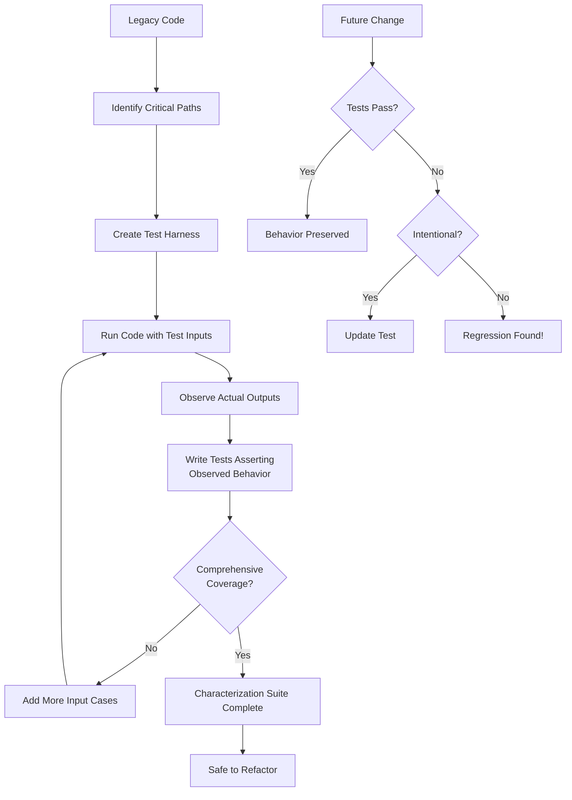
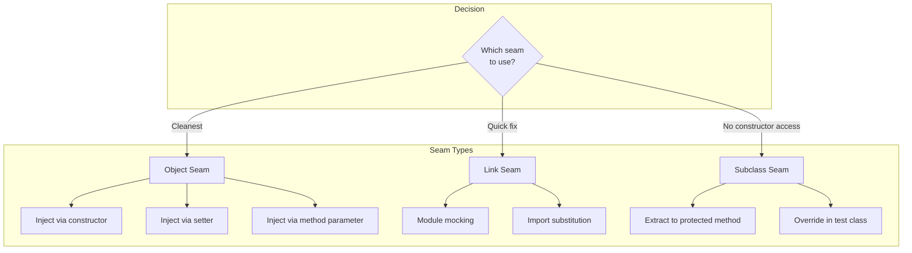
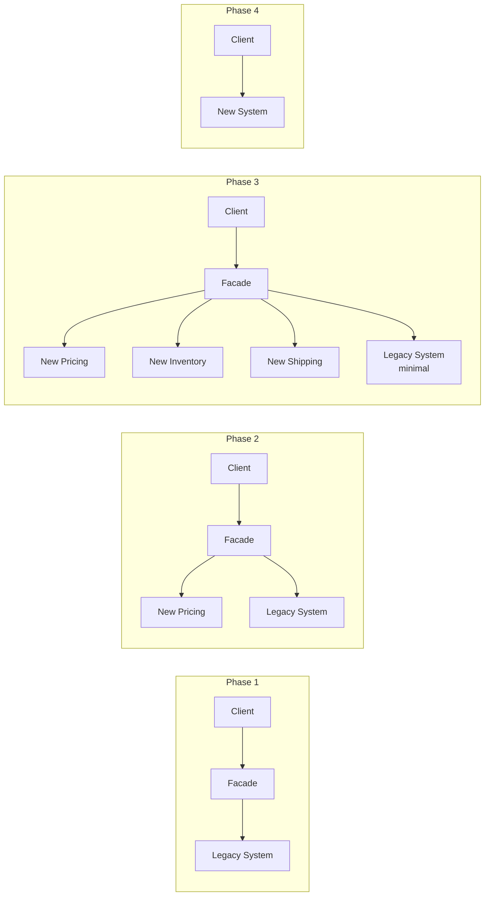
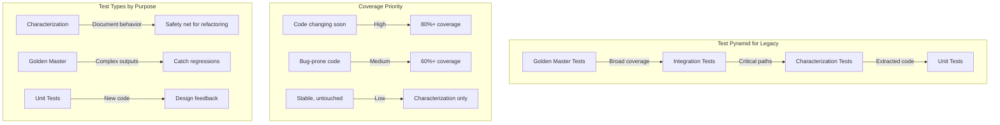

*[TDD]: Test-Driven Development
*[SUT]: System Under Test
*[DI]: Dependency Injection
*[API]: Application Programming Interface
*[OOP]: Object-Oriented Programming
*[IoC]: Inversion of Control
*[IDE]: Integrated Development Environment

# Adding Tests to Untestable Legacy Code

## Introduction

Frame the legacy code testing challenge: you've inherited code with no tests, tightly coupled dependencies, global state, and methods that do too much. The standard advice—"write unit tests"—assumes the code was designed for testability. It wasn't. This section establishes that testing legacy code requires a different approach: you can't refactor safely without tests, but you can't write tests without refactoring. Breaking this chicken-and-egg problem requires specific techniques—characterization tests to capture existing behavior, seam identification to find injection points, and surgical dependency breaking that doesn't change behavior.

_Include a scenario: a team needs to modify a critical OrderProcessor class. It has 2,000 lines, creates its own database connections, sends emails directly, calls external APIs, and reads from configuration files. No tests exist. A previous developer tried to add tests but gave up—every test required a database, email server, and external API to be running. The class is "untestable." Except it isn't. Within two weeks, using the techniques in this article, the team has 80% of the critical paths under test without changing the production behavior. The lesson: "untestable" usually means "requires specific techniques to test."_

<Callout type="warning">
The goal of legacy code testing isn't achieving 100% coverage—it's getting enough safety net to make changes with confidence. Focus on the code you need to change, not comprehensive coverage of code that works and won't be touched.
</Callout>

## Characterization Tests

### What They Are

```typescript title="characterization-test-concept.ts"
// Characterization tests: Capture WHAT the code does, not what it SHOULD do

// Traditional unit test: Tests intended behavior
describe('calculateDiscount', () => {
  it('should apply 10% discount for orders over $100', () => {
    expect(calculateDiscount(150)).toBe(15); // Based on specification
  });
});

// Characterization test: Tests ACTUAL behavior
describe('calculateDiscount - characterization', () => {
  it('returns 15 when given 150', () => {
    // We observed this output; we're locking it in
    expect(calculateDiscount(150)).toBe(15);
  });

  it('returns 0 when given 50', () => {
    // Even if this seems wrong, it's what the code does
    expect(calculateDiscount(50)).toBe(0);
  });

  it('returns 12 when given 99.99', () => {
    // Edge case behavior we discovered through exploration
    // Note: This might be a bug, but we're documenting current behavior
    expect(calculateDiscount(99.99)).toBe(12);
  });
});

// The characterization test process:
// 1. Call the code with various inputs
// 2. Observe what it actually returns
// 3. Write tests that assert those exact outputs
// 4. Now you have a safety net for refactoring
```
Code: Characterization test concept.

```typescript title="characterization-discovery.ts"
// Process: Discovering behavior through characterization

class LegacyPriceCalculator {
  // 500 lines of complex pricing logic
  // No documentation, original authors gone
  // Multiple conditionals, magic numbers
  calculate(order: Order): number {
    // ... complex logic ...
  }
}

// Step 1: Create a test that will fail (to discover actual output)
describe('LegacyPriceCalculator - discovery', () => {
  const calculator = new LegacyPriceCalculator();

  it('discovers behavior for standard order', () => {
    const order = createOrder({ items: 3, subtotal: 100, customer: 'regular' });

    // First run: use obviously wrong expected value
    // expect(calculator.calculate(order)).toBe(-1);
    // Test fails: "Expected -1 but received 94.50"

    // Now we know the actual output:
    expect(calculator.calculate(order)).toBe(94.50);
  });

  it('discovers behavior for premium customer', () => {
    const order = createOrder({ items: 3, subtotal: 100, customer: 'premium' });
    // Discovered: premium customers get different pricing
    expect(calculator.calculate(order)).toBe(85.00);
  });

  it('discovers behavior for bulk order', () => {
    const order = createOrder({ items: 50, subtotal: 5000, customer: 'regular' });
    // Discovered: bulk orders have tiered discounts
    expect(calculator.calculate(order)).toBe(4250.00);
  });

  it('discovers behavior for edge case - zero items', () => {
    const order = createOrder({ items: 0, subtotal: 0, customer: 'regular' });
    // Discovered: returns minimum fee even for empty orders (bug or feature?)
    expect(calculator.calculate(order)).toBe(5.00);
  });
});

// Step 2: Build up comprehensive characterization suite
// Cover: happy paths, edge cases, error conditions, boundary values
```
Code: Characterization test discovery process.

### Writing Effective Characterization Tests

```typescript title="characterization-strategies.ts"
// Strategies for comprehensive characterization

// Strategy 1: Input partitioning
describe('OrderProcessor - input partitioning', () => {
  // Partition inputs into equivalence classes
  const partitions = {
    orderSize: ['empty', 'single', 'small', 'medium', 'large', 'bulk'],
    customerType: ['guest', 'regular', 'premium', 'enterprise'],
    paymentMethod: ['credit', 'debit', 'invoice', 'prepaid'],
    shippingRegion: ['domestic', 'international', 'restricted'],
  };

  // Test representative from each partition
  it.each([
    { size: 'single', customer: 'regular', payment: 'credit', region: 'domestic' },
    { size: 'bulk', customer: 'enterprise', payment: 'invoice', region: 'international' },
    // ... more combinations
  ])('processes order: $size, $customer, $payment, $region', (params) => {
    const order = createOrderWithParams(params);
    const result = processor.process(order);
    // Assert observed behavior
    expect(result).toMatchSnapshot(); // Snapshot for complex objects
  });
});

// Strategy 2: Boundary value analysis
describe('DiscountCalculator - boundaries', () => {
  // Test at and around boundary values
  it.each([
    [99.99, 0],      // Just under threshold
    [100.00, 10],    // At threshold
    [100.01, 10.001], // Just over threshold
    [999.99, 99.999], // Near next tier
    [1000.00, 150],   // At next tier
  ])('calculates discount for $%d as %d', (amount, expectedDiscount) => {
    expect(calculator.getDiscount(amount)).toBeCloseTo(expectedDiscount, 2);
  });
});

// Strategy 3: Error condition exploration
describe('PaymentProcessor - error conditions', () => {
  it('handles null payment method', () => {
    // Don't assume it throws - observe what it actually does
    const result = processor.process({ amount: 100, method: null });
    // Discovered: it defaults to cash instead of throwing
    expect(result.method).toBe('cash');
    expect(result.status).toBe('pending_verification');
  });

  it('handles negative amounts', () => {
    const result = processor.process({ amount: -50, method: 'credit' });
    // Discovered: processes as refund instead of rejecting
    expect(result.type).toBe('refund');
    expect(result.amount).toBe(50);
  });
});

// Strategy 4: Snapshot testing for complex outputs
describe('ReportGenerator - snapshots', () => {
  it('generates monthly sales report', () => {
    const report = generator.generate('monthly', { month: 3, year: 2024 });
    // Snapshot captures entire structure
    expect(report).toMatchSnapshot();
    // If structure changes, test fails and you review the diff
  });
});
```
Code: Characterization test strategies.


Figure: Characterization test workflow.

<Callout type="info">
Characterization tests are not about correctness—they're about documenting current behavior. If you discover a bug during characterization, document it with a comment but don't "fix" the test. Fix the bug later, after you have your safety net in place.
</Callout>

## Finding Seams

### Seam Types

```typescript title="seam-types.ts"
// Seams: Places where you can alter behavior without editing code

// Michael Feathers defines a seam as:
// "A place where you can alter behavior in your program
//  without editing in that place"

// Type 1: Object Seam (most common in OOP)
class OrderService {
  private emailService: EmailService;

  constructor() {
    // Hard-coded dependency - no seam
    this.emailService = new EmailService();
  }

  // vs

  constructor(emailService?: EmailService) {
    // Object seam - can inject test double
    this.emailService = emailService ?? new EmailService();
  }
}

// Type 2: Link Seam (module/import level)
// production.ts
import { sendEmail } from './email-service';

// test.ts - mock the module
jest.mock('./email-service', () => ({
  sendEmail: jest.fn().mockResolvedValue({ success: true }),
}));

// Type 3: Preprocessor Seam (compile-time, less common in modern code)
// #ifdef TESTING
//   return mockValue;
// #else
//   return realCalculation();
// #endif

// Type 4: Subclass Seam (override in test subclass)
class PaymentProcessor {
  protected callPaymentGateway(amount: number): PaymentResult {
    // Real implementation calls external API
    return externalGateway.charge(amount);
  }

  process(order: Order): Result {
    const payment = this.callPaymentGateway(order.total);
    // ... rest of logic
  }
}

// In tests:
class TestablePaymentProcessor extends PaymentProcessor {
  protected callPaymentGateway(amount: number): PaymentResult {
    // Override to avoid external call
    return { success: true, transactionId: 'test-123' };
  }
}
```
Code: Types of seams.

### Identifying Seams in Legacy Code

```typescript title="seam-identification.ts"
// Finding seams in untestable legacy code

// BEFORE: Tightly coupled, no seams
class LegacyOrderProcessor {
  processOrder(orderId: string): void {
    // Direct database call - no seam
    const db = new DatabaseConnection(CONFIG.connectionString);
    const order = db.query(`SELECT * FROM orders WHERE id = '${orderId}'`);

    // Direct file system access - no seam
    const config = JSON.parse(fs.readFileSync('/etc/app/config.json'));

    // Direct external API call - no seam
    const inventory = axios.get(`https://inventory.api/check/${order.sku}`);

    // Direct email sending - no seam
    const mailer = new SmtpMailer(config.smtp);
    mailer.send(order.customerEmail, 'Order Confirmation', template);

    // Direct logging - no seam (usually acceptable)
    console.log(`Processed order ${orderId}`);
  }
}

// ANALYSIS: Finding potential seams
class LegacyOrderProcessorAnalysis {
  /*
   * Potential seams identified:
   *
   * 1. DatabaseConnection instantiation
   *    - Could extract to factory method (subclass seam)
   *    - Could add constructor parameter (object seam)
   *
   * 2. File system read
   *    - Could extract to separate method (subclass seam)
   *    - Could inject config object (object seam)
   *
   * 3. Axios HTTP call
   *    - Could inject HTTP client (object seam)
   *    - Could mock axios module (link seam)
   *
   * 4. SmtpMailer instantiation
   *    - Could inject mailer interface (object seam)
   *    - Could extract to protected method (subclass seam)
   */
}

// PATTERN: Introduce Sensing Variable (temporary seam)
class LegacyOrderProcessor {
  // Temporary field for testing - remove after refactoring
  _testingLastEmailSent?: { to: string; subject: string };

  processOrder(orderId: string): void {
    // ... existing code ...

    mailer.send(order.customerEmail, 'Order Confirmation', template);

    // Sensing: capture what was sent for test verification
    this._testingLastEmailSent = {
      to: order.customerEmail,
      subject: 'Order Confirmation'
    };
  }
}
```
Code: Identifying seams in legacy code.


Figure: Seam type decision.

<Callout type="success">
Look for the "new" keyword and static method calls—these are often where seams are missing. Every `new SomeClass()` inside a method is a dependency that's hard to test. Every static call is a hidden dependency.
</Callout>

## Breaking Dependencies

### Extract and Override

```typescript title="extract-override.ts"
// Technique: Extract and Override (Subclass Seam)

// BEFORE: Untestable - creates its own dependencies
class InvoiceGenerator {
  generate(customerId: string): Invoice {
    // Hard-coded database dependency
    const db = new Database(process.env.DB_CONNECTION);
    const customer = db.findCustomer(customerId);

    // Hard-coded external API call
    const taxRate = await fetch(`https://tax-api.com/rate/${customer.state}`)
      .then(r => r.json());

    // Hard-coded date (makes tests non-deterministic)
    const invoiceDate = new Date();

    return new Invoice(customer, taxRate, invoiceDate);
  }
}

// AFTER: Extract to protected methods (minimal change)
class InvoiceGenerator {
  generate(customerId: string): Invoice {
    const customer = this.getCustomer(customerId);
    const taxRate = this.getTaxRate(customer.state);
    const invoiceDate = this.getCurrentDate();

    return new Invoice(customer, taxRate, invoiceDate);
  }

  // Protected methods create subclass seams
  protected getCustomer(customerId: string): Customer {
    const db = new Database(process.env.DB_CONNECTION);
    return db.findCustomer(customerId);
  }

  protected getTaxRate(state: string): number {
    return fetch(`https://tax-api.com/rate/${state}`)
      .then(r => r.json());
  }

  protected getCurrentDate(): Date {
    return new Date();
  }
}

// TEST: Override protected methods
class TestableInvoiceGenerator extends InvoiceGenerator {
  private testCustomer: Customer;
  private testTaxRate: number;
  private testDate: Date;

  constructor(customer: Customer, taxRate: number, date: Date) {
    super();
    this.testCustomer = customer;
    this.testTaxRate = taxRate;
    this.testDate = date;
  }

  protected getCustomer(): Customer {
    return this.testCustomer;
  }

  protected getTaxRate(): number {
    return this.testTaxRate;
  }

  protected getCurrentDate(): Date {
    return this.testDate;
  }
}

// Now we can test the core logic without dependencies
describe('InvoiceGenerator', () => {
  it('generates invoice with correct total', () => {
    const customer = { id: '123', state: 'CA', balance: 100 };
    const generator = new TestableInvoiceGenerator(
      customer,
      0.0825, // Tax rate
      new Date('2024-01-15')
    );

    const invoice = generator.generate('123');

    expect(invoice.total).toBe(108.25);
    expect(invoice.date).toEqual(new Date('2024-01-15'));
  });
});
```
Code: Extract and override technique.

### Parameterize Constructor

```typescript title="parameterize-constructor.ts"
// Technique: Parameterize Constructor (Object Seam)

// BEFORE: Dependencies created internally
class NotificationService {
  private emailClient: EmailClient;
  private smsClient: SmsClient;
  private logger: Logger;

  constructor() {
    this.emailClient = new EmailClient(CONFIG.smtp);
    this.smsClient = new SmsClient(CONFIG.twilio);
    this.logger = new FileLogger('/var/log/notifications.log');
  }

  notify(user: User, message: string): void {
    this.logger.log(`Notifying ${user.id}`);

    if (user.preferences.email) {
      this.emailClient.send(user.email, message);
    }

    if (user.preferences.sms) {
      this.smsClient.send(user.phone, message);
    }
  }
}

// AFTER: Dependencies injectable with defaults (preserves existing behavior)
class NotificationService {
  private emailClient: EmailClient;
  private smsClient: SmsClient;
  private logger: Logger;

  constructor(
    emailClient?: EmailClient,
    smsClient?: SmsClient,
    logger?: Logger
  ) {
    // Default to production dependencies if not provided
    // This preserves all existing call sites
    this.emailClient = emailClient ?? new EmailClient(CONFIG.smtp);
    this.smsClient = smsClient ?? new SmsClient(CONFIG.twilio);
    this.logger = logger ?? new FileLogger('/var/log/notifications.log');
  }

  // ... rest unchanged
}

// TEST: Inject test doubles
describe('NotificationService', () => {
  it('sends email when user prefers email', () => {
    const mockEmail = { send: jest.fn() };
    const mockSms = { send: jest.fn() };
    const mockLogger = { log: jest.fn() };

    const service = new NotificationService(mockEmail, mockSms, mockLogger);

    service.notify(
      { id: '1', email: 'test@example.com', preferences: { email: true, sms: false } },
      'Hello'
    );

    expect(mockEmail.send).toHaveBeenCalledWith('test@example.com', 'Hello');
    expect(mockSms.send).not.toHaveBeenCalled();
  });
});
```
Code: Parameterize constructor technique.

### Introduce Instance Delegator

```typescript title="instance-delegator.ts"
// Technique: Introduce Instance Delegator (for static methods)

// BEFORE: Static method call - hard to test
class OrderValidator {
  validate(order: Order): ValidationResult {
    // Static utility call - can't override or mock easily
    const isValidAddress = AddressValidator.validate(order.shippingAddress);
    const isValidPayment = PaymentValidator.validate(order.paymentMethod);

    if (!isValidAddress) {
      return { valid: false, reason: 'Invalid address' };
    }

    if (!isValidPayment) {
      return { valid: false, reason: 'Invalid payment method' };
    }

    return { valid: true };
  }
}

// AFTER: Wrap static calls in instance methods
class OrderValidator {
  validate(order: Order): ValidationResult {
    const isValidAddress = this.validateAddress(order.shippingAddress);
    const isValidPayment = this.validatePayment(order.paymentMethod);

    if (!isValidAddress) {
      return { valid: false, reason: 'Invalid address' };
    }

    if (!isValidPayment) {
      return { valid: false, reason: 'Invalid payment method' };
    }

    return { valid: true };
  }

  // Instance delegators to static methods
  protected validateAddress(address: Address): boolean {
    return AddressValidator.validate(address);
  }

  protected validatePayment(payment: PaymentMethod): boolean {
    return PaymentValidator.validate(payment);
  }
}

// Alternative: Extract interface and inject
interface AddressValidation {
  validate(address: Address): boolean;
}

class OrderValidator {
  constructor(
    private addressValidator: AddressValidation = {
      validate: (addr) => AddressValidator.validate(addr)
    }
  ) {}

  validate(order: Order): ValidationResult {
    const isValidAddress = this.addressValidator.validate(order.shippingAddress);
    // ...
  }
}
```
Code: Instance delegator technique.

| Technique | When to Use | Pros | Cons |
|-----------|-------------|------|------|
| Extract and Override | Quick wins, no API change | Minimal code change | Test class inheritance |
| Parameterize Constructor | Long-term solution | Clean DI pattern | May require interface |
| Instance Delegator | Static method calls | Enables testing | Adds indirection |
| Link Seam (mocking) | Can't modify code | No production changes | Fragile to refactoring |

Table: Dependency breaking techniques.

<Callout type="warning">
These techniques are stepping stones, not final designs. Extract and Override is faster but creates inheritance-based testing. After you have tests, refactor toward proper dependency injection.
</Callout>

## The Strangler Fig Approach

### Incremental Testing Strategy

```typescript title="strangler-fig.ts"
// Strangler Fig: Gradually wrap and replace legacy code

// BEFORE: Monolithic untestable class
class LegacyOrderSystem {
  // 3000 lines of code
  // Handles: validation, pricing, inventory, shipping, notifications
  processOrder(orderData: any): any {
    // ... massive method with everything intertwined
  }
}

// PHASE 1: Wrap with facade, characterize at boundary
class OrderSystemFacade {
  private legacy = new LegacyOrderSystem();

  processOrder(orderData: OrderInput): OrderResult {
    // Convert to legacy format
    const legacyInput = this.toLegacyFormat(orderData);

    // Call legacy system
    const legacyResult = this.legacy.processOrder(legacyInput);

    // Convert to new format
    return this.fromLegacyFormat(legacyResult);
  }
}

// Characterize the facade
describe('OrderSystemFacade - characterization', () => {
  it('processes standard order', () => {
    const input: OrderInput = { /* ... */ };
    const result = facade.processOrder(input);
    expect(result).toMatchSnapshot();
  });
});

// PHASE 2: Extract one responsibility with tests
class PricingService {
  // New, testable implementation
  calculatePrice(items: Item[], customer: Customer): PriceBreakdown {
    // Clean, tested code
  }
}

class OrderSystemFacade {
  private legacy = new LegacyOrderSystem();
  private pricing = new PricingService();

  processOrder(orderData: OrderInput): OrderResult {
    // Use new pricing service
    const price = this.pricing.calculatePrice(orderData.items, orderData.customer);

    // Still use legacy for everything else
    const legacyInput = this.toLegacyFormat({ ...orderData, calculatedPrice: price });
    const legacyResult = this.legacy.processOrder(legacyInput);

    return this.fromLegacyFormat(legacyResult);
  }
}

// PHASE 3: Continue extracting until legacy is hollow
class OrderSystemFacade {
  constructor(
    private validation: ValidationService,
    private pricing: PricingService,
    private inventory: InventoryService,
    private shipping: ShippingService,
    private notifications: NotificationService
  ) {}

  processOrder(orderData: OrderInput): OrderResult {
    // All new, tested services
    const validated = this.validation.validate(orderData);
    const priced = this.pricing.calculate(validated);
    const reserved = this.inventory.reserve(priced);
    const shipped = this.shipping.schedule(reserved);
    this.notifications.send(shipped);

    return shipped;
  }
}

// PHASE 4: Remove facade, legacy code is gone
```
Code: Strangler fig migration pattern.


Figure: Strangler fig progression.

### Golden Master Testing

```typescript title="golden-master.ts"
// Golden Master: Capture comprehensive output for complex systems

class GoldenMasterTest {
  private goldenMasterPath = './test/golden-masters';

  // Generate golden master from production data
  async generateGoldenMaster(system: LegacySystem): Promise<void> {
    const testCases = await this.loadProductionSamples();
    const results: GoldenMasterRecord[] = [];

    for (const testCase of testCases) {
      const output = system.process(testCase.input);
      results.push({
        id: testCase.id,
        input: testCase.input,
        output: output,
        timestamp: new Date().toISOString(),
      });
    }

    await fs.writeFile(
      `${this.goldenMasterPath}/order-processing.json`,
      JSON.stringify(results, null, 2)
    );
  }

  // Verify against golden master
  async verifyAgainstGoldenMaster(system: LegacySystem): Promise<TestResults> {
    const goldenMaster = await this.loadGoldenMaster('order-processing.json');
    const failures: TestFailure[] = [];

    for (const record of goldenMaster) {
      const actualOutput = system.process(record.input);

      if (!this.deepEquals(actualOutput, record.output)) {
        failures.push({
          id: record.id,
          expected: record.output,
          actual: actualOutput,
          diff: this.computeDiff(record.output, actualOutput),
        });
      }
    }

    return {
      total: goldenMaster.length,
      passed: goldenMaster.length - failures.length,
      failed: failures.length,
      failures,
    };
  }
}

// Usage in CI
describe('Legacy System - Golden Master', () => {
  const goldenMaster = new GoldenMasterTest();
  const system = new LegacySystem();

  it('matches golden master output', async () => {
    const results = await goldenMaster.verifyAgainstGoldenMaster(system);

    if (results.failed > 0) {
      console.log('Failures:', JSON.stringify(results.failures, null, 2));
    }

    expect(results.failed).toBe(0);
  });
});

// When to update golden master:
// 1. Intentional behavior change
// 2. Bug fix (behavior was wrong)
// 3. New feature (new outputs expected)
// NEVER update just because tests fail - investigate first!
```
Code: Golden master testing.

<Callout type="success">
Golden master tests are particularly powerful for legacy systems with complex outputs. They capture "what the system does" across hundreds of scenarios without you needing to understand each one. When they fail, you know something changed—then you investigate whether it was intentional.
</Callout>

## Testing Strategies by Code Type

### Static Cling

```typescript title="static-cling.ts"
// Problem: Static method calls that can't be overridden

// BEFORE: Direct static calls everywhere
class ReportGenerator {
  generate(): Report {
    const data = DatabaseHelper.query('SELECT * FROM sales');
    const formatted = StringUtils.formatCurrency(data.total);
    const timestamp = DateUtils.getCurrentTimestamp();

    return new Report(data, formatted, timestamp);
  }
}

// SOLUTION 1: Wrap in instance methods (Extract and Override)
class ReportGenerator {
  generate(): Report {
    const data = this.queryDatabase('SELECT * FROM sales');
    const formatted = this.formatCurrency(data.total);
    const timestamp = this.getTimestamp();

    return new Report(data, formatted, timestamp);
  }

  protected queryDatabase(sql: string): any {
    return DatabaseHelper.query(sql);
  }

  protected formatCurrency(amount: number): string {
    return StringUtils.formatCurrency(amount);
  }

  protected getTimestamp(): string {
    return DateUtils.getCurrentTimestamp();
  }
}

// SOLUTION 2: Introduce interfaces + adapters
interface DatabaseAdapter {
  query(sql: string): any;
}

class ProductionDatabaseAdapter implements DatabaseAdapter {
  query(sql: string): any {
    return DatabaseHelper.query(sql);
  }
}

class ReportGenerator {
  constructor(private db: DatabaseAdapter = new ProductionDatabaseAdapter()) {}

  generate(): Report {
    const data = this.db.query('SELECT * FROM sales');
    // ...
  }
}
```
Code: Handling static cling.

### Hidden Dependencies

```typescript title="hidden-dependencies.ts"
// Problem: Dependencies accessed via global state or singletons

// BEFORE: Hidden singleton access
class OrderProcessor {
  process(order: Order): void {
    // Hidden dependency: singleton access
    const config = Configuration.getInstance();
    const logger = Logger.getInstance();
    const cache = CacheManager.getInstance();

    logger.info(`Processing order ${order.id}`);

    if (config.get('feature.newPricing')) {
      // ... new pricing logic
    }

    cache.set(`order:${order.id}`, order);
  }
}

// SOLUTION: Expose dependencies, provide defaults
class OrderProcessor {
  constructor(
    private config: Configuration = Configuration.getInstance(),
    private logger: Logger = Logger.getInstance(),
    private cache: CacheManager = CacheManager.getInstance()
  ) {}

  process(order: Order): void {
    this.logger.info(`Processing order ${order.id}`);

    if (this.config.get('feature.newPricing')) {
      // ... new pricing logic
    }

    this.cache.set(`order:${order.id}`, order);
  }
}

// ALTERNATIVE: Reset singletons in tests (last resort)
describe('OrderProcessor', () => {
  beforeEach(() => {
    // Reset singleton state
    Configuration.resetInstance();
    Logger.resetInstance();
    CacheManager.resetInstance();

    // Configure for testing
    Configuration.getInstance().set('feature.newPricing', true);
  });

  afterEach(() => {
    // Restore production state
    Configuration.resetInstance();
  });
});
```
Code: Handling hidden dependencies.

### Monster Methods

```typescript title="monster-methods.ts"
// Problem: Methods too long to understand or test

// BEFORE: 500-line method
class InvoiceProcessor {
  processMonthlyInvoices(): void {
    // Line 1-100: Load customer data
    // Line 101-200: Calculate usage
    // Line 201-300: Apply discounts
    // Line 301-400: Generate PDF
    // Line 401-500: Send emails
  }
}

// SOLUTION: Sprout Method - add new functionality in tested methods
class InvoiceProcessor {
  processMonthlyInvoices(): void {
    // ... existing 500 lines unchanged ...

    // NEW: Add late fee calculation (tested separately)
    const lateFees = this.calculateLateFees(invoices);
    this.applyLateFees(invoices, lateFees);
  }

  // New method is fully tested
  calculateLateFees(invoices: Invoice[]): Map<string, number> {
    const fees = new Map<string, number>();

    for (const invoice of invoices) {
      if (this.isOverdue(invoice)) {
        fees.set(invoice.id, invoice.amount * 0.015);
      }
    }

    return fees;
  }

  private isOverdue(invoice: Invoice): boolean {
    return invoice.dueDate < new Date();
  }
}

// SOLUTION: Sprout Class - extract to new tested class
class LateFeeCalculator {
  calculate(invoices: Invoice[]): Map<string, number> {
    // Fully tested, isolated logic
  }
}

class InvoiceProcessor {
  private lateFeeCalculator = new LateFeeCalculator();

  processMonthlyInvoices(): void {
    // ... existing code ...
    const lateFees = this.lateFeeCalculator.calculate(invoices);
  }
}
```
Code: Handling monster methods.

| Pattern | Problem | Solution | Testing Approach |
|---------|---------|----------|------------------|
| Static Cling | Static method calls | Instance delegators | Override or inject |
| Hidden Dependencies | Singleton/global access | Parameterize constructor | Inject mocks |
| Monster Methods | Too long to test | Sprout method/class | Test new code only |
| Deep Nesting | Complex conditionals | Extract conditionals | Test extracted pieces |
| Temporal Coupling | Order-dependent calls | Make order explicit | Document in tests |

Table: Legacy code patterns and solutions.

<Callout type="info">
"Sprout" techniques (sprout method, sprout class) let you add tested code without changing existing logic. The monster method stays untouched, but new functionality is clean and tested. Over time, you sprout enough that the monster becomes hollow.
</Callout>

## Building the Safety Net

### Incremental Coverage Strategy

```typescript title="coverage-strategy.ts"
// Strategy: Prioritize coverage by change risk

interface CoverageTarget {
  file: string;
  changeFrequency: 'high' | 'medium' | 'low';
  bugHistory: number;
  plannedChanges: boolean;
  currentCoverage: number;
  targetCoverage: number;
}

const coverageStrategy: CoverageTarget[] = [
  {
    file: 'OrderProcessor.ts',
    changeFrequency: 'high',
    bugHistory: 12,
    plannedChanges: true,
    currentCoverage: 0,
    targetCoverage: 80,
    // PRIORITY 1: High change, high bugs, planned work
  },
  {
    file: 'PaymentGateway.ts',
    changeFrequency: 'medium',
    bugHistory: 5,
    plannedChanges: true,
    currentCoverage: 20,
    targetCoverage: 70,
    // PRIORITY 2: Planned changes
  },
  {
    file: 'LegacyReporting.ts',
    changeFrequency: 'low',
    bugHistory: 2,
    plannedChanges: false,
    currentCoverage: 0,
    targetCoverage: 0,
    // PRIORITY: None - stable, no planned changes
  },
];

// Focus testing effort on code that will change
// Don't test stable legacy code that works and won't be touched
```
Code: Coverage prioritization strategy.

### Test Organization

```typescript title="test-organization.ts"
// Organizing legacy code tests

// Directory structure
// tests/
// ├── characterization/          # Capture existing behavior
// │   ├── order-processing.spec.ts
// │   └── payment-gateway.spec.ts
// ├── golden-masters/            # Complex output snapshots
// │   ├── invoice-generation/
// │   └── report-generation/
// ├── integration/               # Cross-component tests
// │   └── order-to-invoice.spec.ts
// └── unit/                      # New extracted code
//     ├── pricing-service.spec.ts
//     └── validation-service.spec.ts

// Test naming for legacy code
describe('OrderProcessor', () => {
  describe('characterization - existing behavior', () => {
    // These tests document what the code DOES
    // Don't change them unless behavior intentionally changes

    it('[CHAR] returns order total including tax for CA customers', () => {
      // [CHAR] prefix indicates characterization test
    });

    it('[CHAR] handles null shipping address by using billing', () => {
      // Documents discovered behavior (maybe unexpected)
    });
  });

  describe('unit - extracted logic', () => {
    // These test new, extracted, well-designed code

    it('calculates discount for premium customers', () => {
      // Standard unit test for extracted PricingService
    });
  });

  describe('regression - bug fixes', () => {
    // Tests added when bugs are fixed

    it('[BUG-1234] prevents negative quantities', () => {
      // Reference to bug tracker
    });
  });
});
```
Code: Test organization for legacy code.


Figure: Legacy testing strategy.

<Callout type="warning">
Don't aim for 100% coverage on legacy code. Aim for coverage where you need confidence: code you're changing, code with bug history, and critical paths. Testing stable legacy code that works is wasteful.
</Callout>

## Conclusion

Summarize the legacy code testing approach: start with characterization tests to document existing behavior without judgment, identify seams where you can alter behavior for testing, use dependency-breaking techniques (extract and override, parameterize constructor, instance delegator) to enable test doubles, apply the strangler fig pattern to incrementally replace legacy with tested code, and prioritize coverage based on planned changes and risk. Emphasize that "untestable" code is almost always testable with the right techniques—the question is whether the investment is worth it for code that may never change.

<Callout type="success">
The key insight: you don't need to understand legacy code to test it. Characterization tests capture behavior you can observe. Seams let you isolate without understanding. Then, with tests in place, you can safely refactor toward code you DO understand.
</Callout>

---

## Cover Prompt

### Prompt 1: The Archaeological Dig

Create an image of archaeologists carefully excavating an ancient codebase. They use brushes (characterization tests) to reveal buried structures, place markers (seams) at extraction points, and document findings (test assertions) on clipboards. Layers of sediment represent years of accumulated code. Style: archaeological excavation, careful documentation, layer-by-layer discovery, 16:9 aspect ratio.

### Prompt 2: The Strangler Fig Tree

Design an image of a strangler fig tree growing around an old host tree (legacy code). New roots (tested services) gradually wrap the trunk, while the original tree remains standing but increasingly hollow. A gardener (developer) tends to the new growth. Labels show which parts are legacy vs new. Style: botanical metaphor, gradual replacement, living architecture, 16:9 aspect ratio.

### Prompt 3: The Bomb Disposal

Illustrate a bomb disposal expert (developer) approaching a complex device (legacy code). They use mirrors (characterization tests) to see without touching, identify safe cutting points (seams) with careful analysis, and have protective equipment (test safety net) ready. Each wire represents a dependency. Style: precision work, careful analysis, safety first, 16:9 aspect ratio.

### Prompt 4: The Ship Repair

Create an image of workers repairing a sailing ship while at sea (production). They build scaffolding (test harnesses) around sections, replace planks one at a time (strangler fig), and test each repair (characterization) before moving on. The ship must keep sailing throughout. Style: repair in motion, gradual replacement, continuous operation, 16:9 aspect ratio.

### Prompt 5: The Code Surgeon

Design an image of a surgeon (developer) operating on legacy code represented as a patient. Monitors show vital signs (test coverage, bug rates). The surgeon identifies incision points (seams), uses minimal invasive techniques (dependency breaking), and has a team ready with recovery tools (CI/CD). Style: surgical precision, careful intervention, monitoring, 16:9 aspect ratio.
