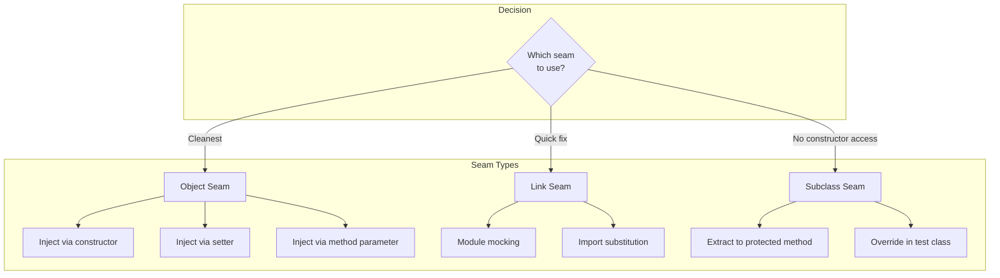
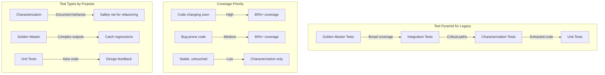

*[TDD]: Test-Driven Development
*[SUT]: System Under Test
*[DI]: Dependency Injection
*[API]: Application Programming Interface
*[OOP]: Object-Oriented Programming
*[IoC]: Inversion of Control
*[IDE]: Integrated Development Environment

You've inherited a codebase with no tests. The classes are tightly coupled, dependencies are created inline, global state is everywhere, and methods run hundreds of lines. The standard advice—"write unit tests"—assumes the code was designed for testability. It wasn't.

Here's the paradox: you can't refactor safely without tests, but you can't write tests without refactoring. Every attempt to instantiate a class pulls in a database connection, an email client, three external APIs, and a configuration file. A previous developer tried to add tests and gave up after realizing every test required a running database, mail server, and network access to production APIs.

The code is "untestable." Except it isn't.

Consider a real scenario: a team inherits an `OrderProcessor` class. It's 2,000 lines, creates its own database connections, sends emails directly, calls external inventory APIs, and reads from configuration files scattered across the filesystem. No tests exist. The class touches revenue-critical paths, and the team needs to modify it for a new payment provider.

Within two weeks, using the techniques in this article, they have 80% of the critical paths under test _without changing production behavior_. The "untestable" code is now testable. The difference isn't magic—it's specific techniques: characterization tests to capture existing behavior, seam identification to find injection points, and surgical dependency breaking that isolates without altering.

<Callout type="warning">
The goal isn't 100% coverage—it's getting enough safety net to make changes with confidence. Focus on the code you need to change, not comprehensive coverage of code that works and won't be touched.
</Callout>

## Characterization Tests

Traditional unit tests verify that code does what it _should_ do—you write a test based on a specification, and the test fails if the code doesn't match. Characterization tests flip this: they capture what the code _actually_ does, regardless of intent. You're not testing against a spec; you're documenting observed behavior.

The distinction matters for legacy code. You don't have a spec. The original authors are gone. The code has undocumented edge cases, implicit business rules buried in conditionals, and behaviors that might be bugs or might be features—you can't tell. Characterization tests don't try to answer "is this correct?" They answer "what does this do?" and lock it in.

### The Discovery Process

The technique is simple: call the code with an input, observe what it returns, and write a test asserting that exact output. Here's the mental shift:

```ruby title="characterization-vs-unit_spec.rb"
# Traditional unit test: Tests intended behavior based on specification
RSpec.describe 'DiscountCalculator' do
  it 'applies 10% discount for orders over $100' do
    expect(DiscountCalculator.calculate(150)).to eq(15)
  end
end

# Characterization test: Tests ACTUAL behavior through observation
RSpec.describe 'DiscountCalculator (characterization)' do
  it 'returns 15 when given 150' do
    # Observed output; lock it in
    expect(DiscountCalculator.calculate(150)).to eq(15)
  end

  it 'returns 0 when given 50' do
    # Even if this seems wrong, it's what the code does
    expect(DiscountCalculator.calculate(50)).to eq(0)
  end

  it 'returns 12 when given 99.99' do
    # Edge case discovered—might be a bug, but document it
    expect(DiscountCalculator.calculate(99.99)).to eq(12)
  end
end
```
Code: Characterization tests document observed behavior, not intended behavior.

The process to discover behavior is deliberately low-tech: write a test with an obviously wrong expected value, run it, and let the failure message tell you the actual output. Then update the test with the real value.


```ruby title="behavior_discovery_spec.rb"
RSpec.describe 'LegacyPriceCalculator (discovery)' do
  let(:calculator) { LegacyPriceCalculator.new }

  it 'discovers behavior for standard order' do
    order = OrderFactory.create(items: 3, subtotal: 100, customer: 'regular')

    # First run: use obviously wrong expected value
    # expect(calculator.calculate(order)).to eq(-1)
    # Test fails: "expected: -1\n     got: 94.50"

    # Now we know the actual output:
    expect(calculator.calculate(order)).to eq(94.50)
  end

  it 'discovers behavior for premium customer' do
    order = OrderFactory.create(items: 3, subtotal: 100, customer: 'premium')
    # Discovered: premium customers get different pricing
    expect(calculator.calculate(order)).to eq(85.00)
  end

  it 'discovers edge case - zero items' do
    order = OrderFactory.create(items: 0, subtotal: 0, customer: 'regular')
    # Discovered: returns minimum fee even for empty orders (bug or feature?)
    expect(calculator.calculate(order)).to eq(5.00)
  end
end
```
Code: Using failing tests to discover actual behavior.

That last test—the $5.00 minimum fee for empty orders—is exactly the kind of thing characterization tests reveal. Is it a bug? Intentional? You don't know, and for now, you don't care. You're building a safety net, not making judgments. Document it with a comment, move on, and address it later when you have coverage.

### Writing Effective Characterization Tests

Comprehensive characterization requires systematic exploration. Three strategies help ensure you're covering the behavior that matters:

_Input partitioning_ divides inputs into equivalence classes. For an order processor, that might be order sizes (empty, single, small, bulk), customer types (guest, regular, premium), payment methods, and shipping regions. Test at least one representative from each partition, and key combinations:

```ruby title="input_partitioning_spec.rb"
RSpec.describe 'OrderProcessor (input partitioning)' do
  let(:processor) { OrderProcessor.new }

  [
    {
      size: 'single',
      customer: 'regular',
      payment: 'credit',
      region: 'domestic'
    },
    {
      size: 'bulk',
      customer: 'enterprise',
      payment: 'invoice',
      region: 'international'
    },
    {
      size: 'empty',
      customer: 'guest',
      payment: 'prepaid',
      region: 'restricted'
    }
  ].each do |params|
    it "processes order: " \
      "#{params[:size]}, #{params[:customer]}, " \
      "#{params[:payment]}, #{params[:region]}" do
        order = OrderFactory.create(params)
        result = processor.process(order)
        expect(result).to match_snapshot("order_#{params[:size]}_" \
          "#{params[:customer]}_#{params[:payment]}_#{params[:region]}"
        )
    end
  end
end
```
Code: Testing across input partitions with snapshots.

_Boundary value analysis_ focuses on thresholds—the places where behavior changes. If there's a discount tier at $100, test $99.99, $100.00, and $100.01. Legacy code often has off-by-one errors or inconsistent boundary handling that you'll only catch by probing the edges:

```ruby title="boundary_testing_spec.rb"
RSpec.describe 'DiscountCalculator (boundaries)' do
  let(:calculator) { DiscountCalculator.new }

  [
    [99.99, 0],       # Just under threshold
    [100.00, 10],     # At threshold
    [100.01, 10.001], # Just over threshold
    [999.99, 99.999], # Near next tier
    [1000.00, 150]    # At next tier
  ].each do |amount, expected|
    it "calculates discount for $#{amount} as #{expected}" do
      result = calculator.get_discount(amount)
      expect(result).to be_within(0.01).of(expected)
    end
  end
end
```
Code: Probing boundary values to discover threshold behavior.

_Error condition exploration_ tests what happens when inputs are invalid. Don't assume the code throws—observe what it actually does. Legacy code often has surprising error handling:

```ruby title="error_exploration_spec.rb"
RSpec.describe 'PaymentProcessor (error conditions)' do
  let(:processor) { PaymentProcessor.new }

  it 'handles null payment method' do
    result = processor.process(amount: 100, method: nil)
    # Discovered: defaults to cash instead of throwing
    expect(result.method).to eq('cash')
    expect(result.status).to eq('pending_verification')
  end

  it 'handles negative amounts' do
    result = processor.process(amount: -50, method: 'credit')
    # Discovered: processes as refund instead of rejecting
    expect(result.type).to eq('refund')
    expect(result.amount).to eq(50)
  end
end
```
Code: Exploring error handling without assumptions.

For complex outputs—reports, invoices, nested data structures—snapshot testing captures the entire structure without you having to write assertions for every field. When the snapshot changes, the test fails and shows you a diff. You review whether the change was intentional.

<Callout type="info">
Characterization tests are not about correctness—they're about documenting current behavior. If you discover a bug during characterization, document it with a comment but don't "fix" the test. Fix the bug later, after you have your safety net in place.
</Callout>

## Finding Seams

Michael Feathers introduced the concept of seams in _Working Effectively with Legacy Code_, and it remains the most useful mental model for making untestable code testable. A seam is a place where you can alter program behavior without editing the code at that location. The seam itself doesn't change—you change behavior at what Feathers calls the "enabling point."

The distinction matters because legacy code often can't be edited safely. You don't have tests, so any edit risks breaking something. Seams let you substitute behavior for testing purposes without touching the production logic you're trying to protect.

Consider a method that sends emails. The email-sending code is deep inside a 500-line method that also processes orders, updates inventory, and logs analytics. You can't easily extract the email logic—too risky without tests. But if you can find a seam, you can replace the email sender with a test double that captures what _would_ have been sent, without changing the method itself.

### Seam Types

```ruby title="seam_types.rb"
# Seams: Places where you can alter behavior without editing code
# Michael Feathers: "A place where you can alter behavior in your program without editing in that place"

# Type 1: Object Seam (most common in OOP)
class OrderService
  def initialize(email_service = EmailService.new)
    # Object seam - can inject test double
    @email_service = email_service
  end
end

# Type 2: Link Seam (module/import level)
# production.rb
require_relative 'email_service'

# test.rb
RSpec.describe 'OrderService link seam' do
  before do
    stub_const('EmailService', Class.new do
      def send_email(*); { success: true }; end
    end)
  end

  it 'mocks email service' do
    service = OrderService.new(EmailService.new)
    expect(service.instance_variable_get(:@email_service).send_email).to eq({ success: true })
  end
end

# Type 3: Preprocessor Seam (compile-time, less common in Ruby)
# Ruby doesn't have a preprocessor, but you can use environment flags
def calculate_value
  if ENV['TESTING']
    :mock_value
  else
    real_calculation
  end
end

# Type 4: Subclass Seam (override in test subclass)
class PaymentProcessor
  def call_payment_gateway(amount)
    # Real implementation calls external API
    ExternalGateway.charge(amount)
  end

  def process(order)
    payment = call_payment_gateway(order.total)
    # ... rest of logic
  end
end

# In tests:
class TestablePaymentProcessor < PaymentProcessor
  def call_payment_gateway(amount)
    # Override to avoid external call
    { success: true, transaction_id: 'test-123' }
  end
end

RSpec.describe TestablePaymentProcessor do
  it 'returns test payment result' do
    processor = TestablePaymentProcessor.new
    result = processor.call_payment_gateway(100)
    expect(result[:success]).to be true
    expect(result[:transaction_id]).to eq('test-123')
  end
end
```
Code: Types of seams.

The _object seam_ is the most common and usually the cleanest. You pass a dependency through a constructor or method parameter, and the enabling point is the call site where you can pass a different implementation. Ruby makes this trivially easy with default arguments—existing callers get production behavior, tests pass doubles. The same pattern works across many different frameworks.

| Language/Framework | Object Seam Technique |
| ------------------ | --------------------- |
| Ruby | Default arguments in `initialize` |
| C# / Java | Constructor overloads or optional parameters |
| PHP | Default parameter values |
| TypeScript | Optional parameters with nullish coalescing (`??`) |
| Spring Boot | `@Autowired` with test `@Configuration` bindings |
| Laravel | Service container with `$this->app->bind()` in tests |
| .NET | `IServiceCollection` with test service registration |

Table: Object seam techniques by language and framework.

_Link seams_ operate at the module level. In Ruby, you can use `stub_const` to replace a class entirely. In TypeScript/JavaScript, Jest's `jest.mock()` intercepts imports. PHP's Mockery can override class instantiation. Java has PowerMock for static method mocking, though it's a code smell. The enabling point is the test setup. Link seams are powerful but fragile—they couple tests to implementation details like class names, and they break if someone renames things.

_Subclass seams_ work by extracting behavior into a protected method, then overriding it in a test subclass. The enabling point is inheritance. This technique is underrated for legacy code because it requires minimal changes to the original class—you extract one line into a method, and suddenly you have a seam.

The preprocessor seam is mostly a C/C++ concept, but the pattern applies anywhere you use environment-based branching. Rails' `Rails.env.test?`, Laravel's `app()->environment('testing')`, Spring's `@Profile("test")`, and Node's `process.env.NODE_ENV === 'test'` are all effectively preprocessor seams. Use them sparingly—they litter production code with test concerns.

### Identifying Seams in Legacy Code

When you're staring at a tightly coupled class, finding seams requires a systematic scan. Look for object instantiation with `new` or `.new`—each one is a potential object seam waiting to be parameterized. Look for class method calls like `SomeClass.do_thing`—each one could become an instance delegator. Look for global access patterns: singletons, environment variables, file reads, network calls.

```ruby title="seam_identification.rb"
# Finding seams in untestable legacy code

# BEFORE: Tightly coupled, no seams
class LegacyOrderProcessor
  def process_order(order_id)
    # Direct database call - no seam
    db = DatabaseConnection.new(CONFIG[:connection_string])
    order = db.query("SELECT * FROM orders WHERE id = '#{order_id}'")

    # Direct file system access - no seam
    config = JSON.parse(File.read('/etc/app/config.json'))

    # Direct external API call - no seam
    inventory = InventoryApi.check(order[:sku])

    # Direct email sending - no seam
    mailer = SmtpMailer.new(config['smtp'])
    mailer.send(order[:customer_email], 'Order Confirmation', template)

    # Direct logging - no seam (usually acceptable)
    Rails.logger.info("Processed order #{order_id}")
  end
end

# ANALYSIS: Finding potential seams
#
# 1. DatabaseConnection instantiation
#    - Could extract to factory method (subclass seam)
#    - Could add constructor parameter (object seam)
#
# 2. File system read
#    - Could extract to separate method (subclass seam)
#    - Could inject config object (object seam)
#
# 3. InventoryApi call
#    - Could inject API client (object seam)
#    - Could mock InventoryApi (link seam)
#
# 4. SmtpMailer instantiation
#    - Could inject mailer interface (object seam)
#    - Could extract to protected method (subclass seam)

# PATTERN: Introduce Sensing Variable (temporary seam)
class LegacyOrderProcessor
  # Temporary field for testing - remove after refactoring
  attr_accessor :testing_last_email_sent

  def process_order(order_id)
    # ... existing code ...

    mailer.send(order[:customer_email], 'Order Confirmation', template)

    # Sensing: capture what was sent for test verification
    self.testing_last_email_sent = {
      to: order[:customer_email],
      subject: 'Order Confirmation'
    }
  end
end
```
Code: Identifying seams in legacy code.

The sensing variable pattern deserves special attention. Sometimes you can't easily intercept a dependency, but you _can_ add a field that captures what happened. It's ugly—test-specific code in production—but it's a temporary scaffold. Add the sensing variable, write your characterization tests, then refactor toward proper seams and remove the sensing code. The tests survive because they now use better seams.

When choosing which seam type to use, prefer object seams for long-term maintainability. They make dependencies explicit and support proper dependency injection. But when you need tests _now_ and can't change constructor signatures (maybe there are 50 call sites), link seams or subclass seams get you there faster. You can always refactor later—once you have tests.


Figure: Seam type decision.

<Callout type="success">
Look for the `new` keyword and class method calls—these are often where seams are missing. Every `.new` inside a method is a dependency that's hard to test. Every `SomeClass.method` call is a hidden dependency.
</Callout>

## Breaking Dependencies

Once you've identified seams, you need techniques to exploit them. The goal is surgical: make the minimum change that enables testing, without altering the behavior you're trying to protect. These techniques work across languages and frameworks—the syntax differs, but the patterns are universal.

### Extract and Override

_Extract and Override_ is the fastest path to testability when you can't change a class's constructor. You take the problematic code—the `new Database()`, the `fetch()` call, the `new Date()`—and extract it into a protected method. The original method calls the new method instead of the dependency directly. Then in your test, you subclass and override the protected method to return controlled values.

The beauty is that production code doesn't change behavior at all. The protected method still calls the real dependency. Only in tests do you swap it out. This technique works in any language with inheritance: Java, C#, PHP, TypeScript, Ruby, Python.

```ruby title="extract_and_override_spec.rb"
# Technique: Extract and Override (Subclass Seam)

# BEFORE: Untestable - creates its own dependencies
class InvoiceGenerator
  def generate(customer_id)
    # Hard-coded database dependency
    db = Database.new(ENV['DB_CONNECTION'])
    customer = db.find_customer(customer_id)

    # Hard-coded external API call
    tax_rate = TaxApi.fetch_rate(customer.state)

    # Hard-coded date (makes tests non-deterministic)
    invoice_date = Time.now

    Invoice.new(customer, tax_rate, invoice_date)
  end
end

# AFTER: Extract to protected methods (minimal change)
class InvoiceGenerator
  def generate(customer_id)
    customer = get_customer(customer_id)
    tax_rate = get_tax_rate(customer.state)
    invoice_date = get_current_date

    Invoice.new(customer, tax_rate, invoice_date)
  end

  protected

  def get_customer(customer_id)
    db = Database.new(ENV['DB_CONNECTION'])
    db.find_customer(customer_id)
  end

  def get_tax_rate(state)
    TaxApi.fetch_rate(state)
  end

  def get_current_date
    Time.now
  end
end

# TEST: Override protected methods in a test subclass
class TestableInvoiceGenerator < InvoiceGenerator
  def initialize(customer:, tax_rate:, date:)
    @test_customer = customer
    @test_tax_rate = tax_rate
    @test_date = date
  end

  protected

  def get_customer(_customer_id)
    @test_customer
  end

  def get_tax_rate(_state)
    @test_tax_rate
  end

  def get_current_date
    @test_date
  end
end

# Now we can test the core logic without dependencies
RSpec.describe InvoiceGenerator do
  it 'generates invoice with correct total and date' do
    customer = double('Customer', id: 123, state: 'CA', balance: 100)
    generator = TestableInvoiceGenerator.new(
      customer: customer,
      tax_rate: 0.0825,
      date: Time.new(2024, 1, 15)
    )

    invoice = generator.generate(123)

    expect(invoice.total).to eq(108.25)
    expect(invoice.date).to eq(Time.new(2024, 1, 15))
  end
end
```
Code: Extract and override technique.

The test subclass feels awkward if you're used to mocking frameworks, but it has advantages: no magic, no reflection, obvious what's happening. The downside is proliferating test subclasses—one per class you're testing. It's a stepping stone. Once you have tests, refactor toward constructor injection.

### Parameterize Constructor

_Parameterize Constructor_ is the classic dependency injection pattern. Instead of creating dependencies internally, the class receives them through its constructor. The key insight for legacy code: use optional parameters with defaults. Existing call sites don't need to change—they get production dependencies automatically. Only tests pass explicit doubles.

This pattern is the foundation of modern DI frameworks. Spring Boot's `@Autowired`, Laravel's service container, .NET's `IServiceCollection`, and NestJS's providers all build on this concept. Even without a framework, manual constructor injection works everywhere.

```ruby title="parameterize_constructor_spec.rb"
# Technique: Parameterize Constructor (Object Seam)

# BEFORE: Dependencies created internally
class NotificationService
  def initialize
    @mailer = EmailClient.new(ENV['SMTP_CONFIG'])
    @sms = SmsClient.new(ENV['TWILIO_CONFIG'])
    @logger = FileLogger.new('/var/log/notifications.log')
  end

  def notify(user, message)
    @logger.log("Notifying \\#{user.id}")

    @mailer.send(user.email, message) if user.preferences[:email]
    @sms.send(user.phone, message) if user.preferences[:sms]
  end
end

# AFTER: Dependencies injectable with defaults (preserves existing behavior)
class NotificationService
  def initialize(mailer: nil, sms: nil, logger: nil)
    @mailer = mailer || EmailClient.new(ENV['SMTP_CONFIG'])
    @sms = sms || SmsClient.new(ENV['TWILIO_CONFIG'])
    @logger = logger || FileLogger.new('/var/log/notifications.log')
  end

  def notify(user, message)
    @logger.log("Notifying \\#{user.id}")

    @mailer.send(user.email, message) if user.preferences[:email]
    @sms.send(user.phone, message) if user.preferences[:sms]
  end
end

# TEST: Inject test doubles
RSpec.describe NotificationService do
  let(:mock_mailer) { double('EmailClient', send: true) }
  let(:mock_sms) { double('SmsClient', send: true) }
  let(:mock_logger) { double('FileLogger', log: true) }
  let(:user) do
    OpenStruct.new(
      id: 1,
      email: 'test@example.com',
      phone: '555-1234',
      preferences: { email: true, sms: false }
    )
  end

  it 'sends email when user prefers email' do
    service = NotificationService.new(
      mailer: mock_mailer,
      sms: mock_sms,
      logger: mock_logger
    )
    service.notify(user, 'Hello')
    expect(mock_mailer).to have_received(:send).with('test@example.com', 'Hello')
    expect(mock_sms).not_to have_received(:send)
  end
end
```
Code: Parameterize constructor technique.

Notice the defaults preserve backward compatibility. Every existing `new NotificationService()` call still works—it gets production dependencies. This is crucial in legacy codebases where you might have dozens of call sites. You don't want to update them all before you can write your first test.

### Introduce Instance Delegator

_Instance Delegator_ handles the special case of static method calls—what Feathers calls "static cling." Static methods can't be overridden through inheritance, and many mocking frameworks struggle with them. The solution: wrap the static call in an instance method, then use Extract and Override or constructor injection on that wrapper.

In Java, this often means wrapping calls to utility classes or legacy static factories. In PHP, it's facade calls. In Ruby, it's class methods. In C#, it's static helpers. The pattern is the same: create an instance method that delegates to the static, then test against the instance method.


```ruby title="instance_delegator.rb"
# Technique: Introduce Instance Delegator (for static methods)

# BEFORE: Static method call - hard to test
class OrderValidator
  def validate(order)
    # Static utility call - can't override or mock easily
    is_valid_address = AddressValidator.validate(order.shipping_address)
    is_valid_payment = PaymentValidator.validate(order.payment_method)

    return { valid: false, reason: 'Invalid address' } unless is_valid_address
    return { valid: false, reason: 'Invalid payment method' } unless is_valid_payment
    { valid: true }
  end
end

# AFTER: Wrap static calls in instance methods
class OrderValidator
  def validate(order)
    is_valid_address = validate_address(order.shipping_address)
    is_valid_payment = validate_payment(order.payment_method)

    return { valid: false, reason: 'Invalid address' } unless is_valid_address
    return { valid: false, reason: 'Invalid payment method' } unless is_valid_payment
    { valid: true }
  end

  # Instance delegators to static methods
  protected
  def validate_address(address)
    AddressValidator.validate(address)
  end

  def validate_payment(payment)
    PaymentValidator.validate(payment)
  end
end

# Alternative: Extract interface and inject
class OrderValidator
  def initialize(
    address_validator = AddressValidator,
    payment_validator = PaymentValidator
  )
    @address_validator = address_validator
    @payment_validator = payment_validator
  end

  def validate(order)
    is_valid_address = @address_validator.validate(order.shipping_address)
    is_valid_payment = @payment_validator.validate(order.payment_method)
    # ...
  end
end
```
Code: Instance delegator technique.

The alternative approach—injecting the validator classes themselves rather than wrapping their calls—produces cleaner code long-term. You can pass mock classes in tests that respond to `.validate` however you need. This is effectively Parameterize Constructor applied to class method dependencies.

| Technique | When to Use | Pros | Cons |
| ----------- | ------------- | ------ | ------ |
| Extract and Override | Quick wins, no API change | Minimal code change | Test class inheritance |
| Parameterize Constructor | Long-term solution | Clean DI pattern | May require interface |
| Instance Delegator | Static method calls | Enables testing | Adds indirection |
| Link Seam (mocking) | Can't modify code | No production changes | Fragile to refactoring |

Table: Dependency breaking techniques.

Choose based on your constraints. If you need tests today and can't change the constructor signature, Extract and Override gets you there. If you're building for the long term and can modify call sites, Parameterize Constructor produces better designs. Instance Delegator is your escape hatch for static cling. Link seams are the last resort when you truly can't touch the code.

<Callout type="warning">
These techniques are stepping stones, not final designs. Extract and Override is faster but creates inheritance-based testing. After you have tests, refactor toward proper dependency injection.
</Callout>

The techniques above work well for individual classes with a few dependencies. But what happens when the problem isn't a class—it's an entire subsystem?

## The Strangler Fig Approach

The dependency-breaking techniques get you tests around individual classes. But what about the 3,000-line monolith that does everything? You can't test it as a unit—it _is_ the unit. The Strangler Fig pattern, named after the tropical vines that gradually envelop and replace their host trees, offers a path forward.

The idea: wrap the legacy system with a facade that has a clean interface. Write characterization tests against the facade. Then, one responsibility at a time, extract logic from the legacy system into new, tested components. The facade orchestrates both old and new code. Eventually, the legacy system is hollow—all real work happens in the new components—and you remove it entirely.

This pattern works at any scale: a single class, a module, an entire service. It's how you migrate from a legacy monolith to microservices without a big-bang rewrite. It's how you replace a legacy ORM with a new one. The key is incremental progress with continuous delivery—every step is deployable.

### Incremental Testing Strategy

```ruby title="strangler_fig.rb"
# Strangler Fig: Gradually wrap and replace legacy code

# BEFORE: Monolithic untestable class
class LegacyOrderSystem
  # 3000 lines of code
  # Handles: validation, pricing, inventory, shipping, notifications
  def process_order(order_data)
    # ... massive method with everything intertwined
  end
end

# PHASE 1: Wrap with facade, characterize at boundary
class OrderSystemFacade
  def initialize(legacy = LegacyOrderSystem.new)
    @legacy = legacy
  end

  def process_order(order_data)
    legacy_input = to_legacy_format(order_data)
    legacy_result = @legacy.process_order(legacy_input)
    from_legacy_format(legacy_result)
  end

  private
  def to_legacy_format(order_data)
    # ... convert to legacy format ...
  end

  def from_legacy_format(legacy_result)
    # ... convert from legacy format ...
  end
end

# Characterize the facade
RSpec.describe OrderSystemFacade do
  let(:facade) { OrderSystemFacade.new }

  it 'processes standard order' do
    input = { items: [], customer: 'test' }
    result = facade.process_order(input)
    expect(result).to match_snapshot('standard_order')
  end
end

# PHASE 2: Extract one responsibility with tests
class PricingService
  def calculate_price(items, customer)
    # Clean, tested code
  end
end

class OrderSystemFacade
  def initialize(legacy = LegacyOrderSystem.new, pricing = PricingService.new)
    @legacy = legacy
    @pricing = pricing
  end

  def process_order(order_data)
    price = @pricing.calculate_price(order_data[:items], order_data[:customer])
    legacy_input = to_legacy_format(order_data.merge(calculated_price: price))
    legacy_result = @legacy.process_order(legacy_input)
    from_legacy_format(legacy_result)
  end
end

# PHASE 3: Continue extracting until legacy is hollow
class OrderSystemFacade
  def initialize(validation:, pricing:, inventory:, shipping:, notifications:)
    @validation = validation
    @pricing = pricing
    @inventory = inventory
    @shipping = shipping
    @notifications = notifications
  end

  def process_order(order_data)
    validated = @validation.validate(order_data)
    priced = @pricing.calculate(validated)
    reserved = @inventory.reserve(priced)
    shipped = @shipping.schedule(reserved)
    @notifications.send(shipped)
    shipped
  end
end

# PHASE 4: Remove facade, legacy code is gone
```
Code: Strangler fig migration pattern.

### Golden Master Testing

Some legacy systems produce outputs so complex that writing assertions for each scenario is impractical. A reporting engine that generates 50-page PDFs. A pricing system with thousands of SKU combinations. An export process that produces elaborate XML documents. For these, golden master testing offers a pragmatic solution.

The technique: run the system against a representative sample of inputs and capture the outputs. This becomes your "golden master"—the canonical record of what the system does. Future test runs compare against this baseline. Any difference triggers investigation: did we change something intentionally, or did we break something?

Golden master tests trade precision for coverage. You're not asserting _why_ the output is correct—you're asserting that it hasn't changed. This makes them perfect for legacy systems where understanding every nuance would take months. They're also framework-agnostic: any language can serialize outputs and compare them later.

```ruby title="golden_master_spec.rb"
# Golden Master: Capture comprehensive output for complex systems

require 'json'
require 'time'

class GoldenMaster
  GOLDEN_PATH = 'spec/golden_masters/order_processing.json'

  def self.generate(system, samples)
    results = samples.map do |test_case|
      {
        id: test_case[:id],
        input: test_case[:input],
        output: system.process(test_case[:input]),
        timestamp: Time.now.utc.iso8601
      }
    end
    File.write(GOLDEN_PATH, JSON.pretty_generate(results))
  end

  def self.verify(system)
    golden = JSON.parse(File.read(GOLDEN_PATH), symbolize_names: true)
    failures = []

    golden.each do |record|
      actual = system.process(record[:input])
      unless actual == record[:output]
        failures << {
          id: record[:id],
          expected: record[:output],
          actual: actual,
          diff: actual.to_s != record[:output].to_s ? [record[:output], actual] : nil
        }
      end
    end

    {
      total: golden.size,
      passed: golden.size - failures.size,
      failed: failures.size,
      failures: failures
    }
  end
end

# Usage in CI
RSpec.describe 'Legacy System - Golden Master' do
  let(:system) { LegacySystem.new }

  it 'matches golden master output' do
    results = GoldenMaster.verify(system)
    if results[:failed] > 0
      puts "Failures: #{results[:failures].to_json}"
    end
    expect(results[:failed]).to eq(0)
  end
end

# When to update golden master:
# 1. Intentional behavior change
# 2. Bug fix (behavior was wrong)
# 3. New feature (new outputs expected)
# NEVER update just because tests fail—investigate first!
```
Code: Golden master testing.

<Callout type="success">
Golden master tests are particularly powerful for legacy systems with complex outputs. They capture "what the system does" across hundreds of scenarios without you needing to understand each one. When they fail, you know something changed—then you investigate whether it was intentional.
</Callout>

## Quick Reference: Common Legacy Code Patterns

The techniques covered so far—characterization tests, seams, dependency breaking, strangler fig—are the foundations. This section provides a quick reference for recognizing and addressing the most common anti-patterns you'll encounter. Each pattern maps directly to techniques already discussed; this is a condensed lookup table for when you're staring at problematic code and need to identify your approach quickly.

### Static Cling

Static method calls look innocent but create testing nightmares. When your class calls `DateUtils.getCurrentTime()` or `Database.query()`, you can't substitute test doubles. The dependency is baked into the bytecode, not passed through a seam you control.

The problem exists across all statically-typed languages—Java's static methods, C#'s static classes, PHP's static functions. Even dynamically-typed languages suffer when code calls library functions directly rather than through injectable collaborators.

Two solutions dominate. First, wrap static calls in instance methods, then override in tests (Extract and Override). Second, wrap static access behind an interface and inject it (Adapter pattern). The latter produces better design; the former requires less immediate change.

```ruby title="static_cling.rb"
# Problem: Static method calls that can't be overridden

# BEFORE: Direct static calls everywhere
class ReportGenerator
  def generate
    data = DatabaseHelper.query('SELECT * FROM sales')
    formatted = StringUtils.format_currency(data[:total])
    timestamp = DateUtils.current_timestamp
    Report.new(data, formatted, timestamp)
  end
end

# SOLUTION 1: Wrap in instance methods (Extract and Override)
class ReportGenerator
  def generate
    data = query_database('SELECT * FROM sales')
    formatted = format_currency(data[:total])
    timestamp = get_timestamp
    Report.new(data, formatted, timestamp)
  end

  protected

  def query_database(sql)
    DatabaseHelper.query(sql)
  end

  def format_currency(amount)
    StringUtils.format_currency(amount)
  end

  def get_timestamp
    DateUtils.current_timestamp
  end
end

# SOLUTION 2: Use dependency injection (adapter pattern)
class DatabaseAdapter
  def query(sql)
    DatabaseHelper.query(sql)
  end
end

class ReportGenerator
  def initialize(db = DatabaseAdapter.new)
    @db = db
  end

  def generate
    data = @db.query('SELECT * FROM sales')
    # ...
  end
end
```
Code: Handling static cling.

### Hidden Dependencies

Singletons and global state create invisible coupling. The code _looks_ like it has no dependencies—the constructor takes no arguments, the method signature is clean. But inside, it reaches into global state: `Configuration.instance`, `Logger.global`, `ServiceLocator.resolve()`. You can't see the dependencies from the API, but they're there, and they'll sabotage your tests.

Every framework has its version. Java has the classic Singleton pattern. PHP has facades that hide service container lookups. Node.js has module-level singletons. Rails has `Rails.application.config`. The symptom is always the same: tests pass in isolation but fail when run together, because they're sharing state through these hidden channels.

The cure is exposure: make hidden dependencies visible in the constructor. Keep the defaults pointing to production implementations so existing code doesn't break. Now tests can inject alternatives, and the dependency graph becomes explicit.

```ruby title="hidden_dependencies.rb"
# Problem: Dependencies accessed via global state or singletons

# BEFORE: Hidden singleton access
class OrderProcessor
  def process(order)
    # Hidden dependency: singleton access
    config = Configuration.instance
    logger = Logger.instance
    cache = CacheManager.instance

    logger.info("Processing order \\#{order.id}")

    if config.get('feature.newPricing')
      # ... new pricing logic
    end

    cache.set("order:#{order.id}", order)
  end
end

# SOLUTION: Expose dependencies, provide defaults
class OrderProcessor
  def initialize(config: Configuration.instance, logger: Logger.instance, cache: CacheManager.instance)
    @config = config
    @logger = logger
    @cache = cache
  end

  def process(order)
    @logger.info("Processing order \\#{order.id}")

    if @config.get('feature.newPricing')
      # ... new pricing logic
    end

    @cache.set("order:#{order.id}", order)
  end
end

# ALTERNATIVE: Reset singletons in tests (last resort)
RSpec.describe OrderProcessor do
  before do
    # Reset singleton state
    Configuration.reset_instance
    Logger.reset_instance
    CacheManager.reset_instance

    # Configure for testing
    Configuration.instance.set('feature.newPricing', true)
  end

  after do
    # Restore production state
    Configuration.reset_instance
  end
end
```
Code: Handling hidden dependencies.

### Monster Methods

Every legacy codebase has them: methods that span hundreds of lines, doing everything from validation to database access to email sending. They're impossible to test as units because they _aren't_ units—they're entire subsystems crammed into a single method signature.

Don't try to test monster methods directly. Don't try to refactor them all at once. Instead, use "sprout" techniques to grow tested code alongside the monster—this is the Strangler Fig philosophy applied at method level. Need to add a feature? Write it in a new, tested method, then call it from the monster. Need to fix a bug? Extract that logic into a tested class, then delegate to it.

Over time, the monster becomes a thin shell that orchestrates calls to well-tested components. You never had to understand the monster's full complexity. You never had to write tests for code that might have subtle bugs you'd be enshrining.

```ruby title="monster_methods.rb"
# Problem: Methods too long to understand or test

# BEFORE: 500-line method
class InvoiceProcessor
  def process_monthly_invoices
    # Lines 1-100: Load customer data
    # Lines 101-200: Calculate usage
    # Lines 201-300: Apply discounts
    # Lines 301-400: Generate PDF
    # Lines 401-500: Send emails
  end
end

# SOLUTION: Sprout Method - add new functionality in tested methods
class InvoiceProcessor
  def process_monthly_invoices(invoices)
    # ... existing 500 lines unchanged ...

    # NEW: Add late fee calculation (tested separately)
    late_fees = calculate_late_fees(invoices)
    apply_late_fees(invoices, late_fees)
  end

  # New method is fully tested
  def calculate_late_fees(invoices)
    fees = {}
    invoices.each do |invoice|
      if overdue?(invoice)
        fees[invoice.id] = invoice.amount * 0.015
      end
    end
    fees
  end

  private

  def overdue?(invoice)
    invoice.due_date < Date.today
  end
end

# SOLUTION: Sprout Class - extract to new tested class
class LateFeeCalculator
  def calculate(invoices)
    fees = {}
    invoices.each do |invoice|
      if invoice.due_date < Date.today
        fees[invoice.id] = invoice.amount * 0.015
      end
    end
    fees
  end
end

class InvoiceProcessor
  def initialize(late_fee_calculator = LateFeeCalculator.new)
    @late_fee_calculator = late_fee_calculator
  end

  def process_monthly_invoices(invoices)
    # ... existing code ...
    late_fees = @late_fee_calculator.calculate(invoices)
    # ...
  end
end
```
Code: Handling monster methods.

<Callout type="info">
"Sprout" techniques (sprout method, sprout class) let you add tested code without changing existing logic. The monster method stays untouched, but new functionality is clean and tested. Over time, you sprout enough that the monster becomes hollow.
</Callout>

## Building the Safety Net

With techniques in hand, you need strategy. Legacy codebases are too large to test comprehensively. You need to focus effort where it matters: code that's changing, code that's failing, code that's critical. Testing stable legacy code that works and won't be touched is waste.

Think of coverage as insurance. You buy more insurance for valuable, at-risk assets. A module you're rewriting next month needs heavy coverage. A module that hasn't changed in three years and has no planned changes needs minimal coverage—maybe just characterization tests to catch accidental modifications.

### Incremental Coverage Strategy

Prioritize based on three factors: change frequency (code that changes often needs more coverage), bug history (code that breaks often needs more coverage), and planned work (code you'll modify soon needs coverage _before_ you touch it). Stable, boring code that just works? Leave it alone.

This isn't about reaching arbitrary coverage numbers. It's about building confidence where you need it. 80% coverage on code you're actively refactoring is more valuable than 20% coverage spread across the entire codebase.

```ruby title="coverage_strategy.rb"
# Strategy: Prioritize coverage by change risk

CoverageTarget = Struct.new(:file, :change_frequency, :bug_history, :planned_changes, :current_coverage, :target_coverage)

coverage_strategy = [
  CoverageTarget.new(
    'order_processor.rb',
    :high,
    12,
    true,
    0,
    80 # PRIORITY 1: High change, high bugs, planned work
  ),
  CoverageTarget.new(
    'payment_gateway.rb',
    :medium,
    5,
    true,
    20,
    70 # PRIORITY 2: Planned changes
  ),
  CoverageTarget.new(
    'legacy_reporting.rb',
    :low,
    2,
    false,
    0,
    0 # PRIORITY: None - stable, no planned changes
  )
]

# Focus testing effort on code that will change
# Don't test stable legacy code that works and won't be touched
```
Code: Coverage prioritization strategy.

### Test Organization

Legacy test suites need structure that standard test organization doesn't provide. You have characterization tests (documenting existing behavior), golden masters (complex output snapshots), regression tests (bug fixes), and unit tests for newly extracted code. Mixing them together creates confusion about what each test means and when it should change.

Separate tests by purpose. Characterization tests should be clearly marked—these document what the system _does_, not what it _should do_, and changing them requires investigation. Regression tests should reference bug tracker IDs so future developers understand the history. Unit tests for extracted code follow normal conventions.

Naming matters too. A prefix like `[CHAR]` for characterization tests or `[BUG-1234]` for regressions makes intent scannable. When a test fails, the name tells you whether you broke something or whether you're seeing expected change from intentional refactoring.

```ruby title="test_organization_spec.rb"
# Organizing legacy code tests

# Directory structure
# spec/
# ├── characterization/          # Capture existing behavior
# │   ├── order_processing_spec.rb
# │   └── payment_gateway_spec.rb
# ├── golden_masters/            # Complex output snapshots
# │   ├── invoice_generation/
# │   └── report_generation/
# ├── integration/               # Cross-component tests
# │   └── order_to_invoice_spec.rb
# └── unit/                      # New extracted code
#     ├── pricing_service_spec.rb
#     └── validation_service_spec.rb

# Test naming for legacy code
RSpec.describe OrderProcessor do
  context 'characterization - existing behavior' do
    # These tests document what the code DOES
    # Don't change them unless behavior intentionally changes

    it '[CHAR] returns order total including tax for CA customers' do
      # [CHAR] prefix indicates characterization test
    end

    it '[CHAR] handles null shipping address by using billing' do
      # Documents discovered behavior (maybe unexpected)
    end
  end

  context 'unit - extracted logic' do
    # These test new, extracted, well-designed code

    it 'calculates discount for premium customers' do
      # Standard unit test for extracted PricingService
    end
  end

  context 'regression - bug fixes' do
    # Tests added when bugs are fixed

    it '[BUG-1234] prevents negative quantities' do
      # Reference to bug tracker
    end
  end
end
```
Code: Test organization for legacy code.


Figure: Legacy testing strategy.

Note that this inverts the traditional test pyramid. In greenfield development, unit tests form the base. In legacy code, you start with broad characterization and golden master tests at the top—they're faster to write and provide immediate safety. As you extract and refactor, unit tests grow from the bottom up.

<Callout type="warning">
Don't aim for 100% coverage on legacy code. Aim for coverage where you need confidence: code you're changing, code with bug history, and critical paths. Testing stable legacy code that works is wasteful.
</Callout>

## Conclusion

Legacy code isn't a curse—it's working software that's earned its complexity through years of real-world use. The techniques in this article let you approach it systematically rather than fearfully.

Start with characterization tests. Run the code, observe what happens, write it down. Don't judge whether the behavior is correct—just document it. These tests become your safety net, catching unintended changes during refactoring.

Find seams where you can alter behavior without modifying code. Object seams let you substitute implementations. Link seams let you intercept at module boundaries. Preprocessor seams let you swap behavior based on environment. Every language has them; you just need to recognize them.

Break dependencies incrementally. Extract and Override gets you started with minimal change. Parameterize Constructor creates explicit dependency graphs. Instance Delegator handles static cling. Each technique trades design improvement against change risk—choose based on your context.

Use the Strangler Fig pattern for larger extractions. Wrap legacy in a facade, extract one responsibility at a time into tested components, gradually hollow out the legacy code until it's gone. Every step is deployable. No big-bang rewrites.

Prioritize ruthlessly. Test code that's changing, code that's breaking, code that's critical. Leave stable legacy code alone—characterization tests catch accidental changes, but comprehensive testing of code that won't change is waste.

<Callout type="success">
The key insight: you don't need to understand legacy code to test it. Characterization tests capture behavior you can observe. Seams let you isolate without understanding. The myth of "untestable" code usually means "code that's hard to test with conventional techniques." With these patterns, almost any code becomes testable—the question is whether the investment is worth it for code that may never change.
</Callout>
