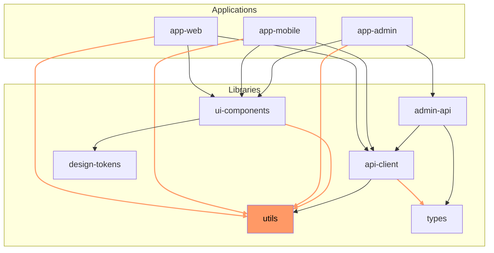
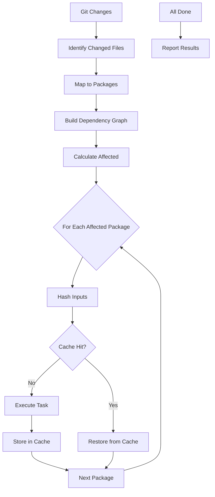
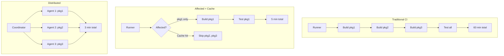
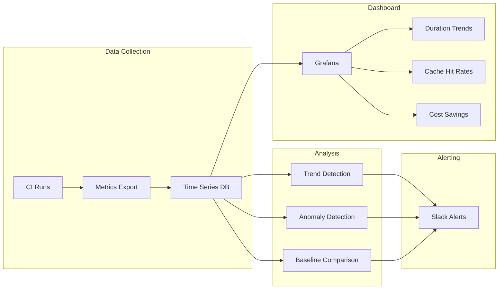

*[CI]: Continuous Integration
*[CD]: Continuous Deployment
*[DAG]: Directed Acyclic Graph
*[API]: Application Programming Interface
*[PR]: Pull Request
*[NX]: Nrwl Extensions
*[TTL]: Time To Live
*[SSD]: Solid State Drive
*[S3]: Simple Storage Service

# Monorepo Release Engineering: Affected Builds

## Introduction

Frame the monorepo CI challenge: as repositories grow to hundreds of packages and applications, naive CI pipelines that build everything on every commit become untenable. A 5-minute build for 10 packages becomes a 2-hour build for 200 packages. The solution isn't faster machines—it's smarter builds. Affected-based builds analyze the dependency graph to determine what actually changed and what depends on those changes. Remote caching stores build outputs so identical inputs never rebuild. Together, they can reduce CI times by 90% or more. This section establishes that monorepo CI optimization isn't optional at scale—it's the difference between developers waiting minutes vs. hours.

_Include a scenario: a monorepo with 150 packages runs full builds on every PR. Average CI time: 45 minutes. Developers stack PRs to avoid waiting, leading to integration conflicts. After implementing affected builds with remote caching, average CI time drops to 4 minutes for typical changes. Cache hit rate reaches 85%. The 10x improvement isn't just faster—it changes how developers work. They run CI before lunch, not before leaving for the day. The lesson: CI time is developer time, and developer time is expensive._

<Callout type="warning">
The biggest monorepo CI mistake: trying to make full builds faster instead of building less. Parallelization and faster machines help, but affected builds with caching provide order-of-magnitude improvements that hardware can't match.
</Callout>

## Understanding Dependency Graphs

### Package Dependencies

```yaml title="dependency-graph-basics.yaml"
# Monorepo dependency graph fundamentals

dependency_types:
  direct_dependency:
    description: "Package A imports from Package B"
    example: "app-web imports @libs/ui-components"
    impact: "Changes to B require rebuilding A"

  transitive_dependency:
    description: "Package A depends on B, B depends on C"
    example: "app-web -> ui-components -> design-tokens"
    impact: "Changes to C require rebuilding A and B"

  dev_dependency:
    description: "Package A needs B for development/testing only"
    example: "app-web devDepends on @libs/test-utils"
    impact: "Usually doesn't affect production builds"

---
# Example monorepo structure
monorepo_structure:
  apps:
    - name: "app-web"
      depends_on: ["@libs/ui-components", "@libs/api-client", "@libs/utils"]
    - name: "app-mobile"
      depends_on: ["@libs/ui-components", "@libs/api-client", "@libs/utils"]
    - name: "app-admin"
      depends_on: ["@libs/ui-components", "@libs/admin-api", "@libs/utils"]

  libs:
    - name: "@libs/ui-components"
      depends_on: ["@libs/design-tokens", "@libs/utils"]
    - name: "@libs/api-client"
      depends_on: ["@libs/utils", "@libs/types"]
    - name: "@libs/admin-api"
      depends_on: ["@libs/api-client", "@libs/types"]
    - name: "@libs/design-tokens"
      depends_on: []
    - name: "@libs/utils"
      depends_on: []
    - name: "@libs/types"
      depends_on: []

# Impact analysis:
# Change to @libs/utils -> Rebuilds: ALL packages (transitive)
# Change to @libs/design-tokens -> Rebuilds: ui-components, app-web, app-mobile, app-admin
# Change to @libs/admin-api -> Rebuilds: app-admin only
```
Code: Dependency graph structure.


Figure: Dependency graph showing utils as high-impact package.

### Calculating Affected Packages

```typescript title="affected-calculation.ts"
// How affected calculation works

interface Package {
  name: string;
  path: string;
  dependencies: string[];
}

interface AffectedResult {
  changed: string[];      // Files that changed
  affected: string[];     // Packages that need to rebuild
  unaffected: string[];   // Packages that can be skipped
}

function calculateAffected(
  changedFiles: string[],
  packages: Package[],
  dependencyGraph: Map<string, string[]>
): AffectedResult {
  // Step 1: Map changed files to packages
  const changedPackages = new Set<string>();

  for (const file of changedFiles) {
    const pkg = findPackageForFile(file, packages);
    if (pkg) {
      changedPackages.add(pkg.name);
    }
  }

  // Step 2: Find all packages that depend on changed packages (transitive)
  const affected = new Set<string>(changedPackages);

  // Reverse the dependency graph (dependents instead of dependencies)
  const dependents = buildDependentsGraph(dependencyGraph);

  // BFS to find all affected packages
  const queue = [...changedPackages];
  while (queue.length > 0) {
    const current = queue.shift()!;
    const packageDependents = dependents.get(current) || [];

    for (const dependent of packageDependents) {
      if (!affected.has(dependent)) {
        affected.add(dependent);
        queue.push(dependent);
      }
    }
  }

  // Step 3: Everything else is unaffected
  const allPackages = packages.map(p => p.name);
  const unaffected = allPackages.filter(p => !affected.has(p));

  return {
    changed: [...changedPackages],
    affected: [...affected],
    unaffected,
  };
}

// Example calculation
const changedFiles = ['libs/utils/src/string-helpers.ts'];
const result = calculateAffected(changedFiles, packages, graph);

// Result:
// changed: ['@libs/utils']
// affected: ['@libs/utils', '@libs/ui-components', '@libs/api-client',
//            'app-web', 'app-mobile', 'app-admin']
// unaffected: ['@libs/design-tokens', '@libs/types', '@libs/admin-api']
```
Code: Affected package calculation.

### Base Reference Selection

```yaml title="base-reference.yaml"
# Choosing the right base for affected comparison

base_strategies:
  main_branch:
    command: "nx affected --base=main"
    use_case: "PR builds - compare to target branch"
    behavior: "Everything changed since branching from main"
    pros: ["Simple", "Standard for PRs"]
    cons: ["Long-lived branches have many changes"]

  last_successful_ci:
    command: "nx affected --base=last-successful-ci"
    use_case: "Main branch builds"
    behavior: "Only changes since last green build"
    pros: ["Minimal rebuilds on main"]
    cons: ["Requires CI state tracking"]

  specific_commit:
    command: "nx affected --base=abc123"
    use_case: "Debugging, specific comparisons"
    behavior: "Changes since specific point"

  parent_commit:
    command: "nx affected --base=HEAD~1"
    use_case: "Per-commit builds on main"
    behavior: "Only this commit's changes"
    pros: ["Very focused"]
    cons: ["Misses multi-commit interactions"]

---
# CI configuration for base selection
ci_base_config:
  pull_request:
    base: "${{ github.event.pull_request.base.sha }}"
    explanation: "Compare PR to its target branch"

  main_push:
    base: "${{ github.event.before }}"
    explanation: "Compare to previous commit on main"

  scheduled:
    base: "main~1"
    explanation: "Full rebuild, minimal affected"
```
Code: Base reference selection strategies.

| Scenario | Base Reference | Expected Affected |
|----------|---------------|-------------------|
| PR to main | main branch HEAD | All changes in PR |
| Push to main | Previous commit | Just pushed changes |
| Release build | Last release tag | All since release |
| Nightly | Last successful | Minimal |

Table: Base reference by CI scenario.

<Callout type="info">
The base reference choice dramatically affects what gets rebuilt. A PR comparing to main from 2 weeks ago will have many more affected packages than one comparing to yesterday's main. Consider rebasing strategies for long-lived branches.
</Callout>

## Affected Build Implementation

### Nx Affected Commands

```yaml title="nx-affected.yaml"
# Nx affected commands for monorepo builds

# Basic affected commands
nx_commands:
  # See what's affected
  show_affected: |
    npx nx show projects --affected --base=main

  # Build only affected
  build_affected: |
    npx nx affected -t build --base=main

  # Test only affected
  test_affected: |
    npx nx affected -t test --base=main

  # Lint only affected
  lint_affected: |
    npx nx affected -t lint --base=main

  # Multiple targets
  multi_target: |
    npx nx affected -t build,test,lint --base=main

  # Parallel execution
  parallel: |
    npx nx affected -t build --parallel=5 --base=main

---
# nx.json configuration
# nx.json
{
  "targetDefaults": {
    "build": {
      "dependsOn": ["^build"],  // Build dependencies first
      "inputs": ["production", "^production"],
      "outputs": ["{projectRoot}/dist"]
    },
    "test": {
      "dependsOn": ["build"],
      "inputs": ["default", "^production", "{workspaceRoot}/jest.preset.js"]
    }
  },
  "namedInputs": {
    "default": ["{projectRoot}/**/*", "sharedGlobals"],
    "production": [
      "default",
      "!{projectRoot}/**/*.spec.ts",
      "!{projectRoot}/tsconfig.spec.json",
      "!{projectRoot}/jest.config.ts"
    ],
    "sharedGlobals": [
      "{workspaceRoot}/tsconfig.base.json",
      "{workspaceRoot}/package.json"
    ]
  },
  "affected": {
    "defaultBase": "main"
  }
}
```
Code: Nx affected configuration.

### Turborepo Affected Builds

```json title="turborepo-config.json"
// turbo.json - Turborepo configuration
{
  "$schema": "https://turbo.build/schema.json",
  "pipeline": {
    "build": {
      "dependsOn": ["^build"],
      "outputs": ["dist/**", ".next/**", "build/**"],
      "inputs": [
        "src/**",
        "package.json",
        "tsconfig.json"
      ]
    },
    "test": {
      "dependsOn": ["build"],
      "outputs": ["coverage/**"],
      "inputs": [
        "src/**",
        "test/**",
        "jest.config.*"
      ]
    },
    "lint": {
      "outputs": [],
      "inputs": [
        "src/**",
        ".eslintrc.*",
        "tsconfig.json"
      ]
    }
  },
  "globalDependencies": [
    "tsconfig.base.json",
    "package-lock.json"
  ]
}
```
Code: Turborepo configuration.

```bash title="turborepo-commands.sh"
#!/bin/bash
# Turborepo affected builds

# Turbo uses file hashing, not git diff
# It automatically determines what needs to rebuild

# Build all affected (based on file changes and cache)
npx turbo run build

# With filter for specific packages
npx turbo run build --filter=app-web...
# The ... means "this package and all its dependencies"

# Filter by changed packages (using git)
npx turbo run build --filter='[origin/main...HEAD]'
# Only packages changed between main and HEAD

# Dry run to see what would execute
npx turbo run build --dry-run

# Output:
# Tasks to Run
# • app-web#build
# • @libs/ui-components#build (CACHED)
# • @libs/utils#build (CACHED)
```
Code: Turborepo CLI commands.


Figure: Affected build execution flow.

<Callout type="success">
Both Nx and Turborepo handle affected builds well. Nx uses explicit git-based affected calculation. Turborepo uses content hashing. The result is similar—build only what changed—but the mechanisms differ.
</Callout>

## Remote Caching

### How Remote Caching Works

```yaml title="remote-cache-concept.yaml"
# Remote caching fundamentals

cache_concept:
  local_cache:
    location: "Developer machine or CI runner"
    benefit: "Faster rebuilds within same environment"
    limitation: "Not shared across machines"

  remote_cache:
    location: "Central server (cloud storage, dedicated service)"
    benefit: "Shared across all developers and CI"
    flow:
      1: "Hash task inputs (files, config, dependencies)"
      2: "Check remote cache for matching hash"
      3: "If hit: download outputs, skip execution"
      4: "If miss: execute task, upload outputs"

---
# Cache key composition
cache_key_components:
  - "Task name (build, test, lint)"
  - "Package name"
  - "Input file hashes"
  - "Dependency output hashes"
  - "Environment variables"
  - "Command arguments"
  - "Runtime version (Node, etc.)"

# Example cache key:
# build:app-web:a1b2c3d4e5f6:node18:prod
# [task]:[pkg]:[input-hash]:[runtime]:[env]

---
# Cache hit scenarios
cache_scenarios:
  developer_a_builds:
    action: "Builds app-web"
    result: "Cache miss, executes build, uploads to remote"

  developer_b_same_code:
    action: "Builds app-web (same code)"
    result: "Cache hit, downloads outputs, skips build"

  ci_same_pr:
    action: "Builds app-web for PR"
    result: "Cache hit from Developer A or B"

  developer_a_new_file:
    action: "Adds file to app-web, builds"
    result: "Cache miss (input hash changed), rebuilds"
```
Code: Remote caching concept.

### Nx Cloud Configuration

```yaml title="nx-cloud-config.yaml"
# Nx Cloud remote caching setup

# Step 1: Connect to Nx Cloud
# npx nx connect-to-nx-cloud

# nx.json with Nx Cloud
{
  "nxCloudAccessToken": "YOUR_ACCESS_TOKEN",
  // or use environment variable
  // NX_CLOUD_ACCESS_TOKEN in CI

  "tasksRunnerOptions": {
    "default": {
      "runner": "nx-cloud",
      "options": {
        "cacheableOperations": ["build", "test", "lint", "e2e"],
        "parallel": 3
      }
    }
  }
}

---
# CI configuration with Nx Cloud
# .github/workflows/ci.yml
name: CI

on:
  push:
    branches: [main]
  pull_request:

jobs:
  build:
    runs-on: ubuntu-latest
    steps:
      - uses: actions/checkout@v4
        with:
          fetch-depth: 0  # Full history for affected

      - uses: actions/setup-node@v4
        with:
          node-version: '20'
          cache: 'npm'

      - run: npm ci

      - name: Run affected builds
        run: npx nx affected -t build,test,lint --base=origin/main
        env:
          NX_CLOUD_ACCESS_TOKEN: ${{ secrets.NX_CLOUD_TOKEN }}

---
# Self-hosted Nx Cloud (enterprise)
nx_cloud_self_hosted:
  deployment: "Docker or Kubernetes"
  storage: "S3, Azure Blob, GCS"
  benefits:
    - "Data stays in your infrastructure"
    - "No external dependencies"
    - "Custom retention policies"
```
Code: Nx Cloud configuration.

### Turborepo Remote Caching

```yaml title="turborepo-remote-cache.yaml"
# Turborepo remote caching options

# Option 1: Vercel Remote Cache (default for Turbo)
# Login and link
# npx turbo login
# npx turbo link

# turbo.json
{
  "remoteCache": {
    "signature": true  // Verify cache integrity
  }
}

# CI with Vercel cache
env:
  TURBO_TOKEN: ${{ secrets.TURBO_TOKEN }}
  TURBO_TEAM: your-team

---
# Option 2: Self-hosted with ducktape/turborepo-remote-cache
# docker-compose.yml
version: '3'
services:
  turbo-cache:
    image: ducktors/turborepo-remote-cache:latest
    ports:
      - "3000:3000"
    environment:
      - STORAGE_PROVIDER=s3
      - S3_ACCESS_KEY=${AWS_ACCESS_KEY}
      - S3_SECRET_KEY=${AWS_SECRET_KEY}
      - S3_BUCKET=turbo-cache
      - S3_REGION=us-east-1

# Configure turbo to use self-hosted
# .turbo/config.json
{
  "teamId": "team_self_hosted",
  "apiUrl": "https://cache.your-domain.com"
}

---
# Option 3: Custom S3 cache (no server)
# Using turbo with S3 directly via wrapper script
s3_cache_script: |
  #!/bin/bash
  # Simple S3 cache wrapper

  CACHE_BUCKET="your-turbo-cache"
  HASH=$(turbo run build --dry-run=json | jq -r '.tasks[0].hash')

  # Check if cached
  if aws s3 ls "s3://${CACHE_BUCKET}/${HASH}.tar.gz" 2>/dev/null; then
    echo "Cache hit for ${HASH}"
    aws s3 cp "s3://${CACHE_BUCKET}/${HASH}.tar.gz" - | tar -xz
  else
    echo "Cache miss, building..."
    turbo run build
    tar -czf - dist/ | aws s3 cp - "s3://${CACHE_BUCKET}/${HASH}.tar.gz"
  fi
```
Code: Turborepo remote caching options.

| Provider | Setup Complexity | Cost | Self-Hosted |
|----------|------------------|------|-------------|
| Nx Cloud | Low | Free tier + paid | Yes (enterprise) |
| Vercel (Turbo) | Low | Free tier + paid | No |
| Self-hosted Turbo | Medium | Infrastructure only | Yes |
| Custom S3 | High | S3 costs only | Yes |

Table: Remote caching provider comparison.

<Callout type="warning">
Remote cache without authentication is a security risk. Anyone with cache access can inject malicious outputs. Always use signed caches (Turbo's signature option) or authenticated endpoints.
</Callout>

## CI Pipeline Optimization

### GitHub Actions Configuration

```yaml title="github-actions-monorepo.yaml"
# .github/workflows/ci.yml
name: CI

on:
  push:
    branches: [main]
  pull_request:

env:
  NX_CLOUD_ACCESS_TOKEN: ${{ secrets.NX_CLOUD_TOKEN }}

jobs:
  # Job 1: Determine what changed
  affected:
    runs-on: ubuntu-latest
    outputs:
      affected: ${{ steps.affected.outputs.affected }}
      has_changes: ${{ steps.affected.outputs.has_changes }}
    steps:
      - uses: actions/checkout@v4
        with:
          fetch-depth: 0

      - uses: actions/setup-node@v4
        with:
          node-version: '20'
          cache: 'npm'

      - run: npm ci

      - name: Get affected projects
        id: affected
        run: |
          if [ "${{ github.event_name }}" = "pull_request" ]; then
            BASE="origin/${{ github.base_ref }}"
          else
            BASE="HEAD~1"
          fi

          AFFECTED=$(npx nx show projects --affected --base=$BASE --json)
          echo "affected=$AFFECTED" >> $GITHUB_OUTPUT

          if [ "$AFFECTED" = "[]" ]; then
            echo "has_changes=false" >> $GITHUB_OUTPUT
          else
            echo "has_changes=true" >> $GITHUB_OUTPUT
          fi

  # Job 2: Build affected
  build:
    needs: affected
    if: needs.affected.outputs.has_changes == 'true'
    runs-on: ubuntu-latest
    steps:
      - uses: actions/checkout@v4
        with:
          fetch-depth: 0

      - uses: actions/setup-node@v4
        with:
          node-version: '20'
          cache: 'npm'

      - run: npm ci

      - name: Build affected
        run: npx nx affected -t build --parallel=3

  # Job 3: Test affected (parallel with build)
  test:
    needs: affected
    if: needs.affected.outputs.has_changes == 'true'
    runs-on: ubuntu-latest
    steps:
      - uses: actions/checkout@v4
        with:
          fetch-depth: 0

      - uses: actions/setup-node@v4
        with:
          node-version: '20'
          cache: 'npm'

      - run: npm ci

      - name: Test affected
        run: npx nx affected -t test --parallel=3

  # Job 4: Lint affected (parallel with build)
  lint:
    needs: affected
    if: needs.affected.outputs.has_changes == 'true'
    runs-on: ubuntu-latest
    steps:
      - uses: actions/checkout@v4
        with:
          fetch-depth: 0

      - uses: actions/setup-node@v4
        with:
          node-version: '20'
          cache: 'npm'

      - run: npm ci

      - name: Lint affected
        run: npx nx affected -t lint --parallel=5
```
Code: GitHub Actions monorepo CI.

### Distributed Task Execution

```yaml title="distributed-execution.yaml"
# Distributing tasks across multiple agents

# Nx Cloud distributed execution
# .github/workflows/ci-distributed.yml
name: CI (Distributed)

on:
  push:
    branches: [main]
  pull_request:

jobs:
  main:
    runs-on: ubuntu-latest
    steps:
      - uses: actions/checkout@v4
        with:
          fetch-depth: 0

      - uses: actions/setup-node@v4
        with:
          node-version: '20'
          cache: 'npm'

      - run: npm ci

      # Start distributed execution
      - name: Start CI run
        run: npx nx-cloud start-ci-run --distribute-on="3 linux-medium-js"

      - name: Run tasks
        run: npx nx affected -t build,test,lint,e2e --parallel=10

      - name: Stop CI run
        if: always()
        run: npx nx-cloud stop-all-agents

---
# Alternative: Manual distribution with matrix
# .github/workflows/ci-matrix.yml
jobs:
  prepare:
    runs-on: ubuntu-latest
    outputs:
      matrix: ${{ steps.set-matrix.outputs.matrix }}
    steps:
      - uses: actions/checkout@v4
        with:
          fetch-depth: 0

      - name: Calculate matrix
        id: set-matrix
        run: |
          AFFECTED=$(npx nx show projects --affected --base=origin/main --json)
          # Create matrix chunks
          MATRIX=$(echo $AFFECTED | jq -c '{include: [. | _nwise(10) | {projects: .}]}')
          echo "matrix=$MATRIX" >> $GITHUB_OUTPUT

  build:
    needs: prepare
    runs-on: ubuntu-latest
    strategy:
      matrix: ${{ fromJson(needs.prepare.outputs.matrix) }}
    steps:
      - uses: actions/checkout@v4
      - uses: actions/setup-node@v4
        with:
          node-version: '20'

      - run: npm ci

      - name: Build chunk
        run: |
          for project in ${{ join(matrix.projects, ' ') }}; do
            npx nx build $project
          done
```
Code: Distributed task execution.


Figure: CI optimization levels.

<Callout type="success">
The optimization stack: 1) Skip unaffected packages. 2) Cache affected but unchanged. 3) Parallelize what remains. 4) Distribute across agents. Each level provides significant speedup; together they're transformative.
</Callout>

## Cache Management

### Cache Invalidation Strategies

```yaml title="cache-invalidation.yaml"
# Cache invalidation approaches

invalidation_strategies:
  input_hash_change:
    trigger: "Any input file changes"
    automatic: true
    behavior: "Cache miss, rebuild"

  dependency_update:
    trigger: "package.json or lock file changes"
    automatic: true
    behavior: "All caches invalidated for affected packages"

  manual_invalidation:
    trigger: "Explicit cache clear"
    use_cases:
      - "Suspected cache corruption"
      - "Environment changes not tracked"
      - "Testing full rebuilds"
    commands:
      nx: "npx nx reset"
      turbo: "npx turbo run build --force"

  time_based:
    trigger: "Cache TTL expires"
    configuration: "Set in remote cache provider"
    recommendation: "7-30 days for most projects"

---
# nx.json input configuration for precise invalidation
{
  "namedInputs": {
    "default": [
      "{projectRoot}/**/*",
      "sharedGlobals"
    ],
    "production": [
      "default",
      "!{projectRoot}/**/*.spec.ts",
      "!{projectRoot}/**/*.test.ts",
      "!{projectRoot}/test-setup.ts"
    ],
    "sharedGlobals": [
      "{workspaceRoot}/tsconfig.base.json",
      "{workspaceRoot}/.eslintrc.json",
      "{workspaceRoot}/babel.config.json"
    ]
  },
  "targetDefaults": {
    "build": {
      "inputs": ["production", "^production"],
      "outputs": ["{projectRoot}/dist"]
    },
    "test": {
      "inputs": [
        "default",
        "^production",
        "{workspaceRoot}/jest.preset.js"
      ]
    }
  }
}

---
# Troubleshooting cache issues
cache_debugging:
  check_inputs: |
    # See what inputs affect a target
    npx nx show project my-app --json | jq '.targets.build.inputs'

  check_hash: |
    # See the computed hash
    npx nx build my-app --verbose 2>&1 | grep "Hash"

  force_rebuild: |
    # Bypass cache to verify build works
    npx nx build my-app --skip-nx-cache
```
Code: Cache invalidation strategies.

### Optimizing Cache Hit Rates

```yaml title="cache-optimization.yaml"
# Maximizing cache hit rates

optimization_techniques:
  consistent_environments:
    problem: "Different Node versions = different hashes"
    solution: "Pin exact versions in CI and development"
    implementation:
      - "Use .nvmrc or .node-version"
      - "Docker with fixed base image"
      - "CI uses same versions as devs"

  deterministic_builds:
    problem: "Timestamps in outputs = cache never hits"
    solution: "Remove non-deterministic output"
    examples:
      - "SOURCE_DATE_EPOCH for reproducible builds"
      - "Remove build timestamps from generated files"
      - "Sort import orders consistently"

  proper_input_specification:
    problem: "Too many inputs = unnecessary cache misses"
    solution: "Specify only relevant inputs"
    antipattern: |
      "inputs": ["{projectRoot}/**/*"]  // Includes test files for build!
    correct: |
      "inputs": ["production"]  // Excludes test files

  shared_cache_between_branches:
    problem: "Feature branch doesn't benefit from main cache"
    solution: "Use shared remote cache"
    behavior: "PR benefits from main branch builds"

---
# Monitoring cache effectiveness
cache_metrics:
  prometheus_queries:
    hit_rate: |
      cache_hits / (cache_hits + cache_misses) * 100

    time_saved: |
      sum(cache_hit_task_duration)

    miss_reasons: |
      count by (reason) (cache_miss_total)

  nx_cloud_dashboard:
    - "Cache hit rate over time"
    - "Time saved per run"
    - "Most frequently missed packages"
    - "Slowest tasks to cache"

---
# Example: Cache hit rate investigation
investigation:
  symptom: "Low cache hit rate (40%)"

  analysis:
    step_1: "Check if test files are included in build inputs"
    finding: "Yes - test file changes invalidate build cache"
    fix: "Use 'production' named input for builds"

    step_2: "Check environment consistency"
    finding: "CI uses Node 20.10, devs use 20.11"
    fix: "Pin Node version with .nvmrc"

    step_3: "Check for non-deterministic outputs"
    finding: "Build includes timestamp in bundle"
    fix: "Remove timestamp or use SOURCE_DATE_EPOCH"

  result: "Cache hit rate improved to 85%"
```
Code: Cache optimization techniques.

| Issue | Symptom | Solution |
|-------|---------|----------|
| Node version mismatch | 0% cache hits in CI | Pin with .nvmrc |
| Test files in build inputs | Cache miss on test changes | Use "production" inputs |
| Timestamps in output | Never hits cache | SOURCE_DATE_EPOCH |
| Lock file in all inputs | Every dep change invalidates all | Be selective about global inputs |

Table: Common cache issues.

<Callout type="info">
The key to high cache hit rates: determinism. Same inputs must produce same outputs. Same environment must produce same hashes. Audit your builds for anything time-dependent, random, or environment-specific.
</Callout>

## Measuring and Monitoring

### CI Metrics Dashboard

```typescript title="ci-metrics.ts"
// CI metrics collection and analysis

interface CIMetrics {
  runId: string;
  timestamp: Date;
  branch: string;
  trigger: 'push' | 'pull_request' | 'scheduled';

  // Timing
  totalDuration: number;
  queueTime: number;
  executionTime: number;

  // Affected
  totalPackages: number;
  affectedPackages: number;
  affectedPercentage: number;

  // Caching
  cacheHits: number;
  cacheMisses: number;
  cacheHitRate: number;
  timeSavedByCache: number;

  // Tasks
  tasksExecuted: number;
  tasksFromCache: number;
  tasksFailed: number;
}

class CIMetricsCollector {
  async collectFromNxCloud(runId: string): Promise<CIMetrics> {
    const run = await this.nxCloudApi.getRun(runId);

    return {
      runId,
      timestamp: run.startTime,
      branch: run.branch,
      trigger: run.trigger,

      totalDuration: run.endTime - run.startTime,
      queueTime: run.executionStartTime - run.startTime,
      executionTime: run.endTime - run.executionStartTime,

      totalPackages: run.totalProjects,
      affectedPackages: run.affectedProjects,
      affectedPercentage: (run.affectedProjects / run.totalProjects) * 100,

      cacheHits: run.cacheHits,
      cacheMisses: run.cacheMisses,
      cacheHitRate: (run.cacheHits / (run.cacheHits + run.cacheMisses)) * 100,
      timeSavedByCache: run.cacheTimeSaved,

      tasksExecuted: run.tasksExecuted,
      tasksFromCache: run.tasksFromCache,
      tasksFailed: run.tasksFailed,
    };
  }

  generateReport(metrics: CIMetrics[]): Report {
    const avgDuration = average(metrics.map(m => m.totalDuration));
    const avgCacheHitRate = average(metrics.map(m => m.cacheHitRate));
    const totalTimeSaved = sum(metrics.map(m => m.timeSavedByCache));

    // Calculate trends
    const last7Days = metrics.filter(m => isWithinDays(m.timestamp, 7));
    const previous7Days = metrics.filter(m => isWithinDays(m.timestamp, 14) && !isWithinDays(m.timestamp, 7));

    const durationTrend = (average(last7Days.map(m => m.totalDuration)) -
                          average(previous7Days.map(m => m.totalDuration))) /
                          average(previous7Days.map(m => m.totalDuration)) * 100;

    return {
      summary: {
        avgDuration: formatDuration(avgDuration),
        avgCacheHitRate: `${avgCacheHitRate.toFixed(1)}%`,
        totalTimeSaved: formatDuration(totalTimeSaved),
        durationTrend: `${durationTrend > 0 ? '+' : ''}${durationTrend.toFixed(1)}%`,
      },
      alerts: this.generateAlerts(metrics),
      recommendations: this.generateRecommendations(metrics),
    };
  }
}
```
Code: CI metrics collection.

### Performance Baselines

```yaml title="performance-baselines.yaml"
# Establishing and monitoring CI performance baselines

baselines:
  pr_builds:
    target_duration: "< 10 minutes"
    target_cache_hit_rate: "> 70%"
    affected_percentage: "typically < 20%"

  main_branch:
    target_duration: "< 5 minutes"
    target_cache_hit_rate: "> 85%"
    affected_percentage: "typically < 10%"

  release_builds:
    target_duration: "< 30 minutes"
    target_cache_hit_rate: "> 50%"
    affected_percentage: "100% (full build)"

---
# Alert thresholds
alerts:
  ci_duration_high:
    condition: "duration > baseline * 2"
    severity: "warning"
    action: "Investigate cache misses or new affected packages"

  cache_hit_rate_low:
    condition: "cache_hit_rate < 50%"
    severity: "warning"
    action: "Check for environment inconsistencies"

  affected_percentage_high:
    condition: "affected > 50% on PR"
    severity: "info"
    action: "Review if change is to shared library"

---
# Grafana dashboard panels
dashboard_panels:
  - title: "CI Duration Over Time"
    type: "time_series"
    query: "ci_duration_seconds"

  - title: "Cache Hit Rate"
    type: "gauge"
    query: "cache_hit_rate"
    thresholds: [50, 70, 85]

  - title: "Affected Packages per PR"
    type: "histogram"
    query: "affected_packages_count"

  - title: "Time Saved by Caching"
    type: "stat"
    query: "sum(time_saved_seconds)"
```
Code: Performance baselines and monitoring.


Figure: CI metrics pipeline.

<Callout type="success">
Track CI metrics over time. A sudden drop in cache hit rate or spike in duration indicates something changed—new global dependency, environment drift, or misconfigured inputs. Catch these early before they become the new normal.
</Callout>

## Conclusion

Summarize the monorepo CI optimization strategy: use dependency graph analysis to identify affected packages, implement remote caching to skip redundant work across all developers and CI runners, configure proper inputs to maximize cache hit rates, distribute work across agents for remaining builds, and monitor metrics to catch regressions. Emphasize that these optimizations compound—affected builds reduce scope, caching eliminates redundant work within that scope, and distribution parallelizes the rest. The result transforms CI from a bottleneck into a fast feedback loop.

<Callout type="info">
The goal isn't the fastest possible full build—it's the fastest possible feedback for typical changes. Optimize for the common case (small, focused changes) while ensuring full builds remain tractable for major changes.
</Callout>

---

## Cover Prompt

### Prompt 1: The Assembly Line

Create an image of a modern assembly line where products (builds) move through stations. Some stations (cached steps) have pre-made components ready. Workers (CI agents) only work on stations where custom work is needed. A display shows "78% from cache, 22% built." Style: manufacturing efficiency, selective work, skip optimization, 16:9 aspect ratio.

### Prompt 2: The Library Network

Design an image of interconnected libraries (packages) where books (changes) trigger chain reactions. A change in one library lights up connected libraries (affected). Some libraries have "cached" stamps showing they don't need updates. A control room monitors which libraries need attention. Style: library network, change propagation, dependency visualization, 16:9 aspect ratio.

### Prompt 3: The Construction Site

Illustrate a construction site where prefabricated components (cached builds) are delivered and installed quickly, while custom work (cache misses) happens on-site. A project board shows which components are ready vs. need building. Cranes move cached components into place. Style: construction efficiency, prefab delivery, selective building, 16:9 aspect ratio.

### Prompt 4: The Restaurant Kitchen

Create an image of a restaurant kitchen with prep stations (packages). Some ingredients (builds) are pre-prepped and stored (cached). When orders come in (PRs), chefs only prepare what's not already ready. A ticket system shows "3 from cache, 1 fresh." Style: kitchen efficiency, mise en place, selective preparation, 16:9 aspect ratio.

### Prompt 5: The Neural Network

Design an image of a neural network where nodes (packages) light up when activated (affected). Changes at one node propagate through connections. Some nodes show "cached" with stored values. Only activated nodes without cache perform computation. A dashboard shows cache hit percentages. Style: neural network, selective activation, cached pathways, 16:9 aspect ratio.
