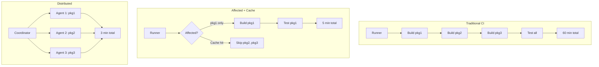

*[DAG]: Directed Acyclic Graph
*[PR]: Pull Request
*[NX]: Nrwl Extensions
*[TTL]: Time To Live
*[S3]: Simple Storage Service

At some point, every monorepo reaches a breaking point. The repository that started with 10 packages and a 5-minute CI pipeline has grown to 150 packages, and now every PR takes 45 minutes to validate. Developers start stacking PRs to avoid waiting, which leads to integration conflicts when those PRs finally land. The CI queue backs up. Engineers context-switch while waiting for feedback. The monorepo that was supposed to simplify collaboration has become a productivity drain.

The instinct is to throw hardware at the problem—faster runners, more parallelism, bigger machines. That helps, but it's treating the symptom. A 200-package monorepo that builds everything on every commit will always be slow, no matter how fast your runners are. The real solution is building less: figure out what actually changed, determine what depends on those changes, and skip everything else.

Two techniques make this possible. _Affected-based builds_ analyze the dependency graph to identify which packages need to rebuild when specific files change. _Remote caching_ stores build outputs so identical work never runs twice, regardless of which developer or CI runner needs it. Together, they transform CI from a bottleneck into a fast feedback loop.

The impact is dramatic. Cache hit rates reach 85%. Build times drop by an order of magnitude. But the improvement isn't just faster—it changes how developers work. They run CI before grabbing coffee, not before leaving for the day. They iterate in small increments instead of batching changes to minimize CI waits. The monorepo becomes an asset again.

<Callout type="warning">
The biggest monorepo CI mistake: trying to make full builds faster instead of building less. Parallelization and faster machines provide linear improvements. Affected builds with caching provide order-of-magnitude improvements.
</Callout>

## Understanding Dependency Graphs

Affected builds work by analyzing the dependency graph—the directed acyclic graph that captures which packages depend on which other packages. When a file changes, the build system maps that file to its package, then walks the graph to find everything that depends on that package, transitively. Understanding this graph is essential for reasoning about what will rebuild and why.

### Package Dependencies

A monorepo typically contains two categories of packages: applications (deployable artifacts) and libraries (shared code). The dependency relationships between them form a hierarchy. Applications sit at the top, depending on libraries. Libraries depend on other libraries, forming chains. At the bottom are leaf libraries with no internal dependencies.

Three types of dependencies matter for affected calculation. _Direct dependencies_ are explicit imports—if `app-web` imports from `@libs/ui-components`, that's a direct dependency. _Transitive dependencies_ flow through the graph—if `ui-components` depends on `design-tokens`, then `app-web` transitively depends on `design-tokens` too. _Dev dependencies_ are needed for development and testing but don't affect production builds.

The impact of a change depends on where it lands in the graph. Change a leaf library like `@libs/utils` that everything depends on, and the entire monorepo rebuilds. Change a library that only one application uses, and only that application rebuilds. This is why dependency graph design matters—poorly structured dependencies create "rebuild everything" scenarios even for small changes.

```yaml title="monorepo-structure.yaml"
apps:
  app-web:
    depends_on: ["@libs/ui-components", "@libs/api-client", "@libs/utils"]
  app-mobile:
    depends_on: ["@libs/ui-components", "@libs/api-client", "@libs/utils"]
  app-admin:
    depends_on: ["@libs/ui-components", "@libs/admin-api", "@libs/utils"]

libs:
  "@libs/ui-components":
    depends_on: ["@libs/design-tokens", "@libs/utils"]
  "@libs/api-client":
    depends_on: ["@libs/utils", "@libs/types"]
  "@libs/admin-api":
    depends_on: ["@libs/api-client", "@libs/types"]
  "@libs/design-tokens":
    depends_on: []
  "@libs/utils":
    depends_on: []
  "@libs/types":
    depends_on: []
```
Code: Monorepo dependency structure showing rebuild impact by change location.

### Calculating Affected Packages

The affected calculation algorithm is straightforward: map changed files to packages, then traverse the dependency graph to find all dependents. The key insight is that you need to _reverse_ the dependency graph—instead of asking "what does this package depend on," you ask "what depends on this package."

The algorithm works in three steps. First, map each changed file to its containing package by checking file paths against package boundaries. Second, build a reversed dependency graph (dependents instead of dependencies) and perform a breadth-first search from each changed package, collecting every package reachable through the "is depended on by" relationship. Third, everything not in the affected set is unaffected and can be skipped.

```typescript title="affected-calculation.ts"
interface AffectedResult {
  changed: string[];
  affected: string[];
  unaffected: string[];
}

function calculateAffected(
  changedFiles: string[],
  packages: Package[],
  dependencyGraph: Map<string, string[]>
): AffectedResult {
  const changedPackages = new Set<string>();
  for (const file of changedFiles) {
    const pkg = findPackageForFile(file, packages);
    if (pkg) changedPackages.add(pkg.name);
  }

  const affected = new Set<string>(changedPackages);
  const dependents = buildDependentsGraph(dependencyGraph);

  const queue = [...changedPackages];
  while (queue.length > 0) {
    const current = queue.shift()!;
    for (const dependent of dependents.get(current) || []) {
      if (!affected.has(dependent)) {
        affected.add(dependent);
        queue.push(dependent);
      }
    }
  }

  const allPackages = packages.map(p => p.name);
  return {
    changed: [...changedPackages],
    affected: [...affected],
    unaffected: allPackages.filter(p => !affected.has(p)),
  };
}
```
Code: Affected package calculation via reversed dependency graph traversal.

### Base Reference Selection

Affected calculation compares the current state against a _base reference_—a git commit that represents "what we already built." The choice of base reference dramatically affects what gets marked as affected.

For PR builds, the natural base is the target branch (usually `main`). This captures everything the PR changes relative to where it will merge. For pushes to main, the base is typically the previous commit or the last successful CI run. For release builds, you might compare against the last release tag to rebuild everything that changed since the previous release.

The base reference choice has practical implications. A PR that branched from main two weeks ago will have many more affected packages than one that branched yesterday, simply because main has moved. Long-lived feature branches accumulate affected packages. This is one reason teams prefer short-lived branches and frequent rebasing—it keeps the affected set small.

| Scenario | Base Reference | What Gets Rebuilt |
|----------|---------------|-------------------|
| PR to main | `origin/main` | All changes in the PR |
| Push to main | `HEAD~1` or last successful CI | Just the pushed commit(s) |
| Release build | Last release tag | Everything since previous release |
| Nightly build | Last successful CI | Minimal (only failures to retry) |

Table: Base reference strategies by CI scenario.

<Callout type="info">
Some teams enforce rebasing before merge to keep affected sets predictable. Others use "last successful CI on main" as the base reference, which naturally handles drift. The tradeoff is consistency versus simplicity—pick based on your team's workflow.
</Callout>

## Affected Build Implementation

Several build tools implement affected builds: Bazel pioneered the approach for polyglot monorepos, Pants offers similar capabilities with a Python-friendly design, and Gradle's build cache works well for JVM projects. In the JavaScript ecosystem, Nx and Turborepo dominate. Both implement affected builds, but they approach the problem differently. Nx uses explicit git-based comparison: it diffs against a base reference and walks the dependency graph to find affected packages. Turborepo uses content hashing: it hashes all inputs for each task and compares against cached hashes to determine what needs to run. The end result is similar, but the mechanisms have different tradeoffs.

### Nx Affected Commands

Nx provides an `affected` command that filters any target (build, test, lint) to run only on packages affected by changes since a base reference. The base defaults to `main` but can be any git ref.

```bash title="nx-affected-commands.sh"
# See what packages are affected
npx nx show projects --affected --base=main

# Build only affected packages
npx nx affected -t build --base=main

# Run multiple targets on affected packages
npx nx affected -t build,test,lint --base=main

# Parallel execution (adjust based on runner resources)
npx nx affected -t build --parallel=5 --base=main
```
Code: Nx affected CLI commands.

The power of Nx's approach is in its configuration. The `nx.json` file defines _inputs_ for each target—which files, when changed, should trigger a rebuild. By defining a "production" input set that excludes test files, you prevent test changes from triggering production builds.

```json title="nx.json"
{
  "targetDefaults": {
    "build": {
      "dependsOn": ["^build"],
      "inputs": ["production", "^production"],
      "outputs": ["{projectRoot}/dist"]
    },
    "test": {
      "dependsOn": ["build"],
      "inputs": ["default", "^production", "{workspaceRoot}/jest.preset.js"]
    },
    "lint": {
      "inputs": ["default", "{workspaceRoot}/.eslintrc.json"]
    }
  },
  "namedInputs": {
    "default": ["{projectRoot}/**/*", "sharedGlobals"],
    "production": [
      "default",
      "!{projectRoot}/**/*.spec.ts",
      "!{projectRoot}/**/*.test.ts",
      "!{projectRoot}/test-setup.ts",
      "!{projectRoot}/**/*.stories.tsx",
      "!{projectRoot}/tsconfig.spec.json",
      "!{projectRoot}/jest.config.ts"
    ],
    "sharedGlobals": [
      "{workspaceRoot}/tsconfig.base.json",
      "{workspaceRoot}/babel.config.json",
      "{workspaceRoot}/package.json"
    ]
  },
  "affected": {
    "defaultBase": "main"
  }
}
```
Code: Nx configuration with named inputs for precise cache invalidation.

The `dependsOn: ["^build"]` syntax means "build this package's dependencies first." The caret (`^`) indicates upstream dependencies. This ensures the dependency graph is respected during parallel execution.

The "production" named input excludes test files, stories, and test configuration—so changing a test doesn't invalidate the build cache. Tests use the "default" set, which includes everything. The `^production` syntax means "use production inputs for dependencies too," so a dependency's test changes don't invalidate your build either. We'll reference this configuration again when discussing cache optimization.

### Turborepo Affected Builds

Turborepo takes a different approach. Instead of explicit git diffing, it hashes the inputs for each task and compares against its cache. If the hash matches, the task is skipped. This means Turborepo doesn't have a separate "affected" command—every `turbo run` is implicitly affected-aware through caching.

```json title="turbo.json"
{
  "$schema": "https://turbo.build/schema.json",
  "pipeline": {
    "build": {
      "dependsOn": ["^build"],
      "outputs": ["dist/**", ".next/**", "build/**"],
      "inputs": ["src/**", "package.json", "tsconfig.json"]
    },
    "test": {
      "dependsOn": ["build"],
      "outputs": ["coverage/**"],
      "inputs": ["src/**", "test/**", "jest.config.*"]
    },
    "lint": {
      "outputs": [],
      "inputs": ["src/**", ".eslintrc.*", "tsconfig.json"]
    }
  },
  "globalDependencies": ["tsconfig.base.json", "package-lock.json"]
}
```
Code: Turborepo pipeline configuration.

For git-based filtering (useful in CI), Turborepo supports filter syntax that selects packages changed between git refs:

```bash title="turborepo-filtering.sh"
# Build packages changed between main and HEAD
npx turbo run build --filter='[origin/main...HEAD]'

# Build a specific package and all its dependencies
npx turbo run build --filter=app-web...

# Dry run to see what would execute
npx turbo run build --dry-run
```
Code: Turborepo git-based filtering.

<Callout type="success">
Both tools achieve the same goal—build only what changed—but Nx's explicit affected calculation is more predictable for debugging, while Turborepo's hash-based approach is simpler to configure. Choose based on your team's preferences and existing tooling.
</Callout>

## Remote Caching

Affected builds reduce what needs to run, but remote caching eliminates redundant work entirely. The idea is simple: if someone already built a package with identical inputs, download their output instead of rebuilding. This works across developers, CI runners, and even different branches—anyone who's built the same code contributes to and benefits from the shared cache.

### How Remote Caching Works

A build cache works by hashing all inputs to a task—source files, configuration, dependency outputs, environment variables, runtime versions—into a single cache key. Before executing a task, the build system checks whether outputs for that cache key exist. If they do (a cache hit), it downloads the outputs and skips execution. If not (a cache miss), it runs the task and uploads the outputs for future use.

The cache key composition matters. It must include everything that affects the output:

- Task name and package name
- Hash of all input files
- Hash of dependency outputs (transitive)
- Relevant environment variables
- Runtime versions (Node, Ruby, Python, JDK, .NET SDK)
- Command arguments

Miss any of these, and you risk cache poisoning—returning outputs that don't match what a fresh build would produce. Include too much, and you get unnecessary cache misses.

The flow looks like this: Developer A builds `app-web`, generating a cache key like `build:app-web:a1b2c3d4`. No cache exists, so the build runs and outputs are uploaded. Developer B, working on the same code, runs the same build. The cache key matches, so they download Developer A's outputs in seconds instead of waiting minutes. When CI runs for a PR touching unrelated code, it hits the cache for `app-web` too—the inputs haven't changed.

### Nx Cloud Configuration

Nx Cloud is the managed remote cache for Nx. Setup is straightforward: run `npx nx connect-to-nx-cloud`, which adds an access token to your `nx.json`. From then on, all cacheable tasks automatically use the remote cache.

```json title="nx.json"
{
  "nxCloudAccessToken": "your-access-token-here",
  "tasksRunnerOptions": {
    "default": {
      "runner": "nx-cloud",
      "options": {
        "cacheableOperations": ["build", "test", "lint", "e2e"],
        "parallel": 3
      }
    }
  }
}
```
Code: Nx Cloud configuration in nx.json.

For CI, pass the token via environment variable to avoid committing secrets:

```yaml title=".github/workflows/ci.yml"
jobs:
  build:
    runs-on: ubuntu-latest
    steps:
      - uses: actions/checkout@v4
        with:
          fetch-depth: 0

      - uses: actions/setup-node@v4
        with:
          node-version: '20'
          cache: 'npm'

      - run: npm ci

      - name: Run affected builds
        run: npx nx affected -t build,test,lint --base=origin/main
        env:
          NX_CLOUD_ACCESS_TOKEN: ${{ secrets.NX_CLOUD_TOKEN }}
```
Code: GitHub Actions workflow with Nx Cloud.

For organizations that can't use external services, Nx Cloud offers self-hosted deployment via Docker or Kubernetes, with storage backends including S3, Azure Blob, and GCS. This keeps build artifacts within your infrastructure while maintaining the same developer experience.

### Turborepo Remote Caching

Turborepo integrates with Vercel's remote cache by default. After authenticating with `npx turbo login` and linking your repository with `npx turbo link`, remote caching works automatically.

```json title="turbo.json"
{
  "remoteCache": {
    "signature": true
  }
}
```
Code: Turborepo remote cache with signature verification.

The `signature: true` option is important—it cryptographically signs cache artifacts to prevent tampering. Without this, anyone with cache access could inject malicious build outputs.

For CI, set the token and team as environment variables:

```yaml title=".github/workflows/ci.yml"
env:
  TURBO_TOKEN: ${{ secrets.TURBO_TOKEN }}
  TURBO_TEAM: your-team-name
```
Code: Turborepo CI environment variables.

For self-hosted caching, the `ducktors/turborepo-remote-cache` Docker image provides a compatible server that can use S3 or other storage backends:

```yaml title="docker-compose.yml"
services:
  turbo-cache:
    image: ducktors/turborepo-remote-cache:latest
    ports:
      - "3000:3000"
    environment:
      - STORAGE_PROVIDER=s3
      - S3_ACCESS_KEY=${AWS_ACCESS_KEY}
      - S3_SECRET_KEY=${AWS_SECRET_KEY}
      - S3_BUCKET=turbo-cache
      - S3_REGION=us-east-1
```
Code: Self-hosted Turborepo cache with S3 backend.

Point Turborepo at your self-hosted cache via `.turbo/config.json`:

```json title=".turbo/config.json"
{
  "teamId": "team_self_hosted",
  "apiUrl": "https://cache.your-domain.com"
}
```
Code: Turborepo self-hosted cache configuration.

The choice between managed and self-hosted caching comes down to operational overhead versus control. Managed services (Nx Cloud, Vercel) handle infrastructure, scaling, and availability—you just configure a token. Self-hosted options require maintaining servers and storage, but keep all build artifacts within your infrastructure and avoid per-seat pricing at scale.

| Provider | Setup Complexity | Cost | Self-Hosted Option |
|----------|------------------|------|-------------------|
| Nx Cloud | Low | Free tier, paid for teams | Yes (enterprise) |
| Vercel (Turbo) | Low | Free tier, paid for teams | No |
| Self-hosted Turbo | Medium | Infrastructure only | Yes |
| Custom S3 | High | S3 costs only | Yes |

Table: Remote caching provider comparison.

<Callout type="warning">
Remote cache without authentication is a security risk. Anyone with cache access could inject malicious outputs that get downloaded and executed by other developers or CI. Always use signed caches (Turbo's signature option) or authenticated endpoints with proper access controls.
</Callout>

## CI Pipeline Optimization

Affected builds and remote caching are the foundation, but how you structure your CI pipeline determines whether you get the full benefit. A naive pipeline that runs build, test, and lint sequentially—even with affected filtering—leaves performance on the table. The goal is to maximize parallelism while minimizing redundant setup.

### GitHub Actions Configuration

The key insight for GitHub Actions is that build, test, and lint can often run in parallel. They all depend on affected calculation, but they don't depend on each other (assuming tests don't require built artifacts—if they do, adjust accordingly). Split them into separate jobs that run concurrently.

A common pattern is a first job that calculates affected packages and exports the list as an output. Subsequent jobs conditionally run based on whether there are any affected packages. This avoids spinning up runners when nothing changed—useful for documentation-only PRs or changes to ignored files.

The pattern has three parts. First, an "affected" job calculates whether any packages changed and exports this as an output. Second, parallel jobs for build, test, and lint each depend on the affected job and only run if `has_changes` is true. Third, each job uses `fetch-depth: 0` to get full git history—without this, affected calculation fails because it can't compare against the base branch.

```yaml title=".github/workflows/ci.yml"
jobs:
  affected:
    runs-on: ubuntu-latest
    outputs:
      has_changes: ${{ steps.affected.outputs.has_changes }}
    steps:
      - uses: actions/checkout@v4
        with:
          fetch-depth: 0  # Required for git comparison
      - uses: actions/setup-node@v4
        with:
          node-version: '20'
          cache: 'npm'
      - run: npm ci
      - name: Check affected
        id: affected
        run: |
          BASE=$([[ "${{ github.event_name }}" == "pull_request" ]] && echo "origin/${{ github.base_ref }}" || echo "HEAD~1")
          AFFECTED=$(npx nx show projects --affected --base=$BASE --json)
          echo "has_changes=$([[ "$AFFECTED" == "[]" ]] && echo "false" || echo "true")" >> $GITHUB_OUTPUT

  build:
    needs: affected
    if: needs.affected.outputs.has_changes == 'true'
    runs-on: ubuntu-latest
    steps:
      # checkout, setup-node, npm ci (same as above)
      - run: npx nx affected -t build --parallel=3

  test:
    needs: affected
    if: needs.affected.outputs.has_changes == 'true'
    # ... same pattern, runs: npx nx affected -t test --parallel=3

  lint:
    needs: affected
    if: needs.affected.outputs.has_changes == 'true'
    # ... same pattern, runs: npx nx affected -t lint --parallel=5
```
Code: GitHub Actions workflow pattern with parallel jobs.

The build, test, and lint jobs run concurrently—they don't depend on each other, only on the affected check. If your tests require built artifacts, add `needs: [affected, build]` to the test job.

### Distributed Task Execution

For large monorepos, even parallel jobs on a single runner hit limits. Distributed task execution spreads work across multiple agents, with a coordinator that assigns tasks based on the dependency graph.

Nx Cloud provides this out of the box. You specify how many agents to spin up, and Nx Cloud handles task assignment, ensuring dependencies build before dependents while maximizing parallelism:

```yaml title=".github/workflows/ci-distributed.yml"
name: CI (Distributed)
on:
  push:
    branches: [main]
  pull_request:

jobs:
  main:
    runs-on: ubuntu-latest
    steps:
      - uses: actions/checkout@v4
        with:
          fetch-depth: 0

      - uses: actions/setup-node@v4
        with:
          node-version: '20'
          cache: 'npm'

      - run: npm ci

      - name: Start distributed execution
        run: npx nx-cloud start-ci-run --distribute-on="3 linux-medium-js"

      - name: Run all targets
        run: npx nx affected -t build,test,lint,e2e --parallel=10

      - name: Cleanup
        if: always()
        run: npx nx-cloud stop-all-agents
```
Code: Nx Cloud distributed task execution.

Without Nx Cloud, you can achieve similar distribution using GitHub Actions matrix builds. Calculate affected packages in a preparation job, chunk them, and run each chunk on a separate runner:

```yaml title=".github/workflows/ci-matrix.yml"
jobs:
  prepare:
    runs-on: ubuntu-latest
    outputs:
      matrix: ${{ steps.set-matrix.outputs.matrix }}
    steps:
      - uses: actions/checkout@v4
        with:
          fetch-depth: 0
      - run: npm ci
      - name: Calculate matrix
        id: set-matrix
        run: |
          AFFECTED=$(npx nx show projects --affected --base=origin/main --json)
          MATRIX=$(echo $AFFECTED | jq -c '{include: [. | _nwise(10) | {projects: .}]}')
          echo "matrix=$MATRIX" >> $GITHUB_OUTPUT

  build:
    needs: prepare
    runs-on: ubuntu-latest
    strategy:
      matrix: ${{ fromJson(needs.prepare.outputs.matrix) }}
    steps:
      - uses: actions/checkout@v4
      - uses: actions/setup-node@v4
        with:
          node-version: '20'
      - run: npm ci
      - name: Build chunk
        run: |
          for project in ${{ join(matrix.projects, ' ') }}; do
            npx nx build $project
          done
```
Code: Manual distribution using GitHub Actions matrix strategy.

The optimization levels stack. First, skip unaffected packages entirely. Second, use remote caching to skip packages that are affected but haven't actually changed (cache hit). Third, parallelize the remaining work within each runner. Fourth, distribute across multiple runners. Each level compounds the previous one's gains.


Figure: CI optimization progression from sequential to distributed execution.

<Callout type="success">
The optimization stack: 1) Skip unaffected packages. 2) Cache affected but unchanged. 3) Parallelize what remains. 4) Distribute across agents. Each level provides significant speedup; together they're transformative.
</Callout>

## Cache Management

Remote caching is only useful if the cache actually gets hit. A cache that misses constantly provides no benefit—you're paying for storage and network transfer without saving any build time. Understanding what causes cache misses and how to prevent them is essential for getting value from your caching investment.

### Cache Invalidation Strategies

Cache invalidation happens automatically when inputs change—that's the whole point. But understanding the different invalidation triggers helps you configure inputs correctly and debug unexpected misses.

_Input hash changes_ are the primary invalidation mechanism. When any file included in a target's inputs changes, the hash changes, and the cache misses. This is usually what you want: source code changed, so rebuild. The configuration challenge is ensuring only _relevant_ files are included in inputs.

_Dependency updates_ cascade through the graph. When you update a package in `package.json` or change the lock file, packages that depend on that change need to rebuild. Both Nx and Turborepo handle this automatically through their global dependencies configuration.

_Manual invalidation_ is occasionally necessary when something outside the tracked inputs changes—a CI environment update, a bug in the caching system, or when you need to verify that builds still work without caching. In Nx, `npx nx reset` clears the local cache. Adding `--skip-nx-cache` bypasses caching for a single run. In Turborepo, `--force` achieves the same.

_Time-based expiration_ (TTL) prevents caches from growing unboundedly and ensures stale artifacts eventually get cleaned up. Most remote cache providers let you configure retention periods—7 to 30 days is typical for active projects.

```bash title="cache-debugging.sh"
# Nx: See what inputs affect a target
npx nx show project my-app --json | jq '.targets.build.inputs'

# Nx: See the computed hash for debugging
npx nx build my-app --verbose 2>&1 | grep "Hash"

# Nx: Bypass cache to verify build works
npx nx build my-app --skip-nx-cache

# Nx: Clear local cache entirely
npx nx reset

# Turborepo: Force rebuild, ignoring cache
npx turbo run build --force
```
Code: Cache debugging and manual invalidation commands.

### Optimizing Cache Hit Rates

Low cache hit rates usually trace back to a few common issues. Fixing them can take a 40% hit rate to 85% or higher.

_Environment inconsistency_ is the most common culprit. If your CI runners use Node 20.10 and developers use Node 20.11, the hashes won't match. Pin exact versions everywhere: `.nvmrc` or `.node-version` for Node, `Gemfile.lock` with `.ruby-version` for Ruby, `packages.lock.json` for NuGet, `composer.lock` for PHP, `requirements.txt` with pinned versions (or `pip-tools`) for Python. Ensure CI reads these version files, and consider Docker images with fixed runtimes for complete consistency.

_Non-deterministic outputs_ poison the cache silently. If your build includes a timestamp, a random identifier, or output that varies based on execution order, the outputs will differ even with identical inputs. Look for build timestamps in generated files, unsorted imports or exports, and random IDs in bundles. The `SOURCE_DATE_EPOCH` environment variable helps with timestamp-based non-determinism.

_Overly broad input specifications_ cause unnecessary invalidation. If your build target includes `{projectRoot}/**/*` as inputs, then changing a test file invalidates the production build cache—even though tests don't affect the build output. Use named input sets (like Nx's "production" pattern) that exclude test files, documentation, and other non-production artifacts.

_Global dependencies included incorrectly_ cause cascading invalidation. If you list `package-lock.json` in every target's inputs, then every dependency update invalidates every cache. Be selective: only include lock files in inputs for targets that actually care about dependency versions (usually everything, but some lint tasks might not).

This is where the named inputs configuration from earlier pays off. The "production" input set we defined in `nx.json` excludes test files, stories, and test configuration. When your build target uses `"inputs": ["production", "^production"]`, changing a test file doesn't invalidate the build cache. The `^production` syntax extends this to dependencies—a dependency's test changes don't invalidate your build either.

| Issue | Symptom | Solution |
|-------|---------|----------|
| Node version mismatch | 0% cache hits in CI | Pin exact version with .nvmrc |
| Test files in build inputs | Cache miss on test changes | Use "production" named input |
| Timestamps in output | Cache never hits twice | Set SOURCE_DATE_EPOCH |
| Lock file in all inputs | Every dep update invalidates all | Be selective about global inputs |

Table: Common cache issues and solutions.

<Callout type="info">
The key to high cache hit rates is determinism. Same inputs must produce same outputs. Same environment must produce same hashes. Audit your builds for anything time-dependent, random, or environment-specific.
</Callout>

## Measuring and Monitoring

You can't improve what you don't measure. CI optimization is iterative—implement a change, measure the impact, identify the next bottleneck, repeat. Without metrics, you're guessing whether that configuration change helped or hurt. With metrics, you catch regressions early and make data-driven decisions about where to invest optimization effort.

### CI Metrics Dashboard

The key metrics for monorepo CI fall into three categories: _timing_ (how long builds take), _affected scope_ (how much of the repo rebuilds), and _cache efficiency_ (how much work caching eliminates).

For timing, track total duration, queue time (waiting for a runner), and execution time (actual work). The distinction matters: high queue time means you need more runners; high execution time means you need faster builds or better caching.

For affected scope, track total packages, affected packages, and affected percentage. A sudden spike in affected percentage often means someone touched a widely-shared library—expected behavior, but worth noting. A gradual increase over time might indicate growing coupling in your dependency graph.

For cache efficiency, track cache hits, cache misses, hit rate, and time saved. Hit rate is the headline metric: 85%+ is excellent, 70%+ is good, below 50% means something's wrong. Time saved quantifies the value in concrete terms—"caching saved 47 hours of build time this week" makes the ROI obvious.

```typescript title="ci-metrics.ts"
interface CIMetrics {
  runId: string;
  timestamp: Date;
  branch: string;
  trigger: 'push' | 'pull_request' | 'scheduled';

  // Timing
  totalDuration: number;
  queueTime: number;
  executionTime: number;

  // Affected scope
  totalPackages: number;
  affectedPackages: number;
  affectedPercentage: number;

  // Cache efficiency
  cacheHits: number;
  cacheMisses: number;
  cacheHitRate: number;
  timeSavedByCache: number;
}

function generateWeeklyReport(metrics: CIMetrics[]): Report {
  const last7Days = metrics.filter(m => isWithinDays(m.timestamp, 7));
  const previous7Days = metrics.filter(
    m => isWithinDays(m.timestamp, 14) && !isWithinDays(m.timestamp, 7)
  );

  const avgDuration = average(last7Days.map(m => m.totalDuration));
  const avgCacheHitRate = average(last7Days.map(m => m.cacheHitRate));
  const totalTimeSaved = sum(last7Days.map(m => m.timeSavedByCache));

  // Week-over-week trend
  const durationTrend =
    ((avgDuration - average(previous7Days.map(m => m.totalDuration))) /
      average(previous7Days.map(m => m.totalDuration))) *
    100;

  return {
    avgDuration: formatDuration(avgDuration),
    avgCacheHitRate: `${avgCacheHitRate.toFixed(1)}%`,
    totalTimeSaved: formatDuration(totalTimeSaved),
    durationTrend: `${durationTrend > 0 ? '+' : ''}${durationTrend.toFixed(1)}%`,
  };
}
```
Code: CI metrics interface and weekly report generation.

Both Nx Cloud and Vercel provide dashboards with these metrics out of the box. If you're self-hosting or want unified monitoring, export metrics to Prometheus/Grafana or your observability platform of choice.

### Performance Baselines

Establish baselines for different build scenarios. PR builds have different expectations than main branch builds or release builds.

For _PR builds_, target under 10 minutes with a 70%+ cache hit rate. Affected percentage should typically be under 20%—most PRs touch a small portion of the codebase. If you're consistently seeing 50%+ affected, either your PRs are too large or your dependency structure creates excessive coupling.

For _main branch builds_, target under 5 minutes with an 85%+ cache hit rate. Main branch builds typically include just one commit's changes, so affected percentage should be minimal. High cache hit rates are expected because the PR already primed the cache.

For _release builds_, targets depend on your release strategy. If you're rebuilding from a tag that's far behind main, expect lower cache hit rates and longer durations. For frequent releases close to main, you should still see good caching.

| Scenario | Target Duration | Target Cache Hit Rate | Typical Affected % |
|----------|-----------------|----------------------|-------------------|
| PR builds | &lt; 10 minutes | &gt; 70% | &lt; 20% |
| Main branch | &lt; 5 minutes | &gt; 85% | &lt; 10% |
| Release builds | &lt; 30 minutes | &gt; 50% | Varies |

Table: Performance baseline targets by scenario.

Set up alerts for when builds deviate significantly from baselines. A sudden drop in cache hit rate might indicate environment drift between CI and local development, a newly added non-deterministic output, or misconfigured inputs. A spike in build duration might mean someone touched a core library, or caching stopped working. Either way, catch it early before it becomes the new normal.

<Callout type="success">
Track CI metrics over time. A sudden drop in cache hit rate or spike in duration indicates something changed—new global dependency, environment drift, or misconfigured inputs. Catch these early before they become the new normal.
</Callout>

## Conclusion

Monorepo CI optimization isn't a single technique—it's a stack of complementary approaches that compound. Affected builds analyze the dependency graph to skip packages that couldn't possibly be impacted by a change. Remote caching eliminates redundant work by sharing build outputs across developers and CI runners. Parallel execution runs remaining tasks concurrently. Distributed execution spreads work across multiple agents.

Each level provides meaningful speedup on its own. Together, they transform CI from a 45-minute bottleneck into a 4-minute feedback loop. The exact numbers depend on your repository structure and change patterns, but order-of-magnitude improvements are typical.

The implementation path is straightforward. Start with affected builds—configure Nx or Turborepo to calculate what changed and skip the rest. Add remote caching to share results across your team. Tune your input specifications to maximize cache hit rates. Then, if CI is still slower than you'd like, introduce parallelization and distribution.

Monitor your metrics. Track cache hit rates, build durations, and affected percentages over time. When something changes—a new global dependency, environment drift, misconfigured inputs—you'll see it in the data before developers start complaining about slow CI.

The best time to implement these optimizations is before your CI becomes a bottleneck. The second best time is now. Start with affected builds, add caching, and iterate from there. Your future self—and your team—will thank you.

<Callout type="info">
The goal isn't the fastest possible full build—it's the fastest possible feedback for typical changes. Optimize for the common case (small, focused changes) while ensuring full builds remain tractable for major changes.
</Callout>
