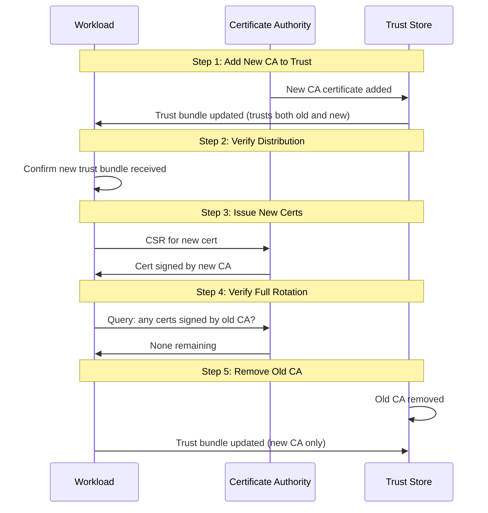

*[mTLS]: Mutual Transport Layer Security
*[TLS]: Transport Layer Security
*[CA]: Certificate Authority
*[TTL]: Time To Live
*[SAN]: Subject Alternative Name
*[CSR]: Certificate Signing Request

A team enables Istio mTLS across their 50-service mesh. Initial rollout goes smoothly. Everyone celebrates the "zero-trust network." Three months later, at 2:47 AM, all inter-service communication fails simultaneously. The intermediate CA certificate expired. No one knew it had a 90-day TTL—it was the default, and nobody thought to check.

Recovery takes four hours because the on-call engineer has never manually rotated Istio certificates and the runbook doesn't exist yet.

If this sounds familiar, you're not alone. Enabling mTLS is a configuration change; operating it reliably is an ongoing commitment to understanding certificate lifecycles, building automation for rotation, and monitoring for expiration failures.

## The Operational Reality of mTLS

Standard TLS—what you use when visiting any HTTPS website—is a one-way trust relationship. The server proves its identity to the client by presenting a certificate. The client validates that certificate against its trust store. The server has no idea who the client is at the transport layer.

Mutual TLS adds a second handshake step: after the client validates the server's certificate, the server requests and validates a certificate from the client. Both parties cryptographically prove their identity before any application data flows.

The operational cost difference is significant. With standard TLS, you manage certificates for servers—maybe dozens or hundreds. With mTLS, _every_ service needs a certificate, and every service needs to validate certificates from every other service it communicates with. In a 100-service mesh, that's potentially thousands of certificate validation paths to maintain.

| Aspect | Standard TLS | Mutual TLS |
|--------|--------------|------------|
| Trust direction | Client trusts server | Bidirectional |
| Certificates needed | Servers only | Every service |
| Identity verification | Server only | Both parties |
| Operational complexity | Low | High |

Table: Comparison of standard TLS and mutual TLS operational requirements

<Callout type="warning">
The mTLS system has multiple certificate layers (workload, issuing CA, intermediate CA, root CA), each with different TTLs. An outage can originate at any layer. Most teams monitor workload certificates but forget about the CAs that sign them.
</Callout>

## Certificate Lifecycle—Where Teams Fail

Certificate rotation is where mTLS complexity becomes real. The challenge: replace a certificate that's actively being used for authentication without breaking any connections.

### Workload vs. CA Rotation

For _workload certificate rotation_, the strategy is straightforward—overlapping validity. Issue the new certificate before the old one expires. Both are valid during the overlap window, so it doesn't matter which one a service presents. The old certificate eventually expires, and the new one takes over. Service meshes do this automatically.

_CA rotation_ is harder. When you rotate an intermediate or root CA, you're changing the trust anchor that validates certificates. If you issue certificates from a new CA before services trust that CA, mTLS fails immediately.

The safe order for CA rotation:

1. Add the new CA to all trust bundles (services now trust both old and new)
2. Verify all services have received the updated trust bundle
3. Start issuing certificates from the new CA
4. Wait for all workload certificates to rotate to the new CA
5. Remove the old CA from trust bundles

This sequence diagram shows the rotation flow:



Figure: CA rotation sequence showing the safe order of operations

<Callout type="danger">
The cardinal rule of CA rotation: add the new CA to trust stores BEFORE issuing certificates with it. Violating this order causes immediate mTLS failures—services with the old trust bundle will reject certificates signed by the new CA as "unknown authority."
</Callout>

### Expiration Monitoring

Automated rotation should handle expiration seamlessly. But "should" isn't "will." Rotation can fail silently—a misconfigured issuer, a network partition, a crashed controller. You need monitoring to catch these failures before they become outages.

For Istio workloads, the `istio_agent_cert_expiry_seconds` metric exposes time until certificate expiration. For cert-manager, `certmanager_certificate_expiration_timestamp_seconds` provides the expiration timestamp.

```yaml title="prometheus-cert-alerts.yaml"
# Prometheus alerting rules for certificate expiration
groups:
  - name: certificate-expiration
    rules:
      - alert: CertificateExpiringSoon
        expr: |
          (certmanager_certificate_expiration_timestamp_seconds - time()) < 86400
        for: 10m
        labels:
          severity: warning
        annotations:
          summary: "Certificate {{ $labels.name }} expiring in < 24 hours"

      - alert: IstioCertRotationStalled
        expr: |
          istio_agent_cert_expiry_seconds < 3600
        for: 5m
        labels:
          severity: critical
        annotations:
          summary: "Workload certificate not rotating - expires in < 1 hour"
```

Different certificate levels need different alert thresholds:

| Certificate Type | Typical TTL | Warning | Critical |
|------------------|-------------|---------|----------|
| Workload | 24 hours | 4 hours | 1 hour |
| Issuing CA | 1 year | 30 days | 7 days |
| Intermediate CA | 5 years | 6 months | 30 days |
| Root CA | 20 years | 2 years | 6 months |

Table: Alert thresholds by certificate type

The CA that expires is rarely the one you're watching. Set alerts at every level of the hierarchy.

## Debugging When Things Go Wrong

mTLS failures produce cryptic errors. The TLS handshake fails, and you get a generic "connection reset" or "certificate verify failed" with minimal context. Knowing the common failure modes helps narrow down the problem quickly.

### Common Failure Modes

**Certificate expired**: The most common cause of mTLS outages. Error messages include `x509: certificate has expired`. Check expiration with `openssl x509 -enddate -noout -in cert.pem`. Fix by forcing rotation or restarting the workload to trigger certificate renewal.

**Trust chain broken**: The certificate is valid but the CA that signed it isn't in the trust store. You'll see `x509: certificate signed by unknown authority`. This happens during CA rotation if trust bundles aren't updated before new certificates are issued.

**SAN mismatch**: The certificate is valid but doesn't include the hostname being used. Error: `x509: certificate is valid for X, not Y`. This commonly happens when DNS names change or when certificates are issued with incomplete SAN lists.

**Wrong key usage**: The certificate exists but wasn't issued for mTLS. If it only has `serverAuth` in Extended Key Usage, it can't be used as a client certificate. Reissue with both `serverAuth` and `clientAuth`.

I once spent two hours debugging a "connection reset by peer" that turned out to be a certificate with `serverAuth` only—no `clientAuth`. The error message mentioned nothing about key usage. The fix was a one-line change to the certificate spec, but finding it required systematically ruling out every other possibility.

| Symptom | Likely Cause | First Check |
|---------|--------------|-------------|
| Connection refused | Service not listening | `netstat -tlnp` |
| Connection reset | TLS version mismatch or expired cert | `openssl x509 -enddate` |
| "Unknown authority" | Trust bundle missing CA | `openssl verify -CAfile` |
| "Valid for X, not Y" | SAN mismatch | Check certificate SANs |
| Intermittent failures | Rotation in progress | Check rotation timing |

Table: Common mTLS failure symptoms and diagnostic starting points

### The Diagnostic Toolkit

When mTLS fails in an Istio environment, these commands help narrow down the problem. First, identify the affected pod—check your alerting system or look for pods with restart loops using `kubectl get pods | grep -E '(Error|CrashLoop)'`.

```bash title="mtls-diagnostics.sh"
#!/bin/bash
POD="your-pod-name"

# Check certificate expiry
kubectl exec -it $POD -c istio-proxy -- \
  cat /etc/certs/cert-chain.pem | \
  openssl x509 -noout -enddate

# Verify certificate chain
kubectl exec -it $POD -c istio-proxy -- \
  openssl verify -CAfile /etc/certs/root-cert.pem \
  /etc/certs/cert-chain.pem

# Check SANs in the certificate
kubectl exec -it $POD -c istio-proxy -- \
  cat /etc/certs/cert-chain.pem | \
  openssl x509 -noout -text | grep -A1 "Subject Alternative"

# Check Envoy's TLS stats for errors
kubectl exec -it $POD -c istio-proxy -- \
  curl -s localhost:15000/stats | grep -E 'ssl.*(fail|error)'
```

Start with expiry (most common), then chain validation, then SANs, then key usage. Most issues fall into one of these categories.

## Making Rotation Invisible

The goal is automation so complete that certificate rotation becomes invisible—happening continuously in the background without human intervention or service disruption.

Certificate TTLs are a tradeoff. Short-lived certificates (24 hours) limit the damage from a compromised certificate but require robust automation. Longer certificates (7 days) are more forgiving of automation failures but increase your exposure window.

Start with permissive mode, add monitoring before enforcement, and run a rotation drill before you need it for real. Your first rotation drill should happen within 30 days of enabling mTLS—before you've forgotten the deployment details and before the first real expiration hits. When your certificates rotate and nobody notices, you've built a mature mTLS operation.

---

**Go Deeper: The Complete mTLS Operations Guide**

This article covers the operational essentials—certificate lifecycle, monitoring, and debugging. The full guide includes trust hierarchy design (two-tier vs. three-tier vs. federated), the SPIFFE identity framework, complete Istio configuration with PeerAuthentication and AuthorizationPolicy, and step-by-step operational runbooks for both routine rotation and emergency recovery. Download the PDF to get the complete reference.
