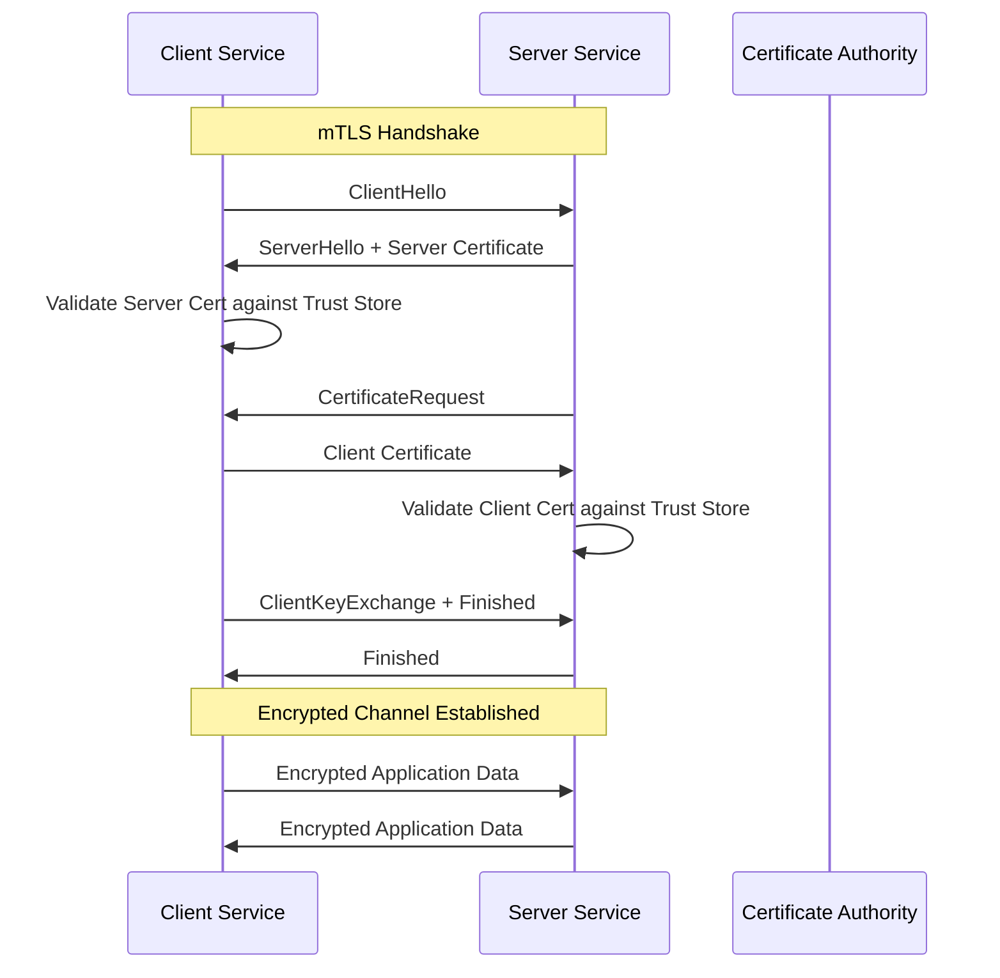
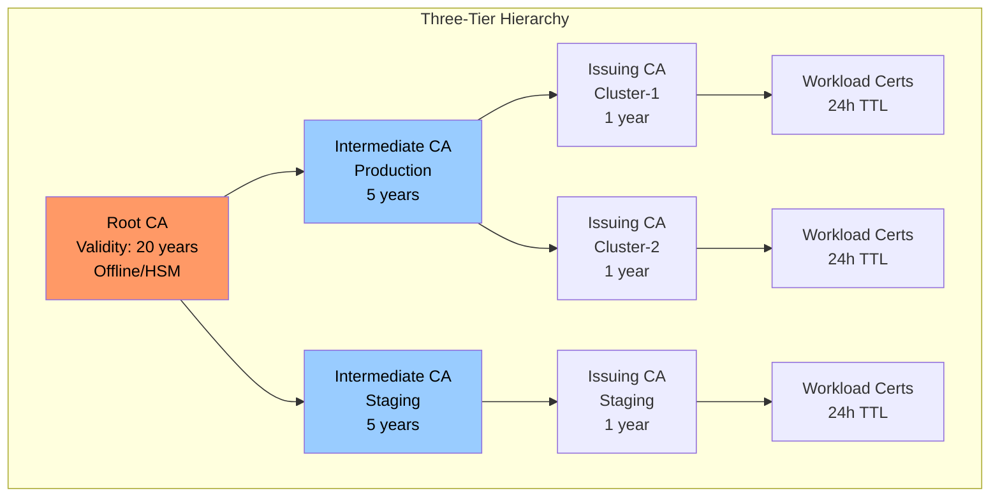
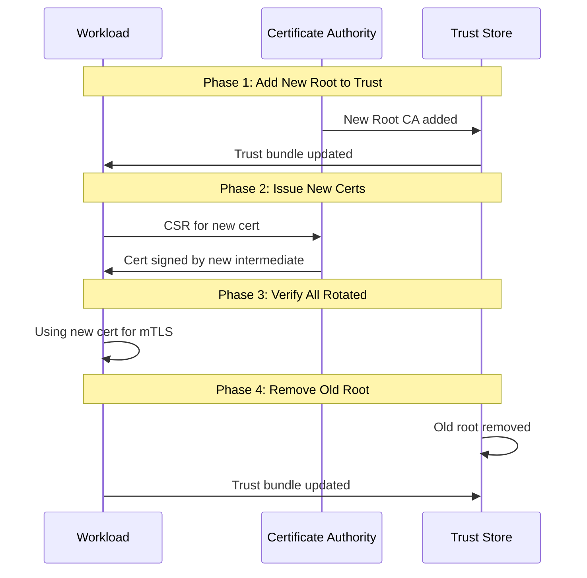
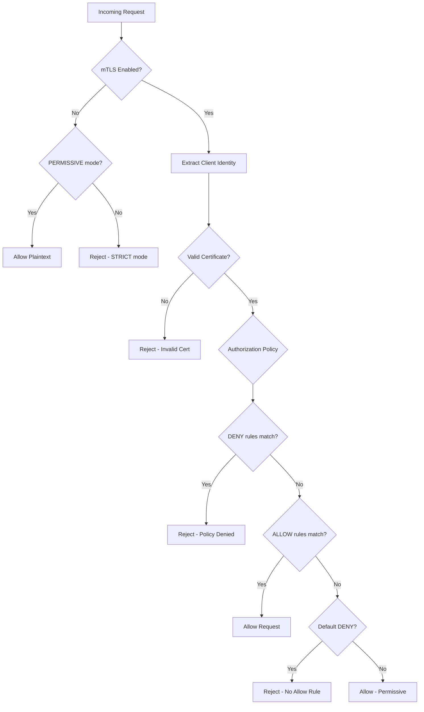

*[mTLS]: Mutual Transport Layer Security
*[TLS]: Transport Layer Security
*[CA]: Certificate Authority
*[PKI]: Public Key Infrastructure
*[SPIFFE]: Secure Production Identity Framework for Everyone
*[SVID]: SPIFFE Verifiable Identity Document
*[CSR]: Certificate Signing Request
*[CRL]: Certificate Revocation List
*[OCSP]: Online Certificate Status Protocol
*[SAN]: Subject Alternative Name
*[CN]: Common Name
*[TTL]: Time To Live

# mTLS for Service-to-Service Communication

## Introduction

Frame the mTLS challenge: enabling mutual TLS between services is a single configuration flag in most service meshes. Operating it reliably—managing certificate lifecycles, handling rotation without downtime, debugging handshake failures, and maintaining trust hierarchies—is where teams struggle. A certificate expiring at 3 AM takes down production. A trust anchor rotation breaks half the cluster. A handshake failure produces cryptic errors that require packet captures to diagnose. This section establishes that mTLS operational complexity scales with the number of services, and that automation isn't optional—it's the only way to maintain sanity at scale.

_Include a scenario: a team enables Istio mTLS across their 50-service mesh. Initial rollout goes smoothly. Three months later, the intermediate CA certificate expires. No one knew it had a 90-day expiration. At 2:47 AM, all inter-service communication fails simultaneously. Recovery takes 4 hours because the on-call engineer has never manually rotated Istio certificates. Post-incident, they implement automated rotation with 30-day certificates, monitoring for expiration, and quarterly rotation drills. The lesson: mTLS without lifecycle automation is a time bomb._

<Callout type="warning">
The most dangerous mTLS deployment is one that "just works" on day one. Without understanding the certificate lifecycle, you're building on a foundation that will crumble when the first certificate expires.
</Callout>

## TLS and mTLS Fundamentals

### One-Way vs. Mutual TLS

```yaml title="tls-comparison.yaml"
# TLS vs mTLS comparison

one_way_tls:
  description: "Server proves identity to client"
  flow:
    1: "Client initiates connection"
    2: "Server presents certificate"
    3: "Client validates certificate against trust store"
    4: "Client verifies server identity (CN/SAN matches hostname)"
    5: "Encrypted channel established"
  use_cases:
    - "Browser to web server (HTTPS)"
    - "Client to API endpoint"
    - "Any client-server with public clients"
  client_authentication: "None (application-layer auth like JWT, API key)"

mutual_tls:
  description: "Both parties prove identity to each other"
  flow:
    1: "Client initiates connection"
    2: "Server presents certificate"
    3: "Client validates server certificate"
    4: "Server requests client certificate"
    5: "Client presents certificate"
    6: "Server validates client certificate"
    7: "Both identities verified, encrypted channel established"
  use_cases:
    - "Service-to-service in microservices"
    - "Zero-trust networks"
    - "API access for known partners"
  client_authentication: "Certificate-based (identity in cert)"

---
# Key differences
differences:
  trust_establishment:
    tls: "Only client needs to trust server's CA"
    mtls: "Both parties must trust each other's CA"

  identity_verification:
    tls: "Server identity only"
    mtls: "Bidirectional identity verification"

  certificate_management:
    tls: "Server certificates only"
    mtls: "Certificates for every client and server"

  operational_complexity:
    tls: "Low - servers have certificates"
    mtls: "High - every service needs certificate + rotation"
```
Code: TLS vs mTLS comparison.


Figure: mTLS handshake flow.

### Certificate Anatomy

```yaml title="certificate-anatomy.yaml"
# X.509 certificate structure for mTLS

certificate_fields:
  subject:
    description: "Identity of the certificate holder"
    components:
      - "CN (Common Name): service-a.namespace.svc.cluster.local"
      - "O (Organization): my-organization"
      - "OU (Organizational Unit): platform-team"
    mtls_usage: "Identifies the service/workload"

  issuer:
    description: "Identity of the CA that signed the certificate"
    example: "CN=cluster-ca, O=my-organization"
    mtls_usage: "Establishes trust chain"

  subject_alternative_names:
    description: "Additional identities (DNS, URI, IP)"
    examples:
      - "DNS:service-a.namespace.svc.cluster.local"
      - "DNS:service-a.namespace.svc"
      - "DNS:service-a"
      - "URI:spiffe://cluster.local/ns/namespace/sa/service-a"
    mtls_usage: "Flexible identity matching"

  validity:
    not_before: "When certificate becomes valid"
    not_after: "When certificate expires"
    typical_durations:
      workload_certs: "24h - 7 days"
      intermediate_ca: "1-5 years"
      root_ca: "10-20 years"
    mtls_impact: "Expired cert = broken mTLS"

  public_key:
    description: "Public key for encryption"
    algorithms: ["RSA 2048/4096", "ECDSA P-256/P-384"]
    mtls_usage: "Key exchange, signature verification"

  extensions:
    key_usage: ["digitalSignature", "keyEncipherment"]
    extended_key_usage: ["serverAuth", "clientAuth"]  # Both for mTLS!
    basic_constraints: "CA:FALSE for leaf certs"

---
# Example certificate (decoded)
example_certificate: |
  Certificate:
    Data:
      Version: 3 (0x2)
      Serial Number: 1234567890
      Signature Algorithm: ecdsa-with-SHA256
      Issuer: CN=cluster-intermediate-ca
      Validity:
        Not Before: Jan  1 00:00:00 2024 GMT
        Not After : Jan  2 00:00:00 2024 GMT  # 24-hour cert
      Subject: CN=service-a
      Subject Public Key Info:
        Algorithm: ECDSA (P-256)
      X509v3 extensions:
        X509v3 Subject Alternative Name:
          DNS:service-a.default.svc.cluster.local
          URI:spiffe://cluster.local/ns/default/sa/service-a
        X509v3 Key Usage: critical
          Digital Signature, Key Encipherment
        X509v3 Extended Key Usage:
          TLS Web Server Authentication
          TLS Web Client Authentication
```
Code: X.509 certificate structure.

<Callout type="info">
For mTLS, the Extended Key Usage must include both `serverAuth` and `clientAuth`. A certificate with only `serverAuth` can't be used as a client certificate, and vice versa.
</Callout>

## Trust Hierarchy Design

### Certificate Authority Chains

```yaml title="ca-hierarchy.yaml"
# CA hierarchy design patterns

two_tier_hierarchy:
  description: "Root CA + Issuing CA"
  structure:
    root_ca:
      purpose: "Trust anchor, signs intermediate"
      location: "Offline/HSM"
      validity: "10-20 years"
      operations: "Signs intermediate CA certs only"

    issuing_ca:
      purpose: "Signs workload certificates"
      location: "Online, automated"
      validity: "1-5 years"
      operations: "Signs leaf certs, automated rotation"

  trust_store:
    contains: "Root CA certificate"
    validates: "Chain from leaf → issuing → root"

  pros: ["Simple", "Root offline for security"]
  cons: ["Issuing CA compromise affects all certs"]

three_tier_hierarchy:
  description: "Root + Intermediate + Issuing"
  structure:
    root_ca:
      validity: "20 years"
      purpose: "Ultimate trust anchor"

    intermediate_ca:
      validity: "5-10 years"
      purpose: "Signs issuing CAs, regional/team separation"

    issuing_ca:
      validity: "1-2 years"
      purpose: "Signs workload certs"

  use_cases:
    - "Multi-cluster deployments"
    - "Multi-region deployments"
    - "Team/environment separation"

  pros: ["Isolation", "Flexible revocation", "Scalable"]
  cons: ["More complex", "Longer chains"]

---
# Multi-cluster trust
multi_cluster_patterns:
  shared_root:
    description: "All clusters share root CA"
    trust: "Cross-cluster mTLS works automatically"
    risk: "Root compromise affects all clusters"

  separate_roots_with_federation:
    description: "Each cluster has own root, federated trust"
    trust: "Explicitly configured cross-cluster trust"
    benefit: "Isolation, selective trust"
    complexity: "Must manage trust bundles"
```
Code: CA hierarchy patterns.


Figure: Three-tier CA hierarchy.

### SPIFFE Identity Framework

```yaml title="spiffe-identity.yaml"
# SPIFFE for workload identity

spiffe_overview:
  purpose: "Standard for workload identity"
  components:
    spiffe_id:
      format: "spiffe://trust-domain/path"
      examples:
        - "spiffe://cluster.local/ns/default/sa/service-a"
        - "spiffe://prod.mycompany.com/region/us-east/service/api"
      encoding: "URI SAN in X.509 certificate"

    svid:
      name: "SPIFFE Verifiable Identity Document"
      types:
        - "X.509-SVID: Standard X.509 certificate with SPIFFE ID"
        - "JWT-SVID: Signed JWT with SPIFFE ID as subject"
      purpose: "Prove workload identity"

    trust_bundle:
      content: "Root CA certificates for a trust domain"
      distribution: "Workload API or out-of-band"

---
# SPIFFE in service meshes
service_mesh_integration:
  istio:
    spiffe_id_format: "spiffe://cluster.local/ns/{namespace}/sa/{service-account}"
    issuer: "istiod (citadel component)"
    certificate_type: "X.509-SVID"

  linkerd:
    spiffe_id_format: "spiffe://identity.linkerd.cluster.local/..."
    issuer: "linkerd-identity service"
    certificate_type: "X.509-SVID"

  consul_connect:
    spiffe_id_format: "spiffe://cluster.consul/ns/{namespace}/dc/{datacenter}/svc/{service}"
    issuer: "Consul CA or Vault"
    certificate_type: "X.509-SVID"

---
# SPIRE deployment
spire_architecture:
  server:
    purpose: "Central authority, signs SVIDs"
    components:
      - "Registration API: Define workload identities"
      - "Node API: Authenticate and attest nodes"
      - "CA: Sign X.509 and JWT SVIDs"

  agent:
    purpose: "Runs on each node, serves workloads"
    components:
      - "Workload API: UDS socket for workloads"
      - "Attestor: Verify workload identity"
      - "Cache: Store SVIDs for rotation"

  workload_attestation:
    kubernetes: "Pod UID, namespace, service account"
    docker: "Container ID, labels"
    unix: "Process UID, GID, path"
```
Code: SPIFFE identity framework.

| Component | Purpose | Example |
|-----------|---------|---------|
| Trust Domain | Identity namespace | `cluster.local` |
| Path | Workload identifier | `/ns/default/sa/service-a` |
| SPIFFE ID | Full identity URI | `spiffe://cluster.local/ns/default/sa/service-a` |
| SVID | Signed identity document | X.509 cert with SPIFFE ID in SAN |

Table: SPIFFE components.

<Callout type="success">
SPIFFE provides a standard identity format that works across service meshes, cloud providers, and on-premise deployments. Adopting SPIFFE IDs makes identity portable and avoids vendor lock-in.
</Callout>

## Certificate Lifecycle Management

### Automated Issuance

```yaml title="cert-issuance.yaml"
# Certificate issuance patterns

service_mesh_issuance:
  istio:
    flow:
      1: "Workload starts, sidecar (envoy) requests certificate"
      2: "Sidecar generates CSR with workload identity"
      3: "CSR sent to istiod via SDS (Secret Discovery Service)"
      4: "Istiod validates workload identity (Kubernetes SA)"
      5: "Istiod signs certificate with CA"
      6: "Certificate returned to sidecar"
      7: "Sidecar uses cert for mTLS connections"
    timing:
      initial: "On pod startup"
      rotation: "Before expiration (configurable, default 80%)"

  cert_manager:
    flow:
      1: "Certificate CR created in Kubernetes"
      2: "cert-manager watches Certificate resources"
      3: "cert-manager generates CSR"
      4: "CSR sent to configured Issuer (self-signed, CA, Vault, ACME)"
      5: "Signed certificate stored in Secret"
      6: "Workload mounts Secret"
    rotation:
      - "cert-manager monitors expiration"
      - "Renews before expiry (renewBefore setting)"
      - "Updates Secret with new cert"

---
# cert-manager Certificate resource
apiVersion: cert-manager.io/v1
kind: Certificate
metadata:
  name: service-a-mtls
  namespace: default
spec:
  secretName: service-a-mtls-tls
  duration: 24h
  renewBefore: 4h
  subject:
    organizations:
      - my-organization
  commonName: service-a
  dnsNames:
    - service-a.default.svc.cluster.local
    - service-a.default.svc
    - service-a
  uris:
    - spiffe://cluster.local/ns/default/sa/service-a
  usages:
    - server auth
    - client auth
  privateKey:
    algorithm: ECDSA
    size: 256
  issuerRef:
    name: cluster-issuer
    kind: ClusterIssuer
    group: cert-manager.io
```
Code: Certificate issuance patterns.

### Rotation Without Downtime

```yaml title="rotation-patterns.yaml"
# Zero-downtime certificate rotation

rotation_strategies:
  overlapping_validity:
    description: "New cert valid before old expires"
    implementation:
      - "Issue new cert with overlap period"
      - "Both certs valid during overlap"
      - "Gradual rollout of new cert"
      - "Old cert expires naturally"
    pros: ["Simple", "No coordination required"]
    cons: ["Longer validity windows"]

  dual_certificate:
    description: "Service presents both certs"
    implementation:
      - "Service loads new cert alongside old"
      - "Presents based on client support"
      - "Removes old cert after transition"
    use_case: "CA rotation, algorithm changes"

  trust_bundle_update_first:
    description: "Update trust before cert"
    flow:
      1: "Distribute new CA to all trust stores"
      2: "Verify all services trust new CA"
      3: "Start issuing certs from new CA"
      4: "Remove old CA from trust after transition"
    critical_for: "Intermediate/root CA rotation"

---
# Istio automatic rotation
istio_rotation:
  default_behavior:
    workload_cert_ttl: "24h"
    rotation_trigger: "80% of TTL (19.2 hours)"
    grace_period: "Rotate before expiration"

  configuration:
    # meshConfig in istiod deployment
    meshConfig:
      certificates:
        - secretName: cacerts
          dnsNames:
            - istiod.istio-system.svc
      defaultConfig:
        proxyMetadata:
          ISTIO_META_CERT_SIGNER: kubernetes.io/legacy-unknown

  root_cert_rotation:
    challenge: "Changing root breaks all mTLS"
    strategy:
      1: "Add new root to trust bundle (all workloads)"
      2: "Wait for all workloads to reload trust"
      3: "Switch istiod to sign with new intermediate"
      4: "Wait for all workload certs to rotate"
      5: "Remove old root from trust bundle"
    tools:
      - "istioctl experimental precheck"
      - "istioctl analyze"
```
Code: Rotation strategies.


Figure: CA rotation sequence.

<Callout type="warning">
The cardinal rule of CA rotation: add the new CA to trust stores BEFORE issuing certificates with it. Violating this order causes immediate mTLS failures for any service that hasn't yet received the new trust bundle.
</Callout>

### Expiration Monitoring

```yaml title="expiration-monitoring.yaml"
# Certificate expiration monitoring

monitoring_approaches:
  prometheus_metrics:
    istio:
      metric: "istio_agent_cert_expiry_seconds"
      description: "Seconds until workload cert expires"
      alert_threshold: "< 1 hour"

    cert_manager:
      metric: "certmanager_certificate_expiration_timestamp_seconds"
      description: "Unix timestamp of cert expiration"

    custom:
      metric: "tls_certificate_not_after_timestamp"
      description: "Parse certs and expose expiry"

---
# Alert rules
alerting_rules:
  prometheus_rules:
    - alert: CertificateExpiringSoon
      expr: |
        (certmanager_certificate_expiration_timestamp_seconds - time()) < 86400
      for: 10m
      labels:
        severity: warning
      annotations:
        summary: "Certificate expiring in < 24 hours"
        description: "Certificate {{ $labels.name }} in {{ $labels.namespace }} expires soon"

    - alert: CertificateExpired
      expr: |
        (certmanager_certificate_expiration_timestamp_seconds - time()) < 0
      for: 0m
      labels:
        severity: critical
      annotations:
        summary: "Certificate has expired"

    - alert: IstioCertRotationStalled
      expr: |
        istio_agent_cert_expiry_seconds < 3600
      for: 5m
      labels:
        severity: critical
      annotations:
        summary: "Istio workload certificate not rotating"

---
# Proactive certificate inventory
certificate_inventory:
  script: |
    #!/bin/bash
    # Scan all TLS secrets for expiration

    for secret in $(kubectl get secrets --all-namespaces -o json | \
      jq -r '.items[] | select(.type=="kubernetes.io/tls") |
      "\(.metadata.namespace)/\(.metadata.name)"'); do

      NAMESPACE=$(echo $secret | cut -d'/' -f1)
      NAME=$(echo $secret | cut -d'/' -f2)

      EXPIRY=$(kubectl get secret -n $NAMESPACE $NAME -o jsonpath='{.data.tls\.crt}' | \
        base64 -d | openssl x509 -noout -enddate | cut -d'=' -f2)

      EXPIRY_EPOCH=$(date -d "$EXPIRY" +%s)
      NOW_EPOCH=$(date +%s)
      DAYS_LEFT=$(( (EXPIRY_EPOCH - NOW_EPOCH) / 86400 ))

      echo "$NAMESPACE/$NAME: $DAYS_LEFT days until expiry"
    done | sort -t: -k2 -n
```
Code: Expiration monitoring.

| Alert Level | Time Until Expiry | Action |
|-------------|-------------------|--------|
| Info | 7 days | Verify rotation is scheduled |
| Warning | 24 hours | Investigate rotation failure |
| Critical | 1 hour | Manual intervention required |
| Emergency | Expired | Immediate recovery |

Table: Expiration alert levels.

<Callout type="info">
Monitor expiration at multiple levels: individual workload certificates (24h TTL), issuing CAs (1-year), intermediate CAs (5-year), and root CAs (10+ year). Each level needs different alert thresholds and response procedures.
</Callout>

## Service Mesh mTLS Configuration

### Istio mTLS Policies

```yaml title="istio-mtls.yaml"
# Istio mTLS configuration

# PeerAuthentication - controls mTLS for incoming traffic
---
apiVersion: security.istio.io/v1beta1
kind: PeerAuthentication
metadata:
  name: default
  namespace: istio-system  # Mesh-wide default
spec:
  mtls:
    mode: STRICT  # Require mTLS, reject plaintext

# Options:
# STRICT: mTLS required
# PERMISSIVE: Accept both mTLS and plaintext
# DISABLE: No mTLS
# UNSET: Inherit from parent

---
# Namespace-specific override
apiVersion: security.istio.io/v1beta1
kind: PeerAuthentication
metadata:
  name: namespace-mtls
  namespace: my-namespace
spec:
  mtls:
    mode: STRICT

---
# Workload-specific (port-level)
apiVersion: security.istio.io/v1beta1
kind: PeerAuthentication
metadata:
  name: workload-mtls
  namespace: my-namespace
spec:
  selector:
    matchLabels:
      app: my-service
  mtls:
    mode: STRICT
  portLevelMtls:
    8080:
      mode: PERMISSIVE  # Legacy clients on this port

---
# DestinationRule - controls mTLS for outgoing traffic
apiVersion: networking.istio.io/v1beta1
kind: DestinationRule
metadata:
  name: default-mtls
  namespace: istio-system
spec:
  host: "*.local"
  trafficPolicy:
    tls:
      mode: ISTIO_MUTUAL  # Use Istio-issued certs

# TLS modes:
# DISABLE: No TLS
# SIMPLE: TLS, no client cert
# MUTUAL: mTLS with explicit certs
# ISTIO_MUTUAL: mTLS with Istio certs (recommended)
```
Code: Istio mTLS configuration.

### Authorization Policies

```yaml title="authorization-policies.yaml"
# mTLS-based authorization

# Deny all by default
---
apiVersion: security.istio.io/v1beta1
kind: AuthorizationPolicy
metadata:
  name: deny-all
  namespace: my-namespace
spec:
  {}  # Empty spec = deny all

---
# Allow specific service-to-service
apiVersion: security.istio.io/v1beta1
kind: AuthorizationPolicy
metadata:
  name: allow-frontend-to-api
  namespace: my-namespace
spec:
  selector:
    matchLabels:
      app: api-service
  action: ALLOW
  rules:
    - from:
        - source:
            principals:
              - "cluster.local/ns/frontend/sa/frontend-service"
      to:
        - operation:
            methods: ["GET", "POST"]
            paths: ["/api/*"]

---
# Allow by namespace
apiVersion: security.istio.io/v1beta1
kind: AuthorizationPolicy
metadata:
  name: allow-monitoring
  namespace: my-namespace
spec:
  selector:
    matchLabels:
      app: api-service
  action: ALLOW
  rules:
    - from:
        - source:
            namespaces: ["monitoring", "observability"]
      to:
        - operation:
            paths: ["/metrics", "/health"]

---
# Deny specific patterns
apiVersion: security.istio.io/v1beta1
kind: AuthorizationPolicy
metadata:
  name: deny-external
  namespace: my-namespace
spec:
  selector:
    matchLabels:
      app: internal-service
  action: DENY
  rules:
    - from:
        - source:
            notPrincipals:
              - "cluster.local/ns/*/sa/*"  # Not from cluster
```
Code: Authorization policies.


Figure: mTLS authorization flow.

<Callout type="success">
Combine mTLS (identity verification) with authorization policies (access control) for defense in depth. mTLS proves who the caller is; authorization policies decide what they can do.
</Callout>

## Debugging mTLS Issues

### Common Failure Modes

```yaml title="mtls-failures.yaml"
# Common mTLS failure modes and diagnosis

failure_modes:
  certificate_expired:
    symptom: "Connection reset, TLS handshake failure"
    error_messages:
      - "x509: certificate has expired"
      - "TLS handshake error: certificate verify failed"
    diagnosis:
      - "Check cert expiry: openssl x509 -enddate -noout"
      - "Check rotation logs in sidecar"
    fix: "Force rotation or restart workload"

  trust_chain_broken:
    symptom: "Certificate signed by unknown authority"
    error_messages:
      - "x509: certificate signed by unknown authority"
      - "TLS error: unable to get local issuer certificate"
    diagnosis:
      - "Verify CA chain: openssl verify -CAfile"
      - "Check trust bundle distribution"
    fix: "Update trust bundle to include correct CA"

  san_mismatch:
    symptom: "Hostname verification failed"
    error_messages:
      - "x509: certificate is valid for X, not Y"
      - "TLS error: hostname doesn't match certificate"
    diagnosis:
      - "Check SANs: openssl x509 -text | grep -A1 'Subject Alternative'"
      - "Verify service DNS name matches SAN"
    fix: "Reissue cert with correct SANs"

  key_usage_wrong:
    symptom: "Certificate not valid for client/server auth"
    error_messages:
      - "x509: certificate specifies an incompatible key usage"
    diagnosis:
      - "Check EKU: openssl x509 -text | grep -A3 'Extended Key Usage'"
    fix: "Reissue with both serverAuth and clientAuth"

---
# Connectivity test matrix
connectivity_tests:
  client_side:
    - "Can client reach server? (network)"
    - "Does client trust server's CA? (trust store)"
    - "Can client present valid certificate? (client cert)"

  server_side:
    - "Is server listening with TLS? (config)"
    - "Does server trust client's CA? (trust store)"
    - "Does server accept client's certificate? (validation)"

  mutual:
    - "Do both parties have valid, unexpired certs?"
    - "Do trust bundles include each other's CAs?"
    - "Are SANs/CNs correct for both parties?"
```
Code: mTLS failure modes.

### Diagnostic Tools

```bash title="mtls-diagnosis.sh"
#!/bin/bash
# mTLS diagnostic commands

# Check certificate details from a pod
echo "=== Certificate from pod ==="
kubectl exec -it $POD -c istio-proxy -- \
  openssl s_client -connect localhost:15000 -showcerts 2>/dev/null | \
  openssl x509 -text -noout

# Check certificate expiry
echo "=== Certificate expiry ==="
kubectl exec -it $POD -c istio-proxy -- \
  cat /etc/certs/cert-chain.pem | \
  openssl x509 -noout -enddate

# Verify certificate chain
echo "=== Chain verification ==="
kubectl exec -it $POD -c istio-proxy -- \
  openssl verify -CAfile /etc/certs/root-cert.pem \
  /etc/certs/cert-chain.pem

# Test mTLS connection between services
echo "=== mTLS connection test ==="
kubectl exec -it $POD -c istio-proxy -- \
  curl -v --cacert /etc/certs/root-cert.pem \
  --cert /etc/certs/cert-chain.pem \
  --key /etc/certs/key.pem \
  https://target-service:443/health

# Check Istio proxy configuration
echo "=== Envoy TLS config ==="
istioctl proxy-config secret $POD -o json | \
  jq '.dynamicActiveSecrets[] | select(.name=="default")'

# Capture TLS handshake
echo "=== TLS handshake capture ==="
kubectl exec -it $POD -c istio-proxy -- \
  openssl s_client -connect target-service:443 \
  -cert /etc/certs/cert-chain.pem \
  -key /etc/certs/key.pem \
  -CAfile /etc/certs/root-cert.pem \
  -verify_return_error \
  -msg 2>&1 | head -100
```
Code: mTLS diagnostic commands.

```yaml title="debug-sidecar.yaml"
# Enable debug logging for mTLS troubleshooting

# Istio debug logging
---
apiVersion: telemetry.istio.io/v1alpha1
kind: Telemetry
metadata:
  name: debug-tls
  namespace: my-namespace
spec:
  selector:
    matchLabels:
      app: problematic-service
  accessLogging:
    - providers:
        - name: envoy
      filter:
        expression: "response.code >= 400 || connection.mtls == false"

---
# Increase proxy log level
# kubectl annotate pod $POD proxy.istio.io/config='{"proxyStatsMatcher":{"inclusionRegexps":[".*tls.*",".*ssl.*"]}}'
# kubectl exec $POD -c istio-proxy -- curl -X POST localhost:15000/logging?level=debug

---
# Check Envoy stats for TLS errors
envoy_stats:
  commands:
    all_tls_stats: |
      kubectl exec $POD -c istio-proxy -- \
        curl -s localhost:15000/stats | grep -E 'ssl|tls'

    handshake_errors: |
      kubectl exec $POD -c istio-proxy -- \
        curl -s localhost:15000/stats | grep 'ssl.handshake'

    certificate_errors: |
      kubectl exec $POD -c istio-proxy -- \
        curl -s localhost:15000/stats | grep 'ssl.fail_verify'
```
Code: Debug logging configuration.

| Symptom | Likely Cause | First Check |
|---------|--------------|-------------|
| Connection refused | Service not listening | `netstat -tlnp` |
| Connection reset | TLS version mismatch | Check TLS config |
| Certificate error | Expired or wrong CA | `openssl x509 -enddate` |
| Handshake failure | Trust not established | Verify CA chain |
| Intermittent failures | Rotation in progress | Check rotation timing |

Table: Quick diagnosis guide.

<Callout type="warning">
Packet captures are often necessary for deep mTLS debugging. Use `tcpdump` or Wireshark with the private key to decrypt TLS traffic in non-production environments. Never use private keys from production for decryption.
</Callout>

## Operational Runbooks

### Certificate Rotation Runbook

```yaml title="rotation-runbook.yaml"
# Certificate rotation runbook

routine_rotation:
  trigger: "Scheduled or approaching expiration"

  pre_checks:
    - action: "Verify current certificate status"
      command: "kubectl get certificates -A | grep -v 'True'"
      expected: "All certificates should be Ready"

    - action: "Check trust bundle distribution"
      command: "kubectl get configmap -n istio-system istio-ca-root-cert -o yaml"
      expected: "Root cert present and valid"

    - action: "Verify no ongoing incidents"
      check: "PagerDuty/incident status"

  execution:
    step_1:
      name: "Backup current certificates"
      command: |
        kubectl get secret -n istio-system cacerts -o yaml > cacerts-backup.yaml
        kubectl get secret -n istio-system istio-ca-secret -o yaml > ca-secret-backup.yaml

    step_2:
      name: "Trigger rotation (Istio)"
      options:
        - "Restart istiod: kubectl rollout restart deployment/istiod -n istio-system"
        - "Force workload rotation: kubectl delete pods -l security.istio.io/tlsMode=istio"

    step_3:
      name: "Verify rotation"
      command: |
        for pod in $(kubectl get pods -l app=my-service -o name); do
          kubectl exec $pod -c istio-proxy -- \
            cat /etc/certs/cert-chain.pem | openssl x509 -noout -dates
        done

    step_4:
      name: "Validate mTLS connectivity"
      command: |
        kubectl exec -it test-pod -- curl -v https://target-service/health

  post_checks:
    - "Verify all services report healthy"
    - "Check for TLS errors in logs"
    - "Monitor error rates for 30 minutes"

  rollback:
    trigger: "mTLS failures after rotation"
    steps:
      - "Apply backup certificates"
      - "Restart istiod"
      - "Restart affected workloads"
      - "Investigate root cause"
```
Code: Rotation runbook.

### Emergency Recovery Runbook

```yaml title="emergency-recovery.yaml"
# Emergency recovery for mTLS failures

mass_mtls_failure:
  symptoms:
    - "Multiple services report TLS handshake failures"
    - "Error rate spikes across the mesh"
    - "Certificate expired or trust chain errors"

  immediate_actions:
    step_1:
      name: "Assess scope"
      commands:
        - "kubectl get pods --all-namespaces | grep -v Running"
        - "Check Istio telemetry for error rates"
      decision: "All services or subset affected?"

    step_2:
      name: "Enable permissive mode (if needed)"
      warning: "This allows plaintext - use only if necessary"
      command: |
        kubectl apply -f - <<EOF
        apiVersion: security.istio.io/v1beta1
        kind: PeerAuthentication
        metadata:
          name: emergency-permissive
          namespace: istio-system
        spec:
          mtls:
            mode: PERMISSIVE
        EOF
      effect: "Services can communicate via plaintext while fixing mTLS"

    step_3:
      name: "Diagnose root cause"
      checks:
        - "Certificate expiry: openssl x509 -enddate"
        - "CA chain validity: openssl verify -CAfile"
        - "istiod status: kubectl logs -n istio-system -l app=istiod"

    step_4:
      name: "Apply fix based on diagnosis"
      scenarios:
        expired_workload_certs:
          fix: "Restart workloads to get new certs"
          command: "kubectl rollout restart deployment -l app=affected"

        expired_intermediate_ca:
          fix: "Rotate intermediate CA"
          reference: "CA rotation runbook"

        corrupted_trust_bundle:
          fix: "Redistribute trust bundle"
          command: "kubectl rollout restart deployment/istiod -n istio-system"

    step_5:
      name: "Restore strict mode"
      command: |
        kubectl delete peerauthentication emergency-permissive -n istio-system
      verification: "Confirm all services using mTLS"

  post_incident:
    - "Document timeline and root cause"
    - "Add monitoring for the failure mode"
    - "Update rotation automation if needed"
    - "Schedule post-mortem"
```
Code: Emergency recovery runbook.

<Callout type="danger">
Switching to PERMISSIVE mode during an incident allows plaintext traffic, which bypasses mTLS security. Document this clearly in your incident timeline and switch back to STRICT as soon as the underlying issue is resolved.
</Callout>

## Conclusion

Summarize the mTLS operational journey: enabling mTLS is configuration, but operating it reliably requires understanding certificate lifecycles, building automation for rotation, establishing monitoring for expiration, and having runbooks for when things go wrong. The trust hierarchy design affects rotation complexity—deeper hierarchies provide isolation but require more coordination. Certificate TTLs are a tradeoff between security (short) and operational overhead (long). The goal is automation so complete that certificate rotation becomes a non-event—happening continuously in the background without human intervention or service disruption.

<Callout type="info">
The measure of mTLS operational maturity isn't whether you can enable it—it's whether certificates can expire and rotate without anyone noticing. When rotation is invisible, you've succeeded.
</Callout>

---

## Cover Prompt

### Prompt 1: The Handshake

Create an image of two robotic hands reaching toward each other, each holding glowing certificates. Between them, a secure encrypted tunnel forms. Digital locks and chains represent the mutual verification. A clock in the background shows time passing, with certificates automatically refreshing. Style: mechanical handshake, mutual trust establishment, certificate exchange, 16:9 aspect ratio.

### Prompt 2: The Trust Tree

Design an image of a massive tree where the roots represent the root CA, the trunk is the intermediate CA, and branches are issuing CAs. Leaves are individual service certificates, some falling (expiring) while new ones grow. A gardener (automation) tends to the tree, pruning and planting. Style: certificate hierarchy tree, lifecycle visualization, organic growth, 16:9 aspect ratio.

### Prompt 3: The Security Checkpoint

Illustrate a high-tech security checkpoint where services must present ID badges (certificates) to pass through. Guards verify badges against a trust list. Some badges glow green (valid), some flash red (expired). A clock shows certificates auto-renewing before expiration. Style: checkpoint security, identity verification, automated renewal, 16:9 aspect ratio.

### Prompt 4: The Key Exchange

Create an image of two vaults opening toward each other, exchanging golden keys that transform into encrypted data streams. Certificate chains connect the vaults to a central authority tower. Expired keys crumble to dust while new keys are minted. Style: vault security, key lifecycle, trust anchors, 16:9 aspect ratio.

### Prompt 5: The Mesh Network

Design an image of a glowing mesh network where each node has a small certificate badge. Lines between nodes show encrypted connections with padlock icons. A central authority broadcasts trust updates. Some connections flash as certificates rotate seamlessly. Style: service mesh, encrypted connections, trust distribution, 16:9 aspect ratio.
