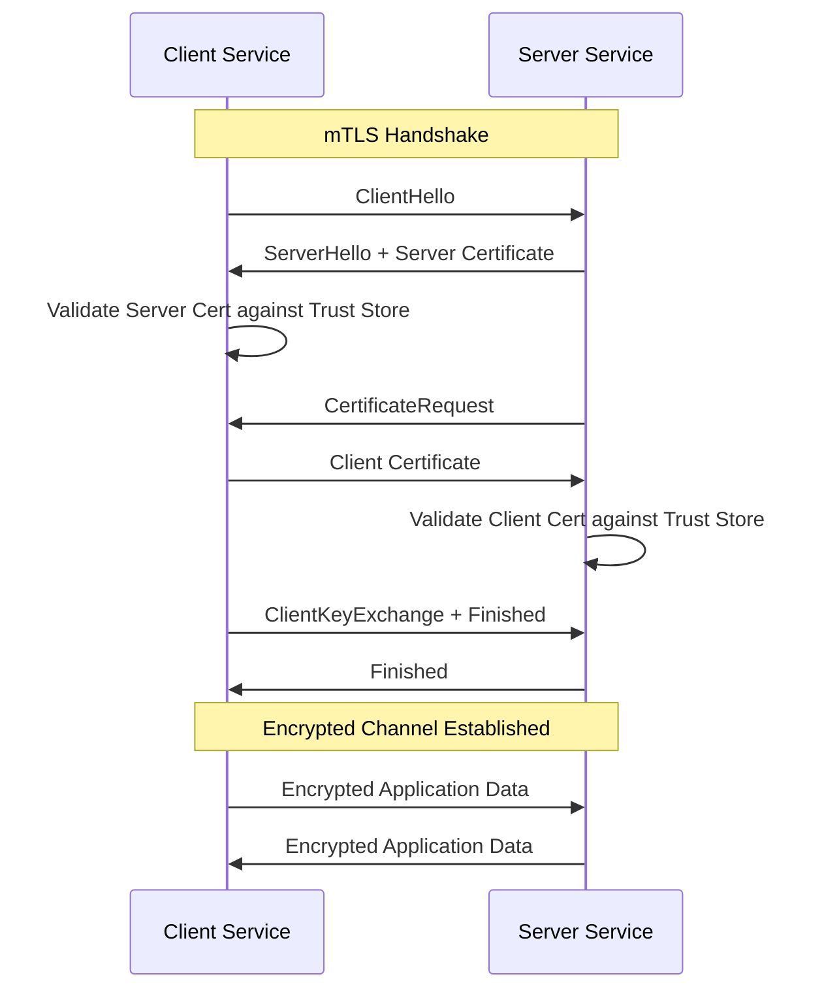
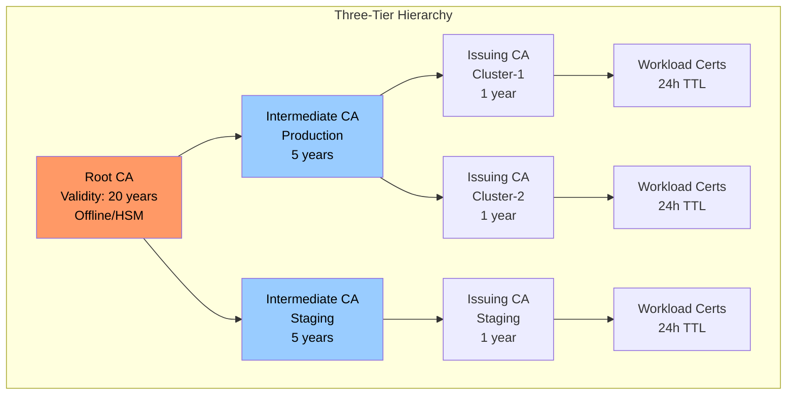
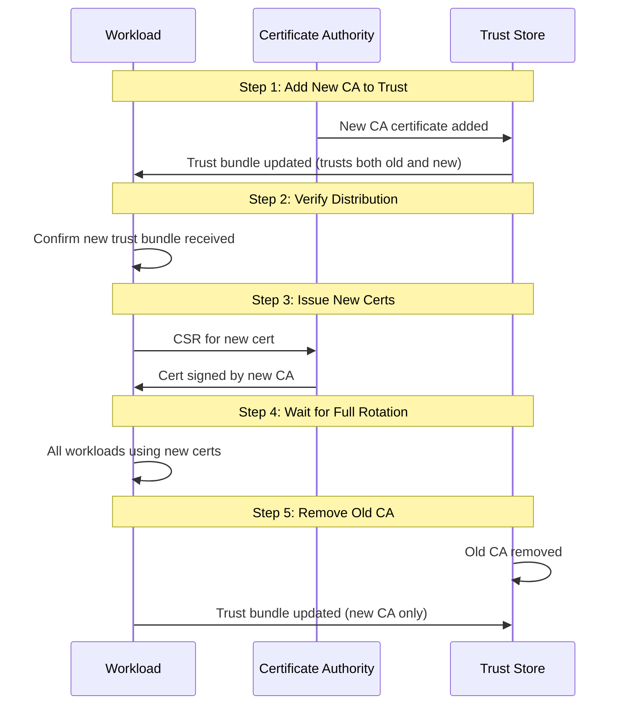

*[mTLS]: Mutual Transport Layer Security
*[TLS]: Transport Layer Security
*[CA]: Certificate Authority
*[PKI]: Public Key Infrastructure
*[SPIFFE]: Secure Production Identity Framework for Everyone
*[SVID]: SPIFFE Verifiable Identity Document
*[CSR]: Certificate Signing Request
*[CRL]: Certificate Revocation List
*[OCSP]: Online Certificate Status Protocol
*[SAN]: Subject Alternative Name
*[CN]: Common Name
*[TTL]: Time To Live
*[HSM]: Hardware Security Module
*[SPIRE]: SPIFFE Runtime Environment
*[ACME]: Automatic Certificate Management Environment

Enabling mutual TLS between services is a single configuration flag in most service meshes. Operating it reliably is where teams struggle. Managing certificate lifecycles, handling rotation without downtime, debugging cryptic handshake failures, maintaining trust hierarchies across clusters—these are the problems that show up at 3 AM when an expired certificate takes down production.

Here's a scenario that happens more often than it should. A team enables Istio mTLS across their 50-service mesh. Initial rollout goes smoothly. Everyone celebrates the "zero-trust network." Three months later, the intermediate CA certificate expires. No one knew it had a 90-day TTL—it was the default, and nobody thought to check. At 2:47 AM, all inter-service communication fails simultaneously. Recovery takes four hours because the on-call engineer has never manually rotated Istio certificates and the runbook doesn't exist yet.

Post-incident, they implement automated rotation with 30-day workload certificates, monitoring for expiration at every level of the CA hierarchy, and quarterly rotation drills. The lesson: mTLS without lifecycle automation is a time bomb.

<Callout type="warning">
The mTLS system has multiple certificate layers (workload, issuing CA, intermediate CA, root CA), each with different TTLs. An outage can originate at any layer. Most teams monitor workload certificates but forget about the CAs that sign them.
</Callout>

This article covers the operational reality of mTLS: how the handshake works and why it fails, how to design trust hierarchies that don't paint you into a corner, how to automate rotation so certificates expire invisibly, and how to debug the inevitable failures when something goes wrong.

## TLS and mTLS Fundamentals

### One-Way vs. Mutual TLS

Standard TLS—what you use when visiting any HTTPS website—is a one-way trust relationship. The server proves its identity to the client by presenting a certificate, and the client validates that certificate against its trust store. The server has no idea who the client is at the transport layer; authentication happens later, at the application layer, via JWTs, API keys, or session cookies.

Mutual TLS adds a second handshake step: after the client validates the server's certificate, the server requests and validates a certificate from the client. Both parties cryptographically prove their identity before any application data flows.

This is what makes mTLS attractive for service-to-service communication—identity verification happens at the network layer, not the application layer.



The operational cost difference is significant. With standard TLS, you manage certificates for servers—maybe dozens or hundreds. With mTLS, _every_ service needs a certificate, and every service needs to validate certificates from every other service it communicates with. In a 100-service mesh, that's potentially thousands of certificate validation paths to maintain.

| Aspect | Standard TLS | Mutual TLS |
|--------|--------------|------------|
| Trust direction | Client trusts server | Bidirectional |
| Certificates needed | Servers only | Every service |
| Identity verification | Server only | Both parties |
| Typical use case | Browser to web server | Service-to-service |
| Operational complexity | Low | High |

### Certificate Anatomy

Understanding certificate structure helps when debugging handshake failures. An X.509 certificate contains several fields that matter for mTLS:

The _subject_ identifies the certificate holder. In Kubernetes environments, this typically looks like `CN=service-a.namespace.svc.cluster.local`. The _issuer_ identifies who signed the certificate—this establishes the trust chain back to a root CA.

_Subject Alternative Names_ (SANs) are where modern certificates store identity information. A single certificate can include multiple DNS names, URIs, and IP addresses. Service meshes typically include both DNS names (for Kubernetes service discovery) and SPIFFE URIs (for workload identity).

The _validity_ period defines when the certificate is valid. For mTLS workload certificates, short lifetimes (24 hours to 7 days) are typical—short enough that a compromised certificate becomes useless quickly, but long enough that rotation doesn't cause operational overhead.

The _Extended Key Usage_ extension is a common source of mTLS failures. For a certificate to work in both client and server roles (which is what mTLS requires), it must include both `serverAuth` and `clientAuth`. A certificate issued for server use only will fail when the service tries to act as a client.

```text
# Decoded certificate showing fields relevant to mTLS
Certificate:
  Subject: CN=service-a
  Issuer: CN=cluster-intermediate-ca
  Validity:
    Not Before: Jan 1 00:00:00 2024 GMT
    Not After:  Jan 2 00:00:00 2024 GMT  # 24-hour TTL
  X509v3 Subject Alternative Name:
    DNS:service-a.default.svc.cluster.local
    URI:spiffe://cluster.local/ns/default/sa/service-a
  X509v3 Extended Key Usage:
    TLS Web Server Authentication  # serverAuth
    TLS Web Client Authentication  # clientAuth - required for mTLS
```

<Callout type="info">
For mTLS, the Extended Key Usage must include both `serverAuth` and `clientAuth`. A certificate with only `serverAuth` can't be used as a client certificate, and vice versa. This is one of the most common misconfigurations when setting up mTLS outside of a service mesh.
</Callout>

## Trust Hierarchy Design

Now that we understand certificate structure, the next question is: who signs these certificates, and how do services decide which certificates to trust?

### Certificate Authority Chains

The CA hierarchy you choose affects every aspect of mTLS operations: how certificates are issued, how rotation works, what happens when a CA is compromised, and how difficult cross-cluster communication becomes. Getting this wrong early creates painful migrations later.

A _two-tier hierarchy_ is the simplest approach: a root CA (kept offline or in an HSM) signs an issuing CA, which signs all workload certificates. The root never touches the network after initial setup. When a workload needs a certificate, the issuing CA—running online and automated—handles the signing. This works well for single-cluster deployments where you don't need isolation between environments.

The downside is blast radius. If the issuing CA is compromised, every certificate it ever signed is suspect. There's no intermediate layer to revoke.

A _three-tier hierarchy_ adds an intermediate layer between root and issuing CAs. The root (20-year validity, offline) signs intermediate CAs (5-10 years), which sign issuing CAs (1-2 years), which sign workload certificates (24 hours to 7 days). This creates natural isolation boundaries—you can have separate intermediates for production and staging, or for different regions, or for different teams.



The tradeoff is complexity. Longer certificate chains mean more validation steps during handshakes. More CAs mean more things to monitor for expiration. But for multi-cluster or multi-region deployments, the isolation is worth it.

For cross-cluster mTLS, you have two options. A _shared root_ means all clusters can communicate automatically—any certificate signed by any issuing CA validates back to the same root. Simple, but a root compromise affects everything. _Federated trust_ means each cluster has its own root, and you explicitly configure which clusters trust each other by distributing trust bundles. More work to set up, but you get selective trust and blast radius containment.

| Hierarchy | Complexity | Isolation | Best For |
|-----------|------------|-----------|----------|
| Two-tier | Low | None | Single cluster, simple deployments |
| Three-tier | Medium | Environment/region | Multi-cluster, compliance requirements |
| Federated | High | Full | Multi-org, zero-trust between clusters |

### SPIFFE Identity Framework

CA hierarchies establish _trust_—which certificates are valid. But they don't standardize _identity_—how workloads identify themselves within those certificates. That's where SPIFFE comes in.

SPIFFE (Secure Production Identity Framework for Everyone) standardizes how workload identity is expressed in certificates. Instead of relying on DNS names or IP addresses—which can be spoofed or change unpredictably—SPIFFE encodes identity as a URI in the certificate's SAN field.

A SPIFFE ID looks like `spiffe://cluster.local/ns/default/sa/service-a`. The _trust domain_ (`cluster.local`) defines the scope of identity—workloads in the same trust domain can verify each other's certificates. The _path_ (`/ns/default/sa/service-a`) identifies the specific workload, typically derived from Kubernetes namespace and service account.

The identity document containing this SPIFFE ID is called an SVID (SPIFFE Verifiable Identity Document). For mTLS, this is usually an X.509 certificate with the SPIFFE ID in the URI SAN. Service meshes generate these automatically.

| Service Mesh | SPIFFE ID Format | Issuer |
|--------------|------------------|--------|
| Istio | `spiffe://cluster.local/ns/{namespace}/sa/{service-account}` | istiod |
| Linkerd | `spiffe://identity.linkerd.cluster.local/...` | linkerd-identity |
| Consul Connect | `spiffe://cluster.consul/ns/{namespace}/dc/{datacenter}/svc/{service}` | Consul CA or Vault |

If you're not using a service mesh, SPIRE (the SPIFFE Runtime Environment) provides the same identity infrastructure as a standalone deployment. SPIRE consists of a server (central authority that signs SVIDs) and agents (one per node, serving workloads via a Unix domain socket). Workload attestation happens through Kubernetes metadata (pod UID, namespace, service account), container labels, or process attributes.

<Callout type="success">
SPIFFE provides a standard identity format that works across service meshes, cloud providers, and on-premise deployments. Adopting SPIFFE IDs makes identity portable and avoids vendor lock-in. If you're building mTLS infrastructure from scratch, start with SPIFFE—you'll thank yourself when you need to federate with another system.
</Callout>

## Certificate Lifecycle Management

### Automated Issuance

Manual certificate issuance doesn't scale. In a mesh with hundreds of services, each needing certificates that rotate every 24 hours, you need automation from day one.

Service meshes handle this transparently. In Istio, when a workload starts, the Envoy sidecar generates a CSR containing the workload's identity (derived from the Kubernetes service account). The sidecar sends this CSR to istiod via the Secret Discovery Service (SDS). Istiod validates the workload identity against Kubernetes, signs the certificate, and returns it to the sidecar—all before the workload accepts its first request. Rotation happens automatically at 80% of the certificate's TTL.

Outside a service mesh, cert-manager provides similar automation. You declare a `Certificate` resource specifying the identity, validity period, and issuer. cert-manager watches these resources, generates CSRs, obtains signed certificates from the configured issuer (Vault, self-signed CA, or ACME), and stores them in Kubernetes Secrets. Workloads mount the Secret, and cert-manager handles renewal before expiration.

```yaml title="cert-manager-mtls-certificate.yaml"
# cert-manager Certificate for mTLS workload
apiVersion: cert-manager.io/v1
kind: Certificate
metadata:
  name: service-a-mtls
  namespace: default
spec:
  secretName: service-a-mtls-tls
  duration: 24h
  renewBefore: 4h        # Rotate 4 hours before expiry
  commonName: service-a
  dnsNames:
    - service-a.default.svc.cluster.local
    - service-a.default.svc
    - service-a
  uris:
    - spiffe://cluster.local/ns/default/sa/service-a
  usages:
    - server auth
    - client auth        # Both required for mTLS
  privateKey:
    algorithm: ECDSA
    size: 256
  issuerRef:
    name: cluster-issuer
    kind: ClusterIssuer
```

The key settings for mTLS: `usages` must include both `server auth` and `client auth`, and `renewBefore` should give enough buffer for rotation to complete without risking expiration.

### Rotation Without Downtime

Certificate rotation is where mTLS complexity becomes real. The challenge: replace a certificate that's actively being used for authentication without breaking any connections.

For _workload certificate rotation_, the strategy is straightforward—overlapping validity. Issue the new certificate before the old one expires. Both are valid during the overlap window, so it doesn't matter which one a service presents. The old certificate eventually expires, and the new one takes over. Service meshes do this automatically.

_CA rotation_ is harder. When you rotate an intermediate or root CA, you're changing the trust anchor that validates certificates. If you issue certificates from a new CA before services trust that CA, mTLS fails immediately.

The safe order for CA rotation:

1. Add the new CA to all trust bundles (services now trust both old and new)
2. Verify all services have received the updated trust bundle
3. Start issuing certificates from the new CA
4. Wait for all workload certificates to rotate to the new CA
5. Remove the old CA from trust bundles



In Istio, root CA rotation requires careful coordination. Use `istioctl experimental precheck` to verify the mesh is healthy before starting, and `istioctl analyze` to catch configuration issues. The rotation can take hours in a large mesh—every workload needs to receive the new trust bundle and rotate its certificate.

<Callout type="warning">
The cardinal rule of CA rotation: add the new CA to trust stores BEFORE issuing certificates with it. Violating this order causes immediate mTLS failures—services with the old trust bundle will reject certificates signed by the new CA as "unknown authority."
</Callout>

### Expiration Monitoring

Automated rotation should make expiration invisible. But "should" isn't "will." Rotation can fail silently—a misconfigured issuer, a network partition, a crashed controller. You need monitoring to catch these failures before they become outages.

For Istio workloads, the `istio_agent_cert_expiry_seconds` metric exposes time until certificate expiration. Alert when this drops below one hour—that's a rotation failure in progress.

For cert-manager, `certmanager_certificate_expiration_timestamp_seconds` provides the expiration timestamp. Calculate time remaining and alert at appropriate thresholds.

```yaml title="prometheus-cert-alerts.yaml"
# Prometheus alerting rules for certificate expiration
groups:
  - name: certificate-expiration
    rules:
      - alert: CertificateExpiringSoon
        expr: |
          (certmanager_certificate_expiration_timestamp_seconds - time()) < 86400
        for: 10m
        labels:
          severity: warning
        annotations:
          summary: "Certificate {{ $labels.name }} expiring in < 24 hours"

      - alert: IstioCertRotationStalled
        expr: |
          istio_agent_cert_expiry_seconds < 3600
        for: 5m
        labels:
          severity: critical
        annotations:
          summary: "Workload certificate not rotating - expires in < 1 hour"
```

Different certificate levels need different alert thresholds:

| Certificate Type | Typical TTL | Warning | Critical |
|------------------|-------------|---------|----------|
| Workload | 24 hours | 4 hours | 1 hour |
| Issuing CA | 1 year | 30 days | 7 days |
| Intermediate CA | 5 years | 6 months | 30 days |
| Root CA | 20 years | 2 years | 6 months |

<Callout type="info">
Monitor expiration at every level of the hierarchy: workload certificates (24h TTL), issuing CAs (1-year), intermediate CAs (5-year), and root CAs (10+ year). The CA that expires is rarely the one you're watching.
</Callout>

## Service Mesh mTLS Configuration

### Istio mTLS Policies

Istio controls mTLS through two resource types: `PeerAuthentication` for incoming traffic and `DestinationRule` for outgoing traffic. Getting these right—and understanding how they interact—is essential for a working mTLS deployment.

`PeerAuthentication` defines how a workload handles incoming connections. The mode determines behavior:

- **STRICT**: Require mTLS. Reject any plaintext connection.
- **PERMISSIVE**: Accept both mTLS and plaintext. Useful during migration.
- **DISABLE**: No mTLS requirement (not recommended for production).

Policies cascade: mesh-wide defaults in `istio-system`, namespace overrides, workload-specific rules. The most specific policy wins.

```yaml title="istio-peer-authentication.yaml"
# Mesh-wide: require mTLS everywhere
apiVersion: security.istio.io/v1beta1
kind: PeerAuthentication
metadata:
  name: default
  namespace: istio-system
spec:
  mtls:
    mode: STRICT
---
# Workload exception: legacy service needs plaintext on one port
apiVersion: security.istio.io/v1beta1
kind: PeerAuthentication
metadata:
  name: legacy-service-exception
  namespace: my-namespace
spec:
  selector:
    matchLabels:
      app: legacy-service
  mtls:
    mode: STRICT
  portLevelMtls:
    8080:
      mode: PERMISSIVE  # Legacy clients on this port only
```

`DestinationRule` controls how a workload initiates outgoing connections. For mTLS, use `ISTIO_MUTUAL` to automatically use Istio-issued certificates:

```yaml title="istio-destination-rule.yaml"
# Use Istio-managed mTLS for all cluster-local services
apiVersion: networking.istio.io/v1beta1
kind: DestinationRule
metadata:
  name: default-mtls
  namespace: istio-system
spec:
  host: "*.local"
  trafficPolicy:
    tls:
      mode: ISTIO_MUTUAL
```

The common mistake: configuring `PeerAuthentication` but forgetting `DestinationRule`. Services will require mTLS for incoming connections but initiate plaintext outgoing connections—and the errors are confusing because they appear on the _receiving_ side.

### Authorization Policies

<Callout type="success">
mTLS proves _who_ the caller is; authorization policies decide _what_ they can do. Together, they provide defense in depth—identity verification at the transport layer, access control at the application layer.
</Callout>

mTLS establishes identity; authorization policies control what that identity can do. The certificate proves who the caller is, and the policy decides whether that caller is allowed to make this specific request.

Start with deny-by-default:

```yaml title="istio-authz-deny-default.yaml"
# Deny all traffic to this namespace by default
apiVersion: security.istio.io/v1beta1
kind: AuthorizationPolicy
metadata:
  name: deny-all
  namespace: my-namespace
spec:
  {}  # Empty spec = deny everything
```

Then explicitly allow specific communication paths:

```yaml title="istio-authz-allow-rules.yaml"
# Allow frontend to call API service
apiVersion: security.istio.io/v1beta1
kind: AuthorizationPolicy
metadata:
  name: allow-frontend-to-api
  namespace: my-namespace
spec:
  selector:
    matchLabels:
      app: api-service
  action: ALLOW
  rules:
    - from:
        - source:
            principals:
              - "cluster.local/ns/frontend/sa/frontend-service"
      to:
        - operation:
            methods: ["GET", "POST"]
            paths: ["/api/*"]
---
# Allow monitoring namespace to scrape metrics
apiVersion: security.istio.io/v1beta1
kind: AuthorizationPolicy
metadata:
  name: allow-monitoring
  namespace: my-namespace
spec:
  selector:
    matchLabels:
      app: api-service
  action: ALLOW
  rules:
    - from:
        - source:
            namespaces: ["monitoring"]
      to:
        - operation:
            paths: ["/metrics", "/health"]
```

The authorization flow evaluates policies in order: DENY rules first, then ALLOW rules, then the default action. Understanding this order prevents surprises—a permissive ALLOW rule won't override an explicit DENY.

## Debugging mTLS Issues

### Common Failure Modes

mTLS failures produce cryptic errors. The TLS handshake fails, and you get a generic "connection reset" or "certificate verify failed" with minimal context.

I once spent two hours debugging a "connection reset by peer" that turned out to be a certificate with `serverAuth` only—no `clientAuth`. The error message mentioned nothing about key usage. The fix was a one-line change to the certificate spec, but finding it required systematically ruling out every other possibility.

Knowing the common failure modes helps narrow down the problem quickly.

**Certificate expired**: The most common cause of mTLS outages. Error messages include `x509: certificate has expired` or `TLS handshake error: certificate verify failed`. Check expiration with `openssl x509 -enddate -noout -in cert.pem`. Fix by forcing rotation or restarting the workload to trigger certificate renewal.

**Trust chain broken**: The certificate is valid but the CA that signed it isn't in the trust store. You'll see `x509: certificate signed by unknown authority`. This happens during CA rotation if trust bundles aren't updated before new certificates are issued. Verify the chain with `openssl verify -CAfile root.pem cert.pem`.

**SAN mismatch**: The certificate is valid but doesn't include the hostname being used. Error: `x509: certificate is valid for X, not Y`. Check SANs with `openssl x509 -text -noout | grep -A1 'Subject Alternative'`. This commonly happens when DNS names change or when certificates are issued with incomplete SAN lists.

**Wrong key usage**: The certificate exists but wasn't issued for mTLS. If it only has `serverAuth` in Extended Key Usage, it can't be used as a client certificate. Error: `x509: certificate specifies an incompatible key usage`. Reissue with both `serverAuth` and `clientAuth`.

| Symptom | Likely Cause | First Check |
|---------|--------------|-------------|
| Connection refused | Service not listening | `netstat -tlnp` |
| Connection reset | TLS version mismatch or expired cert | `openssl x509 -enddate` |
| "Unknown authority" | Trust bundle missing CA | `openssl verify -CAfile` |
| "Valid for X, not Y" | SAN mismatch | Check certificate SANs |
| Intermittent failures | Rotation in progress | Check rotation timing |

### Diagnostic Tools

When mTLS fails, you need to inspect certificates, verify trust chains, and sometimes capture the handshake to see exactly where it breaks. Here's the diagnostic toolkit for Istio environments:

```bash title="mtls-diagnostics.sh"
#!/bin/bash
# Set POD to the name of your problematic pod
POD="your-pod-name"

# Check certificate expiry
kubectl exec -it $POD -c istio-proxy -- \
  cat /etc/certs/cert-chain.pem | \
  openssl x509 -noout -enddate

# Verify certificate chain
kubectl exec -it $POD -c istio-proxy -- \
  openssl verify -CAfile /etc/certs/root-cert.pem \
  /etc/certs/cert-chain.pem

# Check SANs in the certificate
kubectl exec -it $POD -c istio-proxy -- \
  cat /etc/certs/cert-chain.pem | \
  openssl x509 -noout -text | grep -A1 "Subject Alternative"

# Test mTLS connection to another service
kubectl exec -it $POD -c istio-proxy -- \
  curl -v --cacert /etc/certs/root-cert.pem \
  --cert /etc/certs/cert-chain.pem \
  --key /etc/certs/key.pem \
  https://target-service:443/health

# Check Envoy's TLS stats for errors
kubectl exec -it $POD -c istio-proxy -- \
  curl -s localhost:15000/stats | grep -E 'ssl.*(fail|error)'
```

For deeper debugging, enable debug logging on the Envoy proxy:

```bash
# Increase log level for TLS debugging
kubectl exec $POD -c istio-proxy -- \
  curl -X POST localhost:15000/logging?level=debug

# Check Istio proxy secrets
istioctl proxy-config secret $POD -o json | \
  jq '.dynamicActiveSecrets[] | select(.name=="default")'
```

<Callout type="warning">
Packet captures are often necessary for deep mTLS debugging. Use `tcpdump` or Wireshark with the private key to decrypt TLS traffic in non-production environments. Never use private keys from production for decryption.
</Callout>

## Operational Runbooks

### Certificate Rotation Runbook

Routine certificate rotation should be automated, but you still need a runbook for when automation fails or when you're rotating CA certificates (which requires coordination). The pre-checks prevent rotating into a broken state; the execution steps minimize the window of risk; and the post-checks confirm you haven't introduced new problems.

**Pre-checks:**

Before touching certificates, verify the mesh is healthy. Rotating during an existing incident compounds problems.

1. Verify current certificate status—all certificates should be Ready:

```bash
kubectl get certificates -A | grep -v 'True'
```

2. Confirm trust bundle is distributed:

```bash
kubectl get configmap -n istio-system istio-ca-root-cert -o yaml
```

3. Check for ongoing incidents (don't rotate during an outage).

**Execution:**

1. _Backup current certificates_:

```bash
kubectl get secret -n istio-system cacerts -o yaml > cacerts-backup.yaml
kubectl get secret -n istio-system istio-ca-secret -o yaml > ca-secret-backup.yaml
```

2. _Trigger rotation_. For Istio, restart istiod to pick up new CA certificates:

```bash
kubectl rollout restart deployment/istiod -n istio-system
```

3. _Verify workload certificates rotated_:

```bash
for pod in $(kubectl get pods -l app=my-service -o name); do
  kubectl exec $pod -c istio-proxy -- \
    cat /etc/certs/cert-chain.pem | openssl x509 -noout -dates
done
```

4. _Validate mTLS connectivity_ between services.

**Post-checks:**

- All services report healthy
- No TLS errors in logs
- Monitor error rates for 30 minutes

**Rollback** (if mTLS failures occur): Apply backup certificates, restart istiod, restart affected workloads.

### Emergency Recovery Runbook

When mTLS fails across the mesh—multiple services reporting TLS handshake failures, error rates spiking, certificates expired—you need to restore communication first, then fix the root cause. The instinct to immediately fix the certificate issue is wrong; restoring service is the priority. That's why step 2 exists.

**Step 1: Assess scope.** Is it all services or a subset? Check pod status and Istio telemetry.

**Step 2: Enable permissive mode (if needed).** This is the emergency valve—it allows plaintext traffic so services can communicate while you fix the underlying issue:

```yaml title="emergency-permissive.yaml"
apiVersion: security.istio.io/v1beta1
kind: PeerAuthentication
metadata:
  name: emergency-permissive
  namespace: istio-system
spec:
  mtls:
    mode: PERMISSIVE
```

Apply with `kubectl apply -f emergency-permissive.yaml`.

**Step 3: Diagnose root cause.** Check certificate expiry, CA chain validity, and istiod logs.

**Step 4: Apply fix based on diagnosis:**

- _Expired workload certs_: Restart workloads to trigger renewal
- _Expired intermediate CA_: Follow CA rotation runbook
- _Corrupted trust bundle_: Restart istiod to redistribute

**Step 5: Restore strict mode:**

```bash
kubectl delete peerauthentication emergency-permissive -n istio-system
```

Verify all services are using mTLS before closing the incident.

**Post-incident:** Document the timeline, add monitoring for this failure mode, update automation, schedule a post-mortem.

<Callout type="danger">
Switching to PERMISSIVE mode during an incident allows plaintext traffic, which bypasses mTLS security. Document this clearly in your incident timeline and switch back to STRICT as soon as the underlying issue is resolved.
</Callout>

## Conclusion

Enabling mTLS is a configuration change. Operating it reliably is an ongoing commitment to understanding certificate lifecycles, building automation for rotation, monitoring for expiration failures, and having runbooks ready for when things go wrong.

The trust hierarchy you choose affects everything downstream. Two-tier is simple but offers no isolation. Three-tier provides blast radius containment but requires more coordination during rotation. Federated trust gives you full isolation between clusters at the cost of explicit trust management.

Certificate TTLs are a tradeoff. Short-lived certificates (24 hours) limit the damage from a compromised certificate but require robust automation. Longer certificates (7 days) are more forgiving of automation failures but increase your exposure window.

The goal is automation so complete that certificate rotation becomes invisible—happening continuously in the background without human intervention or service disruption. When your certificates rotate and nobody notices, you've built a mature mTLS operation.

<Callout type="info">
Start with permissive mode, add monitoring before enforcement, and run a rotation drill before you need it for real. The worst time to learn your mTLS automation is broken is during an incident.
</Callout>

---
