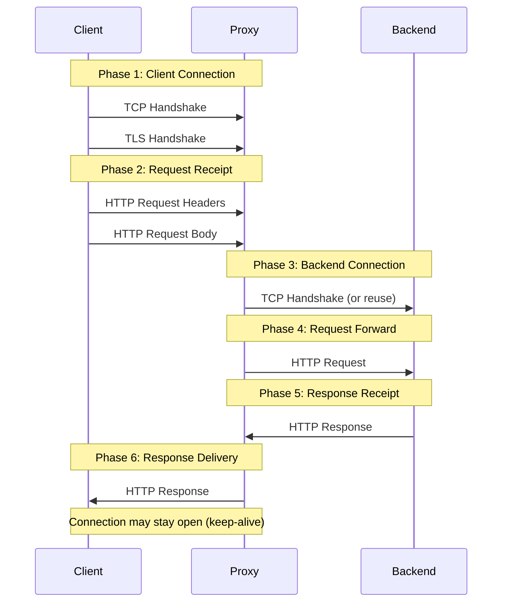
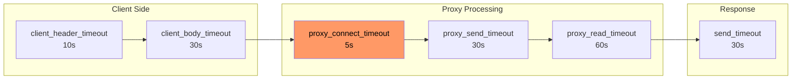
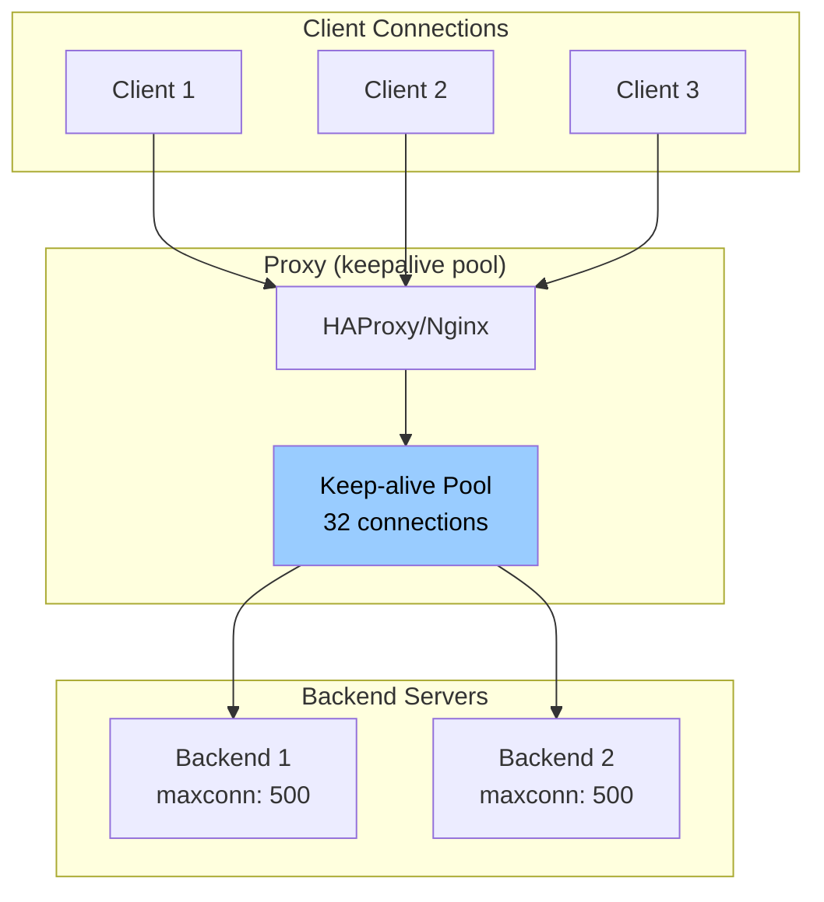

// NOTE: Let's make sure we mention in a callout that haproxy combined with acme.sh can automatically renew & load certificates. docker dns cloudflare certbot container with autorenewal override of entrypoint, systemd service with a filesystem watcher which triggers if the certificates change and concats fullchain and privkey into a single pem file and loads it in to haproxy

*[TCP]: Transmission Control Protocol
*[HTTP]: Hypertext Transfer Protocol
*[TLS]: Transport Layer Security
*[SSL]: Secure Sockets Layer
*[DNS]: Domain Name System
*[RPS]: Requests Per Second
*[QPS]: Queries Per Second
*[P99]: 99th Percentile
*[TTL]: Time To Live
*[FD]: File Descriptor
*[ACL]: Access Control List
*[SNI]: Server Name Indication
*[OCSP]: Online Certificate Status Protocol

# Reverse Proxy Hardening: Timeouts, Buffers, Defaults

## Introduction

Frame the production tuning challenge: nginx and HAProxy ship with defaults optimized for getting started quickly, not for handling production traffic. Default buffer sizes assume small requests. Default timeouts assume fast backends. Default connection limits assume modest traffic. When real load arrives—10,000 concurrent connections, slow clients on mobile networks, backends that occasionally take 30 seconds to respond—these defaults fail in ways that are hard to diagnose. A 502 error could mean a dozen different things. This section establishes that production proxy tuning isn't optional optimization—it's the difference between a proxy that handles traffic gracefully and one that drops connections under load.

_Include a scenario: a team deploys their API behind nginx with default configuration. Traffic grows to 5,000 RPS. Intermittent 502 errors appear. The backend is healthy—latency looks fine. The culprit: `proxy_connect_timeout` defaults to 60s, but `proxy_read_timeout` defaults to 60s as well, and some slow endpoints exceed it. Meanwhile, `worker_connections` is 1024, and with keep-alives, they're running out of connections. After tuning timeouts, increasing worker connections, and adjusting buffer sizes, the 502s disappear. The lesson: proxy configuration is where traffic patterns meet system limits._

<Callout type="warning">
The most dangerous proxy configuration is one that works perfectly in development. Production traffic patterns—slow clients, large payloads, connection storms—expose every untuned default.
</Callout>

## Understanding Proxy Architecture

### Request Flow Through Proxies

```yaml title="proxy-request-flow.yaml"
# Request lifecycle through reverse proxy

request_phases:
  client_connection:
    description: "Client establishes connection to proxy"
    tcp_handshake: "SYN -> SYN-ACK -> ACK"
    tls_handshake: "ClientHello -> ServerHello -> Certificate -> KeyExchange"
    relevant_settings:
      nginx: ["listen", "ssl_protocols", "ssl_ciphers"]
      haproxy: ["bind", "ssl-min-ver", "ciphers"]

  request_receipt:
    description: "Proxy receives full HTTP request"
    phases:
      - "Read request line (method, URI, version)"
      - "Read headers"
      - "Read body (if present)"
    relevant_settings:
      nginx: ["client_header_timeout", "client_body_timeout", "client_max_body_size"]
      haproxy: ["timeout client", "tune.http.maxhdr"]

  backend_connection:
    description: "Proxy connects to upstream"
    connection_reuse: "Keep-alive pools for backend connections"
    relevant_settings:
      nginx: ["proxy_connect_timeout", "upstream keepalive"]
      haproxy: ["timeout connect", "http-reuse"]

  request_forwarding:
    description: "Proxy sends request to backend"
    transformations: "Add headers, modify path, buffer body"
    relevant_settings:
      nginx: ["proxy_send_timeout", "proxy_buffer_size"]
      haproxy: ["timeout server"]

  response_receipt:
    description: "Proxy receives response from backend"
    buffering: "May buffer entire response or stream"
    relevant_settings:
      nginx: ["proxy_read_timeout", "proxy_buffers", "proxy_busy_buffers_size"]
      haproxy: ["timeout server", "tune.bufsize"]

  response_delivery:
    description: "Proxy sends response to client"
    behavior: "May be slower than backend (slow clients)"
    relevant_settings:
      nginx: ["send_timeout", "postpone_output"]
      haproxy: ["timeout client"]
```
Code: Request lifecycle through proxy.


Figure: Request flow through reverse proxy.

### Connection Multiplexing

```yaml title="connection-multiplexing.yaml"
# Connection handling and multiplexing

nginx_connection_model:
  architecture: "Event-driven, single-threaded workers"

  worker_processes:
    default: 1
    recommended: "auto (one per CPU core)"
    max_connections_per_worker: "worker_connections setting"

  connection_accounting:
    client_connection: "Uses 1 connection slot"
    backend_connection: "Uses 1 connection slot"
    total_per_request: "At least 2 slots (client + backend)"
    with_keepalive: "Connections persist, slots remain used"

  formula: |
    max_concurrent_requests = worker_processes * worker_connections / 2
    # Example: 4 workers * 4096 connections / 2 = 8192 concurrent requests

haproxy_connection_model:
  architecture: "Event-driven, multi-threaded"

  global_limits:
    maxconn: "Maximum concurrent connections (global)"
    nbthread: "Number of threads"

  frontend_limits:
    maxconn: "Per-frontend connection limit"
    rate_limit: "Connection rate limiting"

  backend_limits:
    maxconn: "Per-server connection limit"
    queue: "Request queuing when maxconn reached"

  formula: |
    effective_capacity = min(global.maxconn, sum(frontend.maxconn))
    backend_capacity = servers * server.maxconn

---
# HTTP/2 multiplexing impact
http2_impact:
  single_connection_multiple_streams: true
  streams_per_connection: "Configurable, default ~100"

  nginx:
    http2_max_concurrent_streams: 128
    effect: "One TCP connection serves many requests"
    connection_accounting: "1 slot serves many requests"

  haproxy:
    tune.h2.max_concurrent_streams: 100
    effect: "Reduces connection overhead significantly"
```
Code: Connection multiplexing models.

<Callout type="info">
With HTTP/2, a single client connection can multiplex hundreds of requests. This dramatically changes connection accounting—you need fewer client connections but each one is more valuable. Tune accordingly.
</Callout>

## Timeout Configuration

### Nginx Timeout Hierarchy

```nginx title="nginx-timeouts.conf"
# Nginx timeout configuration - production values

# === Client-side timeouts ===

# Time to wait for client to send request headers
# Default: 60s - Too long for production
client_header_timeout 10s;

# Time to wait for client to send request body
# Per-read, not total. Resets on each chunk received.
# Default: 60s
client_body_timeout 30s;

# Time to wait between writes to client
# If client stops reading, connection closes after this
# Default: 60s
send_timeout 30s;

# Keep-alive timeout (client connection reuse)
# How long to keep idle connections open
# Default: 75s
keepalive_timeout 65s;

# === Proxy/Backend timeouts ===

# Time to establish connection to backend
# Should be short - backends should be reachable quickly
# Default: 60s - Way too long
proxy_connect_timeout 5s;

# Time to wait for backend to send response headers
# Start of response, not completion
# Default: 60s
proxy_send_timeout 30s;

# Time to wait for backend to send response body
# Per-read operation, resets on each chunk
# Default: 60s - May need increase for slow endpoints
proxy_read_timeout 60s;

# === Per-location overrides ===
location /api/slow-endpoint {
    # Long-running operations need longer timeouts
    proxy_read_timeout 300s;
}

location /api/uploads {
    # Large uploads need time
    client_body_timeout 120s;
    proxy_send_timeout 120s;
}

location /health {
    # Health checks should be fast
    proxy_connect_timeout 2s;
    proxy_read_timeout 5s;
}
```
Code: Nginx timeout configuration.

### HAProxy Timeout Hierarchy

```haproxy title="haproxy-timeouts.cfg"
# HAProxy timeout configuration - production values

defaults
    mode http

    # === Connection timeouts ===

    # Time to wait for TCP connection to backend
    # Default: no timeout (dangerous!)
    timeout connect 5s

    # Time to wait for client to send data
    # Covers entire request, not per-read
    # Default: no timeout
    timeout client 30s

    # Time to wait for server to send data
    # Covers entire response, not per-read
    # Default: no timeout
    timeout server 60s

    # === HTTP-specific timeouts ===

    # Time to wait for complete HTTP request
    # Protects against slowloris attacks
    # Default: 5s
    timeout http-request 10s

    # Time to wait between requests on keep-alive connection
    # How long to keep connection open waiting for next request
    # Default: no timeout
    timeout http-keep-alive 10s

    # Time to wait in queue for available server
    # When all backend servers are at maxconn
    # Default: no timeout
    timeout queue 30s

    # Time to wait for health check response
    # Default: uses timeout connect + timeout server
    timeout check 5s

    # === Tunnel timeout (websockets, etc.) ===
    # Time for idle bidirectional connection
    timeout tunnel 3600s

# Per-backend overrides
backend slow_api
    timeout server 300s
    timeout queue 60s

backend uploads
    timeout client 120s
    timeout server 120s

backend health_checks
    timeout connect 2s
    timeout server 5s
```
Code: HAProxy timeout configuration.


Figure: Nginx timeout chain.

| Timeout | Nginx | HAProxy | Recommended |
|---------|-------|---------|-------------|
| Client connect | N/A (kernel) | N/A (kernel) | Kernel default |
| Client request | client_header_timeout | timeout http-request | 10-30s |
| Client body | client_body_timeout | timeout client | 30-120s |
| Backend connect | proxy_connect_timeout | timeout connect | 3-10s |
| Backend response | proxy_read_timeout | timeout server | 30-300s |
| Keep-alive idle | keepalive_timeout | timeout http-keep-alive | 30-120s |

Table: Timeout comparison.

<Callout type="warning">
The most common timeout mistake: setting `proxy_read_timeout` too short. A backend that occasionally takes 45 seconds (database query, external API) will cause 502 errors with a 30-second timeout. Know your P99 backend latency and add headroom.
</Callout>

## Buffer Tuning

### Nginx Buffer Configuration

```nginx title="nginx-buffers.conf"
# Nginx buffer configuration - production values

# === Client request buffers ===

# Buffer for reading client request headers
# Default: 1k - Often too small for cookies/auth headers
client_header_buffer_size 4k;

# Fallback large buffers for oversized headers
# number * size - used when header exceeds client_header_buffer_size
# Default: 4 8k
large_client_header_buffers 8 16k;

# Maximum request body size
# 0 = unlimited (dangerous!)
# Default: 1m
client_max_body_size 100m;

# Buffer client request body in memory or disk
# on = use proxy_buffer_size first, then disk
# off = stream to backend immediately
client_body_buffer_size 128k;

# === Proxy response buffers ===

# Buffer for first part of response (headers)
# Should fit typical response headers
# Default: 4k/8k (platform dependent)
proxy_buffer_size 8k;

# Buffers for response body
# number * size total buffering capacity
# Default: 8 4k/8k
proxy_buffers 16 32k;

# How much can be busy sending to client while reading more
# Default: 8k/16k
proxy_busy_buffers_size 64k;

# Maximum size of buffered response
# If response exceeds this, streams directly (slower)
# Default: 256m
proxy_max_temp_file_size 1024m;

# === Buffering behavior ===

# Buffer entire response before sending to client
# on = faster for slow clients, uses memory
# off = streaming, lower memory, can be slower
proxy_buffering on;

# Don't wait for full buffer before sending
# Useful for SSE, streaming responses
# location /events {
#     proxy_buffering off;
# }

# === Per-location tuning ===
location /api/large-response {
    proxy_buffers 32 64k;
    proxy_busy_buffers_size 128k;
}

location /api/streaming {
    proxy_buffering off;
    proxy_read_timeout 3600s;
}
```
Code: Nginx buffer configuration.

### HAProxy Buffer Configuration

```haproxy title="haproxy-buffers.cfg"
# HAProxy buffer configuration

global
    # Size of buffer for request/response
    # Applied to both directions
    # Default: 16384 (16k)
    tune.bufsize 32768

    # Maximum number of headers
    # Default: 101
    tune.http.maxhdr 128

    # Maximum size of compressed response
    tune.comp.maxlevel 5

    # Maximum memory for SSL session cache
    tune.ssl.cachesize 100000

    # Maximum number of headers to log
    tune.http.logurilen 8192

defaults
    # Maximum request/response size (header + body)
    # Requests exceeding this get 400 error
    # Default: tune.bufsize
    # For large uploads, must increase tune.bufsize

    # Response buffering mode
    # full: buffer entire response
    # auto: decide based on response
    option http-buffer-request

frontend main
    # Rate limiting headers/body
    http-request set-header X-Request-Size %[req.body_size]

    # Reject oversized requests early
    http-request deny if { req.body_size gt 104857600 }

backend api
    # HTTP options
    option httpchk GET /health
    http-check expect status 200

    # Server connection behavior
    http-reuse aggressive
```
Code: HAProxy buffer configuration.

| Scenario | Buffer Setting | Recommendation |
|----------|---------------|----------------|
| Large cookies/headers | client_header_buffer_size | 4k-16k |
| File uploads | client_body_buffer_size | 128k-1m |
| Large API responses | proxy_buffers | 16-32 × 32k-64k |
| Streaming/SSE | proxy_buffering | off |
| Memory constrained | proxy_max_temp_file_size | Limit spillover |

Table: Buffer sizing by scenario.

<Callout type="info">
Buffering is a tradeoff: more buffering uses more memory but handles slow clients better. Less buffering uses less memory but can cause backends to wait on slow clients. For APIs, buffering on. For streaming/websockets, buffering off.
</Callout>

## Connection Management

### Keep-Alive Tuning

```nginx title="nginx-keepalive.conf"
# Nginx keep-alive configuration

# === Client-side keep-alive ===

# Enable keep-alive for clients
# Default: on
keepalive_timeout 65s;

# Maximum requests per keep-alive connection
# After this many requests, connection closes
# Default: 100
keepalive_requests 1000;

# Send keep-alive header
# Default: off
keepalive_disable none;

# === Backend keep-alive (upstream) ===

upstream backend {
    server backend1:8080;
    server backend2:8080;

    # Number of idle keep-alive connections to preserve
    # Per worker process!
    # Default: none (new connection per request)
    keepalive 32;

    # Maximum requests per backend keep-alive connection
    # Default: 1000
    keepalive_requests 10000;

    # Idle timeout for backend connections
    # Default: 60s
    keepalive_timeout 60s;
}

server {
    location / {
        proxy_pass http://backend;

        # Required for upstream keep-alive
        proxy_http_version 1.1;
        proxy_set_header Connection "";
    }
}

# === Connection draining ===

# Graceful worker shutdown timeout
# Wait for connections to finish
worker_shutdown_timeout 30s;
```
Code: Nginx keep-alive configuration.

### HAProxy Connection Pooling

```haproxy title="haproxy-connections.cfg"
# HAProxy connection management

global
    # Maximum concurrent connections (global limit)
    maxconn 50000

    # Number of threads
    nbthread 4

defaults
    mode http

    # Connection reuse policy
    # safe: reuse only for safe methods
    # aggressive: reuse for all methods
    # always: always reuse (dangerous)
    # never: no reuse
    option http-reuse aggressive

    # Server connection mode
    # http-server-close: close backend conn after response
    # http-keep-alive: keep backend connections open
    option http-server-close

frontend main
    bind *:80

    # Frontend connection limit
    maxconn 40000

    # Connection rate limiting
    rate-limit sessions 1000

    default_backend api

backend api
    # Load balancing algorithm
    balance roundrobin

    # Server definitions with connection limits
    server srv1 backend1:8080 maxconn 500 check
    server srv2 backend2:8080 maxconn 500 check

    # Queue configuration when servers are full
    # timeout queue defined in defaults
    fullconn 800

    # Connection retry
    retries 3
    option redispatch

    # Health checking
    option httpchk GET /health
    http-check expect status 200

    # Slow start - ramp up connections to new server
    server srv1 backend1:8080 maxconn 500 slowstart 30s check
```
Code: HAProxy connection management.


Figure: Connection pooling to backends.

<Callout type="success">
Backend keep-alive is often more important than client keep-alive. Each new backend connection requires a TCP handshake (and potentially TLS). A keep-alive pool dramatically reduces backend latency and load.
</Callout>

## Load Balancing Configuration

### Algorithm Selection

```nginx title="nginx-load-balancing.conf"
# Nginx load balancing configuration

# Round-robin (default)
# Simple rotation through servers
upstream backend_rr {
    server backend1:8080;
    server backend2:8080;
    server backend3:8080;
}

# Least connections
# Send to server with fewest active connections
upstream backend_lc {
    least_conn;
    server backend1:8080;
    server backend2:8080;
    server backend3:8080;
}

# IP hash (sticky sessions)
# Same client IP goes to same server
upstream backend_ip {
    ip_hash;
    server backend1:8080;
    server backend2:8080;
    server backend3:8080;
}

# Weighted distribution
# Higher weight = more traffic
upstream backend_weighted {
    server backend1:8080 weight=5;  # 50% of traffic
    server backend2:8080 weight=3;  # 30% of traffic
    server backend3:8080 weight=2;  # 20% of traffic
}

# Health checks and failure handling
upstream backend_resilient {
    server backend1:8080 max_fails=3 fail_timeout=30s;
    server backend2:8080 max_fails=3 fail_timeout=30s;
    server backend3:8080 backup;  # Only used when others fail

    keepalive 32;
}

# Hash on custom key (e.g., user ID)
upstream backend_hash {
    hash $request_uri consistent;
    server backend1:8080;
    server backend2:8080;
    server backend3:8080;
}
```
Code: Nginx load balancing algorithms.

### HAProxy Advanced Load Balancing

```haproxy title="haproxy-load-balancing.cfg"
# HAProxy load balancing configuration

backend api
    # === Balancing Algorithms ===

    # Round-robin (default)
    balance roundrobin

    # Least connections
    # balance leastconn

    # Source IP hash (sticky)
    # balance source

    # URI hash (cache efficiency)
    # balance uri

    # Header-based hash
    # balance hdr(X-User-ID)

    # Random with power of two choices
    # balance random(2)

    # === Server weights and options ===
    server srv1 backend1:8080 weight 100 check
    server srv2 backend2:8080 weight 100 check
    server srv3 backend3:8080 weight 50 check  # Half traffic

    # === Advanced options ===

    # Dynamic weight adjustment based on health
    option httpchk GET /health
    http-check expect status 200
    default-server inter 3s fall 3 rise 2

    # Slow start - gradually increase traffic to new/recovered server
    default-server slowstart 60s

    # Agent check - backend reports own health/weight
    # server srv1 backend1:8080 check agent-check agent-port 8081

backend sticky_sessions
    # Cookie-based sticky sessions
    balance roundrobin
    cookie SERVERID insert indirect nocache
    server srv1 backend1:8080 cookie s1 check
    server srv2 backend2:8080 cookie s2 check

backend canary
    # Weighted canary deployment
    server stable backend-stable:8080 weight 95 check
    server canary backend-canary:8080 weight 5 check
```
Code: HAProxy load balancing.

| Algorithm | Use Case | Session Affinity | Even Distribution |
|-----------|----------|------------------|-------------------|
| Round-robin | Stateless services | No | Yes |
| Least-conn | Varying request duration | No | Adaptive |
| IP hash | Simple session affinity | Yes (IP-based) | Depends on IPs |
| Cookie | Reliable session affinity | Yes (cookie) | Yes |
| URI hash | Caching proxies | Yes (URL-based) | Depends on URLs |

Table: Load balancing algorithm selection.

<Callout type="info">
For stateless services, `least_conn` often outperforms `round_robin` when request durations vary significantly. It naturally avoids sending requests to servers still processing slow requests.
</Callout>

## SSL/TLS Optimization

### Certificate and Protocol Configuration

```nginx title="nginx-ssl.conf"
# Nginx SSL/TLS production configuration

server {
    listen 443 ssl http2;
    server_name example.com;

    # === Certificates ===
    ssl_certificate /etc/nginx/ssl/fullchain.pem;
    ssl_certificate_key /etc/nginx/ssl/privkey.pem;

    # Multiple certificates (RSA + ECDSA)
    # ssl_certificate /etc/nginx/ssl/rsa-fullchain.pem;
    # ssl_certificate_key /etc/nginx/ssl/rsa-privkey.pem;
    # ssl_certificate /etc/nginx/ssl/ecdsa-fullchain.pem;
    # ssl_certificate_key /etc/nginx/ssl/ecdsa-privkey.pem;

    # === Protocol versions ===
    # TLS 1.2 minimum (1.3 preferred)
    ssl_protocols TLSv1.2 TLSv1.3;

    # === Cipher suites ===
    # Prefer server cipher order
    ssl_prefer_server_ciphers on;

    # Modern cipher suite (TLS 1.2)
    ssl_ciphers ECDHE-ECDSA-AES128-GCM-SHA256:ECDHE-RSA-AES128-GCM-SHA256:ECDHE-ECDSA-AES256-GCM-SHA384:ECDHE-RSA-AES256-GCM-SHA384;

    # TLS 1.3 ciphers (auto-selected, cannot be configured)

    # === Session caching ===
    # Shared cache across workers
    ssl_session_cache shared:SSL:50m;
    ssl_session_timeout 1d;

    # Session tickets (alternative to cache)
    ssl_session_tickets on;
    ssl_session_ticket_key /etc/nginx/ssl/ticket.key;

    # === OCSP Stapling ===
    ssl_stapling on;
    ssl_stapling_verify on;
    ssl_trusted_certificate /etc/nginx/ssl/chain.pem;
    resolver 8.8.8.8 8.8.4.4 valid=300s;
    resolver_timeout 5s;

    # === DH Parameters ===
    ssl_dhparam /etc/nginx/ssl/dhparam.pem;

    # === Early data (0-RTT) ===
    # Careful: replay attacks possible
    ssl_early_data on;
    proxy_set_header Early-Data $ssl_early_data;
}

# Generate DH parameters:
# openssl dhparam -out /etc/nginx/ssl/dhparam.pem 2048

# Generate session ticket key:
# openssl rand 80 > /etc/nginx/ssl/ticket.key
```
Code: Nginx SSL configuration.

### HAProxy SSL Configuration

```haproxy title="haproxy-ssl.cfg"
# HAProxy SSL/TLS production configuration

global
    # SSL/TLS defaults
    ssl-default-bind-ciphers ECDHE-ECDSA-AES128-GCM-SHA256:ECDHE-RSA-AES128-GCM-SHA256:ECDHE-ECDSA-AES256-GCM-SHA384:ECDHE-RSA-AES256-GCM-SHA384
    ssl-default-bind-ciphersuites TLS_AES_128_GCM_SHA256:TLS_AES_256_GCM_SHA384:TLS_CHACHA20_POLY1305_SHA256
    ssl-default-bind-options ssl-min-ver TLSv1.2 no-tls-tickets

    ssl-default-server-ciphers ECDHE-ECDSA-AES128-GCM-SHA256:ECDHE-RSA-AES128-GCM-SHA256
    ssl-default-server-options ssl-min-ver TLSv1.2

    # SSL session cache
    tune.ssl.cachesize 100000
    tune.ssl.lifetime 600

    # SSL memory limits
    tune.ssl.maxrecord 16384

frontend https
    bind *:443 ssl crt /etc/haproxy/certs/ alpn h2,http/1.1

    # SNI-based routing
    use_backend api if { ssl_fc_sni -i api.example.com }
    use_backend web if { ssl_fc_sni -i www.example.com }

    # HSTS header
    http-response set-header Strict-Transport-Security "max-age=31536000; includeSubDomains"

    default_backend web

backend api
    # Backend over TLS
    server srv1 backend1:8443 ssl verify required ca-file /etc/haproxy/ca.pem check

    # Backend with client certificate
    # server srv1 backend1:8443 ssl crt /etc/haproxy/client.pem verify required ca-file /etc/haproxy/ca.pem

frontend tcp_passthrough
    bind *:8443
    mode tcp

    # TCP-level SNI inspection
    tcp-request inspect-delay 5s
    tcp-request content accept if { req_ssl_hello_type 1 }

    use_backend passthrough if { req_ssl_sni -i passthrough.example.com }
```
Code: HAProxy SSL configuration.

| Optimization | Impact | Trade-off |
|-------------|--------|-----------|
| Session cache | Reduces handshakes | Memory usage |
| OCSP stapling | Faster validation | Requires resolver |
| TLS 1.3 | Faster handshake, better security | Client support |
| HTTP/2 | Multiplexing, fewer connections | Complexity |
| Early data (0-RTT) | Faster first request | Replay risk |

Table: SSL optimization options.

<Callout type="warning">
TLS 1.3's 0-RTT (early data) is vulnerable to replay attacks. Only enable it for idempotent requests (GET), and ensure backends check the `Early-Data` header to handle replays appropriately.
</Callout>

## Monitoring and Observability

### Nginx Metrics and Logging

```nginx title="nginx-monitoring.conf"
# Nginx monitoring configuration

# === Status module (basic metrics) ===
server {
    listen 8080;

    location /nginx_status {
        stub_status on;
        allow 10.0.0.0/8;
        deny all;
    }
}

# Output:
# Active connections: 291
# server accepts handled requests
# 16630948 16630948 31070465
# Reading: 6 Writing: 179 Waiting: 106

# === Enhanced logging ===
log_format detailed '$remote_addr - $remote_user [$time_local] '
                    '"$request" $status $body_bytes_sent '
                    '"$http_referer" "$http_user_agent" '
                    'rt=$request_time uct="$upstream_connect_time" '
                    'uht="$upstream_header_time" urt="$upstream_response_time" '
                    'cs=$upstream_cache_status';

log_format json escape=json '{'
    '"time":"$time_iso8601",'
    '"remote_addr":"$remote_addr",'
    '"method":"$request_method",'
    '"uri":"$uri",'
    '"status":$status,'
    '"body_bytes":$body_bytes_sent,'
    '"request_time":$request_time,'
    '"upstream_time":"$upstream_response_time",'
    '"upstream_addr":"$upstream_addr"'
'}';

access_log /var/log/nginx/access.log detailed;
# access_log /var/log/nginx/access.json.log json;

# === Error categorization ===
# Log 4xx/5xx to separate file
map $status $loggable {
    ~^[45] 1;
    default 0;
}

access_log /var/log/nginx/errors.log detailed if=$loggable;

# === Prometheus exporter ===
# Use nginx-prometheus-exporter with stub_status
# or nginx-vts-module for detailed metrics
```
Code: Nginx monitoring configuration.

### HAProxy Statistics

```haproxy title="haproxy-monitoring.cfg"
# HAProxy monitoring configuration

frontend stats
    bind *:8404

    # Enable stats page
    stats enable
    stats uri /stats
    stats refresh 10s
    stats auth admin:secure_password

    # Prometheus metrics endpoint
    http-request use-service prometheus-exporter if { path /metrics }

# === Built-in metrics ===
# Frontend: sessions, bytes, requests, errors
# Backend: sessions, bytes, health, queue, response time
# Server: sessions, bytes, health, weight, queue

# === Log format for analysis ===
defaults
    mode http
    option httplog

    # Detailed log format
    log-format "%ci:%cp [%tr] %ft %b/%s %TR/%Tw/%Tc/%Tr/%Ta %ST %B %CC %CS %tsc %ac/%fc/%bc/%sc/%rc %sq/%bq %hr %hs %{+Q}r"

    # JSON log format (alternative)
    # log-format '{"client":"%ci","frontend":"%f","backend":"%b","server":"%s","status":%ST,"bytes":%B,"time_total":%Ta,"time_response":%Tr}'

# === Health check logging ===
backend api
    option log-health-checks
    server srv1 backend1:8080 check
```
Code: HAProxy monitoring.

```yaml title="prometheus-alerts.yaml"
# Prometheus alerting rules for proxies

groups:
  - name: proxy_alerts
    rules:
      - alert: HighErrorRate
        expr: |
          sum(rate(nginx_http_requests_total{status=~"5.."}[5m])) /
          sum(rate(nginx_http_requests_total[5m])) > 0.05
        for: 5m
        labels:
          severity: critical
        annotations:
          summary: "High 5xx error rate ({{ $value | humanizePercentage }})"

      - alert: HighLatency
        expr: |
          histogram_quantile(0.99,
            rate(nginx_http_request_duration_seconds_bucket[5m])
          ) > 2
        for: 5m
        labels:
          severity: warning
        annotations:
          summary: "P99 latency above 2 seconds"

      - alert: BackendDown
        expr: haproxy_server_up == 0
        for: 1m
        labels:
          severity: critical
        annotations:
          summary: "Backend server {{ $labels.server }} is down"

      - alert: HighConnectionCount
        expr: nginx_connections_active > 10000
        for: 5m
        labels:
          severity: warning
        annotations:
          summary: "High active connection count"

      - alert: HighQueueDepth
        expr: haproxy_backend_current_queue > 100
        for: 2m
        labels:
          severity: warning
        annotations:
          summary: "Backend queue depth high"
```
Code: Prometheus alerting rules.

<Callout type="success">
Log upstream timing (`$upstream_response_time`) separately from total request time (`$request_time`). The difference reveals how much time is spent in the proxy itself—useful for debugging proxy overhead vs. backend slowness.
</Callout>

## Production Hardening Checklist

### Security Configuration

```nginx title="nginx-security.conf"
# Nginx security hardening

# === Hide version ===
server_tokens off;

# === Security headers ===
add_header X-Frame-Options "SAMEORIGIN" always;
add_header X-Content-Type-Options "nosniff" always;
add_header X-XSS-Protection "1; mode=block" always;
add_header Referrer-Policy "strict-origin-when-cross-origin" always;

# HSTS (enable after testing)
add_header Strict-Transport-Security "max-age=31536000; includeSubDomains" always;

# === Rate limiting ===
limit_req_zone $binary_remote_addr zone=api:10m rate=10r/s;
limit_conn_zone $binary_remote_addr zone=conn:10m;

server {
    location /api/ {
        limit_req zone=api burst=20 nodelay;
        limit_conn conn 10;

        proxy_pass http://backend;
    }
}

# === Request filtering ===
# Block common attacks
location ~* "(base64_encode|eval\(|javascript:)" {
    return 403;
}

# Block sensitive paths
location ~ /\. {
    deny all;
}

# === Client restrictions ===
# Maximum header size
large_client_header_buffers 4 8k;

# Maximum body size
client_max_body_size 10m;

# Maximum URI length
# Handled by large_client_header_buffers
```
Code: Nginx security configuration.

### Complete Production Config Example

```nginx title="nginx-production-complete.conf"
# Complete production nginx configuration

worker_processes auto;
worker_rlimit_nofile 65535;
pid /run/nginx.pid;

events {
    worker_connections 4096;
    use epoll;
    multi_accept on;
}

http {
    # === Basic settings ===
    sendfile on;
    tcp_nopush on;
    tcp_nodelay on;
    types_hash_max_size 2048;
    server_tokens off;

    include /etc/nginx/mime.types;
    default_type application/octet-stream;

    # === Logging ===
    log_format main '$remote_addr - $remote_user [$time_local] "$request" '
                    '$status $body_bytes_sent "$http_referer" '
                    '"$http_user_agent" rt=$request_time '
                    'uct=$upstream_connect_time uht=$upstream_header_time '
                    'urt=$upstream_response_time';

    access_log /var/log/nginx/access.log main buffer=16k flush=2m;
    error_log /var/log/nginx/error.log warn;

    # === Timeouts ===
    client_header_timeout 10s;
    client_body_timeout 30s;
    send_timeout 30s;
    keepalive_timeout 65s;
    keepalive_requests 1000;

    # === Buffers ===
    client_header_buffer_size 4k;
    large_client_header_buffers 8 16k;
    client_body_buffer_size 128k;
    client_max_body_size 100m;

    # === Proxy defaults ===
    proxy_connect_timeout 5s;
    proxy_send_timeout 30s;
    proxy_read_timeout 60s;
    proxy_buffer_size 8k;
    proxy_buffers 16 32k;
    proxy_busy_buffers_size 64k;

    # === Gzip ===
    gzip on;
    gzip_vary on;
    gzip_proxied any;
    gzip_comp_level 5;
    gzip_types text/plain text/css application/json application/javascript text/xml application/xml;

    # === Rate limiting ===
    limit_req_zone $binary_remote_addr zone=api:10m rate=100r/s;
    limit_conn_zone $binary_remote_addr zone=conn:10m;

    # === Upstream ===
    upstream backend {
        least_conn;
        server backend1:8080 max_fails=3 fail_timeout=30s;
        server backend2:8080 max_fails=3 fail_timeout=30s;
        keepalive 32;
        keepalive_requests 10000;
        keepalive_timeout 60s;
    }

    # === Server ===
    server {
        listen 443 ssl http2;
        server_name example.com;

        # SSL
        ssl_certificate /etc/nginx/ssl/fullchain.pem;
        ssl_certificate_key /etc/nginx/ssl/privkey.pem;
        ssl_protocols TLSv1.2 TLSv1.3;
        ssl_ciphers ECDHE-ECDSA-AES128-GCM-SHA256:ECDHE-RSA-AES128-GCM-SHA256;
        ssl_prefer_server_ciphers on;
        ssl_session_cache shared:SSL:50m;
        ssl_session_timeout 1d;
        ssl_stapling on;
        ssl_stapling_verify on;

        # Security headers
        add_header X-Frame-Options "SAMEORIGIN" always;
        add_header X-Content-Type-Options "nosniff" always;
        add_header Strict-Transport-Security "max-age=31536000" always;

        location / {
            limit_req zone=api burst=50 nodelay;
            limit_conn conn 20;

            proxy_pass http://backend;
            proxy_http_version 1.1;
            proxy_set_header Connection "";
            proxy_set_header Host $host;
            proxy_set_header X-Real-IP $remote_addr;
            proxy_set_header X-Forwarded-For $proxy_add_x_forwarded_for;
            proxy_set_header X-Forwarded-Proto $scheme;
        }

        location /health {
            access_log off;
            proxy_pass http://backend;
            proxy_connect_timeout 2s;
            proxy_read_timeout 5s;
        }
    }
}
```
Code: Complete production configuration.

| Category | Default | Production | Why |
|----------|---------|------------|-----|
| worker_connections | 1024 | 4096+ | Handle more concurrent connections |
| keepalive_timeout | 75s | 65s | Balance reuse vs. resource usage |
| proxy_connect_timeout | 60s | 5s | Fail fast on unreachable backends |
| proxy_buffers | 8 4k | 16 32k | Handle larger responses |
| ssl_session_cache | none | shared:50m | Reduce TLS handshakes |

Table: Default vs. production values.

<Callout type="danger">
Before deploying configuration changes to production, test under realistic load. Use tools like `wrk`, `hey`, or `k6` to simulate traffic patterns. Configuration that works at 100 RPS may fail at 10,000 RPS.
</Callout>

## Conclusion

Summarize the production tuning journey: proxy defaults are starting points, not production configurations. Timeouts must match your traffic patterns—slow endpoints need longer read timeouts, health checks need short timeouts. Buffers must accommodate your payloads—APIs with large responses need bigger proxy buffers, file uploads need client body buffer tuning. Connection management must scale to your load—keep-alive pools reduce backend latency, connection limits prevent resource exhaustion. Monitor everything—you can't tune what you can't measure. The goal is a proxy that handles gracefully: normal traffic with optimal performance, traffic spikes without dropping connections, and slow clients without blocking backends.

<Callout type="info">
The best proxy configuration is one you've tested under failure conditions. Simulate backend slowdowns, connection storms, and large payloads. The problems you find in testing won't wake you up at 3 AM.
</Callout>

---

## Cover Prompt

### Prompt 1: The Control Room

Create an image of a high-tech control room with multiple screens showing proxy metrics—connection counts, latency graphs, error rates. An engineer adjusts dials labeled "Timeouts," "Buffers," and "Connections." Traffic flows through visualized pipelines, some smooth, some congested. Style: control room operations, metric dashboards, traffic visualization, 16:9 aspect ratio.

### Prompt 2: The Water Treatment Plant

Design an image of a water treatment facility where water (requests) flows through filters (proxies), buffers (tanks), and valves (connection limits). Some pipes show pressure gauges (latency), others show flow meters (throughput). Engineers adjust valve settings. Style: industrial water processing, flow control, capacity management, 16:9 aspect ratio.

### Prompt 3: The Traffic Intersection

Illustrate a complex traffic intersection with signals (proxies) controlling flow. Timing displays show timeout settings. Some lanes have metering lights (rate limiting). A traffic control center monitors camera feeds showing vehicle counts and queue lengths. Style: traffic management, signal timing, flow optimization, 16:9 aspect ratio.

### Prompt 4: The Server Room

Create an image of a server room with glowing rack servers connected by fiber optic cables. Overlay displays show buffer usage, connection pools, and timeout timers. Some connections pulse green (healthy), others flash yellow (slow). A technician reviews configuration on a terminal. Style: data center, connection visualization, real-time monitoring, 16:9 aspect ratio.

### Prompt 5: The Switchboard

Design an image of a vintage telephone switchboard merged with modern technology. Operators (proxies) connect incoming calls (requests) to backends. Queue boards show waiting calls. Timer displays show connection duration. Some circuits glow indicating active connections. Style: retro-modern switchboard, connection routing, queue management, 16:9 aspect ratio.
