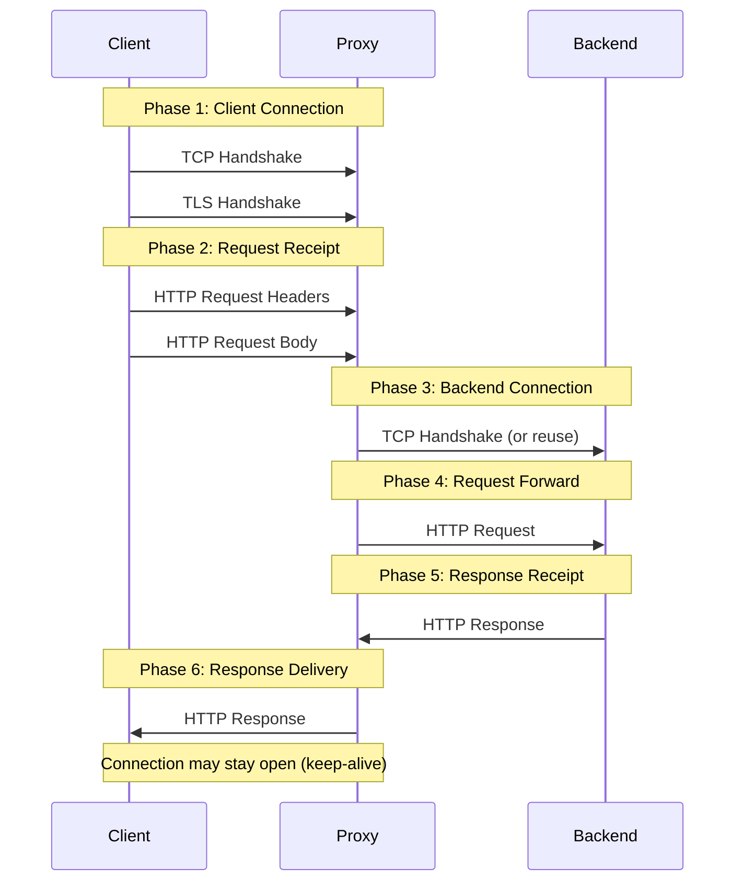
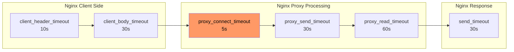
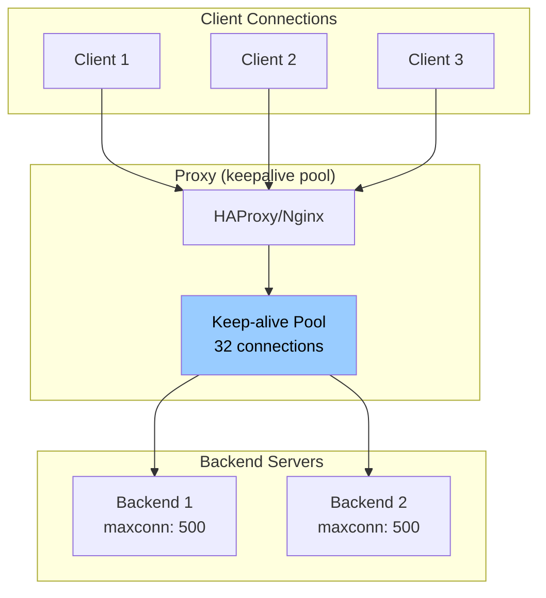

*[ACL]: Access Control List
*[DNS]: Domain Name System
*[FD]: File Descriptor
*[HTTP/2]: Hypertext Transfer Protocol Version 2
*[OCSP]: Online Certificate Status Protocol
*[OOM]: Out of Memory
*[P99]: 99th Percentile
*[QPS]: Queries Per Second
*[RPS]: Requests Per Second
*[SNI]: Server Name Indication
*[SSL]: Secure Sockets Layer
*[TCP]: Transmission Control Protocol
*[TLS]: Transport Layer Security
*[TTL]: Time To Live

Nginx and HAProxy ship with defaults optimized for getting started quickly, not for handling production traffic. Default buffer sizes assume small requests. Default timeouts assume fast backends. Default connection limits assume modest traffic. When real load arrives—10,000 concurrent connections, slow clients on mobile networks, backends that occasionally take 30 seconds to respond—these defaults fail in ways that are hard to diagnose.

A 502 error from Nginx could mean a dozen different things. The backend refused the connection. The backend accepted the connection but didn't respond in time. The backend started responding but the response was too large to buffer. The proxy ran out of file descriptors. Without understanding the proxy's internals, you're guessing.

Here's a scenario I've seen play out. A team deploys their API behind Nginx with the default configuration. Traffic grows to 5,000 RPS. Intermittent 502 errors start appearing. The backend looks healthy—response times are fine, no errors in application logs. The problem is invisible until someone digs into Nginx's internals. It turns out `proxy_read_timeout` defaults to 60 seconds, which sounds generous until you realize a few slow endpoints sometimes take 65 seconds (database queries, external API calls). Meanwhile, `worker_connections` is 1024, and with keep-alives holding connections open, they're running out of connection slots during traffic spikes.

After tuning timeouts, increasing worker connections, and adjusting buffer sizes, the 502s disappear. The lesson: proxy configuration is where traffic patterns meet system limits. Production tuning isn't optional optimization—it's the difference between a proxy that handles traffic gracefully and one that drops connections under load.

<Callout type="warning">
The most dangerous proxy configuration is one that works perfectly in development. Production traffic patterns—slow clients, large payloads, connection storms—expose every untuned default.
</Callout>

## Understanding Proxy Architecture

### Request Flow Through Proxies

Every HTTP request passing through a reverse proxy goes through distinct phases, each with its own timeout and buffer settings. Understanding this flow is essential for diagnosing where failures occur.

The journey starts with the _client connection phase_: TCP handshake, then TLS handshake if HTTPS. This is where `listen` and `ssl_protocols` in Nginx (or `bind` and `ssl-min-ver` in HAProxy) come into play. A slow TLS handshake here—perhaps due to missing OCSP stapling or expensive cipher negotiation—adds latency before the proxy even sees the HTTP request.

Next comes _request receipt_: the proxy reads the request line, headers, and body. This is where `client_header_timeout` and `client_body_timeout` apply. A mobile client on a flaky connection might take 10 seconds to send a 5MB upload. If your timeout is 5 seconds, the connection drops.

The _backend connection phase_ is often the source of 502 errors. The proxy opens a connection to the upstream server (or reuses one from a keep-alive pool). These backend connections can be TCP sockets, Unix domain sockets (for backends on the same host), or TLS-encrypted connections for backends that require encryption in transit.

In cloud deployments, the pattern varies: within a Kubernetes cluster, backends typically run on the same node or within a private network, so plain HTTP over TCP is common—TLS termination happens at the ingress, not between services. For backends in different VPCs or external services, you'll often see TLS to the backend, which adds a TLS handshake to each new connection (another reason keep-alive pools matter). Unix sockets eliminate network overhead entirely but only work when proxy and backend share a filesystem.

The configuration parameters `proxy_connect_timeout` in Nginx or `timeout connect` in HAProxy controls how long to wait for the backend connection. If the backend is overloaded and not accepting connections, this timeout fires.

Finally, the proxy _forwards the request_, _receives the response_, and _delivers it to the client_. Each phase has its own timeout. The response delivery phase is particularly important for slow clients—a backend might respond in 50ms, but if the client is on a 2G connection, sending that response takes seconds.



Figure: Request flow through reverse proxy showing the six phases where timeouts and buffers apply.

### Connection Multiplexing

Nginx and HAProxy handle connections differently, and understanding these models helps you size connection limits appropriately.

Nginx uses an _event-driven, single-threaded worker_ model. Each worker process handles thousands of connections using non-blocking I/O, but each connection—whether from a client or to a backend—uses one slot from the `worker_connections` pool. Since a proxied request needs both a client connection and a backend connection, each request consumes at least two slots. The formula for maximum concurrent requests is roughly:

```text
max concurrent requests = (worker_processes × worker_connections) / 2
```

With 4 workers and 4096 connections each, you get approximately 8,192 concurrent requests. Keep-alives complicate this—idle connections still consume slots, so you may hit connection limits before CPU or memory becomes a bottleneck.

The `worker_processes auto` setting tells Nginx to spawn one worker per CPU core, which is usually correct. You might deviate for CPU-bound workloads (fewer workers to reduce context switching) or in containers with CPU limits (set workers explicitly since `auto` reads the host's CPU count, not the container's limit).

HAProxy uses an _event-driven, multi-threaded_ model with more granular controls. You set a global `maxconn` limit, but you can also set per-frontend and per-backend limits. When a backend reaches its `maxconn`, HAProxy queues requests rather than rejecting them immediately—the `timeout queue` setting controls how long requests wait for an available slot.

HTTP/2 changes the equation significantly. A single HTTP/2 connection can multiplex hundreds of concurrent streams (requests). In Nginx, `http2_max_concurrent_streams` defaults to 128; in HAProxy, `tune.h2.max_concurrent_streams` defaults to 100. This means one connection slot serves many requests, dramatically improving efficiency for clients that support HTTP/2.

HTTP/3 (QUIC) takes this further by eliminating head-of-line blocking entirely—since it runs over UDP, a lost packet doesn't stall unrelated streams. Both Nginx and HAProxy have experimental HTTP/3 support, but production adoption is still early. If you're starting fresh, it's worth evaluating; for existing deployments, HTTP/2 remains the practical choice.

<Callout type="info">
If you're proxying gRPC traffic, HTTP/2 is mandatory—gRPC requires it. Make sure both your frontend (client-facing) and backend connections are configured for HTTP/2, or gRPC calls will fail with cryptic errors.
</Callout>

## Timeout Configuration

Timeouts are the most common source of proxy-related outages, and the defaults are almost never right for production. Nginx defaults most timeouts to 60 seconds—generous enough to hide problems during development, short enough to cause 502s when a backend occasionally takes 65 seconds. HAProxy is worse: many timeouts have _no default_, meaning connections can hang indefinitely if you don't configure them.

The key insight is that timeouts should match your traffic patterns, not arbitrary round numbers. A health check endpoint should respond in milliseconds; a report generation endpoint might legitimately take 5 minutes. Using the same timeout for both means either your health checks are too slow to detect failures, or your reports timeout prematurely.

### Nginx Timeout Hierarchy

Nginx organizes timeouts into client-side (receiving requests) and proxy-side (communicating with backends). Most timeouts are _per-operation_, meaning they reset when data flows—a client uploading a large file won't timeout as long as chunks keep arriving.

```nginx title="nginx-timeouts.conf"
# Nginx timeout configuration - production values

# === Client-side timeouts ===

# Time to wait for client to send request headers
# Default: 60s - Too long for production
client_header_timeout 10s;

# Time to wait for client to send request body
# Per-read, not total. Resets on each chunk received.
# Default: 60s
client_body_timeout 30s;

# Time to wait between writes to client
# If client stops reading, connection closes after this
# Default: 60s
send_timeout 30s;

# Keep-alive timeout (client connection reuse)
# How long to keep idle connections open
# Default: 75s
keepalive_timeout 65s;

# === Proxy/Backend timeouts ===

# Time to establish connection to backend
# Should be short - backends should be reachable quickly
# Default: 60s - Way too long
proxy_connect_timeout 5s;

# Time to wait between writes to backend
# If backend stops accepting data, timeout fires
# Default: 60s
proxy_send_timeout 30s;

# Time to wait for backend to send response body
# Per-read operation, resets on each chunk
# Default: 60s - May need increase for slow endpoints
proxy_read_timeout 60s;

# === Per-location overrides ===
location /api/slow-endpoint {
    # Long-running operations need longer timeouts
    proxy_read_timeout 300s;
}

location /api/uploads {
    # Large uploads need time
    client_body_timeout 120s;
    proxy_send_timeout 120s;
}

location /health {
    # Health checks should be fast
    proxy_connect_timeout 2s;
    proxy_read_timeout 5s;
}
```

The per-location overrides are essential. A monolithic timeout configuration forces you to set everything to accommodate the slowest endpoint, which masks problems elsewhere. By setting aggressive defaults (5-second connect, 60-second read) and overriding for specific slow paths, you get fast failure detection for most endpoints while still supporting legitimate long-running operations.

### HAProxy Timeout Hierarchy

HAProxy's timeout model differs from Nginx in one critical way: `timeout client` and `timeout server` cover the _entire_ request or response, not per-read operations. If you set `timeout server 60s` and the backend takes 30 seconds to send the first byte, then another 35 seconds to send the body, the connection times out—even though data was flowing the whole time.

```haproxy title="haproxy-timeouts.cfg"
# HAProxy timeout configuration - production values

defaults
    mode http

    # === Connection timeouts ===

    # Time to wait for TCP connection to backend
    # Default: no timeout (dangerous!)
    timeout connect 5s

    # Time to wait for client to send data
    # Covers entire request, not per-read
    # Default: no timeout
    timeout client 30s

    # Time to wait for server to send data
    # Covers entire response, not per-read
    # Default: no timeout
    timeout server 60s

    # === HTTP-specific timeouts ===

    # Time to wait for complete HTTP request
    # Protects against slowloris attacks
    # Default: 5s
    timeout http-request 10s

    # Time to wait between requests on keep-alive connection
    # How long to keep connection open waiting for next request
    # Default: no timeout
    timeout http-keep-alive 10s

    # Time to wait in queue for available server
    # When all backend servers are at maxconn
    # Default: no timeout
    timeout queue 30s

    # Time to wait for health check response
    # Default: uses timeout connect + timeout server
    timeout check 5s

    # === Tunnel timeout (websockets, etc.) ===
    # Time for idle bidirectional connection
    timeout tunnel 3600s

# Per-backend overrides
backend slow_api
    timeout server 300s
    timeout queue 60s

backend uploads
    timeout client 120s
    timeout server 120s

backend health_checks
    timeout connect 2s
    timeout server 5s
```

The `timeout queue` setting deserves special attention. When all backend servers reach their `maxconn` limit, HAProxy queues incoming requests rather than rejecting them immediately. This is usually what you want—a brief spike shouldn't return errors if backends will be available in a few seconds. But if the queue timeout is too long, users wait forever for requests that will eventually fail anyway. 30 seconds is a reasonable default; adjust based on how long users are willing to wait.


Figure: Nginx timeout chain showing where each timeout applies in the request lifecycle.

The following table maps Nginx and HAProxy timeout settings to each other. They're not exact equivalents—Nginx's per-read semantics differ from HAProxy's total-time semantics—but this helps when translating configurations between the two.

| Timeout | Nginx | HAProxy | Recommended |
|---------|-------|---------|-------------|
| Client connect | N/A (kernel) | N/A (kernel) | Kernel default |
| Client request | client_header_timeout | timeout http-request | 10-30s |
| Client body | client_body_timeout | timeout client | 30-120s |
| Backend connect | proxy_connect_timeout | timeout connect | 3-10s |
| Backend response | proxy_read_timeout | timeout server | 30-300s |
| Keep-alive idle | keepalive_timeout | timeout http-keep-alive | 30-120s |

Table: Timeout comparison.

<Callout type="warning">
The most common timeout mistake: setting `proxy_read_timeout` too short. A backend that occasionally takes 45 seconds (database query, external API) will cause 502 errors with a 30-second timeout. Know your P99 backend latency and add headroom.
</Callout>

## Buffer Tuning

Buffers determine how much data your proxy can hold in memory between clients and backends. Get them wrong and you'll see one of two problems: undersized buffers cause 400 Bad Request errors (headers too large) or force disk spillover that kills performance; oversized buffers waste memory and can make a high-traffic proxy OOM.

The most common buffer-related issue is authentication headers exceeding the default buffer size. Nginx's `client_header_buffer_size` defaults to 1KB, but a request with OAuth tokens, cookies, and correlation headers can easily hit 4-8KB. When headers exceed the primary buffer, Nginx falls back to `large_client_header_buffers`—if that's also too small, the client gets a 400 Bad Request with no useful message.

### Nginx Buffer Configuration

Nginx separates client-side buffers (receiving requests) from proxy-side buffers (receiving responses from backends). The proxy buffers are where most tuning happens because response sizes vary wildly.

```nginx title="nginx-buffers.conf"
# === Client request buffers ===

# Buffer for reading client request headers
# Default: 1k - Often too small for cookies/auth headers
client_header_buffer_size 4k;

# Fallback large buffers for oversized headers
# number * size - used when header exceeds client_header_buffer_size
# Default: 4 8k
large_client_header_buffers 8 16k;

# Maximum request body size
# 0 = unlimited (dangerous!)
# Default: 1m
client_max_body_size 100m;

# Buffer client request body in memory or disk
# on = use proxy_buffer_size first, then disk
# off = stream to backend immediately
client_body_buffer_size 128k;

# === Proxy response buffers ===

# Buffer for first part of response (headers)
# Should fit typical response headers
# Default: 4k/8k (platform dependent)
proxy_buffer_size 8k;

# Buffers for response body
# number * size total buffering capacity
# Default: 8 4k/8k
proxy_buffers 16 32k;

# How much can be busy sending to client while reading more
# Default: 8k/16k
proxy_busy_buffers_size 64k;

# Maximum size of buffered response
# If response exceeds this, streams directly (slower)
# Default: 256m
proxy_max_temp_file_size 1024m;

# === Buffering behavior ===

# Buffer entire response before sending to client
# on = faster for slow clients, uses memory
# off = streaming, lower memory, can be slower
proxy_buffering on;

# Don't wait for full buffer before sending
# Useful for SSE, streaming responses
# location /events {
#     proxy_buffering off;
# }

# === Per-location tuning ===
location /api/large-response {
    proxy_buffers 32 64k;
    proxy_busy_buffers_size 128k;
}

location /api/streaming {
    proxy_buffering off;
    proxy_read_timeout 3600s;
}
```

The `proxy_buffering` directive controls whether Nginx buffers the entire backend response before sending to the client. With buffering on, a backend can finish quickly and move on to the next request even if the client is slow—the proxy holds the response. With buffering off, the backend connection stays open until the client receives everything. For typical APIs, buffering on. For Server-Sent Events, WebSockets, or streaming responses, buffering off.

### HAProxy Buffer Configuration

HAProxy uses a simpler buffer model: `tune.bufsize` controls the buffer size for both requests and responses. Unlike Nginx's array of buffers, HAProxy uses a single buffer per direction. This makes tuning simpler but less flexible—you can't have small request buffers and large response buffers.

```haproxy title="haproxy-buffers.cfg"
global
    # Size of buffer for request/response
    # Applied to both directions
    # Default: 16384 (16k)
    tune.bufsize 32768

    # Maximum number of headers
    # Default: 101
    tune.http.maxhdr 128

    # Maximum size of compressed response
    tune.comp.maxlevel 5

    # Maximum memory for SSL session cache
    tune.ssl.cachesize 100000

    # Maximum number of headers to log
    tune.http.logurilen 8192

defaults
    # Maximum request/response size (header + body)
    # Requests exceeding this get 400 error
    # Default: tune.bufsize
    # For large uploads, must increase tune.bufsize

    # Response buffering mode
    # full: buffer entire response
    # auto: decide based on response
    option http-buffer-request

frontend main
    # Rate limiting headers/body
    http-request set-header X-Request-Size %[req.body_size]

    # Reject oversized requests early
    http-request deny if { req.body_size gt 104857600 }

backend api
    # HTTP options
    option httpchk GET /health
    http-check expect status 200

    # Server connection behavior
    http-reuse aggressive
```

The `http-request deny if { req.body_size gt 104857600 }` line is worth noting: it rejects oversized requests _before_ buffering them. Without this, HAProxy would accept a 10GB upload attempt before rejecting it—wasting bandwidth and potentially filling disk.

| Scenario | Buffer Setting | Recommendation |
|----------|---------------|----------------|
| Large cookies/headers | client_header_buffer_size | 4k-16k |
| File uploads | client_body_buffer_size | 128k-1m |
| Large API responses | proxy_buffers | 16-32 × 32k-64k |
| Streaming/SSE | proxy_buffering | off |
| Memory constrained | proxy_max_temp_file_size | Limit spillover |

Table: Buffer sizing recommendations by scenario. These are starting points—profile your actual traffic to refine.

<Callout type="info">
**Quick decision**: If you're seeing 400 Bad Request errors, increase `client_header_buffer_size`. If backends complain about slow clients, turn `proxy_buffering` on. If you're proxying Server-Sent Events or WebSockets, turn `proxy_buffering` off.
</Callout>

## Connection Management

Connection management is where proxies earn their keep. Opening a new TCP connection involves a three-way handshake (50-100ms to a nearby server, 200ms+ cross-region). Add TLS and you're looking at another round trip or two. At 1000 RPS, if every request opens a new backend connection, you're spending more time on handshakes than actual work.

The solution is connection pooling: the proxy maintains a pool of open connections to each backend and reuses them across requests. Nginx calls this "upstream keepalive"; HAProxy calls it "connection reuse." Both dramatically reduce backend latency.

### Keep-Alive Tuning

Nginx's upstream keepalive has a critical gotcha: it requires specific HTTP headers to work. By default, Nginx sends `Connection: close` to backends, defeating keepalive entirely. You _must_ set `proxy_http_version 1.1` and `proxy_set_header Connection ""` in every location block that uses the upstream.

```nginx title="nginx-keepalive.conf"
# === Client-side keep-alive ===

# Enable keep-alive for clients
# Default: on
keepalive_timeout 65s;

# Maximum requests per keep-alive connection
# After this many requests, connection closes
# Default: 100
keepalive_requests 1000;

# Send keep-alive header
# Default: off
keepalive_disable none;

# === Backend keep-alive (upstream) ===

upstream backend {
    server backend1:8080;
    server backend2:8080;

    # Number of idle keep-alive connections to preserve
    # Per worker process!
    # Default: none (new connection per request)
    keepalive 32;

    # Maximum requests per backend keep-alive connection
    # Default: 1000
    keepalive_requests 10000;

    # Idle timeout for backend connections
    # Default: 60s
    keepalive_timeout 60s;
}

server {
    location / {
        proxy_pass http://backend;

        # Required for upstream keep-alive
        proxy_http_version 1.1;
        proxy_set_header Connection "";
    }
}

# === Connection draining ===

# Graceful worker shutdown timeout
# Wait for connections to finish
worker_shutdown_timeout 30s;
```

The `keepalive 32` directive is _per worker process_, not total. With 4 workers, you'll have up to 128 idle backend connections (32 × 4). Size this based on your request rate and backend count—too few connections means constant churn, too many wastes backend resources holding idle connections.

### HAProxy Connection Pooling

HAProxy's `http-reuse` directive controls connection pooling behavior. The `aggressive` setting reuses connections for all HTTP methods, which is safe for stateless backends. The `safe` setting only reuses for idempotent methods (GET, HEAD, OPTIONS)—use this if your backends have connection-affinity issues.

The `maxconn` limits deserve careful thought. The global `maxconn` caps total proxy connections. Frontend `maxconn` caps client connections. Backend server `maxconn` caps connections _per backend server_. When a server hits its limit, HAProxy queues requests (controlled by `timeout queue`) rather than overloading the backend.

```haproxy title="haproxy-connections.cfg"
global
    # Maximum concurrent connections (global limit)
    maxconn 50000

    # Number of threads
    nbthread 4

defaults
    mode http

    # Connection reuse policy
    # safe: reuse only for safe methods
    # aggressive: reuse for all methods
    # always: always reuse (dangerous)
    # never: no reuse
    option http-reuse aggressive

    # Server connection mode
    # http-server-close: close backend conn after response
    # http-keep-alive: keep backend connections open
    option http-server-close

frontend main
    bind *:80

    # Frontend connection limit
    maxconn 40000

    # Connection rate limiting
    rate-limit sessions 1000

    default_backend api

backend api
    # Load balancing algorithm
    balance roundrobin

    # Server definitions with connection limits
    server srv1 backend1:8080 maxconn 500 check
    server srv2 backend2:8080 maxconn 500 check

    # Queue configuration when servers are full
    # timeout queue defined in defaults
    fullconn 800

    # Connection retry
    retries 3
    option redispatch

    # Health checking
    option httpchk GET /health
    http-check expect status 200

    # Slow start - ramp up connections to new server
    server srv3 backend3:8080 maxconn 500 slowstart 30s check
```

The `slowstart` option is valuable when bringing new servers online. Without it, a fresh server immediately receives its full share of traffic—which can overwhelm cold caches and unwarmed JVMs. With `slowstart 30s`, HAProxy gradually increases traffic to the new server over 30 seconds, giving it time to warm up.


Figure: Connection pooling to backends. Multiple clients share a smaller pool of backend connections, reducing handshake overhead.

<Callout type="success">
Backend keep-alive is often more important than client keep-alive. Each new backend connection requires a TCP handshake (and potentially TLS). A keep-alive pool dramatically reduces backend latency and load.
</Callout>

## Load Balancing Configuration

Load balancing distributes traffic across backend servers. The choice of algorithm matters less than people think—round-robin works fine for most stateless services—but getting it wrong causes real problems. Session affinity ("sticky sessions") on a stateless service wastes capacity; no affinity on a stateful service causes session corruption.

### Algorithm Selection

Round-robin is the default and usually correct for stateless microservices. It distributes traffic evenly regardless of what backends are doing. Least-connections works better when request durations vary significantly—a reporting endpoint that takes 30 seconds shouldn't receive new requests at the same rate as a health check endpoint.

IP hash provides basic session affinity without cookies, but it's fragile: clients behind NAT share an IP, mobile clients change IPs frequently, and CDNs mask the original IP. Cookie-based affinity (HAProxy's `cookie` directive or Nginx Plus's sticky cookies) is more reliable when you actually need sessions.

```nginx title="nginx-load-balancing.conf"
# Round-robin (default)
# Simple rotation through servers
upstream backend_rr {
    server backend1:8080;
    server backend2:8080;
    server backend3:8080;
}

# Least connections
# Send to server with fewest active connections
upstream backend_lc {
    least_conn;
    server backend1:8080;
    server backend2:8080;
    server backend3:8080;
}

# IP hash (sticky sessions)
# Same client IP goes to same server
upstream backend_ip {
    ip_hash;
    server backend1:8080;
    server backend2:8080;
    server backend3:8080;
}

# Weighted distribution
# Higher weight = more traffic
upstream backend_weighted {
    server backend1:8080 weight=5;  # 50% of traffic
    server backend2:8080 weight=3;  # 30% of traffic
    server backend3:8080 weight=2;  # 20% of traffic
}

# Health checks and failure handling
upstream backend_resilient {
    server backend1:8080 max_fails=3 fail_timeout=30s;
    server backend2:8080 max_fails=3 fail_timeout=30s;
    server backend3:8080 backup;  # Only used when others fail

    keepalive 32;
}

# Hash on custom key (e.g., user ID)
upstream backend_hash {
    hash $request_uri consistent;
    server backend1:8080;
    server backend2:8080;
    server backend3:8080;
}
```

The `consistent` modifier on hash-based balancing is important for caching use cases. Without it, adding or removing a server rehashes _all_ requests to new backends, invalidating caches. With consistent hashing, only requests that were going to the added/removed server get redistributed.

### HAProxy Advanced Load Balancing

HAProxy offers more sophisticated options, including agent checks where backends report their own health and capacity. The `random(2)` algorithm ("power of two choices") is interesting: it picks two servers randomly and sends the request to whichever has fewer connections. This provides near-optimal distribution without the overhead of tracking all server states.

```haproxy title="haproxy-load-balancing.cfg"
backend api
    # === Balancing Algorithms ===

    # Round-robin (default)
    balance roundrobin

    # Least connections
    # balance leastconn

    # Source IP hash (sticky)
    # balance source

    # URI hash (cache efficiency)
    # balance uri

    # Header-based hash
    # balance hdr(X-User-ID)

    # Random with power of two choices
    # balance random(2)

    # === Server weights and options ===
    server srv1 backend1:8080 weight 100 check
    server srv2 backend2:8080 weight 100 check
    server srv3 backend3:8080 weight 50 check  # Half traffic

    # === Advanced options ===

    # Dynamic weight adjustment based on health
    option httpchk GET /health
    http-check expect status 200
    default-server inter 3s fall 3 rise 2

    # Slow start - gradually increase traffic to new/recovered server
    default-server slowstart 60s

    # Agent check - backend reports own health/weight
    # server srv1 backend1:8080 check agent-check agent-port 8081

backend sticky_sessions
    # Cookie-based sticky sessions
    balance roundrobin
    cookie SERVERID insert indirect nocache
    server srv1 backend1:8080 cookie s1 check
    server srv2 backend2:8080 cookie s2 check

backend canary
    # Weighted canary deployment
    server stable backend-stable:8080 weight 95 check
    server canary backend-canary:8080 weight 5 check
```

The canary deployment example shows a common pattern: routing 5% of traffic to a new version while 95% goes to the stable version. If the canary starts failing health checks or returning errors, you can quickly shift traffic back to stable by adjusting weights or marking the canary server as `disabled`.

| Algorithm | Use Case | Session Affinity | Even Distribution |
|-----------|----------|------------------|-------------------|
| Round-robin | Stateless services | No | Yes |
| Least-conn | Varying request duration | No | Adaptive |
| IP hash | Simple session affinity | Yes (IP-based) | Depends on IPs |
| Cookie | Reliable session affinity | Yes (cookie) | Yes |
| URI hash | Caching proxies | Yes (URL-based) | Depends on URLs |

Table: Load balancing algorithm selection guide. Start with round-robin and change only if you have a specific reason.

<Callout type="info">
For stateless services, `least_conn` often outperforms `round_robin` when request durations vary significantly. It naturally avoids sending requests to servers still processing slow requests.
</Callout>

## SSL/TLS Optimization

TLS termination at the proxy is almost always correct. Backends can run plain HTTP (simpler, faster, easier to debug), while clients get proper encryption. The proxy handles certificate management, cipher negotiation, and session caching—concerns you don't want duplicated across dozens of backend services.

The performance cost of TLS is often overstated. Modern CPUs have AES-NI[^aes-ni] instructions that make symmetric encryption nearly free. The real cost is in handshakes: each new connection requires asymmetric cryptography and certificate verification. Session caching and TLS 1.3's faster handshake mitigate this.

[^aes-ni]: Intel AES-NI (Advanced Encryption Standard New Instructions) is a hardware-based extension for x86 processors (Intel and AMD) designed to significantly speed up data encryption and decryption. It uses specific CPU instructions to handle complex cryptographic calculations, providing 3x to 10x faster performance while reducing CPU load compared to software-only implementations.

### Certificate and Protocol Configuration

TLS 1.2 is the minimum acceptable version in 2025; TLS 1.3 is preferred and required by some compliance frameworks. Don't enable TLS 1.0 or 1.1—they have known vulnerabilities and modern browsers don't use them anyway.

OCSP stapling is worth enabling: instead of clients checking certificate revocation with the CA (adding latency), your proxy includes a signed timestamp proving the certificate wasn't revoked. This eliminates a round trip to the CA on each new connection.

Start with certificates and protocol versions:

```nginx title="nginx-ssl-certificates.conf"
server {
    listen 443 ssl http2;
    server_name example.com;

    # Certificates
    ssl_certificate /etc/nginx/ssl/fullchain.pem;
    ssl_certificate_key /etc/nginx/ssl/privkey.pem;

    # TLS 1.2 minimum (1.3 preferred)
    ssl_protocols TLSv1.2 TLSv1.3;

    # Prefer server cipher order with modern ciphers
    ssl_prefer_server_ciphers on;
    ssl_ciphers ECDHE-ECDSA-AES128-GCM-SHA256:ECDHE-RSA-AES128-GCM-SHA256:ECDHE-ECDSA-AES256-GCM-SHA384:ECDHE-RSA-AES256-GCM-SHA384;
}
```

Session caching reduces TLS handshake overhead by allowing clients to resume previous sessions. The `shared:SSL:50m` cache is shared across all worker processes:

```nginx title="nginx-ssl-sessions.conf"
server {
    # Shared cache across workers (50MB)
    ssl_session_cache shared:SSL:50m;
    ssl_session_timeout 1d;

    # Session tickets (alternative to cache)
    ssl_session_tickets on;
    ssl_session_ticket_key /etc/nginx/ssl/ticket.key;
}

# Generate session ticket key:
# openssl rand 80 > /etc/nginx/ssl/ticket.key
```

OCSP stapling and DH parameters complete the configuration:

```nginx title="nginx-ssl-ocsp.conf"
server {
    # OCSP Stapling
    ssl_stapling on;
    ssl_stapling_verify on;
    ssl_trusted_certificate /etc/nginx/ssl/chain.pem;
    resolver 8.8.8.8 8.8.4.4 valid=300s;
    resolver_timeout 5s;

    # DH Parameters (generate with: openssl dhparam -out dhparam.pem 2048)
    ssl_dhparam /etc/nginx/ssl/dhparam.pem;

    # Early data (0-RTT) - careful: replay attacks possible
    ssl_early_data on;
    proxy_set_header Early-Data $ssl_early_data;
}
```

The `ssl_early_data` directive enables TLS 1.3's 0-RTT feature, allowing clients to send data on the first packet of a resumed connection. This is genuinely faster but introduces replay attack risk—a captured request could be replayed by an attacker. Only enable this for idempotent endpoints, and have backends check the `Early-Data` header.

### HAProxy SSL Configuration

HAProxy can handle multiple certificates from a directory (`crt /etc/haproxy/certs/`) and automatically selects the right one based on SNI. This makes certificate management simpler than Nginx's approach of listing each certificate explicitly.

The `ssl verify required ca-file` option for backend connections is important for zero-trust architectures[^zero-trust] where even internal traffic should be encrypted and authenticated.

[^zero-trust]: Zero-trust architecture is a security model that assumes no implicit trust for any user, device, or network—even within the corporate perimeter. Every request must be authenticated, authorized, and encrypted regardless of where it originates. In practice, this means TLS everywhere (not just at the edge), mutual TLS between services, and continuous verification rather than one-time authentication at the network boundary.

```haproxy title="haproxy-ssl.cfg"
global
    # SSL/TLS defaults
    ssl-default-bind-ciphers ECDHE-ECDSA-AES128-GCM-SHA256:ECDHE-RSA-AES128-GCM-SHA256:ECDHE-ECDSA-AES256-GCM-SHA384:ECDHE-RSA-AES256-GCM-SHA384
    ssl-default-bind-ciphersuites TLS_AES_128_GCM_SHA256:TLS_AES_256_GCM_SHA384:TLS_CHACHA20_POLY1305_SHA256
    ssl-default-bind-options ssl-min-ver TLSv1.2 no-tls-tickets

    ssl-default-server-ciphers ECDHE-ECDSA-AES128-GCM-SHA256:ECDHE-RSA-AES128-GCM-SHA256
    ssl-default-server-options ssl-min-ver TLSv1.2

    # SSL session cache
    tune.ssl.cachesize 100000
    tune.ssl.lifetime 600

    # SSL memory limits
    tune.ssl.maxrecord 16384

frontend https
    bind *:443 ssl crt /etc/haproxy/certs/ alpn h2,http/1.1

    # SNI-based routing
    use_backend api if { ssl_fc_sni -i api.example.com }
    use_backend web if { ssl_fc_sni -i www.example.com }

    # HSTS header
    http-response set-header Strict-Transport-Security "max-age=31536000; includeSubDomains"

    default_backend web

backend api
    # Backend over TLS
    server srv1 backend1:8443 ssl verify required ca-file /etc/haproxy/ca.pem check

    # Backend with client certificate
    # server srv1 backend1:8443 ssl crt /etc/haproxy/client.pem verify required ca-file /etc/haproxy/ca.pem

frontend tcp_passthrough
    bind *:8443
    mode tcp

    # TCP-level SNI inspection
    tcp-request inspect-delay 5s
    tcp-request content accept if { req_ssl_hello_type 1 }

    use_backend passthrough if { req_ssl_sni -i passthrough.example.com }
```

The TCP passthrough frontend (`mode tcp`) is useful when you need to route encrypted traffic without terminating TLS. HAProxy inspects just the SNI hostname in the TLS handshake to make routing decisions, then passes the encrypted connection directly to the backend. This preserves end-to-end encryption when required.

| Optimization | Impact | Trade-off |
|-------------|--------|-----------|
| Session cache | Reduces handshakes | Memory usage |
| OCSP stapling | Faster validation | Requires resolver |
| TLS 1.3 | Faster handshake, better security | Client support |
| HTTP/2 | Multiplexing, fewer connections | Complexity |
| Early data (0-RTT) | Faster first request | Replay risk |

Table: SSL optimization options. Session caching and TLS 1.3 provide the biggest wins with minimal downside.

<Callout type="warning">
TLS 1.3's 0-RTT (early data) is vulnerable to replay attacks. Only enable it for idempotent requests (GET), and ensure backends check the `Early-Data` header to handle replays appropriately.
</Callout>

## Monitoring and Observability

You can't tune what you can't measure. Before making any production changes, establish baseline metrics: request rate, error rate, latency percentiles (P50, P95, P99), and connection counts. Without these, you're guessing.

Both Nginx and HAProxy expose metrics, but their approaches differ. Nginx's `stub_status` module provides basic connection counts. For detailed metrics, you need the commercial Nginx Plus or the open-source VTS module. HAProxy's built-in stats page is more comprehensive out of the box, showing per-backend health, queue depths, and response time histograms.

### Nginx Metrics and Logging

The most valuable Nginx metrics for production debugging are the upstream timing variables. `$upstream_connect_time` tells you how long it took to establish a connection to the backend—high values here indicate backend TCP backlog issues or network problems. `$upstream_response_time` is the total time from connection to last byte received. Comparing this to `$request_time` (total request duration including client delivery) reveals where latency actually occurs.

```nginx title="nginx-monitoring.conf"
# === Status module (basic metrics) ===
server {
    listen 8080;

    location /nginx_status {
        stub_status on;
        allow 10.0.0.0/8;
        deny all;
    }
}

# Output:
# Active connections: 291
# server accepts handled requests
# 16630948 16630948 31070465
# Reading: 6 Writing: 179 Waiting: 106

# === Enhanced logging ===
log_format detailed '$remote_addr - $remote_user [$time_local] '
                    '"$request" $status $body_bytes_sent '
                    '"$http_referer" "$http_user_agent" '
                    'rt=$request_time uct="$upstream_connect_time" '
                    'uht="$upstream_header_time" urt="$upstream_response_time" '
                    'cs=$upstream_cache_status';

log_format json escape=json '{'
    '"time":"$time_iso8601",'
    '"remote_addr":"$remote_addr",'
    '"method":"$request_method",'
    '"uri":"$uri",'
    '"status":$status,'
    '"body_bytes":$body_bytes_sent,'
    '"request_time":$request_time,'
    '"upstream_time":"$upstream_response_time",'
    '"upstream_addr":"$upstream_addr"'
'}';

access_log /var/log/nginx/access.log detailed;
# access_log /var/log/nginx/access.json.log json;

# === Error categorization ===
# Log 4xx/5xx to separate file
map $status $loggable {
    ~^[45] 1;
    default 0;
}

access_log /var/log/nginx/errors.log detailed if=$loggable;

# === Prometheus exporter ===
# Use nginx-prometheus-exporter with stub_status
# or nginx-vts-module for detailed metrics
```

The JSON log format is worth adopting early. It's slightly more verbose but makes log analysis with tools like Loki, Elasticsearch, or even `jq` dramatically easier. Structured logs let you query by status code, latency range, or upstream server without regex gymnastics.

<Callout type="info">
Neither Nginx nor HAProxy natively supports binary log formats. Both write text-based logs (plain or JSON). For high-throughput scenarios where logging becomes a bottleneck, consider writing logs to a RAM disk and rotating frequently, using syslog with UDP transport to an external aggregator, or disabling access logging entirely for health check endpoints.
</Callout>

### HAProxy Statistics

HAProxy's stats page is surprisingly powerful. It shows real-time connection counts, queue depths, server health, and response time distributions per backend. The Prometheus exporter endpoint (`/metrics`) makes integrating with modern observability stacks trivial—just point Prometheus at it.

```haproxy title="haproxy-monitoring.cfg"
frontend stats
    bind *:8404

    # Enable stats page
    stats enable
    stats uri /stats
    stats refresh 10s
    stats auth admin:secure_password

    # Prometheus metrics endpoint
    http-request use-service prometheus-exporter if { path /metrics }

# === Built-in metrics ===
# Frontend: sessions, bytes, requests, errors
# Backend: sessions, bytes, health, queue, response time
# Server: sessions, bytes, health, weight, queue

# === Log format for analysis ===
defaults
    mode http
    option httplog

    # Detailed log format
    log-format "%ci:%cp [%tr] %ft %b/%s %TR/%Tw/%Tc/%Tr/%Ta %ST %B %CC %CS %tsc %ac/%fc/%bc/%sc/%rc %sq/%bq %hr %hs %{+Q}r"

    # JSON log format (alternative)
    # log-format '{"client":"%ci","frontend":"%f","backend":"%b","server":"%s","status":%ST,"bytes":%B,"time_total":%Ta,"time_response":%Tr}'

# === Health check logging ===
backend api
    option log-health-checks
    server srv1 backend1:8080 check
```

The `%TR/%Tw/%Tc/%Tr/%Ta` timing fields in HAProxy's log format break down request processing: TR is request receive time, Tw is queue wait time, Tc is backend connect time, Tr is backend response time, Ta is total active time. When debugging slow requests, these distinctions matter—a high Tw means your backends are overloaded, while a high Tc means backend TCP accept queues are full.

### Alerting on Proxy Metrics

Effective alerts focus on symptoms, not causes. Alert on "5xx error rate above 5%" rather than "nginx worker CPU above 80%." The error rate directly indicates user impact; the CPU might be high for perfectly acceptable reasons.

```yaml title="prometheus-alerts.yaml"
groups:
  - name: proxy_alerts
    rules:
      - alert: HighErrorRate
        expr: |
          sum(rate(nginx_http_requests_total{status=~"5.."}[5m])) /
          sum(rate(nginx_http_requests_total[5m])) > 0.05
        for: 5m
        labels:
          severity: critical
        annotations:
          summary: "High 5xx error rate ({{ $value | humanizePercentage }})"

      - alert: HighLatency
        expr: |
          histogram_quantile(0.99,
            rate(nginx_http_request_duration_seconds_bucket[5m])
          ) > 2
        for: 5m
        labels:
          severity: warning
        annotations:
          summary: "P99 latency above 2 seconds"

      - alert: BackendDown
        expr: haproxy_server_up == 0
        for: 1m
        labels:
          severity: critical
        annotations:
          summary: "Backend server {{ $labels.server }} is down"

      - alert: HighConnectionCount
        expr: nginx_connections_active > 10000
        for: 5m
        labels:
          severity: warning
        annotations:
          summary: "High active connection count"

      - alert: HighQueueDepth
        expr: haproxy_backend_current_queue > 100
        for: 2m
        labels:
          severity: warning
        annotations:
          summary: "Backend queue depth high"
```
Code: Prometheus alerting rules for proxy health monitoring.

The queue depth alert (`haproxy_backend_current_queue > 100`) is particularly valuable. A growing queue means backends can't keep up with incoming traffic—you're either under-provisioned or experiencing a backend problem. This often precedes user-visible errors by minutes, giving you time to react.

<Callout type="success">
Log upstream timing (`$upstream_response_time`) separately from total request time (`$request_time`). The difference reveals how much time is spent in the proxy itself—useful for debugging proxy overhead vs. backend slowness.
</Callout>

## Production Hardening Checklist

Beyond performance tuning, production proxies need security hardening. A misconfigured proxy can leak internal server information, allow request smuggling attacks, or become an amplifier for DDoS attacks.

### Security Configuration

Start with the basics: hide version information (`server_tokens off`), add security headers, and implement rate limiting. Rate limiting at the proxy layer is your first line of defense against abuse—it protects backends from being overwhelmed by a single misbehaving client.

```nginx title="nginx-security.conf"
# === Hide version ===
server_tokens off;

# === Security headers ===
add_header X-Frame-Options "SAMEORIGIN" always;
add_header X-Content-Type-Options "nosniff" always;
add_header Referrer-Policy "strict-origin-when-cross-origin" always;

# HSTS (enable after testing)
add_header Strict-Transport-Security "max-age=31536000; includeSubDomains" always;

# === Rate limiting ===
limit_req_zone $binary_remote_addr zone=api:10m rate=10r/s;
limit_conn_zone $binary_remote_addr zone=conn:10m;

server {
    location /api/ {
        limit_req zone=api burst=20 nodelay;
        limit_conn conn 10;

        proxy_pass http://backend;
    }
}

# === Request filtering ===
# Block common attacks
location ~* "(base64_encode|eval\(|javascript:)" {
    return 403;
}

# Block sensitive paths
location ~ /\. {
    deny all;
}

# === Client restrictions ===
# Maximum header size
large_client_header_buffers 4 8k;

# Maximum body size
client_max_body_size 10m;

# Maximum URI length
# Handled by large_client_header_buffers
```

The security headers serve distinct purposes. `X-Frame-Options: SAMEORIGIN` prevents clickjacking by blocking your pages from being embedded in iframes on other domains. `X-Content-Type-Options: nosniff` stops browsers from MIME-sniffing responses away from their declared content type—a common vector for XSS attacks. `Strict-Transport-Security` (HSTS) tells browsers to only connect via HTTPS for the specified duration; once set, even typing `http://` will redirect to HTTPS before the request leaves the browser.

The `limit_req` directive with `burst` and `nodelay` is the most useful rate limiting pattern. The base rate (10r/s in this example) controls sustained throughput, while the burst (20) allows brief spikes without rejecting requests. The `nodelay` option serves burst requests immediately rather than spacing them out.

### Complete Production Config Example

Here's a complete Nginx configuration incorporating everything discussed. This isn't copy-paste ready—your values will differ based on traffic patterns, backend capabilities, and compliance requirements—but it demonstrates how the pieces fit together.

Start with the main context and events block. The `worker_rlimit_nofile` setting increases the file descriptor limit per worker, essential when handling many concurrent connections:

```nginx title="nginx-production-main.conf"
worker_processes auto;
worker_rlimit_nofile 65535;
pid /run/nginx.pid;

events {
    worker_connections 4096;
    use epoll;
    multi_accept on;
}
```

The http block contains global settings that apply to all virtual hosts. Timeouts and buffers here serve as defaults that individual locations can override:

```nginx title="nginx-production-http.conf"
http {
    # Basic settings
    sendfile on;
    tcp_nopush on;
    tcp_nodelay on;
    types_hash_max_size 2048;
    server_tokens off;

    include /etc/nginx/mime.types;
    default_type application/octet-stream;

    # Logging with upstream timing
    log_format main '$remote_addr - $remote_user [$time_local] "$request" '
                    '$status $body_bytes_sent "$http_referer" '
                    '"$http_user_agent" rt=$request_time '
                    'uct=$upstream_connect_time uht=$upstream_header_time '
                    'urt=$upstream_response_time';

    access_log /var/log/nginx/access.log main buffer=16k flush=2m;
    error_log /var/log/nginx/error.log warn;

    # Timeouts
    client_header_timeout 10s;
    client_body_timeout 30s;
    send_timeout 30s;
    keepalive_timeout 65s;
    keepalive_requests 1000;

    # Buffers
    client_header_buffer_size 4k;
    large_client_header_buffers 8 16k;
    client_body_buffer_size 128k;
    client_max_body_size 100m;

    # Proxy defaults
    proxy_connect_timeout 5s;
    proxy_send_timeout 30s;
    proxy_read_timeout 60s;
    proxy_buffer_size 8k;
    proxy_buffers 16 32k;
    proxy_busy_buffers_size 64k;

    # Compression
    gzip on;
    gzip_vary on;
    gzip_proxied any;
    gzip_comp_level 5;
    gzip_types text/plain text/css application/json application/javascript text/xml application/xml;

    # Rate limiting zones
    limit_req_zone $binary_remote_addr zone=api:10m rate=100r/s;
    limit_conn_zone $binary_remote_addr zone=conn:10m;
}
```

The upstream and server blocks define the backend pool and virtual host. Note the `keepalive 32` on the upstream and the required `proxy_http_version 1.1` with empty `Connection` header to enable backend connection reuse:

```nginx title="nginx-production-server.conf"
http {
    upstream backend {
        least_conn;
        server backend1:8080 max_fails=3 fail_timeout=30s;
        server backend2:8080 max_fails=3 fail_timeout=30s;
        keepalive 32;
        keepalive_requests 10000;
        keepalive_timeout 60s;
    }

    server {
        listen 443 ssl http2;
        server_name example.com;

        # SSL
        ssl_certificate /etc/nginx/ssl/fullchain.pem;
        ssl_certificate_key /etc/nginx/ssl/privkey.pem;
        ssl_protocols TLSv1.2 TLSv1.3;
        ssl_ciphers ECDHE-ECDSA-AES128-GCM-SHA256:ECDHE-RSA-AES128-GCM-SHA256;
        ssl_prefer_server_ciphers on;
        ssl_session_cache shared:SSL:50m;
        ssl_session_timeout 1d;
        ssl_stapling on;
        ssl_stapling_verify on;

        # Security headers
        add_header X-Frame-Options "SAMEORIGIN" always;
        add_header X-Content-Type-Options "nosniff" always;
        add_header Strict-Transport-Security "max-age=31536000" always;

        location / {
            limit_req zone=api burst=50 nodelay;
            limit_conn conn 20;

            proxy_pass http://backend;
            proxy_http_version 1.1;
            proxy_set_header Connection "";
            proxy_set_header Host $host;
            proxy_set_header X-Real-IP $remote_addr;
            proxy_set_header X-Forwarded-For $proxy_add_x_forwarded_for;
            proxy_set_header X-Forwarded-Proto $scheme;
        }

        location /health {
            access_log off;
            proxy_pass http://backend;
            proxy_connect_timeout 2s;
            proxy_read_timeout 5s;
        }
    }
}
```

Note the `buffer=16k flush=2m` on the access log—this buffers log writes to reduce disk I/O, flushing every 2 minutes or when the buffer fills. At high request rates, unbuffered logging becomes a bottleneck.

| Category | Default | Production | Why |
|----------|---------|------------|-----|
| worker_connections | 1024 | 4096+ | Handle more concurrent connections |
| keepalive_timeout | 75s | 65s | Balance reuse vs. resource usage |
| proxy_connect_timeout | 60s | 5s | Fail fast on unreachable backends |
| proxy_buffers | 8 4k | 16 32k | Handle larger responses |
| ssl_session_cache | none | shared:50m | Reduce TLS handshakes |

Table: Default vs. production values. These are starting points—profile your actual traffic to determine optimal values.

<Callout type="danger">
Before deploying configuration changes to production, test under realistic load. Use tools like `wrk`, `hey`, or `k6` to simulate traffic patterns. Configuration that works at 100 RPS may fail at 10,000 RPS.
</Callout>

### Applying Configuration Changes

Both Nginx and HAProxy support graceful reloads that apply new configurations without dropping active connections. For Nginx, `nginx -s reload` spawns new workers with the new config while existing workers finish their current requests. HAProxy's `systemctl reload haproxy` (or `-sf` flag for seamless reload) does the same. In Kubernetes, the ingress controller handles this automatically when ConfigMaps change.

The key is testing configuration syntax _before_ reloading. A syntax error during reload can leave you with no running workers. Always run `nginx -t` or `haproxy -c -f /etc/haproxy/haproxy.cfg` first.

## Conclusion

Proxy defaults are starting points, not production configurations. Nginx's 60-second timeouts and HAProxy's unlimited defaults exist to avoid breaking things during development—they're the wrong choices for production.

The tuning process follows a pattern: establish baseline metrics, identify bottlenecks, adjust configuration, measure again. Timeouts should match your traffic patterns—slow report endpoints need longer read timeouts, health checks need aggressive timeouts that fail fast. Buffers should accommodate your payloads without wasting memory. Connection pools should be sized for your request rate and backend count.

The goal isn't a perfectly optimized configuration—it's a _resilient_ one. Your proxy should handle normal traffic with good performance, absorb traffic spikes without dropping connections, and shed load gracefully when backends struggle. Test under failure conditions: simulate slow backends, connection storms, and oversized payloads. The problems you find in staging won't page you at 3 AM.
