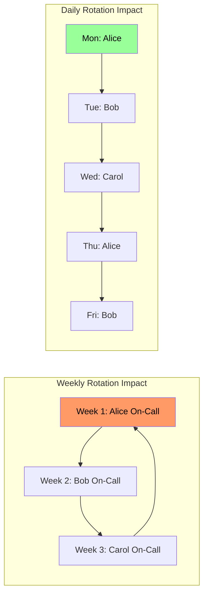
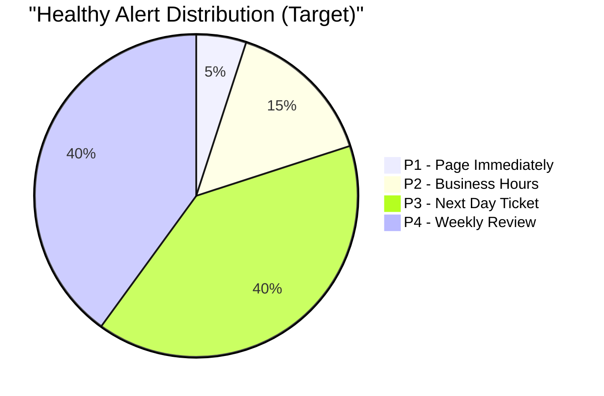
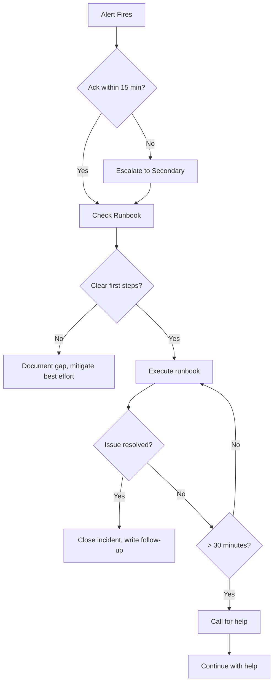
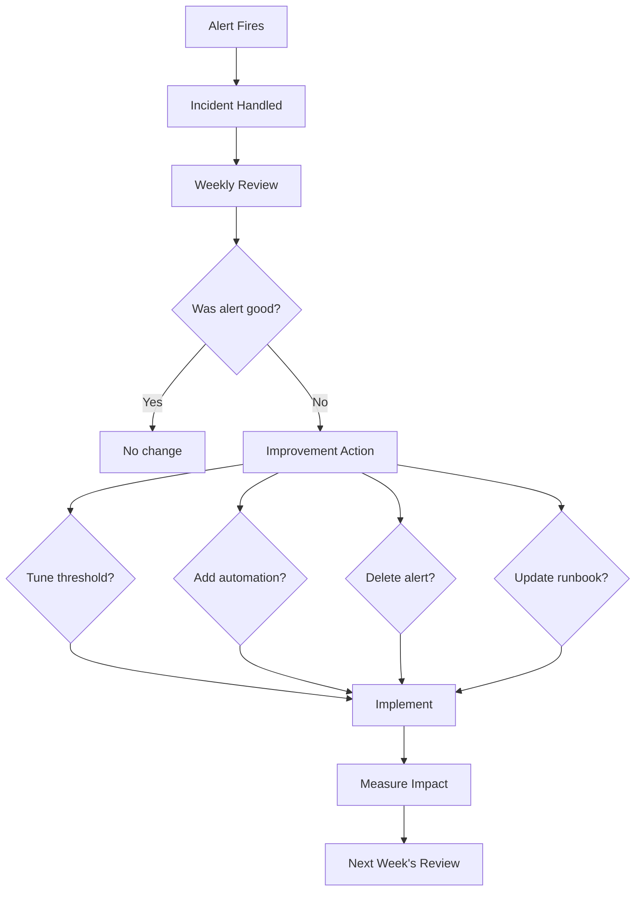

*[SLO]: Service Level Objective
*[SLA]: Service Level Agreement
*[SLI]: Service Level Indicator
*[MTTR]: Mean Time To Recovery
*[MTTA]: Mean Time To Acknowledge
*[PagerDuty]: Incident management platform
*[SNR]: Signal-to-Noise Ratio
*[TOIL]: Repetitive, automatable operational work

# On-Call for Small Teams: Surviving With Three

## Introduction

Frame the small team on-call challenge: large organizations spread on-call across dozens of engineers, with follow-the-sun coverage and backup rotations. A team of three doesn't have that luxury. One person on call for a week means 33% of the team is degraded. Two consecutive pages in a night means one-third of the team is exhausted tomorrow. Alert fatigue hits harder when there's no one to share the load. This section establishes that small team on-call isn't about copying enterprise playbooks—it's about ruthless prioritization of what actually needs human attention at 3 AM versus what can wait until morning.

_Include a scenario: a three-person team copies the on-call setup from their previous larger company. Week-long rotations, page on every error spike, escalation to the whole team if primary doesn't respond. Within two months, all three are burned out. One person had 47 pages in a week—most were transient issues that resolved themselves. They rebuild: daily rotations instead of weekly, aggressive alert suppression, and a policy that nothing non-critical pages outside business hours. Pages drop to 2-3 per week. The lesson: small teams need smaller alert surfaces, not smaller rotations._

<Callout type="warning">
The biggest on-call mistake for small teams: treating every alert as equally urgent. When you have three people, you can't afford to wake someone up for something that could wait 8 hours.
</Callout>

## Rotation Design for Small Teams

### Rotation Length Tradeoffs

```yaml title="rotation-patterns.yaml"
# Rotation patterns for small teams

rotation_lengths:
  weekly:
    pattern: "Monday 9am to Monday 9am"
    pros:
      - "Clear ownership"
      - "Fewer handoffs"
      - "Context stays with one person"
    cons:
      - "Exhausting if pages are frequent"
      - "One bad week affects whole week"
      - "33% of team impacted for full week"
    suitable_when: "< 5 pages per week on average"

  daily:
    pattern: "9am to 9am next day"
    pros:
      - "Bad nights don't compound"
      - "Recovery time between shifts"
      - "More equitable distribution"
    cons:
      - "More handoffs (context loss)"
      - "Complex incident spanning multiple shifts"
      - "More scheduling overhead"
    suitable_when: "5-15 pages per week, or variable load"

  business_hours_only:
    pattern: "9am to 6pm weekdays"
    pros:
      - "No night pages"
      - "Sustainable indefinitely"
      - "Normal sleep schedules"
    cons:
      - "Delayed response to night incidents"
      - "May violate SLAs"
      - "Weekend gaps"
    suitable_when: "Non-critical services, or acceptable degraded response"

  hybrid:
    pattern: "Business hours primary + night/weekend severity filter"
    implementation:
      business_hours: "All alerts to on-call"
      after_hours: "Only critical alerts page"
      weekends: "Only P1 incidents page"
    pros: ["Balance of coverage and sustainability"]
    cons: ["More complex routing rules"]

---
# Three-person rotation example
three_person_rotation:
  week_1:
    primary: "Alice"
    secondary: "Bob"
    off: "Carol"
  week_2:
    primary: "Bob"
    secondary: "Carol"
    off: "Alice"
  week_3:
    primary: "Carol"
    secondary: "Alice"
    off: "Bob"

  rules:
    - "Primary handles all pages"
    - "Secondary only if primary doesn't acknowledge in 15 min"
    - "Off person is truly off—no escalation except disaster"
```
Code: Rotation pattern options.


Figure: Rotation pattern comparison.

### Coverage Gap Strategies

```yaml title="coverage-gaps.yaml"
# Handling coverage gaps with small teams

vacation_coverage:
  three_person_team:
    one_on_vacation:
      strategy: "Split between remaining two"
      example: "Alice on vacation, Bob/Carol alternate days"
      compensation: "Extra time off after coverage period"

    two_on_vacation:
      strategy: "This shouldn't happen"
      rule: "Never allow overlapping vacations that leave 1 person"
      alternative: "Hire contractor, borrow from adjacent team, reduce alerting"

  planning:
    - "Calendar blocking for on-call conflicts"
    - "Vacation requests require coverage confirmation"
    - "Minimum 2-week notice for schedule changes"

illness_coverage:
  immediate: "Secondary takes over"
  extended:
    - "Remaining team members split rotation"
    - "Reduce alert sensitivity temporarily"
    - "Escalate to management for additional support"

contractor_backup:
  when: "Extended gaps, multiple vacations, team < 3"
  setup:
    - "Pre-trained contractor with runbook access"
    - "Limited scope: acknowledge and escalate"
    - "Not expected to resolve, just to notify"
  cost: "Worth it to prevent burnout"

---
# Follow-the-sun (sort of) for distributed teams
distributed_coverage:
  scenario: "Team members in different timezones"

  example:
    alice: "US Pacific (UTC-8)"
    bob: "US Eastern (UTC-5)"
    carol: "Europe (UTC+1)"

  natural_coverage:
    - "Carol: 6am-2pm UTC (her 7am-3pm)"
    - "Bob: 2pm-7pm UTC (his 9am-2pm)"
    - "Alice: 7pm-2am UTC (her 11am-6pm)"
    - "Gap: 2am-6am UTC (everyone sleeping)"

  gap_strategy: "2am-6am UTC routes to lower severity only"
```
Code: Coverage gap strategies.

<Callout type="info">
A three-person team should never have more than one person on vacation at the same time. This isn't about being strict—it's about keeping on-call sustainable for the people who remain.
</Callout>

## Alert Hygiene and Prioritization

### Alert Severity Levels

```yaml title="alert-severity.yaml"
# Alert severity definitions for small teams

severity_levels:
  p1_critical:
    definition: "Service is down or severely degraded for users"
    examples:
      - "Homepage returning 500 errors"
      - "Payment processing failing"
      - "Database unreachable"
    response: "Immediate page, any time of day"
    target_response: "< 15 minutes"
    frequency_goal: "< 1 per week"

  p2_high:
    definition: "Significant degradation but service functional"
    examples:
      - "Elevated error rate (5% of requests)"
      - "One of three replicas down"
      - "Performance degraded 2x normal"
    response: "Page during business hours, notify after hours"
    target_response: "< 1 hour (business hours)"
    frequency_goal: "< 5 per week"

  p3_medium:
    definition: "Issue needs attention but not urgent"
    examples:
      - "Disk usage at 80%"
      - "Certificate expiring in 14 days"
      - "Elevated but stable error rate"
    response: "Ticket, address next business day"
    target_response: "< 1 business day"
    frequency_goal: "No limit (tickets, not pages)"

  p4_low:
    definition: "Informational, trend monitoring"
    examples:
      - "Traffic 20% above normal"
      - "New warning in logs"
      - "Dependency updated"
    response: "Log, review in weekly review"
    target_response: "Weekly"
    frequency_goal: "Informational only"

---
# Page budget
page_budget:
  concept: "Limit total pages per rotation"

  three_person_team_budget:
    weekly_target: "< 5 pages per person per week"
    nightly_target: "< 1 page per night on average"

  exceeding_budget:
    immediate: "Review and tune offending alerts"
    chronic: "Stop adding features, fix alerting"

  tracking:
    metrics:
      - "Pages per week per person"
      - "Pages by hour of day"
      - "Pages by alert type"
      - "Pages resolved without action"
```
Code: Alert severity definitions.

### Signal vs. Noise Analysis

```yaml title="alert-analysis.yaml"
# Analyzing alert quality

signal_to_noise:
  definition: "Percentage of alerts that required action"

  calculation: |
    SNR = (Alerts requiring human action) / (Total alerts) * 100

  targets:
    healthy: "> 80% actionable"
    concerning: "50-80% actionable"
    broken: "< 50% actionable"

  example:
    total_pages_this_month: 60
    required_action: 35
    auto_resolved: 20
    false_positive: 5
    snr: "58% - concerning, needs work"

---
# Alert audit process
alert_audit:
  frequency: "Weekly, during on-call handoff"

  questions_per_alert:
    - "Did this require human action?"
    - "Could it have been prevented?"
    - "Could it have waited until morning?"
    - "Was the runbook sufficient?"
    - "Should this alert exist at all?"

  outcomes:
    tune_threshold: "Alert too sensitive"
    add_automation: "Alert should auto-remediate"
    delete_alert: "Alert provides no value"
    promote_severity: "More urgent than current level"
    demote_severity: "Less urgent than current level"
    improve_runbook: "Unclear what to do"

---
# Common noise sources
noise_sources:
  flapping_alerts:
    symptom: "Alert fires and resolves repeatedly"
    cause: "Threshold at natural variance boundary"
    fix: "Add hysteresis, increase threshold, add duration"

  transient_spikes:
    symptom: "Brief spike triggers alert, resolves before ack"
    cause: "No sustained duration requirement"
    fix: "Require condition for N minutes before alerting"

  deployment_alerts:
    symptom: "Every deployment triggers alerts"
    cause: "Deployment causes expected transient errors"
    fix: "Suppress during deployments, or fix deployment"

  dependency_alerts:
    symptom: "Alert on issues you can't fix"
    cause: "Alerting on third-party service health"
    fix: "Alert on impact to your service, not dependency status"
```
Code: Alert quality analysis.


Figure: Target alert severity distribution.

| Alert Outcome | Percentage | Action |
|---------------|------------|--------|
| Required immediate action | > 70% | Good alert |
| Auto-resolved before ack | < 15% | Add duration requirement |
| False positive | < 5% | Fix detection logic |
| Could have waited | < 10% | Demote severity |

Table: Alert quality targets.

<Callout type="warning">
If more than 30% of your pages auto-resolve before anyone can respond, your alerting is broken. You're training your team to ignore pages—the worst possible outcome.
</Callout>

## Escalation Policies

### Designing Escalation Chains

```yaml title="escalation-policies.yaml"
# Escalation policy design for small teams

escalation_tiers:
  tier_1:
    who: "Primary on-call"
    timeout: "10-15 minutes"
    method: "Push notification + phone call"
    expectation: "Acknowledge and begin investigation"

  tier_2:
    who: "Secondary on-call"
    timeout: "10 minutes after tier 1 timeout"
    method: "Push notification + phone call"
    expectation: "Take over if primary unavailable"

  tier_3:
    who: "Engineering manager or team lead"
    timeout: "15 minutes after tier 2"
    method: "Phone call"
    expectation: "Coordinate response, call in help"
    note: "Should rarely reach here"

---
# PagerDuty-style configuration
pagerduty_config:
  escalation_policy:
    name: "Small Team Escalation"
    repeat_enabled: true
    num_loops: 2

    escalation_rules:
      - escalation_delay_in_minutes: 0
        targets:
          - type: "schedule_reference"
            id: "primary_schedule"

      - escalation_delay_in_minutes: 15
        targets:
          - type: "schedule_reference"
            id: "secondary_schedule"

      - escalation_delay_in_minutes: 30
        targets:
          - type: "user_reference"
            id: "engineering_manager"

---
# Escalation anti-patterns
anti_patterns:
  everyone_every_time:
    problem: "All three team members paged simultaneously"
    impact: "All three wake up, only one needed"
    fix: "Sequential escalation with reasonable timeouts"

  too_fast_escalation:
    problem: "Escalates after 2 minutes"
    impact: "Secondary paged before primary can respond"
    fix: "15 minutes is reasonable for most situations"

  no_escalation:
    problem: "Only primary is ever paged"
    impact: "If primary is unavailable, incident goes unhandled"
    fix: "Always have escalation path"

  manager_too_early:
    problem: "Manager paged on tier 2"
    impact: "Manager doesn't need to be in every incident"
    fix: "Manager is tier 3, for coordination only"
```
Code: Escalation policy design.

### After-Hours Filtering

```yaml title="after-hours-filtering.yaml"
# Time-based alert routing

time_based_routing:
  business_hours:
    definition: "Monday-Friday, 9am-6pm local"
    behavior: "All P1, P2, P3 alerts to on-call"

  after_hours:
    definition: "Evenings, nights, weekends"
    behavior: "Only P1 alerts page on-call"
    p2_handling: "Queue for morning, notify via low-urgency channel"
    p3_handling: "Ticket only, no notification"

---
# Implementation example (PagerDuty)
pagerduty_service_config:
  support_hours:
    type: "use_support_hours"
    time_zone: "America/New_York"
    support_hours:
      - start_time: "09:00:00"
        end_time: "18:00:00"
        day_of_week: 1  # Monday
      - start_time: "09:00:00"
        end_time: "18:00:00"
        day_of_week: 2  # Tuesday
      # ... etc for weekdays

  urgency_rule:
    during_support_hours:
      type: "constant"
      urgency: "high"
    outside_support_hours:
      type: "constant"
      urgency: "low"  # Low urgency = no phone call, just push

---
# Alert routing rules
routing_rules:
  p1_critical:
    business_hours: "Page immediately"
    after_hours: "Page immediately"
    weekends: "Page immediately"

  p2_high:
    business_hours: "Page immediately"
    after_hours: "Slack notification, no page"
    weekends: "Slack notification, review Monday"

  p3_medium:
    business_hours: "Slack notification"
    after_hours: "Silent, ticket created"
    weekends: "Silent, ticket created"
```
Code: Time-based alert routing.

<Callout type="success">
The most sustainable small team setup: P1 pages anytime, P2 pages during business hours only, P3 never pages. This simple rule eliminates most unnecessary after-hours disruptions.
</Callout>

## Incident Response for Small Teams

### Streamlined Incident Process

```yaml title="incident-process.yaml"
# Incident response for small teams

incident_flow:
  step_1_acknowledge:
    action: "Acknowledge page within 15 minutes"
    purpose: "Stop escalation, confirm human is aware"
    automation: "PagerDuty mobile app ack"

  step_2_assess:
    action: "Determine severity and scope"
    questions:
      - "What is the user impact?"
      - "How many users affected?"
      - "Is it getting worse?"
    time_limit: "5 minutes to initial assessment"

  step_3_communicate:
    action: "Post to incident channel"
    template: |
      🔴 Incident: [Brief description]
      Impact: [User-facing impact]
      Status: Investigating
      On-call: [Your name]
    when: "P1 and P2 incidents"

  step_4_mitigate:
    action: "Stop the bleeding"
    options:
      - "Rollback recent deployment"
      - "Scale up resources"
      - "Enable maintenance mode"
      - "Redirect traffic"
    principle: "Mitigate first, root cause later"

  step_5_resolve:
    action: "Confirm service restored"
    verification:
      - "Monitoring shows green"
      - "Spot check user flows"
      - "No new error reports"
    communication: "Update incident channel with resolution"

  step_6_follow_up:
    action: "Create post-incident ticket"
    contents:
      - "Timeline of incident"
      - "Root cause if known"
      - "Action items"
    timing: "Within 24 hours"

---
# Solo incident handling
solo_incident:
  reality: "Small teams often handle incidents alone"

  guidelines:
    - "Don't panic—most incidents are recoverable"
    - "Mitigate first, investigate later"
    - "Document as you go (incident channel)"
    - "Know when to escalate/call for help"

  escalation_triggers:
    - "Incident lasting > 30 minutes"
    - "You don't know how to proceed"
    - "Impact is severe and growing"
    - "You need someone to take over"

  calling_for_help:
    how: "Page secondary via escalation"
    what_to_say: "Need help with [incident]. Current status: [X]. I need: [specific ask]"
```
Code: Incident response process.

### Runbook Requirements

```yaml title="runbook-requirements.yaml"
# Runbook standards for small teams

runbook_essentials:
  every_alert_needs:
    - "What this alert means (plain English)"
    - "Why we alert on this"
    - "First three things to check"
    - "How to mitigate (if known)"
    - "When to escalate"
    - "Who owns this system"

  template: |
    # Alert: [Alert Name]

    ## What This Means
    [Plain English description of what triggered this alert]

    ## Impact
    [What users experience when this fires]

    ## First Response
    1. [First thing to check/do]
    2. [Second thing to check/do]
    3. [Third thing to check/do]

    ## Mitigation
    - Option A: [Command or action]
    - Option B: [Alternative if A doesn't work]

    ## Escalation
    - Escalate if: [Specific conditions]
    - Contact: [Person or team]

    ## Related
    - Dashboard: [Link]
    - Logs: [Link to log query]
    - Previous incidents: [Link to past incidents]

---
# Runbook anti-patterns
anti_patterns:
  empty_runbook:
    problem: "Alert has no runbook"
    impact: "On-call doesn't know what to do"
    fix: "No alert goes live without runbook"

  outdated_runbook:
    problem: "Commands reference old systems"
    impact: "On-call wastes time with wrong information"
    fix: "Review runbooks quarterly"

  novel_required:
    problem: "Runbook is too long to read at 3 AM"
    impact: "On-call skips it, makes mistakes"
    fix: "First response section must be < 1 page"

  expert_assumed:
    problem: "Runbook assumes deep system knowledge"
    impact: "Juniors can't respond effectively"
    fix: "Write for someone who's never seen this before"
```
Code: Runbook requirements.


Figure: Incident response flow.

<Callout type="info">
The best runbooks are written right after an incident, while the pain is fresh. Make "update runbook" a standard post-incident action item.
</Callout>

## Preventing Burnout

### Recognizing Burnout Signs

```yaml title="burnout-recognition.yaml"
# Burnout indicators for on-call teams

burnout_indicators:
  individual_signs:
    behavioral:
      - "Acknowledging alerts but not investigating"
      - "Delayed response times increasing"
      - "Snoozing instead of addressing"
      - "Resentment in handoff meetings"

    emotional:
      - "Dread when on-call shift approaches"
      - "Anxiety about phone notifications"
      - "Feeling like you can never disconnect"
      - "Cynicism about alert value"

    physical:
      - "Sleep disruption persisting off rotation"
      - "Exhaustion not recovering between shifts"
      - "Physical stress symptoms"

  team_signs:
    - "Increasing alert suppression/snoozing"
    - "Runbooks not being updated"
    - "Post-incident reviews skipped"
    - "Turnover or transfer requests"
    - "Reluctance to join on-call rotation"

---
# Warning thresholds
thresholds:
  pages_per_shift:
    healthy: "< 3"
    concerning: "3-7"
    unsustainable: "> 7"

  night_pages_per_week:
    healthy: "< 1"
    concerning: "1-3"
    unsustainable: "> 3"

  alert_fatigue_ratio:
    healthy: "< 20% auto-resolved"
    concerning: "20-40% auto-resolved"
    unsustainable: "> 40% auto-resolved"
```
Code: Burnout indicators.

### Sustainable Practices

```yaml title="sustainable-practices.yaml"
# Sustainable on-call practices

compensation:
  time_off:
    per_page: "Optional: 30 min flex time per page"
    per_night_page: "Recommended: late start next day"
    rough_week: "Recovery day after high-page rotation"

  financial:
    on_call_stipend: "$X per week on rotation"
    page_bonus: "$Y per page outside business hours"
    note: "Compensation doesn't replace fixing alerting"

  recognition:
    - "Acknowledge good incident handling publicly"
    - "Track and celebrate reduced page counts"
    - "Include on-call load in performance reviews"

boundaries:
  protected_time:
    - "One person fully off rotation at all times"
    - "No on-call during PTO (obvious but violated)"
    - "Post-incident rest if rough night"

  response_expectations:
    - "15 minutes to acknowledge is fine"
    - "Don't expect instant response"
    - "Night pages should be rare"

  escalation_permission:
    - "Always okay to escalate if unsure"
    - "Calling for help is not failure"
    - "Management owns systemic issues, not individuals"

---
# On-call improvements as team priority
improvement_priority:
  principle: "On-call quality is team health"

  practices:
    weekly_review:
      content: "Review all pages from past week"
      outcome: "Action items to reduce/improve alerts"
      owner: "Rotates with on-call"

    quarterly_deep_dive:
      content: "Trend analysis, burnout check, policy review"
      outcome: "Larger improvements, rotation changes"

    alert_budget_enforcement:
      rule: "If page budget exceeded, stop feature work"
      rationale: "Reliability debt is real debt"
```
Code: Sustainable practices.

| Practice | Implementation | Impact |
|----------|----------------|--------|
| Late start after night page | Start at 11am instead of 9am | Recovery time |
| Page budget | Stop features if > N pages/week | Forces alert quality |
| Weekly review | 30 min handoff meeting | Continuous improvement |
| Off rotation person | Always 1 of 3 fully off | Sustainable coverage |

Table: Sustainability practices.

<Callout type="warning">
Compensation doesn't fix bad alerting. If you're paying people extra to endure an unsustainable page volume, you're treating the symptom. Fix the alerts first, then set reasonable compensation for the remaining load.
</Callout>

## Tools and Automation

### PagerDuty Configuration

```yaml title="pagerduty-setup.yaml"
# PagerDuty setup for small teams

schedules:
  primary_rotation:
    name: "Primary On-Call"
    type: "weekly"
    users: ["alice", "bob", "carol"]
    rotation_turn_length_seconds: 604800  # 1 week
    start: "2024-01-01T09:00:00-05:00"

  secondary_rotation:
    name: "Secondary On-Call"
    type: "weekly"
    users: ["bob", "carol", "alice"]  # Offset by 1
    rotation_turn_length_seconds: 604800
    start: "2024-01-01T09:00:00-05:00"

services:
  production_api:
    name: "Production API"
    escalation_policy: "small_team_escalation"
    alert_creation: "create_alerts_and_incidents"

    support_hours:
      type: "use_support_hours"
      days: ["mon", "tue", "wed", "thu", "fri"]
      start_time: "09:00"
      end_time: "18:00"

    urgency_rules:
      during_support_hours:
        urgency: "high"
      outside_support_hours:
        urgency: "low"  # P1 overrides this via routing

event_rules:
  # Route P1 as high urgency always
  - condition: "severity = critical"
    actions:
      - set_urgency: "high"

  # Route P2 as low urgency after hours
  - condition: "severity = warning AND outside_support_hours"
    actions:
      - set_urgency: "low"

  # Suppress known noisy alerts
  - condition: "dedup_key matches 'known_flaky_*'"
    actions:
      - suppress: true
```
Code: PagerDuty configuration.

### Automation for Alert Reduction

```yaml title="alert-automation.yaml"
# Automation to reduce alert volume

auto_remediation:
  disk_space:
    trigger: "disk_usage > 85%"
    action: "Run cleanup script"
    implementation: |
      # Rundeck job or Lambda
      - Clear /tmp older than 7 days
      - Rotate logs
      - Clear package caches
    escalate_if: "Still > 85% after cleanup"

  certificate_renewal:
    trigger: "cert_expiry < 14 days"
    action: "Run cert-manager renewal"
    implementation: |
      - Trigger cert-manager to renew
      - Verify new cert installed
    escalate_if: "Renewal fails"

  pod_restart:
    trigger: "pod_unhealthy for > 5 minutes"
    action: "Delete pod (Kubernetes restarts)"
    implementation: |
      - kubectl delete pod $POD_NAME
      - Wait for replacement
      - Verify health
    escalate_if: "Replacement also unhealthy"
    limit: "Max 2 restarts per hour"

---
# Auto-resolve patterns
auto_resolve:
  transient_errors:
    condition: "error_rate > 5% for < 3 minutes"
    action: "Suppress alert if resolves within 5 minutes"
    rationale: "Brief spikes during deployments are expected"

  self_healing:
    condition: "Alert resolves before acknowledgment"
    action: "Close automatically, log for review"
    tracking: "If > 20% auto-resolve, tune threshold"

---
# Deduplication
deduplication:
  strategy: "Deduplicate by service + alert type"

  example:
    alert_1: "High CPU on web-server-1"
    alert_2: "High CPU on web-server-2"
    alert_3: "High CPU on web-server-3"

    without_dedup: "3 separate pages"
    with_dedup: "1 page: High CPU on web-server (3 instances)"

  implementation:
    dedup_key: "${service}-${alert_type}"
    time_window: "5 minutes"
```
Code: Alert automation.

<Callout type="success">
Every alert that can be auto-remediated should be. If the fix is "restart the service," automate it. Human attention is the scarcest resource on a small team.
</Callout>

## Metrics and Improvement

### On-Call Health Dashboard

```yaml title="oncall-metrics.yaml"
# Metrics for on-call health

key_metrics:
  page_volume:
    metric: "Pages per week per person"
    target: "< 5"
    alert: "> 10 triggers review"

  response_time:
    metric: "Time to acknowledge (P50, P95)"
    target: "P50 < 5 min, P95 < 15 min"
    alert: "P95 > 20 min"

  resolution_time:
    metric: "Time from page to resolution"
    target: "P50 < 30 min"
    varies_by: "Incident severity"

  after_hours_pages:
    metric: "Pages between 10pm and 8am"
    target: "< 1 per week average"
    alert: "> 3 per week"

  auto_resolve_rate:
    metric: "% of pages that auto-resolve"
    target: "< 15%"
    alert: "> 30% indicates noisy alerting"

  signal_to_noise:
    metric: "% of pages requiring action"
    target: "> 80%"
    alert: "< 60% indicates alert quality issues"

---
# Dashboard queries (Prometheus/Grafana)
dashboard_queries:
  pages_per_week:
    query: |
      sum(increase(pagerduty_incidents_total[7d])) by (service)

  response_time_p95:
    query: |
      histogram_quantile(0.95,
        rate(pagerduty_time_to_ack_seconds_bucket[7d])
      )

  after_hours_ratio:
    query: |
      sum(pagerduty_incidents_total{hour=~"22|23|0|1|2|3|4|5|6|7"})
      / sum(pagerduty_incidents_total)
```
Code: On-call metrics.

### Continuous Improvement Process

```yaml title="improvement-process.yaml"
# Continuous improvement for on-call

weekly_review:
  timing: "During on-call handoff"
  duration: "30 minutes"

  agenda:
    1_page_review:
      action: "Review every page from past week"
      questions:
        - "Was this page necessary?"
        - "Could it have been prevented?"
        - "Was the runbook helpful?"
      outcome: "Action items for each problematic page"

    2_metrics_check:
      action: "Review dashboard metrics"
      look_for:
        - "Trends in page volume"
        - "Response time changes"
        - "After-hours page ratio"

    3_action_items:
      action: "Assign improvements"
      examples:
        - "Tune noisy alert X"
        - "Add auto-remediation for Y"
        - "Update runbook for Z"
      tracking: "Add to sprint backlog"

quarterly_review:
  timing: "End of quarter"
  duration: "2 hours"

  agenda:
    - "Trend analysis (quarter over quarter)"
    - "Rotation pattern evaluation"
    - "Burnout assessment (anonymous survey)"
    - "Tool and process evaluation"
    - "Goal setting for next quarter"

  outputs:
    - "Quarterly on-call report"
    - "Rotation changes if needed"
    - "Budget for tooling improvements"
```
Code: Improvement process.


Figure: Continuous improvement cycle.

<Callout type="info">
The goal isn't zero alerts—it's zero unnecessary alerts. A small team can sustainably handle 3-5 high-quality pages per week. The problem is when low-quality alerts consume that budget.
</Callout>

## Conclusion

Summarize the small team on-call philosophy: success isn't about mimicking larger organizations, it's about ruthless focus on what actually needs human attention. Every alert must earn its place in the rotation. Every after-hours page must justify waking someone up. Every incident should improve the system. With three people, you can't afford alert fatigue, unclear runbooks, or unsustainable rotations. The constraints of a small team force discipline that larger teams often lack—when you can't spread the pain across 20 people, you have to actually fix the problems.

<Callout type="success">
The measure of good on-call isn't how many incidents you handle—it's how few incidents require handling. A small team with excellent alert hygiene sleeps better than a large team drowning in noise.
</Callout>

---

## Cover Prompt

### Prompt 1: The Night Watch

Create an image of three people taking turns as a night watchperson, with two sleeping peacefully while one keeps watch from a tower with binoculars. A moon shows phase progression indicating rotation. Alert lights are few and meaningful—no false alarms. Style: night watch rotation, peaceful vigilance, sustainable coverage, 16:9 aspect ratio.

### Prompt 2: The Signal Fire

Design an image of a mountain communication network where signal fires only light for true emergencies. Most peaks are dark and quiet. One fire burns bright while a lone watchperson responds. Nearby, relieved watchpeople rest. Style: signal fire network, meaningful alerts, mountain communication, 16:9 aspect ratio.

### Prompt 3: The Quality Filter

Illustrate a filtration system where many incoming alerts (colorful balls) pass through filters, with only a few critical ones (red) making it through to a bell. Most alerts are captured by automation filters or routed to "morning" and "ticket" buckets. Style: alert filtration, quality focus, automated triage, 16:9 aspect ratio.

### Prompt 4: The Three Guardians

Create an image of three guardian figures in a rotation, with one active (glowing), one resting (dim), and one fully off (faded). A calendar wheel shows their rotation. The active guardian protects a small village (service) from a manageable number of threats. Style: guardian rotation, sustainable protection, team coverage, 16:9 aspect ratio.

### Prompt 5: The Balanced Scale

Design an image of a scale balancing "Alert Volume" on one side against "Team Wellbeing" on the other. The scale is balanced with a small number of high-quality alerts. Discarded noisy alerts pile up below the scale. Three team members observe the balance with satisfaction. Style: balance metaphor, quality vs quantity, team sustainability, 16:9 aspect ratio.
