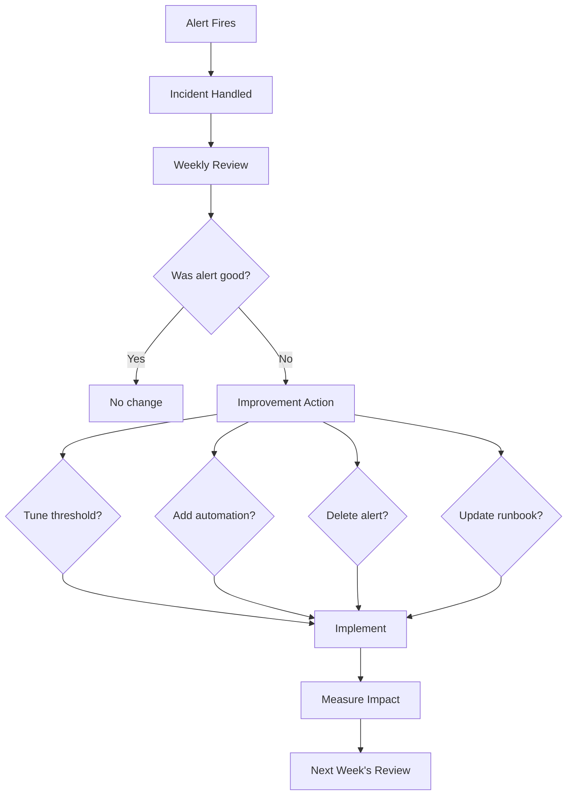

*[MTTA]: Mean Time To Acknowledge
*[MTTR]: Mean Time To Recovery
*[SLA]: Service Level Agreement
*[SLI]: Service Level Indicator
*[SLO]: Service Level Objective
*[SNR]: Signal-to-Noise Ratio

Large organizations spread on-call across dozens of engineers. Follow-the-sun coverage, backup rotations, dedicated incident commanders—it's a luxury of scale. A team of three doesn't have any of that. One person on call for a week means one-third of the team is degraded. Two consecutive pages in a night means one-third of the team is exhausted tomorrow. Alert fatigue hits harder when there's no one to share the load.

I've seen this play out the hard way. A three-person team copies the on-call setup from their previous larger company: week-long rotations, page on every error spike, escalation to the whole team if the primary doesn't respond. Within two months, all three are burned out. One person had 47 pages in a single week—most were transient issues that resolved themselves before anyone could investigate. They were being trained to ignore their pagers.

They rebuilt from scratch. Daily rotations instead of weekly, so a bad night didn't compound into a bad week. Aggressive alert suppression for anything that auto-resolved within five minutes. A hard policy that nothing non-critical pages outside business hours. Pages dropped to 2-3 per week. The team started sleeping again.

The lesson: small team on-call isn't about copying enterprise playbooks with fewer people. It's about ruthless prioritization of what actually needs human attention at 3 AM versus what can wait until morning. When you have three people, you can't afford to wake someone up for something that could wait 8 hours.

<Callout type="warning">
The most dangerous on-call mistake for small teams is treating every alert as equally urgent. Not everything is a 3 AM problem—and pretending otherwise burns out your team in weeks.
</Callout>

## Rotation Design for Small Teams

### Rotation Length Tradeoffs

The rotation length question seems simple—weekly or daily?—but the answer depends on your page volume and how predictable it is.

_Weekly rotations_ work when pages are infrequent (fewer than five per week on average). One person owns the entire week, which means clear accountability and no context lost during handoffs. The downside is brutal: if you get paged six times on Monday night, you still have six more days to go. A bad week compounds. For a three-person team, weekly rotations also mean each person is "on" for a full third of the year.

_Daily rotations_ spread the pain more evenly. A rough night doesn't turn into a rough week—you hand off in the morning and recover. The tradeoff is more handoffs, which means more context loss. If an incident spans multiple days, the person who started it may not be the one who finishes it. Daily rotations work better when page volume is higher or more variable.

_Business-hours-only_ coverage is underrated. If your service can tolerate delayed response to overnight incidents—many internal tools can—this model is indefinitely sustainable. No night pages, normal sleep schedules. The honest conversation is whether your SLAs actually require 24/7 response or whether that's an assumption nobody has questioned.

The hybrid approach combines these: full coverage during business hours, but after hours only critical alerts page. P2 issues queue for morning. This is often the sweet spot for small teams—you're not ignoring problems, but you're also not waking someone up for something that can wait eight hours.

For a three-person team, I recommend this structure regardless of rotation length:

| Role | Responsibility |
|------|----------------|
| Primary | Handles all pages, first responder |
| Secondary | Backup if primary doesn't acknowledge within 15 minutes |
| Off | Truly off—no escalation except declared emergencies |

Table: Three-person rotation roles.

The "off" person being truly off is critical. If everyone is always a potential escalation target, no one ever fully recovers.

### Coverage Gap Strategies

Vacations, illness, and conferences create coverage gaps. With three people, one absence means the remaining two split everything. Two absences leaves one person alone—which is unsustainable for more than a day or two.

The hard rule: _never allow overlapping vacations that leave one person covering alone_. This isn't about being inflexible; it's about preventing burnout. A single person handling all on-call for a week will be exhausted and resentful, and you'll pay for it in turnover.

When one person is out, the remaining two can alternate days or split the week. Whoever covers extra should get compensating time off afterward—not as a favor, but as policy.

If two people need to be out simultaneously (it happens), you have three options:

1. Borrow someone from an adjacent team
2. Hire a contractor for acknowledge-and-escalate coverage
3. Temporarily reduce alerting sensitivity and accept slower response times

For illness, the secondary takes over immediately. If the illness extends beyond a few days, the remaining team members split the rotation and escalate to management for additional support. This is when having runbooks that don't require deep system knowledge pays off—a contractor or borrowed engineer can acknowledge alerts and follow documented escalation paths even without full context.

If your team happens to be distributed across time zones, you get partial follow-the-sun coverage for free. Someone in Europe covers their morning (which is the US overnight), then hands off to US East, then to US West. The gap where everyone is sleeping still exists, but it's narrower.

<Callout type="info">
A three-person team should never have more than one person on vacation at the same time. This isn't about being strict—it's about keeping on-call sustainable for the people who remain.
</Callout>

## Alert Hygiene and Prioritization

Alert quality makes or breaks small team on-call. You can have perfect rotation schedules and beautiful runbooks, but if half your pages are noise, your team will burn out anyway. The math is simple: a three-person team can sustainably handle maybe 3-5 pages per person per week. Waste that budget on false positives and auto-resolving transients, and you've got nothing left for real incidents.

### Alert Severity Levels

Every alert needs a severity level, and that level determines whether it pages, when it pages, and how fast you need to respond. For small teams, I use four levels:

_P1 (Critical)_ means the service is down or severely degraded for users. Homepage returning 500s, payment processing failing, database unreachable. These page immediately, any time of day. Target response is under 15 minutes. If you're getting more than one P1 per week on average, something is fundamentally broken.

_P2 (High)_ is significant degradation but the service is still functional. Elevated error rates, one replica down out of three, performance degraded 2x from baseline. These page during business hours but only notify (no phone call) after hours. Target response is under an hour during business hours.

_P3 (Medium)_ needs attention but isn't urgent. Disk usage at 80%, certificate expiring in 14 days, elevated but stable error rate. These create tickets and get addressed the next business day. They never page.

_P4 (Low)_ is informational. Traffic 20% above normal, new warning in logs, dependency updated. Log these for weekly review. No notification at all.

The distribution matters as much as the definitions. A healthy alert portfolio looks something like 5% P1, 15% P2, 40% P3, and 40% P4. If most of your alerts are P1 or P2, you're either running a genuinely unstable system or you've miscategorized severity.

### Signal vs. Noise Analysis

Signal-to-noise ratio is the percentage of alerts that actually required human action. Calculate it monthly: take the number of pages that required someone to do something divided by total pages. Greater than 80% is healthy. Between 50-80% is concerning. Below 50% means your alerting is broken.

Here's an example from a real team audit:
- 60 total pages this month
- 35 required action
- 20 auto-resolved before anyone could respond
- 5 were false positives
- SNR: 58%—concerning, needs work

That 20 auto-resolved pages number is the killer. If an alert fires and resolves before you can acknowledge it, what did it accomplish? It woke someone up, spiked their cortisol, and then... nothing. Do that enough times and your team learns to ignore pages entirely.

Every week during on-call handoff, review every page from the past week and ask five questions:
1. Did this require human action?
2. Could it have been prevented?
3. Could it have waited until morning?
4. Was the runbook sufficient?
5. Should this alert exist at all?

The answers drive improvements. Alert too sensitive? Tune the threshold. Could be automated? Build auto-remediation. Provided no value? Delete it. The goal is for every alert to earn its place in the rotation.

The most common noise sources are predictable. _Flapping alerts_ fire and resolve repeatedly because the threshold sits at the natural variance boundary—add hysteresis[^hysteresis] or a duration requirement. This is different from _transient spikes_, where an alert fires once but resolves before anyone can acknowledge it; flapping alerts oscillate repeatedly, while transients are one-time blips. For transients, require the condition to persist for N minutes before alerting. _Deployment alerts_ fire on every deploy because deployments cause expected transient errors—suppress during deployments or fix the deployment process. _Dependency alerts_ fire on issues you can't fix—alert on impact to your service, not on whether a third-party API is having a bad day.

[^hysteresis]: Hysteresis means the alert threshold differs depending on direction. An alert might fire when CPU exceeds 90% but only resolve when it drops below 80%. This 10% gap prevents the alert from flapping when CPU hovers around a single threshold value.

| Alert Outcome | Target | Action If Exceeded |
|---------------|--------|-------------------|
| Required immediate action | > 70% | Good alert, keep it |
| Auto-resolved before ack | < 15% | Add duration requirement |
| False positive | < 5% | Fix detection logic |
| Could have waited | < 10% | Demote severity |

Table: Alert quality targets.

<Callout type="warning">
If more than 30% of your pages auto-resolve before anyone can respond, your alerting is broken. You're training your team to ignore pages—the worst possible outcome.
</Callout>

## Escalation Policies

Escalation policies determine what happens when the primary on-call doesn't respond. For small teams, the chain is short but critical—if it fails, incidents go unhandled.

### Designing Escalation Chains

A three-person team needs exactly three escalation tiers:

_Tier 1_ is the primary on-call. They get the initial page via push notification and phone call. The expectation is acknowledgment within 10-15 minutes and beginning investigation.

_Tier 2_ is the secondary on-call. If the primary doesn't acknowledge within the timeout, the secondary gets paged. Same notification method—push plus phone call. Their job is to take over if the primary is unavailable.

_Tier 3_ is the engineering manager or team lead. If neither primary nor secondary responds within 30 minutes total, escalate to management. At this point, the goal isn't necessarily for the manager to fix the problem—it's to coordinate a response and call in additional help if needed.

This should rarely reach tier 3. If it does regularly, something is wrong with your notification setup or your team's responsiveness expectations.

There are a few escalation anti-patterns to avoid. _Paging everyone simultaneously_ is the worst—all three team members wake up at 3 AM, but only one is needed. Use sequential escalation with reasonable timeouts instead. _Escalating too fast_ (after 2 minutes) pages the secondary before the primary has time to find their phone. Fifteen minutes is reasonable for most situations. _No escalation at all_ means if the primary is unavailable, the incident goes unhandled. Always have an escalation path. _Manager too early_ brings management into every incident when they should only be involved for coordination on extended or severe incidents.

### After-Hours Filtering

Time-based routing is what makes small team on-call sustainable. The idea is simple: during business hours, page for P1 and P2 incidents. After hours, page only for P1.

| Severity | Business Hours | After Hours | Weekends |
|----------|---------------|-------------|----------|
| P1 Critical | Page immediately | Page immediately | Page immediately |
| P2 High | Page immediately | Slack notification only | Slack notification only |
| P3 Medium | Slack notification | Silent (ticket created) | Silent (ticket created) |

Table: Time-based alert routing rules.

P2 incidents after hours get a low-urgency notification—Slack message or email, no phone call. The on-call person can check in the morning. This isn't ignoring problems; it's acknowledging that "one replica down" at 2 AM doesn't justify waking someone up when the service is still functional.

Most incident management platforms support this natively. In PagerDuty, you configure support hours on the service and set urgency rules: high urgency during support hours (phone call), low urgency outside (push notification only). Then use event rules to override urgency for P1 alerts—they always get high urgency regardless of time.

<Callout type="success">
The most sustainable small team setup: P1 pages anytime, P2 pages during business hours only, P3 never pages. This simple rule eliminates most unnecessary after-hours disruptions.
</Callout>

## Incident Response for Small Teams

Large teams have incident commanders, communication leads, and subject matter experts who can swarm a problem. Small teams have one person, maybe two, often at 3 AM. The incident process needs to be simple enough to execute solo while half-asleep.

### Streamlined Incident Process

The incident flow has six steps, and the first three happen in the first 20 minutes:

_Step 1: Acknowledge_ within 15 minutes. This stops escalation and confirms a human is aware. Don't investigate yet—just acknowledge.

_Step 2: Assess_ the severity and scope. Three questions: What's the user impact? How many users are affected? Is it getting worse? Spend no more than 5 minutes on initial assessment.

_Step 3: Communicate_ for P1 and P2 incidents. Post to your incident channel with the key details: what's happening, what's the impact, current status, who's handling it. This keeps stakeholders informed without requiring you to answer individual questions.

_Step 4: Mitigate_ before investigating. Stop the bleeding first—rollback a recent deployment, scale up resources, enable maintenance mode, redirect traffic. The goal is restoring service, not understanding root cause. Root cause analysis happens later, when you're not in crisis mode.

_Step 5: Resolve_ by confirming service is restored. Check monitoring, spot-check user flows, verify no new error reports. Update the incident channel with resolution.

_Step 6: Follow up_ within 24 hours by creating a post-incident ticket documenting the timeline, root cause if known, and action items. This doesn't need to be a formal postmortem for every incident, but there should be a record.

### Solo Incident Handling

The reality of small teams: you're often handling incidents alone. Nobody else is awake, nobody else is available. This is fine for most incidents, but you need to know when to call for help.

Don't panic—most incidents are recoverable. Mitigate first, investigate later. Document as you go by posting updates to the incident channel, even if nobody's watching. And critically, know when to escalate.

Call for help when: the incident has lasted more than 30 minutes without progress, you don't know how to proceed, the impact is severe and growing, or you simply need someone to take over so you can think clearly.

When you do call for help, be specific. "Need help with database connection exhaustion. Current status: primary DB at 100% connections, app returning 500s. I need: someone to help identify which service is leaking connections."

### Runbook Requirements

Every alert needs a runbook, and the runbook needs to be useful at 3 AM when you're half-asleep. That means concise, concrete, and assuming minimal context.

A good runbook covers six things:

1. What this alert means in plain English
2. Why we alert on this (what's the user impact)
3. The first three things to check
4. How to mitigate if known
5. When to escalate
6. Who owns this system

The most important section is "First Response"—the first three things to check or do. This section must fit on one page. If your runbook requires reading a novel to understand, it's useless in an incident.

Common runbook anti-patterns:

- __Empty runbooks__ where the alert exists but there's no documentation. Rule: no alert goes live without a runbook.
- __Outdated runbooks__ with commands that reference old systems or defunct processes—review runbooks quarterly.
- __Novel-length runbooks__ that are too long to read at 3 AM—people skip them and make mistakes.
- _Expert-assumed runbooks_ that only make sense if you already know the system—write for someone who's never seen this before.

<Callout type="info">
The best runbooks are written right after an incident, while the pain is fresh. Make "update runbook" a standard post-incident action item.
</Callout>

## Preventing Burnout

On-call burnout is insidious. It doesn't happen all at once—it accumulates over weeks and months until someone quits or transfers. For a three-person team, losing one person to burnout is catastrophic. Prevention is essential.

### Recognizing Burnout Signs

Individual burnout shows up in behavior first. Someone starts acknowledging alerts but not actually investigating them. Response times gradually increase. They snooze alerts instead of addressing them. There's resentment in handoff meetings—subtle comments about the unfairness of the rotation or the quality of alerts.

Emotional signs follow: dread when an on-call shift approaches, anxiety about phone notifications even when off rotation, the feeling that you can never truly disconnect. Eventually physical symptoms emerge—sleep disruption that persists even off rotation, exhaustion that doesn't recover between shifts.

At the team level, watch for increasing alert suppression (people silencing things rather than fixing them), runbooks not being updated, post-incident reviews getting skipped, transfer requests, or reluctance from new hires to join the rotation.

The numbers tell a story too. These thresholds are rough guidelines, but they're useful:

| Metric | Healthy | Concerning | Unsustainable |
|--------|---------|------------|---------------|
| Pages per shift | < 3 | 3-7 | > 7 |
| Night pages per week | < 1 | 1-3 | > 3 |
| Auto-resolve rate | < 20% | 20-40% | > 40% |

Table: On-call health thresholds.

If you're consistently in the "concerning" column, you have time to fix things. If you're in "unsustainable," someone is probably already looking for another job.

### Sustainable Practices

Sustainability comes from three areas: compensation, boundaries, and continuous improvement.

_Compensation_ acknowledges that on-call is real work. Options include flex time (30 minutes per page, used however the person wants), late starts after night pages (come in at 11 AM instead of 9 AM), recovery days after high-page rotations, and financial compensation (stipend per week on rotation, bonus per after-hours page). The specific amounts matter less than having _something_—it signals that the organization recognizes the burden.

But compensation doesn't fix bad alerting. If you're paying people extra to endure an unsustainable page volume, you're treating the symptom while ignoring the disease. Fix the alerts first, then set reasonable compensation for the remaining load.

_Boundaries_ protect recovery time. One person should always be fully off rotation—truly off, not "secondary backup." No on-call during PTO (this seems obvious but gets violated). Post-incident rest if someone had a rough night. Response expectations should be explicit: 15 minutes to acknowledge is fine, instant response isn't expected, and night pages should be rare enough that getting one is notable.

Critically, escalating or calling for help should never be seen as failure. Management owns systemic issues, not individuals. If someone escalates because they're overwhelmed, that's the system working correctly.

_Continuous improvement_ means treating on-call quality as a first-class priority. Weekly reviews during handoff—30 minutes reviewing every page from the past week, generating action items. Quarterly deep dives looking at trends, checking for burnout, and reviewing policies. And the nuclear option: if the page budget is consistently exceeded, stop feature work until alerting is fixed. Reliability debt is real debt.

| Practice | Implementation | Impact |
|----------|----------------|--------|
| Late start after night page | Start at 11am instead of 9am | Recovery time |
| Page budget | Stop features if > N pages/week | Forces alert quality |
| Weekly review | 30 min handoff meeting | Continuous improvement |
| Off rotation person | Always 1 of 3 fully off | Sustainable coverage |

Table: Sustainability practices summary.

<Callout type="info">
The weekly review is the most important sustainability practice. Thirty minutes per week of deliberate improvement compounds into dramatically better on-call within a quarter.
</Callout>

## Tools and Automation

The right tooling makes small team on-call sustainable. The wrong tooling—or no tooling—makes it miserable. You need three things: an incident management platform configured correctly, automation to reduce alert volume, and deduplication to prevent alert storms.

### Incident Management Setup

PagerDuty, Opsgenie, and similar platforms all work for small teams. The specific platform matters less than the configuration. Here's what you need:

_Two schedules_: primary and secondary. The secondary schedule should be offset by one position—if Alice is primary this week, Bob is secondary. This ensures the secondary is always a different person than the primary.

_Support hours_ on each service, defining when business hours are. This enables different urgency rules during and outside business hours.

_Event rules_ to route alerts by severity. P1 (critical) alerts should always be high urgency regardless of time. P2 (warning) alerts should be high urgency during business hours, low urgency after hours. Low urgency means push notification only—no phone call.

_Suppression rules_ for known noisy alerts. If you have an alert that's flaky and you haven't fixed it yet, suppress it rather than training your team to ignore pages. (Then actually fix it—see the Alert Hygiene section for how to systematically address noise sources.)

### Automation for Alert Reduction

Every alert that can be auto-remediated should be. Human attention is the scarcest resource on a small team—don't waste it on problems that a script can solve.

Common candidates for auto-remediation:

_Disk space alerts_: When disk usage exceeds 85%, automatically clear /tmp files older than 7 days, rotate logs, and clear package caches. Only escalate to a human if usage is still high after cleanup.

_Certificate expiration_: When a certificate is within 14 days of expiry, trigger cert-manager to renew it. Only page if renewal fails.

_Unhealthy pods_: When a Kubernetes pod is unhealthy for more than 5 minutes, delete it and let the scheduler create a replacement. Only page if the replacement is also unhealthy. Limit auto-restarts to 2 per hour to prevent infinite loops.

The pattern is consistent: try automatic remediation first, escalate to human only if automation fails. This dramatically reduces page volume for well-understood problems.

_Deduplication_ is equally important. If you have three web servers and all three experience high CPU simultaneously, you don't need three pages—you need one page that says "High CPU on web-server (3 instances)." Configure your alerting to deduplicate by service and alert type within a time window (typically 5 minutes).

<Callout type="success">
Automate everything with a known fix. If the remediation is "restart the service" or "clear the cache," a script should handle it. Save the pages for problems that genuinely need a human brain.
</Callout>

## Metrics and Improvement

### On-Call Health Dashboard

You can't improve what you don't measure. Build a simple dashboard that tracks six key metrics:

| Metric | Target | Alert threshold |
|--------|--------|-----------------|
| Pages per week per person | < 5 | > 10 triggers review |
| Time to acknowledge (P95) | < 15 min | > 20 min |
| Time to resolution (P50) | < 30 min | Varies by severity |
| After-hours pages | < 1/week average | > 3/week |
| Auto-resolve rate | < 15% | > 30% indicates noise |
| Signal-to-noise ratio | > 80% | < 60% indicates quality issues |

_Page volume_ is your primary health indicator. More than 10 pages per person per week is unsustainable—that's two pages per day, every day, on top of regular work.

_Response time_ measures team engagement. If P95 acknowledgment time is creeping up, people are either overwhelmed or checked out. Either way, it's a warning sign.

_After-hours pages_ deserve special tracking because they're disproportionately costly. One 3am page has more impact on a person than three 2pm pages.

_Auto-resolve rate_ is counterintuitive—you want it low. If more than 30% of your alerts resolve before anyone acknowledges them, your thresholds are too sensitive. You're paging people for things that fix themselves.

### Collecting and Visualizing Metrics

The metrics in your dashboard come from two sources: your incident management platform (PagerDuty, Opsgenie, etc.) and your own instrumentation.

_Incident management data_ requires an exporter. For PagerDuty, the [pagerduty-exporter](https://github.com/webdevops/pagerduty-exporter) scrapes the PagerDuty API and exposes metrics in Prometheus format. Opsgenie has similar community exporters. These give you incident counts, acknowledgment times, and resolution times—the core of your dashboard.

Run the exporter as a sidecar or standalone service that scrapes your incident management API on a schedule (typically every 60 seconds). The exporter authenticates with a read-only API token and exposes metrics on a `/metrics` endpoint that Prometheus scrapes.

_Signal-to-noise ratio_ requires manual tagging. During your weekly review, categorize each incident as "actionable" or "noise." Store this in a simple database or spreadsheet, then expose it as a Prometheus gauge via a custom exporter or pushgateway. This metric can't be fully automated—it requires human judgment about whether an alert was worth the interruption.

_Auto-resolve tracking_ comes from your incident management platform's webhook events. When an incident resolves, check whether it was ever acknowledged. If it resolved before acknowledgment, increment a counter. Most platforms expose this via their API or webhook payloads.

Here's a minimal Prometheus configuration for scraping PagerDuty metrics:

```yaml title="prometheus.yml"
global:
  scrape_interval: 60s
  evaluation_interval: 60s

scrape_configs:
  - job_name: 'pagerduty'
    static_configs:
      - targets: ['pagerduty-exporter:9503']
    scrape_interval: 60s
    scrape_timeout: 30s

  - job_name: 'oncall-custom'
    static_configs:
      - targets: ['oncall-metrics:9090']
    # Custom metrics: SNR, categorized incidents
```
Code: Prometheus scrape configuration for on-call metrics.

With metrics flowing into Prometheus, build your Grafana dashboard with these queries:

```promql title="dashboard-queries.promql"
# Pages per week by service
sum(increase(pagerduty_incidents_total[7d])) by (service)

# Acknowledgment time P95
histogram_quantile(0.95, rate(pagerduty_time_to_ack_seconds_bucket[7d]))

# After-hours ratio - requires recording rule or label enrichment
# Add 'hour' label via Prometheus recording rules from created_at timestamp
sum(oncall_incidents_after_hours_total[7d])
  / sum(pagerduty_incidents_total[7d])

# Auto-resolve rate
sum(rate(oncall_incidents_auto_resolved_total[7d]))
  / sum(rate(pagerduty_incidents_total[7d]))
```
Code: PromQL queries for on-call health dashboard.

For teams not using Prometheus, PagerDuty's built-in analytics and Opsgenie's reports provide most of these metrics directly. The tradeoff is less customization and no unified dashboard with your application metrics. If you're already running Prometheus for application monitoring, adding on-call metrics keeps everything in one place.

### Continuous Improvement Process

Metrics are useless without a process to act on them. Two reviews keep on-call healthy: weekly handoffs and quarterly retrospectives.

The _weekly review_ happens during on-call handoff—the outgoing person meets with the incoming person for 30 minutes. Go through every page from the past week and ask three questions: Was this page necessary? Could it have been prevented? Was the runbook helpful? Every problematic page should generate an action item: tune a threshold, add automation, update a runbook, or delete an alert entirely.

Also review the dashboard metrics briefly. Look for trends in page volume, response time changes, and after-hours page ratio. If any metric crossed an alert threshold, discuss why.

The _quarterly review_ takes longer—about two hours—and looks at bigger patterns. Review quarter-over-quarter trends. Evaluate whether the rotation pattern is still working. Run an anonymous burnout assessment. Discuss tooling needs and set goals for the next quarter.


Figure: Continuous improvement cycle.

<Callout type="info">
The goal isn't zero alerts—it's zero unnecessary alerts. A small team can sustainably handle 3-5 high-quality pages per week. The problem is when low-quality alerts consume that budget.
</Callout>

## Conclusion

The team I mentioned at the start—the one with 47 pages in a week—didn't fix their on-call by hiring more people. They fixed it by being honest about what actually needed a human at 3 AM. The answer was far less than they'd assumed.

That's the core insight of small team on-call: constraints force clarity. Large organizations can absorb bad alerting by spreading it across enough people that no individual notices the rot. A team of three can't hide from their mistakes. Every unnecessary page is felt. Every burned-out engineer is visible. Every process failure has immediate consequences.

This pain is useful. It creates pressure to build systems that genuinely don't need constant human intervention—not systems that tolerate human intervention because there are enough humans available. The team of three that gets on-call right builds better automation, writes clearer runbooks, and maintains tighter alert hygiene than most teams three times their size.

If you take one thing from this article, make it the weekly review. Thirty minutes during each handoff, asking three questions about every page: Was it necessary? Could it have been prevented? Could it have waited? That single practice, consistently applied, transforms on-call from a burden into a feedback loop that makes your systems better every week.

### Getting Started Checklist

If you're rebuilding your on-call from scratch, here's where to begin:

1. Calculate your current signal-to-noise ratio. What percentage of pages required action?
2. Implement after-hours filtering: P1 pages anytime, P2 during business hours only
3. Schedule your first weekly review during the next on-call handoff
4. Pick one high-volume alert and either tune it, automate it, or delete it
5. Set up basic metrics: page volume per person per week, auto-resolve rate

The goal isn't perfect on-call on day one. It's establishing the feedback loop that gets you there.

<Callout type="success">
The measure of good on-call isn't how many incidents you handle—it's how few incidents require handling. A small team with excellent alert hygiene sleeps better than a large team drowning in noise.
</Callout>
