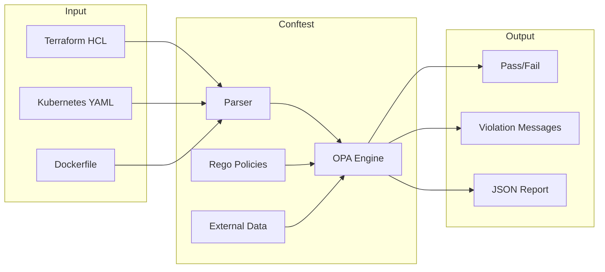
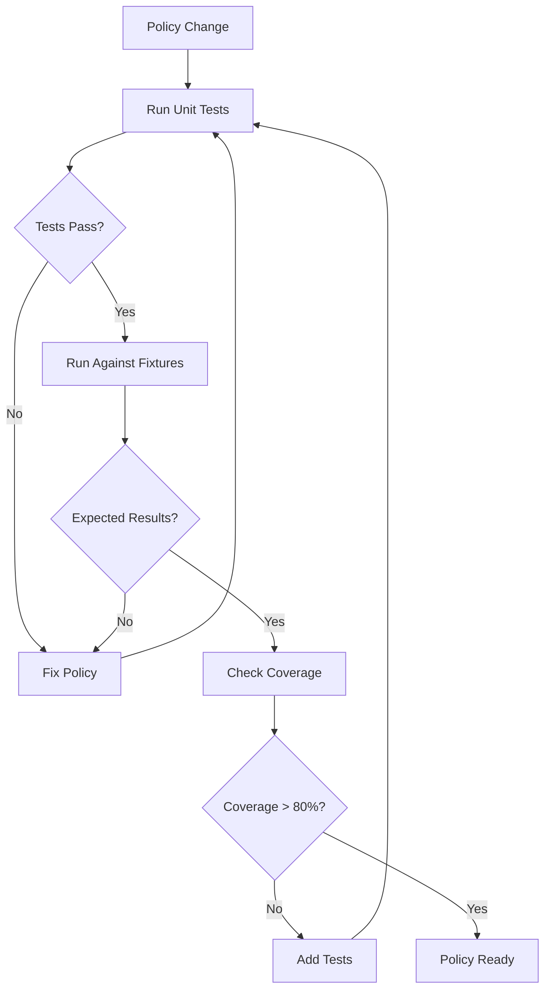
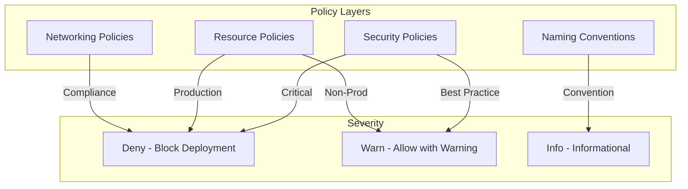

*[OPA]: Open Policy Agent
*[IaC]: Infrastructure as Code
*[CI]: Continuous Integration
*[CD]: Continuous Deployment
*[PR]: Pull Request
*[RBAC]: Role-Based Access Control
*[JSON]: JavaScript Object Notation
*[YAML]: YAML Ain't Markup Language
*[API]: Application Programming Interface
*[K8s]: Kubernetes

# Policy as Code: OPA Guardrails With Fast Feedback

## Introduction

Frame the policy-as-code challenge: infrastructure guardrails are only effective if they catch violations before deployment. A policy that only fires in production—blocking a release at 5 PM on Friday—creates friction and gets bypassed. A policy that takes 10 minutes to evaluate in CI gets skipped for "urgent" changes. The goal is shift-left policy enforcement: catch violations in the editor, in pre-commit hooks, in PR checks—anywhere before code merges. OPA (Open Policy Agent) and Conftest provide the foundation, but implementation details determine whether policies become trusted guardrails or ignored bureaucracy.

_Include a scenario: a platform team implements 50 OPA policies covering Kubernetes manifests, Terraform configurations, and Dockerfiles. Policies are comprehensive but only run in the CD pipeline—after PR merge. Developers learn about violations 30 minutes after merging, have to create fix PRs, and face deployment delays. Adoption is poor; teams ask for exemptions constantly. The team refactors: policies run in pre-commit (< 5 seconds), in PR checks (< 30 seconds), with clear violation messages and fix suggestions. Violation rate drops 80%. The lesson: policy timing and speed matter as much as policy correctness._

<Callout type="warning">
The policy enforcement paradox: policies that run late enough to catch everything are too late to be useful. Policies that run early enough to be useful can't catch everything. The solution is layered enforcement at multiple stages.
</Callout>

## Understanding OPA and Rego

### OPA Architecture

```yaml title="opa-architecture.yaml"
# OPA core concepts

opa_components:
  policy_engine:
    purpose: "Evaluates policies written in Rego"
    input: "JSON data (the thing being evaluated)"
    output: "Decision (allow/deny, violations, etc.)"
    stateless: true

  rego_language:
    purpose: "Declarative policy language"
    paradigm: "Logic programming (Datalog-inspired)"
    features:
      - "Pattern matching"
      - "Set operations"
      - "Comprehensions"
      - "Built-in functions"

  data:
    purpose: "External data for policy decisions"
    examples:
      - "Allowed container registries"
      - "Required labels"
      - "Team ownership mappings"
    loading: "File, HTTP, bundle"

deployment_modes:
  library:
    description: "Embed OPA in your application"
    use_case: "Application-level authorization"

  daemon:
    description: "Run as sidecar or service"
    use_case: "Kubernetes admission control"

  cli:
    description: "Command-line evaluation"
    use_case: "CI/CD policy checks (Conftest)"

---
# Conftest relationship
conftest:
  description: "CLI tool wrapping OPA for configuration testing"
  advantages:
    - "Simpler CLI interface for CI/CD"
    - "Multi-format input parsing (YAML, JSON, HCL, Dockerfile)"
    - "Built-in output formatting"
    - "Policy namespacing"
  relationship: "Uses OPA engine, adds convenience layer"
```
Code: OPA architecture overview.


Figure: Conftest evaluation flow.

### Rego Language Fundamentals

```rego title="rego-basics.rego"
# Rego language fundamentals

package kubernetes.pods

# Import future keywords for cleaner syntax
import future.keywords.if
import future.keywords.in
import future.keywords.contains

# === Basic rule structure ===

# A rule that produces a violation message
deny contains msg if {
    # Access input data (the resource being evaluated)
    input.kind == "Pod"

    # Check a condition
    container := input.spec.containers[_]
    not container.resources.limits

    # Generate violation message
    msg := sprintf("Container '%s' missing resource limits", [container.name])
}

# === Variables and iteration ===

# Iterate over all containers
deny contains msg if {
    input.kind == "Pod"
    container := input.spec.containers[_]  # _ is iteration
    container.securityContext.privileged == true
    msg := sprintf("Container '%s' runs as privileged", [container.name])
}

# === Helper rules ===

# Extract all images from a pod
images contains image if {
    container := input.spec.containers[_]
    image := container.image
}

images contains image if {
    container := input.spec.initContainers[_]
    image := container.image
}

# === Using external data ===

# data.allowed_registries loaded from data file
deny contains msg if {
    image := images[_]
    registry := split(image, "/")[0]
    not registry in data.allowed_registries
    msg := sprintf("Image '%s' from unauthorized registry", [image])
}

# === Comprehensions ===

# Find all containers without limits
containers_without_limits := [name |
    container := input.spec.containers[_]
    not container.resources.limits
    name := container.name
]

# === Negation ===

# Check something does NOT exist
deny contains msg if {
    input.kind == "Deployment"
    not input.spec.selector.matchLabels.app
    msg := "Deployment missing 'app' label in selector"
}
```
Code: Rego language basics.

### Common Rego Patterns

```rego title="rego-patterns.rego"
# Common Rego patterns for infrastructure policies

package common.patterns

import future.keywords.if
import future.keywords.in
import future.keywords.contains

# === Pattern 1: Required fields ===

# Check required labels exist
required_labels := {"app", "team", "environment"}

deny contains msg if {
    input.kind == "Deployment"
    provided := {label | input.metadata.labels[label]}
    missing := required_labels - provided
    count(missing) > 0
    msg := sprintf("Missing required labels: %v", [missing])
}

# === Pattern 2: Allowed values ===

allowed_environments := {"dev", "staging", "prod"}

deny contains msg if {
    env := input.metadata.labels.environment
    not env in allowed_environments
    msg := sprintf("Invalid environment '%s'. Must be one of: %v", [env, allowed_environments])
}

# === Pattern 3: Regex matching ===

# Image tag must be semver
deny contains msg if {
    container := input.spec.containers[_]
    image := container.image
    tag := split(image, ":")[1]
    not regex.match(`^v?\d+\.\d+\.\d+(-.*)?$`, tag)
    msg := sprintf("Image '%s' must use semver tag, not '%s'", [image, tag])
}

# === Pattern 4: Numeric constraints ===

deny contains msg if {
    input.kind == "Deployment"
    replicas := input.spec.replicas
    replicas < 2
    input.metadata.labels.environment == "prod"
    msg := "Production deployments must have at least 2 replicas"
}

# === Pattern 5: Cross-resource validation ===

# Using data loaded from cluster state
deny contains msg if {
    input.kind == "Ingress"
    host := input.spec.rules[_].host
    existing := data.existing_ingresses[_]
    existing.host == host
    existing.namespace != input.metadata.namespace
    msg := sprintf("Host '%s' already used by ingress in namespace '%s'", [host, existing.namespace])
}

# === Pattern 6: Conditional policies ===

# Only enforce in production
deny contains msg if {
    is_production
    input.kind == "Pod"
    container := input.spec.containers[_]
    container.securityContext.runAsRoot == true
    msg := "Production pods cannot run as root"
}

is_production if {
    input.metadata.labels.environment == "prod"
}

is_production if {
    input.metadata.namespace == "production"
}
```
Code: Common Rego patterns.

| Pattern | Use Case | Example |
|---------|----------|---------|
| Required fields | Ensure metadata exists | Labels, annotations |
| Allowed values | Whitelist validation | Registries, namespaces |
| Regex matching | Format validation | Image tags, naming conventions |
| Numeric constraints | Resource limits | Replicas, CPU/memory |
| Cross-resource | Cluster-wide uniqueness | Ingress hosts, service ports |

Table: Common policy patterns.

<Callout type="info">
Rego's power comes from its declarative nature—you describe what violations look like, not how to find them. The engine handles the search. This makes policies readable but requires thinking differently than imperative code.
</Callout>

## Policy Design Principles

### Writing Effective Policies

```yaml title="policy-design.yaml"
# Policy design principles

design_principles:
  single_responsibility:
    description: "Each rule checks one thing"
    bad: |
      # Checks image, resources, AND labels in one rule
      deny[msg] { ... 50 lines ... }
    good: |
      # Separate rules for each concern
      deny_unauthorized_image[msg] { ... }
      deny_missing_resources[msg] { ... }
      deny_missing_labels[msg] { ... }
    benefit: "Clear violations, easier debugging"

  actionable_messages:
    description: "Tell users how to fix, not just what's wrong"
    bad: "Policy violation"
    better: "Container missing resource limits"
    best: "Container 'nginx' missing resource limits. Add spec.containers[].resources.limits.cpu and memory"

  minimal_false_positives:
    description: "Precision over recall"
    principle: "Better to miss some violations than block valid configs"
    approach:
      - "Start permissive, tighten over time"
      - "Test against real configs before enforcing"
      - "Provide escape hatches for edge cases"

  fast_evaluation:
    description: "Policies should evaluate in milliseconds"
    avoid:
      - "External HTTP calls in policies"
      - "Complex regex on large inputs"
      - "Deep recursion"
    prefer:
      - "Pre-loaded data bundles"
      - "Simple pattern matching"
      - "Early termination"

---
# Message formatting standards
message_standards:
  components:
    - "What resource is affected"
    - "What the violation is"
    - "Where in the resource (path)"
    - "How to fix it"

  template: |
    [Resource Type] [Resource Name]: [Violation].
    Fix: [Specific remediation]

  examples:
    - |
      Deployment 'api-server': Missing required label 'team'.
      Fix: Add metadata.labels.team with your team name.
    - |
      Pod 'worker': Container 'app' uses image from unauthorized registry 'docker.io'.
      Fix: Use images from 'gcr.io/company-project' or 'artifactory.company.com'.
```
Code: Policy design principles.

### Policy Organization

```text title="policy-structure.txt"
# Recommended policy directory structure

policies/
├── kubernetes/
│   ├── pods/
│   │   ├── privileged.rego
│   │   ├── resources.rego
│   │   └── images.rego
│   ├── deployments/
│   │   ├── replicas.rego
│   │   └── labels.rego
│   ├── services/
│   │   └── types.rego
│   └── common/
│       ├── labels.rego
│       └── helpers.rego
├── terraform/
│   ├── aws/
│   │   ├── s3.rego
│   │   ├── iam.rego
│   │   └── security_groups.rego
│   ├── gcp/
│   │   └── ...
│   └── common/
│       └── tags.rego
├── docker/
│   ├── base_images.rego
│   └── best_practices.rego
├── data/
│   ├── allowed_registries.json
│   ├── required_labels.json
│   └── team_mappings.json
└── lib/
    ├── helpers.rego
    └── constants.rego
```
Code: Policy directory structure.

```rego title="policy-namespacing.rego"
# Policy namespacing for organization

# === Kubernetes pod policies ===
package kubernetes.pods.security

deny contains msg if {
    # Pod security policies
}

# === Kubernetes pod image policies ===
package kubernetes.pods.images

deny contains msg if {
    # Image validation policies
}

# === Terraform AWS S3 policies ===
package terraform.aws.s3

deny contains msg if {
    # S3 bucket policies
}

# === Shared helper library ===
package lib.helpers

# Helper function available to all policies
is_kubernetes_resource if {
    input.apiVersion
    input.kind
}

has_label(obj, label) if {
    obj.metadata.labels[label]
}
```
Code: Policy namespacing.

<Callout type="success">
Namespace policies by technology (kubernetes, terraform, docker), then by resource type, then by concern. This makes policies discoverable and allows selective evaluation—run only Terraform policies on Terraform files.
</Callout>

## Testing Policies

### Unit Testing Rego

```rego title="policy-tests.rego"
# Unit tests for Rego policies

package kubernetes.pods.resources_test

import future.keywords.if
import data.kubernetes.pods.resources

# === Test fixtures ===

test_pod_with_limits if {
    # This should pass (no violations)
    count(resources.deny) == 0 with input as {
        "kind": "Pod",
        "metadata": {"name": "good-pod"},
        "spec": {
            "containers": [{
                "name": "app",
                "image": "nginx:1.21",
                "resources": {
                    "limits": {"cpu": "100m", "memory": "128Mi"},
                    "requests": {"cpu": "50m", "memory": "64Mi"}
                }
            }]
        }
    }
}

test_pod_without_limits if {
    # This should fail (has violations)
    violations := resources.deny with input as {
        "kind": "Pod",
        "metadata": {"name": "bad-pod"},
        "spec": {
            "containers": [{
                "name": "app",
                "image": "nginx:1.21"
                # No resources specified
            }]
        }
    }
    count(violations) > 0
    # Check violation message contains expected text
    violation := violations[_]
    contains(violation, "missing resource limits")
}

test_multiple_containers if {
    # Multiple containers, one without limits
    violations := resources.deny with input as {
        "kind": "Pod",
        "spec": {
            "containers": [
                {
                    "name": "good",
                    "resources": {"limits": {"cpu": "100m"}}
                },
                {
                    "name": "bad"
                    # No resources
                }
            ]
        }
    }
    count(violations) == 1
    contains(violations[_], "bad")
}

# === Test with external data ===

test_allowed_registry if {
    count(resources.deny) == 0 with input as {
        "kind": "Pod",
        "spec": {
            "containers": [{
                "name": "app",
                "image": "gcr.io/company/app:v1.0.0"
            }]
        }
    } with data.allowed_registries as ["gcr.io/company"]
}

test_unauthorized_registry if {
    violations := resources.deny with input as {
        "kind": "Pod",
        "spec": {
            "containers": [{
                "name": "app",
                "image": "docker.io/random/app:latest"
            }]
        }
    } with data.allowed_registries as ["gcr.io/company"]

    count(violations) > 0
}
```
Code: Policy unit tests.

### Running Policy Tests

```bash title="policy-testing.sh"
#!/bin/bash
# Policy testing commands

# Run all tests in policies directory
opa test policies/ -v

# Output:
# policies/kubernetes/pods/resources_test.rego:
# data.kubernetes.pods.resources_test.test_pod_with_limits: PASS (1.234ms)
# data.kubernetes.pods.resources_test.test_pod_without_limits: PASS (0.567ms)
# ...
# PASS: 15/15

# Run tests with coverage
opa test policies/ --coverage --format=json > coverage.json

# Check coverage threshold
opa test policies/ --coverage --threshold 80

# Run specific test file
opa test policies/kubernetes/pods/resources_test.rego -v

# Run tests matching pattern
opa test policies/ -v --run "test_.*registry.*"

# Benchmark tests
opa test policies/ --bench
```
Code: Policy testing commands.

```yaml title="conftest-verify.yaml"
# Testing with Conftest verify

# Test directory structure
# policies/
#   kubernetes/
#     pods/
#       resources.rego
#       resources_test.rego
#   test/
#     fixtures/
#       valid_pod.yaml
#       invalid_pod.yaml

# Run Conftest tests
commands:
  verify_pass: |
    # Test that valid configs pass
    conftest verify --policy policies/ test/fixtures/valid_pod.yaml

  verify_fail: |
    # Test that invalid configs fail (expect exit code 1)
    conftest verify --policy policies/ test/fixtures/invalid_pod.yaml || echo "Expected failure"

  test_all: |
    # Run all Rego tests
    conftest verify --policy policies/

# CI integration
ci_test_job:
  script:
    - conftest verify --policy policies/
    - opa test policies/ --coverage --threshold 80
```
Code: Conftest verification.


Figure: Policy testing workflow.

<Callout type="warning">
Test both positive cases (valid configs pass) and negative cases (invalid configs fail). A policy that blocks everything is as broken as one that allows everything.
</Callout>

## CI/CD Integration

### Pre-commit Hooks

```yaml title="pre-commit-config.yaml"
# .pre-commit-config.yaml

repos:
  - repo: https://github.com/open-policy-agent/conftest
    rev: v0.45.0
    hooks:
      - id: conftest
        name: Conftest Kubernetes
        entry: conftest test
        args:
          - --policy=policies/kubernetes
          - --all-namespaces
        files: '\.ya?ml$'
        exclude: 'policies/.*'

      - id: conftest
        name: Conftest Terraform
        entry: conftest test
        args:
          - --policy=policies/terraform
          - --parser=hcl2
        files: '\.tf$'

      - id: conftest
        name: Conftest Dockerfile
        entry: conftest test
        args:
          - --policy=policies/docker
          - --parser=dockerfile
        files: 'Dockerfile'

# Speed optimization: only run on changed files
# pre-commit runs against staged files by default
```
Code: Pre-commit configuration.

### GitHub Actions Integration

```yaml title="github-actions-policy.yaml"
# .github/workflows/policy-check.yml

name: Policy Check

on:
  pull_request:
    paths:
      - '**/*.yaml'
      - '**/*.yml'
      - '**/*.tf'
      - 'Dockerfile*'
      - 'policies/**'

jobs:
  policy-test:
    name: Test Policies
    runs-on: ubuntu-latest
    steps:
      - uses: actions/checkout@v4

      - name: Setup OPA
        uses: open-policy-agent/setup-opa@v2
        with:
          version: latest

      - name: Run policy tests
        run: |
          opa test policies/ -v --coverage --threshold 80

  kubernetes-policies:
    name: Kubernetes Policy Check
    runs-on: ubuntu-latest
    steps:
      - uses: actions/checkout@v4

      - name: Setup Conftest
        uses: instrumenta/conftest-action@master

      - name: Find Kubernetes files
        id: k8s-files
        run: |
          FILES=$(find . -name '*.yaml' -o -name '*.yml' | grep -v policies/ | xargs)
          echo "files=$FILES" >> $GITHUB_OUTPUT

      - name: Run Conftest
        run: |
          conftest test ${{ steps.k8s-files.outputs.files }} \
            --policy policies/kubernetes \
            --all-namespaces \
            --output github

  terraform-policies:
    name: Terraform Policy Check
    runs-on: ubuntu-latest
    steps:
      - uses: actions/checkout@v4

      - name: Setup Conftest
        uses: instrumenta/conftest-action@master

      - name: Setup Terraform
        uses: hashicorp/setup-terraform@v3

      - name: Terraform init
        run: terraform init

      - name: Generate plan JSON
        run: |
          terraform plan -out=tfplan
          terraform show -json tfplan > tfplan.json

      - name: Run Conftest on plan
        run: |
          conftest test tfplan.json \
            --policy policies/terraform \
            --output github

  policy-report:
    name: Policy Summary
    runs-on: ubuntu-latest
    needs: [kubernetes-policies, terraform-policies]
    if: always()
    steps:
      - name: Create summary
        run: |
          echo "## Policy Check Results" >> $GITHUB_STEP_SUMMARY
          echo "" >> $GITHUB_STEP_SUMMARY
          echo "| Check | Status |" >> $GITHUB_STEP_SUMMARY
          echo "|-------|--------|" >> $GITHUB_STEP_SUMMARY
          echo "| Kubernetes | ${{ needs.kubernetes-policies.result }} |" >> $GITHUB_STEP_SUMMARY
          echo "| Terraform | ${{ needs.terraform-policies.result }} |" >> $GITHUB_STEP_SUMMARY
```
Code: GitHub Actions workflow.

### Performance Optimization

```yaml title="performance-optimization.yaml"
# Optimizing policy evaluation speed

performance_strategies:
  selective_evaluation:
    description: "Only run relevant policies"
    implementation:
      - "Use --namespace to select policy packages"
      - "Different policies for different file types"
    example: |
      # Only Kubernetes policies for YAML
      conftest test k8s/*.yaml --namespace kubernetes

      # Only Terraform policies for .tf
      conftest test *.tf --namespace terraform --parser hcl2

  parallel_execution:
    description: "Evaluate files in parallel"
    implementation: |
      # Find and evaluate in parallel
      find . -name '*.yaml' -print0 | \
        xargs -0 -P4 -n10 conftest test --policy policies/

  caching:
    description: "Cache policy bundles"
    ci_example: |
      - uses: actions/cache@v3
        with:
          path: ~/.cache/conftest
          key: conftest-policies-${{ hashFiles('policies/**') }}

  bundle_compilation:
    description: "Pre-compile policies to bundle"
    commands: |
      # Build optimized bundle
      opa build -b policies/ -o bundle.tar.gz

      # Use bundle in conftest
      conftest test --policy bundle.tar.gz input.yaml

---
# Benchmark results example
benchmarks:
  scenario: "100 Kubernetes YAML files, 50 policies"

  results:
    naive: "45 seconds (evaluate all policies on all files)"
    selective: "12 seconds (namespace filtering)"
    parallel: "8 seconds (4 parallel workers)"
    bundled: "6 seconds (pre-compiled bundle)"
    combined: "3 seconds (all optimizations)"

  target: "< 30 seconds for PR checks"
```
Code: Performance optimization strategies.

| Optimization | Speedup | Complexity |
|-------------|---------|------------|
| Namespace filtering | 2-4x | Low |
| Parallel execution | 2-4x | Low |
| Policy bundling | 1.5-2x | Medium |
| Selective file patterns | 2-5x | Low |
| Combined | 5-15x | Medium |

Table: Performance optimization impact.

<Callout type="success">
The 30-second rule: if policy checks take longer than 30 seconds, developers will find ways to skip them. Invest in performance optimization to keep policies in the fast feedback loop.
</Callout>

## Terraform-Specific Policies

### Terraform Plan Evaluation

```rego title="terraform-policies.rego"
# Terraform plan policies

package terraform.aws

import future.keywords.if
import future.keywords.in
import future.keywords.contains

# === Parse Terraform plan JSON ===

# Get all resources being created or modified
resources[resource] {
    resource := input.resource_changes[_]
    resource.change.actions[_] != "no-op"
}

# Get resources by type
resources_by_type(type) := [r | r := resources[_]; r.type == type]

# === S3 Bucket Policies ===

deny contains msg if {
    bucket := resources_by_type("aws_s3_bucket")[_]
    bucket.change.after.acl == "public-read"
    msg := sprintf("S3 bucket '%s' cannot be public-read", [bucket.name])
}

deny contains msg if {
    bucket := resources_by_type("aws_s3_bucket")[_]
    not bucket.change.after.server_side_encryption_configuration
    msg := sprintf("S3 bucket '%s' must have encryption enabled", [bucket.name])
}

# === Security Group Policies ===

deny contains msg if {
    sg := resources_by_type("aws_security_group")[_]
    rule := sg.change.after.ingress[_]
    rule.cidr_blocks[_] == "0.0.0.0/0"
    rule.from_port <= 22
    rule.to_port >= 22
    msg := sprintf("Security group '%s' allows SSH from 0.0.0.0/0", [sg.name])
}

deny contains msg if {
    sg := resources_by_type("aws_security_group")[_]
    rule := sg.change.after.ingress[_]
    rule.cidr_blocks[_] == "0.0.0.0/0"
    rule.from_port <= 3389
    rule.to_port >= 3389
    msg := sprintf("Security group '%s' allows RDP from 0.0.0.0/0", [sg.name])
}

# === IAM Policies ===

deny contains msg if {
    policy := resources_by_type("aws_iam_policy")[_]
    statement := json.unmarshal(policy.change.after.policy).Statement[_]
    statement.Effect == "Allow"
    statement.Action[_] == "*"
    statement.Resource == "*"
    msg := sprintf("IAM policy '%s' grants admin access (Action:* Resource:*)", [policy.name])
}

# === Tagging Requirements ===

required_tags := {"Environment", "Team", "CostCenter"}

deny contains msg if {
    resource := resources[_]
    resource.change.after.tags != null
    provided := {tag | resource.change.after.tags[tag]}
    missing := required_tags - provided
    count(missing) > 0
    msg := sprintf("Resource '%s' (%s) missing required tags: %v",
                   [resource.name, resource.type, missing])
}
```
Code: Terraform plan policies.

### HCL vs Plan JSON

```yaml title="hcl-vs-plan.yaml"
# Comparing HCL and Plan JSON evaluation

hcl_evaluation:
  command: "conftest test *.tf --parser hcl2"
  input_format: "Parsed HCL structure"

  advantages:
    - "Fast - no Terraform init required"
    - "Works without cloud credentials"
    - "Catches static violations"

  limitations:
    - "No variable interpolation"
    - "No module resolution"
    - "No data source values"
    - "Can't see full resource structure"

  best_for:
    - "Syntax/structure checks"
    - "Naming conventions"
    - "Required blocks"

plan_json_evaluation:
  command: |
    terraform plan -out=tfplan
    terraform show -json tfplan > tfplan.json
    conftest test tfplan.json

  input_format: "Full resolved plan"

  advantages:
    - "All variables resolved"
    - "Modules expanded"
    - "Data sources resolved"
    - "Complete resource state"

  limitations:
    - "Requires Terraform init"
    - "Needs cloud credentials"
    - "Slower evaluation"

  best_for:
    - "Security policies"
    - "Compliance checks"
    - "Cross-resource validation"

---
# Recommended approach: both
layered_approach:
  pre_commit: "HCL evaluation (fast, no credentials)"
  ci_pr: "HCL evaluation (fast)"
  ci_plan: "Plan JSON evaluation (comprehensive)"

  example_workflow:
    - stage: "Developer machine"
      check: "HCL static analysis"
      time: "< 5 seconds"

    - stage: "PR opened"
      check: "HCL + basic plan"
      time: "< 2 minutes"

    - stage: "PR approved"
      check: "Full plan analysis"
      time: "< 5 minutes"
```
Code: HCL vs Plan evaluation.

<Callout type="info">
Use HCL parsing for fast feedback (pre-commit, early CI) and plan JSON for comprehensive checks (late CI, pre-deploy). The two approaches complement each other.
</Callout>

## Kubernetes-Specific Policies

### Pod Security Policies

```rego title="kubernetes-security.rego"
# Kubernetes security policies

package kubernetes.security

import future.keywords.if
import future.keywords.in
import future.keywords.contains

# === Pod Security ===

deny contains msg if {
    is_pod_or_controller
    container := containers[_]
    container.securityContext.privileged == true
    msg := sprintf("Container '%s' must not run privileged", [container.name])
}

deny contains msg if {
    is_pod_or_controller
    container := containers[_]
    container.securityContext.runAsUser == 0
    msg := sprintf("Container '%s' must not run as root (UID 0)", [container.name])
}

deny contains msg if {
    is_pod_or_controller
    container := containers[_]
    not container.securityContext.readOnlyRootFilesystem == true
    msg := sprintf("Container '%s' should use read-only root filesystem", [container.name])
}

deny contains msg if {
    is_pod_or_controller
    container := containers[_]
    container.securityContext.allowPrivilegeEscalation == true
    msg := sprintf("Container '%s' must not allow privilege escalation", [container.name])
}

# === Capability restrictions ===

dangerous_capabilities := {"NET_ADMIN", "SYS_ADMIN", "ALL"}

deny contains msg if {
    is_pod_or_controller
    container := containers[_]
    cap := container.securityContext.capabilities.add[_]
    cap in dangerous_capabilities
    msg := sprintf("Container '%s' adds dangerous capability: %s", [container.name, cap])
}

# === Host namespace restrictions ===

deny contains msg if {
    is_pod_or_controller
    pod_spec.hostNetwork == true
    msg := "Pod must not use host network"
}

deny contains msg if {
    is_pod_or_controller
    pod_spec.hostPID == true
    msg := "Pod must not use host PID namespace"
}

# === Helper functions ===

is_pod_or_controller if {
    input.kind == "Pod"
}

is_pod_or_controller if {
    input.kind in {"Deployment", "DaemonSet", "StatefulSet", "ReplicaSet", "Job", "CronJob"}
}

pod_spec := input.spec if {
    input.kind == "Pod"
}

pod_spec := input.spec.template.spec if {
    input.kind in {"Deployment", "DaemonSet", "StatefulSet", "ReplicaSet", "Job"}
}

pod_spec := input.spec.jobTemplate.spec.template.spec if {
    input.kind == "CronJob"
}

containers := pod_spec.containers

containers := array.concat(
    pod_spec.containers,
    pod_spec.initContainers
) if {
    pod_spec.initContainers
}
```
Code: Kubernetes security policies.

### Resource and Networking Policies

```rego title="kubernetes-resources.rego"
# Kubernetes resource and networking policies

package kubernetes.resources

import future.keywords.if
import future.keywords.contains

# === Resource limits ===

deny contains msg if {
    is_production
    container := containers[_]
    not container.resources.limits.cpu
    msg := sprintf("Container '%s' missing CPU limit (required in production)", [container.name])
}

deny contains msg if {
    is_production
    container := containers[_]
    not container.resources.limits.memory
    msg := sprintf("Container '%s' missing memory limit (required in production)", [container.name])
}

# Warn on missing requests (not deny)
warn contains msg if {
    container := containers[_]
    not container.resources.requests
    msg := sprintf("Container '%s' should have resource requests", [container.name])
}

# === Image policies ===

deny contains msg if {
    container := containers[_]
    endswith(container.image, ":latest")
    msg := sprintf("Container '%s' uses 'latest' tag. Use specific version", [container.name])
}

deny contains msg if {
    container := containers[_]
    not contains(container.image, ":")
    msg := sprintf("Container '%s' has no tag. Always specify image tag", [container.name])
}

allowed_registries := data.allowed_registries

deny contains msg if {
    count(allowed_registries) > 0
    container := containers[_]
    image := container.image
    not any_registry_allowed(image)
    msg := sprintf("Image '%s' not from allowed registry. Allowed: %v", [image, allowed_registries])
}

any_registry_allowed(image) if {
    registry := allowed_registries[_]
    startswith(image, registry)
}

# === Service policies ===

package kubernetes.services

deny contains msg if {
    input.kind == "Service"
    input.spec.type == "LoadBalancer"
    not input.metadata.annotations["service.beta.kubernetes.io/aws-load-balancer-internal"]
    msg := "LoadBalancer services must be internal. Add internal annotation or use type: ClusterIP"
}

# === Network policy requirement ===

package kubernetes.network

warn contains msg if {
    input.kind == "Namespace"
    not has_network_policy
    msg := sprintf("Namespace '%s' should have a NetworkPolicy", [input.metadata.name])
}

has_network_policy if {
    # This would require cluster data
    data.network_policies[_].metadata.namespace == input.metadata.name
}
```
Code: Kubernetes resource policies.


Figure: Policy severity levels.

<Callout type="warning">
Use `warn` for best practices and `deny` for security requirements. Too many `deny` rules create friction; too few create risk. Start with warnings, promote to denials based on adoption.
</Callout>

## Handling Exceptions

### Exception Mechanisms

```rego title="exceptions.rego"
# Exception handling in policies

package kubernetes.security

import future.keywords.if
import future.keywords.in
import future.keywords.contains

# === Annotation-based exceptions ===

deny contains msg if {
    container := containers[_]
    container.securityContext.privileged == true
    not has_exception("privileged")
    msg := sprintf("Container '%s' runs privileged without exception", [container.name])
}

has_exception(policy_name) if {
    annotation := sprintf("policy.company.com/exception-%s", [policy_name])
    input.metadata.annotations[annotation]
}

# === Exception with expiration ===

deny contains msg if {
    container := containers[_]
    container.securityContext.privileged == true
    exception_expired("privileged")
    msg := sprintf("Container '%s' privileged exception has expired", [container.name])
}

exception_expired(policy_name) if {
    annotation := sprintf("policy.company.com/exception-%s-expires", [policy_name])
    expiry := input.metadata.annotations[annotation]
    time.parse_rfc3339_ns(expiry) < time.now_ns()
}

# === Data-driven exceptions ===

# exceptions.json:
# {
#   "privileged": [
#     {"namespace": "kube-system", "name": "cni-*"},
#     {"namespace": "monitoring", "name": "node-exporter"}
#   ]
# }

deny contains msg if {
    container := containers[_]
    container.securityContext.privileged == true
    not is_excepted("privileged")
    msg := sprintf("Container '%s' runs privileged", [container.name])
}

is_excepted(policy_name) if {
    exception := data.exceptions[policy_name][_]
    exception.namespace == input.metadata.namespace
    glob.match(exception.name, [], input.metadata.name)
}

# === Exception audit trail ===

# Always log exceptions even if allowed
exception_used contains {
    "policy": policy_name,
    "resource": input.metadata.name,
    "namespace": input.metadata.namespace,
    "reason": reason
} if {
    policy_name := "privileged"
    has_exception(policy_name)
    reason := input.metadata.annotations["policy.company.com/exception-reason"]
}
```
Code: Exception mechanisms.

### Exception Governance

```yaml title="exception-governance.yaml"
# Exception governance framework

exception_requirements:
  mandatory_fields:
    - "Exception type (which policy)"
    - "Justification (why needed)"
    - "Owner (who approved)"
    - "Expiration date"
    - "Review date"

  annotation_format:
    exception: "policy.company.com/exception-{policy-name}: true"
    reason: "policy.company.com/exception-reason: {justification}"
    expires: "policy.company.com/exception-expires: 2024-06-01"
    owner: "policy.company.com/exception-owner: team-security"

exception_process:
  requesting:
    1: "Developer adds exception annotation with reason"
    2: "PR triggers policy check - warns about exception"
    3: "Security team reviews exception request"
    4: "If approved, merge with exception"
    5: "Exception logged in audit system"

  renewal:
    trigger: "30 days before expiration"
    process: "Re-review and extend or remove"
    automation: "Alert on approaching expiration"

  revocation:
    trigger: "Security concern or expired"
    process: "Remove annotation, redeploy"
    grace_period: "7 days warning before hard block"

---
# Exception metrics
exception_tracking:
  metrics:
    - "Total active exceptions"
    - "Exceptions by policy type"
    - "Exceptions by team"
    - "Expired exceptions still in use"
    - "Average exception age"

  alerts:
    - "Exception granted without expiration"
    - "Exception older than 90 days"
    - "More than 5 exceptions per namespace"

  reporting:
    frequency: "Monthly"
    audience: "Security team, engineering leadership"
    content: "Exception trends, policy coverage, risks"
```
Code: Exception governance.

| Exception Type | Max Duration | Review Frequency | Approval Required |
|---------------|--------------|------------------|-------------------|
| Privileged container | 30 days | Weekly | Security team |
| Host network | 30 days | Weekly | Security team |
| Missing limits | 90 days | Monthly | Team lead |
| Non-standard image | 90 days | Monthly | Team lead |
| Deprecated API | 180 days | Quarterly | Platform team |

Table: Exception policies.

<Callout type="info">
Exceptions are a feature, not a bug. Legitimate use cases exist for most security rules. The goal is governance: require justification, set expiration, track usage, and review regularly.
</Callout>

## Conclusion

Summarize the policy-as-code journey: effective infrastructure guardrails require more than comprehensive policies—they require fast feedback, clear messages, appropriate severity levels, and pragmatic exception handling. Policies that run in pre-commit catch violations before they become PRs. Policies with actionable messages get fixed instead of ignored. Policies with exception mechanisms accommodate legitimate edge cases. The goal is policies that developers trust: fast enough to not slow them down, accurate enough to not cry wolf, and flexible enough to handle real-world complexity.

<Callout type="success">
The measure of policy success isn't how many violations you block—it's how few violations reach production combined with how little friction developers experience. Both matter.
</Callout>

---

## Cover Prompt

### Prompt 1: The Security Checkpoint

Create an image of an automated security checkpoint where infrastructure configurations (documents) pass through scanners. Green checkmarks appear on compliant configs, while violations are flagged with helpful fix suggestions on screens. The checkpoint is fast—no queues. Style: automated security, fast scanning, helpful feedback, 16:9 aspect ratio.

### Prompt 2: The Policy Garden

Design an image of a garden where policies grow as structured trees with clear branches (rules). Gardeners (developers) tend the garden, pruning and adding rules. Some plants have exception tags allowing them to grow differently. A dashboard shows garden health metrics. Style: organic policy growth, structured rules, exception handling, 16:9 aspect ratio.

### Prompt 3: The Assembly Line Inspector

Illustrate an assembly line where infrastructure components pass inspection stations. Inspectors (policies) check specific aspects—security, resources, naming. Compliant components get green stamps and proceed. Non-compliant ones get yellow tags with fix instructions and route to a repair station. Style: factory inspection, quality control, fix guidance, 16:9 aspect ratio.

### Prompt 4: The Code Guardian

Create an image of a digital guardian figure reviewing scrolling code/configuration. The guardian highlights issues with glowing markers, each marker containing fix suggestions. Some areas have approved exception shields. A speed meter shows fast evaluation time. Style: code review, helpful guardian, exception shields, 16:9 aspect ratio.

### Prompt 5: The Guardrail Highway

Design an image of a highway with clear guardrails guiding traffic (deployments). The guardrails are transparent—you can see through them. Some vehicles have special passes for restricted lanes (exceptions). Signs show clear messages about road rules. Traffic flows smoothly. Style: infrastructure highway, transparent guardrails, smooth flow, 16:9 aspect ratio.
